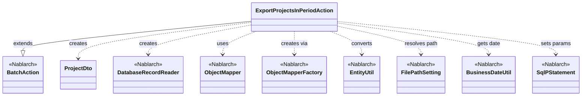
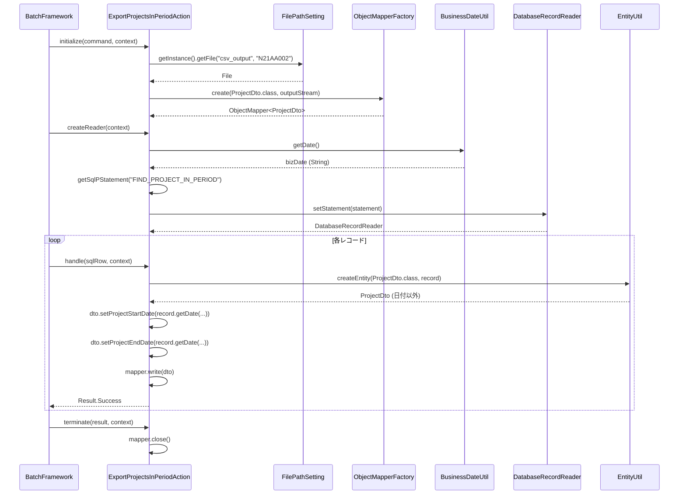

# Code Analysis: ExportProjectsInPeriodAction

**Generated**: 2026-03-12 12:53:47
**Target**: 期間内プロジェクト一覧CSV出力バッチアクション
**Modules**: proman-batch
**Analysis Duration**: 約2分38秒

---

## Overview

`ExportProjectsInPeriodAction` は、業務日付を基準として「プロジェクト開始日 ≤ 業務日付 ≤ プロジェクト終了日」を満たすプロジェクトを検索し、CSV形式でファイル出力する都度起動バッチアクションクラス。

Nablarch の `BatchAction<SqlRow>` を継承し、`initialize`・`createReader`・`handle`・`terminate` の4メソッドで処理を構成する。DB から `DatabaseRecordReader` でレコードを逐次読み込み、`ObjectMapper`（データバインド）でCSV出力する DB to FILE パターンを採用している。

---

## Architecture

### Dependency Graph



**Note**: This diagram uses Mermaid `classDiagram` syntax to show class names and their relationships. Use `--|>` for inheritance (extends/implements) and `..>` for dependencies (uses/creates).

### Component Summary

| Component | Role | Type | Dependencies |
|-----------|------|------|--------------|
| ExportProjectsInPeriodAction | 期間内プロジェクトCSV出力バッチアクション | Action | DatabaseRecordReader, ObjectMapper, FilePathSetting, BusinessDateUtil, EntityUtil |
| ProjectDto | CSV出力用プロジェクト情報DTO | Bean | なし |
| FIND_PROJECT_IN_PERIOD | 期間内プロジェクト検索SQL | SQL | なし |

---

## Flow

### Processing Flow

バッチフレームワークは以下の順序でライフサイクルメソッドを呼び出す：

1. **initialize**: `FilePathSetting` から `csv_output/N21AA002` のファイルパスを取得し、`ObjectMapperFactory.create()` で `ProjectDto` 用の `ObjectMapper` を生成してフィールドに保持する。
2. **createReader**: `BusinessDateUtil.getDate()` で業務日付を取得し、`FIND_PROJECT_IN_PERIOD` SQL のバインド変数（開始日・終了日の両方）にセットした `SqlPStatement` を `DatabaseRecordReader` に設定して返す。
3. **handle**（レコード数分繰り返し）: `EntityUtil.createEntity()` で `SqlRow` を `ProjectDto` に変換後、型変換が必要な日付フィールドは明示的に setter で設定し、`mapper.write(dto)` でCSV出力する。`Result.Success` を返す。
4. **terminate**: `mapper.close()` を呼びバッファをフラッシュしてリソースを解放する。

### Sequence Diagram



---

## Components

### ExportProjectsInPeriodAction

**ファイル**: `.lw/nab-official/v6/nablarch-system-development-guide/Sample_Project/Source_Code/proman-project/proman-batch/src/main/java/com/nablarch/example/proman/batch/project/ExportProjectsInPeriodAction.java`

**役割**: 期間内プロジェクトをDBから読み込みCSV出力するバッチアクション。`BatchAction<SqlRow>` を継承。

**主要メソッド**:

- `initialize(CommandLine, ExecutionContext)` （Line 44-54）: 出力ファイルを `FilePathSetting` で解決し、`ObjectMapper` を初期化。`FileNotFoundException` は `IllegalStateException` でラップして再スロー。
- `createReader(ExecutionContext)` （Line 57-65）: 業務日付を取得して SQL に設定し、`DatabaseRecordReader` を返す。業務日付は開始日・終了日の両バインド変数に同値をセット。
- `handle(SqlRow, ExecutionContext)` （Line 68-75）: `EntityUtil.createEntity()` で DTO 変換後、日付型フィールドのみ個別に setter でフォーマット変換し CSV 出力。
- `terminate(Result, ExecutionContext)` （Line 78-80）: `mapper.close()` でリソース解放。

**依存コンポーネント**: `DatabaseRecordReader`, `ObjectMapper`, `ObjectMapperFactory`, `FilePathSetting`, `BusinessDateUtil`, `EntityUtil`, `SqlPStatement`, `ProjectDto`

---

### ProjectDto

**ファイル**: `.lw/nab-official/v6/nablarch-system-development-guide/Sample_Project/Source_Code/proman-project/proman-batch/src/main/java/com/nablarch/example/proman/batch/project/ProjectDto.java`

**役割**: CSV出力用プロジェクト情報DTO。`@Csv` と `@CsvFormat` アノテーションでCSVフォーマットを宣言的に定義する。

**主要フィールド**: `projectId`, `projectName`, `projectType`, `projectClass`, `projectStartDate`（String型）, `projectEndDate`（String型）, `organizationId`, `clientId`, `projectManager`, `projectLeader`, `note`, `sales`, `versionNo`

**注目点**: `projectStartDate`・`projectEndDate` の setter（Line 138, 154）は `java.util.Date` 型を受け取り `DateUtil.formatDate()` で `yyyy/MM/dd` 形式の String に変換する。これが `ExportProjectsInPeriodAction.handle()` で `EntityUtil` を使わず個別に setter を呼ぶ理由。

---

### FIND_PROJECT_IN_PERIOD (SQL)

**ファイル**: `.lw/nab-official/v6/nablarch-system-development-guide/Sample_Project/Source_Code/proman-project/proman-batch/src/main/resources/com/nablarch/example/proman/batch/project/ExportProjectsInPeriodAction.sql`

**役割**: `project_start_date <= ?` かつ `project_end_date >= ?` の条件で期間内プロジェクトを取得するSQL。バインド変数は業務日付を2回セット（開始条件・終了条件）。結果は `project_start_date`, `project_end_date`, `project_name` の順でソート。

---

## Nablarch Framework Usage

### BatchAction

**クラス**: `nablarch.fw.action.BatchAction`

**説明**: 汎用的なバッチアクションのテンプレートクラス。DBやファイルを入力とし、フレームワーク管理のループで `handle` メソッドを繰り返し呼び出す。

**使用方法**:
```java
public class MyBatchAction extends BatchAction<SqlRow> {
    @Override
    public DataReader<SqlRow> createReader(ExecutionContext context) { ... }

    @Override
    public Result handle(SqlRow record, ExecutionContext context) {
        // 1レコード分の処理
        return new Result.Success();
    }
}
```

**重要ポイント**:
- ✅ **`handle` は1レコード分のみ処理する**: フレームワークがループを管理するため、`handle` 内で自前ループは実装しない
- ⚠️ **`handle` 内でSELECTを再発行しない**: N+1問題につながる。必要なデータは `createReader` の SQL に JOIN で含める
- 💡 **コミット制御はフレームワーク任せ**: 一定件数ごとの自動コミットがフレームワークで行われる

**このコードでの使い方**:
- `BatchAction<SqlRow>` を継承し、`SqlRow` 型でDBレコードを受け取る
- `initialize`/`terminate` でリソース（ObjectMapper）の初期化・解放を行う

**詳細**: [Nablarch Batch Getting Started](../../.claude/skills/nabledge-6/docs/processing-pattern/nablarch-batch/nablarch-batch-getting-started-nablarch-batch.md)

---

### ObjectMapper / ObjectMapperFactory

**クラス**: `nablarch.common.databind.ObjectMapper`, `nablarch.common.databind.ObjectMapperFactory`

**説明**: CSVやTSV、固定長データをJava Beansとして扱う機能を提供する。`@Csv` / `@CsvFormat` アノテーションで宣言的にフォーマットを定義し、`ObjectMapperFactory.create()` でインスタンスを生成する。

**使用方法**:
```java
// initialize でオープン
FileOutputStream outputStream = new FileOutputStream(output);
ObjectMapper<ProjectDto> mapper = ObjectMapperFactory.create(ProjectDto.class, outputStream);

// handle で書き込み
mapper.write(dto);

// terminate でクローズ（必須）
mapper.close();
```

**重要ポイント**:
- ✅ **必ず `close()` を呼ぶ**: バッファをフラッシュしリソースを解放する。呼ばない場合、CSVの末尾データが欠損する
- ⚠️ **`close()` は `terminate()` で行う**: `handle()` ではなく `terminate()` でクローズすることで、全レコード処理後にストリームが閉じられる
- 💡 **アノテーション駆動**: `@Csv`, `@CsvFormat` で列順・ヘッダー名・フォーマットを宣言的に定義できる

**このコードでの使い方**:
- `initialize()` （Line 44-54）で `ObjectMapperFactory.create()` を呼びフィールドに保持
- `handle()` （Line 73）で `mapper.write(dto)` によりレコードごとにCSV出力
- `terminate()` （Line 79）で `mapper.close()` によりリソース解放

**詳細**: [Libraries Data_bind](../../.claude/skills/nabledge-6/docs/component/libraries/libraries-data_bind.md)

---

### DatabaseRecordReader

**クラス**: `nablarch.fw.reader.DatabaseRecordReader`

**説明**: SQLステートメントを使ってDBからレコードを逐次読み込むデータリーダ。`SqlPStatement` をセットして使用する。

**使用方法**:
```java
DatabaseRecordReader reader = new DatabaseRecordReader();
SqlPStatement statement = getSqlPStatement("FIND_PROJECT_IN_PERIOD");
statement.setDate(1, bizDate);
statement.setDate(2, bizDate);
reader.setStatement(statement);
return reader;
```

**重要ポイント**:
- ✅ **`createReader` で返す**: フレームワークがリーダのライフサイクルを管理する
- 💡 **`SqlRow` で受け取る**: `BatchAction<SqlRow>` と組み合わせることで型安全にDBレコードを扱える

**このコードでの使い方**:
- `createReader()` （Line 57-65）で業務日付を両バインド変数にセットして返す

**詳細**: [Nablarch Batch Architecture](../../.claude/skills/nabledge-6/docs/processing-pattern/nablarch-batch/nablarch-batch-architecture.md)

---

### BusinessDateUtil / FilePathSetting

**クラス**: `nablarch.core.date.BusinessDateUtil`, `nablarch.core.util.FilePathSetting`

**説明**: `BusinessDateUtil.getDate()` はシステムに設定された業務日付を文字列（`yyyyMMdd`）で返す。`FilePathSetting` はシステム設定から論理ベースパス名でファイルパスを解決する。

**使用方法**:
```java
// 業務日付取得
String bizDateStr = BusinessDateUtil.getDate();
Date bizDate = new Date(DateUtil.getDate(bizDateStr).getTime());

// ファイルパス解決
FilePathSetting fps = FilePathSetting.getInstance();
File output = fps.getFile("csv_output", OUTPUT_FILE_NAME);
```

**重要ポイント**:
- ✅ **`BusinessDateUtil.getDate()` はシステム業務日付を使う**: `java.util.Date` ではなく業務カレンダー基準の日付を返す
- 💡 **`FilePathSetting` で環境依存パスを排除**: 物理パスをコードに書かず、設定ファイルで管理できる

**このコードでの使い方**:
- `createReader()` （Line 60）で業務日付を `SqlPStatement` のバインド変数にセット
- `initialize()` （Line 45-47）で出力ファイルパスを `FilePathSetting` で解決

---

## References

### Source Files


### Knowledge Base (Nabledge-6)

- [Nablarch Batch Getting Started Nablarch Batch](../../.claude/skills/nabledge-6/docs/processing-pattern/nablarch-batch/nablarch-batch-getting-started-nablarch-batch.md)
- [Nablarch Batch Nablarch_batch_pessimistic_lock](../../.claude/skills/nabledge-6/docs/processing-pattern/nablarch-batch/nablarch-batch-nablarch_batch_pessimistic_lock.md)
- [Web Application Getting Started Project Download](../../.claude/skills/nabledge-6/docs/processing-pattern/web-application/web-application-getting-started-project-download.md)
- [Nablarch Batch Architecture](../../.claude/skills/nabledge-6/docs/processing-pattern/nablarch-batch/nablarch-batch-architecture.md)
- [Libraries Data_bind](../../.claude/skills/nabledge-6/docs/component/libraries/libraries-data_bind.md)

### Official Documentation


- [Architecture](https://nablarch.github.io/docs/LATEST/doc/application_framework/application_framework/batch/nablarch_batch/architecture.html)
- [AsyncMessageSendAction](https://nablarch.github.io/docs/LATEST/javadoc/nablarch/fw/messaging/action/AsyncMessageSendAction.html)
- [BatchAction](https://nablarch.github.io/docs/LATEST/javadoc/nablarch/fw/action/BatchAction.html)
- [BeanUtil](https://nablarch.github.io/docs/LATEST/javadoc/nablarch/core/beans/BeanUtil.html)
- [CsvDataBindConfig](https://nablarch.github.io/docs/LATEST/javadoc/nablarch/common/databind/csv/CsvDataBindConfig.html)
- [CsvFormat](https://nablarch.github.io/docs/LATEST/javadoc/nablarch/common/databind/csv/CsvFormat.html)
- [Csv](https://nablarch.github.io/docs/LATEST/javadoc/nablarch/common/databind/csv/Csv.html)
- [Data Bind](https://nablarch.github.io/docs/LATEST/doc/application_framework/application_framework/libraries/data_io/data_bind.html)
- [DataBindConfig](https://nablarch.github.io/docs/LATEST/javadoc/nablarch/common/databind/DataBindConfig.html)
- [DataReader](https://nablarch.github.io/docs/LATEST/javadoc/nablarch/fw/DataReader.html)
- [DatabaseRecordReader](https://nablarch.github.io/docs/LATEST/javadoc/nablarch/fw/reader/DatabaseRecordReader.html)
- [DispatchHandler](https://nablarch.github.io/docs/LATEST/javadoc/nablarch/fw/handler/DispatchHandler.html)
- [Field](https://nablarch.github.io/docs/LATEST/javadoc/nablarch/common/databind/fixedlength/Field.html)
- [FileBatchAction](https://nablarch.github.io/docs/LATEST/javadoc/nablarch/fw/action/FileBatchAction.html)
- [FileDataReader](https://nablarch.github.io/docs/LATEST/javadoc/nablarch/fw/reader/FileDataReader.html)
- [FileResponse](https://nablarch.github.io/docs/LATEST/javadoc/nablarch/common/web/download/FileResponse.html)
- [FixedLengthDataBindConfigBuilder](https://nablarch.github.io/docs/LATEST/javadoc/nablarch/common/databind/fixedlength/FixedLengthDataBindConfigBuilder.html)
- [FixedLengthDataBindConfig](https://nablarch.github.io/docs/LATEST/javadoc/nablarch/common/databind/fixedlength/FixedLengthDataBindConfig.html)
- [FixedLength](https://nablarch.github.io/docs/LATEST/javadoc/nablarch/common/databind/fixedlength/FixedLength.html)
- [HttpResponse](https://nablarch.github.io/docs/LATEST/javadoc/nablarch/fw/web/HttpResponse.html)
- [Index](https://nablarch.github.io/docs/LATEST/doc/application_framework/application_framework/batch/nablarch_batch/getting_started/nablarch_batch/index.html)
- [Index](https://nablarch.github.io/docs/LATEST/doc/application_framework/application_framework/web/getting_started/project_download/index.html)
- [LineNumber](https://nablarch.github.io/docs/LATEST/javadoc/nablarch/common/databind/LineNumber.html)
- [MultiLayoutConfig.RecordIdentifier](https://nablarch.github.io/docs/LATEST/javadoc/nablarch/common/databind/fixedlength/MultiLayoutConfig.RecordIdentifier.html)
- [MultiLayout](https://nablarch.github.io/docs/LATEST/javadoc/nablarch/common/databind/fixedlength/MultiLayout.html)
- [Nablarch Batch Pessimistic Lock](https://nablarch.github.io/docs/LATEST/doc/application_framework/application_framework/batch/nablarch_batch/feature_details/nablarch_batch_pessimistic_lock.html)
- [NoInputDataBatchAction](https://nablarch.github.io/docs/LATEST/javadoc/nablarch/fw/action/NoInputDataBatchAction.html)
- [ObjectMapperFactory](https://nablarch.github.io/docs/LATEST/javadoc/nablarch/common/databind/ObjectMapperFactory.html)
- [ObjectMapper](https://nablarch.github.io/docs/LATEST/javadoc/nablarch/common/databind/ObjectMapper.html)
- [PartInfo](https://nablarch.github.io/docs/LATEST/javadoc/nablarch/fw/web/upload/PartInfo.html)
- [ProcessStopHandler.ProcessStop](https://nablarch.github.io/docs/LATEST/javadoc/nablarch/fw/handler/ProcessStopHandler.ProcessStop.html)
- [Result](https://nablarch.github.io/docs/LATEST/javadoc/nablarch/fw/Result.html)
- [ResumeDataReader](https://nablarch.github.io/docs/LATEST/javadoc/nablarch/fw/reader/ResumeDataReader.html)
- [StatusCodeConvertHandler](https://nablarch.github.io/docs/LATEST/javadoc/nablarch/fw/handler/StatusCodeConvertHandler.html)
- [UniversalDao](https://nablarch.github.io/docs/LATEST/javadoc/nablarch/common/dao/UniversalDao.html)
- [ValidatableFileDataReader](https://nablarch.github.io/docs/LATEST/javadoc/nablarch/fw/reader/ValidatableFileDataReader.html)

---

**Note**: This documentation was generated by the code-analysis workflow of the nabledge-6 skill.
