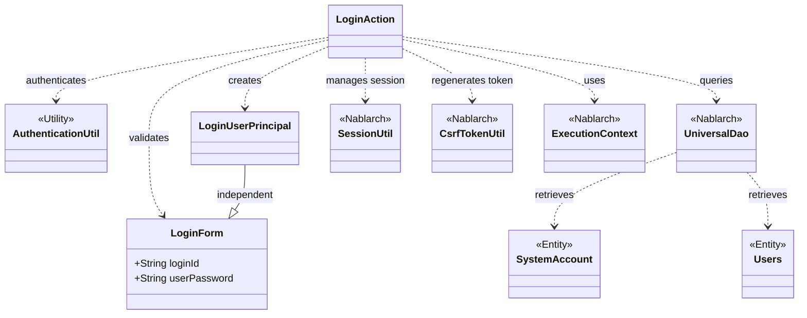
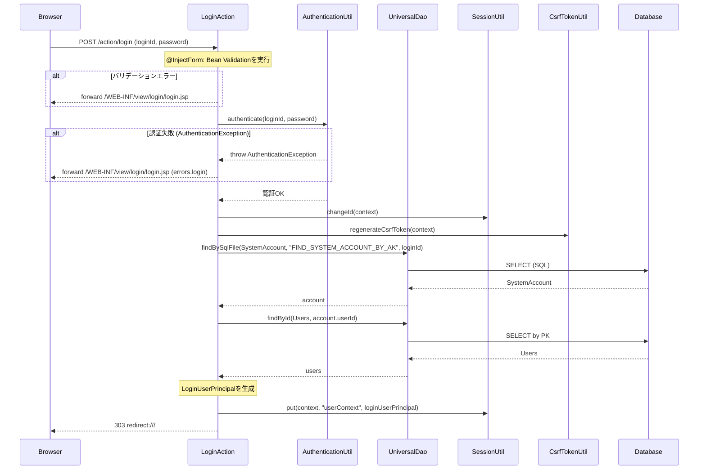

# Code Analysis: LoginAction

**Generated**: 2026-03-12 12:58:17
**Target**: ログイン・ログアウト認証処理アクション
**Modules**: proman-web
**Analysis Duration**: 約3分1秒

---

## Overview

`LoginAction` はプロジェクト管理アプリケーション（proman-web）のログイン・ログアウト機能を担うアクションクラスである。3つのメソッドを持つ：ログイン画面表示（`index`）、ログイン処理（`login`）、ログアウト処理（`logout`）。

ログイン処理では、`@InjectForm` によるBean Validationを実行後、`AuthenticationUtil` でパスワード認証を行い、認証成功時にセッションIDの変更・CSRFトークン再生成・ユーザ情報のセッション保存を実施する。ログアウト処理ではセッション全体を破棄する。`SystemAccount` と `Users` エンティティはNablarch `UniversalDao` を通じてDBから取得される。

---

## Architecture

### Dependency Graph



**Note**: This diagram uses Mermaid `classDiagram` syntax to show class names and their relationships. Use `--|>` for inheritance (extends/implements) and `..>` for dependencies (uses/creates).

### Component Summary

| Component | Role | Type | Dependencies |
|-----------|------|------|--------------|
| LoginAction | ログイン・ログアウト処理の制御 | Action | LoginForm, AuthenticationUtil, UniversalDao, SessionUtil, CsrfTokenUtil, ExecutionContext |
| LoginForm | ログイン入力値のバリデーション | Form | なし |
| AuthenticationUtil | パスワード認証ロジックのユーティリティ | Utility | SystemRepository, PasswordAuthenticator |
| LoginUserPrincipal | ログインユーザ情報の保持 | DTO/Context | なし |
| SystemAccount | システムアカウントエンティティ | Entity | なし |
| Users | ユーザエンティティ | Entity | なし |
| UniversalDao | DBアクセス（検索） | Nablarch | Database |
| SessionUtil | セッション管理（changeId, put, invalidate） | Nablarch | SessionStore |
| CsrfTokenUtil | CSRFトークン再生成 | Nablarch | SessionStore |

---

## Flow

### Processing Flow

**ログイン処理（`login`メソッド）**:

1. `@InjectForm(form = LoginForm.class)` により、リクエストパラメータのバリデーションが自動実行される。バリデーションエラー時は `@OnError` によりログイン画面へフォワードされる。
2. バリデーション成功後、リクエストスコープから `LoginForm` を取得する。
3. `AuthenticationUtil.authenticate()` でパスワード認証を実行。`AuthenticationException` がスローされた場合は `ApplicationException` に変換してエラーメッセージを表示する。
4. 認証成功後、`SessionUtil.changeId()` でセッションIDを変更（セッションハイジャック対策）。
5. `CsrfTokenUtil.regenerateCsrfToken()` でCSRFトークンを再生成（セッションID変更後のCSRFトークン整合性維持）。
6. `createLoginUserContext()` で `UniversalDao` を使用して `SystemAccount` と `Users` をDBから取得し、`LoginUserPrincipal` を生成する。
7. `SessionUtil.put()` でユーザ情報をセッションに格納し、303リダイレクトでトップ画面へ遷移する。

**ログアウト処理（`logout`メソッド）**:

1. `SessionUtil.invalidate()` でセッションストア全体を破棄する。
2. 303リダイレクトでログイン画面へ遷移する。

### Sequence Diagram



---

## Components

### LoginAction

**ファイル**: [LoginAction.java](../../.lw/nab-official/v6/nablarch-system-development-guide/Sample_Project/Source_Code/proman-project/proman-web/src/main/java/com/nablarch/example/proman/web/login/LoginAction.java)

**役割**: システム利用者の認証（ログイン・ログアウト）を制御するアクションクラス。

**主要メソッド**:

- `index(HttpRequest, ExecutionContext)` [L38-40]: ログイン画面を表示する。単純にJSPパスを返す。
- `login(HttpRequest, ExecutionContext)` [L49-71]: ログイン処理の中心。`@InjectForm`・`@OnError` を使用。認証成功後にセッションIDを変更してユーザ情報をセッションに格納する。
- `logout(HttpRequest, ExecutionContext)` [L102-106]: セッション全体を破棄してログイン画面にリダイレクト。
- `createLoginUserContext(String loginId)` [L79-93]: プライベートメソッド。`UniversalDao` でDBからユーザ情報を取得して `LoginUserPrincipal` を構築する。

**依存コンポーネント**: `LoginForm`, `AuthenticationUtil`, `LoginUserPrincipal`, `SystemAccount`, `Users`, `UniversalDao`, `SessionUtil`, `CsrfTokenUtil`, `ExecutionContext`

---

### LoginForm

**ファイル**: [LoginForm.java](../../.lw/nab-official/v6/nablarch-system-development-guide/Sample_Project/Source_Code/proman-project/proman-web/src/main/java/com/nablarch/example/proman/web/login/LoginForm.java)

**役割**: ログイン画面の入力値（ログインID・パスワード）を受け取り、Bean Validationでバリデーションを実行するフォームクラス。

**主要フィールド**:
- `loginId` [L22-23]: `@Required`, `@Domain("loginId")` アノテーションでバリデーション設定。
- `userPassword` [L26-28]: `@Required`, `@Domain("userPassword")` アノテーション。

**依存コンポーネント**: なし（`java.io.Serializable` 実装）

---

### AuthenticationUtil

**ファイル**: [AuthenticationUtil.java](../../.lw/nab-official/v6/nablarch-system-development-guide/Sample_Project/Source_Code/proman-project/proman-web/src/main/java/com/nablarch/example/proman/web/common/authentication/AuthenticationUtil.java)

**役割**: 認証処理の静的ユーティリティクラス。`SystemRepository` から `PasswordAuthenticator` を取得して認証委譲する。

**主要メソッド**:
- `authenticate(String userId, String password)` [L62-66]: `SystemRepository.get("authenticator")` で `PasswordAuthenticator` を取得し `authenticate()` を委譲。`AuthenticationFailedException`, `UserIdLockedException`, `PasswordExpiredException` をスローする可能性がある（`LoginAction` では全て `AuthenticationException` の親クラスとしてまとめてキャッチ）。

---

### LoginUserPrincipal

**ファイル**: [LoginUserPrincipal.java](../../.lw/nab-official/v6/nablarch-system-development-guide/Sample_Project/Source_Code/proman-project/proman-web/src/main/java/com/nablarch/example/proman/web/common/authentication/context/LoginUserPrincipal.java)

**役割**: ログインユーザの情報（userId, kanjiName, pmFlag, lastLoginDateTime）を保持するDTO。セッションに格納されるため `Serializable` を実装。

---

## Nablarch Framework Usage

### UniversalDao

**クラス**: `nablarch.common.dao.UniversalDao`

**説明**: SQLファイルやエンティティクラスを使ってDBアクセスを行うNablarchの汎用DAOクラス。

**使用方法**:
```java
// SQLファイルを使った一意検索
SystemAccount account = UniversalDao.findBySqlFile(
    SystemAccount.class,
    "FIND_SYSTEM_ACCOUNT_BY_AK",
    new Object[]{loginId}
);

// 主キーによる検索
Users users = UniversalDao.findById(Users.class, account.getUserId());
```

**重要ポイント**:
- ✅ **SQLファイル名の命名**: SQLファイルはエンティティクラス名に対応したディレクトリ（または同一パッケージ）に配置する。`findBySqlFile` の第2引数はSQL ID。
- ⚠️ **NoDataException**: 検索結果が0件の場合 `NoDataException` がスローされる。`findBySqlFile` で単一レコードを期待する場合は必ず考慮すること。
- 💡 **型安全**: エンティティクラスを指定することで、DBの結果が型安全にマッピングされる。

**このコードでの使い方**:
- `createLoginUserContext()` [L80-83] で `findBySqlFile` を使ってログインIDからシステムアカウントを検索。
- `findById` [L83] でユーザIDからユーザ情報を取得。

**詳細**: [Libraries Session_store](../../.claude/skills/nabledge-6/docs/component/libraries/libraries-session_store.md)

---

### SessionUtil

**クラス**: `nablarch.common.web.session.SessionUtil`

**説明**: セッションストアへのアクセスを提供するユーティリティクラス。ログイン・ログアウト処理でのセッション管理に使用される。

**使用方法**:
```java
// ログイン時: セッションIDの変更（セッションハイジャック対策）
SessionUtil.changeId(context);

// セッションへの値の格納
SessionUtil.put(context, "userContext", loginUserPrincipal);

// セッションからの値の取得
LoginUserPrincipal userContext = SessionUtil.get(context, "userContext");

// ログアウト時: セッション全体の破棄
SessionUtil.invalidate(context);
```

**重要ポイント**:
- ✅ **ログイン時はセッションIDを変更する**: `changeId()` を呼んでセッションハイジャックを防ぐ。認証成功直後に必ず実施する。
- ✅ **CSRFトークン再生成とセット**: セッションIDを変更した場合は `CsrfTokenUtil.regenerateCsrfToken()` も併せて呼ぶこと（CSRFトークン検証ハンドラを使用している場合）。
- ⚠️ **ログアウト時は `invalidate()` を使う**: セッション全体を破棄するため、ログアウト処理では `delete()` ではなく `invalidate()` を使用する。
- 💡 **認証情報はDBストアに**: セキュリティ上、認証情報を含むセッションデータはDBストアの使用が推奨される。

**このコードでの使い方**:
- `login()` [L65]: `changeId()` でセッションIDを変更。
- `login()` [L69]: `put()` で `LoginUserPrincipal` を `"userContext"` キーでセッションに格納。
- `logout()` [L103]: `invalidate()` でセッション全体を破棄。

**詳細**: [Libraries Session_store](../../.claude/skills/nabledge-6/docs/component/libraries/libraries-session_store.md)

---

### CsrfTokenUtil

**クラス**: `nablarch.common.web.csrf.CsrfTokenUtil`

**説明**: CSRFトークンを管理するユーティリティクラス。セッションIDの変更後にCSRFトークンを再生成する。

**使用方法**:
```java
// CSRFトークンの再生成（セッションIDを変更した後に呼ぶ）
CsrfTokenUtil.regenerateCsrfToken(context);
```

**重要ポイント**:
- ✅ **セッションID変更後に必ず再生成**: `SessionUtil.changeId()` の後に `regenerateCsrfToken()` を呼ばないと、CSRFトークン検証が失敗する（セッションIDとCSRFトークンの整合性が崩れるため）。
- ⚠️ **CSRFトークン検証ハンドラが前提**: `csrf_token_verification_handler` を使用している場合にのみ必要。

**このコードでの使い方**:
- `login()` [L66]: `SessionUtil.changeId()` の直後に `regenerateCsrfToken()` を呼んでCSRFトークンを再生成。

**詳細**: [Libraries Session_store](../../.claude/skills/nabledge-6/docs/component/libraries/libraries-session_store.md)

---

### @InjectForm / @OnError インターセプター

**クラス**: `nablarch.common.web.interceptor.InjectForm`, `nablarch.fw.web.interceptor.OnError`

**説明**: `@InjectForm` はリクエストパラメータに対してBean Validationを実行し、フォームオブジェクトをリクエストスコープに格納するインターセプター。`@OnError` はバリデーションエラー（`ApplicationException`）時の遷移先を定義する。

**使用方法**:
```java
@OnError(type = ApplicationException.class, path = "/WEB-INF/view/login/login.jsp")
@InjectForm(form = LoginForm.class)
public HttpResponse login(HttpRequest request, ExecutionContext context) {
    LoginForm form = context.getRequestScopedVar("form");
    // formを使った業務処理
}
```

**重要ポイント**:
- ✅ **バリデーション成功後にリクエストスコープからフォームを取得**: `@InjectForm` 成功後、`context.getRequestScopedVar("form")` でフォームオブジェクトを取得する。
- ⚠️ **`@OnError` と組み合わせる**: バリデーションエラー時の遷移先を `@OnError` で必ず指定する。指定がないと例外がそのまま上位に伝播する。
- 💡 **フォームクラスはHTMLフォーム単位で作成**: 登録画面と更新画面で入力項目が同じでも、HTML フォーム単位で別フォームクラスを作成することが推奨される。

**このコードでの使い方**:
- `login()` [L49-51]: `@OnError` でエラー時にログイン画面へフォワード、`@InjectForm(form = LoginForm.class)` でバリデーションを実行。
- バリデーション後 [L53]: `context.getRequestScopedVar("form")` で `LoginForm` を取得。

**詳細**: [Handlers InjectForm](../../.claude/skills/nabledge-6/docs/component/handlers/handlers-InjectForm.md)

---

## References

### Source Files

- [LoginAction.java](../../.lw/nab-official/v6/nablarch-system-development-guide/Sample_Project/Source_Code/proman-project/proman-web/src/main/java/com/nablarch/example/proman/web/login/LoginAction.java)
- [LoginForm.java](../../.lw/nab-official/v6/nablarch-system-development-guide/Sample_Project/Source_Code/proman-project/proman-web/src/main/java/com/nablarch/example/proman/web/login/LoginForm.java)
- [AuthenticationUtil.java](../../.lw/nab-official/v6/nablarch-system-development-guide/Sample_Project/Source_Code/proman-project/proman-web/src/main/java/com/nablarch/example/proman/web/common/authentication/AuthenticationUtil.java)
- [LoginUserPrincipal.java](../../.lw/nab-official/v6/nablarch-system-development-guide/Sample_Project/Source_Code/proman-project/proman-web/src/main/java/com/nablarch/example/proman/web/common/authentication/context/LoginUserPrincipal.java)

### Knowledge Base (Nabledge-6)

- [Libraries Session_store](../../.claude/skills/nabledge-6/docs/component/libraries/libraries-session_store.md)
- [Handlers InjectForm](../../.claude/skills/nabledge-6/docs/component/handlers/handlers-InjectForm.md)

### Official Documentation

- [Session Store](https://nablarch.github.io/docs/LATEST/doc/application_framework/application_framework/libraries/session_store.html)
- [SessionUtil](https://nablarch.github.io/docs/LATEST/javadoc/nablarch/common/web/session/SessionUtil.html)
- [InjectForm](https://nablarch.github.io/docs/LATEST/doc/application_framework/application_framework/handlers/web_interceptor/InjectForm.html)
- [InjectForm (Javadoc)](https://nablarch.github.io/docs/LATEST/javadoc/nablarch/common/web/interceptor/InjectForm.html)
- [OnError](https://nablarch.github.io/docs/LATEST/javadoc/nablarch/fw/web/interceptor/OnError.html)
- [ExecutionContext](https://nablarch.github.io/docs/LATEST/javadoc/nablarch/fw/ExecutionContext.html)
- [SessionKeyNotFoundException](https://nablarch.github.io/docs/LATEST/javadoc/nablarch/common/web/session/SessionKeyNotFoundException.html)

---

**Note**: This documentation was generated by the code-analysis workflow of the nabledge-6 skill.
