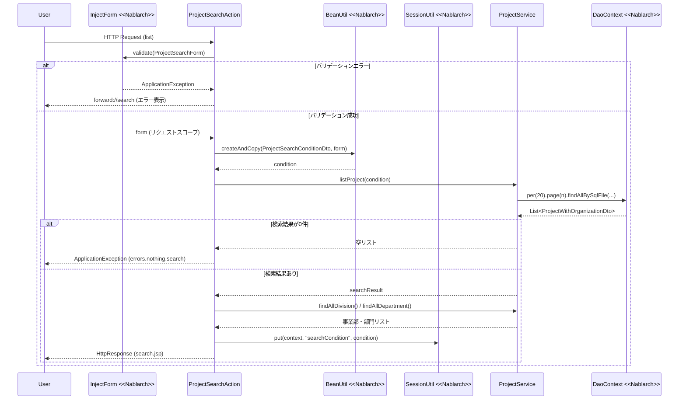

# Code Analysis: ProjectSearchAction

**Generated**: 2026-03-12 13:03:48
**Target**: プロジェクト検索・詳細表示アクション
**Modules**: proman-web
**Analysis Duration**: 約3分8秒

---

## Overview

`ProjectSearchAction` は proman-web モジュールにおけるプロジェクト検索機能の業務アクションクラスである。4つのメソッドを提供し、プロジェクトの検索画面初期表示・一覧検索・詳細画面への遷移・詳細画面から一覧への復帰を担う。

主な構成は以下のとおり：
- `@InjectForm` / `@OnError` アノテーションによる宣言的なバリデーションとエラーハンドリング
- `BeanUtil` によるフォームから検索条件DTOへの値変換
- `SessionUtil` による検索条件のセッション保持（詳細画面からの復帰に利用）
- `ProjectService` に DB アクセスを委譲し、UniversalDao 経由でページング付きの検索を実行

---

## Architecture

### Dependency Graph

```mermaid
classDiagram
    class ProjectSearchAction
    class ProjectSearchForm {
        <<Form>>
    }
    class ProjectSearchConditionDto {
        <<DTO>>
    }
    class ProjectService
    class ProjectDetailInitialForm {
        <<Form>>
    }
    class ProjectWithOrganizationDto {
        <<DTO>>
    }
    class DaoContext {
        <<Nablarch>>
    }
    class SessionUtil {
        <<Nablarch>>
    }
    class BeanUtil {
        <<Nablarch>>
    }
    class ExecutionContext {
        <<Nablarch>>
    }
    class ApplicationException {
        <<Nablarch>>
    }

    ProjectSearchForm --|> SearchFormBase : extends
    ProjectSearchForm ..|> Serializable : implements
    ProjectSearchConditionDto ..|> Serializable : implements
    ProjectDetailInitialForm ..|> Serializable : implements
    ProjectWithOrganizationDto --|> Project : extends

    ProjectSearchAction ..> ProjectSearchForm : validates
    ProjectSearchAction ..> ProjectDetailInitialForm : validates
    ProjectSearchAction ..> ProjectSearchConditionDto : creates
    ProjectSearchAction ..> ProjectService : delegates to
    ProjectSearchAction ..> SessionUtil : stores/retrieves
    ProjectSearchAction ..> BeanUtil : converts
    ProjectSearchAction ..> ExecutionContext : uses
    ProjectSearchAction ..> ApplicationException : throws

    ProjectService ..> DaoContext : queries
    ProjectService ..> ProjectWithOrganizationDto : returns
```



**Note**: This diagram uses Mermaid `classDiagram` syntax to show class names and their relationships. Use `--|>` for inheritance (extends/implements) and `..>` for dependencies (uses/creates).

### Component Summary

| Component | Role | Type | Dependencies |
|-----------|------|------|--------------|
| ProjectSearchAction | プロジェクト検索・詳細表示の業務アクション | Action | ProjectSearchForm, ProjectDetailInitialForm, ProjectSearchConditionDto, ProjectService, SessionUtil, BeanUtil, ExecutionContext |
| ProjectSearchForm | 検索条件の入力値バリデーション用フォーム | Form | SearchFormBase, DateRelationUtil, MoneyRelationUtil |
| ProjectSearchConditionDto | 検索条件を保持するDTO（DB検索に使用） | DTO | なし |
| ProjectDetailInitialForm | 詳細画面初期表示用フォーム（プロジェクトID受け取り） | Form | なし |
| ProjectService | DB アクセスを集約したサービスクラス | Service | DaoContext (UniversalDao) |
| ProjectWithOrganizationDto | プロジェクト＋組織名を含む検索結果DTO | DTO | Project (Entity) |

---

## Flow

### Processing Flow

**一覧検索フロー（`list` メソッド）**:

1. `@InjectForm` が `ProjectSearchForm` にリクエストパラメータをバインドし、Bean Validation を実行する
2. バリデーションエラー時は `@OnError` により `forward://search` へ内部フォワードする
3. バリデーション成功時、リクエストスコープから `ProjectSearchForm` を取得する
4. ページ番号が未設定の場合（初回検索）は `"1"` をセットする
5. `BeanUtil.createAndCopy` でフォームの値を `ProjectSearchConditionDto` へ型変換しながらコピーする
6. `ProjectService#listProject` を呼び出し、UniversalDao のページング機能でプロジェクト一覧を取得する
7. 検索結果が0件の場合は `ApplicationException` をスロー（`errors.nothing.search` メッセージ）
8. 検索結果と組織マスタ（事業部・部門）をリクエストスコープにセットする
9. 次回の「詳細から戻る」に備えて検索条件を `SessionUtil` でセッションに保存する

**詳細から戻るフロー（`backToList` メソッド）**:

1. セッションから検索条件 `ProjectSearchConditionDto` を取り出す
2. 保存済み条件で再検索を実行する
3. フォームに値を復元するため `BeanUtil.createAndCopy` で `ProjectSearchForm` を生成してリクエストスコープにセットする
4. 組織マスタをセットして検索画面に戻る

### Sequence Diagram



---

## Components

### ProjectSearchAction

**ファイル**: `.lw/nab-official/v6/nablarch-system-development-guide/Sample_Project/Source_Code/proman-project/proman-web/src/main/java/com/nablarch/example/proman/web/project/ProjectSearchAction.java`

**役割**: プロジェクト検索機能の起点となる業務アクション。4つのリクエスト処理メソッドを提供する。

**主要メソッド**:

- `search(HttpRequest, ExecutionContext)` (L35-40): 検索画面の初期表示。セッションの検索条件をクリアして空の検索フォームを表示する
- `list(HttpRequest, ExecutionContext)` (L49-69): 一覧検索の実行。`@InjectForm` でバリデーション後、`BeanUtil` でDTO変換し `ProjectService#listProject` に委譲する
- `backToList(HttpRequest, ExecutionContext)` (L79-91): 詳細画面からの復帰。セッション保存済み条件で再検索し、入力値をフォームに復元する
- `detail(HttpRequest, ExecutionContext)` (L101-109): 詳細画面表示。`ProjectDetailInitialForm` からプロジェクトIDを受け取り詳細情報を取得する

**依存コンポーネント**: ProjectSearchForm, ProjectDetailInitialForm, ProjectSearchConditionDto, ProjectService, SessionUtil, BeanUtil, ExecutionContext, ApplicationException, MessageUtil

---

### ProjectSearchForm

**ファイル**: `.lw/nab-official/v6/nablarch-system-development-guide/Sample_Project/Source_Code/proman-project/proman-web/src/main/java/com/nablarch/example/proman/web/project/ProjectSearchForm.java`

**役割**: 検索条件の入力値を受け取るフォームクラス。`@Domain` アノテーションによるドメイン単位のバリデーションと、FROM/TO の相関バリデーションを持つ。

**主要メソッド**:

- `isValidProjectSalesRange()` (L295-297): 売上高のFROM/TO相関チェック（`MoneyRelationUtil` 利用）
- `isValidProjectStartDateRange()` (L307-309): 開始日のFROM/TO相関チェック（`DateRelationUtil` 利用）
- `isValidProjectEndDateRange()` (L319-321): 終了日のFROM/TO相関チェック（`DateRelationUtil` 利用）

**依存コンポーネント**: SearchFormBase, DateRelationUtil, MoneyRelationUtil

**実装上のポイント**: プロジェクト種別・分類は配列入力を内部クラス（`ProjectType`, `ProjectClass`）のリストとして管理し、`@Valid` で個要素にバリデーションを適用している。

---

### ProjectSearchConditionDto

**ファイル**: `.lw/nab-official/v6/nablarch-system-development-guide/Sample_Project/Source_Code/proman-project/proman-web/src/main/java/com/nablarch/example/proman/web/project/ProjectSearchConditionDto.java`

**役割**: UniversalDao の SQL 検索に渡す検索条件を保持するDTO。フォームとは型が異なる（例: 日付は `java.sql.Date`、金額は `Integer`）ため `BeanUtil` による型変換が必要。

**依存コンポーネント**: なし（純粋なデータオブジェクト）

---

### ProjectService

**ファイル**: `.lw/nab-official/v6/nablarch-system-development-guide/Sample_Project/Source_Code/proman-project/proman-web/src/main/java/com/nablarch/example/proman/web/project/ProjectService.java`

**役割**: プロジェクト関連のDB操作を集約したサービスクラス。`DaoContext`（UniversalDao）を内部に保持し、SQL ファイル ID を指定してクエリを実行する。

**主要メソッド**:

- `listProject(ProjectSearchConditionDto)` (L99-104): ページング付きプロジェクト一覧検索。`per(20L).page(n).findAllBySqlFile(...)` でページング制御
- `findProjectByIdWithOrganization(Integer)` (L112-116): プロジェクトIDで詳細1件取得
- `findAllDivision()` / `findAllDepartment()` (L50-61): 組織マスタ全件取得

**依存コンポーネント**: DaoContext, Organization (Entity), Project (Entity), ProjectWithOrganizationDto

---

### ProjectDetailInitialForm

**ファイル**: `.lw/nab-official/v6/nablarch-system-development-guide/Sample_Project/Source_Code/proman-project/proman-web/src/main/java/com/nablarch/example/proman/web/project/ProjectDetailInitialForm.java`

**役割**: 詳細画面表示に必要なプロジェクトIDを受け取る最小構成のフォーム。`@Required` と `@Domain("projectId")` で入力検証する。

---

## Nablarch Framework Usage

### InjectForm

**クラス**: `nablarch.common.web.interceptor.InjectForm`

**説明**: 業務アクションのメソッドに付与するアノテーション。指定したフォームクラスにリクエストパラメータをバインドし、Bean Validation を実行する。バリデーション成功時にリクエストスコープにフォームオブジェクトを格納する。

**使用方法**:
```java
@InjectForm(form = ProjectSearchForm.class, prefix = "form")
@OnError(type = ApplicationException.class, path = "forward://search")
public HttpResponse list(HttpRequest request, ExecutionContext context) {
    ProjectSearchForm form = context.getRequestScopedVar("form");
    // ...
}
```

**重要ポイント**:
- ✅ **`@OnError` とセットで使う**: バリデーションエラー時のフォワード先を `@OnError` で指定する必要がある
- ⚠️ **`name` 未指定時はキー名が `"form"`**: リクエストスコープからの取り出しキーは `name` 属性で変更可能。デフォルトは `"form"`
- 💡 **バリデーション対象はプレフィックス一致**: `prefix = "form"` を指定すると `form.xxx` というパラメータのみがバリデーション対象になる

**このコードでの使い方**:
- `list` メソッド (L49): `prefix = "form"` で `ProjectSearchForm` にバインド・バリデーション
- `detail` メソッド (L101): `ProjectDetailInitialForm` に `projectId` をバインド・バリデーション
- バリデーション後は `context.getRequestScopedVar("form")` でフォームを取得 (L53, L103)

**詳細**: [Handlers InjectForm](../../.claude/skills/nabledge-6/docs/component/handlers/handlers-InjectForm.md)

---

### OnError

**クラス**: `nablarch.fw.web.interceptor.OnError`

**説明**: 業務アクションのメソッドで指定した例外が発生した場合に、指定パスへフォワードまたはリダイレクトするアノテーション。`@InjectForm` と組み合わせてバリデーションエラー時の遷移先を制御する。

**使用方法**:
```java
@OnError(type = ApplicationException.class, path = "forward://search")
public HttpResponse list(HttpRequest request, ExecutionContext context) {
    // ...
}
```

**重要ポイント**:
- ✅ **`forward://メソッド名` で内部フォワード**: 同一アクションの別メソッドに内部フォワードできる。エラー時に初期表示データを再取得するパターンに有効
- ⚠️ **フォワード先でリクエストスコープが引き継がれる**: バリデーションエラー時もフォームオブジェクトはリクエストスコープに残るため、入力値を再表示できる
- 🎯 **`ApplicationException` 以外も指定可能**: `SessionKeyNotFoundException` など他の例外にも適用できる

**このコードでの使い方**:
- `list` メソッド (L50): `ApplicationException` 発生時に `forward://search` へフォワード（バリデーションエラー時に検索初期表示画面へ戻る）
- `backToList` メソッド (L78): 同様に `forward://search` へフォワード

**詳細**: [Handlers On Error](../../.claude/skills/nabledge-6/docs/component/handlers/handlers-on_error.md)

---

### SessionUtil

**クラス**: `nablarch.common.web.session.SessionUtil`

**説明**: セッションストアへの格納・取得・削除を行うユーティリティクラス。`ExecutionContext` を介してセッション操作を行う。

**使用方法**:
```java
// 格納
SessionUtil.put(context, "searchCondition", condition);

// 取得
ProjectSearchConditionDto condition = SessionUtil.get(context, "searchCondition");

// 削除
SessionUtil.delete(context, "searchCondition");
```

**重要ポイント**:
- ✅ **セッションに格納するオブジェクトは `Serializable` を実装する**: セッションストアの種類によってはシリアライズが必要
- ⚠️ **キーが存在しない場合は `SessionKeyNotFoundException`**: 不正な画面遷移（ブラウザ「戻る」等）の場合に発生する。`@OnError` で捕捉してエラーページに誘導する
- 💡 **画面間の状態引き継ぎに使用**: 詳細画面から検索画面へ戻る際の検索条件復元など、リクエストをまたぐ状態の保持に利用する

**このコードでの使い方**:
- `search` メソッド (L36): `SessionUtil.delete` で検索条件をクリア（検索画面の初期表示時）
- `list` メソッド (L66): `SessionUtil.put` で検索条件をセッション保存（詳細から戻る際に使用）
- `backToList` メソッド (L81): `SessionUtil.get` でセッション保存済み検索条件を復元

**詳細**: [Libraries Session Store](../../.claude/skills/nabledge-6/docs/component/libraries/libraries-session_store.md)

---

### BeanUtil

**クラス**: `nablarch.core.beans.BeanUtil`

**説明**: Java Bean 間のプロパティコピーを行うユーティリティクラス。プロパティ名が一致する場合、型変換を行いながら値をコピーする。フォームから DTO への変換に多用される。

**使用方法**:
```java
ProjectSearchConditionDto condition =
    BeanUtil.createAndCopy(ProjectSearchConditionDto.class, form);
```

**重要ポイント**:
- ✅ **フォームと DTO のプロパティ名を一致させる**: `createAndCopy` はプロパティ名ベースで値をコピーするため、名前が異なると移送されない
- 💡 **型変換を自動で行う**: `String` → `Integer`、`String` → `java.sql.Date` のような変換を自動実行する。フォームは全て `String`、DTO はDB型に合わせた型で定義するパターンが一般的
- ⚠️ **変換できない型の組み合わせは例外**: サポートされていない型変換の場合は実行時例外が発生する

**このコードでの使い方**:
- `list` メソッド (L58): `ProjectSearchForm`（String型プロパティ）から `ProjectSearchConditionDto`（Integer/Date型）へ変換コピー
- `backToList` メソッド (L85): 逆方向、`ProjectSearchConditionDto` から `ProjectSearchForm` へコピーして入力値を復元

**詳細**: [Web Application Getting Started Project Search](../../.claude/skills/nabledge-6/docs/processing-pattern/web-application/web-application-getting-started-project-search.md)

---

## References

### Source Files


### Knowledge Base (Nabledge-6)

- [Web Application Getting Started Project Search](../../.claude/skills/nabledge-6/docs/processing-pattern/web-application/web-application-getting-started-project-search.md)
- [Handlers InjectForm](../../.claude/skills/nabledge-6/docs/component/handlers/handlers-InjectForm.md)
- [Handlers On_error](../../.claude/skills/nabledge-6/docs/component/handlers/handlers-on_error.md)
- [Libraries Session_store](../../.claude/skills/nabledge-6/docs/component/libraries/libraries-session_store.md)
- [Libraries Bean_validation](../../.claude/skills/nabledge-6/docs/component/libraries/libraries-bean_validation.md)

### Official Documentation


- [ApplicationException](https://nablarch.github.io/docs/LATEST/javadoc/nablarch/core/message/ApplicationException.html)
- [AssertTrue](https://nablarch.github.io/docs/LATEST/javadoc/jakarta/validation/constraints/AssertTrue.html)
- [Base64.Encoder](https://nablarch.github.io/docs/LATEST/javadoc/java/util/Base64.Encoder.html)
- [Base64](https://nablarch.github.io/docs/LATEST/javadoc/java/util/Base64.html)
- [Bean Validation](https://nablarch.github.io/docs/LATEST/doc/application_framework/application_framework/libraries/validation/bean_validation.html)
- [BeanUtil](https://nablarch.github.io/docs/LATEST/javadoc/nablarch/core/beans/BeanUtil.html)
- [BeanValidationStrategy](https://nablarch.github.io/docs/LATEST/javadoc/nablarch/common/web/validator/BeanValidationStrategy.html)
- [CachingCharsetDef](https://nablarch.github.io/docs/LATEST/javadoc/nablarch/core/validation/validator/unicode/CachingCharsetDef.html)
- [CompositeCharsetDef](https://nablarch.github.io/docs/LATEST/javadoc/nablarch/core/validation/validator/unicode/CompositeCharsetDef.html)
- [DbStore](https://nablarch.github.io/docs/LATEST/javadoc/nablarch/common/web/session/store/DbStore.html)
- [DomainManager](https://nablarch.github.io/docs/LATEST/javadoc/nablarch/core/validation/ee/DomainManager.html)
- [Domain](https://nablarch.github.io/docs/LATEST/javadoc/nablarch/core/validation/ee/Domain.html)
- [ExecutionContext](https://nablarch.github.io/docs/LATEST/javadoc/nablarch/fw/ExecutionContext.html)
- [HiddenStore](https://nablarch.github.io/docs/LATEST/javadoc/nablarch/common/web/session/store/HiddenStore.html)
- [HttpErrorResponse](https://nablarch.github.io/docs/LATEST/javadoc/nablarch/fw/web/HttpErrorResponse.html)
- [HttpRequest](https://nablarch.github.io/docs/LATEST/javadoc/nablarch/fw/web/HttpRequest.html)
- [HttpSessionStore](https://nablarch.github.io/docs/LATEST/javadoc/nablarch/common/web/session/store/HttpSessionStore.html)
- [Index](https://nablarch.github.io/docs/LATEST/doc/application_framework/application_framework/web/getting_started/project_search/index.html)
- [InjectForm](https://nablarch.github.io/docs/LATEST/doc/application_framework/application_framework/handlers/web_interceptor/InjectForm.html)
- [InjectForm](https://nablarch.github.io/docs/LATEST/javadoc/nablarch/common/web/interceptor/InjectForm.html)
- [ItemNamedConstraintViolationConverterFactory](https://nablarch.github.io/docs/LATEST/javadoc/nablarch/core/validation/ee/ItemNamedConstraintViolationConverterFactory.html)
- [JavaSerializeEncryptStateEncoder](https://nablarch.github.io/docs/LATEST/javadoc/nablarch/common/web/session/encoder/JavaSerializeEncryptStateEncoder.html)
- [JavaSerializeStateEncoder](https://nablarch.github.io/docs/LATEST/javadoc/nablarch/common/web/session/encoder/JavaSerializeStateEncoder.html)
- [JaxbStateEncoder](https://nablarch.github.io/docs/LATEST/javadoc/nablarch/common/web/session/encoder/JaxbStateEncoder.html)
- [KeyGenerator](https://nablarch.github.io/docs/LATEST/javadoc/javax/crypto/KeyGenerator.html)
- [LiteralCharsetDef](https://nablarch.github.io/docs/LATEST/javadoc/nablarch/core/validation/validator/unicode/LiteralCharsetDef.html)
- [MessageInterpolator](https://nablarch.github.io/docs/LATEST/javadoc/jakarta/validation/MessageInterpolator.html)
- [NablarchMessageInterpolator](https://nablarch.github.io/docs/LATEST/javadoc/nablarch/core/validation/ee/NablarchMessageInterpolator.html)
- [On Error](https://nablarch.github.io/docs/LATEST/doc/application_framework/application_framework/handlers/web_interceptor/on_error.html)
- [OnError](https://nablarch.github.io/docs/LATEST/javadoc/nablarch/fw/web/interceptor/OnError.html)
- [RangedCharsetDef](https://nablarch.github.io/docs/LATEST/javadoc/nablarch/core/validation/validator/unicode/RangedCharsetDef.html)
- [Required](https://nablarch.github.io/docs/LATEST/javadoc/nablarch/core/validation/ee/Required.html)
- [SecureRandom](https://nablarch.github.io/docs/LATEST/javadoc/java/security/SecureRandom.html)
- [Session Store](https://nablarch.github.io/docs/LATEST/doc/application_framework/application_framework/libraries/session_store.html)
- [SessionKeyNotFoundException](https://nablarch.github.io/docs/LATEST/javadoc/nablarch/common/web/session/SessionKeyNotFoundException.html)
- [SessionManager](https://nablarch.github.io/docs/LATEST/javadoc/nablarch/common/web/session/SessionManager.html)
- [SessionStore](https://nablarch.github.io/docs/LATEST/javadoc/nablarch/common/web/session/SessionStore.html)
- [SessionUtil](https://nablarch.github.io/docs/LATEST/javadoc/nablarch/common/web/session/SessionUtil.html)
- [Size](https://nablarch.github.io/docs/LATEST/javadoc/nablarch/core/validation/ee/Size.html)
- [SystemCharConfig](https://nablarch.github.io/docs/LATEST/javadoc/nablarch/core/validation/ee/SystemCharConfig.html)
- [SystemChar](https://nablarch.github.io/docs/LATEST/javadoc/nablarch/core/validation/ee/SystemChar.html)
- [UUID](https://nablarch.github.io/docs/LATEST/javadoc/java/util/UUID.html)
- [UniversalDao](https://nablarch.github.io/docs/LATEST/javadoc/nablarch/common/dao/UniversalDao.html)
- [UserSessionSchema](https://nablarch.github.io/docs/LATEST/javadoc/nablarch/common/web/session/store/UserSessionSchema.html)
- [Valid](https://nablarch.github.io/docs/LATEST/javadoc/jakarta/validation/Valid.html)
- [ValidationUtil](https://nablarch.github.io/docs/LATEST/javadoc/nablarch/core/validation/ValidationUtil.html)
- [ValidatorUtil](https://nablarch.github.io/docs/LATEST/javadoc/nablarch/core/validation/ee/ValidatorUtil.html)

---

**Note**: This documentation was generated by the code-analysis workflow of the nabledge-6 skill.
