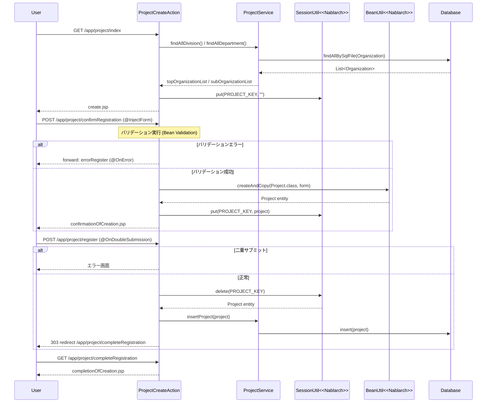

# Code Analysis: ProjectCreateAction

**Generated**: 2026-03-12 13:37:42
**Target**: プロジェクト登録処理（入力・確認・登録・完了・戻る）
**Modules**: proman-web
**Analysis Duration**: 約2分58秒

---

## Overview

`ProjectCreateAction` はプロジェクト登録機能を担うWebアクションクラスです。入力画面表示・確認画面表示・DB登録・完了画面表示・入力画面への戻りという5つのメソッドで構成される、Nablarch Webアプリケーションの標準的な登録フロー（入力→確認→登録→完了）を実装しています。

バリデーションには `@InjectForm` + `@OnError` インターセプタを使用し、フォームから取得したデータを `BeanUtil` でエンティティに変換してセッションストア（`SessionUtil`）に保存します。DB登録処理では `@OnDoubleSubmission` により二重サブミットをサーバサイドで防止し、登録後は303リダイレクトで完了画面へ遷移します。

---

## Architecture

### Dependency Graph

```mermaid
classDiagram
    class ProjectCreateAction
    class ProjectCreateForm {
        <<Form>>
    }
    class ProjectService
    class Project {
        <<Entity>>
    }
    class Organization {
        <<Entity>>
    }
    class DaoContext {
        <<Nablarch>>
    }
    class SessionUtil {
        <<Nablarch>>
    }
    class BeanUtil {
        <<Nablarch>>
    }
    class ExecutionContext {
        <<Nablarch>>
    }
    class DateUtil {
        <<Nablarch>>
    }

    ProjectCreateAction ..> ProjectCreateForm : validates
    ProjectCreateAction ..> ProjectService : delegates to
    ProjectCreateAction ..> SessionUtil : stores/retrieves
    ProjectCreateAction ..> BeanUtil : converts
    ProjectCreateAction ..> ExecutionContext : uses
    ProjectCreateAction ..> DateUtil : formats
    ProjectCreateForm ..|> Serializable
    ProjectService ..> DaoContext : queries/persists
    ProjectService ..> Project : creates
    ProjectService ..> Organization : queries
```



**Note**: This diagram uses Mermaid `classDiagram` syntax to show class names and their relationships. Use `--|>` for inheritance (extends/implements) and `..>` for dependencies (uses/creates).

### Component Summary

| Component | Role | Type | Dependencies |
|-----------|------|------|--------------|
| ProjectCreateAction | プロジェクト登録フロー制御 | Action | ProjectCreateForm, ProjectService, SessionUtil, BeanUtil, ExecutionContext, DateUtil |
| ProjectCreateForm | 登録入力値のバリデーション | Form | DateRelationUtil |
| ProjectService | DB操作のサービス層 | Service | DaoContext (UniversalDao), Project, Organization |
| Project | プロジェクトエンティティ | Entity | なし |
| Organization | 組織エンティティ | Entity | なし |

---

## Flow

### Processing Flow

登録フローは以下の5ステップで構成されます。

**初期画面表示 (`index`)**: 事業部・部門のプルダウンデータをDBから取得してリクエストスコープに設定し、登録入力JSPを返します。

**登録確認画面表示 (`confirmRegistration`)**: `@InjectForm` によりフォームのバリデーションを実行します。成功時はフォームを `BeanUtil.createAndCopy` でエンティティに変換し、`SessionUtil.put` でセッションに保存した後、確認JSPを返します。バリデーションエラー時は `@OnError` によりエラー登録画面へ内部フォワードします。

**DB登録 (`register`)**: `@OnDoubleSubmission` で二重サブミットを防止します。セッションからエンティティを取得（同時に削除）し、`ProjectService.insertProject` でDBに登録後、303リダイレクトで完了画面へ遷移します。

**登録完了画面表示 (`completeRegistration`)**: 完了JSPをそのまま返します。

**入力画面へ戻る (`backToEnterRegistration`)**: セッションからエンティティを取得し、`BeanUtil.createAndCopy` でフォームに変換します。日付項目を `DateUtil.formatDate` でフォーマットし直し、事業部IDを再取得してリクエストスコープに設定した後、登録入力画面へ内部フォワードします。

### Sequence Diagram



---

## Components

### ProjectCreateAction

**ファイル**: [`ProjectCreateAction.java`](../../.lw/nab-official/v6/nablarch-system-development-guide/Sample_Project/Source_Code/proman-project/proman-web/src/main/java/com/nablarch/example/proman/web/project/ProjectCreateAction.java)

**役割**: プロジェクト登録フローの制御クラス。入力→確認→登録→完了→戻りの5メソッドでフローを管理する。

**主要メソッド**:

- `index` (L33-39): 初期画面表示。事業部・部門をDBから取得してリクエストスコープに設定し、登録画面JSPを返す。
- `confirmRegistration` (L48-63): 確認画面表示。`@InjectForm` でバリデーション実行後、フォームをエンティティに変換してセッション保存。
- `register` (L72-78): DB登録処理。`@OnDoubleSubmission` で二重サブミット防止。セッションからエンティティ取得（同時削除）→ DB挿入 → 303リダイレクト。
- `backToEnterRegistration` (L98-118): 確認画面からの戻り。セッションのエンティティをフォームに変換し、日付フォーマット後に入力画面へ戻る。
- `setOrganizationAndDivisionToRequestScope` (L125-136): 事業部・部門取得の共通プライベートメソッド。

**依存関係**: `ProjectCreateForm`, `ProjectService`, `Project` (Entity), `Organization` (Entity), `SessionUtil`, `BeanUtil`, `ExecutionContext`, `DateUtil`

**実装ポイント**:
- フォームをそのままセッションに保存せず、`BeanUtil.createAndCopy` でエンティティに変換してからセッション保存（Nablarch推奨パターン）
- `register` メソッドでは `SessionUtil.delete` を使って取得と同時にセッションをクリア
- `backToEnterRegistration` では日付文字列を `yyyy/MM/dd` 形式に変換してからフォームにセット

---

### ProjectCreateForm

**ファイル**: [`ProjectCreateForm.java`](../../.lw/nab-official/v6/nablarch-system-development-guide/Sample_Project/Source_Code/proman-project/proman-web/src/main/java/com/nablarch/example/proman/web/project/ProjectCreateForm.java)

**役割**: プロジェクト登録入力値を受け取るフォームクラス。`Serializable` を実装し、Bean Validationアノテーションで入力制約を定義する。

**主要メソッド**:

- `isValidProjectPeriod` (L329-331): `@AssertTrue` アノテーション付きの期間バリデーションメソッド。`DateRelationUtil.isValid` を呼び出して開始日 ≦ 終了日を検証する。

**フィールド（バリデーション）**:
- `projectName`: `@Required` + `@Domain("projectName")`
- `projectStartDate` / `projectEndDate`: `@Required` + `@Domain("date")` + `@AssertTrue` （期間整合性）
- `divisionId` / `organizationId`: `@Required` + `@Domain("organizationId")`

---

### ProjectService

**ファイル**: [`ProjectService.java`](../../.lw/nab-official/v6/nablarch-system-development-guide/Sample_Project/Source_Code/proman-project/proman-web/src/main/java/com/nablarch/example/proman/web/project/ProjectService.java)

**役割**: プロジェクト・組織のDB操作を担うサービスクラス。`DaoContext`（UniversalDao）を内部に保持し、CRUD操作を提供する。

**主要メソッド**:

- `findAllDivision` (L50-52): 事業部全件取得。`findAllBySqlFile` でSQLファイル `FIND_ALL_DIVISION` を実行。
- `findAllDepartment` (L59-61): 部門全件取得。`findAllBySqlFile` でSQLファイル `FIND_ALL_DEPARTMENT` を実行。
- `findOrganizationById` (L70-73): 組織IDで1件取得。`findById` を使用。
- `insertProject` (L80-82): プロジェクト1件挿入。`universalDao.insert(project)` を呼び出す。

**依存関係**: `DaoContext` (UniversalDao), `Project`, `Organization`, `DaoFactory`

---

## Nablarch Framework Usage

### @InjectForm

**クラス**: `nablarch.common.web.interceptor.InjectForm`

**説明**: 業務アクションメソッドに付与することで、指定したフォームクラスへのBean Validationを自動実行するインターセプタ。バリデーション成功時にリクエストスコープへフォームオブジェクトを格納する。

**使用方法**:
```java
@InjectForm(form = ProjectCreateForm.class, prefix = "form")
@OnError(type = ApplicationException.class, path = "forward:///app/project/errorRegister")
public HttpResponse confirmRegistration(HttpRequest request, ExecutionContext context) {
    ProjectCreateForm form = context.getRequestScopedVar("form");
    // ...
}
```

**重要ポイント**:
- ✅ **`@OnError` とセットで使う**: バリデーションエラー時のフォワード先を必ず指定する
- ✅ **`prefix` を指定する**: HTMLフォームのname属性を `form.xxx` 形式にした場合は `prefix = "form"` を設定する
- 💡 **バリデーション済みオブジェクト**: 業務アクション実行時点では必ずリクエストスコープからフォームオブジェクトを取得できる

**このコードでの使い方**:
- `confirmRegistration` メソッド（L48）で `ProjectCreateForm` に対してバリデーション実行
- バリデーションエラー時は `errorRegister` パスへフォワード

**詳細**: [Handlers InjectForm](../../.claude/skills/nabledge-6/docs/component/handlers/handlers-InjectForm.md)

---

### @OnDoubleSubmission

**クラス**: `nablarch.common.web.token.OnDoubleSubmission`

**説明**: 業務アクションメソッドに付与することで、サーバサイドでの二重サブミット防止を実現するアノテーション。JSが無効な環境でも有効。

**使用方法**:
```java
@OnDoubleSubmission
public HttpResponse register(HttpRequest request, ExecutionContext context) {
    // 登録処理
}
```

**重要ポイント**:
- ✅ **DB更新・挿入メソッドに必ず付与**: 登録・更新・削除の確定処理に使用する
- ⚠️ **JSPでもトークン設定が必要**: `<n:form useToken="true">` と `allowDoubleSubmission="false"` の組み合わせが前提
- 💡 **サーバサイド保護**: JavaScriptによるクライアントサイド制御と組み合わせて二重保護を実現

**このコードでの使い方**:
- `register` メソッド（L72）に付与し、確認画面からの二重サブミットを防止

**詳細**: [Handlers On Double Submission](../../.claude/skills/nabledge-6/docs/component/handlers/handlers-on_double_submission.md)

---

### SessionUtil

**クラス**: `nablarch.common.web.session.SessionUtil`

**説明**: Nablarchのセッションストアへの読み書きを行うユーティリティクラス。画面遷移間のデータ受け渡しに使用する。

**使用方法**:
```java
// 保存
SessionUtil.put(context, "projectCreateActionProject", project);

// 取得
Project project = SessionUtil.get(context, "projectCreateActionProject");

// 取得と同時に削除
Project project = SessionUtil.delete(context, "projectCreateActionProject");
```

**重要ポイント**:
- ✅ **フォームをそのまま保存しない**: `BeanUtil` でエンティティに変換してから `SessionUtil.put` する
- ✅ **登録時は `delete` を使う**: `register` では `SessionUtil.delete` で取得と同時にセッションをクリアし、メモリリークを防ぐ
- ⚠️ **セッションキーの管理**: クラス定数 `PROJECT_KEY` として定義し、キー名のタイポを防ぐ

**このコードでの使い方**:
- `confirmRegistration`（L59）でエンティティをセッション保存
- `register`（L74）で `SessionUtil.delete` によりエンティティ取得＆セッション削除
- `backToEnterRegistration`（L100）で `SessionUtil.get` によりエンティティ取得
- `setOrganizationAndDivisionToRequestScope`（L132）で `SessionUtil.put` によりキーを初期化

**詳細**: [Web Application Client Create2](../../.claude/skills/nabledge-6/docs/processing-pattern/web-application/web-application-client_create2.md)

---

### BeanUtil

**クラス**: `nablarch.core.beans.BeanUtil`

**説明**: JavaBeans間のプロパティコピーを行うユーティリティクラス。フォームとエンティティの相互変換に使用する。

**使用方法**:
```java
// フォーム → エンティティ（新規生成＋コピー）
Project project = BeanUtil.createAndCopy(Project.class, form);

// エンティティ → フォーム（新規生成＋コピー）
ProjectCreateForm form = BeanUtil.createAndCopy(ProjectCreateForm.class, project);
```

**重要ポイント**:
- ✅ **同名プロパティを自動コピー**: フォームとエンティティで同名のプロパティが自動的にコピーされる
- ⚠️ **型変換に注意**: フォームはすべて `String` 型で保持するため、エンティティ側の数値型へは自動変換される

**このコードでの使い方**:
- `confirmRegistration`（L52）で `ProjectCreateForm` → `Project` 変換
- `backToEnterRegistration`（L101）で `Project` → `ProjectCreateForm` 変換

**詳細**: [Web Application Client Create3](../../.claude/skills/nabledge-6/docs/processing-pattern/web-application/web-application-client_create3.md)

---

## References

### Source Files


### Knowledge Base (Nabledge-6)

- [Web Application Getting Started Project Update](../../.claude/skills/nabledge-6/docs/processing-pattern/web-application/web-application-getting-started-project-update.md)
- [Web Application Client_create2](../../.claude/skills/nabledge-6/docs/processing-pattern/web-application/web-application-client_create2.md)
- [Web Application Client_create4](../../.claude/skills/nabledge-6/docs/processing-pattern/web-application/web-application-client_create4.md)
- [Web Application Client_create3](../../.claude/skills/nabledge-6/docs/processing-pattern/web-application/web-application-client_create3.md)
- [Handlers On_double_submission](../../.claude/skills/nabledge-6/docs/component/handlers/handlers-on_double_submission.md)
- [Handlers InjectForm](../../.claude/skills/nabledge-6/docs/component/handlers/handlers-InjectForm.md)

### Official Documentation


- [BasicDoubleSubmissionHandler](https://nablarch.github.io/docs/LATEST/javadoc/nablarch/common/web/token/BasicDoubleSubmissionHandler.html)
- [BeanUtil](https://nablarch.github.io/docs/LATEST/javadoc/nablarch/core/beans/BeanUtil.html)
- [Client Create2](https://nablarch.github.io/docs/LATEST/doc/application_framework/application_framework/web/getting_started/client_create/client_create2.html)
- [Client Create3](https://nablarch.github.io/docs/LATEST/doc/application_framework/application_framework/web/getting_started/client_create/client_create3.html)
- [Client Create4](https://nablarch.github.io/docs/LATEST/doc/application_framework/application_framework/web/getting_started/client_create/client_create4.html)
- [DoubleSubmissionHandler](https://nablarch.github.io/docs/LATEST/javadoc/nablarch/common/web/token/DoubleSubmissionHandler.html)
- [Index](https://nablarch.github.io/docs/LATEST/doc/application_framework/application_framework/web/getting_started/project_update/index.html)
- [InjectForm](https://nablarch.github.io/docs/LATEST/doc/application_framework/application_framework/handlers/web_interceptor/InjectForm.html)
- [InjectForm](https://nablarch.github.io/docs/LATEST/javadoc/nablarch/common/web/interceptor/InjectForm.html)
- [NoDataException](https://nablarch.github.io/docs/LATEST/javadoc/nablarch/common/dao/NoDataException.html)
- [On Double Submission](https://nablarch.github.io/docs/LATEST/doc/application_framework/application_framework/handlers/web_interceptor/on_double_submission.html)
- [OnDoubleSubmission](https://nablarch.github.io/docs/LATEST/javadoc/nablarch/common/web/token/OnDoubleSubmission.html)
- [OnError](https://nablarch.github.io/docs/LATEST/javadoc/nablarch/fw/web/interceptor/OnError.html)
- [Required](https://nablarch.github.io/docs/LATEST/javadoc/nablarch/core/validation/ee/Required.html)
- [ResourceLocator](https://nablarch.github.io/docs/LATEST/javadoc/nablarch/fw/web/ResourceLocator.html)
- [SessionUtil](https://nablarch.github.io/docs/LATEST/javadoc/nablarch/common/web/session/SessionUtil.html)
- [UniversalDao](https://nablarch.github.io/docs/LATEST/javadoc/nablarch/common/dao/UniversalDao.html)

---

**Note**: This documentation was generated by the code-analysis workflow of the nabledge-6 skill.
