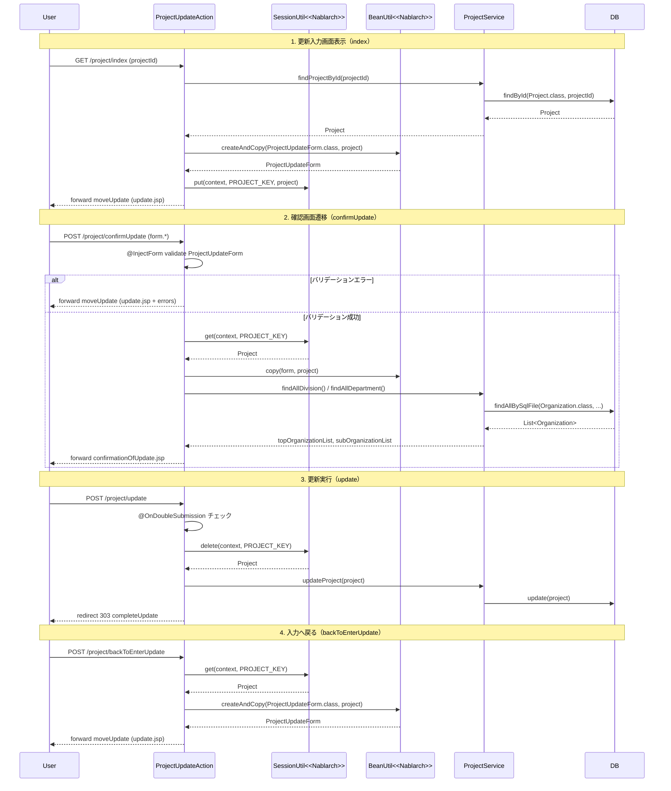

# Code Analysis: ProjectUpdateAction

**Generated**: 2026-03-12 14:33:57
**Target**: プロジェクト更新処理アクション
**Modules**: proman-web
**Analysis Duration**: 約4分4秒

---

## Overview

`ProjectUpdateAction` はプロジェクト更新機能のウェブアクションクラスで、プロジェクト詳細画面からの更新処理を担う。入力画面表示・確認画面遷移・データベース更新・完了画面表示・入力画面への戻りという5つのアクションメソッドで構成される。

Nablarch の `@InjectForm` によるバリデーション、`SessionUtil` によるセッションストア管理、`BeanUtil` によるBean変換、`@OnDoubleSubmission` による二重サブミット防止を組み合わせた典型的な更新確認パターンを実装している。内部的には `ProjectService` を通じて `DaoContext`（UniversalDao）でDB操作を行う。

---

## Architecture

### Dependency Graph

```mermaid
classDiagram
    class ProjectUpdateAction
    class ProjectUpdateForm {
        <<Form>>
    }
    class ProjectUpdateInitialForm {
        <<Form>>
    }
    class ProjectService
    class Project {
        <<Entity>>
    }
    class Organization {
        <<Entity>>
    }
    class SessionUtil {
        <<Nablarch>>
    }
    class BeanUtil {
        <<Nablarch>>
    }
    class ExecutionContext {
        <<Nablarch>>
    }
    class DaoContext {
        <<Nablarch>>
    }

    ProjectUpdateAction ..> ProjectUpdateInitialForm : validates
    ProjectUpdateAction ..> ProjectUpdateForm : validates
    ProjectUpdateAction ..> ProjectService : delegates to
    ProjectUpdateAction ..> SessionUtil : stores/retrieves
    ProjectUpdateAction ..> BeanUtil : copies
    ProjectUpdateAction ..> ExecutionContext : uses
    ProjectService ..> DaoContext : queries/persists
    ProjectService ..> Project : queries/persists
    ProjectService ..> Organization : queries
    ProjectUpdateForm ..|> Serializable
    ProjectUpdateInitialForm ..|> Serializable
```



**Note**: This diagram uses Mermaid `classDiagram` syntax to show class names and their relationships. Use `--|>` for inheritance (extends/implements) and `..>` for dependencies (uses/creates).

### Component Summary

| Component | Role | Type | Dependencies |
|-----------|------|------|--------------|
| ProjectUpdateAction | プロジェクト更新処理の全アクションメソッドを提供 | Action | ProjectUpdateForm, ProjectUpdateInitialForm, ProjectService, SessionUtil, BeanUtil, ExecutionContext |
| ProjectUpdateForm | 更新画面の入力値を受け取りバリデーションを定義 | Form | DateRelationUtil |
| ProjectUpdateInitialForm | 詳細画面からの遷移時にプロジェクトIDを受け取る | Form | なし |
| ProjectService | DBアクセスを担うサービスクラス | Service | DaoContext, Project, Organization |
| Project | プロジェクトデータエンティティ | Entity | なし |
| Organization | 組織（事業部・部門）データエンティティ | Entity | なし |

---

## Flow

### Processing Flow

プロジェクト更新処理は以下の画面遷移で進む。

1. **詳細画面 → 更新入力画面** (`index`): プロジェクトIDをパラメータで受け取り、DBからプロジェクト情報を取得して入力画面に表示する。取得したProjectエンティティをセッションストアに保存する。
2. **更新入力画面 → 確認画面** (`confirmUpdate`): 入力値を `@InjectForm` でバリデーションし、セッションストアのProjectに `BeanUtil.copy` で上書きして確認画面へ。
3. **確認画面 → 更新完了** (`update`): `@OnDoubleSubmission` で二重サブミットを防止し、セッションストアのProjectを削除してDBを更新する。303リダイレクトで完了画面へ。
4. **完了画面表示** (`completeUpdate`): 完了画面JSPへフォワードするのみ。
5. **確認画面 → 入力画面へ戻る** (`backToEnterUpdate`): セッションストアのProjectからFormを再生成してリクエストスコープに設定し、入力画面へ。

バリデーションエラー時は `@OnError` により入力画面へ内部フォワードされる。

### Sequence Diagram



---

## Components

### ProjectUpdateAction

**ファイル**: [ProjectUpdateAction.java](../../.lw/nab-official/v6/nablarch-system-development-guide/Sample_Project/Source_Code/proman-project/proman-web/src/main/java/com/nablarch/example/proman/web/project/ProjectUpdateAction.java)

**役割**: プロジェクト更新機能の全アクションメソッドを提供するコントローラクラス。セッションストアをまたぐ状態管理（編集中プロジェクトの保持）と画面遷移制御が主な責務。

**キーメソッド**:

- `index(L35-43)`: プロジェクトIDでDB検索し、FormとEntityを両方セット。Entityをセッションストアに保存する（楽観的ロック用のバージョン保持とフォーム非格納ポリシーのため）。
- `confirmUpdate(L52-62)`: `@InjectForm` + `@OnError` でバリデーション実行。セッションのProjectにフォーム値を `BeanUtil.copy` で上書きし確認画面へ。
- `update(L71-77)`: `@OnDoubleSubmission` で二重サブミット防止。`SessionUtil.delete` でProjectを取得しつつセッションクリア、DBを更新。303リダイレクト。
- `backToEnterUpdate(L97-102)`: セッションのProjectからFormを再生成して入力画面へ戻る。

**依存関係**: ProjectUpdateInitialForm, ProjectUpdateForm, ProjectService, SessionUtil, BeanUtil, ExecutionContext, DateUtil

---

### ProjectUpdateForm

**ファイル**: [ProjectUpdateForm.java](../../.lw/nab-official/v6/nablarch-system-development-guide/Sample_Project/Source_Code/proman-project/proman-web/src/main/java/com/nablarch/example/proman/web/project/ProjectUpdateForm.java)

**役割**: 更新画面の入力値を保持するフォームクラス。`@Required` + `@Domain` による入力バリデーションと、日付期間の相関バリデーション (`@AssertTrue`) を定義する。

**キーメソッド**:

- `isValidProjectPeriod(L329-331)`: `@AssertTrue` アノテーション付き相関バリデーションメソッド。`DateRelationUtil.isValid` で開始日≦終了日を検証する。

**依存関係**: DateRelationUtil

---

### ProjectUpdateInitialForm

**ファイル**: [ProjectUpdateInitialForm.java](../../.lw/nab-official/v6/nablarch-system-development-guide/Sample_Project/Source_Code/proman-project/proman-web/src/main/java/com/nablarch/example/proman/web/project/ProjectUpdateInitialForm.java)

**役割**: プロジェクト詳細画面から更新画面へ遷移する際にプロジェクトIDだけを受け取るフォーム。`@InjectForm(form = ProjectUpdateInitialForm.class)` で `index` メソッドのバリデーションに使用される。

**依存関係**: なし

---

### ProjectService

**ファイル**: [ProjectService.java](../../.lw/nab-official/v6/nablarch-system-development-guide/Sample_Project/Source_Code/proman-project/proman-web/src/main/java/com/nablarch/example/proman/web/project/ProjectService.java)

**役割**: プロジェクト・組織に関するDB操作をカプセル化するサービスクラス。`DaoContext`（UniversalDao）を通じてCRUD操作を提供する。

**キーメソッド**:

- `findProjectById(L124-126)`: `universalDao.findById` でプロジェクトを1件取得。
- `updateProject(L89-91)`: `universalDao.update` でプロジェクトを更新（楽観的ロック実行）。
- `findAllDivision / findAllDepartment(L50-61)`: SQLファイル名指定で事業部・部門リストを取得。

**依存関係**: DaoContext, Project, Organization

---

## Nablarch Framework Usage

### InjectForm

**クラス**: `nablarch.common.web.interceptor.InjectForm`

**説明**: アクションメソッドの引数としてフォームオブジェクトを自動バインドし、Bean Validationを実行するインターセプタアノテーション。

**使用方法**:
```java
@InjectForm(form = ProjectUpdateForm.class, prefix = "form")
@OnError(type = ApplicationException.class, path = "forward:///app/project/moveUpdate")
public HttpResponse confirmUpdate(HttpRequest request, ExecutionContext context) {
    ProjectUpdateForm form = context.getRequestScopedVar("form");
    // ...
}
```

**重要ポイント**:
- ✅ **`prefix` 属性でパラメータのプレフィックスを指定**: HTMLフォームで `form.projectName` のように送信する場合は `prefix = "form"` が必要
- ⚠️ **フォームは `Serializable` を実装する**: `@InjectForm` によるバリデーションのためシリアライザブル実装が必要
- 💡 **バリデーション後は `getRequestScopedVar("form")` で取得**: バリデーション済みのフォームオブジェクトはリクエストスコープに格納される

**このコードでの使い方**:
- `index(L34)`: `@InjectForm(form = ProjectUpdateInitialForm.class)` でプロジェクトIDのみバリデーション
- `confirmUpdate(L52)`: `@InjectForm(form = ProjectUpdateForm.class, prefix = "form")` で全入力値をバリデーション

**詳細**: [Web Application Getting Started Project Update](../../.claude/skills/nabledge-6/docs/processing-pattern/web-application/web-application-getting-started-project-update.md)

---

### SessionUtil

**クラス**: `nablarch.common.web.session.SessionUtil`

**説明**: セッションストアへのオブジェクト格納・取得・削除を行うユーティリティクラス。確認画面を挟む更新処理でエンティティを一時保持するために使用する。

**使用方法**:
```java
// 格納
SessionUtil.put(context, PROJECT_KEY, project);

// 取得
Project project = SessionUtil.get(context, PROJECT_KEY);

// 削除しつつ取得（更新実行時）
Project project = SessionUtil.delete(context, PROJECT_KEY);
```

**重要ポイント**:
- ✅ **フォームをセッションストアに格納しない**: フォームではなくエンティティ（Bean）をセッションに格納する。これはフォームが変わるとセッションの型不整合が起きるため
- ⚠️ **更新実行時は `delete` で取得**: `update` メソッドでは `SessionUtil.delete` を使い取得と同時にセッションをクリアする（メモリリーク防止）
- 💡 **楽観的ロック用バージョン保持**: 編集開始時点のエンティティ（バージョン番号含む）をセッションに保存することで楽観的ロックが機能する

**このコードでの使い方**:
- `index(L41)`: `SessionUtil.put` で初期表示時のProjectエンティティを保存
- `confirmUpdate(L56)`: `SessionUtil.get` でProjectを取得し入力値を上書き
- `update(L73)`: `SessionUtil.delete` でProjectを取得しセッションをクリア
- `backToEnterUpdate(L98)`: `SessionUtil.get` でProjectを取得しFormを再構築

**詳細**: [Libraries Update_example](../../.claude/skills/nabledge-6/docs/component/libraries/libraries-update_example.md)

---

### BeanUtil

**クラス**: `nablarch.core.beans.BeanUtil`

**説明**: JavaBeans間のプロパティコピーを行うユーティリティクラス。フォームとエンティティ間の変換に使用する。

**使用方法**:
```java
// エンティティ→フォーム変換（新規作成）
ProjectUpdateForm form = BeanUtil.createAndCopy(ProjectUpdateForm.class, project);

// フォーム→エンティティへの上書きコピー
BeanUtil.copy(form, project);
```

**重要ポイント**:
- ✅ **`createAndCopy` vs `copy` の使い分け**: 新規インスタンス生成+コピーは `createAndCopy`、既存インスタンスへの上書きは `copy`
- ⚠️ **型変換に注意**: String型フォームプロパティとEntity型プロパティの変換は自動的に行われるが、変換不可の場合はコピーされない
- 💡 **セッションストア対応**: フォームをそのままセッションに保存せず BeanUtil でエンティティに変換することがNablarchのベストプラクティス

**このコードでの使い方**:
- `buildFormFromEntity(L112)`: `BeanUtil.createAndCopy` でProjectエンティティからProjectUpdateFormを生成
- `confirmUpdate(L57)`: `BeanUtil.copy(form, project)` で確認時の入力値をセッション内Projectに上書き
- `backToEnterUpdate(L99)`: `BeanUtil.createAndCopy` でProjectからFormを再生成して戻る画面に表示

**詳細**: [Web Application Getting Started Project Update](../../.claude/skills/nabledge-6/docs/processing-pattern/web-application/web-application-getting-started-project-update.md)

---

### OnDoubleSubmission

**クラス**: `nablarch.common.web.token.OnDoubleSubmission`

**説明**: アクションメソッドへのトークン検証を行い、二重サブミットを防止するインターセプタアノテーション。JavaScriptが無効な場合でもサーバサイドで二重実行を制御する。

**使用方法**:
```java
@OnDoubleSubmission
public HttpResponse update(HttpRequest request, ExecutionContext context) {
    final Project project = SessionUtil.delete(context, PROJECT_KEY);
    ProjectService service = new ProjectService();
    service.updateProject(project);
    return new HttpResponse(303, "redirect:///app/project/completeUpdate");
}
```

**重要ポイント**:
- ✅ **JSPで `useToken="true"` との組み合わせが必要**: サーバサイドの `@OnDoubleSubmission` はJSPの `<n:form useToken="true">` と対で使用する
- ⚠️ **`allowDoubleSubmission="false"` でフロントも防止**: JSPの確定ボタンに `allowDoubleSubmission="false"` を指定してJavaScriptによる二重クリックも防ぐ
- 💡 **二重サブミット時はデフォルトエラー画面へ**: デフォルト遷移先は設定で変更可能

**このコードでの使い方**:
- `update(L71)`: `@OnDoubleSubmission` でDB更新の二重実行を防止

**詳細**: [Web Application Client Create4](../../.claude/skills/nabledge-6/docs/processing-pattern/web-application/web-application-client_create4.md)

---

### OnError

**クラス**: `nablarch.fw.web.interceptor.OnError`

**説明**: 指定した例外が発生した場合に特定のパスへフォワード/リダイレクトするインターセプタアノテーション。バリデーションエラー（`ApplicationException`）時の入力画面再表示に使用する。

**使用方法**:
```java
@InjectForm(form = ProjectUpdateForm.class, prefix = "form")
@OnError(type = ApplicationException.class, path = "forward:///app/project/moveUpdate")
public HttpResponse confirmUpdate(HttpRequest request, ExecutionContext context) {
    // バリデーションエラー時は自動的に moveUpdate へフォワード
}
```

**重要ポイント**:
- ✅ **`@InjectForm` と組み合わせて使用**: バリデーションエラーは `ApplicationException` としてスローされるため `@OnError` でキャッチ
- 💡 **プルダウン再設定のため内部フォワード経由**: 事業部・部門のプルダウンをDB再取得する必要があるため `moveUpdate` ハンドラへフォワードする

**このコードでの使い方**:
- `confirmUpdate(L53)`: `@OnError(type = ApplicationException.class, path = "forward:///app/project/moveUpdate")` でバリデーションエラー時に更新入力画面へ戻る

**詳細**: [Web Application Getting Started Project Update](../../.claude/skills/nabledge-6/docs/processing-pattern/web-application/web-application-getting-started-project-update.md)

---

## References

### Source Files

- [ProjectUpdateAction.java](../../.lw/nab-official/v6/nablarch-system-development-guide/Sample_Project/Source_Code/proman-project/proman-web/src/main/java/com/nablarch/example/proman/web/project/ProjectUpdateAction.java)
- [ProjectUpdateForm.java](../../.lw/nab-official/v6/nablarch-system-development-guide/Sample_Project/Source_Code/proman-project/proman-web/src/main/java/com/nablarch/example/proman/web/project/ProjectUpdateForm.java)
- [ProjectUpdateInitialForm.java](../../.lw/nab-official/v6/nablarch-system-development-guide/Sample_Project/Source_Code/proman-project/proman-web/src/main/java/com/nablarch/example/proman/web/project/ProjectUpdateInitialForm.java)
- [ProjectService.java](../../.lw/nab-official/v6/nablarch-system-development-guide/Sample_Project/Source_Code/proman-project/proman-web/src/main/java/com/nablarch/example/proman/web/project/ProjectService.java)

### Knowledge Base (Nabledge-6)

- [Web Application Getting Started Project Update](../../.claude/skills/nabledge-6/docs/processing-pattern/web-application/web-application-getting-started-project-update.md)
- [Libraries Update_example](../../.claude/skills/nabledge-6/docs/component/libraries/libraries-update_example.md)
- [Web Application Client_create2](../../.claude/skills/nabledge-6/docs/processing-pattern/web-application/web-application-client_create2.md)
- [Web Application Client_create3](../../.claude/skills/nabledge-6/docs/processing-pattern/web-application/web-application-client_create3.md)
- [Web Application Client_create4](../../.claude/skills/nabledge-6/docs/processing-pattern/web-application/web-application-client_create4.md)

### Official Documentation

- [BeanUtil](https://nablarch.github.io/docs/LATEST/javadoc/nablarch/core/beans/BeanUtil.html)
- [Client Create2](https://nablarch.github.io/docs/LATEST/doc/application_framework/application_framework/web/getting_started/client_create/client_create2.html)
- [Client Create3](https://nablarch.github.io/docs/LATEST/doc/application_framework/application_framework/web/getting_started/client_create/client_create3.html)
- [Client Create4](https://nablarch.github.io/docs/LATEST/doc/application_framework/application_framework/web/getting_started/client_create/client_create4.html)
- [Index](https://nablarch.github.io/docs/LATEST/doc/application_framework/application_framework/web/getting_started/project_update/index.html)
- [InjectForm](https://nablarch.github.io/docs/LATEST/javadoc/nablarch/common/web/interceptor/InjectForm.html)
- [NoDataException](https://nablarch.github.io/docs/LATEST/javadoc/nablarch/common/dao/NoDataException.html)
- [OnDoubleSubmission](https://nablarch.github.io/docs/LATEST/javadoc/nablarch/common/web/token/OnDoubleSubmission.html)
- [OnError](https://nablarch.github.io/docs/LATEST/javadoc/nablarch/fw/web/interceptor/OnError.html)
- [Required](https://nablarch.github.io/docs/LATEST/javadoc/nablarch/core/validation/ee/Required.html)
- [ResourceLocator](https://nablarch.github.io/docs/LATEST/javadoc/nablarch/fw/web/ResourceLocator.html)
- [SessionUtil](https://nablarch.github.io/docs/LATEST/javadoc/nablarch/common/web/session/SessionUtil.html)
- [UniversalDao](https://nablarch.github.io/docs/LATEST/javadoc/nablarch/common/dao/UniversalDao.html)
- [Update Example](https://nablarch.github.io/docs/LATEST/doc/application_framework/application_framework/libraries/session_store/update_example.html)

---

**Note**: This documentation was generated by the code-analysis workflow of the nabledge-6 skill.
