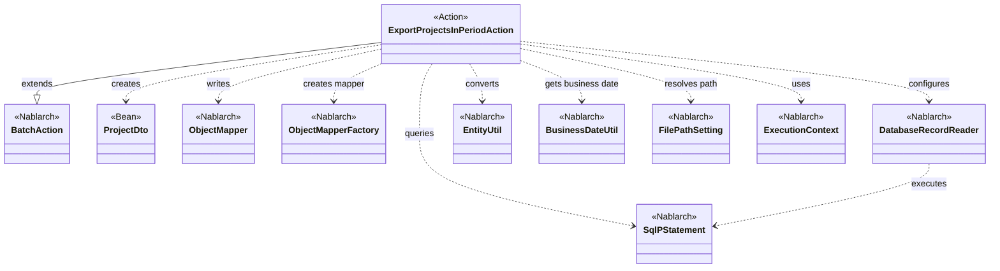
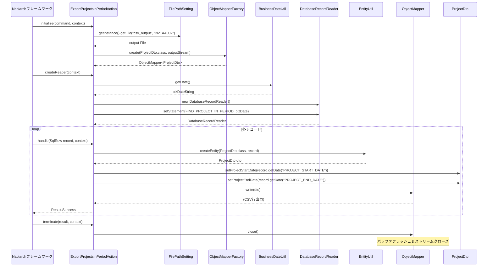

# Code Analysis: ExportProjectsInPeriodAction

**Generated**: 2026-03-12 16:02:35
**Target**: 期間内プロジェクト一覧CSV出力都度起動バッチアクション
**Modules**: proman-batch
**Analysis Duration**: 約3分15秒

---

## Overview

`ExportProjectsInPeriodAction` は、期間内のプロジェクト一覧をCSVファイルに出力する**都度起動バッチ**アクションクラスである。Nablarchの `BatchAction<SqlRow>` を継承し、DBから読み取った各レコードをCSV形式でファイルに書き出す「DB to FILE」パターンを実装している。

処理の主要コンポーネントは3つ：
- **ExportProjectsInPeriodAction**: バッチ処理のメインロジック（初期化・読み込み・処理・終了）
- **ProjectDto**: CSVフォーマットを `@Csv` / `@CsvFormat` アノテーションで定義したデータ転送オブジェクト
- **FIND_PROJECT_IN_PERIOD (SQL)**: 業務日付を条件に期間内プロジェクトを検索するSQLステートメント

`initialize()` でCSV出力用の `ObjectMapper` を生成し、`createReader()` で `DatabaseRecordReader` にSQLをセット、`handle()` で各レコードをDTOに変換してCSV出力、`terminate()` でリソースを解放するライフサイクルを持つ。

---

## Architecture

### Dependency Graph



**Note**: This diagram uses Mermaid `classDiagram` syntax to show class names and their relationships. Use `--|>` for inheritance (extends/implements) and `..>` for dependencies (uses/creates).

### Component Summary

| Component | Role | Type | Dependencies |
|-----------|------|------|--------------|
| ExportProjectsInPeriodAction | 期間内プロジェクトCSV出力バッチアクション | Action | ObjectMapper, DatabaseRecordReader, FilePathSetting, BusinessDateUtil, EntityUtil |
| ProjectDto | プロジェクト情報CSVマッピングBean | Bean | DateUtil |
| FIND_PROJECT_IN_PERIOD | 業務日付を条件とする期間内プロジェクト検索SQL | SQL | なし |

---

## Flow

### Processing Flow

バッチ起動からCSVファイル出力完了までの処理フロー：

1. **initialize()**: `FilePathSetting` から出力先ファイルパス（`csv_output/N21AA002`）を取得し、`ObjectMapperFactory.create(ProjectDto.class, outputStream)` でCSV出力用 `ObjectMapper` を生成する
2. **createReader()**: `DatabaseRecordReader` を生成し、SQL `FIND_PROJECT_IN_PERIOD` をセット。`BusinessDateUtil.getDate()` で業務日付を取得し、SQLの開始日・終了日パラメータにバインドする
3. **handle()**: Nablarchフレームワークが各DBレコード（`SqlRow`）を渡す。`EntityUtil.createEntity(ProjectDto.class, record)` でDTOに変換後、型変換が必要な `projectStartDate` / `projectEndDate` は `record.getDate()` で明示的にセットし、`mapper.write(dto)` でCSV出力する
4. **terminate()**: `mapper.close()` を呼び出しCSVバッファをフラッシュしてストリームをクローズする

エラーハンドリング：`initialize()` で出力ファイルが見つからない場合（`FileNotFoundException`）は `IllegalStateException` にラップしてスローする。

### Sequence Diagram



---

## Components

### ExportProjectsInPeriodAction

**ファイル**: [ExportProjectsInPeriodAction.java](../../.lw/nab-official/v5/nablarch-system-development-guide/Sample_Project/Source_Code/proman-project/proman-batch/src/main/java/com/nablarch/example/proman/batch/project/ExportProjectsInPeriodAction.java)

**役割**: 期間内プロジェクトをDBから読み込み、CSVファイルに出力する都度起動バッチアクション

**主要メソッド**:

- `initialize(CommandLine command, ExecutionContext context)` [L44-54]: 出力ファイルを `FilePathSetting` で取得し `ObjectMapper` を初期化する。ファイルが存在しない場合は `IllegalStateException` をスロー
- `createReader(ExecutionContext context)` [L57-65]: `DatabaseRecordReader` に `FIND_PROJECT_IN_PERIOD` SQLをセット。業務日付を `BusinessDateUtil` で取得し、開始日・終了日の両パラメータとしてバインドする
- `handle(SqlRow record, ExecutionContext context)` [L68-75]: `EntityUtil.createEntity()` でSqlRowをProjectDtoに変換し、日付型フィールドを明示的setter経由でセット後、`mapper.write(dto)` でCSV出力する
- `terminate(Result result, ExecutionContext context)` [L78-80]: `mapper.close()` でCSVバッファをフラッシュしリソースを解放する

**依存コンポーネント**: ObjectMapper, DatabaseRecordReader, FilePathSetting, BusinessDateUtil, EntityUtil, ExecutionContext

**実装上のポイント**:
- `EntityUtil` は型が一致するフィールドのみ自動マッピングするため、`java.sql.Date` 型の `projectStartDate` / `projectEndDate` は個別にセッターを呼び出す必要がある（L71-72のコメント参照）
- `ObjectMapper` は `initialize()` でインスタンス変数として保持し、`terminate()` で確実にクローズする設計になっている

---

### ProjectDto

**ファイル**: [ProjectDto.java](../../.lw/nab-official/v5/nablarch-system-development-guide/Sample_Project/Source_Code/proman-project/proman-batch/src/main/java/com/nablarch/example/proman/batch/project/ProjectDto.java)

**役割**: CSV出力用プロジェクト情報データ転送オブジェクト。`@Csv` / `@CsvFormat` アノテーションでCSV列の定義と書式を宣言する

**主要フィールド**: projectId, projectName, projectType, projectClass, projectStartDate, projectEndDate, organizationId, clientId, projectManager, projectLeader, note, sales, versionNo（13項目）

**重要な実装**: `setProjectStartDate(Date)` [L138-140] / `setProjectEndDate(Date)` [L154-156] は `java.util.Date` を受け取り `DateUtil.formatDate()` で `"yyyy/MM/dd"` 形式の文字列に変換してから保持する。これにより `ObjectMapper` が日付を整形済み文字列としてCSVに出力できる。

**依存コンポーネント**: DateUtil（Nablarch）

---

## Nablarch Framework Usage

### BatchAction

**クラス**: `nablarch.fw.action.BatchAction<SqlRow>`

**説明**: 都度起動バッチ・常駐バッチ共通の汎用バッチアクションテンプレートクラス。DB入力（`SqlRow`）やファイル入力など任意の入力タイプに対応する

**使用方法**:
```java
public class ExportProjectsInPeriodAction extends BatchAction<SqlRow> {
    @Override
    protected void initialize(CommandLine command, ExecutionContext context) { ... }

    @Override
    public DataReader<SqlRow> createReader(ExecutionContext context) { ... }

    @Override
    public Result handle(SqlRow record, ExecutionContext context) {
        // 1レコードに対する処理
        return new Result.Success();
    }

    @Override
    protected void terminate(Result result, ExecutionContext context) { ... }
}
```

**重要ポイント**:
- 💡 **汎用テンプレート**: `FileBatchAction`（データフォーマット用）と異なり、データバインドや任意のDataReaderと組み合わせて使用できる
- ✅ **ライフサイクルメソッド**: `initialize()` → `createReader()` → `handle()` (繰り返し) → `terminate()` の順で呼ばれる
- ⚠️ **FileBatchActionとの使い分け**: `@Csv` / `@CsvFormat` でデータバインドを使う場合は `BatchAction` を使用すること（`FileBatchAction` はデータフォーマット機能専用）

**このコードでの使い方**:
- DB to FILE パターンで使用（DBから読み込みCSVに書き出し）
- `handle()` は `SqlRow` 型（1DBレコード）を受け取る

**詳細**: [Nablarch Batch Architecture](../../.claude/skills/nabledge-6/docs/processing-pattern/nablarch-batch/nablarch-batch-architecture.md)

---

### ObjectMapper / ObjectMapperFactory

**クラス**: `nablarch.common.databind.ObjectMapper` / `nablarch.common.databind.ObjectMapperFactory`

**説明**: CSVや固定長データをJava Beansとして書き込む機能を提供する。`@Csv` / `@CsvFormat` アノテーションで宣言されたフォーマット定義に従って出力する

**使用方法**:
```java
// 初期化（initialize()内）
FileOutputStream outputStream = new FileOutputStream(output);
this.mapper = ObjectMapperFactory.create(ProjectDto.class, outputStream);

// 各レコード書き込み（handle()内）
mapper.write(dto);

// クローズ（terminate()内）
this.mapper.close();
```

**重要ポイント**:
- ✅ **必ず`close()`を呼ぶ**: バッファをフラッシュしリソースを解放する。このコードでは `terminate()` で確実に呼び出している
- ⚠️ **スレッドアンセーフ**: 複数スレッドで共有しないこと。バッチのシングルスレッド処理では問題ない
- 💡 **アノテーション駆動**: `ProjectDto` の `@Csv` / `@CsvFormat` でCSVフォーマットを宣言的に定義できる

**このコードでの使い方**:
- `initialize()` でCSV出力先ファイルを `FileOutputStream` で開き `ObjectMapper` を生成（L49-50）
- `handle()` で各レコードを `mapper.write(dto)` でCSV書き込み（L73）
- `terminate()` で `mapper.close()` してリソース解放（L79）

**詳細**: [Libraries Data_bind](../../.claude/skills/nabledge-6/docs/component/libraries/libraries-data_bind.md)

---

### DatabaseRecordReader

**クラス**: `nablarch.fw.reader.DatabaseRecordReader`

**説明**: SQLの結果セットをレコード単位で読み込む `DataReader` 実装。`SqlPStatement` に検索条件をバインドしてセットすることで、1レコードずつバッチアクションに渡す

**使用方法**:
```java
DatabaseRecordReader reader = new DatabaseRecordReader();
SqlPStatement statement = getSqlPStatement("FIND_PROJECT_IN_PERIOD");
statement.setDate(1, bizDate);  // 開始日
statement.setDate(2, bizDate);  // 終了日
reader.setStatement(statement);
return reader;
```

**重要ポイント**:
- 💡 **DB to FILEパターン**: SQLの結果セットを順次処理することで、メモリに全件を保持せずに大量データを扱える
- ✅ **パラメータバインド**: `SqlPStatement` のパラメータは1-based index（`setDate(1, ...)` は第1パラメータ）

**このコードでの使い方**:
- `createReader()` で生成し、業務日付をSQLの開始日・終了日両方にバインド（L61-62）

**詳細**: [Nablarch Batch Getting Started](../../.claude/skills/nabledge-6/docs/processing-pattern/nablarch-batch/nablarch-batch-getting-started-nablarch-batch.md)

---

### BusinessDateUtil / FilePathSetting

**クラス**: `nablarch.core.date.BusinessDateUtil` / `nablarch.core.util.FilePathSetting`

**説明**: `BusinessDateUtil` はシステム設定された業務日付を取得するユーティリティ。`FilePathSetting` は設定ファイルで定義されたベースパスからファイルオブジェクトを解決するユーティリティ

**使用方法**:
```java
// 業務日付取得
String bizDateStr = BusinessDateUtil.getDate();
Date bizDate = new Date(DateUtil.getDate(bizDateStr).getTime());

// ファイルパス解決
FilePathSetting filePathSetting = FilePathSetting.getInstance();
File output = filePathSetting.getFile("csv_output", OUTPUT_FILE_NAME);
```

**重要ポイント**:
- 💡 **業務日付**: システム日付ではなく設定された業務日付を使用することで、テスト・再処理時に日付を制御できる
- ✅ **FilePathSetting**: 出力先ディレクトリをコードにハードコードせず、設定ファイルで管理できる

**このコードでの使い方**:
- `createReader()` で業務日付を取得しSQL条件にバインド（L60）
- `initialize()` で `csv_output` ベースパスから `N21AA002` ファイルを取得（L46-47）

---

## References

### Source Files

- [ExportProjectsInPeriodAction.java (.lw/nab-official/v5/nablarch-system-development-guide/en/Sample_Project/Source_Code/proman-project/proman-batch/src/main/java/com/nablarch/example/proman/batch/project)](../../.lw/nab-official/v5/nablarch-system-development-guide/en/Sample_Project/Source_Code/proman-project/proman-batch/src/main/java/com/nablarch/example/proman/batch/project/ExportProjectsInPeriodAction.java) - ExportProjectsInPeriodAction
- [ExportProjectsInPeriodAction.java (.lw/nab-official/v5/nablarch-system-development-guide/Sample_Project/Source_Code/proman-project/proman-batch/src/main/java/com/nablarch/example/proman/batch/project)](../../.lw/nab-official/v5/nablarch-system-development-guide/Sample_Project/Source_Code/proman-project/proman-batch/src/main/java/com/nablarch/example/proman/batch/project/ExportProjectsInPeriodAction.java) - ExportProjectsInPeriodAction
- [ProjectDto.java (.lw/nab-official/v5/nablarch-system-development-guide/en/Sample_Project/Source_Code/proman-project/proman-batch/src/main/java/com/nablarch/example/proman/batch/project)](../../.lw/nab-official/v5/nablarch-system-development-guide/en/Sample_Project/Source_Code/proman-project/proman-batch/src/main/java/com/nablarch/example/proman/batch/project/ProjectDto.java) - ProjectDto
- [ProjectDto.java (.lw/nab-official/v5/nablarch-system-development-guide/Sample_Project/Source_Code/proman-project/proman-batch/src/main/java/com/nablarch/example/proman/batch/project)](../../.lw/nab-official/v5/nablarch-system-development-guide/Sample_Project/Source_Code/proman-project/proman-batch/src/main/java/com/nablarch/example/proman/batch/project/ProjectDto.java) - ProjectDto

### Knowledge Base (Nabledge-6)

- [Libraries Data_bind](../../.claude/skills/nabledge-6/docs/component/libraries/libraries-data_bind.md)
- [Nablarch Batch Getting Started Nablarch Batch](../../.claude/skills/nabledge-6/docs/processing-pattern/nablarch-batch/nablarch-batch-getting-started-nablarch-batch.md)
- [Nablarch Batch Architecture](../../.claude/skills/nabledge-6/docs/processing-pattern/nablarch-batch/nablarch-batch-architecture.md)
- [Nablarch Patterns Nablarchバッチ処理パターン](../../.claude/skills/nabledge-6/docs/guide/nablarch-patterns/nablarch-patterns-Nablarchバッチ処理パターン.md)

### Official Documentation


- [Architecture.html#nablarch-batch-each-time-batch](https://nablarch.github.io/docs/LATEST/doc/application_framework/application_framework/batch/nablarch_batch/architecture.html#nablarch-batch-each-time-batch)
- [Architecture](https://nablarch.github.io/docs/LATEST/doc/application_framework/application_framework/batch/nablarch_batch/architecture.html)
- [AsyncMessageSendAction](https://nablarch.github.io/docs/LATEST/javadoc/nablarch/fw/messaging/action/AsyncMessageSendAction.html)
- [BatchAction](https://nablarch.github.io/docs/LATEST/javadoc/nablarch/fw/action/BatchAction.html)
- [BeanUtil](https://nablarch.github.io/docs/LATEST/javadoc/nablarch/core/beans/BeanUtil.html)
- [CsvDataBindConfig](https://nablarch.github.io/docs/LATEST/javadoc/nablarch/common/databind/csv/CsvDataBindConfig.html)
- [CsvFormat](https://nablarch.github.io/docs/LATEST/javadoc/nablarch/common/databind/csv/CsvFormat.html)
- [Csv](https://nablarch.github.io/docs/LATEST/javadoc/nablarch/common/databind/csv/Csv.html)
- [Data Bind](https://nablarch.github.io/docs/LATEST/doc/application_framework/application_framework/libraries/data_io/data_bind.html)
- [DataBindConfig](https://nablarch.github.io/docs/LATEST/javadoc/nablarch/common/databind/DataBindConfig.html)
- [DataReader](https://nablarch.github.io/docs/LATEST/javadoc/nablarch/fw/DataReader.html)
- [DatabaseRecordReader](https://nablarch.github.io/docs/LATEST/javadoc/nablarch/fw/reader/DatabaseRecordReader.html)
- [DispatchHandler](https://nablarch.github.io/docs/LATEST/javadoc/nablarch/fw/handler/DispatchHandler.html)
- [Field](https://nablarch.github.io/docs/LATEST/javadoc/nablarch/common/databind/fixedlength/Field.html)
- [FileBatchAction](https://nablarch.github.io/docs/LATEST/javadoc/nablarch/fw/action/FileBatchAction.html)
- [FileDataReader](https://nablarch.github.io/docs/LATEST/javadoc/nablarch/fw/reader/FileDataReader.html)
- [FileResponse](https://nablarch.github.io/docs/LATEST/javadoc/nablarch/common/web/download/FileResponse.html)
- [FixedLengthDataBindConfigBuilder](https://nablarch.github.io/docs/LATEST/javadoc/nablarch/common/databind/fixedlength/FixedLengthDataBindConfigBuilder.html)
- [FixedLengthDataBindConfig](https://nablarch.github.io/docs/LATEST/javadoc/nablarch/common/databind/fixedlength/FixedLengthDataBindConfig.html)
- [FixedLength](https://nablarch.github.io/docs/LATEST/javadoc/nablarch/common/databind/fixedlength/FixedLength.html)
- [Index](https://nablarch.github.io/docs/LATEST/doc/application_framework/application_framework/batch/nablarch_batch/getting_started/nablarch_batch/index.html)
- [Index](https://nablarch.github.io/docs/LATEST/doc/application_framework/application_framework/batch/nablarch_batch/index.html)
- [Index](https://nablarch.github.io/docs/LATEST/doc/application_framework/application_framework/messaging/db/index.html)
- [LineNumber](https://nablarch.github.io/docs/LATEST/javadoc/nablarch/common/databind/LineNumber.html)
- [MultiLayoutConfig.RecordIdentifier](https://nablarch.github.io/docs/LATEST/javadoc/nablarch/common/databind/fixedlength/MultiLayoutConfig.RecordIdentifier.html)
- [MultiLayout](https://nablarch.github.io/docs/LATEST/javadoc/nablarch/common/databind/fixedlength/MultiLayout.html)
- [NoInputDataBatchAction](https://nablarch.github.io/docs/LATEST/javadoc/nablarch/fw/action/NoInputDataBatchAction.html)
- [ObjectMapperFactory](https://nablarch.github.io/docs/LATEST/javadoc/nablarch/common/databind/ObjectMapperFactory.html)
- [ObjectMapper](https://nablarch.github.io/docs/LATEST/javadoc/nablarch/common/databind/ObjectMapper.html)
- [PartInfo](https://nablarch.github.io/docs/LATEST/javadoc/nablarch/fw/web/upload/PartInfo.html)
- [ProcessStopHandler.ProcessStop](https://nablarch.github.io/docs/LATEST/javadoc/nablarch/fw/handler/ProcessStopHandler.ProcessStop.html)
- [Result](https://nablarch.github.io/docs/LATEST/javadoc/nablarch/fw/Result.html)
- [ResumeDataReader](https://nablarch.github.io/docs/LATEST/javadoc/nablarch/fw/reader/ResumeDataReader.html)
- [StatusCodeConvertHandler](https://nablarch.github.io/docs/LATEST/javadoc/nablarch/fw/handler/StatusCodeConvertHandler.html)
- [UniversalDao](https://nablarch.github.io/docs/LATEST/javadoc/nablarch/common/dao/UniversalDao.html)
- [ValidatableFileDataReader](https://nablarch.github.io/docs/LATEST/javadoc/nablarch/fw/reader/ValidatableFileDataReader.html)

---

**Note**: This documentation was generated by the code-analysis workflow of the nabledge-6 skill.
