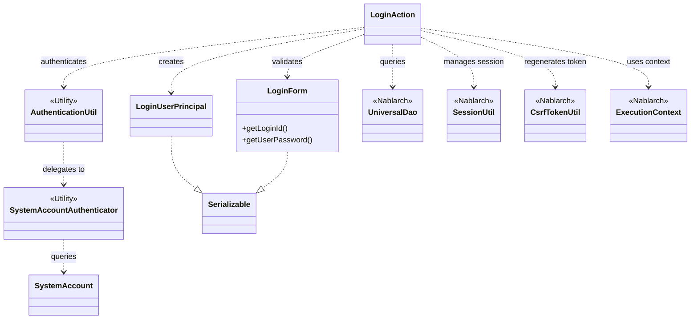
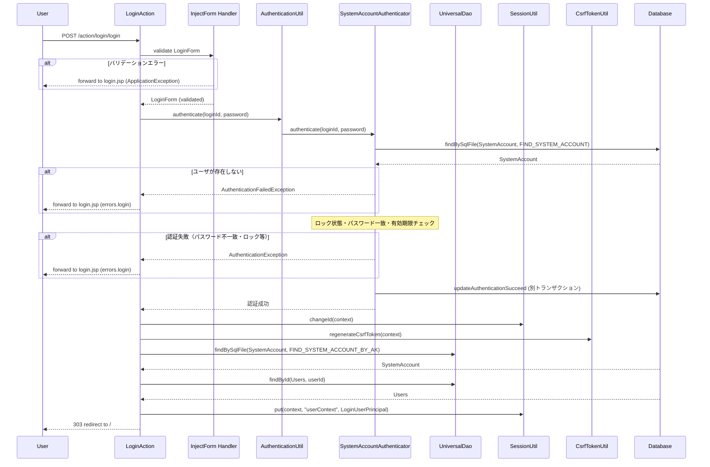

# Code Analysis: LoginAction

**Generated**: 2026-03-12 16:08:49
**Target**: ログイン・ログアウト認証処理アクション
**Modules**: proman-web
**Analysis Duration**: 約3分18秒

---

## Overview

`LoginAction` は、プロマネシステムのWebアプリケーションにおけるログイン・ログアウト認証処理を担うアクションクラスである。

主な責務は以下の3点：
1. **ログイン画面表示** (`index`): ログイン画面JSPへのフォワード
2. **ログイン処理** (`login`): フォーム入力値のバリデーション、パスワード認証、セッション確立
3. **ログアウト処理** (`logout`): セッション無効化とリダイレクト

`@InjectForm` アノテーションによるBean Validationと、`AuthenticationUtil` を介した `SystemAccountAuthenticator` による二段階認証（ロック・有効期限チェック含む）が核心的な実装パターンである。認証成功後は `SessionUtil.changeId()` でセッションID変更、`CsrfTokenUtil.regenerateCsrfToken()` でCSRFトークン再生成を行い、セキュリティを確保している。

---

## Architecture

### Dependency Graph



**Note**: This diagram uses Mermaid `classDiagram` syntax to show class names and their relationships. Use `--|>` for inheritance (extends/implements) and `..>` for dependencies (uses/creates).

### Component Summary

| Component | Role | Type | Dependencies |
|-----------|------|------|--------------|
| LoginAction | ログイン・ログアウト処理コントローラ | Action | LoginForm, AuthenticationUtil, UniversalDao, SessionUtil, CsrfTokenUtil, ExecutionContext |
| LoginForm | ログイン入力値（ID・パスワード）のバリデーション用フォーム | Form | なし |
| AuthenticationUtil | 認証処理のファサードユーティリティ（SystemRepositoryからAuthenticator取得） | Utility | SystemAccountAuthenticator |
| SystemAccountAuthenticator | DBベースのパスワード認証・ロック・有効期限チェック実装 | Utility | UniversalDao, PasswordEncryptor, SimpleDbTransactionManager |
| LoginUserPrincipal | 認証後セッションに格納するログインユーザ情報 | Bean | なし |
| SystemAccount | システムアカウントエンティティ（DB対応） | Entity | なし |

---

## Flow

### Processing Flow

**ログインフロー** (`login`メソッド、L51-71):

1. `@InjectForm(form = LoginForm.class)` アノテーションによりHTTPリクエストパラメータをバリデーション。エラー時は `@OnError` によりログイン画面へフォワード。
2. バリデーション済み `LoginForm` をリクエストスコープから取得 (`context.getRequestScopedVar("form")`)。
3. `AuthenticationUtil.authenticate(loginId, password)` を呼び出し。内部では `SystemAccountAuthenticator` がDBのSystemAccountを検索し、ロック状態・パスワード一致・有効期限をチェック。
4. 認証失敗時は `AuthenticationException` をキャッチし `ApplicationException` として再スロー → `@OnError` でログイン画面に遷移。
5. 認証成功後: `SessionUtil.changeId()` でセッションID変更、`CsrfTokenUtil.regenerateCsrfToken()` でCSRFトークン再生成。
6. `createLoginUserContext()` でユーザ情報（userId, kanjiName, pmFlag, lastLoginDateTime）をDBから取得して `LoginUserPrincipal` に格納。
7. `SessionUtil.put(context, "userContext", userContext)` でセッションに保存し、303リダイレクトでトップ画面へ。

**ログアウトフロー** (`logout`メソッド、L102-106):
1. `SessionUtil.invalidate(context)` でセッション無効化。
2. 303リダイレクトでログイン画面へ。

### Sequence Diagram



---

## Components

### LoginAction

**ファイル**: [LoginAction.java](../../.lw/nab-official/v5/nablarch-system-development-guide/Sample_Project/Source_Code/proman-project/proman-web/src/main/java/com/nablarch/example/proman/web/login/LoginAction.java)

**役割**: ログイン・ログアウト処理を担うWebアクションクラス。`@InjectForm` によるバリデーション、認証ユーティリティの呼び出し、セッション管理を行う。

**キーメソッド**:
- `login(HttpRequest, ExecutionContext)` [L51-71]: ログイン処理本体。バリデーション済みフォームから認証実行、セッション確立、303リダイレクト。
- `createLoginUserContext(String loginId)` [L79-93]: 認証後のユーザ情報をDBから取得しLoginUserPrincipalに格納する内部メソッド。
- `logout(HttpRequest, ExecutionContext)` [L102-106]: セッション無効化とログイン画面へのリダイレクト。

**依存コンポーネント**: LoginForm, AuthenticationUtil, UniversalDao, SessionUtil, CsrfTokenUtil, ExecutionContext, LoginUserPrincipal

---

### LoginForm

**ファイル**: [LoginForm.java](../../.lw/nab-official/v5/nablarch-system-development-guide/Sample_Project/Source_Code/proman-project/proman-web/src/main/java/com/nablarch/example/proman/web/login/LoginForm.java)

**役割**: ログイン入力値（loginId・userPassword）を受け取るフォームクラス。`@Required` + `@Domain` アノテーションでBean Validationルールを定義。

**キーフィールド**:
- `loginId` [L23]: `@Required @Domain("loginId")` でバリデーション
- `userPassword` [L28]: `@Required @Domain("userPassword")` でバリデーション

**依存コンポーネント**: なし（純粋なフォームBean）

---

### AuthenticationUtil

**ファイル**: [AuthenticationUtil.java](../../.lw/nab-official/v5/nablarch-system-development-guide/Sample_Project/Source_Code/proman-project/proman-web/src/main/java/com/nablarch/example/proman/web/common/authentication/AuthenticationUtil.java)

**役割**: 認証処理のファサード（Utilityクラス）。`SystemRepository` から `authenticator` コンポーネント（`SystemAccountAuthenticator`）を取得して委譲する。

**キーメソッド**:
- `authenticate(userId, password)` [L62-66]: `SystemRepository.get("authenticator")` でAuthenticatorを取得し認証委譲。

**依存コンポーネント**: SystemRepository（Nablarch）, PasswordAuthenticator（SystemAccountAuthenticator実装）

---

### SystemAccountAuthenticator

**ファイル**: [SystemAccountAuthenticator.java](../../.lw/nab-official/v5/nablarch-system-development-guide/Sample_Project/Source_Code/proman-project/proman-web/src/main/java/com/nablarch/example/proman/web/common/authentication/SystemAccountAuthenticator.java)

**役割**: DBのSystemAccountテーブルを使ったパスワード認証の具体実装。ロック判定・有効期限チェック・失敗回数更新を別トランザクションで実施。

**キーメソッド**:
- `authenticate(userId, password)` [L91-111]: DBからSystemAccount検索し、`authenticate(account, password, sysDate)` に委譲。
- `authenticate(account, password, businessDate)` [L124-161]: パスワード検証・ロックチェック・有効期限チェック。成功/失敗時にDBを別トランザクション更新。

**依存コンポーネント**: UniversalDao, PasswordEncryptor, SimpleDbTransactionManager

---

### LoginUserPrincipal

**ファイル**: [LoginUserPrincipal.java](../../.lw/nab-official/v5/nablarch-system-development-guide/Sample_Project/Source_Code/proman-project/proman-web/src/main/java/com/nablarch/example/proman/web/common/authentication/context/LoginUserPrincipal.java)

**役割**: 認証後にセッションストアへ保存するログインユーザ情報オブジェクト。userId, kanjiName, pmFlag, lastLoginDateTime を保持。

**依存コンポーネント**: なし（純粋なデータBean、Serializable実装）

---

## Nablarch Framework Usage

### @InjectForm / @OnError

**クラス**: `nablarch.common.web.interceptor.InjectForm` / `nablarch.fw.web.interceptor.OnError`

**説明**: アクションメソッドへのアノテーション付与によりHTTPリクエストパラメータのバリデーションを自動実行し、バリデーション済みフォームをリクエストスコープへ格納するインターセプタ。

**使用方法**:
```java
@OnError(type = ApplicationException.class, path = "/WEB-INF/view/login/login.jsp")
@InjectForm(form = LoginForm.class)
public HttpResponse login(HttpRequest request, ExecutionContext context) {
    LoginForm form = context.getRequestScopedVar("form");
    // バリデーション済みフォームを使用
}
```

**重要ポイント**:
- ✅ **アノテーション順序**: `@OnError` を `@InjectForm` の外側（上）に付与すること。逆順だとエラーハンドリングが機能しない。
- ✅ **フォームはリクエストスコープから取得**: `context.getRequestScopedVar("form")` で取得。デフォルト変数名は `"form"`（`name` 属性で変更可）。
- ⚠️ **Serializableの実装必須**: `@InjectForm` で使用するフォームクラスはセッションストアへの保存に備え `Serializable` を実装すること。
- 💡 **バリデーションエラー時の自動フォワード**: `@OnError` に指定したパスへ自動フォワードするため、アクションメソッド内での例外ハンドリングが不要。

**このコードでの使い方**:
- `login()` メソッド [L49-51] に `@InjectForm(form = LoginForm.class)` を付与。
- エラー時は `@OnError(type = ApplicationException.class, path = "/WEB-INF/view/login/login.jsp")` でログイン画面に戻る。
- バリデーション済み `LoginForm` を `context.getRequestScopedVar("form")` で取得 [L53]。

**詳細**: [Handlers InjectForm](../../.claude/skills/nabledge-6/docs/component/handlers/handlers-InjectForm.md)

---

### UniversalDao

**クラス**: `nablarch.common.dao.UniversalDao`

**説明**: Nablarchの汎用DAOクラス。SQLファイルや主キーを使ったDB検索をシンプルなAPI呼び出しで実現する。

**使用方法**:
```java
// SQLIDを指定したファイルベース検索
SystemAccount account = UniversalDao.findBySqlFile(
    SystemAccount.class,
    "FIND_SYSTEM_ACCOUNT_BY_AK",
    new Object[]{loginId}
);

// 主キー検索
Users users = UniversalDao.findById(Users.class, account.getUserId());
```

**重要ポイント**:
- ✅ **SQLIDはクラス名#メソッド名形式**: `SystemAccountAuthenticator#FIND_SYSTEM_ACCOUNT` のようにSQL_ID_PREFIXを用いてクラス名から動的生成。
- ⚠️ **データが存在しない場合はNoDataException**: `findBySqlFile` / `findById` はデータ未存在時に `NoDataException` をスロー。認証処理では `catch (NoDataException)` で認証失敗として扱っている。
- 💡 **エンティティクラスとDB列の自動マッピング**: アノテーション不要で列名とフィールド名を自動対応。

**このコードでの使い方**:
- `createLoginUserContext()` [L80-83] で `findBySqlFile` によりSQLIDで SystemAccount を検索、`findById` でUsers情報を補完取得。
- `SystemAccountAuthenticator` [L102-105] でも認証時にSystemAccountを検索。

**詳細**: [UniversalDao](https://nablarch.github.io/docs/LATEST/javadoc/nablarch/common/dao/UniversalDao.html)

---

### SessionUtil / CsrfTokenUtil

**クラス**: `nablarch.common.web.session.SessionUtil` / `nablarch.common.web.csrf.CsrfTokenUtil`

**説明**: `SessionUtil` はNablarchのセッションストアへの読み書き・セッションID変更・無効化を行うユーティリティ。`CsrfTokenUtil` はCSRFトークンの再生成を行うユーティリティ。

**使用方法**:
```java
// セッションID変更（セッション固定化攻撃対策）
SessionUtil.changeId(context);
// CSRFトークン再生成
CsrfTokenUtil.regenerateCsrfToken(context);
// セッションに値を保存
SessionUtil.put(context, "userContext", userContext);
// セッション無効化
SessionUtil.invalidate(context);
```

**重要ポイント**:
- ✅ **認証直後にセッションIDを変更すること**: セッション固定化攻撃（Session Fixation）対策として必須。`login()` [L65] で `SessionUtil.changeId()` を実行。
- ✅ **認証直後にCSRFトークンを再生成すること**: ログイン前後でトークンを引き継がないためのセキュリティ要件 [L66]。
- ⚠️ **セッションにはEntityではなくSerializableなBeanを格納**: `LoginUserPrincipal` のように専用クラスを使いフォームやEntityを直接格納しない。
- 💡 **ログアウト時はinvalidateでセッション全体を無効化**: `SessionUtil.invalidate(context)` [L103] で全セッション属性を削除。

**このコードでの使い方**:
- `login()` [L65]: `SessionUtil.changeId(context)` でセッションID変更。
- `login()` [L66]: `CsrfTokenUtil.regenerateCsrfToken(context)` でCSRFトークン再生成。
- `login()` [L69]: `SessionUtil.put(context, "userContext", userContext)` でユーザ情報を保存。
- `logout()` [L103]: `SessionUtil.invalidate(context)` でセッション無効化。

**詳細**: [SessionUtil](https://nablarch.github.io/docs/LATEST/javadoc/nablarch/common/web/session/SessionUtil.html)

---

## References

### Source Files

- [LoginAction.java (.lw/nab-official/v5/nablarch-system-development-guide/en/Sample_Project/Source_Code/proman-project/proman-web/src/main/java/com/nablarch/example/proman/web/login)](../../.lw/nab-official/v5/nablarch-system-development-guide/en/Sample_Project/Source_Code/proman-project/proman-web/src/main/java/com/nablarch/example/proman/web/login/LoginAction.java) - LoginAction
- [LoginAction.java (.lw/nab-official/v5/nablarch-system-development-guide/Sample_Project/Source_Code/proman-project/proman-web/src/main/java/com/nablarch/example/proman/web/login)](../../.lw/nab-official/v5/nablarch-system-development-guide/Sample_Project/Source_Code/proman-project/proman-web/src/main/java/com/nablarch/example/proman/web/login/LoginAction.java) - LoginAction
- [LoginForm.java (.lw/nab-official/v5/nablarch-system-development-guide/en/Sample_Project/Source_Code/proman-project/proman-web/src/main/java/com/nablarch/example/proman/web/login)](../../.lw/nab-official/v5/nablarch-system-development-guide/en/Sample_Project/Source_Code/proman-project/proman-web/src/main/java/com/nablarch/example/proman/web/login/LoginForm.java) - LoginForm
- [LoginForm.java (.lw/nab-official/v5/nablarch-system-development-guide/Sample_Project/Source_Code/proman-project/proman-web/src/main/java/com/nablarch/example/proman/web/login)](../../.lw/nab-official/v5/nablarch-system-development-guide/Sample_Project/Source_Code/proman-project/proman-web/src/main/java/com/nablarch/example/proman/web/login/LoginForm.java) - LoginForm
- [AuthenticationUtil.java (.lw/nab-official/v5/nablarch-system-development-guide/en/Sample_Project/Source_Code/proman-project/proman-web/src/main/java/com/nablarch/example/proman/web/common/authentication)](../../.lw/nab-official/v5/nablarch-system-development-guide/en/Sample_Project/Source_Code/proman-project/proman-web/src/main/java/com/nablarch/example/proman/web/common/authentication/AuthenticationUtil.java) - AuthenticationUtil
- [AuthenticationUtil.java (.lw/nab-official/v5/nablarch-system-development-guide/Sample_Project/Source_Code/proman-project/proman-web/src/main/java/com/nablarch/example/proman/web/common/authentication)](../../.lw/nab-official/v5/nablarch-system-development-guide/Sample_Project/Source_Code/proman-project/proman-web/src/main/java/com/nablarch/example/proman/web/common/authentication/AuthenticationUtil.java) - AuthenticationUtil
- [SystemAccountAuthenticator.java (.lw/nab-official/v5/nablarch-system-development-guide/en/Sample_Project/Source_Code/proman-project/proman-web/src/main/java/com/nablarch/example/proman/web/common/authentication)](../../.lw/nab-official/v5/nablarch-system-development-guide/en/Sample_Project/Source_Code/proman-project/proman-web/src/main/java/com/nablarch/example/proman/web/common/authentication/SystemAccountAuthenticator.java) - SystemAccountAuthenticator
- [SystemAccountAuthenticator.java (.lw/nab-official/v5/nablarch-system-development-guide/Sample_Project/Source_Code/proman-project/proman-web/src/main/java/com/nablarch/example/proman/web/common/authentication)](../../.lw/nab-official/v5/nablarch-system-development-guide/Sample_Project/Source_Code/proman-project/proman-web/src/main/java/com/nablarch/example/proman/web/common/authentication/SystemAccountAuthenticator.java) - SystemAccountAuthenticator
- [LoginUserPrincipal.java (.lw/nab-official/v5/nablarch-system-development-guide/en/Sample_Project/Source_Code/proman-project/proman-web/src/main/java/com/nablarch/example/proman/web/common/authentication/context)](../../.lw/nab-official/v5/nablarch-system-development-guide/en/Sample_Project/Source_Code/proman-project/proman-web/src/main/java/com/nablarch/example/proman/web/common/authentication/context/LoginUserPrincipal.java) - LoginUserPrincipal
- [LoginUserPrincipal.java (.lw/nab-official/v5/nablarch-system-development-guide/Sample_Project/Source_Code/proman-project/proman-web/src/main/java/com/nablarch/example/proman/web/common/authentication/context)](../../.lw/nab-official/v5/nablarch-system-development-guide/Sample_Project/Source_Code/proman-project/proman-web/src/main/java/com/nablarch/example/proman/web/common/authentication/context/LoginUserPrincipal.java) - LoginUserPrincipal

### Knowledge Base (Nabledge-6)

- [Handlers InjectForm](../../.claude/skills/nabledge-6/docs/component/handlers/handlers-InjectForm.md)
- [About Nablarch 12](../../.claude/skills/nabledge-6/docs/about/about-nablarch/about-nablarch-12.md)
- [Web Application Forward_error_page](../../.claude/skills/nabledge-6/docs/processing-pattern/web-application/web-application-forward_error_page.md)
- [Web Application Getting Started Project Search](../../.claude/skills/nabledge-6/docs/processing-pattern/web-application/web-application-getting-started-project-search.md)
- [Web Application Client_create2](../../.claude/skills/nabledge-6/docs/processing-pattern/web-application/web-application-client_create2.md)

### Official Documentation

- [ApplicationException](https://nablarch.github.io/docs/LATEST/javadoc/nablarch/core/message/ApplicationException.html)
- [BeanUtil](https://nablarch.github.io/docs/LATEST/javadoc/nablarch/core/beans/BeanUtil.html)
- [Client Create2](https://nablarch.github.io/docs/LATEST/doc/application_framework/application_framework/web/getting_started/client_create/client_create2.html)
- [Forward Error Page](https://nablarch.github.io/docs/LATEST/doc/application_framework/application_framework/web/feature_details/forward_error_page.html)
- [Index](https://nablarch.github.io/docs/LATEST/doc/application_framework/application_framework/web/getting_started/project_search/index.html)
- [Index](https://nablarch.github.io/docs/LATEST/doc/biz_samples/12/index.html)
- [InjectForm](https://nablarch.github.io/docs/LATEST/doc/application_framework/application_framework/handlers/web_interceptor/InjectForm.html)
- [InjectForm](https://nablarch.github.io/docs/LATEST/javadoc/nablarch/common/web/interceptor/InjectForm.html)
- [NoDataException](https://nablarch.github.io/docs/LATEST/javadoc/nablarch/common/dao/NoDataException.html)
- [OnError](https://nablarch.github.io/docs/LATEST/javadoc/nablarch/fw/web/interceptor/OnError.html)
- [OptimisticLockException](https://nablarch.github.io/docs/LATEST/javadoc/jakarta/persistence/OptimisticLockException.html)
- [Required](https://nablarch.github.io/docs/LATEST/javadoc/nablarch/core/validation/ee/Required.html)
- [SessionUtil](https://nablarch.github.io/docs/LATEST/javadoc/nablarch/common/web/session/SessionUtil.html)
- [UniversalDao](https://nablarch.github.io/docs/LATEST/javadoc/nablarch/common/dao/UniversalDao.html)

---

**Note**: This documentation was generated by the code-analysis workflow of the nabledge-6 skill.
