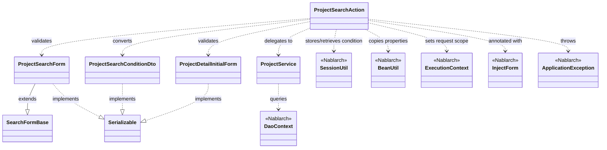
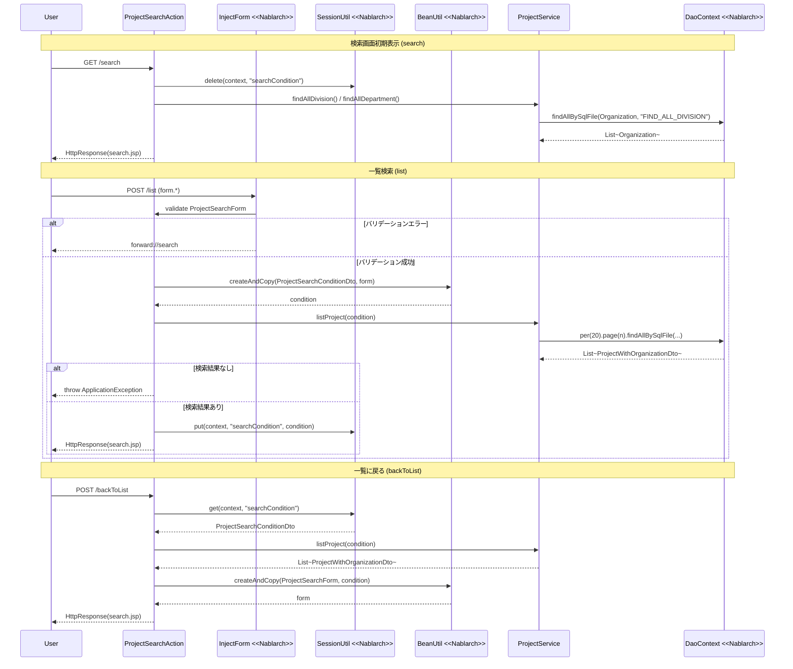

# Code Analysis: ProjectSearchAction

**Generated**: 2026-03-12 16:15:08
**Target**: プロジェクト検索・一覧・詳細表示アクション
**Modules**: proman-web
**Analysis Duration**: 約4分55秒

---

## Overview

`ProjectSearchAction` は、プロジェクトの検索・一覧表示・詳細表示を担うWebアクションクラスです。

主な機能は4つのメソッドで構成されます：
- `search()` — 検索画面の初期表示（セッションクリア + 組織情報セット）
- `list()` — 検索フォームを受け取り、バリデーション後に検索を実行してページング一覧を返す
- `backToList()` — 詳細画面からの「戻る」操作で、セッションに保存した検索条件を使って再検索する
- `detail()` — プロジェクトIDでプロジェクト詳細を1件取得して表示する

`@InjectForm` と `@OnError` インターセプターでバリデーションとエラーハンドリングを宣言的に管理し、`SessionUtil` で検索条件を画面間で持ちまわしています。`ProjectService` がデータアクセスを担い、`DaoContext`（UniversalDAO）経由でDBにアクセスします。

---

## Architecture

### Dependency Graph



**Note**: This diagram uses Mermaid `classDiagram` syntax to show class names and their relationships. Use `--|>` for inheritance (extends/implements) and `..>` for dependencies (uses/creates).

### Component Summary

| Component | Role | Type | Dependencies |
|-----------|------|------|--------------|
| ProjectSearchAction | プロジェクト検索・一覧・詳細の業務アクション | Action | ProjectSearchForm, ProjectDetailInitialForm, ProjectSearchConditionDto, ProjectService, SessionUtil, BeanUtil |
| ProjectSearchForm | 検索条件の入力フォーム（バリデーション付き） | Form | SearchFormBase |
| ProjectSearchConditionDto | 検索条件DTO（DBバインド用型変換済み） | DTO | なし |
| ProjectDetailInitialForm | 詳細表示用フォーム（プロジェクトID受け取り） | Form | なし |
| ProjectService | プロジェクトデータアクセスのサービス層 | Service | DaoContext（UniversalDAO） |
| SearchFormBase | ページ番号を持つ検索フォームの基底クラス | Base | なし |

---

## Flow

### Processing Flow

**検索画面初期表示 (`search`)**:
リクエストを受け取ると、セッションから古い検索条件を削除し、組織（事業部・部門）をリクエストスコープにセットして検索画面JSPを返します。

**一覧検索 (`list`)**:
`@InjectForm` がリクエストパラメータを `ProjectSearchForm` にバインドしてバリデーションを実行します。バリデーションエラーの場合は `@OnError` で検索画面へフォワードします。成功したら `BeanUtil` でフォームを `ProjectSearchConditionDto` に変換し、`ProjectService.listProject()` でページング検索を実行。結果をリクエストスコープにセットし、次回の「戻る」用に検索条件をセッションに保存します。

**一覧に戻る (`backToList`)**:
セッションから保存済み検索条件 (`ProjectSearchConditionDto`) を取り出し、同条件で再検索します。また `BeanUtil` で条件をフォームに逆変換してリクエストスコープにセットし、入力項目の値を復元します。

**詳細表示 (`detail`)**:
`@InjectForm` でプロジェクトIDを `ProjectDetailInitialForm` として受け取り、`ProjectService.findProjectByIdWithOrganization()` で1件取得してリクエストスコープにセットします。

### Sequence Diagram



---

## Components

### ProjectSearchAction

**ファイル**: [ProjectSearchAction.java](../../.lw/nab-official/v5/nablarch-system-development-guide/Sample_Project/Source_Code/proman-project/proman-web/src/main/java/com/nablarch/example/proman/web/project/ProjectSearchAction.java)

**役割**: プロジェクト検索・一覧・詳細表示の業務アクション。`@InjectForm`/`@OnError` で宣言的にバリデーションとエラーハンドリングを行い、`ProjectService` に委譲してDBアクセスする。

**主要メソッド**:

- `search(HttpRequest, ExecutionContext)` [L35-40]: 検索画面初期表示。セッションクリアと組織情報をリクエストスコープへセット。
- `list(HttpRequest, ExecutionContext)` [L49-69]: 一覧検索。`@InjectForm` でフォームバインド後、`BeanUtil` でDTOに変換し検索実行。検索条件をセッション保存。
- `backToList(HttpRequest, ExecutionContext)` [L78-91]: 詳細画面からの戻り。セッションの検索条件で再検索し、フォームを復元。
- `detail(HttpRequest, ExecutionContext)` [L101-109]: 詳細表示。プロジェクトIDで1件取得。

**依存**: ProjectSearchForm, ProjectDetailInitialForm, ProjectSearchConditionDto, ProjectService, SessionUtil, BeanUtil, ExecutionContext, ApplicationException

---

### ProjectSearchForm

**ファイル**: [ProjectSearchForm.java](../../.lw/nab-official/v5/nablarch-system-development-guide/Sample_Project/Source_Code/proman-project/proman-web/src/main/java/com/nablarch/example/proman/web/project/ProjectSearchForm.java)

**役割**: 検索条件の入力フォーム。`@Domain` アノテーションでドメインバリデーション、`@AssertTrue` でFROM/TO整合性チェックを行う。

**主要フィールド・メソッド**:

- 検索条件フィールド [L21-52]: divisionId, organizationId, projectType (List), projectClass (List), salesFrom/To, projectStartDateFrom/To, projectEndDateFrom/To, projectName
- `isValidProjectSalesRange()` [L294-297]: 売上高FROM/TOの大小チェック
- `isValidProjectStartDateRange()` [L306-309]: 開始日FROM/TOの前後チェック
- `isValidProjectEndDateRange()` [L318-321]: 終了日FROM/TOの前後チェック

**依存**: SearchFormBase（ページ番号継承）, DateRelationUtil, MoneyRelationUtil

---

### ProjectSearchConditionDto

**ファイル**: [ProjectSearchConditionDto.java](../../.lw/nab-official/v5/nablarch-system-development-guide/Sample_Project/Source_Code/proman-project/proman-web/src/main/java/com/nablarch/example/proman/web/project/ProjectSearchConditionDto.java)

**役割**: DB検索用の検索条件DTO。フォームのString型をDBカラム型（Integer, java.sql.Date等）に変換済みで保持する。セッション保存用に `Serializable` を実装。

**主要フィールド**: divisionId(Integer), organizationId(Integer), projectType(String[]), projectClass(String[]), salesFrom/To(Integer), projectStartDate/EndDate From/To(java.sql.Date), projectName(String), pageNumber(long)

**依存**: なし

---

### ProjectDetailInitialForm

**ファイル**: [ProjectDetailInitialForm.java](../../.lw/nab-official/v5/nablarch-system-development-guide/Sample_Project/Source_Code/proman-project/proman-web/src/main/java/com/nablarch/example/proman/web/project/ProjectDetailInitialForm.java)

**役割**: 詳細画面表示時にプロジェクトIDを受け取るシンプルなフォーム。`@Required` と `@Domain("projectId")` でバリデーション。

**依存**: なし

---

### ProjectService

**ファイル**: [ProjectService.java](../../.lw/nab-official/v5/nablarch-system-development-guide/Sample_Project/Source_Code/proman-project/proman-web/src/main/java/com/nablarch/example/proman/web/project/ProjectService.java)

**役割**: プロジェクト関連のデータアクセスをまとめたサービスクラス。`DaoContext`（UniversalDAO）を内包し、SQL IDを指定して各種検索・更新を実行する。

**主要メソッド**:

- `listProject(ProjectSearchConditionDto)` [L99-104]: ページング検索。`per(20L).page(n).findAllBySqlFile()` で実行。
- `findProjectByIdWithOrganization(Integer)` [L112-116]: プロジェクトIDで1件取得（組織情報JOIN）。
- `findAllDivision()` / `findAllDepartment()` [L50-61]: 組織マスタ全件取得。

**依存**: DaoContext（UniversalDAO）, Organization, Project, ProjectWithOrganizationDto

---

## Nablarch Framework Usage

### InjectForm

**クラス**: `nablarch.common.web.interceptor.InjectForm`

**説明**: 業務アクションメソッドに付与するインターセプター。リクエストパラメータを指定したフォームクラスにバインドし、Bean Validationを自動実行する。

**使用方法**:
```java
@InjectForm(form = ProjectSearchForm.class, prefix = "form")
@OnError(type = ApplicationException.class, path = "forward://search")
public HttpResponse list(HttpRequest request, ExecutionContext context) {
    ProjectSearchForm form = context.getRequestScopedVar("form");
    // バリデーション済みのformを使用
}
```

**重要ポイント**:
- ✅ **`name` 未指定時はリクエストスコープのキーが `"form"`**: `context.getRequestScopedVar("form")` で取得できる
- ⚠️ **`prefix` の指定に注意**: HTMLの `input name="form.xxx"` と `prefix="form"` を一致させる必要がある
- 💡 **`@OnError` とセットで使う**: バリデーションエラー時の遷移先を `@OnError` で宣言的に指定できる

**このコードでの使い方**:
- `list()` [L49]: `@InjectForm(form = ProjectSearchForm.class, prefix = "form")` で検索フォームをバリデーション
- `detail()` [L101]: `@InjectForm(form = ProjectDetailInitialForm.class)` でプロジェクトIDのみバリデーション

**詳細**: [Handlers InjectForm](../../.claude/skills/nabledge-6/docs/component/handlers/handlers-InjectForm.md)

---

### SessionUtil

**クラス**: `nablarch.common.web.session.SessionUtil`

**説明**: セッションストアへの格納・取得・削除を行うユーティリティクラス。画面間でオブジェクトを持ちまわすために使用する。

**使用方法**:
```java
// 保存
SessionUtil.put(context, "searchCondition", condition);

// 取得
ProjectSearchConditionDto condition = SessionUtil.get(context, "searchCondition");

// 削除
SessionUtil.delete(context, "searchCondition");
```

**重要ポイント**:
- ✅ **フォームをそのままセッションに入れない**: `BeanUtil` でDTOに変換してから格納する（`ProjectSearchConditionDto implements Serializable` が必要）
- ⚠️ **セッションに格納するクラスは `Serializable` を実装する**: `ProjectSearchConditionDto` がその例
- 💡 **「戻る」ボタンでの再検索に有効**: 検索条件をセッション保存しておき `backToList()` で取り出して再検索できる

**このコードでの使い方**:
- `search()` [L36]: `SessionUtil.delete()` で古い検索条件をクリア
- `list()` [L66]: `SessionUtil.put()` で検索条件を保存
- `backToList()` [L81]: `SessionUtil.get()` で保存した検索条件を取得

**詳細**: [SessionUtil](https://nablarch.github.io/docs/LATEST/javadoc/nablarch/common/web/session/SessionUtil.html)

---

### BeanUtil

**クラス**: `nablarch.core.beans.BeanUtil`

**説明**: JavaBeansのプロパティを別のBeanにコピーするユーティリティ。同名プロパティを型変換しながらコピーできる（String → Integer, String → java.sql.Date 等）。

**使用方法**:
```java
// フォーム → DTO（型変換あり）
ProjectSearchConditionDto condition =
    BeanUtil.createAndCopy(ProjectSearchConditionDto.class, form);

// DTO → フォーム（逆変換）
ProjectSearchForm form =
    BeanUtil.createAndCopy(ProjectSearchForm.class, condition);
```

**重要ポイント**:
- 💡 **型変換を自動で行う**: フォームの `String` 型から DTOの `Integer`, `java.sql.Date` 型へ自動変換される
- ⚠️ **プロパティ名が一致している必要がある**: フォームとDTOで異なるプロパティ名はコピーされない
- 🎯 **フォーム→DTO, DTO→フォームの双方向に使える**: `list()` と `backToList()` でそれぞれ逆方向のコピーに使用

**このコードでの使い方**:
- `list()` [L58]: `BeanUtil.createAndCopy(ProjectSearchConditionDto.class, form)` でフォームをDTOに変換
- `backToList()` [L85]: `BeanUtil.createAndCopy(ProjectSearchForm.class, condition)` でDTOをフォームに逆変換して入力値復元

**詳細**: [BeanUtil](https://nablarch.github.io/docs/LATEST/javadoc/nablarch/core/beans/BeanUtil.html)

---

### DaoContext（UniversalDAO）

**クラス**: `nablarch.common.dao.DaoContext`

**説明**: データベースアクセスの汎用インターフェース。SQLファイルに記述したSQLをIDで呼び出し、ページング付きの検索や1件取得が可能。

**使用方法**:
```java
// ページング検索
List<ProjectWithOrganizationDto> result = universalDao
    .per(20L)
    .page(condition.getPageNumber())
    .findAllBySqlFile(ProjectWithOrganizationDto.class, "FIND_PROJECT_WITH_ORGANIZATION", condition);

// 全件取得
List<Organization> divs = universalDao.findAllBySqlFile(Organization.class, "FIND_ALL_DIVISION");
```

**重要ポイント**:
- ✅ **`per()` と `page()` の両方を指定する**: ページング検索ではどちらも必要
- 💡 **SQLはファイル外部化**: SQLインジェクション防止のためSQLは外部SQLファイルに記述し、SQL IDで参照する
- 🎯 **`findAllBySqlFile` の第3引数に検索条件Beanを渡す**: Beanのプロパティ名でSQLにバインドされる

**このコードでの使い方**:
- `ProjectService.listProject()` [L99-104]: `per(20L).page(n).findAllBySqlFile()` でページング検索
- `ProjectService.findAllDivision/Department()` [L50-61]: `findAllBySqlFile()` で組織マスタ全件取得

**詳細**: [Web Application Getting Started Project Search](../../.claude/skills/nabledge-6/docs/processing-pattern/web-application/web-application-getting-started-project-search.md)

---

## References

### Source Files

- [ProjectSearchAction.java (.lw/nab-official/v5/nablarch-system-development-guide/en/Sample_Project/Source_Code/proman-project/proman-web/src/main/java/com/nablarch/example/proman/web/project)](../../.lw/nab-official/v5/nablarch-system-development-guide/en/Sample_Project/Source_Code/proman-project/proman-web/src/main/java/com/nablarch/example/proman/web/project/ProjectSearchAction.java) - ProjectSearchAction
- [ProjectSearchAction.java (.lw/nab-official/v5/nablarch-system-development-guide/Sample_Project/Source_Code/proman-project/proman-web/src/main/java/com/nablarch/example/proman/web/project)](../../.lw/nab-official/v5/nablarch-system-development-guide/Sample_Project/Source_Code/proman-project/proman-web/src/main/java/com/nablarch/example/proman/web/project/ProjectSearchAction.java) - ProjectSearchAction
- [ProjectSearchForm.java (.lw/nab-official/v5/nablarch-system-development-guide/en/Sample_Project/Source_Code/proman-project/proman-web/src/main/java/com/nablarch/example/proman/web/project)](../../.lw/nab-official/v5/nablarch-system-development-guide/en/Sample_Project/Source_Code/proman-project/proman-web/src/main/java/com/nablarch/example/proman/web/project/ProjectSearchForm.java) - ProjectSearchForm
- [ProjectSearchForm.java (.lw/nab-official/v5/nablarch-system-development-guide/Sample_Project/Source_Code/proman-project/proman-web/src/main/java/com/nablarch/example/proman/web/project)](../../.lw/nab-official/v5/nablarch-system-development-guide/Sample_Project/Source_Code/proman-project/proman-web/src/main/java/com/nablarch/example/proman/web/project/ProjectSearchForm.java) - ProjectSearchForm
- [ProjectSearchConditionDto.java (.lw/nab-official/v5/nablarch-system-development-guide/en/Sample_Project/Source_Code/proman-project/proman-web/src/main/java/com/nablarch/example/proman/web/project)](../../.lw/nab-official/v5/nablarch-system-development-guide/en/Sample_Project/Source_Code/proman-project/proman-web/src/main/java/com/nablarch/example/proman/web/project/ProjectSearchConditionDto.java) - ProjectSearchConditionDto
- [ProjectSearchConditionDto.java (.lw/nab-official/v5/nablarch-system-development-guide/Sample_Project/Source_Code/proman-project/proman-web/src/main/java/com/nablarch/example/proman/web/project)](../../.lw/nab-official/v5/nablarch-system-development-guide/Sample_Project/Source_Code/proman-project/proman-web/src/main/java/com/nablarch/example/proman/web/project/ProjectSearchConditionDto.java) - ProjectSearchConditionDto
- [ProjectDetailInitialForm.java (.lw/nab-official/v5/nablarch-system-development-guide/en/Sample_Project/Source_Code/proman-project/proman-web/src/main/java/com/nablarch/example/proman/web/project)](../../.lw/nab-official/v5/nablarch-system-development-guide/en/Sample_Project/Source_Code/proman-project/proman-web/src/main/java/com/nablarch/example/proman/web/project/ProjectDetailInitialForm.java) - ProjectDetailInitialForm
- [ProjectDetailInitialForm.java (.lw/nab-official/v5/nablarch-system-development-guide/Sample_Project/Source_Code/proman-project/proman-web/src/main/java/com/nablarch/example/proman/web/project)](../../.lw/nab-official/v5/nablarch-system-development-guide/Sample_Project/Source_Code/proman-project/proman-web/src/main/java/com/nablarch/example/proman/web/project/ProjectDetailInitialForm.java) - ProjectDetailInitialForm
- [ProjectService.java (.lw/nab-official/v5/nablarch-system-development-guide/en/Sample_Project/Source_Code/proman-project/proman-web/src/main/java/com/nablarch/example/proman/web/project)](../../.lw/nab-official/v5/nablarch-system-development-guide/en/Sample_Project/Source_Code/proman-project/proman-web/src/main/java/com/nablarch/example/proman/web/project/ProjectService.java) - ProjectService
- [ProjectService.java (.lw/nab-official/v5/nablarch-system-development-guide/Sample_Project/Source_Code/proman-project/proman-web/src/main/java/com/nablarch/example/proman/web/project)](../../.lw/nab-official/v5/nablarch-system-development-guide/Sample_Project/Source_Code/proman-project/proman-web/src/main/java/com/nablarch/example/proman/web/project/ProjectService.java) - ProjectService

### Knowledge Base (Nabledge-6)

- [Web Application Getting Started Project Search](../../.claude/skills/nabledge-6/docs/processing-pattern/web-application/web-application-getting-started-project-search.md)
- [Handlers InjectForm](../../.claude/skills/nabledge-6/docs/component/handlers/handlers-InjectForm.md)
- [Web Application Client_create3](../../.claude/skills/nabledge-6/docs/processing-pattern/web-application/web-application-client_create3.md)
- [Web Application Getting Started Project Update](../../.claude/skills/nabledge-6/docs/processing-pattern/web-application/web-application-getting-started-project-update.md)
- [Web Application Client_create2](../../.claude/skills/nabledge-6/docs/processing-pattern/web-application/web-application-client_create2.md)

### Official Documentation

- [BeanUtil](https://nablarch.github.io/docs/LATEST/javadoc/nablarch/core/beans/BeanUtil.html)
- [Client Create2](https://nablarch.github.io/docs/LATEST/doc/application_framework/application_framework/web/getting_started/client_create/client_create2.html)
- [Client Create3](https://nablarch.github.io/docs/LATEST/doc/application_framework/application_framework/web/getting_started/client_create/client_create3.html)
- [Index](https://nablarch.github.io/docs/LATEST/doc/application_framework/application_framework/web/getting_started/project_search/index.html)
- [Index](https://nablarch.github.io/docs/LATEST/doc/application_framework/application_framework/web/getting_started/project_update/index.html)
- [InjectForm](https://nablarch.github.io/docs/LATEST/doc/application_framework/application_framework/handlers/web_interceptor/InjectForm.html)
- [InjectForm](https://nablarch.github.io/docs/LATEST/javadoc/nablarch/common/web/interceptor/InjectForm.html)
- [NoDataException](https://nablarch.github.io/docs/LATEST/javadoc/nablarch/common/dao/NoDataException.html)
- [OnDoubleSubmission](https://nablarch.github.io/docs/LATEST/javadoc/nablarch/common/web/token/OnDoubleSubmission.html)
- [OnError](https://nablarch.github.io/docs/LATEST/javadoc/nablarch/fw/web/interceptor/OnError.html)
- [Required](https://nablarch.github.io/docs/LATEST/javadoc/nablarch/core/validation/ee/Required.html)
- [ResourceLocator](https://nablarch.github.io/docs/LATEST/javadoc/nablarch/fw/web/ResourceLocator.html)
- [SessionUtil](https://nablarch.github.io/docs/LATEST/javadoc/nablarch/common/web/session/SessionUtil.html)
- [UniversalDao](https://nablarch.github.io/docs/LATEST/javadoc/nablarch/common/dao/UniversalDao.html)

---

**Note**: This documentation was generated by the code-analysis workflow of the nabledge-6 skill.
