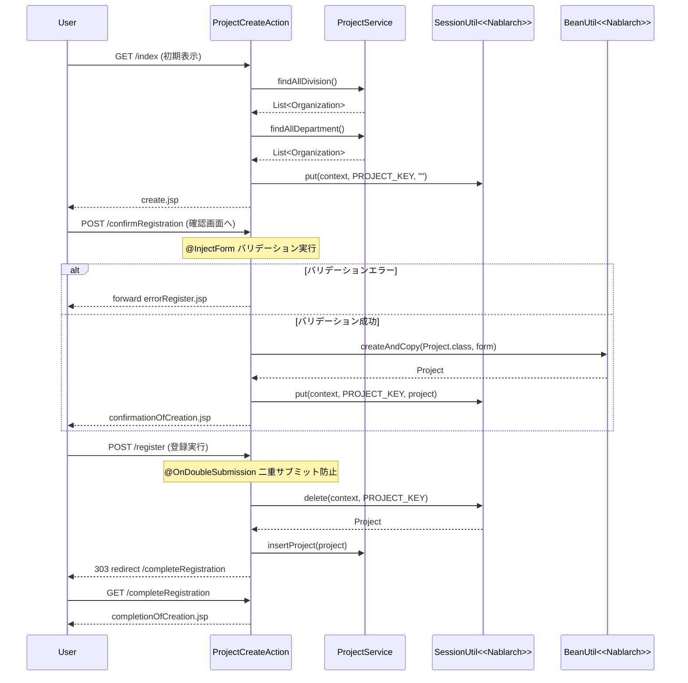

# Code Analysis: ProjectCreateAction

**Generated**: 2026-03-12 17:00:44
**Target**: プロジェクト登録アクション（入力→確認→登録の3ステップフロー）
**Modules**: proman-web
**Analysis Duration**: 約2分41秒

---

## Overview

`ProjectCreateAction` は、プロジェクトの新規登録機能を担うWebアクションクラスです。入力画面表示 → 入力内容確認 → 登録実行 → 完了画面表示という4ステップのフローで構成されています。バリデーションには `@InjectForm` + Bean Validation を使用し、確認画面への遷移時にはセッションストア（`SessionUtil`）にエンティティを保存して二重サブミット防止（`@OnDoubleSubmission`）も実装されています。DB操作は `ProjectService` 経由で `DaoContext`（UniversalDao）を使用します。

---

## Architecture

### Dependency Graph

```mermaid
classDiagram
    class ProjectCreateAction
    class ProjectCreateForm {
        <<Form>>
    }
    class ProjectService
    class Project {
        <<Entity>>
    }
    class Organization {
        <<Entity>>
    }
    class DaoContext {
        <<Nablarch>>
    }
    class SessionUtil {
        <<Nablarch>>
    }
    class BeanUtil {
        <<Nablarch>>
    }
    class ExecutionContext {
        <<Nablarch>>
    }

    ProjectCreateAction ..> ProjectCreateForm : validates
    ProjectCreateAction ..> ProjectService : delegates to
    ProjectCreateAction ..> SessionUtil : stores/retrieves
    ProjectCreateAction ..> BeanUtil : converts
    ProjectCreateAction ..> ExecutionContext : invokes
    ProjectService ..> DaoContext : queries/persists
    ProjectService ..> Project : persists
    ProjectService ..> Organization : queries
    ProjectCreateForm ..|> Serializable : implements
```



**Note**: This diagram uses Mermaid `classDiagram` syntax to show class names and their relationships. Use `--|>` for inheritance (extends/implements) and `..>` for dependencies (uses/creates).

### Component Summary

| Component | Role | Type | Dependencies |
|-----------|------|------|--------------|
| ProjectCreateAction | プロジェクト登録の画面遷移・登録制御 | Action | ProjectCreateForm, ProjectService, SessionUtil, BeanUtil, ExecutionContext |
| ProjectCreateForm | 登録フォームの入力値保持とバリデーション定義 | Form | DateRelationUtil |
| ProjectService | DB操作（登録・組織検索）のサービス層 | Service | DaoContext, Project, Organization |
| Project | プロジェクトエンティティ | Entity | なし |
| Organization | 組織（事業部/部門）エンティティ | Entity | なし |

---

## Flow

### Processing Flow

プロジェクト登録は以下の4ステップで処理されます。

1. **初期表示（index）**: 事業部・部門の一覧をDBから取得してリクエストスコープにセットし、入力画面を表示します。
2. **確認画面表示（confirmRegistration）**: `@InjectForm` でフォームのバリデーションを実行。成功時は `BeanUtil` でフォームをエンティティに変換し、セッションに保存して確認画面へ遷移します。バリデーションエラー時は `@OnError` によりエラーページへフォワードします。
3. **登録実行（register）**: `@OnDoubleSubmission` で二重サブミットを防止。セッションからエンティティを取得し `ProjectService.insertProject()` でDB登録後、303リダイレクトで完了画面へ遷移します。
4. **完了画面表示（completeRegistration）**: 登録完了画面をレスポンスします。
5. **入力画面へ戻る（backToEnterRegistration）**: セッションからエンティティを取得し `BeanUtil` でフォームに変換。日付フォーマット変換後、組織情報を再取得してリクエストスコープにセットし、入力画面へ内部フォワードします。

### Sequence Diagram



---

## Components

### ProjectCreateAction

**ファイル**: [ProjectCreateAction.java](../../.lw/nab-official/v5/nablarch-system-development-guide/Sample_Project/Source_Code/proman-project/proman-web/src/main/java/com/nablarch/example/proman/web/project/ProjectCreateAction.java)

**役割**: プロジェクト登録の一連の画面遷移（入力→確認→登録→完了）を制御するアクションクラス

**主要メソッド**:

- `index(L33-39)`: 初期表示。組織情報をDBから取得してリクエストスコープにセットし、入力画面を返す
- `confirmRegistration(L48-63)`: `@InjectForm` + `@OnError` で入力値を検証。フォームをエンティティに変換してセッション保存し、確認画面へ遷移
- `register(L72-78)`: `@OnDoubleSubmission` で二重サブミット防止。セッションからエンティティを取得してDB登録し、303リダイレクト
- `backToEnterRegistration(L98-118)`: 確認画面からの戻り処理。セッションのエンティティをフォームに変換し日付フォーマット後、入力画面へフォワード
- `setOrganizationAndDivisionToRequestScope(L125-136)`: 事業部・部門リストをDBから取得してリクエストスコープにセットするプライベートメソッド

**依存コンポーネント**: `ProjectCreateForm`, `ProjectService`, `SessionUtil`, `BeanUtil`, `ExecutionContext`

---

### ProjectCreateForm

**ファイル**: [ProjectCreateForm.java](../../.lw/nab-official/v5/nablarch-system-development-guide/Sample_Project/Source_Code/proman-project/proman-web/src/main/java/com/nablarch/example/proman/web/project/ProjectCreateForm.java)

**役割**: プロジェクト登録画面の入力値を保持し、Bean Validationアノテーションでバリデーションルールを定義するフォームクラス

**主要フィールド**:

- `projectName`, `projectType`, `projectClass`: `@Required` + `@Domain` でバリデーション
- `projectStartDate`, `projectEndDate`: 日付形式の検証（`@Domain("date")`）
- `divisionId`, `organizationId`: 組織ID（`@Domain("organizationId")`）
- `isValidProjectPeriod(L329-331)`: `@AssertTrue` でプロジェクト期間の整合性チェック（開始日≤終了日）

**依存コンポーネント**: `DateRelationUtil`（期間検証ユーティリティ）

---

### ProjectService

**ファイル**: [ProjectService.java](../../.lw/nab-official/v5/nablarch-system-development-guide/Sample_Project/Source_Code/proman-project/proman-web/src/main/java/com/nablarch/example/proman/web/project/ProjectService.java)

**役割**: プロジェクト登録に関するDB操作を集約するサービスクラス。`DaoContext`（UniversalDao）でDB操作を実行する

**主要メソッド**:

- `findAllDivision(L50-52)`: 全事業部を `findAllBySqlFile` で取得
- `findAllDepartment(L59-61)`: 全部門を `findAllBySqlFile` で取得
- `findOrganizationById(L70-73)`: 組織IDで1件取得（`findById`）
- `insertProject(L80-82)`: プロジェクトをDB登録（`insert`）

**依存コンポーネント**: `DaoContext`（`DaoFactory.create()` で生成）, `Project`, `Organization`

---

## Nablarch Framework Usage

### InjectForm + OnError

**クラス**: `nablarch.common.web.interceptor.InjectForm`, `nablarch.fw.web.interceptor.OnError`

**説明**: アクションメソッドに付与するインターセプタ。`@InjectForm` はリクエストパラメータをフォームクラスにバインドしてBean Validationを実行する。バリデーションエラー時は `@OnError` で指定したパスへ自動フォワードする。

**使用方法**:
```java
@InjectForm(form = ProjectCreateForm.class, prefix = "form")
@OnError(type = ApplicationException.class, path = "forward:///app/project/errorRegister")
public HttpResponse confirmRegistration(HttpRequest request, ExecutionContext context) {
    ProjectCreateForm form = context.getRequestScopedVar("form");
    // バリデーション済みフォームを利用
}
```

**重要ポイント**:
- ✅ **バリデーション済みフォームの取得**: バリデーション通過後は `context.getRequestScopedVar("form")` でフォームを取得する
- ⚠️ **フォームはSerializableを実装する**: `@InjectForm` を使用する場合、フォームクラスは `Serializable` インタフェースを実装する必要がある
- 💡 **エラー時の自動フォワード**: `@OnError` を組み合わせることで、`ApplicationException` 発生時のフォワード先を宣言的に指定できる

**このコードでの使い方**:
- `confirmRegistration()` (L48-63) でフォームバリデーションを実行し、エラー時は `forward:///app/project/errorRegister` へ遷移

**詳細**: [Web Application Client Create2](../../.claude/skills/nabledge-6/docs/processing-pattern/web-application/web-application-client_create2.md)

---

### SessionUtil

**クラス**: `nablarch.common.web.session.SessionUtil`

**説明**: セッションストアへのオブジェクトの保存・取得・削除を行うユーティリティクラス。確認画面を伴う登録フローで、入力内容を画面間で引き渡すために使用する。

**使用方法**:
```java
// セッションへ保存
SessionUtil.put(context, "projectCreateActionProject", project);

// セッションから取得
Project project = SessionUtil.get(context, "projectCreateActionProject");

// セッションから取得して削除
Project project = SessionUtil.delete(context, "projectCreateActionProject");
```

**重要ポイント**:
- ✅ **フォームではなくエンティティを格納する**: セッションストアにはフォームを格納せず、`BeanUtil` でエンティティに変換してから保存する
- ⚠️ **登録実行後はdeleteで削除する**: `register()` では `SessionUtil.delete()` でエンティティを取得しつつセッションから削除する（ブラウザ戻りによる再登録防止）
- 💡 **画面間のデータ引き渡し**: 確認画面を経由する登録フローで、POSTされたデータを次リクエストへ安全に引き渡せる

**このコードでの使い方**:
- `confirmRegistration()` (L59): エンティティをセッションに保存
- `register()` (L74): セッションからエンティティを取得・削除してDB登録
- `backToEnterRegistration()` (L100): セッションからエンティティを取得して入力画面に戻す

**詳細**: [Web Application Client Create2](../../.claude/skills/nabledge-6/docs/processing-pattern/web-application/web-application-client_create2.md)

---

### OnDoubleSubmission

**クラス**: `nablarch.common.web.token.OnDoubleSubmission`

**説明**: アクションメソッドへの二重サブミット（ダブルクリックやブラウザ更新によるフォームの再送信）を防止するインターセプタ。トークンを使用してサーバサイドで制御する。

**使用方法**:
```java
@OnDoubleSubmission
public HttpResponse register(HttpRequest request, ExecutionContext context) {
    // 二重サブミット時はエラーページへ自動遷移
    final Project project = SessionUtil.delete(context, PROJECT_KEY);
    ProjectService service = new ProjectService();
    service.insertProject(project);
    return new HttpResponse(303, "redirect:///app/project/completeRegistration");
}
```

**重要ポイント**:
- ✅ **登録・更新・削除処理に必ず付与する**: データを変更するアクションメソッドには必ず `@OnDoubleSubmission` を付与する
- ⚠️ **JSPのボタンにもallowDoubleSubmission="false"を設定する**: クライアントサイドでもJavaScriptによる二重クリック防止を行う
- 💡 **サーバサイドでの確実な防止**: JavaScriptが無効な環境でも、サーバサイドのトークン検証で二重実行を防止できる

**このコードでの使い方**:
- `register()` (L72-78) に付与して、プロジェクト登録の二重実行を防止

**詳細**: [Web Application Client Create4](../../.claude/skills/nabledge-6/docs/processing-pattern/web-application/web-application-client_create4.md)

---

### BeanUtil

**クラス**: `nablarch.core.beans.BeanUtil`

**説明**: Java Beans間のプロパティコピーを行うユーティリティクラス。同名プロパティを自動的にマッピングし、フォームからエンティティへの変換や、エンティティからフォームへの変換を簡潔に記述できる。

**使用方法**:
```java
// フォームからエンティティを生成してコピー
Project project = BeanUtil.createAndCopy(Project.class, form);

// エンティティからフォームを生成してコピー
ProjectCreateForm form = BeanUtil.createAndCopy(ProjectCreateForm.class, project);
```

**重要ポイント**:
- ✅ **同名プロパティが自動コピーされる**: フォームとエンティティで同名のプロパティは自動的にコピーされる
- ⚠️ **型が一致しないプロパティはコピーされない**: String型とInteger型など、型が異なる場合はコピーされないため手動設定が必要（L55の `project.setClientId(0)` がその例）
- 💡 **セッション格納前の変換に使う**: フォームをセッションに直接格納せず、エンティティに変換してから格納することが推奨される

**このコードでの使い方**:
- `confirmRegistration()` (L52): フォームからProjectエンティティを生成
- `backToEnterRegistration()` (L101): Projectエンティティからフォームを生成して入力画面に戻す

**詳細**: [Web Application Client Create3](../../.claude/skills/nabledge-6/docs/processing-pattern/web-application/web-application-client_create3.md)

---

### DaoContext (UniversalDao)

**クラス**: `nablarch.common.dao.DaoContext`

**説明**: データベースアクセスを提供するDAOインタフェース。`ProjectService` 内で使用され、SQLファイルを使ったエンティティの検索・登録・更新を行う。

**使用方法**:
```java
// SQLファイルを使った全件取得
List<Organization> divisions = universalDao.findAllBySqlFile(Organization.class, "FIND_ALL_DIVISION");

// 主キーで1件取得
Organization org = universalDao.findById(Organization.class, new Object[]{organizationId});

// 登録
universalDao.insert(project);
```

**重要ポイント**:
- ✅ **SQLファイル名はエンティティクラスと紐付く**: `findAllBySqlFile` の第2引数はSQLファイル内のSQL ID
- 💡 **テスト時はDaoContextをモックに差し替え可能**: `ProjectService(DaoContext)` コンストラクタを使ってDIすることでテストが容易になる

**このコードでの使い方**:
- `ProjectService.findAllDivision()` (L50-52): 事業部一覧取得
- `ProjectService.findAllDepartment()` (L59-61): 部門一覧取得
- `ProjectService.insertProject()` (L80-82): プロジェクト登録

**詳細**: [Web Application Getting Started Project Update](../../.claude/skills/nabledge-6/docs/processing-pattern/web-application/web-application-getting-started-project-update.md)

---

## References

### Source Files

- [ProjectCreateAction.java (.lw/nab-official/v5/nablarch-system-development-guide/en/Sample_Project/Source_Code/proman-project/proman-web/src/main/java/com/nablarch/example/proman/web/project)](../../.lw/nab-official/v5/nablarch-system-development-guide/en/Sample_Project/Source_Code/proman-project/proman-web/src/main/java/com/nablarch/example/proman/web/project/ProjectCreateAction.java) - ProjectCreateAction
- [ProjectCreateAction.java (.lw/nab-official/v5/nablarch-system-development-guide/Sample_Project/Source_Code/proman-project/proman-web/src/main/java/com/nablarch/example/proman/web/project)](../../.lw/nab-official/v5/nablarch-system-development-guide/Sample_Project/Source_Code/proman-project/proman-web/src/main/java/com/nablarch/example/proman/web/project/ProjectCreateAction.java) - ProjectCreateAction
- [ProjectCreateForm.java (.lw/nab-official/v5/nablarch-system-development-guide/en/Sample_Project/Source_Code/proman-project/proman-web/src/main/java/com/nablarch/example/proman/web/project)](../../.lw/nab-official/v5/nablarch-system-development-guide/en/Sample_Project/Source_Code/proman-project/proman-web/src/main/java/com/nablarch/example/proman/web/project/ProjectCreateForm.java) - ProjectCreateForm
- [ProjectCreateForm.java (.lw/nab-official/v5/nablarch-system-development-guide/Sample_Project/Source_Code/proman-project/proman-web/src/main/java/com/nablarch/example/proman/web/project)](../../.lw/nab-official/v5/nablarch-system-development-guide/Sample_Project/Source_Code/proman-project/proman-web/src/main/java/com/nablarch/example/proman/web/project/ProjectCreateForm.java) - ProjectCreateForm
- [ProjectService.java (.lw/nab-official/v5/nablarch-system-development-guide/en/Sample_Project/Source_Code/proman-project/proman-web/src/main/java/com/nablarch/example/proman/web/project)](../../.lw/nab-official/v5/nablarch-system-development-guide/en/Sample_Project/Source_Code/proman-project/proman-web/src/main/java/com/nablarch/example/proman/web/project/ProjectService.java) - ProjectService
- [ProjectService.java (.lw/nab-official/v5/nablarch-system-development-guide/Sample_Project/Source_Code/proman-project/proman-web/src/main/java/com/nablarch/example/proman/web/project)](../../.lw/nab-official/v5/nablarch-system-development-guide/Sample_Project/Source_Code/proman-project/proman-web/src/main/java/com/nablarch/example/proman/web/project/ProjectService.java) - ProjectService

### Knowledge Base (Nabledge-6)

- [Web Application Client_create2](../../.claude/skills/nabledge-6/docs/processing-pattern/web-application/web-application-client_create2.md)
- [Web Application Client_create4](../../.claude/skills/nabledge-6/docs/processing-pattern/web-application/web-application-client_create4.md)
- [Web Application Client_create3](../../.claude/skills/nabledge-6/docs/processing-pattern/web-application/web-application-client_create3.md)
- [Web Application Getting Started Project Update](../../.claude/skills/nabledge-6/docs/processing-pattern/web-application/web-application-getting-started-project-update.md)

### Official Documentation


- [BeanUtil](https://nablarch.github.io/docs/LATEST/javadoc/nablarch/core/beans/BeanUtil.html)
- [Client Create2](https://nablarch.github.io/docs/LATEST/doc/application_framework/application_framework/web/getting_started/client_create/client_create2.html)
- [Client Create3](https://nablarch.github.io/docs/LATEST/doc/application_framework/application_framework/web/getting_started/client_create/client_create3.html)
- [Client Create4](https://nablarch.github.io/docs/LATEST/doc/application_framework/application_framework/web/getting_started/client_create/client_create4.html)
- [Index](https://nablarch.github.io/docs/LATEST/doc/application_framework/application_framework/web/getting_started/project_update/index.html)
- [InjectForm](https://nablarch.github.io/docs/LATEST/javadoc/nablarch/common/web/interceptor/InjectForm.html)
- [NoDataException](https://nablarch.github.io/docs/LATEST/javadoc/nablarch/common/dao/NoDataException.html)
- [OnDoubleSubmission](https://nablarch.github.io/docs/LATEST/javadoc/nablarch/common/web/token/OnDoubleSubmission.html)
- [OnError](https://nablarch.github.io/docs/LATEST/javadoc/nablarch/fw/web/interceptor/OnError.html)
- [Required](https://nablarch.github.io/docs/LATEST/javadoc/nablarch/core/validation/ee/Required.html)
- [ResourceLocator](https://nablarch.github.io/docs/LATEST/javadoc/nablarch/fw/web/ResourceLocator.html)
- [SessionUtil](https://nablarch.github.io/docs/LATEST/javadoc/nablarch/common/web/session/SessionUtil.html)
- [UniversalDao](https://nablarch.github.io/docs/LATEST/javadoc/nablarch/common/dao/UniversalDao.html)

---

**Note**: This documentation was generated by the code-analysis workflow of the nabledge-6 skill.
