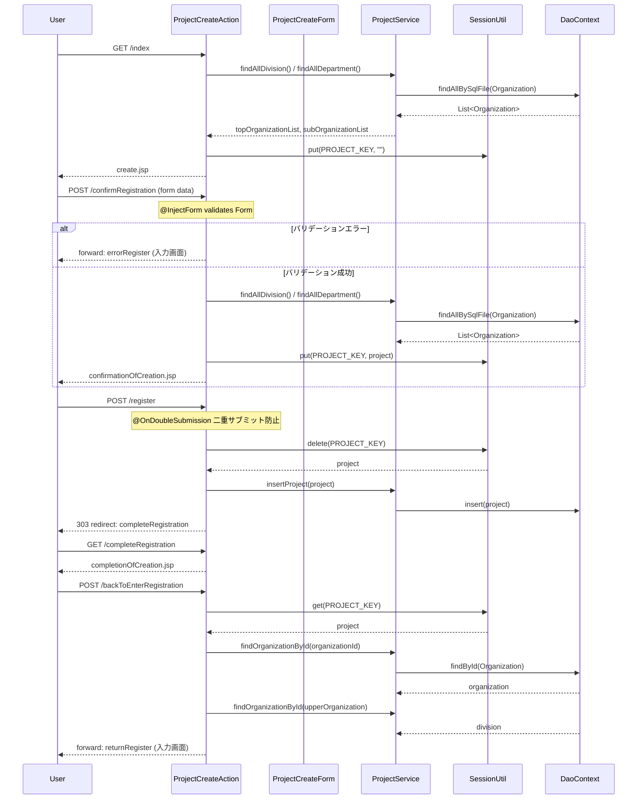

# Code Analysis: ProjectCreateAction

**Generated**: 2026-03-12 17:51:39
**Target**: プロジェクト登録処理（入力・確認・登録・完了画面の遷移制御）
**Modules**: proman-web
**Analysis Duration**: 約3分13秒

---

## Overview

`ProjectCreateAction` は、プロジェクトの新規登録に関わる画面フローを制御するアクションクラスです。入力画面 → 確認画面 → 登録完了という典型的なウェブ登録フローを実装しています。

主な処理は以下の5つのメソッドで構成されます：入力初期表示（`index`）、登録確認画面表示（`confirmRegistration`）、DB登録実行（`register`）、登録完了画面表示（`completeRegistration`）、入力画面への戻り（`backToEnterRegistration`）。

フォームバリデーションに `@InjectForm`、エラーハンドリングに `@OnError`、二重サブミット防止に `@OnDoubleSubmission` を活用し、セッションストア（`SessionUtil`）を使って確認画面 ↔ 入力画面間でエンティティデータを受け渡します。

---

## Architecture

### Dependency Graph

```mermaid
classDiagram
    class ProjectCreateAction
    class ProjectCreateForm {
        <<Form>>
    }
    class ProjectService
    class Project {
        <<Entity>>
    }
    class Organization {
        <<Entity>>
    }
    class SessionUtil {
        <<Nablarch>>
    }
    class BeanUtil {
        <<Nablarch>>
    }
    class ExecutionContext {
        <<Nablarch>>
    }
    class DaoContext {
        <<Nablarch>>
    }

    ProjectCreateAction ..> ProjectCreateForm : validates
    ProjectCreateAction ..> ProjectService : delegates to
    ProjectCreateAction ..> SessionUtil : persists
    ProjectCreateAction ..> BeanUtil : converts
    ProjectCreateAction ..> ExecutionContext : queries
    ProjectCreateForm ..|> Serializable
    ProjectService ..> DaoContext : queries
    ProjectService ..> Project : persists
    ProjectService ..> Organization : queries
```



**Note**: This diagram uses Mermaid `classDiagram` syntax to show class names and their relationships. Use `--|>` for inheritance (extends/implements) and `..>` for dependencies (uses/creates).

### Component Summary

| Component | Role | Type | Dependencies |
|-----------|------|------|--------------|
| ProjectCreateAction | プロジェクト登録フロー制御 | Action | ProjectCreateForm, ProjectService, SessionUtil, BeanUtil, ExecutionContext |
| ProjectCreateForm | 登録入力値バリデーション | Form | DateRelationUtil |
| ProjectService | プロジェクト・組織のDB操作 | Service | DaoContext, Project, Organization |
| Project | プロジェクトエンティティ | Entity | なし |
| Organization | 組織（事業部/部門）エンティティ | Entity | なし |

---

## Flow

### Processing Flow

登録処理は入力 → 確認 → 登録 → 完了の4画面フローで構成されます。

1. **入力画面表示（index）**: 事業部・部門リストをDBから取得してリクエストスコープに設定し、入力JSPへ遷移。セッションをクリア（空文字列で上書き）する。

2. **確認画面表示（confirmRegistration）**: `@InjectForm` でフォームをバリデーション。エラー時は `@OnError` で入力画面（`errorRegister`）へフォワード。正常時は `BeanUtil.createAndCopy` でフォームを `Project` エンティティに変換してセッションに保存し、確認JSPへ遷移。

3. **DB登録（register）**: `@OnDoubleSubmission` で二重サブミットを防止。セッションからエンティティを取得（`SessionUtil.delete`）して削除後、`ProjectService.insertProject` でDBへ挿入。303リダイレクトで完了画面へ遷移。

4. **登録完了表示（completeRegistration）**: 完了JSPへ遷移するのみ。

5. **入力画面へ戻る（backToEnterRegistration）**: セッションからエンティティを取得し `BeanUtil` でフォームに変換。日付を表示形式（yyyy/MM/dd）にフォーマットし直す。組織情報をDBから再取得して事業部IDをフォームにセット。内部フォワードで入力画面へ戻る。

### Sequence Diagram



---

## Components

### ProjectCreateAction

**ファイル**: [ProjectCreateAction.java](../../.lw/nab-official/v5/nablarch-system-development-guide/Sample_Project/Source_Code/proman-project/proman-web/src/main/java/com/nablarch/example/proman/web/project/ProjectCreateAction.java)

**役割**: プロジェクト登録の画面フロー全体を制御するアクションクラス。

**主要メソッド**:

- `index(L33-39)`: 入力初期画面を表示。`setOrganizationAndDivisionToRequestScope` を呼び出してプルダウン用データを設定。
- `confirmRegistration(L48-63)`: `@InjectForm` でバリデーション実行。フォームをエンティティに変換してセッション保存後、確認画面へ遷移。
- `register(L72-78)`: `@OnDoubleSubmission` で二重送信防止。セッションからエンティティ取得・削除後にDB登録し、303リダイレクト。
- `backToEnterRegistration(L98-118)`: セッションからエンティティを取得しフォームに変換。日付フォーマット変換と組織情報の再取得を行って入力画面へ戻る。

**依存関係**: ProjectCreateForm, ProjectService, SessionUtil, BeanUtil, DateUtil, ExecutionContext

**実装上の注意点**:
- セッションキー `PROJECT_KEY` はクラス定数として定義（L25）
- `index` メソッドで `SessionUtil.put(context, PROJECT_KEY, "")` を呼ぶことでセッションを初期化（L132）
- 顧客ID（`clientId`）は未実装のためハードコード `0` を設定（L55）

---

### ProjectCreateForm

**ファイル**: [ProjectCreateForm.java](../../.lw/nab-official/v5/nablarch-system-development-guide/Sample_Project/Source_Code/proman-project/proman-web/src/main/java/com/nablarch/example/proman/web/project/ProjectCreateForm.java)

**役割**: プロジェクト登録画面の入力値を受け取りバリデーションするフォームクラス。

**主要メソッド**:

- `isValidProjectPeriod(L329-331)`: `@AssertTrue` アノテーションで開始日・終了日の前後関係を検証。`DateRelationUtil.isValid` を利用。

**依存関係**: DateRelationUtil

**実装上の注意点**:
- `Serializable` を実装（セッションストア格納要件）
- 全入力項目を `String` 型で宣言（Bean Validationの要件）
- `@Required` + `@Domain` でドメインバリデーションを適用
- `clientId` はTODOコメントあり（現時点で必須バリデーション未設定）

---

### ProjectService

**ファイル**: [ProjectService.java](../../.lw/nab-official/v5/nablarch-system-development-guide/Sample_Project/Source_Code/proman-project/proman-web/src/main/java/com/nablarch/example/proman/web/project/ProjectService.java)

**役割**: プロジェクトと組織のDB操作を集約したサービスクラス。

**主要メソッド**:

- `findAllDivision(L50-52)`: 全事業部を取得（`findAllBySqlFile` + SQLファイル `FIND_ALL_DIVISION`）
- `findAllDepartment(L59-61)`: 全部門を取得（`findAllBySqlFile` + SQLファイル `FIND_ALL_DEPARTMENT`）
- `findOrganizationById(L70-73)`: 指定IDの組織を取得（`findById`）
- `insertProject(L80-82)`: プロジェクトをDBに挿入（`insert`）

**依存関係**: DaoContext（UniversalDao）, Project, Organization

**実装上の注意点**:
- `DaoFactory.create()` でDaoContextを生成（DIコンテナではなくファクトリ経由）
- テスト用にパッケージプライベートコンストラクタで DaoContext を注入可能

---

## Nablarch Framework Usage

### @InjectForm / @OnError

**クラス**: `nablarch.common.web.interceptor.InjectForm` / `nablarch.fw.web.interceptor.OnError`

**説明**: `@InjectForm` はリクエストパラメータをフォームクラスに自動バインドし Bean Validation を実行するインターセプタ。`@OnError` はバリデーション例外発生時の遷移先を指定する。

**使用方法**:
```java
@InjectForm(form = ProjectCreateForm.class, prefix = "form")
@OnError(type = ApplicationException.class, path = "forward:///app/project/errorRegister")
public HttpResponse confirmRegistration(HttpRequest request, ExecutionContext context) {
    ProjectCreateForm form = context.getRequestScopedVar("form");
    // ...
}
```

**重要ポイント**:
- ✅ **バリデーション済みフォームの取得**: `context.getRequestScopedVar("form")` でバリデーション後のフォームオブジェクトを取得する
- ⚠️ **`prefix` 属性**: JSPのフォーム入力タグの `name` 属性のプレフィックスと一致させること（例: `form.projectName`）
- 💡 **エラー時フォワード**: `@OnError` の `path` に内部フォワードを指定することで、プルダウン用データの再取得処理を再利用できる

**このコードでの使い方**:
- `confirmRegistration` メソッド（L48-49）でフォームバリデーションを実行
- エラー時は `errorRegister` パスへフォワード

**詳細**: [Web Application Client_create2](../../.claude/skills/nabledge-6/docs/processing-pattern/web-application/web-application-client_create2.md)

---

### SessionUtil

**クラス**: `nablarch.common.web.session.SessionUtil`

**説明**: セッションストアへのデータ保存・取得・削除を行うユーティリティクラス。フォームから変換したエンティティを確認画面との間で受け渡すために使用する。

**使用方法**:
```java
// 保存
SessionUtil.put(context, PROJECT_KEY, project);

// 取得（削除なし）
Project project = SessionUtil.get(context, PROJECT_KEY);

// 取得して削除
Project project = SessionUtil.delete(context, PROJECT_KEY);
```

**重要ポイント**:
- ✅ **フォームではなくエンティティを格納**: セッションストアにはフォームをそのまま格納せず、`BeanUtil.createAndCopy` でエンティティに変換してから格納する
- ✅ **登録時は `delete` で取得**: `register` メソッドで `SessionUtil.delete` を使うことで取得とセッションクリアを同時に行える（L74）
- ⚠️ **セッションへの格納は `Serializable` 実装必須**: `ProjectCreateForm` が `Serializable` を実装しているのはこのため

**このコードでの使い方**:
- `confirmRegistration`（L59）でエンティティ変換後に保存
- `register`（L74）でセッションから取得・削除後にDB登録
- `backToEnterRegistration`（L100）で取得してフォームへ復元
- `setOrganizationAndDivisionToRequestScope`（L132）でセッション初期化

**詳細**: [Web Application Client_create4](../../.claude/skills/nabledge-6/docs/processing-pattern/web-application/web-application-client_create4.md)

---

### @OnDoubleSubmission

**クラス**: `nablarch.common.web.token.OnDoubleSubmission`

**説明**: ブラウザの二重サブミット（連打・リロード等）を防止するインターセプタ。サーバサイドでトークン検証を行う。

**使用方法**:
```java
@OnDoubleSubmission
public HttpResponse register(HttpRequest request, ExecutionContext context) {
    // 二重サブミットが検出された場合はこのメソッドが実行されずエラーページへ遷移
}
```

**重要ポイント**:
- ✅ **登録・更新・削除メソッドに必ず付与**: 特にDB更新を伴うメソッドへの付与が必要
- 💡 **JSP側でのトークン設定も必要**: `<n:form useToken="true">` または `allowDoubleSubmission="false"` と組み合わせる
- ⚠️ **JavaScriptが無効な場合も考慮**: JSだけでなくサーバサイドでも制御することで確実に二重登録を防止できる

**このコードでの使い方**:
- `register` メソッド（L72）に付与して二重クリックによる重複登録を防止

**詳細**: [Web Application Client_create4](../../.claude/skills/nabledge-6/docs/processing-pattern/web-application/web-application-client_create4.md)

---

### BeanUtil

**クラス**: `nablarch.core.beans.BeanUtil`

**説明**: Java Beanのプロパティコピーを行うユーティリティクラス。フォームからエンティティへの変換、またはエンティティからフォームへの復元に使用する。

**使用方法**:
```java
// フォーム → エンティティ（新規生成）
Project project = BeanUtil.createAndCopy(Project.class, form);

// エンティティ → フォーム（新規生成）
ProjectCreateForm form = BeanUtil.createAndCopy(ProjectCreateForm.class, project);
```

**重要ポイント**:
- 💡 **同名プロパティを自動コピー**: フォームとエンティティで同名のプロパティが自動的にコピーされるため、手動でのセッターによるコピーが不要
- ⚠️ **型変換に注意**: フォームは全プロパティ `String` 型、エンティティは各型。型変換ルールを把握しておく

**このコードでの使い方**:
- `confirmRegistration`（L52）: フォーム → Projectエンティティへ変換してセッションに保存
- `backToEnterRegistration`（L101）: Projectエンティティ → フォームへ変換して入力画面に戻す

**詳細**: [Web Application Client_create3](../../.claude/skills/nabledge-6/docs/processing-pattern/web-application/web-application-client_create3.md)

---

## References

### Source Files

- [ProjectCreateAction.java (.lw/nab-official/v5/nablarch-system-development-guide/en/Sample_Project/Source_Code/proman-project/proman-web/src/main/java/com/nablarch/example/proman/web/project)](../../.lw/nab-official/v5/nablarch-system-development-guide/en/Sample_Project/Source_Code/proman-project/proman-web/src/main/java/com/nablarch/example/proman/web/project/ProjectCreateAction.java) - ProjectCreateAction
- [ProjectCreateAction.java (.lw/nab-official/v5/nablarch-system-development-guide/Sample_Project/Source_Code/proman-project/proman-web/src/main/java/com/nablarch/example/proman/web/project)](../../.lw/nab-official/v5/nablarch-system-development-guide/Sample_Project/Source_Code/proman-project/proman-web/src/main/java/com/nablarch/example/proman/web/project/ProjectCreateAction.java) - ProjectCreateAction
- [ProjectCreateForm.java (.lw/nab-official/v5/nablarch-system-development-guide/en/Sample_Project/Source_Code/proman-project/proman-web/src/main/java/com/nablarch/example/proman/web/project)](../../.lw/nab-official/v5/nablarch-system-development-guide/en/Sample_Project/Source_Code/proman-project/proman-web/src/main/java/com/nablarch/example/proman/web/project/ProjectCreateForm.java) - ProjectCreateForm
- [ProjectCreateForm.java (.lw/nab-official/v5/nablarch-system-development-guide/Sample_Project/Source_Code/proman-project/proman-web/src/main/java/com/nablarch/example/proman/web/project)](../../.lw/nab-official/v5/nablarch-system-development-guide/Sample_Project/Source_Code/proman-project/proman-web/src/main/java/com/nablarch/example/proman/web/project/ProjectCreateForm.java) - ProjectCreateForm
- [ProjectService.java (.lw/nab-official/v5/nablarch-system-development-guide/en/Sample_Project/Source_Code/proman-project/proman-web/src/main/java/com/nablarch/example/proman/web/project)](../../.lw/nab-official/v5/nablarch-system-development-guide/en/Sample_Project/Source_Code/proman-project/proman-web/src/main/java/com/nablarch/example/proman/web/project/ProjectService.java) - ProjectService
- [ProjectService.java (.lw/nab-official/v5/nablarch-system-development-guide/Sample_Project/Source_Code/proman-project/proman-web/src/main/java/com/nablarch/example/proman/web/project)](../../.lw/nab-official/v5/nablarch-system-development-guide/Sample_Project/Source_Code/proman-project/proman-web/src/main/java/com/nablarch/example/proman/web/project/ProjectService.java) - ProjectService

### Knowledge Base (Nabledge-6)

- [Web Application Client_create2](../../.claude/skills/nabledge-6/docs/processing-pattern/web-application/web-application-client_create2.md)
- [Web Application Client_create4](../../.claude/skills/nabledge-6/docs/processing-pattern/web-application/web-application-client_create4.md)
- [Web Application Client_create3](../../.claude/skills/nabledge-6/docs/processing-pattern/web-application/web-application-client_create3.md)

### Official Documentation

- [BeanUtil](https://nablarch.github.io/docs/LATEST/javadoc/nablarch/core/beans/BeanUtil.html)
- [Client Create2](https://nablarch.github.io/docs/LATEST/doc/application_framework/application_framework/web/getting_started/client_create/client_create2.html)
- [Client Create3](https://nablarch.github.io/docs/LATEST/doc/application_framework/application_framework/web/getting_started/client_create/client_create3.html)
- [Client Create4](https://nablarch.github.io/docs/LATEST/doc/application_framework/application_framework/web/getting_started/client_create/client_create4.html)
- [InjectForm](https://nablarch.github.io/docs/LATEST/javadoc/nablarch/common/web/interceptor/InjectForm.html)
- [OnDoubleSubmission](https://nablarch.github.io/docs/LATEST/javadoc/nablarch/common/web/token/OnDoubleSubmission.html)
- [OnError](https://nablarch.github.io/docs/LATEST/javadoc/nablarch/fw/web/interceptor/OnError.html)
- [Required](https://nablarch.github.io/docs/LATEST/javadoc/nablarch/core/validation/ee/Required.html)
- [SessionUtil](https://nablarch.github.io/docs/LATEST/javadoc/nablarch/common/web/session/SessionUtil.html)

---

**Note**: This documentation was generated by the code-analysis workflow of the nabledge-6 skill.
