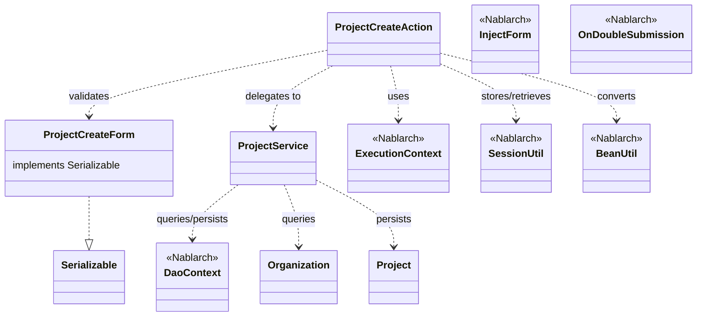
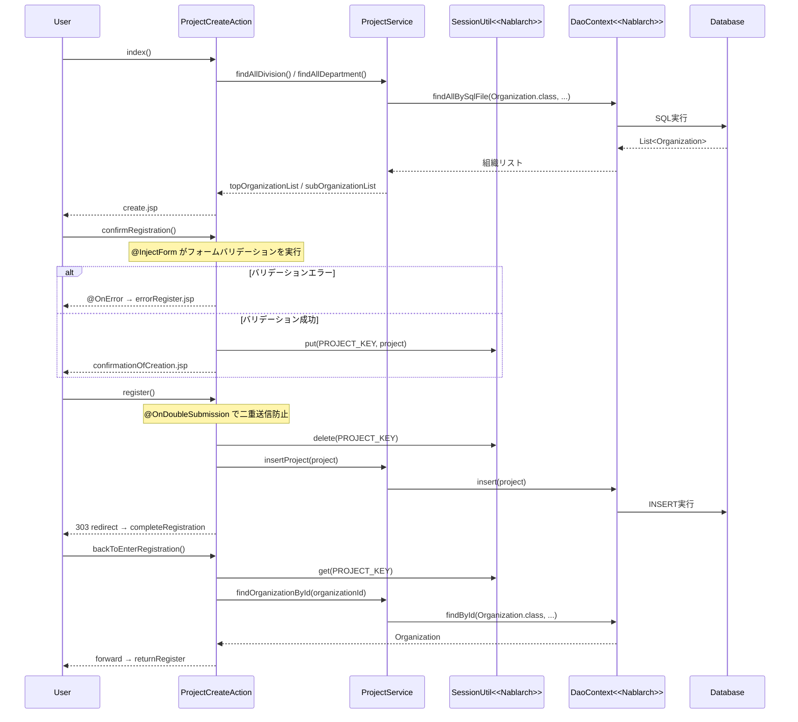

# Code Analysis: ProjectCreateAction

**Generated**: 2026-03-12 17:05:56
**Target**: プロジェクト登録アクション（入力→確認→登録の画面遷移）
**Modules**: proman-web
**Analysis Duration**: 約2分48秒

---

## Overview

`ProjectCreateAction` は、Nablarch Webアプリケーションにおけるプロジェクト登録機能のアクションクラスです。入力画面表示・確認画面遷移・登録実行・完了画面表示・入力画面への戻りという5つのアクションメソッドで構成される、典型的な「入力→確認→登録」パターンを実装しています。

フォームバリデーションには `@InjectForm` + `@OnError` アノテーション、二重送信防止には `@OnDoubleSubmission` アノテーション、画面間のデータ受け渡しには `SessionUtil` を活用しています。データアクセスは `ProjectService` 経由で `DaoContext`（UniversalDAO）を使用しています。

---

## Architecture

### Dependency Graph



**Note**: This diagram uses Mermaid `classDiagram` syntax to show class names and their relationships. Use `--|>` for inheritance (extends/implements) and `..>` for dependencies (uses/creates).

### Component Summary

| Component | Role | Type | Dependencies |
|-----------|------|------|--------------|
| ProjectCreateAction | プロジェクト登録の画面遷移制御 | Action | ProjectCreateForm, ProjectService, SessionUtil, BeanUtil, ExecutionContext |
| ProjectCreateForm | 登録入力値のバリデーション | Form | なし（@Required, @Domain アノテーション） |
| ProjectService | DBアクセスのサービス層 | Service | DaoContext (UniversalDAO), Project, Organization |
| Project | プロジェクトエンティティ | Entity | なし |
| Organization | 組織エンティティ | Entity | なし |

---

## Flow

### Processing Flow

登録処理は5つのフェーズで構成されます。

1. **初期表示（index）**: 事業部・部門リストをDBから取得してリクエストスコープに設定し、登録入力画面（`create.jsp`）を表示する。
2. **確認画面遷移（confirmRegistration）**: `@InjectForm` によりフォームバリデーションを実行。バリデーション通過後、フォームを `Project` エンティティに変換して `SessionUtil` に保存し、確認画面（`confirmationOfCreation.jsp`）を表示する。バリデーションエラー時は `@OnError` によりエラー画面にフォワードされる。
3. **登録実行（register）**: `@OnDoubleSubmission` で二重送信を防止。セッションから `Project` を取り出し、`ProjectService.insertProject()` でDB登録。登録完了後は303リダイレクトで完了画面へ遷移する。
4. **完了画面表示（completeRegistration）**: 完了画面（`completionOfCreation.jsp`）を返すのみのシンプルなメソッド。
5. **入力画面への戻り（backToEnterRegistration）**: セッションから `Project` を取得し `BeanUtil` でフォームに変換。日付フォーマット変換後、組織情報を再取得してリクエストスコープに設定し、入力画面へフォワードする。

### Sequence Diagram



---

## Components

### ProjectCreateAction

**ファイル**: [ProjectCreateAction.java](../../.lw/nab-official/v5/nablarch-system-development-guide/Sample_Project/Source_Code/proman-project/proman-web/src/main/java/com/nablarch/example/proman/web/project/ProjectCreateAction.java)

**役割**: プロジェクト登録機能のコントローラ。入力→確認→登録の画面遷移を管理する。

**主要メソッド**:

- `index()` (L33-39): 登録入力画面の初期表示。事業部・部門リストを取得してリクエストスコープにセット。
- `confirmRegistration()` (L48-63): `@InjectForm` + `@OnError` でバリデーション実行。`BeanUtil.createAndCopy` でフォームをエンティティ変換後、`SessionUtil.put` でセッション保存。
- `register()` (L72-78): `@OnDoubleSubmission` 付き登録メソッド。`SessionUtil.delete` でセッションから取得しDBへ登録。303リダイレクト。
- `backToEnterRegistration()` (L98-118): セッションから取得して日付フォーマット変換後、組織情報を再取得し入力画面へフォワード。

**依存関係**: ProjectCreateForm, ProjectService, SessionUtil, BeanUtil, ExecutionContext, DateUtil

---

### ProjectCreateForm

**ファイル**: [ProjectCreateForm.java](../../.lw/nab-official/v5/nablarch-system-development-guide/Sample_Project/Source_Code/proman-project/proman-web/src/main/java/com/nablarch/example/proman/web/project/ProjectCreateForm.java)

**役割**: プロジェクト登録画面の入力値バリデーション用フォームクラス。

**主要フィールド**: projectName, projectType, projectClass, projectStartDate, projectEndDate, divisionId, organizationId, pmKanjiName, plKanjiName, note, salesAmount（全てString型）

**主要メソッド**:
- `isValidProjectPeriod()` (L329-331): `@AssertTrue` による開始日・終了日の相関バリデーション。

**依存関係**: DateRelationUtil（日付相関チェック）

---

### ProjectService

**ファイル**: [ProjectService.java](../../.lw/nab-official/v5/nablarch-system-development-guide/Sample_Project/Source_Code/proman-project/proman-web/src/main/java/com/nablarch/example/proman/web/project/ProjectService.java)

**役割**: プロジェクト登録機能のデータアクセス層。UniversalDAO（DaoContext）ラッパー。

**主要メソッド**:
- `findAllDivision()` (L50-52): 全事業部取得。SQLファイル `FIND_ALL_DIVISION` を使用。
- `findAllDepartment()` (L59-61): 全部門取得。SQLファイル `FIND_ALL_DEPARTMENT` を使用。
- `findOrganizationById(Integer)` (L70-73): 組織ID指定の1件取得。
- `insertProject(Project)` (L80-82): プロジェクト1件登録。`universalDao.insert()` 呼び出し。

**依存関係**: DaoContext（UniversalDAO）, Project, Organization

---

## Nablarch Framework Usage

### InjectForm

**クラス**: `nablarch.common.web.interceptor.InjectForm`

**説明**: アクションメソッドにアノテーションを付与するだけでフォームのバリデーションを自動実行し、結果をリクエストスコープに格納するインターセプタ。

**使用方法**:
```java
@InjectForm(form = ProjectCreateForm.class, prefix = "form")
@OnError(type = ApplicationException.class, path = "forward:///app/project/errorRegister")
public HttpResponse confirmRegistration(HttpRequest request, ExecutionContext context) {
    ProjectCreateForm form = context.getRequestScopedVar("form");
    // バリデーション済みフォームを取得
}
```

**重要ポイント**:
- ✅ **`@OnError` とセットで使う**: バリデーションエラー時の遷移先を必ず指定する。`ApplicationException` が発生するとそのパスへフォワードされる。
- ⚠️ **フォームは `Serializable` を実装する**: `@InjectForm` 使用時はフォームクラスが `Serializable` を実装している必要がある。
- 💡 **リクエストスコープから取得**: バリデーション後は `context.getRequestScopedVar("form")` でバリデーション済みオブジェクトを取得できる。

**このコードでの使い方**:
- `confirmRegistration()` メソッド (L48-49) に付与してフォームバリデーションを実行

**詳細**: [Web Application Client Create2](../../.claude/skills/nabledge-6/docs/processing-pattern/web-application/web-application-client_create2.md)

---

### SessionUtil

**クラス**: `nablarch.common.web.session.SessionUtil`

**説明**: セッションストアへのデータ保存・取得・削除を行うユーティリティクラス。画面遷移間のデータ受け渡しに使用する。

**使用方法**:
```java
// 保存
SessionUtil.put(context, "projectCreateActionProject", project);

// 取得
Project project = SessionUtil.get(context, "projectCreateActionProject");

// 取得して削除
Project project = SessionUtil.delete(context, "projectCreateActionProject");
```

**重要ポイント**:
- ✅ **フォームをセッションに格納しない**: セッションに格納するのはエンティティ（Bean）。`BeanUtil.createAndCopy` でフォームから変換してから格納する。
- ⚠️ **`delete` で取得する**: 登録処理（`register()`）では `SessionUtil.delete()` を使用してセッションからデータを取得し、同時にセッションをクリアする。
- 💡 **初期表示でセッションクリア**: `index()` 側で `SessionUtil.put(context, PROJECT_KEY, "")` により空文字でリセットし、古いセッションデータが残らないようにしている。

**このコードでの使い方**:
- `confirmRegistration()` (L59): `put` でプロジェクトをセッション保存
- `register()` (L74): `delete` でセッションから取得して削除
- `backToEnterRegistration()` (L100): `get` でセッションからフォームデータを取得

**詳細**: [Web Application Client Create2](../../.claude/skills/nabledge-6/docs/processing-pattern/web-application/web-application-client_create2.md)

---

### BeanUtil

**クラス**: `nablarch.core.beans.BeanUtil`

**説明**: JavaBeans間のプロパティコピーを行うユーティリティクラス。フォームとエンティティの変換に使用する。

**使用方法**:
```java
// フォームからエンティティを生成（新規インスタンス作成+コピー）
Project project = BeanUtil.createAndCopy(Project.class, form);

// エンティティからフォームを生成
ProjectCreateForm form = BeanUtil.createAndCopy(ProjectCreateForm.class, project);
```

**重要ポイント**:
- ✅ **型変換が自動実行される**: 同名プロパティが自動的にコピーされる。String→String の変換が基本。
- ⚠️ **プロパティ名が一致する必要がある**: フォームとエンティティのプロパティ名が一致しない場合はコピーされない。
- 💡 **セッション保存前の変換に使う**: フォームをそのままセッションに保存せず、エンティティに変換してから保存するパターンが推奨される。

**このコードでの使い方**:
- `confirmRegistration()` (L52): フォームからプロジェクトエンティティを生成
- `backToEnterRegistration()` (L101): プロジェクトエンティティからフォームを生成

**詳細**: [Libraries Update Example](../../.claude/skills/nabledge-6/docs/component/libraries/libraries-update_example.md)

---

### OnDoubleSubmission

**クラス**: `nablarch.common.web.token.OnDoubleSubmission`

**説明**: 二重送信防止のためのアノテーション。同一トークンでの二重サブミットを検知してエラー処理するインターセプタ。

**使用方法**:
```java
@OnDoubleSubmission
public HttpResponse register(HttpRequest request, ExecutionContext context) {
    // 登録処理
}
```

**重要ポイント**:
- ✅ **登録・更新・削除メソッドに必ず付与**: データを変更する全アクションメソッドに付与して二重送信を防止する。
- 💡 **JSP側でトークン発行が必要**: `<n:form useToken="true">` でトークンを発行し、サーバ側で検証する。
- ⚠️ **リダイレクトと組み合わせる**: 登録後は303リダイレクトで完了画面へ遷移させ、ブラウザのリロードによる再実行を防止する。

**このコードでの使い方**:
- `register()` (L72): プロジェクト登録処理に付与して二重送信防止

**詳細**: [Web Application Getting Started Project Delete](../../.claude/skills/nabledge-6/docs/processing-pattern/web-application/web-application-getting-started-project-delete.md)

---

## References

### Source Files

- [ProjectCreateAction.java (.lw/nab-official/v5/nablarch-system-development-guide/en/Sample_Project/Source_Code/proman-project/proman-web/src/main/java/com/nablarch/example/proman/web/project)](../../.lw/nab-official/v5/nablarch-system-development-guide/en/Sample_Project/Source_Code/proman-project/proman-web/src/main/java/com/nablarch/example/proman/web/project/ProjectCreateAction.java) - ProjectCreateAction
- [ProjectCreateAction.java (.lw/nab-official/v5/nablarch-system-development-guide/Sample_Project/Source_Code/proman-project/proman-web/src/main/java/com/nablarch/example/proman/web/project)](../../.lw/nab-official/v5/nablarch-system-development-guide/Sample_Project/Source_Code/proman-project/proman-web/src/main/java/com/nablarch/example/proman/web/project/ProjectCreateAction.java) - ProjectCreateAction
- [ProjectCreateForm.java (.lw/nab-official/v5/nablarch-system-development-guide/en/Sample_Project/Source_Code/proman-project/proman-web/src/main/java/com/nablarch/example/proman/web/project)](../../.lw/nab-official/v5/nablarch-system-development-guide/en/Sample_Project/Source_Code/proman-project/proman-web/src/main/java/com/nablarch/example/proman/web/project/ProjectCreateForm.java) - ProjectCreateForm
- [ProjectCreateForm.java (.lw/nab-official/v5/nablarch-system-development-guide/Sample_Project/Source_Code/proman-project/proman-web/src/main/java/com/nablarch/example/proman/web/project)](../../.lw/nab-official/v5/nablarch-system-development-guide/Sample_Project/Source_Code/proman-project/proman-web/src/main/java/com/nablarch/example/proman/web/project/ProjectCreateForm.java) - ProjectCreateForm
- [ProjectService.java (.lw/nab-official/v5/nablarch-system-development-guide/en/Sample_Project/Source_Code/proman-project/proman-web/src/main/java/com/nablarch/example/proman/web/project)](../../.lw/nab-official/v5/nablarch-system-development-guide/en/Sample_Project/Source_Code/proman-project/proman-web/src/main/java/com/nablarch/example/proman/web/project/ProjectService.java) - ProjectService
- [ProjectService.java (.lw/nab-official/v5/nablarch-system-development-guide/Sample_Project/Source_Code/proman-project/proman-web/src/main/java/com/nablarch/example/proman/web/project)](../../.lw/nab-official/v5/nablarch-system-development-guide/Sample_Project/Source_Code/proman-project/proman-web/src/main/java/com/nablarch/example/proman/web/project/ProjectService.java) - ProjectService

### Knowledge Base (Nabledge-6)

- [Web Application Getting Started Project Update](../../.claude/skills/nabledge-6/docs/processing-pattern/web-application/web-application-getting-started-project-update.md)
- [Web Application Client_create2](../../.claude/skills/nabledge-6/docs/processing-pattern/web-application/web-application-client_create2.md)
- [Web Application Client_create3](../../.claude/skills/nabledge-6/docs/processing-pattern/web-application/web-application-client_create3.md)
- [Libraries Update_example](../../.claude/skills/nabledge-6/docs/component/libraries/libraries-update_example.md)
- [Web Application Getting Started Project Delete](../../.claude/skills/nabledge-6/docs/processing-pattern/web-application/web-application-getting-started-project-delete.md)

### Official Documentation


- [BeanUtil](https://nablarch.github.io/docs/LATEST/javadoc/nablarch/core/beans/BeanUtil.html)
- [Client Create2](https://nablarch.github.io/docs/LATEST/doc/application_framework/application_framework/web/getting_started/client_create/client_create2.html)
- [Client Create3](https://nablarch.github.io/docs/LATEST/doc/application_framework/application_framework/web/getting_started/client_create/client_create3.html)
- [Index](https://nablarch.github.io/docs/LATEST/doc/application_framework/application_framework/web/getting_started/project_delete/index.html)
- [Index](https://nablarch.github.io/docs/LATEST/doc/application_framework/application_framework/web/getting_started/project_update/index.html)
- [InjectForm](https://nablarch.github.io/docs/LATEST/javadoc/nablarch/common/web/interceptor/InjectForm.html)
- [NoDataException](https://nablarch.github.io/docs/LATEST/javadoc/nablarch/common/dao/NoDataException.html)
- [OnDoubleSubmission](https://nablarch.github.io/docs/LATEST/javadoc/nablarch/common/web/token/OnDoubleSubmission.html)
- [OnError](https://nablarch.github.io/docs/LATEST/javadoc/nablarch/fw/web/interceptor/OnError.html)
- [Required](https://nablarch.github.io/docs/LATEST/javadoc/nablarch/core/validation/ee/Required.html)
- [ResourceLocator](https://nablarch.github.io/docs/LATEST/javadoc/nablarch/fw/web/ResourceLocator.html)
- [SessionUtil](https://nablarch.github.io/docs/LATEST/javadoc/nablarch/common/web/session/SessionUtil.html)
- [UniversalDao](https://nablarch.github.io/docs/LATEST/javadoc/nablarch/common/dao/UniversalDao.html)
- [Update Example](https://nablarch.github.io/docs/LATEST/doc/application_framework/application_framework/libraries/session_store/update_example.html)

---

**Note**: This documentation was generated by the code-analysis workflow of the nabledge-6 skill.
