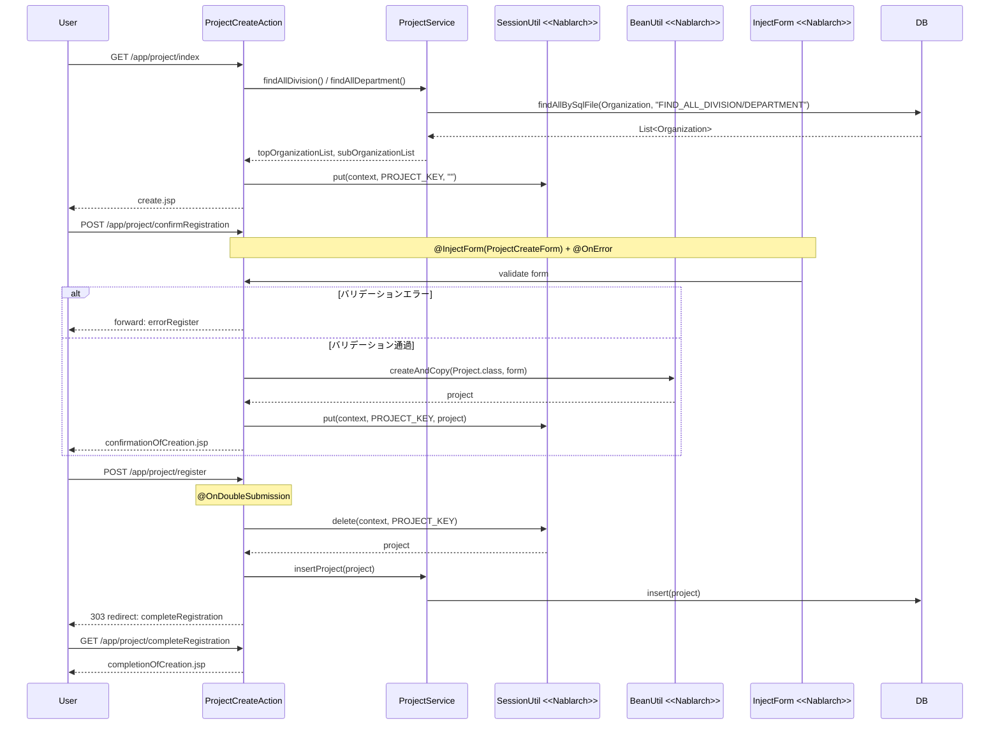

# Code Analysis: ProjectCreateAction

**Generated**: 2026-03-12 17:12:15
**Target**: プロジェクト登録アクション（入力→確認→登録→完了の4ステップフロー）
**Modules**: proman-web
**Analysis Duration**: 約3分9秒

---

## Overview

`ProjectCreateAction` はプロジェクト登録機能を担うWebアクションクラスです。入力画面表示 → 確認画面表示 → DB登録 → 完了画面表示 という4ステップの登録フローを実装しています。

主要な構成要素：
- **ProjectCreateAction**: メインアクション（5つのアクションメソッドを持つ）
- **ProjectCreateForm**: 入力値のバリデーションを担うフォームクラス（Bean Validationアノテーション使用）
- **ProjectService**: DBアクセスロジックを集約したサービスクラス（UniversalDao/DaoContextを内包）

Nablarchのインターセプタ機能（`@InjectForm`, `@OnError`, `@OnDoubleSubmission`）を活用して、バリデーション・エラー処理・二重サブミット防止をアノテーションで宣言的に実現しています。セッションストアを利用して確認画面〜登録完了間でエンティティを受け渡します。

---

## Architecture

### Dependency Graph

```mermaid
classDiagram
    class ProjectCreateAction
    class ProjectCreateForm {
        <<Form>>
    }
    class ProjectService
    class Project {
        <<Entity>>
    }
    class Organization {
        <<Entity>>
    }
    class DaoContext {
        <<Nablarch>>
    }
    class SessionUtil {
        <<Nablarch>>
    }
    class BeanUtil {
        <<Nablarch>>
    }
    class InjectForm {
        <<Nablarch>>
    }
    class OnDoubleSubmission {
        <<Nablarch>>
    }
    class ExecutionContext {
        <<Nablarch>>
    }

    ProjectCreateAction ..> ProjectCreateForm : validates
    ProjectCreateAction ..> ProjectService : delegates to
    ProjectCreateAction ..> SessionUtil : stores/retrieves
    ProjectCreateAction ..> BeanUtil : converts
    ProjectCreateAction ..> ExecutionContext : uses
    ProjectCreateAction ..> InjectForm : intercepted by
    ProjectCreateAction ..> OnDoubleSubmission : intercepted by
    ProjectService ..> DaoContext : queries/persists
    ProjectService ..> Project : persists
    ProjectService ..> Organization : queries
    ProjectCreateForm ..|> Serializable : implements
```



**Note**: This diagram uses Mermaid `classDiagram` syntax to show class names and their relationships. Use `--|>` for inheritance (extends/implements) and `..>` for dependencies (uses/creates).

### Component Summary

| Component | Role | Type | Dependencies |
|-----------|------|------|--------------|
| ProjectCreateAction | プロジェクト登録フロー制御 | Action | ProjectCreateForm, ProjectService, SessionUtil, BeanUtil, ExecutionContext |
| ProjectCreateForm | 登録入力値のバリデーション | Form | DateRelationUtil |
| ProjectService | DBアクセスロジック集約 | Service | DaoContext (UniversalDao), Project, Organization |
| Project | プロジェクトエンティティ | Entity | なし |
| Organization | 組織（事業部/部門）エンティティ | Entity | なし |

---

## Flow

### Processing Flow

プロジェクト登録は以下の4ステップフローで処理されます。

1. **入力画面表示（index）**: 事業部・部門のプルダウンデータをDBから取得してリクエストスコープに設定し、登録入力画面（create.jsp）を返す。同時にセッションストアのPROJECT_KEYを空文字で初期化する。

2. **確認画面表示（confirmRegistration）**: `@InjectForm` によりフォームバリデーションを実行。バリデーション通過後、リクエストスコープからフォームを取得し `BeanUtil.createAndCopy()` でProjectエンティティに変換。SessionUtilでエンティティをセッションストアに保存し、確認画面（confirmationOfCreation.jsp）を返す。バリデーションエラー時は `@OnError` により errorRegister へフォワード。

3. **DB登録（register）**: `@OnDoubleSubmission` により二重サブミット防止。`SessionUtil.delete()` でセッションからProjectを取得（同時に削除）し、`ProjectService.insertProject()` でDBに挿入。303リダイレクトで完了画面へ遷移。

4. **完了画面表示（completeRegistration）**: 完了画面（completionOfCreation.jsp）を返す。

5. **確認画面から戻る（backToEnterRegistration）**: セッションからProjectを取得し `BeanUtil.createAndCopy()` でフォームに戻す。日付フィールドを `DateUtil.formatDate()` でフォーマットし直し、ProjectServiceで事業部・部門情報を再取得してフォームに設定。内部フォワードで登録画面に戻る。

### Sequence Diagram



---

## Components

### ProjectCreateAction

**ファイル**: [ProjectCreateAction.java](../../.lw/nab-official/v5/nablarch-system-development-guide/Sample_Project/Source_Code/proman-project/proman-web/src/main/java/com/nablarch/example/proman/web/project/ProjectCreateAction.java)

**役割**: プロジェクト登録フロー全体を制御するWebアクションクラス。5つのアクションメソッドで登録フローの各ステップを担当する。

**キーメソッド**:

- `index()` [L33-39]: 登録入力画面の初期表示。`setOrganizationAndDivisionToRequestScope()` でプルダウンデータを設定。
- `confirmRegistration()` [L48-63]: `@InjectForm` + `@OnError` による宣言的バリデーション。フォームをエンティティに変換してセッション保存。
- `register()` [L72-78]: `@OnDoubleSubmission` による二重サブミット防止。セッションからエンティティを取得して削除、DBに登録し303リダイレクト。
- `backToEnterRegistration()` [L98-118]: エンティティをフォームに戻し日付を再フォーマット、事業部/部門の階層関係を再取得して入力画面へ戻る。
- `setOrganizationAndDivisionToRequestScope()` [L125-136]: 事業部・部門のリストをDBから取得してリクエストスコープに設定するプライベートメソッド。

**依存コンポーネント**: ProjectCreateForm, ProjectService, SessionUtil, BeanUtil, DateUtil, ExecutionContext, HttpRequest, HttpResponse

---

### ProjectCreateForm

**ファイル**: [ProjectCreateForm.java](../../.lw/nab-official/v5/nablarch-system-development-guide/Sample_Project/Source_Code/proman-project/proman-web/src/main/java/com/nablarch/example/proman/web/project/ProjectCreateForm.java)

**役割**: プロジェクト登録入力のバリデーションを担うフォームクラス。Bean Validationアノテーションで各フィールドのバリデーションルールを宣言。

**キーメソッド**:

- `isValidProjectPeriod()` [L329-331]: `@AssertTrue` によるクロスフィールドバリデーション。開始日が終了日より後の場合にfalseを返す。`DateRelationUtil.isValid()` に委譲。

**特記事項**: `Serializable` を実装（`@InjectForm` によるセッション経由バリデーションのため）。全入力プロパティをString型で宣言（Bean Validationの慣例）。

**依存コンポーネント**: DateRelationUtil, nablarch.core.validation.ee アノテーション群

---

### ProjectService

**ファイル**: [ProjectService.java](../../.lw/nab-official/v5/nablarch-system-development-guide/Sample_Project/Source_Code/proman-project/proman-web/src/main/java/com/nablarch/example/proman/web/project/ProjectService.java)

**役割**: プロジェクト関連のDBアクセスロジックを集約するサービスクラス。DaoContext（UniversalDao）をラップして各ビジネス操作を提供。

**キーメソッド**:

- `findAllDivision()` [L50-52]: `findAllBySqlFile()` で全事業部を取得。
- `findAllDepartment()` [L59-61]: `findAllBySqlFile()` で全部門を取得。
- `findOrganizationById()` [L70-73]: `findById()` で指定IDの組織を1件取得。
- `insertProject()` [L80-82]: `insert()` でプロジェクトをDB登録。

**依存コンポーネント**: DaoContext, Project, Organization

---

## Nablarch Framework Usage

### InjectForm

**クラス**: `nablarch.common.web.interceptor.InjectForm`

**説明**: アクションメソッドに付与するインターセプタ。リクエストパラメータを指定フォームクラスにバインドし、Bean Validationを実行する。バリデーション結果はリクエストスコープに格納される。

**使用方法**:
```java
@InjectForm(form = ProjectCreateForm.class, prefix = "form")
@OnError(type = ApplicationException.class, path = "forward:///app/project/errorRegister")
public HttpResponse confirmRegistration(HttpRequest request, ExecutionContext context) {
    ProjectCreateForm form = context.getRequestScopedVar("form");
    // バリデーション済みフォームを利用
}
```

**重要ポイント**:
- ✅ **`@OnError`とセットで使う**: バリデーションエラー時の遷移先を必ず指定する
- ✅ **フォームはSerializableを実装**: `@InjectForm` はセッション経由でフォームを処理するため必須
- 💡 **フォームをリクエストスコープから取得**: バリデーション通過後は `context.getRequestScopedVar("form")` で取得可能

**このコードでの使い方**:
- `confirmRegistration()` メソッドに付与（Line 48-49）
- `prefix = "form"` でHTMLフォームの `form.xxx` パラメータを受け取る
- バリデーション失敗時は `@OnError` により `forward:///app/project/errorRegister` へ遷移

**詳細**: [Web Application Client_create2](../../.claude/skills/nabledge-6/docs/processing-pattern/web-application/web-application-client_create2.md)

---

### OnDoubleSubmission

**クラス**: `nablarch.common.web.token.OnDoubleSubmission`

**説明**: アクションメソッドに付与するインターセプタ。トークンベースの二重サブミット防止を実現する。同一リクエストが複数回送信された場合、2回目以降はエラーページへ遷移させる。

**使用方法**:
```java
@OnDoubleSubmission
public HttpResponse register(HttpRequest request, ExecutionContext context) {
    // 二重実行されない登録処理
}
```

**重要ポイント**:
- ✅ **DB登録・更新・削除メソッドに付与**: データ変更を伴うメソッドには必ず付与する
- ⚠️ **JSP側にも対応が必要**: `<n:button allowDoubleSubmission="false">` でクライアントサイドも制御する
- 💡 **JavaScriptが無効でも動作**: サーバサイドでのトークン検証により確実な二重実行防止が可能

**このコードでの使い方**:
- `register()` メソッドに付与（Line 72）
- 303リダイレクトと組み合わせてブラウザ更新による再送信も防止

**詳細**: [Web Application Client_create4](../../.claude/skills/nabledge-6/docs/processing-pattern/web-application/web-application-client_create4.md)

---

### SessionUtil

**クラス**: `nablarch.common.web.session.SessionUtil`

**説明**: セッションストアへのデータ保存・取得・削除を行うユーティリティクラス。確認画面を経由する登録フローでフォームデータをエンティティに変換してセッションに保持するために使用する。

**使用方法**:
```java
// 保存
SessionUtil.put(context, "key", entity);
// 取得
Project project = SessionUtil.get(context, "key");
// 取得して削除（登録後はセッションから除去）
Project project = SessionUtil.delete(context, "key");
```

**重要ポイント**:
- ✅ **フォームではなくエンティティを格納**: フォームをそのままセッションに入れてはいけない。`BeanUtil` でエンティティに変換してから格納する
- ✅ **登録後はdelete()で削除**: `SessionUtil.delete()` は取得と削除を同時に行う。登録完了後にセッションを確実にクリアできる
- ⚠️ **セッションキーの競合に注意**: クラス定数（`PROJECT_KEY`）でキーを管理し、文字列のハードコードを避ける

**このコードでの使い方**:
- `confirmRegistration()` で `put()` によりProjectエンティティを保存（Line 59）
- `register()` で `delete()` によりProjectを取得しつつセッションから削除（Line 74）
- `backToEnterRegistration()` で `get()` によりProjectを読み取り（Line 100）
- `setOrganizationAndDivisionToRequestScope()` で `put(context, PROJECT_KEY, "")` によりキーを初期化（Line 132）

**詳細**: [Web Application Client_create3](../../.claude/skills/nabledge-6/docs/processing-pattern/web-application/web-application-client_create3.md)

---

### BeanUtil

**クラス**: `nablarch.core.beans.BeanUtil`

**説明**: JavaBeans間のプロパティコピーを行うユーティリティクラス。同名プロパティを自動でコピーし、フォームからエンティティへ、またはエンティティからフォームへの変換に利用する。

**使用方法**:
```java
// フォーム→エンティティ（新規インスタンス生成）
Project project = BeanUtil.createAndCopy(Project.class, form);
// エンティティ→フォーム（新規インスタンス生成）
ProjectCreateForm form = BeanUtil.createAndCopy(ProjectCreateForm.class, project);
```

**重要ポイント**:
- 💡 **同名プロパティを自動コピー**: getterとsetterが対応していれば型変換も自動で行われる
- ⚠️ **String→数値の型変換**: フォームはString型、エンティティはInteger/Long型の場合でも自動変換される
- 🎯 **確認画面からの戻り処理で重要**: エンティティのデータをフォームに再設定する際に活用

**このコードでの使い方**:
- `confirmRegistration()` でフォームをProjectエンティティに変換（Line 52）
- `backToEnterRegistration()` でProjectエンティティをProjectCreateFormに変換（Line 101）

**詳細**: [Web Application Client_create2](../../.claude/skills/nabledge-6/docs/processing-pattern/web-application/web-application-client_create2.md)

---

## References

### Source Files

- [ProjectCreateAction.java (.lw/nab-official/v5/nablarch-system-development-guide/en/Sample_Project/Source_Code/proman-project/proman-web/src/main/java/com/nablarch/example/proman/web/project)](../../.lw/nab-official/v5/nablarch-system-development-guide/en/Sample_Project/Source_Code/proman-project/proman-web/src/main/java/com/nablarch/example/proman/web/project/ProjectCreateAction.java) - ProjectCreateAction
- [ProjectCreateAction.java (.lw/nab-official/v5/nablarch-system-development-guide/Sample_Project/Source_Code/proman-project/proman-web/src/main/java/com/nablarch/example/proman/web/project)](../../.lw/nab-official/v5/nablarch-system-development-guide/Sample_Project/Source_Code/proman-project/proman-web/src/main/java/com/nablarch/example/proman/web/project/ProjectCreateAction.java) - ProjectCreateAction
- [ProjectCreateForm.java (.lw/nab-official/v5/nablarch-system-development-guide/en/Sample_Project/Source_Code/proman-project/proman-web/src/main/java/com/nablarch/example/proman/web/project)](../../.lw/nab-official/v5/nablarch-system-development-guide/en/Sample_Project/Source_Code/proman-project/proman-web/src/main/java/com/nablarch/example/proman/web/project/ProjectCreateForm.java) - ProjectCreateForm
- [ProjectCreateForm.java (.lw/nab-official/v5/nablarch-system-development-guide/Sample_Project/Source_Code/proman-project/proman-web/src/main/java/com/nablarch/example/proman/web/project)](../../.lw/nab-official/v5/nablarch-system-development-guide/Sample_Project/Source_Code/proman-project/proman-web/src/main/java/com/nablarch/example/proman/web/project/ProjectCreateForm.java) - ProjectCreateForm
- [ProjectService.java (.lw/nab-official/v5/nablarch-system-development-guide/en/Sample_Project/Source_Code/proman-project/proman-web/src/main/java/com/nablarch/example/proman/web/project)](../../.lw/nab-official/v5/nablarch-system-development-guide/en/Sample_Project/Source_Code/proman-project/proman-web/src/main/java/com/nablarch/example/proman/web/project/ProjectService.java) - ProjectService
- [ProjectService.java (.lw/nab-official/v5/nablarch-system-development-guide/Sample_Project/Source_Code/proman-project/proman-web/src/main/java/com/nablarch/example/proman/web/project)](../../.lw/nab-official/v5/nablarch-system-development-guide/Sample_Project/Source_Code/proman-project/proman-web/src/main/java/com/nablarch/example/proman/web/project/ProjectService.java) - ProjectService

### Knowledge Base (Nabledge-6)

- [Web Application Client_create2](../../.claude/skills/nabledge-6/docs/processing-pattern/web-application/web-application-client_create2.md)
- [Web Application Client_create4](../../.claude/skills/nabledge-6/docs/processing-pattern/web-application/web-application-client_create4.md)
- [Web Application Client_create3](../../.claude/skills/nabledge-6/docs/processing-pattern/web-application/web-application-client_create3.md)
- [Web Application Getting Started Project Update](../../.claude/skills/nabledge-6/docs/processing-pattern/web-application/web-application-getting-started-project-update.md)

### Official Documentation


- [BeanUtil](https://nablarch.github.io/docs/LATEST/javadoc/nablarch/core/beans/BeanUtil.html)
- [Client Create2](https://nablarch.github.io/docs/LATEST/doc/application_framework/application_framework/web/getting_started/client_create/client_create2.html)
- [Client Create3](https://nablarch.github.io/docs/LATEST/doc/application_framework/application_framework/web/getting_started/client_create/client_create3.html)
- [Client Create4](https://nablarch.github.io/docs/LATEST/doc/application_framework/application_framework/web/getting_started/client_create/client_create4.html)
- [Index](https://nablarch.github.io/docs/LATEST/doc/application_framework/application_framework/web/getting_started/project_update/index.html)
- [InjectForm](https://nablarch.github.io/docs/LATEST/javadoc/nablarch/common/web/interceptor/InjectForm.html)
- [NoDataException](https://nablarch.github.io/docs/LATEST/javadoc/nablarch/common/dao/NoDataException.html)
- [OnDoubleSubmission](https://nablarch.github.io/docs/LATEST/javadoc/nablarch/common/web/token/OnDoubleSubmission.html)
- [OnError](https://nablarch.github.io/docs/LATEST/javadoc/nablarch/fw/web/interceptor/OnError.html)
- [Required](https://nablarch.github.io/docs/LATEST/javadoc/nablarch/core/validation/ee/Required.html)
- [ResourceLocator](https://nablarch.github.io/docs/LATEST/javadoc/nablarch/fw/web/ResourceLocator.html)
- [SessionUtil](https://nablarch.github.io/docs/LATEST/javadoc/nablarch/common/web/session/SessionUtil.html)
- [UniversalDao](https://nablarch.github.io/docs/LATEST/javadoc/nablarch/common/dao/UniversalDao.html)

---

**Note**: This documentation was generated by the code-analysis workflow of the nabledge-6 skill.
