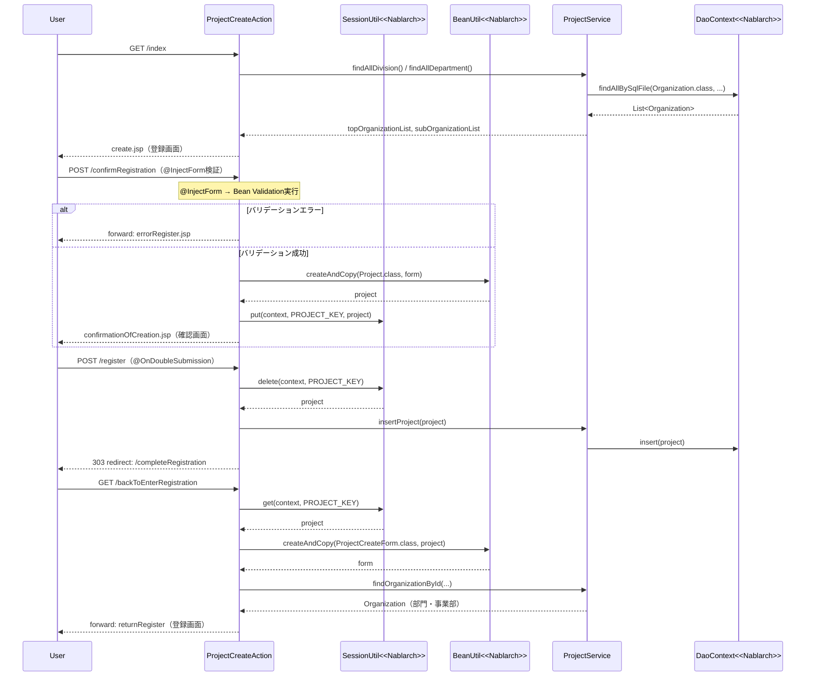

# Code Analysis: ProjectCreateAction

**Generated**: 2026-03-12 17:19:29
**Target**: プロジェクト登録アクション（入力→確認→登録フロー）
**Modules**: proman-web
**Analysis Duration**: 約3分8秒

---

## Overview

`ProjectCreateAction` はプロジェクト登録機能を担う業務アクションクラスです。入力→確認→登録→完了 の4ステップフローを制御し、セッションストアを活用してステップ間でデータを引き渡します。

主要な役割：
- `index()`: 登録初期画面表示（事業部・部門プルダウンをDBから取得してリクエストスコープにセット）
- `confirmRegistration()`: 入力値バリデーション実行＋確認画面表示（`@InjectForm`でバリデーション、`SessionUtil`でエンティティをセッション保存）
- `register()`: DBへのプロジェクト登録（`@OnDoubleSubmission`で二重送信防止、セッションから取得してInsert、303リダイレクト）
- `completeRegistration()`: 登録完了画面表示
- `backToEnterRegistration()`: 確認画面から入力画面への戻り処理（セッションからエンティティを復元してフォームに変換）

データアクセスは `ProjectService` に集約し、`DaoContext`（UniversalDao）でDB操作を実行します。

---

## Architecture

### Dependency Graph

```mermaid
classDiagram
    class ProjectCreateAction
    class ProjectCreateForm {
        <<Form>>
    }
    class ProjectService
    class Project {
        <<Entity>>
    }
    class Organization {
        <<Entity>>
    }
    class BeanUtil {
        <<Nablarch>>
    }
    class SessionUtil {
        <<Nablarch>>
    }
    class DaoContext {
        <<Nablarch>>
    }
    class ExecutionContext {
        <<Nablarch>>
    }

    ProjectCreateForm ..|> Serializable : implements
    ProjectCreateAction ..> ProjectCreateForm : validates
    ProjectCreateAction ..> ProjectService : delegates to
    ProjectCreateAction ..> BeanUtil : copies form→entity
    ProjectCreateAction ..> SessionUtil : stores/retrieves
    ProjectCreateAction ..> ExecutionContext : uses
    ProjectService ..> DaoContext : queries/persists
    ProjectService ..> Project : persists
    ProjectService ..> Organization : queries
```



**Note**: This diagram uses Mermaid `classDiagram` syntax to show class names and their relationships. Use `--|>` for inheritance (extends/implements) and `..>` for dependencies (uses/creates).

### Component Summary

| Component | Role | Type | Dependencies |
|-----------|------|------|--------------|
| ProjectCreateAction | プロジェクト登録フロー制御 | Action | ProjectCreateForm, ProjectService, BeanUtil, SessionUtil, ExecutionContext |
| ProjectCreateForm | 登録入力値のバリデーション | Form | DateRelationUtil |
| ProjectService | プロジェクト・組織のDB操作 | Service | DaoContext, Project, Organization |
| Project | プロジェクトエンティティ | Entity | なし |
| Organization | 組織（事業部・部門）エンティティ | Entity | なし |

---

## Flow

### Processing Flow

プロジェクト登録は以下の5ステップで構成されます。

1. **初期表示（index）**: GETリクエストで登録画面を表示。`ProjectService`から事業部・部門一覧を取得してリクエストスコープにセット。同時にセッションキーをリセット。

2. **確認画面表示（confirmRegistration）**: `@InjectForm(form=ProjectCreateForm.class)`でバリデーション実行。バリデーションエラー時は`@OnError`によりエラー登録画面へフォワード。成功時は`BeanUtil.createAndCopy`でフォームをProjectエンティティに変換し、`SessionUtil.put`でセッションに保存して確認画面へ遷移。

3. **登録処理（register）**: `@OnDoubleSubmission`で二重送信ガード。`SessionUtil.delete`でセッションからProjectを取り出し（同時に削除）、`ProjectService.insertProject`でDB登録。303リダイレクトで完了画面へ遷移。

4. **完了画面表示（completeRegistration）**: 完了画面JSPへフォワード。

5. **入力画面へ戻る（backToEnterRegistration）**: セッションからProjectを取得し、`BeanUtil.createAndCopy`でProjectCreateFormに変換。日付項目を`DateUtil.formatDate`でフォーマット変換。事業部・部門の親子関係を`ProjectService`から取得してフォームにセット後、登録画面へ内部フォワード。

### Sequence Diagram



---

## Components

### ProjectCreateAction

**ファイル**: [ProjectCreateAction.java](../../.lw/nab-official/v5/nablarch-system-development-guide/Sample_Project/Source_Code/proman-project/proman-web/src/main/java/com/nablarch/example/proman/web/project/ProjectCreateAction.java)

**役割**: プロジェクト登録の全ステップ（表示→確認→登録→完了→戻る）を制御するアクションクラス。

**主要メソッド**:

- `index(HttpRequest, ExecutionContext)` [L33-39]: 登録初期画面表示。`setOrganizationAndDivisionToRequestScope`を呼び出してプルダウン用データを準備。
- `confirmRegistration(HttpRequest, ExecutionContext)` [L48-63]: `@InjectForm`によるバリデーション実行。成功後、`BeanUtil.createAndCopy`でProjectに変換し`SessionUtil.put`でセッション保存。
- `register(HttpRequest, ExecutionContext)` [L72-78]: `@OnDoubleSubmission`付き登録処理。`SessionUtil.delete`でセッションからProjectを取得・削除し、`ProjectService.insertProject`でDB登録。
- `backToEnterRegistration(HttpRequest, ExecutionContext)` [L98-118]: セッションからProjectを取得して`ProjectCreateForm`に変換し、日付フォーマット変換と組織情報の再取得を実施。

**依存関係**: ProjectCreateForm（バリデーション）, ProjectService（DB操作）, BeanUtil（Bean変換）, SessionUtil（セッション管理）, ExecutionContext（スコープ操作）

---

### ProjectCreateForm

**ファイル**: [ProjectCreateForm.java](../../.lw/nab-official/v5/nablarch-system-development-guide/Sample_Project/Source_Code/proman-project/proman-web/src/main/java/com/nablarch/example/proman/web/project/ProjectCreateForm.java)

**役割**: 登録画面の入力値を受け取るフォームクラス。Bean Validationアノテーションでバリデーションルールを定義。

**主要フィールド**: `projectName`, `projectType`, `projectClass`, `projectStartDate`, `projectEndDate`, `divisionId`, `organizationId`, `pmKanjiName`, `plKanjiName`, `note`, `salesAmount`（全てString型）

**バリデーション**:
- 各フィールドに`@Required`と`@Domain("ドメイン名")`を付与 [L25-97]
- `isValidProjectPeriod()` [L329-331]: `@AssertTrue`による日付相関チェック（`DateRelationUtil.isValid`使用）

**依存関係**: DateRelationUtil（日付相関バリデーション）

---

### ProjectService

**ファイル**: [ProjectService.java](../../.lw/nab-official/v5/nablarch-system-development-guide/Sample_Project/Source_Code/proman-project/proman-web/src/main/java/com/nablarch/example/proman/web/project/ProjectService.java)

**役割**: プロジェクト・組織のDB操作を集約するサービスクラス。`DaoContext`（UniversalDao）を内部に持ちDB処理を実行。

**主要メソッド**:

- `findAllDivision()` [L50-52]: 全事業部をSQLファイル指定で検索
- `findAllDepartment()` [L59-61]: 全部門をSQLファイル指定で検索
- `findOrganizationById(Integer)` [L70-73]: 組織IDで組織を1件取得
- `insertProject(Project)` [L80-82]: プロジェクトをDBにInsert

**依存関係**: DaoContext（UniversalDao）, Project（エンティティ）, Organization（エンティティ）, DaoFactory（DIファクトリ）

---

## Nablarch Framework Usage

### @InjectForm / @OnError

**クラス**: `nablarch.common.web.interceptor.InjectForm`, `nablarch.fw.web.interceptor.OnError`

**説明**: `@InjectForm`はリクエストパラメータをフォームクラスにバインドしてBean Validationを実行するインターセプタ。`@OnError`はバリデーション例外発生時の遷移先を指定する。

**使用方法**:
```java
@InjectForm(form = ProjectCreateForm.class, prefix = "form")
@OnError(type = ApplicationException.class, path = "forward:///app/project/errorRegister")
public HttpResponse confirmRegistration(HttpRequest request, ExecutionContext context) {
    ProjectCreateForm form = context.getRequestScopedVar("form");
    // ...
}
```

**重要ポイント**:
- ✅ **`prefix`でフォームオブジェクト名を指定**: `prefix = "form"`の場合、リクエストパラメータ`form.xxx`がフォームの`xxx`フィールドに対応する
- ⚠️ **フォームは`Serializable`実装が必要**: `@InjectForm`使用のためフォームクラスに`implements Serializable`が必要
- 💡 **バリデーション後はスコープからフォームを取得**: バリデーション通過後、`context.getRequestScopedVar("form")`でバリデーション済みフォームを取得する

**このコードでの使い方**:
- `confirmRegistration`メソッドに付与（Line 48-49）
- `@OnError`の`path`で`ApplicationException`発生時に`errorRegister`へフォワード

**詳細**: [Web Application Client Create2](../../.claude/skills/nabledge-6/docs/processing-pattern/web-application/web-application-client_create2.md)

---

### SessionUtil

**クラス**: `nablarch.common.web.session.SessionUtil`

**説明**: セッションストアへのアクセスを提供するユーティリティクラス。確認画面表示から登録処理まで、ステップをまたいだデータ保持に使用する。

**使用方法**:
```java
// セッションへの保存（確認画面表示時）
SessionUtil.put(context, PROJECT_KEY, project);

// セッションからの取得（戻るボタン押下時）
Project project = SessionUtil.get(context, PROJECT_KEY);

// セッションからの取得と削除（登録処理時）
Project project = SessionUtil.delete(context, PROJECT_KEY);
```

**重要ポイント**:
- ✅ **フォームをセッションに格納しない**: バリデーション済みフォームをそのままセッションに保存せず、`BeanUtil.createAndCopy`でエンティティに変換してから格納する
- ⚠️ **登録処理では`delete`を使う**: `SessionUtil.delete`で取得と同時にセッションから削除することで、処理後にセッションにデータが残らないようにする
- 💡 **初期表示でセッションをリセット**: `index()`内で`SessionUtil.put(context, PROJECT_KEY, "")`として空文字をセットしてリセットしている

**このコードでの使い方**:
- `confirmRegistration`でProjectエンティティをセッション保存（Line 59）
- `register`で`SessionUtil.delete`でProjectを取得＋削除（Line 74）
- `backToEnterRegistration`で`SessionUtil.get`でProjectを取得（Line 100）
- `setOrganizationAndDivisionToRequestScope`でセッションキーを空文字でリセット（Line 132）

**詳細**: [Web Application Client Create4](../../.claude/skills/nabledge-6/docs/processing-pattern/web-application/web-application-client_create4.md)

---

### @OnDoubleSubmission

**クラス**: `nablarch.common.web.token.OnDoubleSubmission`

**説明**: 業務アクションメソッドの二重送信を防止するアノテーション。JavaScriptが無効な場合も含めてサーバサイドで制御する。

**使用方法**:
```java
@OnDoubleSubmission
public HttpResponse register(HttpRequest request, ExecutionContext context) {
    // 二重送信時はエラーページへ遷移（アクション本体は実行されない）
    final Project project = SessionUtil.delete(context, PROJECT_KEY);
    ProjectService service = new ProjectService();
    service.insertProject(project);
    return new HttpResponse(303, "redirect:///app/project/completeRegistration");
}
```

**重要ポイント**:
- ✅ **登録・更新・削除の業務アクションに必ず付与**: データを変更するアクションには必ず`@OnDoubleSubmission`を付与して多重実行を防ぐ
- 💡 **サーバサイドとクライアントサイドの二段構え**: JSP側では`allowDoubleSubmission="false"`属性でJavaScriptによる制御も追加する
- 🎯 **303リダイレクトと組み合わせる**: 登録後は303リダイレクトで完了画面へ遷移させ、ブラウザの「更新」ボタンによる再送信も防止する

**このコードでの使い方**:
- `register`メソッドに付与（Line 72）
- 登録完了後は`new HttpResponse(303, "redirect:///app/project/completeRegistration")`で完了画面へリダイレクト

**詳細**: [Web Application Client Create4](../../.claude/skills/nabledge-6/docs/processing-pattern/web-application/web-application-client_create4.md)

---

### BeanUtil

**クラス**: `nablarch.core.beans.BeanUtil`

**説明**: JavaBeansのプロパティコピーを提供するユーティリティ。フォームからエンティティへの変換、またはエンティティからフォームへの逆変換に使用する。

**使用方法**:
```java
// フォームをエンティティにコピー（確認画面表示時）
Project project = BeanUtil.createAndCopy(Project.class, form);

// エンティティをフォームにコピー（入力画面に戻るとき）
ProjectCreateForm projectCreateForm = BeanUtil.createAndCopy(ProjectCreateForm.class, project);
```

**重要ポイント**:
- ✅ **セッション保存前にエンティティに変換**: フォームはセッションに直接格納せず、Entityに変換してから格納する
- ⚠️ **型変換は同名プロパティ間のみ自動変換**: 同名・同型（またはString→型変換可能）のプロパティのみコピーされる。日付のフォーマット変換は別途`DateUtil`で行う必要がある（Line 103-106参照）
- 💡 **`createAndCopy`は新規インスタンス生成＋コピー**: `new`と`copy`を1ステップで実行できるため、コードが簡潔になる

**このコードでの使い方**:
- `confirmRegistration`でフォーム→Projectコピー（Line 52）
- `backToEnterRegistration`でProject→フォームコピー（Line 101）

---

## References

### Source Files

- [ProjectCreateAction.java (.lw/nab-official/v5/nablarch-system-development-guide/en/Sample_Project/Source_Code/proman-project/proman-web/src/main/java/com/nablarch/example/proman/web/project)](../../.lw/nab-official/v5/nablarch-system-development-guide/en/Sample_Project/Source_Code/proman-project/proman-web/src/main/java/com/nablarch/example/proman/web/project/ProjectCreateAction.java) - ProjectCreateAction
- [ProjectCreateAction.java (.lw/nab-official/v5/nablarch-system-development-guide/Sample_Project/Source_Code/proman-project/proman-web/src/main/java/com/nablarch/example/proman/web/project)](../../.lw/nab-official/v5/nablarch-system-development-guide/Sample_Project/Source_Code/proman-project/proman-web/src/main/java/com/nablarch/example/proman/web/project/ProjectCreateAction.java) - ProjectCreateAction
- [ProjectCreateForm.java (.lw/nab-official/v5/nablarch-system-development-guide/en/Sample_Project/Source_Code/proman-project/proman-web/src/main/java/com/nablarch/example/proman/web/project)](../../.lw/nab-official/v5/nablarch-system-development-guide/en/Sample_Project/Source_Code/proman-project/proman-web/src/main/java/com/nablarch/example/proman/web/project/ProjectCreateForm.java) - ProjectCreateForm
- [ProjectCreateForm.java (.lw/nab-official/v5/nablarch-system-development-guide/Sample_Project/Source_Code/proman-project/proman-web/src/main/java/com/nablarch/example/proman/web/project)](../../.lw/nab-official/v5/nablarch-system-development-guide/Sample_Project/Source_Code/proman-project/proman-web/src/main/java/com/nablarch/example/proman/web/project/ProjectCreateForm.java) - ProjectCreateForm
- [ProjectService.java (.lw/nab-official/v5/nablarch-system-development-guide/en/Sample_Project/Source_Code/proman-project/proman-web/src/main/java/com/nablarch/example/proman/web/project)](../../.lw/nab-official/v5/nablarch-system-development-guide/en/Sample_Project/Source_Code/proman-project/proman-web/src/main/java/com/nablarch/example/proman/web/project/ProjectService.java) - ProjectService
- [ProjectService.java (.lw/nab-official/v5/nablarch-system-development-guide/Sample_Project/Source_Code/proman-project/proman-web/src/main/java/com/nablarch/example/proman/web/project)](../../.lw/nab-official/v5/nablarch-system-development-guide/Sample_Project/Source_Code/proman-project/proman-web/src/main/java/com/nablarch/example/proman/web/project/ProjectService.java) - ProjectService

### Knowledge Base (Nabledge-6)

- [Web Application Client_create2](../../.claude/skills/nabledge-6/docs/processing-pattern/web-application/web-application-client_create2.md)
- [Web Application Client_create4](../../.claude/skills/nabledge-6/docs/processing-pattern/web-application/web-application-client_create4.md)
- [Web Application Client_create3](../../.claude/skills/nabledge-6/docs/processing-pattern/web-application/web-application-client_create3.md)
- [Web Application Getting Started Project Delete](../../.claude/skills/nabledge-6/docs/processing-pattern/web-application/web-application-getting-started-project-delete.md)

### Official Documentation


- [BeanUtil](https://nablarch.github.io/docs/LATEST/javadoc/nablarch/core/beans/BeanUtil.html)
- [Client Create2](https://nablarch.github.io/docs/LATEST/doc/application_framework/application_framework/web/getting_started/client_create/client_create2.html)
- [Client Create3](https://nablarch.github.io/docs/LATEST/doc/application_framework/application_framework/web/getting_started/client_create/client_create3.html)
- [Client Create4](https://nablarch.github.io/docs/LATEST/doc/application_framework/application_framework/web/getting_started/client_create/client_create4.html)
- [Index](https://nablarch.github.io/docs/LATEST/doc/application_framework/application_framework/web/getting_started/project_delete/index.html)
- [InjectForm](https://nablarch.github.io/docs/LATEST/javadoc/nablarch/common/web/interceptor/InjectForm.html)
- [OnDoubleSubmission](https://nablarch.github.io/docs/LATEST/javadoc/nablarch/common/web/token/OnDoubleSubmission.html)
- [OnError](https://nablarch.github.io/docs/LATEST/javadoc/nablarch/fw/web/interceptor/OnError.html)
- [Required](https://nablarch.github.io/docs/LATEST/javadoc/nablarch/core/validation/ee/Required.html)
- [SessionUtil](https://nablarch.github.io/docs/LATEST/javadoc/nablarch/common/web/session/SessionUtil.html)
- [UniversalDao](https://nablarch.github.io/docs/LATEST/javadoc/nablarch/common/dao/UniversalDao.html)

---

**Note**: This documentation was generated by the code-analysis workflow of the nabledge-6 skill.
