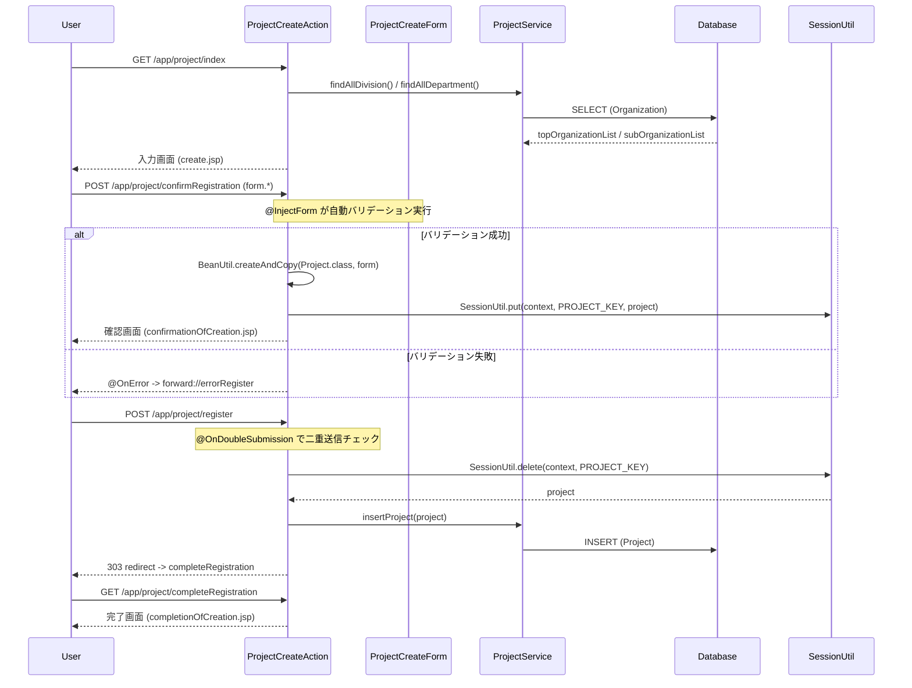

# Code Analysis: ProjectCreateAction

**Generated**: 2026-03-12 17:24:59
**Target**: プロジェクト登録処理（入力→確認→登録→完了の4画面フロー）
**Modules**: proman-web
**Analysis Duration**: 約2分57秒

---

## Overview

`ProjectCreateAction` はプロジェクト登録機能を担うWebアクションクラスである。ユーザーが入力した情報を画面（入力→確認→登録→完了）のフローに沿って処理する。

主な構成コンポーネント:
- **ProjectCreateAction**: 画面遷移を制御するアクションクラス（コントローラ）
- **ProjectCreateForm**: 入力値を受け取り、Nablarch Bean Validationでバリデーションするフォームクラス
- **ProjectService**: DaoContextを介してデータベース操作（INSERT/SELECT）を行うサービスクラス

Nablarchの `@InjectForm` / `@OnError` インターセプタによってバリデーションが自動実行され、`SessionUtil` を使って確認画面跨ぎのデータを保持する。登録処理では `@OnDoubleSubmission` により二重送信を防止する。

---

## Architecture

### Dependency Graph

```mermaid
classDiagram
    class ProjectCreateAction
    class ProjectCreateForm {
        <<Form>>
    }
    class ProjectService
    class Project {
        <<Entity>>
    }
    class Organization {
        <<Entity>>
    }
    class DaoContext {
        <<Nablarch>>
    }
    class SessionUtil {
        <<Nablarch>>
    }
    class BeanUtil {
        <<Nablarch>>
    }
    class ExecutionContext {
        <<Nablarch>>
    }

    ProjectCreateAction ..> ProjectCreateForm : validates
    ProjectCreateAction ..> ProjectService : delegates to
    ProjectCreateAction ..> SessionUtil : stores/retrieves
    ProjectCreateAction ..> BeanUtil : copies
    ProjectCreateAction ..> ExecutionContext : uses
    ProjectService ..> DaoContext : queries/persists
    ProjectService ..> Project : persists
    ProjectService ..> Organization : queries
    ProjectCreateForm ..|> Serializable : implements
```



**Note**: This diagram uses Mermaid `classDiagram` syntax to show class names and their relationships. Use `--|>` for inheritance (extends/implements) and `..>` for dependencies (uses/creates).

### Component Summary

| Component | Role | Type | Dependencies |
|-----------|------|------|--------------|
| ProjectCreateAction | プロジェクト登録の画面フロー制御 | Action | ProjectCreateForm, ProjectService, SessionUtil, BeanUtil, ExecutionContext |
| ProjectCreateForm | 登録入力値のバリデーション | Form | DateRelationUtil |
| ProjectService | DB操作（INSERT/SELECT）のカプセル化 | Service | DaoContext, Project, Organization |
| Project | プロジェクトエンティティ | Entity | なし |
| Organization | 組織（事業部/部門）エンティティ | Entity | なし |

---

## Flow

### Processing Flow

プロジェクト登録は以下の4ステップで構成される:

1. **入力画面表示** (`index`メソッド, L33-39): 事業部・部門のプルダウンデータをDBから取得してリクエストスコープに設定し、入力JSPを表示する。
2. **確認画面表示** (`confirmRegistration`メソッド, L48-63): `@InjectForm` によりフォームのバリデーションを実行。成功した場合は `BeanUtil` でFormをEntityに変換し、`SessionUtil` でセッションに保存して確認画面を表示する。バリデーション失敗時は `@OnError` でエラー画面へフォワード。
3. **登録実行** (`register`メソッド, L72-78): `@OnDoubleSubmission` で二重送信を防止。`SessionUtil.delete` でセッションからProjectを取得（同時にセッションから削除）し、`ProjectService.insertProject` でDBへINSERTした後、登録完了画面にリダイレクト。
4. **戻る処理** (`backToEnterRegistration`メソッド, L98-118): 確認画面から入力画面に戻る際、セッションに保存されたProjectから `BeanUtil` でFormを復元し、日付フォーマット変換・組織情報の再取得を行ってリクエストスコープに設定する。

### Sequence Diagram



---

## Components

### ProjectCreateAction

**ファイル**: [ProjectCreateAction.java](../../.lw/nab-official/v5/nablarch-system-development-guide/Sample_Project/Source_Code/proman-project/proman-web/src/main/java/com/nablarch/example/proman/web/project/ProjectCreateAction.java)

**役割**: プロジェクト登録の画面フローを制御するWebアクションクラス。入力→確認→登録→完了の4画面遷移を管理する。

**主なメソッド**:

- `index(HttpRequest, ExecutionContext)` (L33-39): 入力画面の初期表示。事業部・部門リストをDBから取得してリクエストスコープに設定する。
- `confirmRegistration(HttpRequest, ExecutionContext)` (L48-63): 確認画面表示。`@InjectForm` でバリデーション実行後、FormをEntityに変換しセッションへ保存。
- `register(HttpRequest, ExecutionContext)` (L72-78): 登録処理。`@OnDoubleSubmission` で二重送信防止。セッションからProjectを取得しDBへINSERT後リダイレクト。
- `backToEnterRegistration(HttpRequest, ExecutionContext)` (L98-118): 確認画面から入力画面に戻る際の処理。セッションのデータを復元して入力画面を再表示。

**依存関係**: ProjectCreateForm, ProjectService, SessionUtil, BeanUtil, ExecutionContext, DateUtil

---

### ProjectCreateForm

**ファイル**: [ProjectCreateForm.java](../../.lw/nab-official/v5/nablarch-system-development-guide/Sample_Project/Source_Code/proman-project/proman-web/src/main/java/com/nablarch/example/proman/web/project/ProjectCreateForm.java)

**役割**: プロジェクト登録の入力フォームクラス。`@Required` / `@Domain` によるBean Validationルールと、`@AssertTrue` による日付期間チェックを持つ。

**主なメソッド**:

- `isValidProjectPeriod()` (L329-331): `@AssertTrue` で開始日・終了日の前後関係を検証する相関バリデーション。

**依存関係**: DateRelationUtil

---

### ProjectService

**ファイル**: [ProjectService.java](../../.lw/nab-official/v5/nablarch-system-development-guide/Sample_Project/Source_Code/proman-project/proman-web/src/main/java/com/nablarch/example/proman/web/project/ProjectService.java)

**役割**: プロジェクト・組織に関するDB操作を提供するサービスクラス。`DaoContext`（UniversalDao）をラップしてビジネスロジックからDB操作を分離する。

**主なメソッド**:

- `findAllDivision()` (L50-52): 全事業部をSQLファイル指定で取得。
- `findAllDepartment()` (L59-61): 全部門をSQLファイル指定で取得。
- `findOrganizationById(Integer)` (L70-73): 組織IDで組織情報を1件取得。
- `insertProject(Project)` (L80-82): ProjectエンティティをDBへINSERT。

**依存関係**: DaoContext, Project, Organization

---

## Nablarch Framework Usage

### @InjectForm

**クラス**: `nablarch.common.web.interceptor.InjectForm`

**説明**: 業務アクションメソッドに付与することで、リクエストパラメータのバリデーションを自動実行し、バリデーション済みフォームオブジェクトをリクエストスコープに格納するインターセプタ。

**使用方法**:
```java
@InjectForm(form = ProjectCreateForm.class, prefix = "form")
@OnError(type = ApplicationException.class, path = "forward:///app/project/errorRegister")
public HttpResponse confirmRegistration(HttpRequest request, ExecutionContext context) {
    ProjectCreateForm form = context.getRequestScopedVar("form");
    // ...
}
```

**重要ポイント**:
- ✅ **`@OnError`とセットで使う**: バリデーション失敗時のフォワード先を必ず指定する。指定しないとバリデーションエラーが上位に伝播する。
- ✅ **Formは`Serializable`実装が必要**: `@InjectForm` によるバリデーション実行のため、フォームクラスは `Serializable` を実装すること（`ProjectCreateForm` はL15で実装済み）。
- 💡 **リクエストスコープから取得**: バリデーション成功時は必ず `context.getRequestScopedVar("form")` でフォームオブジェクトを取得できる。
- ⚠️ **`name`未指定の場合は`"form"`**: `InjectForm#name` を省略するとリクエストスコープキーは `"form"` になる。

**このコードでの使い方**:
- `confirmRegistration` メソッド (L48) で `@InjectForm(form = ProjectCreateForm.class, prefix = "form")` を指定
- `prefix = "form"` により `form.*` のリクエストパラメータのみがバリデーション対象
- バリデーション失敗時は `@OnError` でエラー登録画面へフォワード

**詳細**: [Handlers InjectForm](../../.claude/skills/nabledge-6/docs/component/handlers/handlers-InjectForm.md)

---

### SessionUtil

**クラス**: `nablarch.common.web.session.SessionUtil`

**説明**: セッションストアへのデータ保存・取得・削除を提供するユーティリティクラス。確認画面を跨ぐデータ保持に使用する。

**使用方法**:
```java
// 保存
SessionUtil.put(context, "projectCreateActionProject", project);

// 取得（セッションに残す）
Project project = SessionUtil.get(context, "projectCreateActionProject");

// 取得してセッションから削除
Project project = SessionUtil.delete(context, "projectCreateActionProject");
```

**重要ポイント**:
- ✅ **Formではなくエンティティを保存する**: セッションストアにはフォームを直接格納せず、`BeanUtil.createAndCopy` でエンティティに変換してから格納すること。
- ✅ **登録時は`delete`で取得する**: `register` メソッドでは `SessionUtil.delete` を使うことで、取得と同時にセッションからデータを削除し、セッション肥大化を防ぐ。
- ⚠️ **セッションキーの定数管理**: `PROJECT_KEY = "projectCreateActionProject"` として定数で管理し、文字列の重複を防ぐ。

**このコードでの使い方**:
- `confirmRegistration` (L59): `SessionUtil.put` でProjectをセッションに保存
- `register` (L74): `SessionUtil.delete` でProjectをセッションから取得（削除）して登録処理
- `backToEnterRegistration` (L100): `SessionUtil.get` でProjectをセッションから取得（戻る処理なので削除しない）
- `setOrganizationAndDivisionToRequestScope` (L132): `SessionUtil.put(context, PROJECT_KEY, "")` で空文字を設定（初期化）

**詳細**: [Web Application Client_create2](../../.claude/skills/nabledge-6/docs/processing-pattern/web-application/web-application-client_create2.md)

---

### BeanUtil

**クラス**: `nablarch.core.beans.BeanUtil`

**説明**: JavaBeans間のプロパティコピーを提供するユーティリティクラス。同名プロパティを自動的にマッピングする。

**使用方法**:
```java
// FormからEntityへのコピー
Project project = BeanUtil.createAndCopy(Project.class, form);

// EntityからFormへのコピー（戻る処理）
ProjectCreateForm projectCreateForm = BeanUtil.createAndCopy(ProjectCreateForm.class, project);
```

**重要ポイント**:
- 💡 **同名プロパティを自動コピー**: FormとEntityのプロパティ名が一致していれば自動的にコピーされる。手動のsetterコールが不要。
- ⚠️ **型変換は自動**: `String` → 数値型など基本的な型変換は自動で行われるが、複雑な変換（日付フォーマット等）は別途処理が必要（`backToEnterRegistration` の `DateUtil.formatDate` 参照）。

**このコードでの使い方**:
- `confirmRegistration` (L52): `BeanUtil.createAndCopy(Project.class, form)` でFormの入力値をProjectエンティティにコピー
- `backToEnterRegistration` (L101): `BeanUtil.createAndCopy(ProjectCreateForm.class, project)` でProjectエンティティからFormに値を復元

---

### @OnDoubleSubmission

**クラス**: `nablarch.common.web.token.OnDoubleSubmission`

**説明**: フォームの二重送信を防止するインターセプタ。トークンベースで同一リクエストの重複実行を検知する。

**使用方法**:
```java
@OnDoubleSubmission
public HttpResponse register(HttpRequest request, ExecutionContext context) {
    // 登録処理（二重送信時はこのメソッドは実行されない）
}
```

**重要ポイント**:
- ✅ **登録・更新・削除に必ず付与する**: 副作用のある操作（DB変更）を行うメソッドには必ず付与してデータ不整合を防ぐ。
- 💡 **JSP側でのトークン設定も必要**: `@OnDoubleSubmission` を使うには、送信元JSPで `<n:form useToken="true">` を設定しトークンを埋め込む必要がある。

**このコードでの使い方**:
- `register` メソッド (L72) に付与し、確認画面からの二重送信によるProject重複登録を防止

---

## References

### Source Files

- [ProjectCreateAction.java (.lw/nab-official/v5/nablarch-system-development-guide/en/Sample_Project/Source_Code/proman-project/proman-web/src/main/java/com/nablarch/example/proman/web/project)](../../.lw/nab-official/v5/nablarch-system-development-guide/en/Sample_Project/Source_Code/proman-project/proman-web/src/main/java/com/nablarch/example/proman/web/project/ProjectCreateAction.java) - ProjectCreateAction
- [ProjectCreateAction.java (.lw/nab-official/v5/nablarch-system-development-guide/Sample_Project/Source_Code/proman-project/proman-web/src/main/java/com/nablarch/example/proman/web/project)](../../.lw/nab-official/v5/nablarch-system-development-guide/Sample_Project/Source_Code/proman-project/proman-web/src/main/java/com/nablarch/example/proman/web/project/ProjectCreateAction.java) - ProjectCreateAction
- [ProjectCreateForm.java (.lw/nab-official/v5/nablarch-system-development-guide/en/Sample_Project/Source_Code/proman-project/proman-web/src/main/java/com/nablarch/example/proman/web/project)](../../.lw/nab-official/v5/nablarch-system-development-guide/en/Sample_Project/Source_Code/proman-project/proman-web/src/main/java/com/nablarch/example/proman/web/project/ProjectCreateForm.java) - ProjectCreateForm
- [ProjectCreateForm.java (.lw/nab-official/v5/nablarch-system-development-guide/Sample_Project/Source_Code/proman-project/proman-web/src/main/java/com/nablarch/example/proman/web/project)](../../.lw/nab-official/v5/nablarch-system-development-guide/Sample_Project/Source_Code/proman-project/proman-web/src/main/java/com/nablarch/example/proman/web/project/ProjectCreateForm.java) - ProjectCreateForm
- [ProjectService.java (.lw/nab-official/v5/nablarch-system-development-guide/en/Sample_Project/Source_Code/proman-project/proman-web/src/main/java/com/nablarch/example/proman/web/project)](../../.lw/nab-official/v5/nablarch-system-development-guide/en/Sample_Project/Source_Code/proman-project/proman-web/src/main/java/com/nablarch/example/proman/web/project/ProjectService.java) - ProjectService
- [ProjectService.java (.lw/nab-official/v5/nablarch-system-development-guide/Sample_Project/Source_Code/proman-project/proman-web/src/main/java/com/nablarch/example/proman/web/project)](../../.lw/nab-official/v5/nablarch-system-development-guide/Sample_Project/Source_Code/proman-project/proman-web/src/main/java/com/nablarch/example/proman/web/project/ProjectService.java) - ProjectService

### Knowledge Base (Nabledge-6)

- [Handlers InjectForm](../../.claude/skills/nabledge-6/docs/component/handlers/handlers-InjectForm.md)
- [Web Application Client_create2](../../.claude/skills/nabledge-6/docs/processing-pattern/web-application/web-application-client_create2.md)
- [Web Application Getting Started Project Update](../../.claude/skills/nabledge-6/docs/processing-pattern/web-application/web-application-getting-started-project-update.md)
- [Web Application Getting Started Project Delete](../../.claude/skills/nabledge-6/docs/processing-pattern/web-application/web-application-getting-started-project-delete.md)
- [Web Application Forward_error_page](../../.claude/skills/nabledge-6/docs/processing-pattern/web-application/web-application-forward_error_page.md)

### Official Documentation


- [ApplicationException](https://nablarch.github.io/docs/LATEST/javadoc/nablarch/core/message/ApplicationException.html)
- [BeanUtil](https://nablarch.github.io/docs/LATEST/javadoc/nablarch/core/beans/BeanUtil.html)
- [Client Create2](https://nablarch.github.io/docs/LATEST/doc/application_framework/application_framework/web/getting_started/client_create/client_create2.html)
- [Forward Error Page](https://nablarch.github.io/docs/LATEST/doc/application_framework/application_framework/web/feature_details/forward_error_page.html)
- [Index](https://nablarch.github.io/docs/LATEST/doc/application_framework/application_framework/web/getting_started/project_delete/index.html)
- [Index](https://nablarch.github.io/docs/LATEST/doc/application_framework/application_framework/web/getting_started/project_update/index.html)
- [InjectForm](https://nablarch.github.io/docs/LATEST/doc/application_framework/application_framework/handlers/web_interceptor/InjectForm.html)
- [InjectForm](https://nablarch.github.io/docs/LATEST/javadoc/nablarch/common/web/interceptor/InjectForm.html)
- [NoDataException](https://nablarch.github.io/docs/LATEST/javadoc/nablarch/common/dao/NoDataException.html)
- [OnDoubleSubmission](https://nablarch.github.io/docs/LATEST/javadoc/nablarch/common/web/token/OnDoubleSubmission.html)
- [OnError](https://nablarch.github.io/docs/LATEST/javadoc/nablarch/fw/web/interceptor/OnError.html)
- [OptimisticLockException](https://nablarch.github.io/docs/LATEST/javadoc/jakarta/persistence/OptimisticLockException.html)
- [Required](https://nablarch.github.io/docs/LATEST/javadoc/nablarch/core/validation/ee/Required.html)
- [ResourceLocator](https://nablarch.github.io/docs/LATEST/javadoc/nablarch/fw/web/ResourceLocator.html)
- [SessionUtil](https://nablarch.github.io/docs/LATEST/javadoc/nablarch/common/web/session/SessionUtil.html)
- [UniversalDao](https://nablarch.github.io/docs/LATEST/javadoc/nablarch/common/dao/UniversalDao.html)

---

**Note**: This documentation was generated by the code-analysis workflow of the nabledge-6 skill.
