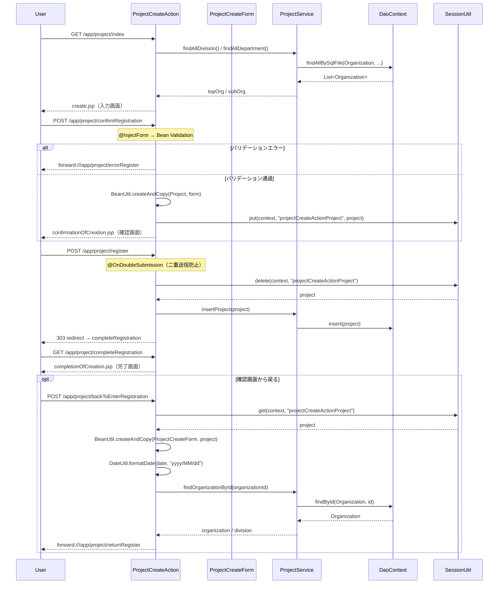

# Code Analysis: ProjectCreateAction

**Generated**: 2026-03-12 17:30:48
**Target**: プロジェクト登録アクション（入力→確認→登録→完了フロー）
**Modules**: proman-web, proman-common
**Analysis Duration**: 約4分33秒

---

## Overview

`ProjectCreateAction` はプロジェクト登録機能のWebアクションクラスである。入力画面表示 → 確認画面表示（バリデーション付き）→ DB登録 → 完了画面表示 という4ステップのCRUDフローを実装している。

確認画面への遷移時に `@InjectForm` でフォームバリデーションを実行し、通過後は `BeanUtil` でエンティティに変換して `SessionUtil` でセッションストアに保存する。登録処理では `@OnDoubleSubmission` により二重送信を防止し、`ProjectService` 経由で `DaoContext`（UniversalDao）を使ってDBにINSERTする。戻る処理では `DateUtil` で日付をフォーマットして入力フォームを再構築する。

コンポーネント構成: Action（ProjectCreateAction）、Form（ProjectCreateForm）、Service（ProjectService）、Entity（Project、Organization）、Nablarch（SessionUtil、BeanUtil、DaoContext）。

---

## Architecture

### Dependency Graph

```mermaid
classDiagram
    class ProjectCreateAction
    class ProjectCreateForm {
        <<Form>>
    }
    class ProjectService
    class Project {
        <<Entity>>
    }
    class Organization {
        <<Entity>>
    }
    class DaoContext {
        <<Nablarch>>
    }
    class SessionUtil {
        <<Nablarch>>
    }
    class BeanUtil {
        <<Nablarch>>
    }
    class DateUtil {
        <<Nablarch>>
    }
    class ExecutionContext {
        <<Nablarch>>
    }

    ProjectCreateAction ..> ProjectCreateForm : validates
    ProjectCreateAction ..> ProjectService : delegates to
    ProjectCreateAction ..> SessionUtil : stores/retrieves
    ProjectCreateAction ..> BeanUtil : converts
    ProjectCreateAction ..> DateUtil : formats
    ProjectCreateAction ..> ExecutionContext : sets scope vars
    ProjectCreateForm ..|> Serializable : implements
    ProjectService ..> DaoContext : queries/persists
    ProjectService ..> Project : persists
    ProjectService ..> Organization : queries
```



**Note**: This diagram uses Mermaid `classDiagram` syntax to show class names and their relationships. Use `--|>` for inheritance (extends/implements) and `..>` for dependencies (uses/creates).

### Component Summary

| Component | Role | Type | Dependencies |
|-----------|------|------|--------------|
| ProjectCreateAction | プロジェクト登録の全画面フロー制御 | Action | ProjectCreateForm, ProjectService, SessionUtil, BeanUtil, DateUtil, ExecutionContext |
| ProjectCreateForm | 登録入力値のバリデーション定義 | Form | DateRelationUtil |
| ProjectService | DB操作のサービス層（DAO委譲） | Service | DaoContext, Project, Organization |
| Project | プロジェクトエンティティ | Entity | なし |
| Organization | 組織（事業部/部門）エンティティ | Entity | なし |

---

## Flow

### Processing Flow

プロジェクト登録は以下の5ステップで構成される：

1. **初期表示（index）**: 事業部・部門のプルダウンデータをDBから取得してリクエストスコープに設定し、入力画面（create.jsp）を返す。
2. **確認画面表示（confirmRegistration）**: `@InjectForm` によりフォームのバリデーションを実行。バリデーション通過後、フォームを `Project` エンティティに変換し、セッションストアに保存して確認画面へ遷移する。バリデーションエラー時は `@OnError` により `forward:///app/project/errorRegister` へ遷移。
3. **登録実行（register）**: `@OnDoubleSubmission` で二重送信を防止。セッションストアから `Project` を取得（同時に削除）し、`ProjectService.insertProject()` でDBへINSERT。303リダイレクトで完了画面へ遷移。
4. **完了画面表示（completeRegistration）**: 登録完了画面（completionOfCreation.jsp）を返すのみのシンプルな処理。
5. **入力画面へ戻る（backToEnterRegistration）**: セッションから `Project` を取得し、`BeanUtil` で `ProjectCreateForm` に変換。`DateUtil.formatDate()` で日付を `yyyy/MM/dd` 形式に変換してフォームに再設定する。組織IDから `ProjectService` で部門・事業部を検索し、divisionIdを設定してリクエストスコープに登録後、登録画面へ内部フォワード。

### Sequence Diagram



---

## Components

### ProjectCreateAction

**ファイル**: [ProjectCreateAction.java](../../.lw/nab-official/v5/nablarch-system-development-guide/Sample_Project/Source_Code/proman-project/proman-web/src/main/java/com/nablarch/example/proman/web/project/ProjectCreateAction.java)

**役割**: プロジェクト登録フローの全画面遷移とビジネスロジック制御を担うWebアクションクラス。

**主要メソッド**:

- `index()` (L33-39): 初期表示。`setOrganizationAndDivisionToRequestScope()` でプルダウン用データをDBから取得し、入力画面を返す。
- `confirmRegistration()` (L48-63): `@InjectForm`・`@OnError` 付き。バリデーション済みフォームをエンティティ変換してセッションに保存し、確認画面へ遷移。
- `register()` (L72-78): `@OnDoubleSubmission` 付き。セッションからエンティティ取得・削除後にDB登録し、303リダイレクト。
- `backToEnterRegistration()` (L98-118): セッションから取得した `Project` をフォームに変換し、日付フォーマット・組織情報を設定して戻り画面へフォワード。

**依存コンポーネント**: ProjectCreateForm, ProjectService, SessionUtil, BeanUtil, DateUtil, ExecutionContext

---

### ProjectCreateForm

**ファイル**: [ProjectCreateForm.java](../../.lw/nab-official/v5/nablarch-system-development-guide/Sample_Project/Source_Code/proman-project/proman-web/src/main/java/com/nablarch/example/proman/web/project/ProjectCreateForm.java)

**役割**: プロジェクト登録入力値を受け取り、`@Required`・`@Domain` アノテーションによるバリデーションルールを定義するフォームクラス。

**主要メソッド**:

- `isValidProjectPeriod()` (L329-331): `@AssertTrue` による相関バリデーション。`DateRelationUtil.isValid()` で開始日が終了日より後でないことを検証。

**依存コンポーネント**: DateRelationUtil（相関バリデーション用ユーティリティ）

---

### ProjectService

**ファイル**: [ProjectService.java](../../.lw/nab-official/v5/nablarch-system-development-guide/Sample_Project/Source_Code/proman-project/proman-web/src/main/java/com/nablarch/example/proman/web/project/ProjectService.java)

**役割**: プロジェクト・組織データのDB操作をカプセル化するサービスクラス。`DaoContext`（UniversalDao）への委譲により、ActionからDAO処理を分離する。

**主要メソッド**:

- `findAllDivision()` (L50-52): SQLファイル `FIND_ALL_DIVISION` を使って全事業部を取得。
- `findAllDepartment()` (L59-61): SQLファイル `FIND_ALL_DEPARTMENT` を使って全部門を取得。
- `findOrganizationById()` (L70-73): 主キーで組織を1件取得。
- `insertProject()` (L80-82): `DaoContext.insert()` でプロジェクトをDB登録。

**依存コンポーネント**: DaoContext（UniversalDao）, Project, Organization

---

## Nablarch Framework Usage

### InjectForm / OnError

**クラス**: `nablarch.common.web.interceptor.InjectForm` / `nablarch.fw.web.interceptor.OnError`

**説明**: `@InjectForm` はHTTPリクエストパラメータをフォームクラスにバインドしてBean Validationを実行するインターセプタ。`@OnError` はバリデーション例外発生時の遷移先を指定する。

**使用方法**:
```java
@InjectForm(form = ProjectCreateForm.class, prefix = "form")
@OnError(type = ApplicationException.class, path = "forward:///app/project/errorRegister")
public HttpResponse confirmRegistration(HttpRequest request, ExecutionContext context) {
    ProjectCreateForm form = context.getRequestScopedVar("form");
    // ...
}
```

**重要ポイント**:
- ✅ **バリデーション済みフォームの取得**: バリデーション通過後は `context.getRequestScopedVar("form")` でフォームオブジェクトを取得できる
- ⚠️ **OnErrorのpath指定**: `forward://` で内部フォワード先を指定。プルダウンの再取得など追加処理が必要な場合は別メソッドへフォワードする
- 💡 **Bean Validationとの統合**: `@Required`・`@Domain` などのアノテーションが自動的に評価される

**このコードでの使い方**:
- `confirmRegistration()` に付与（L48-49）
- バリデーションエラー時は `forward:///app/project/errorRegister` へ遷移

**詳細**: [Web Application Client_create2](../../.claude/skills/nabledge-6/docs/processing-pattern/web-application/web-application-client_create2.md)

---

### SessionUtil

**クラス**: `nablarch.common.web.session.SessionUtil`

**説明**: セッションストアへのデータ保存・取得・削除を行うユーティリティクラス。確認画面フローでフォームデータをエンティティに変換してセッションに保持し、登録処理時に取り出すパターンで使用する。

**使用方法**:
```java
// 保存
SessionUtil.put(context, "projectCreateActionProject", project);

// 取得
Project project = SessionUtil.get(context, PROJECT_KEY);

// 取得して削除
Project project = SessionUtil.delete(context, PROJECT_KEY);
```

**重要ポイント**:
- ✅ **フォームではなくエンティティを保存**: セッションストアにはフォームを直接格納せず、`BeanUtil` でエンティティに変換してから保存する
- ⚠️ **deleteで取得と削除を同時に**: 登録処理では `SessionUtil.delete()` を使ってセッションからデータを取得しながら同時に削除する（セッション汚染防止）
- 💡 **二重送信対策との連携**: `@OnDoubleSubmission` と組み合わせることで、確認→登録の安全なフローを実現

**このコードでの使い方**:
- `confirmRegistration()` でL59: `put()` でProjectをセッションに保存
- `register()` でL74: `delete()` でセッションから取得し削除
- `backToEnterRegistration()` でL100: `get()` でセッションからProjectを取得

**詳細**: [Web Application Client_create2](../../.claude/skills/nabledge-6/docs/processing-pattern/web-application/web-application-client_create2.md)

---

### OnDoubleSubmission

**クラス**: `nablarch.common.web.token.OnDoubleSubmission`

**説明**: フォームの二重送信（ダブルサブミット）をサーバサイドで防止するインターセプタ。JavaScriptが無効な環境でも確実に二重登録を防ぐ。

**使用方法**:
```java
@OnDoubleSubmission
public HttpResponse register(HttpRequest request, ExecutionContext context) {
    // 登録処理
}
```

**重要ポイント**:
- ✅ **登録・更新・削除処理に付与**: データ変更系のアクションメソッドには必ず付与する
- ⚠️ **JSPのallowDoubleSubmission属性との組み合わせ**: クライアントサイドでも `allowDoubleSubmission="false"` を設定して多重クリックを防ぐ
- 💡 **サーバサイドとクライアントサイドの二重防止**: JavaScriptが無効な場合もカバーするため、両方の設定が推奨される

**このコードでの使い方**:
- `register()` メソッドに付与（L72）

**詳細**: [Web Application Client_create4](../../.claude/skills/nabledge-6/docs/processing-pattern/web-application/web-application-client_create4.md)

---

### BeanUtil

**クラス**: `nablarch.core.beans.BeanUtil`

**説明**: JavaBeans間のプロパティコピーを行うユーティリティクラス。フォームからエンティティへの変換、エンティティからフォームへの逆変換に使用する。

**使用方法**:
```java
// フォーム→エンティティ変換（新規生成+コピー）
Project project = BeanUtil.createAndCopy(Project.class, form);

// エンティティ→フォーム変換（新規生成+コピー）
ProjectCreateForm form = BeanUtil.createAndCopy(ProjectCreateForm.class, project);
```

**重要ポイント**:
- ✅ **同名プロパティが自動コピー**: フォームとエンティティのプロパティ名が一致している場合、自動的にコピーされる
- ⚠️ **型変換の制限**: String型フォームプロパティから数値型エンティティプロパティへの変換は自動で行われるが、対応していない型変換がある場合は手動設定が必要
- 💡 **セッションストアとの組み合わせ**: セッションにはフォームではなくエンティティを保存するため、`BeanUtil` による変換が必須

**このコードでの使い方**:
- `confirmRegistration()` でL52: フォームから `Project` エンティティを生成
- `backToEnterRegistration()` でL101: `Project` から `ProjectCreateForm` を再生成

**詳細**: [Web Application Client_create3](../../.claude/skills/nabledge-6/docs/processing-pattern/web-application/web-application-client_create3.md)

---

## References

### Source Files

- [ProjectCreateAction.java (.lw/nab-official/v5/nablarch-system-development-guide/en/Sample_Project/Source_Code/proman-project/proman-web/src/main/java/com/nablarch/example/proman/web/project)](../../.lw/nab-official/v5/nablarch-system-development-guide/en/Sample_Project/Source_Code/proman-project/proman-web/src/main/java/com/nablarch/example/proman/web/project/ProjectCreateAction.java) - ProjectCreateAction
- [ProjectCreateAction.java (.lw/nab-official/v5/nablarch-system-development-guide/Sample_Project/Source_Code/proman-project/proman-web/src/main/java/com/nablarch/example/proman/web/project)](../../.lw/nab-official/v5/nablarch-system-development-guide/Sample_Project/Source_Code/proman-project/proman-web/src/main/java/com/nablarch/example/proman/web/project/ProjectCreateAction.java) - ProjectCreateAction
- [ProjectCreateForm.java (.lw/nab-official/v5/nablarch-system-development-guide/en/Sample_Project/Source_Code/proman-project/proman-web/src/main/java/com/nablarch/example/proman/web/project)](../../.lw/nab-official/v5/nablarch-system-development-guide/en/Sample_Project/Source_Code/proman-project/proman-web/src/main/java/com/nablarch/example/proman/web/project/ProjectCreateForm.java) - ProjectCreateForm
- [ProjectCreateForm.java (.lw/nab-official/v5/nablarch-system-development-guide/Sample_Project/Source_Code/proman-project/proman-web/src/main/java/com/nablarch/example/proman/web/project)](../../.lw/nab-official/v5/nablarch-system-development-guide/Sample_Project/Source_Code/proman-project/proman-web/src/main/java/com/nablarch/example/proman/web/project/ProjectCreateForm.java) - ProjectCreateForm
- [ProjectService.java (.lw/nab-official/v5/nablarch-system-development-guide/en/Sample_Project/Source_Code/proman-project/proman-web/src/main/java/com/nablarch/example/proman/web/project)](../../.lw/nab-official/v5/nablarch-system-development-guide/en/Sample_Project/Source_Code/proman-project/proman-web/src/main/java/com/nablarch/example/proman/web/project/ProjectService.java) - ProjectService
- [ProjectService.java (.lw/nab-official/v5/nablarch-system-development-guide/Sample_Project/Source_Code/proman-project/proman-web/src/main/java/com/nablarch/example/proman/web/project)](../../.lw/nab-official/v5/nablarch-system-development-guide/Sample_Project/Source_Code/proman-project/proman-web/src/main/java/com/nablarch/example/proman/web/project/ProjectService.java) - ProjectService

### Knowledge Base (Nabledge-6)

- [Web Application Client_create2](../../.claude/skills/nabledge-6/docs/processing-pattern/web-application/web-application-client_create2.md)
- [Web Application Client_create4](../../.claude/skills/nabledge-6/docs/processing-pattern/web-application/web-application-client_create4.md)
- [Web Application Client_create3](../../.claude/skills/nabledge-6/docs/processing-pattern/web-application/web-application-client_create3.md)
- [Web Application Getting Started Project Update](../../.claude/skills/nabledge-6/docs/processing-pattern/web-application/web-application-getting-started-project-update.md)
- [Web Application Getting Started Project Delete](../../.claude/skills/nabledge-6/docs/processing-pattern/web-application/web-application-getting-started-project-delete.md)

### Official Documentation


- [BeanUtil](https://nablarch.github.io/docs/LATEST/javadoc/nablarch/core/beans/BeanUtil.html)
- [Client Create2](https://nablarch.github.io/docs/LATEST/doc/application_framework/application_framework/web/getting_started/client_create/client_create2.html)
- [Client Create3](https://nablarch.github.io/docs/LATEST/doc/application_framework/application_framework/web/getting_started/client_create/client_create3.html)
- [Client Create4](https://nablarch.github.io/docs/LATEST/doc/application_framework/application_framework/web/getting_started/client_create/client_create4.html)
- [Index](https://nablarch.github.io/docs/LATEST/doc/application_framework/application_framework/web/getting_started/project_delete/index.html)
- [Index](https://nablarch.github.io/docs/LATEST/doc/application_framework/application_framework/web/getting_started/project_update/index.html)
- [InjectForm](https://nablarch.github.io/docs/LATEST/javadoc/nablarch/common/web/interceptor/InjectForm.html)
- [NoDataException](https://nablarch.github.io/docs/LATEST/javadoc/nablarch/common/dao/NoDataException.html)
- [OnDoubleSubmission](https://nablarch.github.io/docs/LATEST/javadoc/nablarch/common/web/token/OnDoubleSubmission.html)
- [OnError](https://nablarch.github.io/docs/LATEST/javadoc/nablarch/fw/web/interceptor/OnError.html)
- [Required](https://nablarch.github.io/docs/LATEST/javadoc/nablarch/core/validation/ee/Required.html)
- [ResourceLocator](https://nablarch.github.io/docs/LATEST/javadoc/nablarch/fw/web/ResourceLocator.html)
- [SessionUtil](https://nablarch.github.io/docs/LATEST/javadoc/nablarch/common/web/session/SessionUtil.html)
- [UniversalDao](https://nablarch.github.io/docs/LATEST/javadoc/nablarch/common/dao/UniversalDao.html)

---

**Note**: This documentation was generated by the code-analysis workflow of the nabledge-6 skill.
