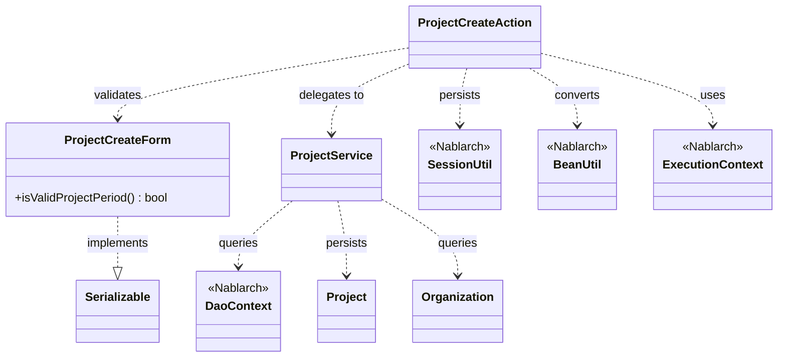
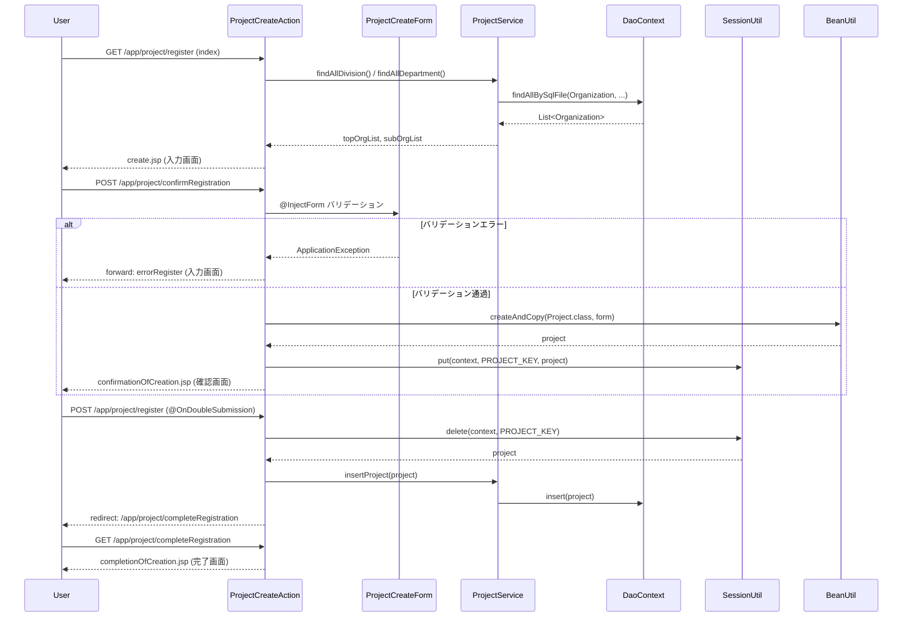

# Code Analysis: ProjectCreateAction

**Generated**: 2026-03-12 17:36:58
**Target**: プロジェクト登録処理（入力→確認→登録の多段階フォーム）
**Modules**: proman-web
**Analysis Duration**: 約3分2秒

---

## Overview

`ProjectCreateAction` はプロジェクト登録機能のWebアクションクラスである。入力画面表示（`index`）→ 入力値バリデーション＆確認画面表示（`confirmRegistration`）→ 登録実行（`register`）→ 完了画面表示（`completeRegistration`）の4ステップで構成される多段階フォームパターンを実装している。

確認画面へ遷移する際にはフォームからエンティティへ変換した `Project` をセッションストアに一時保存し、登録実行時にセッションから取り出してDBへ挿入する。また `backToEnterRegistration` メソッドで確認画面から入力画面への戻りをサポートする。二重サブミット防止には `@OnDoubleSubmission` アノテーションを使用している。

---

## Architecture

### Dependency Graph



**Note**: This diagram uses Mermaid `classDiagram` syntax to show class names and their relationships. Use `--|>` for inheritance (extends/implements) and `..>` for dependencies (uses/creates).

### Component Summary

| Component | Role | Type | Dependencies |
|-----------|------|------|--------------|
| ProjectCreateAction | プロジェクト登録Webアクション | Action | ProjectCreateForm, ProjectService, SessionUtil, BeanUtil, ExecutionContext |
| ProjectCreateForm | 登録入力値フォーム（バリデーション定義） | Form | DateRelationUtil |
| ProjectService | DBアクセスサービス（DAO委譲） | Service | DaoContext, Project, Organization |
| Project | プロジェクトエンティティ | Entity | なし |
| Organization | 組織（事業部/部門）エンティティ | Entity | なし |

---

## Flow

### Processing Flow

1. **初期表示（index）**: 事業部・部門プルダウン一覧をDBから取得しリクエストスコープに設定してから入力JSPへ遷移する。
2. **確認画面遷移（confirmRegistration）**: `@InjectForm` で `ProjectCreateForm` バリデーションを実行する。バリデーション通過後にフォームを `Project` エンティティへ変換しセッションストアへ保存した後、確認画面JSPへ遷移する。エラー時は `@OnError` で入力JSPにフォワードされる。
3. **登録実行（register）**: `@OnDoubleSubmission` で二重サブミットを防止する。セッションから `Project` を取り出して `ProjectService#insertProject` でDBに挿入し、303リダイレクトで完了画面へ遷移する。
4. **完了画面（completeRegistration）**: 完了JSPへフォワードするのみ。
5. **入力画面へ戻る（backToEnterRegistration）**: セッションから `Project` を取得してフォームへ変換し、組織情報をDBから再取得してリクエストスコープに設定してから入力JSPへ内部フォワードする。

### Sequence Diagram



---

## Components

### ProjectCreateAction

**ファイル**: [ProjectCreateAction.java](../../.lw/nab-official/v5/nablarch-system-development-guide/Sample_Project/Source_Code/proman-project/proman-web/src/main/java/com/nablarch/example/proman/web/project/ProjectCreateAction.java)

**役割**: プロジェクト登録フローの全ステップを管理するWebアクションクラス。

**主要メソッド**:

- `index` (L33-39): 初期表示。`setOrganizationAndDivisionToRequestScope` で事業部・部門をリクエストスコープに設定してから入力JSPへ遷移。
- `confirmRegistration` (L48-63): `@InjectForm` / `@OnError` で入力バリデーション。通過後に `BeanUtil.createAndCopy` でフォームをエンティティに変換し `SessionUtil.put` でセッションへ保存。
- `register` (L72-78): `@OnDoubleSubmission` で保護。`SessionUtil.delete` でセッションからエンティティを取得・削除して `ProjectService#insertProject` で登録後、303リダイレクト。
- `backToEnterRegistration` (L98-118): セッションからエンティティを取得し `BeanUtil.createAndCopy` でフォームへ変換。日付フォーマット変換後に組織情報を再取得して入力画面へ内部フォワード。

**依存コンポーネント**: ProjectCreateForm, ProjectService, SessionUtil, BeanUtil, ExecutionContext, DateUtil

### ProjectCreateForm

**ファイル**: [ProjectCreateForm.java](../../.lw/nab-official/v5/nablarch-system-development-guide/Sample_Project/Source_Code/proman-project/proman-web/src/main/java/com/nablarch/example/proman/web/project/ProjectCreateForm.java)

**役割**: 登録画面の入力値を受け取るフォームクラス。バリデーションアノテーションを定義する。

**主要フィールド**: projectName, projectType, projectClass, projectStartDate, projectEndDate, divisionId, organizationId, pmKanjiName, plKanjiName, note, salesAmount

**バリデーション** (L25-97): `@Required` / `@Domain` でドメインバリデーション。`@AssertTrue` の `isValidProjectPeriod` (L328-331) で開始日・終了日の相関バリデーションを実施。`Serializable` 実装によりセッションストア保存可能。

### ProjectService

**ファイル**: [ProjectService.java](../../.lw/nab-official/v5/nablarch-system-development-guide/Sample_Project/Source_Code/proman-project/proman-web/src/main/java/com/nablarch/example/proman/web/project/ProjectService.java)

**役割**: DBアクセスをカプセル化するサービスクラス。`DaoContext` (UniversalDao) に委譲する。

**主要メソッド**:

- `findAllDivision` (L50-52): `findAllBySqlFile` で全事業部一覧取得。
- `findAllDepartment` (L59-61): `findAllBySqlFile` で全部門一覧取得。
- `findOrganizationById` (L70-73): `findById` で指定IDの組織を1件取得。
- `insertProject` (L80-82): `insert(project)` でプロジェクトをDB登録。

---

## Nablarch Framework Usage

### @InjectForm

**クラス**: `nablarch.common.web.interceptor.InjectForm`

**説明**: 業務アクションメソッドに付与することで、リクエストパラメータのフォームへのバインドとBean Validationによるバリデーションを自動実行するインターセプター。

**使用方法**:
```java
@InjectForm(form = ProjectCreateForm.class, prefix = "form")
@OnError(type = ApplicationException.class, path = "forward:///app/project/errorRegister")
public HttpResponse confirmRegistration(HttpRequest request, ExecutionContext context) {
    ProjectCreateForm form = context.getRequestScopedVar("form");
    // バリデーション済みフォームをリクエストスコープから取得
}
```

**重要ポイント**:
- ✅ **@OnErrorとセットで使用**: バリデーションエラー時のフォワード先を `@OnError` で必ず指定する
- ✅ **リクエストスコープから取得**: バリデーション通過後のフォームは `context.getRequestScopedVar("form")` で取得する
- ⚠️ **フォームはSerializableを実装**: セッションストアへの保存が必要な場合（直接保存は非推奨だが他の用途で必要）

**このコードでの使い方**:
- `confirmRegistration` (L48) で `ProjectCreateForm.class` を対象にバリデーション実行
- バリデーションエラー時は `@OnError` で `forward:///app/project/errorRegister` へ遷移

**詳細**: [Web Application Client_create2](../../.claude/skills/nabledge-6/docs/processing-pattern/web-application/web-application-client_create2.md)

---

### SessionUtil

**クラス**: `nablarch.common.web.session.SessionUtil`

**説明**: セッションストアへのデータ保存・取得・削除を行うユーティリティクラス。確認画面を挟む登録フローでフォームとDB登録の間のエンティティを一時保持するために使用する。

**使用方法**:
```java
// 保存（確認画面遷移時）
SessionUtil.put(context, PROJECT_KEY, project);

// 取得（登録実行時）
Project project = SessionUtil.delete(context, PROJECT_KEY);
```

**重要ポイント**:
- ✅ **登録実行時は `delete` で取得**: `delete` はセッションから取り出して同時に削除するため、登録完了後の不要なセッション残留を防ぐ
- ⚠️ **フォームは直接格納しない**: `SessionUtil.put` にはBeanUtilでエンティティに変換してから格納する。フォームをそのままセッションストアに格納すべきではない
- 💡 **プルダウン初期化のための空セット**: `setOrganizationAndDivisionToRequestScope` でセッションに空文字を put しているのは、セッションストアの既存値をクリアするため

**このコードでの使い方**:
- `confirmRegistration` (L59): `put` で `Project` エンティティをセッションに保存
- `register` (L74): `delete` でセッションから取得と同時に削除
- `backToEnterRegistration` (L100): `get` でセッションから取得（削除しない）

**詳細**: [Web Application Client_create4](../../.claude/skills/nabledge-6/docs/processing-pattern/web-application/web-application-client_create4.md)

---

### BeanUtil

**クラス**: `nablarch.core.beans.BeanUtil`

**説明**: JavaBeans間のプロパティコピーを行うユーティリティ。フォームからエンティティへ、エンティティからフォームへの変換に使用する。

**使用方法**:
```java
// フォーム → エンティティ（新規作成してコピー）
Project project = BeanUtil.createAndCopy(Project.class, form);

// エンティティ → フォーム（新規作成してコピー）
ProjectCreateForm form = BeanUtil.createAndCopy(ProjectCreateForm.class, project);
```

**重要ポイント**:
- ✅ **セッションに保存する前に変換**: フォームをセッションストアに直接保存せず、必ずエンティティに変換してから保存する
- ⚠️ **同名プロパティのみコピー**: プロパティ名が一致するフィールドのみコピーされる。型変換が必要なフィールドは別途設定が必要
- 💡 **確認画面→戻る時の復元**: `backToEnterRegistration` でエンティティをフォームへ変換して入力値を復元できる

**このコードでの使い方**:
- `confirmRegistration` (L52): `createAndCopy(Project.class, form)` でフォームをエンティティに変換
- `backToEnterRegistration` (L101): `createAndCopy(ProjectCreateForm.class, project)` でエンティティをフォームに変換

**詳細**: [Web Application Client_create3](../../.claude/skills/nabledge-6/docs/processing-pattern/web-application/web-application-client_create3.md)

---

### @OnDoubleSubmission

**クラス**: `nablarch.common.web.token.OnDoubleSubmission`

**説明**: 業務アクションメソッドに付与することで、二重サブミット（確定ボタンの連続クリック等）を防止するインターセプター。サーバサイドでトークンを検証して重複実行を防ぐ。

**使用方法**:
```java
@OnDoubleSubmission
public HttpResponse register(HttpRequest request, ExecutionContext context) {
    // この中の処理は1度しか実行されない
    Project project = SessionUtil.delete(context, PROJECT_KEY);
    service.insertProject(project);
    return new HttpResponse(303, "redirect:///app/project/completeRegistration");
}
```

**重要ポイント**:
- ✅ **登録・更新・削除の実行メソッドに必ず付与**: データ変更を行うすべての実行メソッドに付与すること
- ⚠️ **確認画面JSPで `useToken="true"` が必要**: `<n:form useToken="true">` を確認画面のフォームタグに設定してトークンを発行する
- 💡 **JavaScriptと組み合わせる**: JSPの `allowDoubleSubmission="false"` と組み合わせてフロントエンドとサーバサイドの両方で二重サブミットを防止する

**このコードでの使い方**:
- `register` (L72): 登録実行メソッドに付与して二重登録を防止

**詳細**: [Web Application Client_create4](../../.claude/skills/nabledge-6/docs/processing-pattern/web-application/web-application-client_create4.md)

---

### DaoContext (ProjectService経由)

**クラス**: `nablarch.common.dao.DaoContext`

**説明**: UniversalDaoのインターフェース。SQLファイルやエンティティを使ったDB操作を提供する。ProjectServiceがコンストラクタインジェクションで受け取り、DAO操作に使用する。

**使用方法**:
```java
// SQLファイルを使った全件取得
List<Organization> list = universalDao.findAllBySqlFile(Organization.class, "FIND_ALL_DIVISION");

// 主キー検索
Organization org = universalDao.findById(Organization.class, new Object[]{organizationId});

// 登録
universalDao.insert(project);
```

**重要ポイント**:
- 💡 **ProjectServiceでカプセル化**: アクションクラスが直接DaoContextを使わず、ProjectServiceに委譲することでDBアクセスロジックを分離している
- ✅ **SQLファイルでの組織検索**: 組織情報は `FIND_ALL_DIVISION` / `FIND_ALL_DEPARTMENT` というSQL IDでSQLファイルから検索

**このコードでの使い方**:
- `ProjectService#findAllDivision` (L50-52): 事業部一覧取得
- `ProjectService#findAllDepartment` (L59-61): 部門一覧取得
- `ProjectService#insertProject` (L80-82): プロジェクト登録

**詳細**: [Web Application Getting Started Project Update](../../.claude/skills/nabledge-6/docs/processing-pattern/web-application/web-application-getting-started-project-update.md)

---

## References

### Source Files

- [ProjectCreateAction.java (.lw/nab-official/v5/nablarch-system-development-guide/en/Sample_Project/Source_Code/proman-project/proman-web/src/main/java/com/nablarch/example/proman/web/project)](../../.lw/nab-official/v5/nablarch-system-development-guide/en/Sample_Project/Source_Code/proman-project/proman-web/src/main/java/com/nablarch/example/proman/web/project/ProjectCreateAction.java) - ProjectCreateAction
- [ProjectCreateAction.java (.lw/nab-official/v5/nablarch-system-development-guide/Sample_Project/Source_Code/proman-project/proman-web/src/main/java/com/nablarch/example/proman/web/project)](../../.lw/nab-official/v5/nablarch-system-development-guide/Sample_Project/Source_Code/proman-project/proman-web/src/main/java/com/nablarch/example/proman/web/project/ProjectCreateAction.java) - ProjectCreateAction
- [ProjectCreateForm.java (.lw/nab-official/v5/nablarch-system-development-guide/en/Sample_Project/Source_Code/proman-project/proman-web/src/main/java/com/nablarch/example/proman/web/project)](../../.lw/nab-official/v5/nablarch-system-development-guide/en/Sample_Project/Source_Code/proman-project/proman-web/src/main/java/com/nablarch/example/proman/web/project/ProjectCreateForm.java) - ProjectCreateForm
- [ProjectCreateForm.java (.lw/nab-official/v5/nablarch-system-development-guide/Sample_Project/Source_Code/proman-project/proman-web/src/main/java/com/nablarch/example/proman/web/project)](../../.lw/nab-official/v5/nablarch-system-development-guide/Sample_Project/Source_Code/proman-project/proman-web/src/main/java/com/nablarch/example/proman/web/project/ProjectCreateForm.java) - ProjectCreateForm
- [ProjectService.java (.lw/nab-official/v5/nablarch-system-development-guide/en/Sample_Project/Source_Code/proman-project/proman-web/src/main/java/com/nablarch/example/proman/web/project)](../../.lw/nab-official/v5/nablarch-system-development-guide/en/Sample_Project/Source_Code/proman-project/proman-web/src/main/java/com/nablarch/example/proman/web/project/ProjectService.java) - ProjectService
- [ProjectService.java (.lw/nab-official/v5/nablarch-system-development-guide/Sample_Project/Source_Code/proman-project/proman-web/src/main/java/com/nablarch/example/proman/web/project)](../../.lw/nab-official/v5/nablarch-system-development-guide/Sample_Project/Source_Code/proman-project/proman-web/src/main/java/com/nablarch/example/proman/web/project/ProjectService.java) - ProjectService

### Knowledge Base (Nabledge-6)

- [Web Application Client_create2](../../.claude/skills/nabledge-6/docs/processing-pattern/web-application/web-application-client_create2.md)
- [Web Application Client_create4](../../.claude/skills/nabledge-6/docs/processing-pattern/web-application/web-application-client_create4.md)
- [Web Application Client_create3](../../.claude/skills/nabledge-6/docs/processing-pattern/web-application/web-application-client_create3.md)
- [Web Application Getting Started Project Update](../../.claude/skills/nabledge-6/docs/processing-pattern/web-application/web-application-getting-started-project-update.md)

### Official Documentation


- [BeanUtil](https://nablarch.github.io/docs/LATEST/javadoc/nablarch/core/beans/BeanUtil.html)
- [Client Create2](https://nablarch.github.io/docs/LATEST/doc/application_framework/application_framework/web/getting_started/client_create/client_create2.html)
- [Client Create3](https://nablarch.github.io/docs/LATEST/doc/application_framework/application_framework/web/getting_started/client_create/client_create3.html)
- [Client Create4](https://nablarch.github.io/docs/LATEST/doc/application_framework/application_framework/web/getting_started/client_create/client_create4.html)
- [Index](https://nablarch.github.io/docs/LATEST/doc/application_framework/application_framework/web/getting_started/project_update/index.html)
- [InjectForm](https://nablarch.github.io/docs/LATEST/javadoc/nablarch/common/web/interceptor/InjectForm.html)
- [NoDataException](https://nablarch.github.io/docs/LATEST/javadoc/nablarch/common/dao/NoDataException.html)
- [OnDoubleSubmission](https://nablarch.github.io/docs/LATEST/javadoc/nablarch/common/web/token/OnDoubleSubmission.html)
- [OnError](https://nablarch.github.io/docs/LATEST/javadoc/nablarch/fw/web/interceptor/OnError.html)
- [Required](https://nablarch.github.io/docs/LATEST/javadoc/nablarch/core/validation/ee/Required.html)
- [ResourceLocator](https://nablarch.github.io/docs/LATEST/javadoc/nablarch/fw/web/ResourceLocator.html)
- [SessionUtil](https://nablarch.github.io/docs/LATEST/javadoc/nablarch/common/web/session/SessionUtil.html)
- [UniversalDao](https://nablarch.github.io/docs/LATEST/javadoc/nablarch/common/dao/UniversalDao.html)

---

**Note**: This documentation was generated by the code-analysis workflow of the nabledge-6 skill.
