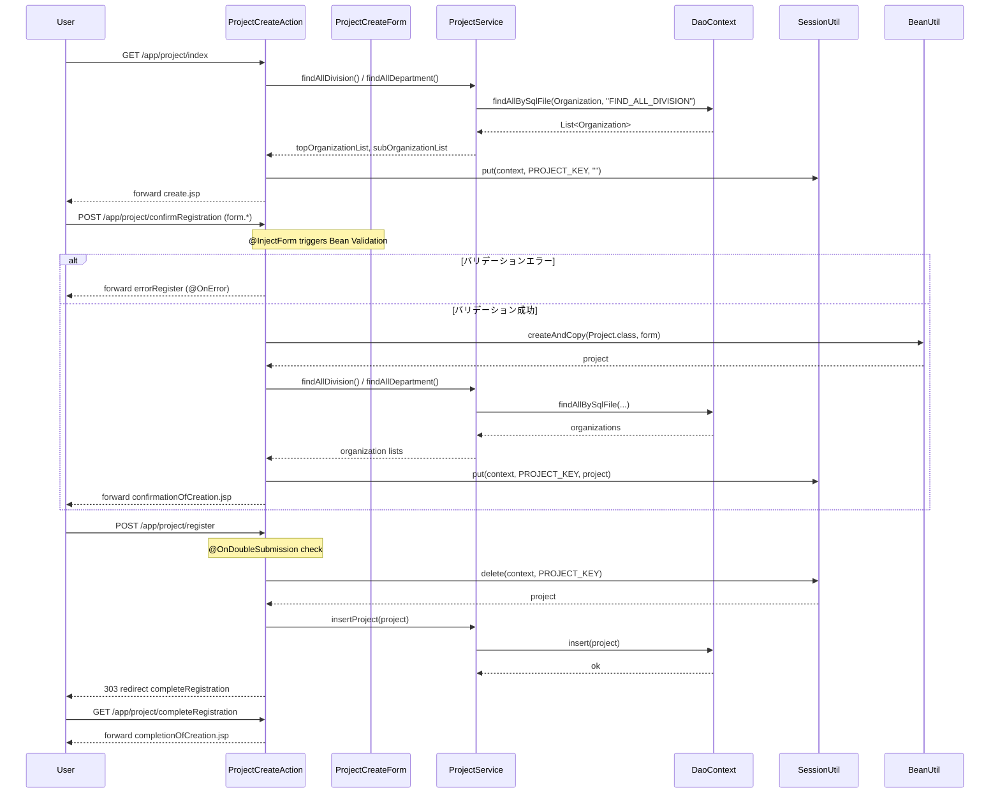

# Code Analysis: ProjectCreateAction

**Generated**: 2026-03-12 17:41:51
**Target**: プロジェクト登録処理アクション
**Modules**: proman-web
**Analysis Duration**: 約2分55秒

---

## Overview

`ProjectCreateAction` は、プロジェクトの新規登録機能を担うWebアクションクラスである。入力→確認→登録→完了の4画面フローを制御し、セッションストアを使って入力データを画面間で受け渡す。

主要な処理：
- `index()`: 登録初期画面の表示（事業部/部門プルダウンをDBから取得）
- `confirmRegistration()`: 入力値のバリデーション実行と確認画面表示
- `register()`: 二重サブミット防止付きのDB登録処理
- `completeRegistration()`: 登録完了画面表示
- `backToEnterRegistration()`: 確認画面から入力画面への戻り処理

Nablarch フレームワークの `@InjectForm`、`@OnError`、`@OnDoubleSubmission` アノテーションおよび `SessionUtil`、`BeanUtil`、`DaoContext`（UniversalDao）を活用した典型的なウェブ登録パターンである。

---

## Architecture

### Dependency Graph

```mermaid
classDiagram
    class ProjectCreateAction
    class ProjectCreateForm {
        <<Form>>
    }
    class ProjectService
    class Project {
        <<Entity>>
    }
    class Organization {
        <<Entity>>
    }
    class DaoContext {
        <<Nablarch>>
    }
    class SessionUtil {
        <<Nablarch>>
    }
    class BeanUtil {
        <<Nablarch>>
    }
    class ExecutionContext {
        <<Nablarch>>
    }
    class HttpRequest {
        <<Nablarch>>
    }
    class HttpResponse {
        <<Nablarch>>
    }

    ProjectCreateAction ..> ProjectCreateForm : validates
    ProjectCreateAction ..> ProjectService : delegates to
    ProjectCreateAction ..> SessionUtil : stores/retrieves
    ProjectCreateAction ..> BeanUtil : converts
    ProjectCreateAction ..> ExecutionContext : uses
    ProjectCreateAction ..> HttpRequest : uses
    ProjectCreateAction ..> HttpResponse : creates
    ProjectCreateForm ..|> Serializable : implements
    ProjectService ..> DaoContext : queries/persists
    ProjectService ..> Project : persists
    ProjectService ..> Organization : queries
```



**Note**: This diagram uses Mermaid `classDiagram` syntax to show class names and their relationships. Use `--|>` for inheritance (extends/implements) and `..>` for dependencies (uses/creates).

### Component Summary

| Component | Role | Type | Dependencies |
|-----------|------|------|--------------|
| ProjectCreateAction | プロジェクト登録4画面フロー制御 | Action | ProjectCreateForm, ProjectService, SessionUtil, BeanUtil, ExecutionContext |
| ProjectCreateForm | 登録入力値バリデーション用フォーム | Form | DateRelationUtil |
| ProjectService | DB操作サービス（事業部取得・登録） | Service | DaoContext（UniversalDao） |
| Project | プロジェクトエンティティ | Entity | なし |
| Organization | 組織（事業部/部門）エンティティ | Entity | なし |

---

## Flow

### Processing Flow

プロジェクト登録は以下の4ステップフローで処理される：

**1. 初期表示（index）**
HTTPリクエストを受け取り、`ProjectService` 経由で事業部・部門リストをDBから取得し、リクエストスコープに設定してから登録入力JSPへフォワードする。セッションストアを初期化（空文字列でPUT）する。

**2. 確認画面表示（confirmRegistration）**
`@InjectForm(form = ProjectCreateForm.class, prefix = "form")` によりリクエストパラメータのバリデーションを実行する。バリデーションエラー時は `@OnError` によりエラー画面へフォワードされる。バリデーション成功後は `BeanUtil.createAndCopy()` でフォームをエンティティに変換し、`SessionUtil.put()` でセッションストアに保存して確認画面へフォワードする。

**3. 登録処理（register）**
`@OnDoubleSubmission` により二重サブミット防止を行う。`SessionUtil.delete()` でセッションストアからプロジェクトエンティティを取得・削除し、`ProjectService.insertProject()` でDBに登録する。303リダイレクトで完了画面へ遷移する。

**4. 確認→入力戻り（backToEnterRegistration）**
セッションストアからプロジェクトを取得し、`BeanUtil.createAndCopy()` でフォームに変換する。日付文字列を `yyyy/MM/dd` 形式にフォーマットし直し、組織情報をDBから再取得して事業部IDを設定し、リクエストスコープ経由で入力画面へ内部フォワードする。

### Sequence Diagram



---

## Components

### ProjectCreateAction

**ファイル**: [ProjectCreateAction.java](../../.lw/nab-official/v5/nablarch-system-development-guide/Sample_Project/Source_Code/proman-project/proman-web/src/main/java/com/nablarch/example/proman/web/project/ProjectCreateAction.java)

**役割**: プロジェクト登録機能の画面フロー制御。入力・確認・登録・完了・戻り処理の5メソッドを持つ。

**主要メソッド**:

- `index(HttpRequest, ExecutionContext)` [L33-39]: 登録初期画面表示。`setOrganizationAndDivisionToRequestScope()` で事業部/部門を取得し `create.jsp` へフォワード。
- `confirmRegistration(HttpRequest, ExecutionContext)` [L48-63]: `@InjectForm` でバリデーション実行後、フォームをエンティティに変換してセッション保存し確認画面表示。
- `register(HttpRequest, ExecutionContext)` [L72-78]: `@OnDoubleSubmission` 付きの登録処理。セッションからエンティティ取得・削除→DB登録→303リダイレクト。
- `backToEnterRegistration(HttpRequest, ExecutionContext)` [L98-118]: セッションからエンティティ取得→フォームに変換→日付フォーマット→組織情報再取得→入力画面へ内部フォワード。

**依存関係**: ProjectCreateForm（バリデーション）、ProjectService（DB操作）、SessionUtil（セッション操作）、BeanUtil（Bean変換）、DateUtil（日付フォーマット）

---

### ProjectCreateForm

**ファイル**: [ProjectCreateForm.java](../../.lw/nab-official/v5/nablarch-system-development-guide/Sample_Project/Source_Code/proman-project/proman-web/src/main/java/com/nablarch/example/proman/web/project/ProjectCreateForm.java)

**役割**: プロジェクト登録画面の入力値を受け取るフォームクラス。`Serializable` を実装し、各フィールドに `@Required`、`@Domain` アノテーションでバリデーションルールを定義する。

**主要メソッド**:

- `isValidProjectPeriod()` [L329-331]: `@AssertTrue` による相関バリデーション。開始日・終了日の前後関係を `DateRelationUtil.isValid()` で検証する。

**フィールド**: projectName, projectType, projectClass, projectStartDate, projectEndDate, divisionId, organizationId, clientId, pmKanjiName, plKanjiName, note, salesAmount

**依存関係**: DateRelationUtil（日付相関バリデーション）

---

### ProjectService

**ファイル**: [ProjectService.java](../../.lw/nab-official/v5/nablarch-system-development-guide/Sample_Project/Source_Code/proman-project/proman-web/src/main/java/com/nablarch/example/proman/web/project/ProjectService.java)

**役割**: プロジェクト・組織データのDB操作をカプセル化したサービスクラス。`DaoContext`（UniversalDao）を内部で保持し、SQLファイルベースの検索・登録・更新メソッドを提供する。

**主要メソッド**:

- `findAllDivision()` [L50-52]: 全事業部を `FIND_ALL_DIVISION` SQLで取得。
- `findAllDepartment()` [L59-61]: 全部門を `FIND_ALL_DEPARTMENT` SQLで取得。
- `findOrganizationById(Integer)` [L70-73]: 組織IDで1件取得。
- `insertProject(Project)` [L80-82]: プロジェクトエンティティをDB登録。

**依存関係**: DaoContext（UniversalDao相当）、DaoFactory、Project（Entity）、Organization（Entity）

---

## Nablarch Framework Usage

### @InjectForm

**クラス**: `nablarch.common.web.interceptor.InjectForm`

**説明**: 業務アクションメソッドに付与することで、リクエストパラメータのBean Validationを自動実行し、バリデーション済みフォームオブジェクトをリクエストスコープに格納するインターセプタ。

**使用方法**:
```java
@InjectForm(form = ProjectCreateForm.class, prefix = "form")
@OnError(type = ApplicationException.class, path = "forward:///app/project/errorRegister")
public HttpResponse confirmRegistration(HttpRequest request, ExecutionContext context) {
    ProjectCreateForm form = context.getRequestScopedVar("form");
    // バリデーション済みフォームを使用
}
```

**重要ポイント**:
- ✅ **`@OnError` と組み合わせる**: バリデーションエラー時の遷移先を必ず指定する
- ✅ **フォームは `Serializable` を実装**: `@InjectForm` でセッションに格納する場合に必須
- ⚠️ **フォームをそのままセッションに格納しない**: `BeanUtil.createAndCopy()` でエンティティに変換してからセッションストアに保存する

**このコードでの使い方**:
- `confirmRegistration()` で `@InjectForm(form = ProjectCreateForm.class, prefix = "form")` を付与（L48）
- バリデーション成功後、`context.getRequestScopedVar("form")` でフォームを取得（L51）

**詳細**: [Handlers InjectForm](../../.claude/skills/nabledge-6/docs/component/handlers/handlers-InjectForm.md)

---

### @OnDoubleSubmission

**クラス**: `nablarch.common.web.token.OnDoubleSubmission`

**説明**: 業務アクションメソッドへの二重サブミットをサーバサイドで防止するアノテーション。フォームトークンを利用して2回目以降のリクエストを検出し、エラーページへ遷移する。

**使用方法**:
```java
@OnDoubleSubmission
public HttpResponse register(HttpRequest request, ExecutionContext context) {
    // 登録処理（二重実行防止済み）
}
```

**重要ポイント**:
- ✅ **DB更新・登録処理には必ず付与**: ブラウザ更新ボタンによる多重登録を防止する
- 💡 **303リダイレクトと組み合わせる**: 登録完了後は `redirect://` でPRGパターンを適用する
- ⚠️ **JSP側の `allowDoubleSubmission="false"` も設定**: JavaScriptが有効な場合の制御も行う

**このコードでの使い方**:
- `register()` メソッドに付与（L72）
- 登録後 `new HttpResponse(303, "redirect:///app/project/completeRegistration")` でリダイレクト（L77）

**詳細**: [Web Application Client Create4](../../.claude/skills/nabledge-6/docs/processing-pattern/web-application/web-application-client_create4.md)

---

### SessionUtil

**クラス**: `nablarch.common.web.session.SessionUtil`

**説明**: セッションストアへのオブジェクト格納・取得・削除を行うユーティリティクラス。確認画面パターンで入力データを画面間で受け渡すために使用する。

**使用方法**:
```java
// 保存
SessionUtil.put(context, "projectKey", project);
// 取得
Project project = SessionUtil.get(context, "projectKey");
// 取得して削除（登録処理で使用）
Project project = SessionUtil.delete(context, "projectKey");
```

**重要ポイント**:
- ✅ **登録処理では `delete()` を使う**: 取得と同時にセッションから削除することで、完了後の不要データを残さない
- ⚠️ **フォームではなくエンティティを格納する**: `BeanUtil.createAndCopy()` でエンティティに変換してから `put()` する
- 💡 **セッションキーは定数で管理**: `PROJECT_KEY` のような定数で一元管理することでキー名の不一致を防ぐ

**このコードでの使い方**:
- `confirmRegistration()` で `SessionUtil.put(context, PROJECT_KEY, project)` 保存（L59）
- `register()` で `SessionUtil.delete(context, PROJECT_KEY)` で取得・削除（L74）
- `backToEnterRegistration()` で `SessionUtil.get(context, PROJECT_KEY)` で取得（L100）

**詳細**: [Web Application Client Create2](../../.claude/skills/nabledge-6/docs/processing-pattern/web-application/web-application-client_create2.md)

---

### BeanUtil

**クラス**: `nablarch.core.beans.BeanUtil`

**説明**: JavaBeans間のプロパティコピーを行うユーティリティクラス。フォームからエンティティへの変換、またはエンティティからフォームへの逆変換に使用する。

**使用方法**:
```java
// フォーム → エンティティ（新規作成＆コピー）
Project project = BeanUtil.createAndCopy(Project.class, form);
// エンティティ → フォーム（逆変換）
ProjectCreateForm form = BeanUtil.createAndCopy(ProjectCreateForm.class, project);
```

**重要ポイント**:
- ✅ **セッション保存前に変換する**: フォームをそのまま格納せずエンティティに変換することがNablarchの推奨パターン
- ⚠️ **型変換**: フォームはすべてString型、エンティティは適切な型（Integer等）であるため、自動型変換が行われる
- 💡 **プロパティ名が一致するフィールドを自動コピー**: 名前が一致するプロパティのみコピーされる（不一致は無視）

**このコードでの使い方**:
- `confirmRegistration()` でフォーム→エンティティ変換（L52）
- `backToEnterRegistration()` でエンティティ→フォーム逆変換（L101）

**詳細**: [Web Application Client Create3](../../.claude/skills/nabledge-6/docs/processing-pattern/web-application/web-application-client_create3.md)

---

## References

### Source Files

- [ProjectCreateAction.java (.lw/nab-official/v5/nablarch-system-development-guide/en/Sample_Project/Source_Code/proman-project/proman-web/src/main/java/com/nablarch/example/proman/web/project)](../../.lw/nab-official/v5/nablarch-system-development-guide/en/Sample_Project/Source_Code/proman-project/proman-web/src/main/java/com/nablarch/example/proman/web/project/ProjectCreateAction.java) - ProjectCreateAction
- [ProjectCreateAction.java (.lw/nab-official/v5/nablarch-system-development-guide/Sample_Project/Source_Code/proman-project/proman-web/src/main/java/com/nablarch/example/proman/web/project)](../../.lw/nab-official/v5/nablarch-system-development-guide/Sample_Project/Source_Code/proman-project/proman-web/src/main/java/com/nablarch/example/proman/web/project/ProjectCreateAction.java) - ProjectCreateAction
- [ProjectCreateForm.java (.lw/nab-official/v5/nablarch-system-development-guide/en/Sample_Project/Source_Code/proman-project/proman-web/src/main/java/com/nablarch/example/proman/web/project)](../../.lw/nab-official/v5/nablarch-system-development-guide/en/Sample_Project/Source_Code/proman-project/proman-web/src/main/java/com/nablarch/example/proman/web/project/ProjectCreateForm.java) - ProjectCreateForm
- [ProjectCreateForm.java (.lw/nab-official/v5/nablarch-system-development-guide/Sample_Project/Source_Code/proman-project/proman-web/src/main/java/com/nablarch/example/proman/web/project)](../../.lw/nab-official/v5/nablarch-system-development-guide/Sample_Project/Source_Code/proman-project/proman-web/src/main/java/com/nablarch/example/proman/web/project/ProjectCreateForm.java) - ProjectCreateForm
- [ProjectService.java (.lw/nab-official/v5/nablarch-system-development-guide/en/Sample_Project/Source_Code/proman-project/proman-web/src/main/java/com/nablarch/example/proman/web/project)](../../.lw/nab-official/v5/nablarch-system-development-guide/en/Sample_Project/Source_Code/proman-project/proman-web/src/main/java/com/nablarch/example/proman/web/project/ProjectService.java) - ProjectService
- [ProjectService.java (.lw/nab-official/v5/nablarch-system-development-guide/Sample_Project/Source_Code/proman-project/proman-web/src/main/java/com/nablarch/example/proman/web/project)](../../.lw/nab-official/v5/nablarch-system-development-guide/Sample_Project/Source_Code/proman-project/proman-web/src/main/java/com/nablarch/example/proman/web/project/ProjectService.java) - ProjectService

### Knowledge Base (Nabledge-6)

- [Handlers InjectForm](../../.claude/skills/nabledge-6/docs/component/handlers/handlers-InjectForm.md)
- [Web Application Client_create2](../../.claude/skills/nabledge-6/docs/processing-pattern/web-application/web-application-client_create2.md)
- [Web Application Client_create4](../../.claude/skills/nabledge-6/docs/processing-pattern/web-application/web-application-client_create4.md)
- [Web Application Client_create3](../../.claude/skills/nabledge-6/docs/processing-pattern/web-application/web-application-client_create3.md)

### Official Documentation


- [BeanUtil](https://nablarch.github.io/docs/LATEST/javadoc/nablarch/core/beans/BeanUtil.html)
- [Client Create2](https://nablarch.github.io/docs/LATEST/doc/application_framework/application_framework/web/getting_started/client_create/client_create2.html)
- [Client Create3](https://nablarch.github.io/docs/LATEST/doc/application_framework/application_framework/web/getting_started/client_create/client_create3.html)
- [Client Create4](https://nablarch.github.io/docs/LATEST/doc/application_framework/application_framework/web/getting_started/client_create/client_create4.html)
- [InjectForm](https://nablarch.github.io/docs/LATEST/doc/application_framework/application_framework/handlers/web_interceptor/InjectForm.html)
- [InjectForm](https://nablarch.github.io/docs/LATEST/javadoc/nablarch/common/web/interceptor/InjectForm.html)
- [OnDoubleSubmission](https://nablarch.github.io/docs/LATEST/javadoc/nablarch/common/web/token/OnDoubleSubmission.html)
- [OnError](https://nablarch.github.io/docs/LATEST/javadoc/nablarch/fw/web/interceptor/OnError.html)
- [Required](https://nablarch.github.io/docs/LATEST/javadoc/nablarch/core/validation/ee/Required.html)
- [SessionUtil](https://nablarch.github.io/docs/LATEST/javadoc/nablarch/common/web/session/SessionUtil.html)

---

**Note**: This documentation was generated by the code-analysis workflow of the nabledge-6 skill.
