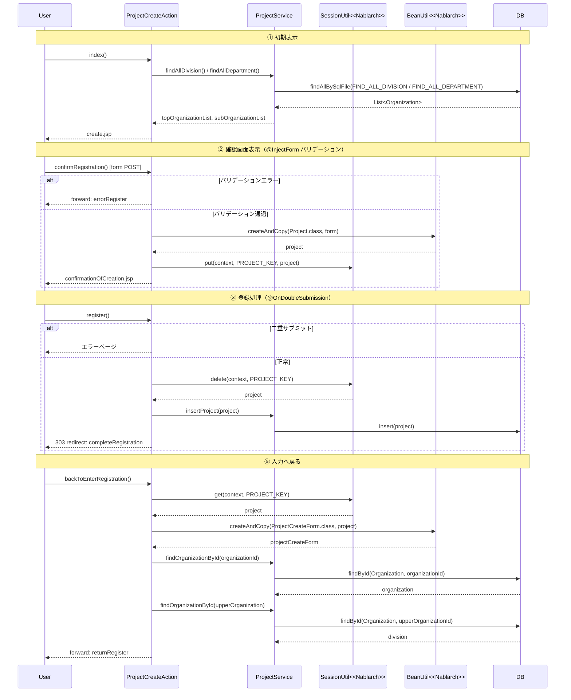

# Code Analysis: ProjectCreateAction

**Generated**: 2026-03-12 17:47:23
**Target**: プロジェクト登録アクション（入力→確認→登録完了フロー）
**Modules**: proman-web
**Analysis Duration**: 約3分12秒

---

## Overview

`ProjectCreateAction` は、プロジェクト新規登録機能のWebアクションクラス。入力画面表示 → バリデーション付き確認画面表示 → DB登録 → 完了画面表示 の4ステップフローを実装する。

確認画面ではセッションストアにエンティティを保存し、登録処理（`register()`）では `@OnDoubleSubmission` アノテーションで二重サブミットをサーバサイドで防止する。事業部・部門のプルダウンデータは `ProjectService` 経由でDBから取得し、`ExecutionContext` のリクエストスコープに設定する。

---

## Architecture

### Dependency Graph

```mermaid
classDiagram
    class ProjectCreateAction
    class ProjectCreateForm {
        <<Form>>
    }
    class ProjectService
    class Project {
        <<Entity>>
    }
    class Organization {
        <<Entity>>
    }
    class ExecutionContext {
        <<Nablarch>>
    }
    class SessionUtil {
        <<Nablarch>>
    }
    class BeanUtil {
        <<Nablarch>>
    }
    class DaoContext {
        <<Nablarch>>
    }

    ProjectCreateForm ..|> Serializable : implements
    ProjectCreateAction ..> ProjectCreateForm : validates
    ProjectCreateAction ..> ProjectService : delegates to
    ProjectCreateAction ..> SessionUtil : stores/retrieves
    ProjectCreateAction ..> BeanUtil : converts
    ProjectCreateAction ..> ExecutionContext : sets scope vars
    ProjectService ..> DaoContext : queries/persists
    ProjectService ..> Project : persists
    ProjectService ..> Organization : queries
```



**Note**: This diagram uses Mermaid `classDiagram` syntax to show class names and their relationships. Use `--|>` for inheritance (extends/implements) and `..>` for dependencies (uses/creates).

### Component Summary

| Component | Role | Type | Dependencies |
|-----------|------|------|--------------|
| ProjectCreateAction | プロジェクト登録アクション（4メソッドフロー） | Action | ProjectCreateForm, ProjectService, SessionUtil, BeanUtil, ExecutionContext |
| ProjectCreateForm | 登録フォーム（入力値バリデーション） | Form | DateRelationUtil |
| ProjectService | DB操作サービス（組織取得・プロジェクト挿入） | Service | DaoContext (UniversalDao) |
| Project | プロジェクトエンティティ | Entity | なし |
| Organization | 組織エンティティ（事業部・部門） | Entity | なし |

---

## Flow

### Processing Flow

プロジェクト登録は以下の4ステップで処理される。

1. **初期表示 (`index()`)**: 事業部・部門プルダウンをDBから取得してリクエストスコープにセットし、入力画面JSPを返す。セッションストアに空文字を設定してセッションを初期化する。
2. **確認画面表示 (`confirmRegistration()`)**: `@InjectForm` + `@OnError` でフォームバリデーションを実行。バリデーション通過後、フォームをエンティティ (`Project`) に変換してセッションストアに保存し、確認画面を表示する。バリデーションエラー時は `errorRegister` へフォワード。
3. **登録処理 (`register()`)**: `@OnDoubleSubmission` で二重サブミット防止。セッションストアから `Project` を取得（削除）し、`ProjectService.insertProject()` でDB挿入。登録完了後は303リダイレクト。
4. **完了表示 (`completeRegistration()`)**: 完了画面JSPを返すのみのシンプルなメソッド。
5. **入力へ戻る (`backToEnterRegistration()`)**: セッションストアから `Project` を取得してフォームに変換。日付フィールドをフォーマット変換（`DateUtil.formatDate()`）してから再表示。組織階層も再取得して `divisionId` を復元する。

### Sequence Diagram



---

## Components

### ProjectCreateAction

**ファイル**: [ProjectCreateAction.java](../../.lw/nab-official/v5/nablarch-system-development-guide/Sample_Project/Source_Code/proman-project/proman-web/src/main/java/com/nablarch/example/proman/web/project/ProjectCreateAction.java)

**役割**: プロジェクト新規登録の画面遷移とビジネスロジックを管理するアクションクラス。

**キーメソッド**:

- `index(L33-39)`: 入力画面初期表示。組織プルダウンデータをDBから取得してリクエストスコープに設定する。
- `confirmRegistration(L48-63)`: `@InjectForm(form = ProjectCreateForm.class, prefix = "form")` でフォームバリデーションを実行。通過後にフォームをエンティティへ変換してセッションストアに保存する。
- `register(L72-78)`: `@OnDoubleSubmission` で二重サブミット防止。セッションストアからエンティティを取得（削除）し、DBに挿入後303リダイレクト。
- `backToEnterRegistration(L98-118)`: セッションから `Project` を復元し、日付のフォーマット変換と組織階層の再取得を行って入力画面に戻る。

**依存**: ProjectCreateForm, ProjectService, SessionUtil, BeanUtil, DateUtil, ExecutionContext

---

### ProjectCreateForm

**ファイル**: [ProjectCreateForm.java](../../.lw/nab-official/v5/nablarch-system-development-guide/Sample_Project/Source_Code/proman-project/proman-web/src/main/java/com/nablarch/example/proman/web/project/ProjectCreateForm.java)

**役割**: プロジェクト登録入力値のバリデーション定義フォームクラス。

**キーメソッド**:

- `isValidProjectPeriod(L329-331)`: `@AssertTrue` で開始日・終了日の整合性チェック。`DateRelationUtil.isValid()` を使用。

**主なフィールドとバリデーション**:
- `projectName`: `@Required @Domain("projectName")`
- `projectStartDate`, `projectEndDate`: `@Required @Domain("date")`
- `divisionId`, `organizationId`: `@Required @Domain("organizationId")`

**依存**: DateRelationUtil, `nablarch.core.validation.ee.*`, `jakarta.validation.constraints.AssertTrue`

---

### ProjectService

**ファイル**: [ProjectService.java](../../.lw/nab-official/v5/nablarch-system-development-guide/Sample_Project/Source_Code/proman-project/proman-web/src/main/java/com/nablarch/example/proman/web/project/ProjectService.java)

**役割**: プロジェクト・組織のDB操作をカプセル化するサービスクラス。

**キーメソッド**:

- `findAllDivision(L50-52)`: SQLファイルID `FIND_ALL_DIVISION` で全事業部を取得。
- `findAllDepartment(L59-61)`: SQLファイルID `FIND_ALL_DEPARTMENT` で全部門を取得。
- `findOrganizationById(L70-73)`: 主キー検索で組織を1件取得。
- `insertProject(L80-82)`: `universalDao.insert(project)` でプロジェクトをDB挿入。

**依存**: DaoContext (UniversalDao), Project, Organization

---

## Nablarch Framework Usage

### InjectForm + OnError

**クラス**: `nablarch.common.web.interceptor.InjectForm`, `nablarch.fw.web.interceptor.OnError`

**説明**: アクションメソッドへのアノテーションで、フォームへのリクエストパラメータのバインドとBean Validationによるバリデーション実行を行う。

**使用方法**:
```java
@InjectForm(form = ProjectCreateForm.class, prefix = "form")
@OnError(type = ApplicationException.class, path = "forward:///app/project/errorRegister")
public HttpResponse confirmRegistration(HttpRequest request, ExecutionContext context) {
    ProjectCreateForm form = context.getRequestScopedVar("form");
    // バリデーション済みフォームをリクエストスコープから取得
}
```

**重要ポイント**:
- ✅ **フォームはSerializableを実装する**: `@InjectForm` を使用するフォームは `Serializable` インタフェースを実装すること（セッションストア格納のため）
- ✅ **バリデーション済みオブジェクトはリクエストスコープから取得**: `context.getRequestScopedVar("form")` で取得する
- ⚠️ **`nablarch.core.validation.ee` を使用**: `nablarch.core.validation.validator` と同名のアノテーションがあるため混同しないこと
- 💡 **バリデーションエラー時の遷移**: `@OnError` の `path` でエラー時のフォワード/リダイレクト先を宣言的に指定できる

**このコードでの使い方**:
- `confirmRegistration()` に `@InjectForm(form = ProjectCreateForm.class, prefix = "form")` を付与してバリデーション実行（L48）
- バリデーションエラー時は `forward:///app/project/errorRegister` に遷移（L49）

**詳細**: [Web Application Client_create2](../../.claude/skills/nabledge-6/docs/processing-pattern/web-application/web-application-client_create2.md)

---

### SessionUtil

**クラス**: `nablarch.common.web.session.SessionUtil`

**説明**: セッションストアへのオブジェクトの保存・取得・削除を行うユーティリティクラス。

**使用方法**:
```java
// 保存
SessionUtil.put(context, "key", entity);
// 取得
Entity entity = SessionUtil.get(context, "key");
// 取得して削除（登録処理など）
Entity entity = SessionUtil.delete(context, "key");
```

**重要ポイント**:
- ✅ **フォームはセッションに格納しない**: `BeanUtil.createAndCopy()` でフォームをエンティティに変換してから格納すること
- ⚠️ **削除を忘れない**: 登録処理では `SessionUtil.delete()` でセッションから削除しつつ取得する。不要なセッションデータが残るとメモリリークにつながる
- 💡 **二重サブミット防止と組み合わせる**: セッションにエンティティを保存し、登録処理で削除するパターンで冪等性を確保

**このコードでの使い方**:
- `confirmRegistration()` で `SessionUtil.put(context, PROJECT_KEY, project)` に保存（L59）
- `register()` で `SessionUtil.delete(context, PROJECT_KEY)` で取得＆削除（L74）
- `backToEnterRegistration()` で `SessionUtil.get(context, PROJECT_KEY)` で取得（L100）

**詳細**: [Web Application Client_create3](../../.claude/skills/nabledge-6/docs/processing-pattern/web-application/web-application-client_create3.md)

---

### OnDoubleSubmission

**クラス**: `nablarch.common.web.token.OnDoubleSubmission`

**説明**: サーバサイドで二重サブミットを防止するアノテーション。同一トークンを持つリクエストが再度送信された場合にエラーページへ遷移する。

**使用方法**:
```java
@OnDoubleSubmission
public HttpResponse register(HttpRequest request, ExecutionContext context) {
    // 二重サブミット時はこのメソッドが実行されずエラーページへ遷移する
}
```

**重要ポイント**:
- ✅ **サーバサイドとクライアントサイドの両方で制御する**: JSでの制御（`allowDoubleSubmission="false"`）に加えてサーバサイドでも制御すること（JavaScriptが無効な場合に備えて）
- 💡 **登録・更新・削除処理に付与**: データを変更するアクションメソッドには必ず付与する
- 🎯 **303リダイレクトと組み合わせる**: 登録成功後は303リダイレクトでブラウザ更新による多重送信を防ぐ

**このコードでの使い方**:
- `register()` に `@OnDoubleSubmission` を付与（L72）
- 登録後は303リダイレクト `new HttpResponse(303, "redirect:///app/project/completeRegistration")` を使用（L77）

**詳細**: [Web Application Client_create4](../../.claude/skills/nabledge-6/docs/processing-pattern/web-application/web-application-client_create4.md)

---

### BeanUtil

**クラス**: `nablarch.core.beans.BeanUtil`

**説明**: Javaビーン間のプロパティコピーを行うユーティリティクラス。フォームからエンティティへの変換や逆変換に使用する。

**使用方法**:
```java
// フォーム → エンティティ（新規生成）
Project project = BeanUtil.createAndCopy(Project.class, form);
// エンティティ → フォーム（新規生成）
ProjectCreateForm form = BeanUtil.createAndCopy(ProjectCreateForm.class, project);
```

**重要ポイント**:
- ✅ **セッション格納前にエンティティへ変換する**: フォームはセッションストアに格納せず、BeanUtilでエンティティに変換してから格納する
- ⚠️ **同名プロパティが自動コピーされる**: フォームとエンティティで同名のプロパティが自動的にコピーされる。意図しないプロパティコピーに注意

**このコードでの使い方**:
- `confirmRegistration()` で `BeanUtil.createAndCopy(Project.class, form)` にてフォーム→エンティティ変換（L52）
- `backToEnterRegistration()` で `BeanUtil.createAndCopy(ProjectCreateForm.class, project)` にてエンティティ→フォーム変換（L101）

**詳細**: [Web Application Client_create3](../../.claude/skills/nabledge-6/docs/processing-pattern/web-application/web-application-client_create3.md)

---

### DaoContext (UniversalDao)

**クラス**: `nablarch.common.dao.DaoContext`

**説明**: データベースアクセスのインタフェース。SQLファイルIDによる検索や主キーによるCRUD操作を提供する。

**使用方法**:
```java
// SQLファイルIDで全件検索
List<Organization> list = universalDao.findAllBySqlFile(Organization.class, "FIND_ALL_DIVISION");
// 主キー検索
Organization org = universalDao.findById(Organization.class, new Object[]{organizationId});
// 挿入
universalDao.insert(project);
```

**重要ポイント**:
- 💡 **SQLファイルで検索条件を管理**: SQLファイルIDを指定することで、SQLを外部ファイルで管理できる
- 🎯 **主キーCRUDはSQLを書かずに実行できる**: `insert()`, `findById()`, `delete()` はSQL不要

**このコードでの使い方**:
- `ProjectService.findAllDivision()` / `findAllDepartment()` でSQLファイルID指定の全件検索（L51, L60）
- `ProjectService.findOrganizationById()` で主キー検索（L72）
- `ProjectService.insertProject()` でプロジェクト挿入（L81）

**詳細**: [Web Application Getting Started Project Delete](../../.claude/skills/nabledge-6/docs/processing-pattern/web-application/web-application-getting-started-project-delete.md)

---

## References

### Source Files

- [ProjectCreateAction.java (.lw/nab-official/v5/nablarch-system-development-guide/en/Sample_Project/Source_Code/proman-project/proman-web/src/main/java/com/nablarch/example/proman/web/project)](../../.lw/nab-official/v5/nablarch-system-development-guide/en/Sample_Project/Source_Code/proman-project/proman-web/src/main/java/com/nablarch/example/proman/web/project/ProjectCreateAction.java) - ProjectCreateAction
- [ProjectCreateAction.java (.lw/nab-official/v5/nablarch-system-development-guide/Sample_Project/Source_Code/proman-project/proman-web/src/main/java/com/nablarch/example/proman/web/project)](../../.lw/nab-official/v5/nablarch-system-development-guide/Sample_Project/Source_Code/proman-project/proman-web/src/main/java/com/nablarch/example/proman/web/project/ProjectCreateAction.java) - ProjectCreateAction
- [ProjectCreateForm.java (.lw/nab-official/v5/nablarch-system-development-guide/en/Sample_Project/Source_Code/proman-project/proman-web/src/main/java/com/nablarch/example/proman/web/project)](../../.lw/nab-official/v5/nablarch-system-development-guide/en/Sample_Project/Source_Code/proman-project/proman-web/src/main/java/com/nablarch/example/proman/web/project/ProjectCreateForm.java) - ProjectCreateForm
- [ProjectCreateForm.java (.lw/nab-official/v5/nablarch-system-development-guide/Sample_Project/Source_Code/proman-project/proman-web/src/main/java/com/nablarch/example/proman/web/project)](../../.lw/nab-official/v5/nablarch-system-development-guide/Sample_Project/Source_Code/proman-project/proman-web/src/main/java/com/nablarch/example/proman/web/project/ProjectCreateForm.java) - ProjectCreateForm
- [ProjectService.java (.lw/nab-official/v5/nablarch-system-development-guide/en/Sample_Project/Source_Code/proman-project/proman-web/src/main/java/com/nablarch/example/proman/web/project)](../../.lw/nab-official/v5/nablarch-system-development-guide/en/Sample_Project/Source_Code/proman-project/proman-web/src/main/java/com/nablarch/example/proman/web/project/ProjectService.java) - ProjectService
- [ProjectService.java (.lw/nab-official/v5/nablarch-system-development-guide/Sample_Project/Source_Code/proman-project/proman-web/src/main/java/com/nablarch/example/proman/web/project)](../../.lw/nab-official/v5/nablarch-system-development-guide/Sample_Project/Source_Code/proman-project/proman-web/src/main/java/com/nablarch/example/proman/web/project/ProjectService.java) - ProjectService

### Knowledge Base (Nabledge-6)

- [Web Application Client_create2](../../.claude/skills/nabledge-6/docs/processing-pattern/web-application/web-application-client_create2.md)
- [Web Application Client_create4](../../.claude/skills/nabledge-6/docs/processing-pattern/web-application/web-application-client_create4.md)
- [Web Application Client_create3](../../.claude/skills/nabledge-6/docs/processing-pattern/web-application/web-application-client_create3.md)
- [Web Application Getting Started Project Update](../../.claude/skills/nabledge-6/docs/processing-pattern/web-application/web-application-getting-started-project-update.md)
- [Web Application Getting Started Project Delete](../../.claude/skills/nabledge-6/docs/processing-pattern/web-application/web-application-getting-started-project-delete.md)

### Official Documentation


- [BeanUtil](https://nablarch.github.io/docs/LATEST/javadoc/nablarch/core/beans/BeanUtil.html)
- [Client Create2](https://nablarch.github.io/docs/LATEST/doc/application_framework/application_framework/web/getting_started/client_create/client_create2.html)
- [Client Create3](https://nablarch.github.io/docs/LATEST/doc/application_framework/application_framework/web/getting_started/client_create/client_create3.html)
- [Client Create4](https://nablarch.github.io/docs/LATEST/doc/application_framework/application_framework/web/getting_started/client_create/client_create4.html)
- [Index](https://nablarch.github.io/docs/LATEST/doc/application_framework/application_framework/web/getting_started/project_delete/index.html)
- [Index](https://nablarch.github.io/docs/LATEST/doc/application_framework/application_framework/web/getting_started/project_update/index.html)
- [InjectForm](https://nablarch.github.io/docs/LATEST/javadoc/nablarch/common/web/interceptor/InjectForm.html)
- [NoDataException](https://nablarch.github.io/docs/LATEST/javadoc/nablarch/common/dao/NoDataException.html)
- [OnDoubleSubmission](https://nablarch.github.io/docs/LATEST/javadoc/nablarch/common/web/token/OnDoubleSubmission.html)
- [OnError](https://nablarch.github.io/docs/LATEST/javadoc/nablarch/fw/web/interceptor/OnError.html)
- [Required](https://nablarch.github.io/docs/LATEST/javadoc/nablarch/core/validation/ee/Required.html)
- [ResourceLocator](https://nablarch.github.io/docs/LATEST/javadoc/nablarch/fw/web/ResourceLocator.html)
- [SessionUtil](https://nablarch.github.io/docs/LATEST/javadoc/nablarch/common/web/session/SessionUtil.html)
- [UniversalDao](https://nablarch.github.io/docs/LATEST/javadoc/nablarch/common/dao/UniversalDao.html)

---

**Note**: This documentation was generated by the code-analysis workflow of the nabledge-6 skill.
