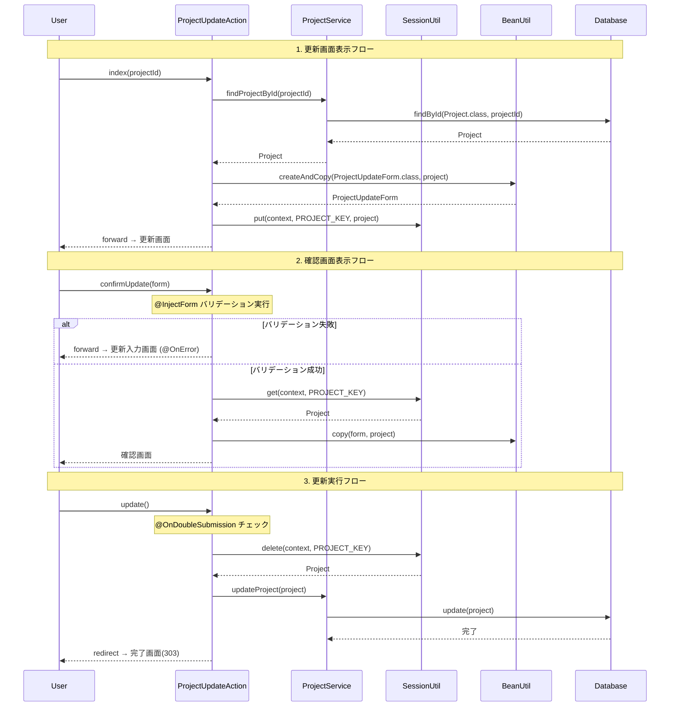

# Code Analysis: ProjectUpdateAction

**Generated**: 2026-03-12 17:58:04
**Target**: プロジェクト更新アクション（更新画面表示・確認・更新実行・完了）
**Modules**: proman-web
**Analysis Duration**: 約3分25秒

---

## Overview

`ProjectUpdateAction` は、プロジェクト情報の更新機能を担うWebアクションクラスである。更新画面の表示から確認・実行・完了までの一連のフローを5つのアクションメソッドで実現する。

主な構成要素：
- **ProjectUpdateAction**: メインのアクションクラス。5メソッドで更新フロー全体を制御する
- **ProjectUpdateInitialForm**: 詳細画面から更新画面へ遷移する際のプロジェクトID受け取り専用フォーム
- **ProjectUpdateForm**: 更新入力値のバリデーション付きフォーム（12項目）
- **ProjectService**: UniversalDao を用いてDB操作を担うサービスクラス

Nablarch の `@InjectForm`・`@OnError`・`@OnDoubleSubmission` インターセプタと `SessionUtil` を活用して、バリデーション・エラー処理・二重サブミット防止・セッション管理を宣言的に行っている。

---

## Architecture

### Dependency Graph

```mermaid
classDiagram
    class ProjectUpdateAction
    class ProjectUpdateInitialForm {
        <<Form>>
    }
    class ProjectUpdateForm {
        <<Form>>
    }
    class ProjectService
    class Project {
        <<Entity>>
    }
    class Organization {
        <<Entity>>
    }
    class DaoContext {
        <<Nablarch>>
    }
    class SessionUtil {
        <<Nablarch>>
    }
    class BeanUtil {
        <<Nablarch>>
    }
    class ExecutionContext {
        <<Nablarch>>
    }
    class HttpRequest {
        <<Nablarch>>
    }
    class HttpResponse {
        <<Nablarch>>
    }

    ProjectUpdateAction ..> ProjectUpdateInitialForm : validates
    ProjectUpdateAction ..> ProjectUpdateForm : validates
    ProjectUpdateAction ..> ProjectService : delegates to
    ProjectUpdateAction ..> SessionUtil : stores/retrieves
    ProjectUpdateAction ..> BeanUtil : copies
    ProjectUpdateAction ..> ExecutionContext : uses
    ProjectUpdateAction ..> HttpRequest : uses
    ProjectUpdateAction ..> HttpResponse : creates
    ProjectService ..> DaoContext : queries/persists
    ProjectService ..> Project : queries/persists
    ProjectService ..> Organization : queries
    ProjectUpdateInitialForm ..|> Serializable : uses
    ProjectUpdateForm ..|> Serializable : uses
```



**Note**: This diagram uses Mermaid `classDiagram` syntax to show class names and their relationships. Use `--|>` for inheritance (extends/implements) and `..>` for dependencies (uses/creates).

### Component Summary

| Component | Role | Type | Dependencies |
|-----------|------|------|--------------|
| ProjectUpdateAction | 更新フロー全体の制御（5メソッド） | Action | ProjectUpdateInitialForm, ProjectUpdateForm, ProjectService, SessionUtil, BeanUtil, ExecutionContext |
| ProjectUpdateInitialForm | 詳細→更新画面遷移時のプロジェクトID受け取り | Form | なし |
| ProjectUpdateForm | 更新入力値のバリデーション（12項目） | Form | DateRelationUtil |
| ProjectService | DB操作（検索・更新・組織取得） | Service | DaoContext（UniversalDao） |
| Project | プロジェクトエンティティ（DB マッピング） | Entity | なし |
| Organization | 組織エンティティ（事業部・部門） | Entity | なし |

---

## Flow

### Processing Flow

`ProjectUpdateAction` は5段階のフローでプロジェクト更新を実現する。

1. **index（更新画面表示）**: 詳細画面から受け取った `projectId` で `ProjectService.findProjectById()` を呼び出し、DB からプロジェクトを取得。`BeanUtil.createAndCopy()` でエンティティからフォームに変換し、日付を `yyyy/MM/dd` 形式にフォーマット後、`SessionUtil.put()` でセッションストアに保存して更新画面に遷移する。

2. **indexSetPullDown（プルダウン付き更新画面表示）**: 確認画面からの遷移など、プルダウン（事業部・部門）が必要な場合に使用。`ProjectService` から全事業部・部門リストを取得してリクエストスコープに設定する。

3. **confirmUpdate（更新確認画面表示）**: `@InjectForm` でバリデーション実行後、セッションストアのエンティティに `BeanUtil.copy()` でフォーム値をコピーして確認画面を表示。バリデーション失敗時は `@OnError` により更新入力画面にフォワードする。

4. **update（更新実行）**: `@OnDoubleSubmission` による二重サブミット防止後、`SessionUtil.delete()` でセッションからエンティティを取り出し、`ProjectService.updateProject()` でDB更新してリダイレクトする。

5. **backToEnterUpdate（入力画面に戻る）**: 確認画面から入力画面に戻る際、セッションからエンティティを再取得してフォームに変換し直し、更新入力画面にフォワードする。

**エラー処理**: `confirmUpdate` に `@OnError(type = ApplicationException.class, path = "forward:///app/project/moveUpdate")` を付与し、バリデーション例外発生時に自動的に更新入力画面に内部フォワードする。

### Sequence Diagram



---

## Components

### ProjectUpdateAction

**ファイル**: [ProjectUpdateAction.java](../../.lw/nab-official/v5/nablarch-system-development-guide/Sample_Project/Source_Code/proman-project/proman-web/src/main/java/com/nablarch/example/proman/web/project/ProjectUpdateAction.java)

**役割**: プロジェクト更新の全フローを制御するアクションクラス。

**キーメソッド**:

- `index(HttpRequest, ExecutionContext)` [L35-43]: `@InjectForm(form=ProjectUpdateInitialForm.class)` でプロジェクトIDを受け取り、DB からプロジェクトを取得してセッションストアに保存する
- `confirmUpdate(HttpRequest, ExecutionContext)` [L54-62]: `@InjectForm(form=ProjectUpdateForm.class, prefix="form")` と `@OnError` でバリデーション＋エラーフォワードを宣言的に処理する
- `update(HttpRequest, ExecutionContext)` [L72-77]: `@OnDoubleSubmission` で二重サブミット防止後、セッションからエンティティを取得して DB 更新する
- `backToEnterUpdate(HttpRequest, ExecutionContext)` [L97-102]: 確認画面から入力画面に戻る際、セッションのエンティティを再フォームに変換する
- `buildFormFromEntity(Project, ProjectService)` [L111-125]: エンティティ→フォーム変換のヘルパーメソッド（日付フォーマット・組織ID設定）
- `setOrganizationAndDivisionToRequestScope(ExecutionContext)` [L148-158]: 事業部・部門リストをリクエストスコープに設定するヘルパーメソッド

**依存関係**: ProjectUpdateInitialForm, ProjectUpdateForm, ProjectService, SessionUtil, BeanUtil, DateUtil, ExecutionContext

---

### ProjectUpdateInitialForm

**ファイル**: [ProjectUpdateInitialForm.java](../../.lw/nab-official/v5/nablarch-system-development-guide/Sample_Project/Source_Code/proman-project/proman-web/src/main/java/com/nablarch/example/proman/web/project/ProjectUpdateInitialForm.java)

**役割**: 詳細画面から更新画面への遷移専用フォーム。プロジェクトIDのみを保持する。

**キーフィールド**: `projectId`（`@Required` + `@Domain("projectId")`）

**依存関係**: なし

---

### ProjectUpdateForm

**ファイル**: [ProjectUpdateForm.java](../../.lw/nab-official/v5/nablarch-system-development-guide/Sample_Project/Source_Code/proman-project/proman-web/src/main/java/com/nablarch/example/proman/web/project/ProjectUpdateForm.java)

**役割**: 更新画面の入力値を受け取り、バリデーションを定義するフォームクラス。

**キーフィールド**:
- `projectName`, `projectType`, `projectClass`: `@Required` + `@Domain`
- `projectStartDate`, `projectEndDate`: `@Required` + `@Domain("date")` + `isValidProjectPeriod()` で期間整合性チェック
- `divisionId`, `organizationId`, `pmKanjiName`, `plKanjiName`: `@Required`
- `clientId`, `note`, `salesAmount`: 任意項目

**特記事項**: `@AssertTrue` の `isValidProjectPeriod()` [L329-331] で開始日・終了日の前後関係を検証する。

**依存関係**: DateRelationUtil（期間バリデーション）

---

### ProjectService

**ファイル**: [ProjectService.java](../../.lw/nab-official/v5/nablarch-system-development-guide/Sample_Project/Source_Code/proman-project/proman-web/src/main/java/com/nablarch/example/proman/web/project/ProjectService.java)

**役割**: UniversalDao を用いた DB 操作を集約するサービスクラス。

**キーメソッド**:
- `findProjectById(Integer)` [L124-126]: プライマリキーでプロジェクト1件取得
- `updateProject(Project)` [L89-91]: `universalDao.update(project)` でエンティティ更新（楽観的ロック実行）
- `findOrganizationById(Integer)` [L70-73]: 組織IDで組織を取得
- `findAllDivision()` / `findAllDepartment()` [L50-61]: 全事業部・全部門リストをSQLファイルで取得

**依存関係**: DaoContext（UniversalDao）, Project（Entity）, Organization（Entity）

---

## Nablarch Framework Usage

### @InjectForm

**クラス**: `nablarch.common.web.interceptor.InjectForm`

**説明**: アクションメソッドのリクエストパラメータに対してバリデーションを実行し、フォームオブジェクトをリクエストスコープに格納するインターセプタアノテーション。

**使用方法**:
```java
@InjectForm(form = ProjectUpdateForm.class, prefix = "form")
@OnError(type = ApplicationException.class, path = "forward:///app/project/moveUpdate")
public HttpResponse confirmUpdate(HttpRequest request, ExecutionContext context) {
    ProjectUpdateForm form = context.getRequestScopedVar("form");
    // ...
}
```

**重要ポイント**:
- ✅ **`prefix` で名前空間を指定**: `prefix = "form"` を指定すると、`form.projectName` のようなリクエストパラメータを受け取る
- ⚠️ **`@OnError` とセットで使う**: バリデーション失敗時（`ApplicationException`）に自動的にエラーページへフォワードするため、必ず `@OnError` を合わせて設定する
- 💡 **リクエストスコープから取得**: バリデーション成功後、`context.getRequestScopedVar("form")` でフォームオブジェクトを取得できる

**このコードでの使い方**:
- `index()` では `ProjectUpdateInitialForm.class` でプロジェクトID のみを受け取る（Line 34）
- `confirmUpdate()` では `ProjectUpdateForm.class` と `prefix = "form"` で更新入力値全体を受け取る（Line 52）

**詳細**: [Handlers InjectForm](../../.claude/skills/nabledge-6/docs/component/handlers/handlers-InjectForm.md)

---

### @OnError

**クラス**: `nablarch.fw.web.interceptor.OnError`

**説明**: 指定した例外クラスが発生した場合に、指定パスへ自動的に遷移させるインターセプタアノテーション。

**使用方法**:
```java
@InjectForm(form = ProjectUpdateForm.class, prefix = "form")
@OnError(type = ApplicationException.class, path = "forward:///app/project/moveUpdate")
public HttpResponse confirmUpdate(HttpRequest request, ExecutionContext context) {
    // ApplicationException 発生時は自動的に更新入力画面へフォワード
}
```

**重要ポイント**:
- ✅ **`@InjectForm` とセットで定義する**: バリデーション失敗は `ApplicationException` として発生するため、`@OnError` で遷移先を指定する
- 💡 **内部フォワードで表示データを再取得**: `path = "forward://メソッド名"` を使うと、エラー表示用データをDBから再取得するメソッドへフォワードできる
- ⚠️ **リクエストスコープはフォワード後も維持**: フォワード先にバリデーション済みフォームのエラー情報が引き継がれるため、JSPでエラーメッセージを表示できる

**このコードでの使い方**:
- `confirmUpdate()` に `path = "forward:///app/project/moveUpdate"` を指定し、バリデーション失敗時に更新入力画面に戻る（Line 53）

**詳細**: [Handlers On_error](../../.claude/skills/nabledge-6/docs/component/handlers/handlers-on_error.md)

---

### @OnDoubleSubmission

**クラス**: `nablarch.common.web.token.OnDoubleSubmission`

**説明**: フォームトークンを検証して二重サブミットを防止するインターセプタアノテーション。

**使用方法**:
```java
@OnDoubleSubmission
public HttpResponse update(HttpRequest request, ExecutionContext context) {
    final Project project = SessionUtil.delete(context, PROJECT_KEY);
    ProjectService service = new ProjectService();
    service.updateProject(project);
    return new HttpResponse(303, "redirect:///app/project/completeUpdate");
}
```

**重要ポイント**:
- ✅ **DB更新メソッドには必ず付与**: ブラウザの戻るボタンや再送信による二重更新を防ぐ
- ⚠️ **JSP側でもトークン設定が必要**: 確認画面の `<n:form useToken="true">` でトークンを発行する必要がある
- 💡 **303 リダイレクト**: 更新後は `new HttpResponse(303, "redirect:///app/project/completeUpdate")` でリダイレクトし、ブラウザリロードによる再実行を防ぐ

**このコードでの使い方**:
- `update()` メソッドに付与して更新処理の二重実行を防止（Line 71）

---

### SessionUtil

**クラス**: `nablarch.common.web.session.SessionUtil`

**説明**: セッションストアへのオブジェクトの保存・取得・削除を行うユーティリティクラス。

**使用方法**:
```java
// 保存
SessionUtil.put(context, PROJECT_KEY, project);
// 取得
Project project = SessionUtil.get(context, PROJECT_KEY);
// 取得して削除（更新実行時）
Project project = SessionUtil.delete(context, PROJECT_KEY);
```

**重要ポイント**:
- ✅ **更新実行時は `delete()` を使う**: `delete()` でセッションから取り出すと同時に削除し、不要なセッションデータの残留を防ぐ
- ⚠️ **フォームオブジェクトは直接セッションに格納しない**: `Serializable` でない可能性があるため、エンティティ等の適切な Bean に変換してから格納する
- ⚠️ **存在しないキーの `get()` は例外**: セッションに保存されていないキーを取得しようとすると `SessionKeyNotFoundException` が発生するため、正常な画面遷移フローを保証する必要がある

**このコードでの使い方**:
- `index()` で `SessionUtil.put(context, PROJECT_KEY, project)` により編集開始時の Project エンティティを保存（Line 41）
- `confirmUpdate()` で `SessionUtil.get(context, PROJECT_KEY)` により保存済みエンティティを取得（Line 56）
- `update()` で `SessionUtil.delete(context, PROJECT_KEY)` によりエンティティを取得しつつセッションから削除（Line 73）

**詳細**: [Libraries Session_store](../../.claude/skills/nabledge-6/docs/component/libraries/libraries-session_store.md)

---

### BeanUtil

**クラス**: `nablarch.core.beans.BeanUtil`

**説明**: Java Bean 間のプロパティコピーを行うユーティリティクラス。

**使用方法**:
```java
// 新規 Bean 生成してコピー
ProjectUpdateForm form = BeanUtil.createAndCopy(ProjectUpdateForm.class, project);
// 既存 Bean にコピー（上書き）
BeanUtil.copy(form, project);
```

**重要ポイント**:
- ✅ **プロパティ名を一致させる**: コピー元・コピー先でプロパティ名が一致する項目のみコピーされるため、フォームとエンティティのプロパティ名を揃える
- 💡 **型変換に対応**: 互換性のある型（例：`String` ↔ `Integer`）は自動変換してコピーされる
- ⚠️ **コピーされない項目に注意**: `divisionId` のようにフォーム固有のプロパティはエンティティに存在しないため、個別に設定が必要

**このコードでの使い方**:
- `buildFormFromEntity()` で `BeanUtil.createAndCopy(ProjectUpdateForm.class, project)` によりエンティティをフォームに変換（Line 112）
- `confirmUpdate()` で `BeanUtil.copy(form, project)` によりフォームの更新値をエンティティにコピー（Line 57）

---

## References

### Source Files

- [ProjectUpdateAction.java (.lw/nab-official/v5/nablarch-system-development-guide/en/Sample_Project/Source_Code/proman-project/proman-web/src/main/java/com/nablarch/example/proman/web/project)](../../.lw/nab-official/v5/nablarch-system-development-guide/en/Sample_Project/Source_Code/proman-project/proman-web/src/main/java/com/nablarch/example/proman/web/project/ProjectUpdateAction.java) - ProjectUpdateAction
- [ProjectUpdateAction.java (.lw/nab-official/v5/nablarch-system-development-guide/Sample_Project/Source_Code/proman-project/proman-web/src/main/java/com/nablarch/example/proman/web/project)](../../.lw/nab-official/v5/nablarch-system-development-guide/Sample_Project/Source_Code/proman-project/proman-web/src/main/java/com/nablarch/example/proman/web/project/ProjectUpdateAction.java) - ProjectUpdateAction
- [ProjectUpdateForm.java (.lw/nab-official/v5/nablarch-system-development-guide/en/Sample_Project/Source_Code/proman-project/proman-web/src/main/java/com/nablarch/example/proman/web/project)](../../.lw/nab-official/v5/nablarch-system-development-guide/en/Sample_Project/Source_Code/proman-project/proman-web/src/main/java/com/nablarch/example/proman/web/project/ProjectUpdateForm.java) - ProjectUpdateForm
- [ProjectUpdateForm.java (.lw/nab-official/v5/nablarch-system-development-guide/Sample_Project/Source_Code/proman-project/proman-web/src/main/java/com/nablarch/example/proman/web/project)](../../.lw/nab-official/v5/nablarch-system-development-guide/Sample_Project/Source_Code/proman-project/proman-web/src/main/java/com/nablarch/example/proman/web/project/ProjectUpdateForm.java) - ProjectUpdateForm
- [ProjectUpdateInitialForm.java (.lw/nab-official/v5/nablarch-system-development-guide/en/Sample_Project/Source_Code/proman-project/proman-web/src/main/java/com/nablarch/example/proman/web/project)](../../.lw/nab-official/v5/nablarch-system-development-guide/en/Sample_Project/Source_Code/proman-project/proman-web/src/main/java/com/nablarch/example/proman/web/project/ProjectUpdateInitialForm.java) - ProjectUpdateInitialForm
- [ProjectUpdateInitialForm.java (.lw/nab-official/v5/nablarch-system-development-guide/Sample_Project/Source_Code/proman-project/proman-web/src/main/java/com/nablarch/example/proman/web/project)](../../.lw/nab-official/v5/nablarch-system-development-guide/Sample_Project/Source_Code/proman-project/proman-web/src/main/java/com/nablarch/example/proman/web/project/ProjectUpdateInitialForm.java) - ProjectUpdateInitialForm
- [ProjectService.java (.lw/nab-official/v5/nablarch-system-development-guide/en/Sample_Project/Source_Code/proman-project/proman-web/src/main/java/com/nablarch/example/proman/web/project)](../../.lw/nab-official/v5/nablarch-system-development-guide/en/Sample_Project/Source_Code/proman-project/proman-web/src/main/java/com/nablarch/example/proman/web/project/ProjectService.java) - ProjectService
- [ProjectService.java (.lw/nab-official/v5/nablarch-system-development-guide/Sample_Project/Source_Code/proman-project/proman-web/src/main/java/com/nablarch/example/proman/web/project)](../../.lw/nab-official/v5/nablarch-system-development-guide/Sample_Project/Source_Code/proman-project/proman-web/src/main/java/com/nablarch/example/proman/web/project/ProjectService.java) - ProjectService

### Knowledge Base (Nabledge-6)

- [Web Application Getting Started Project Update](../../.claude/skills/nabledge-6/docs/processing-pattern/web-application/web-application-getting-started-project-update.md)
- [Handlers InjectForm](../../.claude/skills/nabledge-6/docs/component/handlers/handlers-InjectForm.md)
- [Handlers On_error](../../.claude/skills/nabledge-6/docs/component/handlers/handlers-on_error.md)
- [Libraries Session_store](../../.claude/skills/nabledge-6/docs/component/libraries/libraries-session_store.md)

### Official Documentation


- [Base64.Encoder](https://nablarch.github.io/docs/LATEST/javadoc/java/util/Base64.Encoder.html)
- [Base64](https://nablarch.github.io/docs/LATEST/javadoc/java/util/Base64.html)
- [DbStore](https://nablarch.github.io/docs/LATEST/javadoc/nablarch/common/web/session/store/DbStore.html)
- [ExecutionContext](https://nablarch.github.io/docs/LATEST/javadoc/nablarch/fw/ExecutionContext.html)
- [HiddenStore](https://nablarch.github.io/docs/LATEST/javadoc/nablarch/common/web/session/store/HiddenStore.html)
- [HttpErrorResponse](https://nablarch.github.io/docs/LATEST/javadoc/nablarch/fw/web/HttpErrorResponse.html)
- [HttpSessionStore](https://nablarch.github.io/docs/LATEST/javadoc/nablarch/common/web/session/store/HttpSessionStore.html)
- [Index](https://nablarch.github.io/docs/LATEST/doc/application_framework/application_framework/web/getting_started/project_update/index.html)
- [InjectForm](https://nablarch.github.io/docs/LATEST/doc/application_framework/application_framework/handlers/web_interceptor/InjectForm.html)
- [InjectForm](https://nablarch.github.io/docs/LATEST/javadoc/nablarch/common/web/interceptor/InjectForm.html)
- [JavaSerializeEncryptStateEncoder](https://nablarch.github.io/docs/LATEST/javadoc/nablarch/common/web/session/encoder/JavaSerializeEncryptStateEncoder.html)
- [JavaSerializeStateEncoder](https://nablarch.github.io/docs/LATEST/javadoc/nablarch/common/web/session/encoder/JavaSerializeStateEncoder.html)
- [JaxbStateEncoder](https://nablarch.github.io/docs/LATEST/javadoc/nablarch/common/web/session/encoder/JaxbStateEncoder.html)
- [KeyGenerator](https://nablarch.github.io/docs/LATEST/javadoc/javax/crypto/KeyGenerator.html)
- [NoDataException](https://nablarch.github.io/docs/LATEST/javadoc/nablarch/common/dao/NoDataException.html)
- [On Error](https://nablarch.github.io/docs/LATEST/doc/application_framework/application_framework/handlers/web_interceptor/on_error.html)
- [OnDoubleSubmission](https://nablarch.github.io/docs/LATEST/javadoc/nablarch/common/web/token/OnDoubleSubmission.html)
- [OnError](https://nablarch.github.io/docs/LATEST/javadoc/nablarch/fw/web/interceptor/OnError.html)
- [ResourceLocator](https://nablarch.github.io/docs/LATEST/javadoc/nablarch/fw/web/ResourceLocator.html)
- [SecureRandom](https://nablarch.github.io/docs/LATEST/javadoc/java/security/SecureRandom.html)
- [Session Store](https://nablarch.github.io/docs/LATEST/doc/application_framework/application_framework/libraries/session_store.html)
- [SessionKeyNotFoundException](https://nablarch.github.io/docs/LATEST/javadoc/nablarch/common/web/session/SessionKeyNotFoundException.html)
- [SessionManager](https://nablarch.github.io/docs/LATEST/javadoc/nablarch/common/web/session/SessionManager.html)
- [SessionStore](https://nablarch.github.io/docs/LATEST/javadoc/nablarch/common/web/session/SessionStore.html)
- [SessionUtil](https://nablarch.github.io/docs/LATEST/javadoc/nablarch/common/web/session/SessionUtil.html)
- [UUID](https://nablarch.github.io/docs/LATEST/javadoc/java/util/UUID.html)
- [UniversalDao](https://nablarch.github.io/docs/LATEST/javadoc/nablarch/common/dao/UniversalDao.html)
- [UserSessionSchema](https://nablarch.github.io/docs/LATEST/javadoc/nablarch/common/web/session/store/UserSessionSchema.html)

---

**Note**: This documentation was generated by the code-analysis workflow of the nabledge-6 skill.
