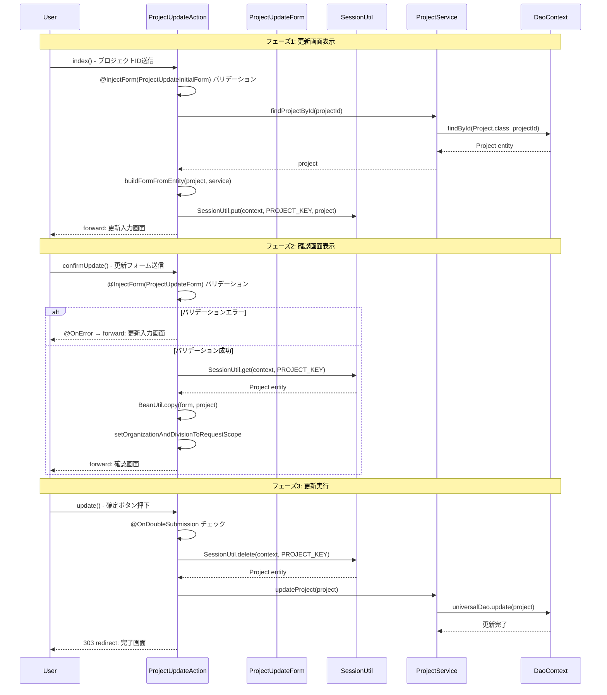

# Code Analysis: ProjectUpdateAction

**Generated**: 2026-03-12 19:00:30
**Target**: プロジェクト更新アクション
**Modules**: proman-web, proman-common
**Analysis Duration**: 約3分7秒

---

## Overview

`ProjectUpdateAction` はプロジェクト管理Webアプリケーションにおける更新機能のアクションクラスです。プロジェクト詳細画面からプロジェクト更新画面への遷移、入力内容の確認画面表示、データベース更新処理の3フェーズで構成されています。

Nablarchの `@InjectForm` によるBean Validationを使用して入力値を検証し、`SessionUtil` でセッションストアにエンティティを保持することで入力画面→確認画面→更新完了の画面遷移を管理します。更新実行では `@OnDoubleSubmission` による二重送信防止が実施されます。

---

## Architecture

### Dependency Graph

```mermaid
classDiagram
    class ProjectUpdateAction
    class ProjectUpdateForm {
        <<Form>>
    }
    class ProjectUpdateInitialForm {
        <<Form>>
    }
    class ProjectService
    class Project {
        <<Entity>>
    }
    class Organization {
        <<Entity>>
    }
    class DaoContext {
        <<Nablarch>>
    }
    class SessionUtil {
        <<Nablarch>>
    }
    class BeanUtil {
        <<Nablarch>>
    }
    class ExecutionContext {
        <<Nablarch>>
    }

    ProjectUpdateAction ..> ProjectUpdateInitialForm : validates
    ProjectUpdateAction ..> ProjectUpdateForm : validates
    ProjectUpdateAction ..> ProjectService : delegates to
    ProjectUpdateAction ..> SessionUtil : manages session
    ProjectUpdateAction ..> BeanUtil : copies beans
    ProjectUpdateAction ..> ExecutionContext : sets request scope
    ProjectService ..> DaoContext : queries/persists
    ProjectService ..> Project : manages
    ProjectService ..> Organization : queries
```



**Note**: This diagram uses Mermaid `classDiagram` syntax to show class names and their relationships. Use `--|>` for inheritance (extends/implements) and `..>` for dependencies (uses/creates).

### Component Summary

| Component | Role | Type | Dependencies |
|-----------|------|------|--------------|
| ProjectUpdateAction | プロジェクト更新フロー制御 | Action | ProjectUpdateForm, ProjectUpdateInitialForm, ProjectService, SessionUtil, BeanUtil |
| ProjectUpdateForm | 更新入力値の受け取り・バリデーション | Form | DateRelationUtil |
| ProjectUpdateInitialForm | 詳細→更新遷移時のプロジェクトID受け取り | Form | なし |
| ProjectService | プロジェクト/組織のDB操作 | Service | DaoContext |

---

## Flow

### Processing Flow

プロジェクト更新は以下の4フェーズで処理されます。

**フェーズ1: 更新画面初期表示 (`index`)**
詳細画面からプロジェクトIDを受け取り（`@InjectForm(ProjectUpdateInitialForm)`）、DBからプロジェクト情報を取得してセッションストアに保持。フォームに変換してリクエストスコープにセットし、更新入力画面へフォワードします。

**フェーズ2: 確認画面表示 (`confirmUpdate`)**
更新フォーム（`@InjectForm(ProjectUpdateForm, prefix="form")`）でバリデーション実行。エラー時は `@OnError` で更新入力画面へ戻ります。正常時はセッションのエンティティにフォームの値をコピーして確認画面へ。

**フェーズ3: 更新実行 (`update`)**
`@OnDoubleSubmission` で二重送信防止。セッションからプロジェクトエンティティを取得・削除し、`ProjectService.updateProject()` でDB更新。303リダイレクトで完了画面へ。

**フェーズ4: 完了・戻り処理**
`completeUpdate` で完了画面表示、`backToEnterUpdate` で確認画面からの戻り処理（セッションのエンティティから再度フォームを構築）。

### Sequence Diagram



---

## Components

### ProjectUpdateAction

**ファイル**: [ProjectUpdateAction.java](../../.lw/nab-official/v5/nablarch-system-development-guide/Sample_Project/Source_Code/proman-project/proman-web/src/main/java/com/nablarch/example/proman/web/project/ProjectUpdateAction.java)

**役割**: プロジェクト更新フローの全画面遷移と更新処理を制御するWebアクションクラス。

**主要メソッド**:
- `index` (L35-43): `@InjectForm(ProjectUpdateInitialForm)` によりプロジェクトIDを受け取り、DBから対象プロジェクトを取得してセッションに保持し更新画面を表示
- `confirmUpdate` (L54-62): `@InjectForm(ProjectUpdateForm, prefix="form")` と `@OnError` でバリデーション済みフォームからセッションのエンティティを更新し確認画面へ
- `update` (L72-77): `@OnDoubleSubmission` で二重送信防止。セッション削除後にDBへ更新を実施し303リダイレクト
- `backToEnterUpdate` (L97-102): 確認画面からの戻り処理。セッションのエンティティからフォームを再構築

**依存関係**: ProjectUpdateInitialForm, ProjectUpdateForm, ProjectService, SessionUtil, BeanUtil, DateUtil, ExecutionContext

### ProjectUpdateForm

**ファイル**: [ProjectUpdateForm.java](../../.lw/nab-official/v5/nablarch-system-development-guide/Sample_Project/Source_Code/proman-project/proman-web/src/main/java/com/nablarch/example/proman/web/project/ProjectUpdateForm.java)

**役割**: 更新入力画面のフォームクラス。入力値のバリデーションルールを定義。

**主要メソッド**:
- `isValidProjectPeriod` (L329-331): `@AssertTrue` による相関バリデーション。プロジェクト開始日 ≤ 終了日の整合性チェック

**バリデーション**: `@Required` + `@Domain` で全フィールドを検証。`projectName`, `projectType`, `projectClass`, `projectStartDate`, `projectEndDate`, `divisionId`, `organizationId`, `pmKanjiName`, `plKanjiName` は必須。

### ProjectUpdateInitialForm

**ファイル**: [ProjectUpdateInitialForm.java](../../.lw/nab-official/v5/nablarch-system-development-guide/Sample_Project/Source_Code/proman-project/proman-web/src/main/java/com/nablarch/example/proman/web/project/ProjectUpdateInitialForm.java)

**役割**: 詳細画面から更新画面への遷移時にプロジェクトIDを受け取るシンプルなフォーム。`@Required` + `@Domain("projectId")` による入力検証。

### ProjectService

**ファイル**: [ProjectService.java](../../.lw/nab-official/v5/nablarch-system-development-guide/Sample_Project/Source_Code/proman-project/proman-web/src/main/java/com/nablarch/example/proman/web/project/ProjectService.java)

**役割**: プロジェクトおよび組織のDB操作を担当するサービスクラス。`DaoContext`（UniversalDao）を通じてDB操作を実施。

**主要メソッド**:
- `findProjectById` (L124-126): プロジェクトIDで1件検索（`universalDao.findById`）
- `updateProject` (L89-91): プロジェクトエンティティをDB更新（`universalDao.update`）
- `findAllDivision` / `findAllDepartment` (L50-61): 事業部/部門の全件取得（SQLファイル指定）
- `findOrganizationById` (L70-73): 組織ID指定で1件取得

---

## Nablarch Framework Usage

### InjectForm

**クラス**: `nablarch.common.web.interceptor.InjectForm`

**説明**: アクションメソッドのインターセプターとしてリクエストパラメータをフォームにバインドし、Bean Validationを実行する

**使用方法**:
```java
@InjectForm(form = ProjectUpdateForm.class, prefix = "form")
@OnError(type = ApplicationException.class, path = "forward:///app/project/moveUpdate")
public HttpResponse confirmUpdate(HttpRequest request, ExecutionContext context) {
    ProjectUpdateForm form = context.getRequestScopedVar("form");
    // ...
}
```

**重要ポイント**:
- ✅ **`prefix`指定**: フォームのHTML `name` 属性が `form.xxx` 形式の場合は `prefix = "form"` を指定する
- ✅ **`@OnError`とセット**: バリデーションエラー時の遷移先を `@OnError` で指定する
- 💡 **バリデーション済みオブジェクト**: `context.getRequestScopedVar("form")` で取得できるオブジェクトはバリデーション済みであることが保証される

**このコードでの使い方**:
- `index()`: `@InjectForm(form = ProjectUpdateInitialForm.class)` でプロジェクトIDを受け取り（Line 34）
- `confirmUpdate()`: `@InjectForm(form = ProjectUpdateForm.class, prefix = "form")` で更新フォームを受け取り（Line 52）

**詳細**: [Libraries Bean_validation](../../.claude/skills/nabledge-6/docs/component/libraries/libraries-bean_validation.md)

---

### SessionUtil

**クラス**: `nablarch.common.web.session.SessionUtil`

**説明**: セッションストアへのオブジェクトの保存・取得・削除を行うユーティリティクラス

**使用方法**:
```java
// セッションに保存
SessionUtil.put(context, "project", project);

// セッションから取得
Project project = SessionUtil.get(context, "project");

// セッションから取得して削除
Project project = SessionUtil.delete(context, "project");
```

**重要ポイント**:
- ✅ **フォームをそのままセッションに入れない**: フォームは `BeanUtil` でエンティティに変換してからセッションに保存する
- ✅ **更新実行時は `delete`**: `update()` では `SessionUtil.delete()` を使用してセッションからエンティティを取得・削除する（Line 73）
- ⚠️ **`Serializable` 実装必須**: セッションに格納するオブジェクトは `Serializable` を実装する必要がある

**このコードでの使い方**:
- `index()`: `SessionUtil.put(context, PROJECT_KEY, project)` で更新対象エンティティを保持（Line 41）
- `confirmUpdate()`: `SessionUtil.get(context, PROJECT_KEY)` でエンティティを取得（Line 56）
- `update()`: `SessionUtil.delete(context, PROJECT_KEY)` でエンティティを取得・削除（Line 73）

**詳細**: [Web Application Getting Started Project Update](../../.claude/skills/nabledge-6/docs/processing-pattern/web-application/web-application-getting-started-project-update.md)

---

### OnDoubleSubmission

**クラス**: `nablarch.common.web.token.OnDoubleSubmission`

**説明**: トークンを使用した二重送信防止インターセプター。確認画面でトークンを発行し、更新実行時に検証する

**使用方法**:
```java
@OnDoubleSubmission
public HttpResponse update(HttpRequest request, ExecutionContext context) {
    // 更新処理
}
```

**重要ポイント**:
- ✅ **JSPで `useToken="true"` 必須**: 確認画面の `<n:form useToken="true">` でトークンを発行する
- ⚠️ **二重送信時のレスポンス**: デフォルトでは400エラーが返るため、必要に応じてエラーページの設定が必要
- 💡 **PRGパターンとの組み合わせ**: `update()` の戻り値を303リダイレクトにすることでブラウザ更新による再実行も防止（Line 76）

**このコードでの使い方**:
- `update()` に `@OnDoubleSubmission` を付与（Line 71）

**詳細**: [Web Application Getting Started Project Update](../../.claude/skills/nabledge-6/docs/processing-pattern/web-application/web-application-getting-started-project-update.md)

---

### BeanUtil

**クラス**: `nablarch.core.beans.BeanUtil`

**説明**: Java Beansクラス間のプロパティコピーやBean生成を行うユーティリティクラス

**使用方法**:
```java
// フォームからエンティティにコピー
BeanUtil.copy(form, project);

// エンティティからフォームを新規生成してコピー
ProjectUpdateForm form = BeanUtil.createAndCopy(ProjectUpdateForm.class, project);
```

**重要ポイント**:
- 💡 **同名プロパティの自動コピー**: 同じ名前のプロパティを自動的にコピーするため、フォーム→エンティティの変換が容易
- ⚠️ **型が異なるプロパティ**: フォームは全プロパティが `String` 型であるため、型変換が必要な場合は個別処理が必要

**このコードでの使い方**:
- `confirmUpdate()`: `BeanUtil.copy(form, project)` でフォームの値をセッションのエンティティへコピー（Line 57）
- `buildFormFromEntity()`: `BeanUtil.createAndCopy(ProjectUpdateForm.class, project)` でエンティティからフォームを生成（Line 112）

**詳細**: [Libraries Utility](../../.claude/skills/nabledge-6/docs/component/libraries/libraries-utility.md)

---

## References

### Source Files

- [ProjectUpdateAction.java (.lw/nab-official/v5/nablarch-system-development-guide/en/Sample_Project/Source_Code/proman-project/proman-web/src/main/java/com/nablarch/example/proman/web/project)](../../.lw/nab-official/v5/nablarch-system-development-guide/en/Sample_Project/Source_Code/proman-project/proman-web/src/main/java/com/nablarch/example/proman/web/project/ProjectUpdateAction.java) - ProjectUpdateAction
- [ProjectUpdateAction.java (.lw/nab-official/v5/nablarch-system-development-guide/Sample_Project/Source_Code/proman-project/proman-web/src/main/java/com/nablarch/example/proman/web/project)](../../.lw/nab-official/v5/nablarch-system-development-guide/Sample_Project/Source_Code/proman-project/proman-web/src/main/java/com/nablarch/example/proman/web/project/ProjectUpdateAction.java) - ProjectUpdateAction
- [ProjectUpdateForm.java (.lw/nab-official/v5/nablarch-system-development-guide/en/Sample_Project/Source_Code/proman-project/proman-web/src/main/java/com/nablarch/example/proman/web/project)](../../.lw/nab-official/v5/nablarch-system-development-guide/en/Sample_Project/Source_Code/proman-project/proman-web/src/main/java/com/nablarch/example/proman/web/project/ProjectUpdateForm.java) - ProjectUpdateForm
- [ProjectUpdateForm.java (.lw/nab-official/v5/nablarch-system-development-guide/Sample_Project/Source_Code/proman-project/proman-web/src/main/java/com/nablarch/example/proman/web/project)](../../.lw/nab-official/v5/nablarch-system-development-guide/Sample_Project/Source_Code/proman-project/proman-web/src/main/java/com/nablarch/example/proman/web/project/ProjectUpdateForm.java) - ProjectUpdateForm
- [ProjectUpdateInitialForm.java (.lw/nab-official/v5/nablarch-system-development-guide/en/Sample_Project/Source_Code/proman-project/proman-web/src/main/java/com/nablarch/example/proman/web/project)](../../.lw/nab-official/v5/nablarch-system-development-guide/en/Sample_Project/Source_Code/proman-project/proman-web/src/main/java/com/nablarch/example/proman/web/project/ProjectUpdateInitialForm.java) - ProjectUpdateInitialForm
- [ProjectUpdateInitialForm.java (.lw/nab-official/v5/nablarch-system-development-guide/Sample_Project/Source_Code/proman-project/proman-web/src/main/java/com/nablarch/example/proman/web/project)](../../.lw/nab-official/v5/nablarch-system-development-guide/Sample_Project/Source_Code/proman-project/proman-web/src/main/java/com/nablarch/example/proman/web/project/ProjectUpdateInitialForm.java) - ProjectUpdateInitialForm
- [ProjectService.java (.lw/nab-official/v5/nablarch-system-development-guide/en/Sample_Project/Source_Code/proman-project/proman-web/src/main/java/com/nablarch/example/proman/web/project)](../../.lw/nab-official/v5/nablarch-system-development-guide/en/Sample_Project/Source_Code/proman-project/proman-web/src/main/java/com/nablarch/example/proman/web/project/ProjectService.java) - ProjectService
- [ProjectService.java (.lw/nab-official/v5/nablarch-system-development-guide/Sample_Project/Source_Code/proman-project/proman-web/src/main/java/com/nablarch/example/proman/web/project)](../../.lw/nab-official/v5/nablarch-system-development-guide/Sample_Project/Source_Code/proman-project/proman-web/src/main/java/com/nablarch/example/proman/web/project/ProjectService.java) - ProjectService

### Knowledge Base (Nabledge-6)

- [Web Application Getting Started Project Update](../../.claude/skills/nabledge-6/docs/processing-pattern/web-application/web-application-getting-started-project-update.md)
- [Web Application Getting Started Project Bulk Update](../../.claude/skills/nabledge-6/docs/processing-pattern/web-application/web-application-getting-started-project-bulk-update.md)
- [Libraries Bean_validation](../../.claude/skills/nabledge-6/docs/component/libraries/libraries-bean_validation.md)
- [Libraries Utility](../../.claude/skills/nabledge-6/docs/component/libraries/libraries-utility.md)

### Official Documentation


- [ApplicationException](https://nablarch.github.io/docs/LATEST/javadoc/nablarch/core/message/ApplicationException.html)
- [AssertTrue](https://nablarch.github.io/docs/LATEST/javadoc/jakarta/validation/constraints/AssertTrue.html)
- [Base64Util](https://nablarch.github.io/docs/LATEST/javadoc/nablarch/core/util/Base64Util.html)
- [Bean Validation](https://nablarch.github.io/docs/LATEST/doc/application_framework/application_framework/libraries/validation/bean_validation.html)
- [BeanUtil](https://nablarch.github.io/docs/LATEST/javadoc/nablarch/core/beans/BeanUtil.html)
- [BeanValidationStrategy](https://nablarch.github.io/docs/LATEST/javadoc/nablarch/common/web/validator/BeanValidationStrategy.html)
- [BinaryUtil](https://nablarch.github.io/docs/LATEST/javadoc/nablarch/core/util/BinaryUtil.html)
- [CachingCharsetDef](https://nablarch.github.io/docs/LATEST/javadoc/nablarch/core/validation/validator/unicode/CachingCharsetDef.html)
- [CompositeCharsetDef](https://nablarch.github.io/docs/LATEST/javadoc/nablarch/core/validation/validator/unicode/CompositeCharsetDef.html)
- [DateUtil](https://nablarch.github.io/docs/LATEST/javadoc/nablarch/core/util/DateUtil.html)
- [DomainManager](https://nablarch.github.io/docs/LATEST/javadoc/nablarch/core/validation/ee/DomainManager.html)
- [Domain](https://nablarch.github.io/docs/LATEST/javadoc/nablarch/core/validation/ee/Domain.html)
- [FileUtil](https://nablarch.github.io/docs/LATEST/javadoc/nablarch/core/util/FileUtil.html)
- [HttpRequest](https://nablarch.github.io/docs/LATEST/javadoc/nablarch/fw/web/HttpRequest.html)
- [Index](https://nablarch.github.io/docs/LATEST/doc/application_framework/application_framework/web/getting_started/project_bulk_update/index.html)
- [Index](https://nablarch.github.io/docs/LATEST/doc/application_framework/application_framework/web/getting_started/project_update/index.html)
- [ItemNamedConstraintViolationConverterFactory](https://nablarch.github.io/docs/LATEST/javadoc/nablarch/core/validation/ee/ItemNamedConstraintViolationConverterFactory.html)
- [LiteralCharsetDef](https://nablarch.github.io/docs/LATEST/javadoc/nablarch/core/validation/validator/unicode/LiteralCharsetDef.html)
- [MessageInterpolator](https://nablarch.github.io/docs/LATEST/javadoc/jakarta/validation/MessageInterpolator.html)
- [NablarchMessageInterpolator](https://nablarch.github.io/docs/LATEST/javadoc/nablarch/core/validation/ee/NablarchMessageInterpolator.html)
- [NoDataException](https://nablarch.github.io/docs/LATEST/javadoc/nablarch/common/dao/NoDataException.html)
- [ObjectUtil](https://nablarch.github.io/docs/LATEST/javadoc/nablarch/core/util/ObjectUtil.html)
- [OnDoubleSubmission](https://nablarch.github.io/docs/LATEST/javadoc/nablarch/common/web/token/OnDoubleSubmission.html)
- [OptimisticLockException](https://nablarch.github.io/docs/LATEST/javadoc/jakarta/persistence/OptimisticLockException.html)
- [RangedCharsetDef](https://nablarch.github.io/docs/LATEST/javadoc/nablarch/core/validation/validator/unicode/RangedCharsetDef.html)
- [Required](https://nablarch.github.io/docs/LATEST/javadoc/nablarch/core/validation/ee/Required.html)
- [ResourceLocator](https://nablarch.github.io/docs/LATEST/javadoc/nablarch/fw/web/ResourceLocator.html)
- [Size](https://nablarch.github.io/docs/LATEST/javadoc/nablarch/core/validation/ee/Size.html)
- [StringUtil](https://nablarch.github.io/docs/LATEST/javadoc/nablarch/core/util/StringUtil.html)
- [SystemCharConfig](https://nablarch.github.io/docs/LATEST/javadoc/nablarch/core/validation/ee/SystemCharConfig.html)
- [SystemChar](https://nablarch.github.io/docs/LATEST/javadoc/nablarch/core/validation/ee/SystemChar.html)
- [UniversalDao](https://nablarch.github.io/docs/LATEST/javadoc/nablarch/common/dao/UniversalDao.html)
- [Utility](https://nablarch.github.io/docs/LATEST/doc/application_framework/application_framework/libraries/utility.html)
- [Valid](https://nablarch.github.io/docs/LATEST/javadoc/jakarta/validation/Valid.html)
- [ValidationUtil](https://nablarch.github.io/docs/LATEST/javadoc/nablarch/core/validation/ValidationUtil.html)
- [ValidatorUtil](https://nablarch.github.io/docs/LATEST/javadoc/nablarch/core/validation/ee/ValidatorUtil.html)

---

**Note**: This documentation was generated by the code-analysis workflow of the nabledge-6 skill.
