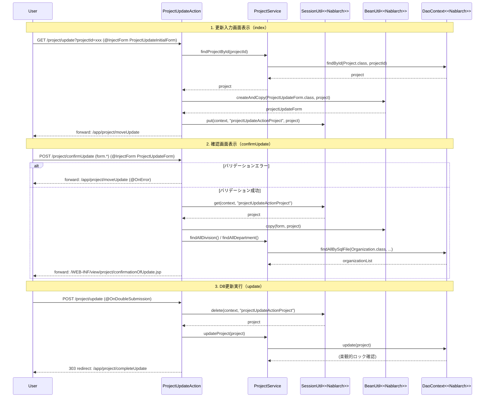

# Code Analysis: ProjectUpdateAction

**Generated**: 2026-03-12 18:02:37
**Target**: プロジェクト更新処理（入力→確認→更新）
**Modules**: proman-web
**Analysis Duration**: 約3分32秒

---

## Overview

`ProjectUpdateAction` は、プロジェクト情報の更新機能を担うWebアクションクラスです。「更新入力画面表示 → 確認画面表示 → DB更新実行 → 完了画面表示」という4ステップの画面遷移フローを実装しています。

Nablarchの `@InjectForm` によるバリデーション、`SessionUtil` によるセッションストアへのエンティティ保持、`@OnDoubleSubmission` による二重送信防止、`BeanUtil` によるBean間コピーを組み合わせた典型的なNablarch Webアプリケーションの更新パターンです。

関連クラスとして、入力値検証用の `ProjectUpdateForm` / `ProjectUpdateInitialForm`、DBアクセスを担う `ProjectService`（内部で `DaoContext` / UniversalDAO を使用）、およびエンティティ `Project` / `Organization` があります。

---

## Architecture

### Dependency Graph

```mermaid
classDiagram
    class ProjectUpdateAction
    class ProjectUpdateForm {
        <<Form>>
    }
    class ProjectUpdateInitialForm {
        <<Form>>
    }
    class ProjectService
    class DaoContext {
        <<Nablarch>>
    }
    class SessionUtil {
        <<Nablarch>>
    }
    class BeanUtil {
        <<Nablarch>>
    }
    class ExecutionContext {
        <<Nablarch>>
    }
    class HttpRequest {
        <<Nablarch>>
    }
    class HttpResponse {
        <<Nablarch>>
    }
    class Project {
        <<Entity>>
    }
    class Organization {
        <<Entity>>
    }

    ProjectUpdateInitialForm ..|> Serializable : implements
    ProjectUpdateForm ..|> Serializable : implements

    ProjectUpdateAction ..> ProjectUpdateInitialForm : validates
    ProjectUpdateAction ..> ProjectUpdateForm : validates
    ProjectUpdateAction ..> ProjectService : delegates to
    ProjectUpdateAction ..> SessionUtil : stores/retrieves entity
    ProjectUpdateAction ..> BeanUtil : copies bean
    ProjectUpdateAction ..> ExecutionContext : sets request scope
    ProjectService ..> DaoContext : queries/updates
    ProjectService ..> Project : persists
    ProjectService ..> Organization : queries
```



**Note**: This diagram uses Mermaid `classDiagram` syntax to show class names and their relationships. Use `--|>` for inheritance (extends/implements) and `..>` for dependencies (uses/creates).

### Component Summary

| Component | Role | Type | Dependencies |
|-----------|------|------|--------------|
| ProjectUpdateAction | プロジェクト更新Webアクション（入力〜完了の4メソッド） | Action | ProjectUpdateInitialForm, ProjectUpdateForm, ProjectService, SessionUtil, BeanUtil, ExecutionContext |
| ProjectUpdateInitialForm | 詳細画面→更新画面遷移時のプロジェクトID受取フォーム | Form | なし |
| ProjectUpdateForm | 更新画面入力値受取フォーム（バリデーション定義含む） | Form | DateRelationUtil |
| ProjectService | DBアクセスをカプセル化するサービス層 | Service | DaoContext（UniversalDAO） |

---

## Flow

### Processing Flow

更新処理は以下の5段階で進行します。

1. **index（更新入力画面表示）**: 詳細画面からプロジェクトIDを受け取り（`ProjectUpdateInitialForm`）、DBからプロジェクト情報を取得して更新フォームに詰め替える。取得したエンティティをセッションストアに保存し、組織プルダウン情報もセットして更新入力画面へフォワード。

2. **indexSetPullDown（プルダウン付き更新画面表示）**: 確認画面や詳細画面から更新入力画面に戻る際に使用。セッションから取得したプロジェクトIDをリクエストスコープにセットし、組織プルダウンとともに更新画面JSPへフォワード。

3. **confirmUpdate（確認画面表示）**: 入力値を `ProjectUpdateForm` でバリデーション後、セッションのエンティティに `BeanUtil.copy()` で入力値を反映し確認画面へフォワード。バリデーションエラー時は `@OnError` で入力画面に戻る。

4. **update（DB更新実行）**: `@OnDoubleSubmission` で二重送信を防止。セッションからエンティティを削除しつつ取得し、`ProjectService.updateProject()` でDB更新。完了画面へ303リダイレクト。

5. **completeUpdate（完了画面表示）** / **backToEnterUpdate（入力画面へ戻る）**: それぞれ完了JSPへのフォワード、およびセッションのエンティティからフォームを再構築して入力画面へ戻る処理。

### Sequence Diagram



---

## Components

### ProjectUpdateAction

**ファイル**: [`ProjectUpdateAction.java`](../../.lw/nab-official/v6/nablarch-system-development-guide/en/Sample_Project/Source_Code/proman-project/proman-web/src/main/java/com/nablarch/example/proman/web/project/ProjectUpdateAction.java)

**役割**: プロジェクト更新の全画面遷移を制御するWebアクション。入力→確認→更新→完了の4ステップを担う。

**キーメソッド**:

- `index(HttpRequest, ExecutionContext)` [L35-43]: 詳細画面からの初期表示。`@InjectForm(ProjectUpdateInitialForm)` でプロジェクトIDを受け取り、DBからプロジェクト取得後セッションに保存。
- `confirmUpdate(HttpRequest, ExecutionContext)` [L54-62]: 確認画面表示。`@InjectForm(ProjectUpdateForm, prefix="form")` `@OnError` でバリデーションエラー時は入力画面へ。
- `update(HttpRequest, ExecutionContext)` [L72-77]: `@OnDoubleSubmission` で二重送信防止。セッションからエンティティ削除取得→DB更新→303リダイレクト。
- `backToEnterUpdate(HttpRequest, ExecutionContext)` [L97-102]: 確認画面から入力画面へ戻る。セッションのエンティティから更新フォームを再構築。
- `buildFormFromEntity(Project, ProjectService)` [L111-125]: エンティティ→更新フォーム変換。`BeanUtil.createAndCopy()`、日付フォーマット変換、組織ID→所属部署IDのリレーション解決を行う。

**依存関係**: ProjectUpdateInitialForm, ProjectUpdateForm, ProjectService, SessionUtil, BeanUtil, DateUtil, ExecutionContext

---

### ProjectUpdateInitialForm

**ファイル**: [`ProjectUpdateInitialForm.java`](../../.lw/nab-official/v6/nablarch-system-development-guide/en/Sample_Project/Source_Code/proman-project/proman-web/src/main/java/com/nablarch/example/proman/web/project/ProjectUpdateInitialForm.java)

**役割**: 詳細画面→更新画面遷移時にプロジェクトIDのみを受け取る軽量フォーム。`@Required` `@Domain("projectId")` によるバリデーション。

**依存関係**: なし（Serializable実装）

---

### ProjectUpdateForm

**ファイル**: [`ProjectUpdateForm.java`](../../.lw/nab-official/v6/nablarch-system-development-guide/en/Sample_Project/Source_Code/proman-project/proman-web/src/main/java/com/nablarch/example/proman/web/project/ProjectUpdateForm.java)

**役割**: 更新入力値（projectName, projectType, projectClass, 期間, 組織ID, PM/PL名, 備考, 売上）を受け取る。`@Required` `@Domain` によるBean Validationアノテーション付き。

**キーメソッド**:
- `isValidProjectPeriod()` [L329-331]: `@AssertTrue` アノテーション付きメソッド。`DateRelationUtil.isValid()` で開始日≦終了日の相関バリデーションを実施。

**依存関係**: DateRelationUtil（proman-common）

---

### ProjectService

**ファイル**: [`ProjectService.java`](../../.lw/nab-official/v6/nablarch-system-development-guide/en/Sample_Project/Source_Code/proman-project/proman-web/src/main/java/com/nablarch/example/proman/web/project/ProjectService.java)

**役割**: プロジェクト・組織関連のDBアクセスをカプセル化するサービス層。`DaoContext`（UniversalDAO）を内部で保持。

**キーメソッド**:
- `findProjectById(Integer)` [L124-126]: プロジェクトIDで1件取得。`universalDao.findById(Project.class, projectId)`。
- `updateProject(Project)` [L89-91]: エンティティ更新。`universalDao.update(project)` により楽観的ロックも実行。
- `findOrganizationById(Integer)` [L70-73]: 組織IDで組織1件取得。
- `findAllDivision()` / `findAllDepartment()` [L50-61]: 全事業部/全部署リストをSQLファイル指定で取得。

**依存関係**: DaoContext（UniversalDAO）, Project（Entity）, Organization（Entity）

---

## Nablarch Framework Usage

### @InjectForm / @OnError

**クラス**: `nablarch.common.web.interceptor.InjectForm` / `nablarch.fw.web.interceptor.OnError`

**説明**: アクションメソッドに付与するインターセプタ。リクエストパラメータを指定したフォームクラスにバインドし、Bean Validationを実行する。バリデーション成功時にリクエストスコープに格納。

**使用方法**:
```java
@InjectForm(form = ProjectUpdateForm.class, prefix = "form")
@OnError(type = ApplicationException.class, path = "forward:///app/project/moveUpdate")
public HttpResponse confirmUpdate(HttpRequest request, ExecutionContext context) {
    ProjectUpdateForm form = context.getRequestScopedVar("form");
    // ...
}
```

**重要ポイント**:
- ✅ **`prefix` の指定**: `prefix = "form"` を指定するとHTMLの `form.xxx` パラメータがバリデーション対象になる。未指定時はプレフィックスなし。
- ⚠️ **`@OnError` はセットで使う**: `@InjectForm` 単独ではバリデーションエラー時に例外がそのまま伝播する。必ず `@OnError` で遷移先を指定する。
- 💡 **リクエストスコープへの格納**: バリデーション成功時、`context.getRequestScopedVar("form")` でフォームオブジェクトを取得可能。

**このコードでの使い方**:
- `index()` (L34): `@InjectForm(form = ProjectUpdateInitialForm.class)` — プロジェクトIDのみバリデーション
- `confirmUpdate()` (L52-53): `@InjectForm(form = ProjectUpdateForm.class, prefix = "form")` + `@OnError` — 更新入力値のバリデーション、エラー時は入力画面へ

**詳細**: [Handlers InjectForm](../../.claude/skills/nabledge-6/docs/component/handlers/handlers-InjectForm.md)

---

### SessionUtil

**クラス**: `nablarch.common.web.session.SessionUtil`

**説明**: セッションストアへのエンティティ保存・取得・削除を行うユーティリティ。確認画面パターンで「入力画面で受け取ったエンティティを確認→更新画面まで持ち越す」際に使用する。

**使用方法**:
```java
// 保存
SessionUtil.put(context, "projectUpdateActionProject", project);

// 取得
Project project = SessionUtil.get(context, "projectUpdateActionProject");

// 削除しながら取得（update処理で使用）
Project project = SessionUtil.delete(context, "projectUpdateActionProject");
```

**重要ポイント**:
- ✅ **更新時は `delete()` で取得**: `update()` メソッドでは `SessionUtil.delete()` を使ってセッションからエンティティを削除しながら取得する。更新後のセッション残留を防ぐ。
- ⚠️ **フォームをセッションに格納しない**: `ProjectUpdateForm` ではなく `Project` エンティティをセッションに格納している。フォームを直接格納するとシリアライズ問題が起きやすい。
- ⚠️ **不正な画面遷移**: ブラウザの戻るボタン等でセッションキーが存在しない場合、`SessionKeyNotFoundException` が発生する。ハンドラまたは `@OnError` で捕捉して適切なエラー画面へ遷移させること。
- 💡 **楽観的ロックの基準値保持**: 更新開始時点のエンティティをセッションに保存することで、確認画面表示後に別ユーザが更新しても `updateProject()` 実行時にバージョン不一致で例外が発生する。

**このコードでの使い方**:
- `index()` (L41): エンティティをセッションに保存（キー: `"projectUpdateActionProject"`）
- `confirmUpdate()` (L56): セッションからエンティティを取得して入力値をコピー
- `update()` (L73): `SessionUtil.delete()` でセッションから削除しつつ取得→DB更新

**詳細**: [Libraries Session Store](../../.claude/skills/nabledge-6/docs/component/libraries/libraries-session_store.md)

---

### @OnDoubleSubmission

**クラス**: `nablarch.common.web.token.OnDoubleSubmission`

**説明**: アクションメソッドへの二重送信（ブラウザの戻るボタン + 再送信、二重クリック等）を防ぐインターセプタ。JSP側の `useToken="true"` と連携してトークンベースで制御する。

**使用方法**:
```java
@OnDoubleSubmission
public HttpResponse update(HttpRequest request, ExecutionContext context) {
    final Project project = SessionUtil.delete(context, PROJECT_KEY);
    ProjectService service = new ProjectService();
    service.updateProject(project);
    return new HttpResponse(303, "redirect:///app/project/completeUpdate");
}
```

**重要ポイント**:
- ✅ **DB更新メソッドに必ず付与**: 二重送信によるデータの二重更新を防ぐため、`update()` など実際にDB変更を行うメソッドに付与する。
- ⚠️ **JSP側の設定も必要**: JSPの `<n:form useToken="true">` と `<n:submit allowDoubleSubmission="false">` のセット設定が必要。サーバサイドのみでは不十分。
- 💡 **JavaScriptが無効でも機能**: JavaScript無効環境でも、サーバサイドのトークンチェックが機能する。

**このコードでの使い方**:
- `update()` (L71): `@OnDoubleSubmission` — プロジェクト更新処理の二重実行を防止

**詳細**: [Web Application Getting Started Project Update](../../.claude/skills/nabledge-6/docs/processing-pattern/web-application/web-application-getting-started-project-update.md)

---

### BeanUtil

**クラス**: `nablarch.core.beans.BeanUtil`

**説明**: Javaオブジェクト間のプロパティコピーを行うユーティリティ。フォーム→エンティティ、エンティティ→フォームの変換に多用される。

**使用方法**:
```java
// フォーム→エンティティへのコピー（上書き）
BeanUtil.copy(form, project);

// エンティティ→フォームへの変換（新規インスタンス生成）
ProjectUpdateForm form = BeanUtil.createAndCopy(ProjectUpdateForm.class, project);
```

**重要ポイント**:
- ✅ **`copy()` vs `createAndCopy()`**: `copy()` は既存インスタンスへの上書き、`createAndCopy()` は新規インスタンス生成+コピー。用途に応じて使い分ける。
- ⚠️ **型変換**: 同名プロパティのみコピーされる。型が異なる場合（String←→Integer等）は自動変換されるが、変換できない場合は例外が発生する。
- 💡 **シンプルな実装**: フォームとエンティティの間で同名プロパティが多い場合、手動setter呼び出しより大幅にコードを削減できる。

**このコードでの使い方**:
- `confirmUpdate()` (L57): `BeanUtil.copy(form, project)` — フォーム入力値をセッションのエンティティへ反映
- `buildFormFromEntity()` (L112): `BeanUtil.createAndCopy(ProjectUpdateForm.class, project)` — エンティティから更新フォームを生成

---

## References

### Source Files

- [ProjectUpdateAction.java (.lw/nab-official/v5/nablarch-system-development-guide/en/Sample_Project/Source_Code/proman-project/proman-web/src/main/java/com/nablarch/example/proman/web/project)](../../.lw/nab-official/v5/nablarch-system-development-guide/en/Sample_Project/Source_Code/proman-project/proman-web/src/main/java/com/nablarch/example/proman/web/project/ProjectUpdateAction.java) - ProjectUpdateAction
- [ProjectUpdateAction.java (.lw/nab-official/v5/nablarch-system-development-guide/Sample_Project/Source_Code/proman-project/proman-web/src/main/java/com/nablarch/example/proman/web/project)](../../.lw/nab-official/v5/nablarch-system-development-guide/Sample_Project/Source_Code/proman-project/proman-web/src/main/java/com/nablarch/example/proman/web/project/ProjectUpdateAction.java) - ProjectUpdateAction
- [ProjectUpdateForm.java (.lw/nab-official/v5/nablarch-system-development-guide/en/Sample_Project/Source_Code/proman-project/proman-web/src/main/java/com/nablarch/example/proman/web/project)](../../.lw/nab-official/v5/nablarch-system-development-guide/en/Sample_Project/Source_Code/proman-project/proman-web/src/main/java/com/nablarch/example/proman/web/project/ProjectUpdateForm.java) - ProjectUpdateForm
- [ProjectUpdateForm.java (.lw/nab-official/v5/nablarch-system-development-guide/Sample_Project/Source_Code/proman-project/proman-web/src/main/java/com/nablarch/example/proman/web/project)](../../.lw/nab-official/v5/nablarch-system-development-guide/Sample_Project/Source_Code/proman-project/proman-web/src/main/java/com/nablarch/example/proman/web/project/ProjectUpdateForm.java) - ProjectUpdateForm
- [ProjectUpdateInitialForm.java (.lw/nab-official/v5/nablarch-system-development-guide/en/Sample_Project/Source_Code/proman-project/proman-web/src/main/java/com/nablarch/example/proman/web/project)](../../.lw/nab-official/v5/nablarch-system-development-guide/en/Sample_Project/Source_Code/proman-project/proman-web/src/main/java/com/nablarch/example/proman/web/project/ProjectUpdateInitialForm.java) - ProjectUpdateInitialForm
- [ProjectUpdateInitialForm.java (.lw/nab-official/v5/nablarch-system-development-guide/Sample_Project/Source_Code/proman-project/proman-web/src/main/java/com/nablarch/example/proman/web/project)](../../.lw/nab-official/v5/nablarch-system-development-guide/Sample_Project/Source_Code/proman-project/proman-web/src/main/java/com/nablarch/example/proman/web/project/ProjectUpdateInitialForm.java) - ProjectUpdateInitialForm
- [ProjectService.java (.lw/nab-official/v5/nablarch-system-development-guide/en/Sample_Project/Source_Code/proman-project/proman-web/src/main/java/com/nablarch/example/proman/web/project)](../../.lw/nab-official/v5/nablarch-system-development-guide/en/Sample_Project/Source_Code/proman-project/proman-web/src/main/java/com/nablarch/example/proman/web/project/ProjectService.java) - ProjectService
- [ProjectService.java (.lw/nab-official/v5/nablarch-system-development-guide/Sample_Project/Source_Code/proman-project/proman-web/src/main/java/com/nablarch/example/proman/web/project)](../../.lw/nab-official/v5/nablarch-system-development-guide/Sample_Project/Source_Code/proman-project/proman-web/src/main/java/com/nablarch/example/proman/web/project/ProjectService.java) - ProjectService

### Knowledge Base (Nabledge-6)

- [Web Application Getting Started Project Update](../../.claude/skills/nabledge-6/docs/processing-pattern/web-application/web-application-getting-started-project-update.md)
- [Handlers InjectForm](../../.claude/skills/nabledge-6/docs/component/handlers/handlers-InjectForm.md)
- [Libraries Session_store](../../.claude/skills/nabledge-6/docs/component/libraries/libraries-session_store.md)
- [Web Application Client_create4](../../.claude/skills/nabledge-6/docs/processing-pattern/web-application/web-application-client_create4.md)

### Official Documentation


- [Base64.Encoder](https://nablarch.github.io/docs/LATEST/javadoc/java/util/Base64.Encoder.html)
- [Base64](https://nablarch.github.io/docs/LATEST/javadoc/java/util/Base64.html)
- [Client Create4](https://nablarch.github.io/docs/LATEST/doc/application_framework/application_framework/web/getting_started/client_create/client_create4.html)
- [DbStore](https://nablarch.github.io/docs/LATEST/javadoc/nablarch/common/web/session/store/DbStore.html)
- [ExecutionContext](https://nablarch.github.io/docs/LATEST/javadoc/nablarch/fw/ExecutionContext.html)
- [HiddenStore](https://nablarch.github.io/docs/LATEST/javadoc/nablarch/common/web/session/store/HiddenStore.html)
- [HttpSessionStore](https://nablarch.github.io/docs/LATEST/javadoc/nablarch/common/web/session/store/HttpSessionStore.html)
- [Index](https://nablarch.github.io/docs/LATEST/doc/application_framework/application_framework/web/getting_started/project_update/index.html)
- [InjectForm](https://nablarch.github.io/docs/LATEST/doc/application_framework/application_framework/handlers/web_interceptor/InjectForm.html)
- [InjectForm](https://nablarch.github.io/docs/LATEST/javadoc/nablarch/common/web/interceptor/InjectForm.html)
- [JavaSerializeEncryptStateEncoder](https://nablarch.github.io/docs/LATEST/javadoc/nablarch/common/web/session/encoder/JavaSerializeEncryptStateEncoder.html)
- [JavaSerializeStateEncoder](https://nablarch.github.io/docs/LATEST/javadoc/nablarch/common/web/session/encoder/JavaSerializeStateEncoder.html)
- [JaxbStateEncoder](https://nablarch.github.io/docs/LATEST/javadoc/nablarch/common/web/session/encoder/JaxbStateEncoder.html)
- [KeyGenerator](https://nablarch.github.io/docs/LATEST/javadoc/javax/crypto/KeyGenerator.html)
- [NoDataException](https://nablarch.github.io/docs/LATEST/javadoc/nablarch/common/dao/NoDataException.html)
- [OnDoubleSubmission](https://nablarch.github.io/docs/LATEST/javadoc/nablarch/common/web/token/OnDoubleSubmission.html)
- [OnError](https://nablarch.github.io/docs/LATEST/javadoc/nablarch/fw/web/interceptor/OnError.html)
- [ResourceLocator](https://nablarch.github.io/docs/LATEST/javadoc/nablarch/fw/web/ResourceLocator.html)
- [SecureRandom](https://nablarch.github.io/docs/LATEST/javadoc/java/security/SecureRandom.html)
- [Session Store](https://nablarch.github.io/docs/LATEST/doc/application_framework/application_framework/libraries/session_store.html)
- [SessionKeyNotFoundException](https://nablarch.github.io/docs/LATEST/javadoc/nablarch/common/web/session/SessionKeyNotFoundException.html)
- [SessionManager](https://nablarch.github.io/docs/LATEST/javadoc/nablarch/common/web/session/SessionManager.html)
- [SessionStore](https://nablarch.github.io/docs/LATEST/javadoc/nablarch/common/web/session/SessionStore.html)
- [SessionUtil](https://nablarch.github.io/docs/LATEST/javadoc/nablarch/common/web/session/SessionUtil.html)
- [UUID](https://nablarch.github.io/docs/LATEST/javadoc/java/util/UUID.html)
- [UniversalDao](https://nablarch.github.io/docs/LATEST/javadoc/nablarch/common/dao/UniversalDao.html)
- [UserSessionSchema](https://nablarch.github.io/docs/LATEST/javadoc/nablarch/common/web/session/store/UserSessionSchema.html)

---

**Note**: This documentation was generated by the code-analysis workflow of the nabledge-6 skill.
