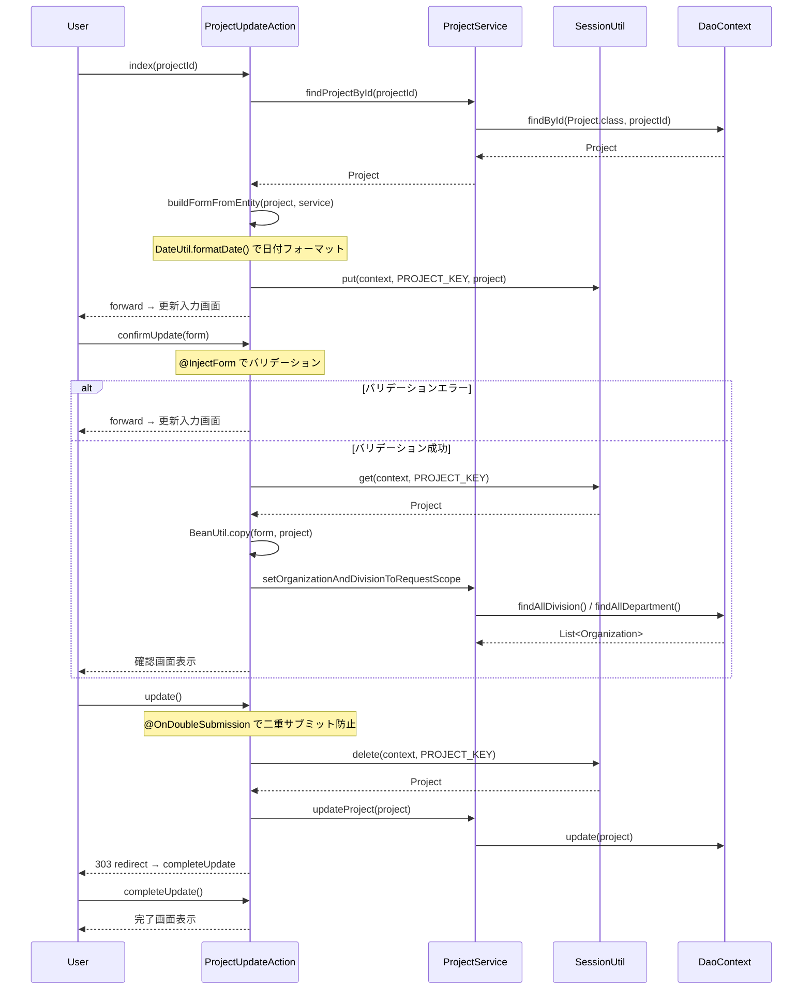

# Code Analysis: ProjectUpdateAction

**Generated**: 2026-03-12 18:07:09
**Target**: プロジェクト更新処理アクション
**Modules**: proman-web
**Analysis Duration**: 約3分14秒

---

## Overview

`ProjectUpdateAction` は Nablarch ウェブアプリケーションにおけるプロジェクト更新機能のアクションクラスである。プロジェクト詳細画面からの遷移を受け取り、入力画面表示・確認画面表示・更新実行・完了画面表示・入力へ戻るの5つのアクションメソッドを提供する。

Nablarch の `@InjectForm` によるバリデーション、`SessionUtil` によるセッションストア管理、`BeanUtil` によるフォーム/エンティティ変換、`@OnDoubleSubmission` による二重サブミット防止を組み合わせた典型的な更新処理フローを実装している。

コンポーネント構成：
- **ProjectUpdateAction**: メインのアクションクラス（5メソッド）
- **ProjectUpdateInitialForm**: 詳細画面からの初期遷移フォーム（projectId のみ）
- **ProjectUpdateForm**: 更新入力値を保持するフォーム（バリデーション付き）
- **ProjectService**: DB アクセスを担当するサービスクラス（DaoContext ラッパー）

---

## Architecture

### Dependency Graph

```mermaid
classDiagram
    class ProjectUpdateAction
    class ProjectUpdateInitialForm {
        <<Form>>
    }
    class ProjectUpdateForm {
        <<Form>>
    }
    class ProjectService
    class Project {
        <<Entity>>
    }
    class Organization {
        <<Entity>>
    }
    class SessionUtil {
        <<Nablarch>>
    }
    class BeanUtil {
        <<Nablarch>>
    }
    class DateUtil {
        <<Nablarch>>
    }
    class ExecutionContext {
        <<Nablarch>>
    }
    class DaoContext {
        <<Nablarch>>
    }

    ProjectUpdateAction ..> ProjectUpdateInitialForm : validates
    ProjectUpdateAction ..> ProjectUpdateForm : validates
    ProjectUpdateAction ..> ProjectService : delegates to
    ProjectUpdateAction ..> SessionUtil : stores/retrieves
    ProjectUpdateAction ..> BeanUtil : converts
    ProjectUpdateAction ..> DateUtil : formats
    ProjectUpdateAction ..> ExecutionContext : invokes
    ProjectUpdateForm ..|> Serializable : implements
    ProjectUpdateInitialForm ..|> Serializable : implements
    ProjectService ..> DaoContext : queries
    ProjectService ..> Project : persists
    ProjectService ..> Organization : queries
```



**Note**: This diagram uses Mermaid `classDiagram` syntax to show class names and their relationships. Use `--|>` for inheritance (extends/implements) and `..>` for dependencies (uses/creates).

### Component Summary

| Component | Role | Type | Dependencies |
|-----------|------|------|--------------|
| ProjectUpdateAction | プロジェクト更新アクション（5メソッド） | Action | ProjectUpdateInitialForm, ProjectUpdateForm, ProjectService, SessionUtil, BeanUtil, DateUtil |
| ProjectUpdateInitialForm | 詳細→更新画面遷移用フォーム | Form | なし |
| ProjectUpdateForm | 更新入力値バリデーションフォーム | Form | DateRelationUtil |
| ProjectService | DB アクセスサービス | Service | DaoContext, Project, Organization |
| Project | プロジェクトエンティティ | Entity | なし |
| Organization | 組織エンティティ | Entity | なし |

---

## Flow

### Processing Flow

プロジェクト更新処理は以下の5ステップで構成される。

1. **初期表示（index）**: プロジェクト詳細画面からプロジェクトIDを受け取り、DB からプロジェクトを取得して更新フォームを生成。エンティティをセッションストアに保存し、更新入力画面へフォワード。

2. **確認画面表示（confirmUpdate）**: 入力フォームをバリデーションし、フォーム値をセッション中のエンティティにコピー。事業部/部門プルダウンを DB から取得してリクエストスコープに設定し、確認画面を表示。バリデーションエラー時は入力画面へフォワード。

3. **更新実行（update）**: `@OnDoubleSubmission` で二重サブミットを防止。セッションからエンティティを取得（削除）し、`ProjectService.updateProject()` で DB 更新。303 リダイレクトで完了画面へ遷移。

4. **完了画面表示（completeUpdate）**: 完了 JSP をフォワードして表示するのみ。

5. **入力へ戻る（backToEnterUpdate）**: セッションからエンティティを取得し、フォームに変換してリクエストスコープに設定。更新入力画面へフォワード。

### Sequence Diagram



---

## Components

### ProjectUpdateAction

**ファイル**: [ProjectUpdateAction.java](../../.lw/nab-official/v5/nablarch-system-development-guide/Sample_Project/Source_Code/proman-project/proman-web/src/main/java/com/nablarch/example/proman/web/project/ProjectUpdateAction.java)

**役割**: プロジェクト更新機能のアクションクラス。更新フローの全ステップを管理する。

**キーメソッド**:

- `index(request, context)` [L35-43]: `@InjectForm(form = ProjectUpdateInitialForm.class)` でプロジェクトIDをバリデーション。DB からプロジェクトを取得し、セッションに保存。`buildFormFromEntity()` でフォームを生成してリクエストスコープに設定。
- `confirmUpdate(request, context)` [L54-62]: `@InjectForm(form = ProjectUpdateForm.class, prefix = "form")` と `@OnError` でバリデーション。フォーム値をセッション中エンティティにコピー。事業部/部門リストをリクエストスコープに設定。
- `update(request, context)` [L72-77]: `@OnDoubleSubmission` で二重サブミット防止。セッションからエンティティを削除して取得し、DB 更新。303 リダイレクトで完了画面へ。
- `buildFormFromEntity(project, service)` [L111-125]: エンティティからフォームを生成するプライベートメソッド。`BeanUtil.createAndCopy()` でコピーし、`DateUtil.formatDate()` で日付を `yyyy/MM/dd` 形式にフォーマット。組織情報を取得して divisionId を設定。
- `backToEnterUpdate(request, context)` [L97-102]: セッションからエンティティを取得し、フォームに変換。更新入力画面へフォワード。

**依存コンポーネント**: ProjectUpdateInitialForm, ProjectUpdateForm, ProjectService, SessionUtil, BeanUtil, DateUtil, ExecutionContext

---

### ProjectUpdateInitialForm

**ファイル**: [ProjectUpdateInitialForm.java](../../.lw/nab-official/v5/nablarch-system-development-guide/Sample_Project/Source_Code/proman-project/proman-web/src/main/java/com/nablarch/example/proman/web/project/ProjectUpdateInitialForm.java)

**役割**: プロジェクト詳細画面から更新画面への遷移時にプロジェクト ID を受け取るフォーム。

**キーフィールド**:
- `projectId` [L14-15]: `@Required` + `@Domain("projectId")` でバリデーション

**依存コンポーネント**: なし

---

### ProjectUpdateForm

**ファイル**: [ProjectUpdateForm.java](../../.lw/nab-official/v5/nablarch-system-development-guide/Sample_Project/Source_Code/proman-project/proman-web/src/main/java/com/nablarch/example/proman/web/project/ProjectUpdateForm.java)

**役割**: 更新入力値を保持するフォーム。Nablarch Bean Validation アノテーションでバリデーションルールを定義。

**キーフィールド・メソッド**:
- 各入力項目（projectName, projectType, projectClass, projectStartDate, projectEndDate, divisionId, organizationId 等）に `@Required` + `@Domain` アノテーション [L25-103]
- `isValidProjectPeriod()` [L329-331]: `@AssertTrue` で開始日と終了日の前後関係をバリデーション。`DateRelationUtil.isValid()` を使用。

**依存コンポーネント**: DateRelationUtil

---

### ProjectService

**ファイル**: [ProjectService.java](../../.lw/nab-official/v5/nablarch-system-development-guide/Sample_Project/Source_Code/proman-project/proman-web/src/main/java/com/nablarch/example/proman/web/project/ProjectService.java)

**役割**: プロジェクト・組織のDB アクセスを担当するサービスクラス。`DaoContext`（UniversalDao）をラップして使用。

**キーメソッド**:
- `findProjectById(projectId)` [L124-126]: `universalDao.findById(Project.class, projectId)` でプロジェクトを1件取得
- `updateProject(project)` [L89-91]: `universalDao.update(project)` でプロジェクトを更新
- `findOrganizationById(organizationId)` [L70-73]: `universalDao.findById(Organization.class, param)` で組織を1件取得
- `findAllDivision()` / `findAllDepartment()` [L50-61]: SQL ファイルで事業部/部門リストを全件取得

**依存コンポーネント**: DaoContext（UniversalDao）, Project, Organization

---

## Nablarch Framework Usage

### SessionUtil

**クラス**: `nablarch.common.web.session.SessionUtil`

**説明**: セッションストアへの読み書きを行うユーティリティクラス。セッションの保存・取得・削除を統一的に操作できる。

**使用方法**:
```java
// 保存
SessionUtil.put(context, "project", project);

// 取得
Project project = SessionUtil.get(context, PROJECT_KEY);

// 取得して削除
Project project = SessionUtil.delete(context, PROJECT_KEY);
```

**重要ポイント**:
- ✅ **更新実行時は `delete()` を使う**: `update()` メソッドでは `SessionUtil.delete()` でエンティティを取得＆削除する。これにより完了後のセッション残留を防ぐ。
- ⚠️ **セッションにフォームを直接格納しない**: `SessionUtil.put()` にはフォームではなく `BeanUtil.createAndCopy()` で変換したエンティティを渡す。フォームは `Serializable` でも直接格納は避ける。
- ⚠️ **`SessionKeyNotFoundException` に注意**: セッションが存在しない不正な画面遷移では `SessionKeyNotFoundException` が送出される。`@OnError` や共通エラーハンドラで対処すること。
- 💡 **楽観的ロックのためにエンティティをセッションに保存**: 編集開始時点のエンティティ（バージョン番号含む）をセッションに保存することで、更新時の楽観的ロックが機能する。

**このコードでの使い方**:
- `index()` で `SessionUtil.put(context, PROJECT_KEY, project)` にて取得したエンティティをセッションに保存（Line 41）
- `confirmUpdate()` で `SessionUtil.get(context, PROJECT_KEY)` にてエンティティを取得し、フォーム値をコピー（Line 56）
- `update()` で `SessionUtil.delete(context, PROJECT_KEY)` にてエンティティを取得＆削除してDB更新（Line 73）
- `backToEnterUpdate()` で `SessionUtil.get(context, PROJECT_KEY)` にてエンティティを取得しフォームに変換（Line 98）

**詳細**: [Libraries Session_store](../../.claude/skills/nabledge-6/docs/component/libraries/libraries-session_store.md)

---

### @InjectForm / @OnError

**クラス**: `nablarch.common.web.interceptor.InjectForm` / `nablarch.fw.web.interceptor.OnError`

**説明**: `@InjectForm` はリクエストパラメータをフォームクラスにバインドし Bean Validation を実行するインターセプタ。`@OnError` はバリデーションエラー時の遷移先を指定する。

**使用方法**:
```java
@InjectForm(form = ProjectUpdateForm.class, prefix = "form")
@OnError(type = ApplicationException.class, path = "forward:///app/project/moveUpdate")
public HttpResponse confirmUpdate(HttpRequest request, ExecutionContext context) {
    ProjectUpdateForm form = context.getRequestScopedVar("form");
    // バリデーション済みフォームを使用
}
```

**重要ポイント**:
- ✅ **バリデーション後はリクエストスコープから取得**: `@InjectForm` 適用後はバリデーション済みフォームが `context.getRequestScopedVar("form")` で取得できる。
- ⚠️ **`prefix` 属性に注意**: リクエストパラメータのプレフィックス（`form.projectName` 等）がある場合は `prefix = "form"` を指定する。`index()` のような初期表示では prefix なしでよい。
- 💡 **`@OnError` で遷移先を宣言的に指定**: エラーハンドリングがアノテーションで完結し、アクションメソッド内にエラー分岐を書く必要がない。

**このコードでの使い方**:
- `index()` に `@InjectForm(form = ProjectUpdateInitialForm.class)` で projectId をバリデーション（Line 34）
- `confirmUpdate()` に `@InjectForm(form = ProjectUpdateForm.class, prefix = "form")` + `@OnError` で更新フォームをバリデーション（Line 52-53）

---

### @OnDoubleSubmission

**クラス**: `nablarch.common.web.token.OnDoubleSubmission`

**説明**: 業務アクションメソッドへの二重サブミットを防止するインターセプタ。JSP 側の JavaScript 制御と組み合わせてサーバサイドでも制御する。

**使用方法**:
```java
@OnDoubleSubmission
public HttpResponse update(HttpRequest request, ExecutionContext context) {
    // 二重サブミット時はエラーページへ遷移（デフォルト設定による）
}
```

**重要ポイント**:
- ✅ **DB 更新・登録・削除メソッドには必ず付与する**: 副作用のあるメソッドへの二重実行を防ぐ。
- ⚠️ **JavaScript が無効な場合も考慮**: JSP の `allowDoubleSubmission="false"` だけでは JavaScript 無効環境に対応できないため、サーバサイドの `@OnDoubleSubmission` も必要。
- 💡 **デフォルト遷移先の設定**: `path` 属性を省略した場合はシステムデフォルトの遷移先が使われる（コンポーネント設定で指定）。

**このコードでの使い方**:
- `update()` に `@OnDoubleSubmission` を付与（Line 71）。確認画面の「確定」ボタン連打による二重更新を防止。

**詳細**: [Handlers On_double_submission](../../.claude/skills/nabledge-6/docs/component/handlers/handlers-on_double_submission.md)

---

### BeanUtil

**クラス**: `nablarch.core.beans.BeanUtil`

**説明**: Java Beans クラス間のプロパティコピーを行うユーティリティ。フォームとエンティティ間の変換に使用する。

**使用方法**:
```java
// エンティティ → フォーム（新規インスタンス作成）
ProjectUpdateForm form = BeanUtil.createAndCopy(ProjectUpdateForm.class, project);

// フォーム → エンティティ（既存インスタンスにコピー）
BeanUtil.copy(form, project);
```

**重要ポイント**:
- ✅ **`createAndCopy()` は新規インスタンス作成＋コピー**: エンティティ→フォームの変換に使用。
- ✅ **`copy()` は既存インスタンスへのコピー**: フォーム→エンティティの更新に使用。セッションに保存済みのエンティティにフォーム値を上書きする際に利用。
- ⚠️ **型変換に注意**: プロパティ名が一致していてもデータ型が異なる場合は変換されないことがある。

**このコードでの使い方**:
- `buildFormFromEntity()` で `BeanUtil.createAndCopy(ProjectUpdateForm.class, project)` にてエンティティからフォームを生成（Line 112）
- `confirmUpdate()` で `BeanUtil.copy(form, project)` にてフォーム値をセッション中エンティティにコピー（Line 57）

**詳細**: [Libraries Utility](../../.claude/skills/nabledge-6/docs/component/libraries/libraries-utility.md)

---

## References

### Source Files

- [ProjectUpdateAction.java (.lw/nab-official/v5/nablarch-system-development-guide/en/Sample_Project/Source_Code/proman-project/proman-web/src/main/java/com/nablarch/example/proman/web/project)](../../.lw/nab-official/v5/nablarch-system-development-guide/en/Sample_Project/Source_Code/proman-project/proman-web/src/main/java/com/nablarch/example/proman/web/project/ProjectUpdateAction.java) - ProjectUpdateAction
- [ProjectUpdateAction.java (.lw/nab-official/v5/nablarch-system-development-guide/Sample_Project/Source_Code/proman-project/proman-web/src/main/java/com/nablarch/example/proman/web/project)](../../.lw/nab-official/v5/nablarch-system-development-guide/Sample_Project/Source_Code/proman-project/proman-web/src/main/java/com/nablarch/example/proman/web/project/ProjectUpdateAction.java) - ProjectUpdateAction
- [ProjectUpdateForm.java (.lw/nab-official/v5/nablarch-system-development-guide/en/Sample_Project/Source_Code/proman-project/proman-web/src/main/java/com/nablarch/example/proman/web/project)](../../.lw/nab-official/v5/nablarch-system-development-guide/en/Sample_Project/Source_Code/proman-project/proman-web/src/main/java/com/nablarch/example/proman/web/project/ProjectUpdateForm.java) - ProjectUpdateForm
- [ProjectUpdateForm.java (.lw/nab-official/v5/nablarch-system-development-guide/Sample_Project/Source_Code/proman-project/proman-web/src/main/java/com/nablarch/example/proman/web/project)](../../.lw/nab-official/v5/nablarch-system-development-guide/Sample_Project/Source_Code/proman-project/proman-web/src/main/java/com/nablarch/example/proman/web/project/ProjectUpdateForm.java) - ProjectUpdateForm
- [ProjectUpdateInitialForm.java (.lw/nab-official/v5/nablarch-system-development-guide/en/Sample_Project/Source_Code/proman-project/proman-web/src/main/java/com/nablarch/example/proman/web/project)](../../.lw/nab-official/v5/nablarch-system-development-guide/en/Sample_Project/Source_Code/proman-project/proman-web/src/main/java/com/nablarch/example/proman/web/project/ProjectUpdateInitialForm.java) - ProjectUpdateInitialForm
- [ProjectUpdateInitialForm.java (.lw/nab-official/v5/nablarch-system-development-guide/Sample_Project/Source_Code/proman-project/proman-web/src/main/java/com/nablarch/example/proman/web/project)](../../.lw/nab-official/v5/nablarch-system-development-guide/Sample_Project/Source_Code/proman-project/proman-web/src/main/java/com/nablarch/example/proman/web/project/ProjectUpdateInitialForm.java) - ProjectUpdateInitialForm
- [ProjectService.java (.lw/nab-official/v5/nablarch-system-development-guide/en/Sample_Project/Source_Code/proman-project/proman-web/src/main/java/com/nablarch/example/proman/web/project)](../../.lw/nab-official/v5/nablarch-system-development-guide/en/Sample_Project/Source_Code/proman-project/proman-web/src/main/java/com/nablarch/example/proman/web/project/ProjectService.java) - ProjectService
- [ProjectService.java (.lw/nab-official/v5/nablarch-system-development-guide/Sample_Project/Source_Code/proman-project/proman-web/src/main/java/com/nablarch/example/proman/web/project)](../../.lw/nab-official/v5/nablarch-system-development-guide/Sample_Project/Source_Code/proman-project/proman-web/src/main/java/com/nablarch/example/proman/web/project/ProjectService.java) - ProjectService

### Knowledge Base (Nabledge-6)

- [Web Application Getting Started Project Update](../../.claude/skills/nabledge-6/docs/processing-pattern/web-application/web-application-getting-started-project-update.md)
- [Libraries Session_store](../../.claude/skills/nabledge-6/docs/component/libraries/libraries-session_store.md)
- [Handlers On_double_submission](../../.claude/skills/nabledge-6/docs/component/handlers/handlers-on_double_submission.md)
- [Libraries Utility](../../.claude/skills/nabledge-6/docs/component/libraries/libraries-utility.md)

### Official Documentation


- [Base64.Encoder](https://nablarch.github.io/docs/LATEST/javadoc/java/util/Base64.Encoder.html)
- [Base64Util](https://nablarch.github.io/docs/LATEST/javadoc/nablarch/core/util/Base64Util.html)
- [Base64](https://nablarch.github.io/docs/LATEST/javadoc/java/util/Base64.html)
- [BasicDoubleSubmissionHandler](https://nablarch.github.io/docs/LATEST/javadoc/nablarch/common/web/token/BasicDoubleSubmissionHandler.html)
- [BeanUtil](https://nablarch.github.io/docs/LATEST/javadoc/nablarch/core/beans/BeanUtil.html)
- [BinaryUtil](https://nablarch.github.io/docs/LATEST/javadoc/nablarch/core/util/BinaryUtil.html)
- [DateUtil](https://nablarch.github.io/docs/LATEST/javadoc/nablarch/core/util/DateUtil.html)
- [DbStore](https://nablarch.github.io/docs/LATEST/javadoc/nablarch/common/web/session/store/DbStore.html)
- [DoubleSubmissionHandler](https://nablarch.github.io/docs/LATEST/javadoc/nablarch/common/web/token/DoubleSubmissionHandler.html)
- [ExecutionContext](https://nablarch.github.io/docs/LATEST/javadoc/nablarch/fw/ExecutionContext.html)
- [FileUtil](https://nablarch.github.io/docs/LATEST/javadoc/nablarch/core/util/FileUtil.html)
- [HiddenStore](https://nablarch.github.io/docs/LATEST/javadoc/nablarch/common/web/session/store/HiddenStore.html)
- [HttpSessionStore](https://nablarch.github.io/docs/LATEST/javadoc/nablarch/common/web/session/store/HttpSessionStore.html)
- [Index](https://nablarch.github.io/docs/LATEST/doc/application_framework/application_framework/web/getting_started/project_update/index.html)
- [JavaSerializeEncryptStateEncoder](https://nablarch.github.io/docs/LATEST/javadoc/nablarch/common/web/session/encoder/JavaSerializeEncryptStateEncoder.html)
- [JavaSerializeStateEncoder](https://nablarch.github.io/docs/LATEST/javadoc/nablarch/common/web/session/encoder/JavaSerializeStateEncoder.html)
- [JaxbStateEncoder](https://nablarch.github.io/docs/LATEST/javadoc/nablarch/common/web/session/encoder/JaxbStateEncoder.html)
- [KeyGenerator](https://nablarch.github.io/docs/LATEST/javadoc/javax/crypto/KeyGenerator.html)
- [NoDataException](https://nablarch.github.io/docs/LATEST/javadoc/nablarch/common/dao/NoDataException.html)
- [ObjectUtil](https://nablarch.github.io/docs/LATEST/javadoc/nablarch/core/util/ObjectUtil.html)
- [On Double Submission](https://nablarch.github.io/docs/LATEST/doc/application_framework/application_framework/handlers/web_interceptor/on_double_submission.html)
- [OnDoubleSubmission](https://nablarch.github.io/docs/LATEST/javadoc/nablarch/common/web/token/OnDoubleSubmission.html)
- [ResourceLocator](https://nablarch.github.io/docs/LATEST/javadoc/nablarch/fw/web/ResourceLocator.html)
- [SecureRandom](https://nablarch.github.io/docs/LATEST/javadoc/java/security/SecureRandom.html)
- [Session Store](https://nablarch.github.io/docs/LATEST/doc/application_framework/application_framework/libraries/session_store.html)
- [SessionKeyNotFoundException](https://nablarch.github.io/docs/LATEST/javadoc/nablarch/common/web/session/SessionKeyNotFoundException.html)
- [SessionManager](https://nablarch.github.io/docs/LATEST/javadoc/nablarch/common/web/session/SessionManager.html)
- [SessionStore](https://nablarch.github.io/docs/LATEST/javadoc/nablarch/common/web/session/SessionStore.html)
- [SessionUtil](https://nablarch.github.io/docs/LATEST/javadoc/nablarch/common/web/session/SessionUtil.html)
- [StringUtil](https://nablarch.github.io/docs/LATEST/javadoc/nablarch/core/util/StringUtil.html)
- [UUID](https://nablarch.github.io/docs/LATEST/javadoc/java/util/UUID.html)
- [UniversalDao](https://nablarch.github.io/docs/LATEST/javadoc/nablarch/common/dao/UniversalDao.html)
- [UserSessionSchema](https://nablarch.github.io/docs/LATEST/javadoc/nablarch/common/web/session/store/UserSessionSchema.html)
- [Utility](https://nablarch.github.io/docs/LATEST/doc/application_framework/application_framework/libraries/utility.html)

---

**Note**: This documentation was generated by the code-analysis workflow of the nabledge-6 skill.
