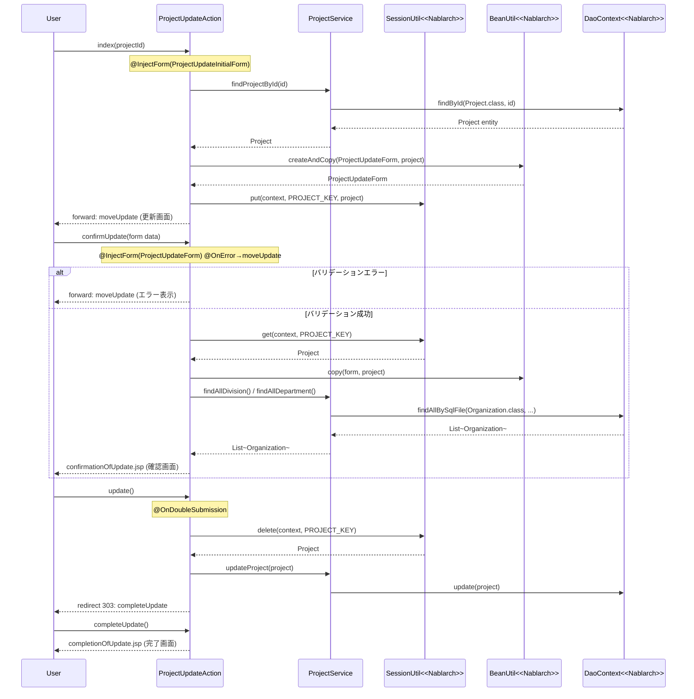

# Code Analysis: ProjectUpdateAction

**Generated**: 2026-03-12 18:12:45
**Target**: プロジェクト更新画面のアクションクラス（更新画面表示・確認・更新・完了）
**Modules**: proman-web, proman-common
**Analysis Duration**: 約3分10秒

---

## Overview

`ProjectUpdateAction` はプロジェクト更新機能を担うWebアクションクラスである。プロジェクト詳細画面からの遷移を受け付け、入力→確認→更新→完了という4ステップの画面フローを管理する。

主な責務：
- `index`: 更新画面を表示し、既存プロジェクト情報を初期値としてフォームに設定する
- `confirmUpdate`: バリデーション済みの入力値を確認画面に表示する
- `update`: 二重サブミット防止付きでデータベースを更新する
- `completeUpdate` / `backToEnterUpdate` / `indexSetPullDown`: 完了・戻る・プルダウン設定などの補助ナビゲーション

Nablarchの `@InjectForm`、`@OnError`、`@OnDoubleSubmission` アノテーションおよび `SessionUtil`、`BeanUtil`、`DaoContext`（UniversalDao）を組み合わせて実装されている。

---

## Architecture

### Dependency Graph

```mermaid
classDiagram
    class ProjectUpdateAction
    class ProjectUpdateForm {
        <<Form>>
    }
    class ProjectUpdateInitialForm {
        <<Form>>
    }
    class ProjectService
    class Project {
        <<Entity>>
    }
    class Organization {
        <<Entity>>
    }
    class DaoContext {
        <<Nablarch>>
    }
    class SessionUtil {
        <<Nablarch>>
    }
    class BeanUtil {
        <<Nablarch>>
    }
    class ExecutionContext {
        <<Nablarch>>
    }

    ProjectUpdateInitialForm ..|> Serializable : implements
    ProjectUpdateForm ..|> Serializable : implements
    ProjectUpdateAction ..> ProjectUpdateInitialForm : validates
    ProjectUpdateAction ..> ProjectUpdateForm : validates
    ProjectUpdateAction ..> ProjectService : delegates to
    ProjectUpdateAction ..> SessionUtil : stores/retrieves
    ProjectUpdateAction ..> BeanUtil : converts
    ProjectUpdateAction ..> ExecutionContext : uses
    ProjectService ..> DaoContext : queries/persists
    ProjectService ..> Project : queries/persists
    ProjectService ..> Organization : queries
```



**Note**: This diagram uses Mermaid `classDiagram` syntax to show class names and their relationships. Use `--|>` for inheritance (extends/implements) and `..>` for dependencies (uses/creates).

### Component Summary

| Component | Role | Type | Dependencies |
|-----------|------|------|--------------|
| ProjectUpdateAction | 更新フロー全体のアクション制御 | Action | ProjectUpdateForm, ProjectUpdateInitialForm, ProjectService, SessionUtil, BeanUtil, ExecutionContext |
| ProjectUpdateForm | 更新入力値のバリデーションフォーム | Form | DateRelationUtil |
| ProjectUpdateInitialForm | 詳細→更新画面遷移時のプロジェクトID受け取り | Form | なし |
| ProjectService | DB操作のサービス層（DAO委譲） | Service | DaoContext, Project, Organization |
| Project | プロジェクトエンティティ | Entity | なし |
| Organization | 組織（事業部・部門）エンティティ | Entity | なし |

---

## Flow

### Processing Flow

更新フローは以下の4ステップで構成される：

1. **更新画面表示（index）**: `ProjectUpdateInitialForm` でプロジェクトIDを受け取り、`ProjectService.findProjectById()` でDBから取得。`BeanUtil.createAndCopy()` でフォームに変換し、元のエンティティを `SessionUtil.put()` でセッションに保存する。

2. **確認画面表示（confirmUpdate）**: `ProjectUpdateForm` でバリデーションを実行。エラー時は `@OnError` で更新画面に戻る。バリデーション通過後、`BeanUtil.copy()` でセッションのエンティティに更新値を反映し、確認画面を表示する。

3. **DB更新（update）**: `@OnDoubleSubmission` で二重送信を防止。`SessionUtil.delete()` でセッションからエンティティを取り出し、`ProjectService.updateProject()` でDB更新。303リダイレクトで完了画面へ。

4. **完了画面表示（completeUpdate）**: 完了JSPをレンダリングして返す。

補助フロー：
- **backToEnterUpdate**: 確認→入力画面へ戻る。セッションのエンティティから再度フォームを構築する。
- **indexSetPullDown**: 事業部・部門のプルダウンをDBから取得してリクエストスコープに設定し更新画面を表示する。

### Sequence Diagram



---

## Components

### ProjectUpdateAction

**ファイル**: [ProjectUpdateAction.java](../../.lw/nab-official/v5/nablarch-system-development-guide/Sample_Project/Source_Code/proman-project/proman-web/src/main/java/com/nablarch/example/proman/web/project/ProjectUpdateAction.java)

**役割**: プロジェクト更新機能の全アクションメソッドを管理するコントローラクラス。

**キーメソッド**:

- `index` (L35-43): `@InjectForm(ProjectUpdateInitialForm)` でプロジェクトIDをバリデーション後、DBからプロジェクトを取得して更新フォームに変換。エンティティをセッションに保存する。
- `confirmUpdate` (L54-62): `@InjectForm(ProjectUpdateForm, prefix="form")` と `@OnError` を組み合わせ、バリデーションエラー時は更新画面に戻る。成功時はセッションのエンティティに入力値を反映して確認画面を表示。
- `update` (L72-77): `@OnDoubleSubmission` で二重送信防止。セッションからエンティティを削除して取得し、サービス経由でDB更新。303リダイレクトで完了画面へ。
- `buildFormFromEntity` (L111-125): エンティティからフォームを生成するプライベートメソッド。日付をフォーマット変換し、組織階層（事業部→部門）を取得してフォームにセットする。

**依存コンポーネント**: ProjectUpdateForm, ProjectUpdateInitialForm, ProjectService, SessionUtil, BeanUtil, ExecutionContext, DateUtil

---

### ProjectUpdateForm

**ファイル**: [ProjectUpdateForm.java](../../.lw/nab-official/v5/nablarch-system-development-guide/Sample_Project/Source_Code/proman-project/proman-web/src/main/java/com/nablarch/example/proman/web/project/ProjectUpdateForm.java)

**役割**: 更新画面の入力値を受け取り、バリデーションルールを定義するフォームクラス。

**キーメソッド**:

- `isValidProjectPeriod` (L329-331): `@AssertTrue` アノテーションで開始日と終了日の前後関係をバリデーションする。`DateRelationUtil.isValid()` に委譲。

**フィールド（バリデーション付き）**: `projectName(@Required @Domain)`, `projectType(@Required @Domain)`, `projectClass(@Required @Domain)`, `projectStartDate(@Required @Domain("date"))`, `projectEndDate(@Required @Domain("date"))`, `divisionId(@Required @Domain)`, `organizationId(@Required @Domain)`, `pmKanjiName(@Required @Domain)`, `plKanjiName(@Required @Domain)`, `note(@Domain)`, `salesAmount(@Domain)`

**依存コンポーネント**: DateRelationUtil

---

### ProjectUpdateInitialForm

**ファイル**: [ProjectUpdateInitialForm.java](../../.lw/nab-official/v5/nablarch-system-development-guide/Sample_Project/Source_Code/proman-project/proman-web/src/main/java/com/nablarch/example/proman/web/project/ProjectUpdateInitialForm.java)

**役割**: プロジェクト詳細画面から更新画面への遷移時にプロジェクトIDを受け取る専用フォーム。`@InjectForm` の対象として最小限のバリデーションのみ定義する。

**フィールド**: `projectId(@Required @Domain("projectId"))`

---

### ProjectService

**ファイル**: [ProjectService.java](../../.lw/nab-official/v5/nablarch-system-development-guide/Sample_Project/Source_Code/proman-project/proman-web/src/main/java/com/nablarch/example/proman/web/project/ProjectService.java)

**役割**: DB操作をDaoContextに委譲するサービスクラス。

**キーメソッド**:

- `findProjectById` (L124-126): `universalDao.findById(Project.class, projectId)` でプロジェクトを主キー検索する。
- `updateProject` (L89-91): `universalDao.update(project)` でエンティティを更新する。
- `findAllDivision` / `findAllDepartment` (L50-61): SQLファイル名を指定して組織一覧を取得する。
- `findOrganizationById` (L70-73): 組織IDで1件取得する。

**依存コンポーネント**: DaoContext（UniversalDao経由）, Project, Organization, DaoFactory

---

## Nablarch Framework Usage

### @InjectForm / @OnError

**クラス**: `nablarch.common.web.interceptor.InjectForm`, `nablarch.fw.web.interceptor.OnError`

**説明**: HTTPリクエストのバリデーションを業務アクションメソッドに宣言的に付与するアノテーション。バリデーション成功時にリクエストスコープへフォームオブジェクトを格納する。

**使用方法**:
```java
@InjectForm(form = ProjectUpdateForm.class, prefix = "form")
@OnError(type = ApplicationException.class, path = "forward:///app/project/moveUpdate")
public HttpResponse confirmUpdate(HttpRequest request, ExecutionContext context) {
    ProjectUpdateForm form = context.getRequestScopedVar("form");
    // バリデーション済みフォームを利用
}
```

**重要ポイント**:
- ✅ **`prefix` で入力値を絞る**: `prefix = "form"` を指定すると `form.xxx` の形式のパラメータのみがバリデーション対象になる
- ⚠️ **`@OnError` とセットで使う**: バリデーションエラー時のフォワード先を必ず指定する。指定がないとエラー時に例外がそのまま上位に伝播する
- 💡 **アクション内はキャストなし**: `context.getRequestScopedVar("form")` で型安全に取得できる

**このコードでの使い方**:
- `index`: `@InjectForm(form = ProjectUpdateInitialForm.class)` でプロジェクトIDのみをバリデーション（L34）
- `confirmUpdate`: `@InjectForm(form = ProjectUpdateForm.class, prefix = "form")` と `@OnError` を組み合わせ、入力エラー時に更新画面へ戻る（L52-53）

**詳細**: [Handlers InjectForm](../../.claude/skills/nabledge-6/docs/component/handlers/handlers-InjectForm.md)

---

### SessionUtil

**クラス**: `nablarch.common.web.session.SessionUtil`

**説明**: Nablarchのセッションストアを操作するユーティリティクラス。`put`/`get`/`delete` でセッション変数を管理する。

**使用方法**:
```java
// 保存
SessionUtil.put(context, "projectUpdateActionProject", project);
// 取得
Project project = SessionUtil.get(context, "projectUpdateActionProject");
// 取得して削除
Project project = SessionUtil.delete(context, "projectUpdateActionProject");
```

**重要ポイント**:
- ✅ **確認→更新フローでエンティティを橋渡し**: フォームではなくエンティティをセッションに保存することで、確認画面→更新処理の間でデータを維持する
- ⚠️ **フォームをセッションに入れない**: `ProjectUpdateForm` ではなく `Project` エンティティを保存する。フォームのセッション格納はNablarchのガイドラインで非推奨
- ⚠️ **`delete` で取り出す**: 更新処理（`update`メソッド）では `SessionUtil.delete()` を使うことでセッションからエンティティを削除しながら取得し、不要なセッションデータを残さない

**このコードでの使い方**:
- `index` (L41): プロジェクトエンティティをセッションに保存
- `confirmUpdate` (L56): セッションからエンティティを取得（更新は次の`update`まで保持）
- `update` (L73): `SessionUtil.delete()` で取り出しながら削除
- `backToEnterUpdate` (L98): セッションから取り出して再度フォームを構築

**詳細**: [Libraries Session Store](../../.claude/skills/nabledge-6/docs/component/libraries/libraries-session_store.md)

---

### BeanUtil

**クラス**: `nablarch.core.beans.BeanUtil`

**説明**: JavaBeansのプロパティコピーを行うユーティリティ。フォーム↔エンティティ変換に使用する。

**使用方法**:
```java
// フォームからエンティティへのコピー（上書き）
BeanUtil.copy(form, project);

// エンティティからフォームへの新規生成＆コピー
ProjectUpdateForm form = BeanUtil.createAndCopy(ProjectUpdateForm.class, project);
```

**重要ポイント**:
- ✅ **`createAndCopy` vs `copy` の使い分け**: 新しいオブジェクトを作る場合は `createAndCopy`、既存オブジェクトに上書きする場合は `copy` を使う
- ⚠️ **型変換に注意**: 日付フォーマットなど型変換が必要なプロパティは手動変換が必要（L113-117で `DateUtil.formatDate` を手動適用している）
- 💡 **同名プロパティを自動マッピング**: フォームとエンティティで同名のプロパティが自動的にコピーされる

**このコードでの使い方**:
- `buildFormFromEntity` (L112): `BeanUtil.createAndCopy(ProjectUpdateForm.class, project)` でエンティティからフォームを生成
- `confirmUpdate` (L57): `BeanUtil.copy(form, project)` でバリデーション済みフォームの値をセッション上のエンティティに反映

---

### @OnDoubleSubmission

**クラス**: `nablarch.common.web.token.OnDoubleSubmission`

**説明**: フォームの二重送信を防止するアノテーション。トークンの検証を行い、二重送信時にエラーレスポンスを返す。

**使用方法**:
```java
@OnDoubleSubmission
public HttpResponse update(HttpRequest request, ExecutionContext context) {
    // 更新処理
    return new HttpResponse(303, "redirect:///app/project/completeUpdate");
}
```

**重要ポイント**:
- ✅ **更新・登録・削除に必ず付ける**: DB書き込みを行うメソッドには必ず付与してデータ二重登録を防ぐ
- 💡 **JSP側の `useToken="true"` と対応**: `<n:form useToken="true">` で発行されたトークンをサーバー側で検証する仕組み
- ⚠️ **303リダイレクトと組み合わせる**: 更新後は303リダイレクトでPRGパターンを実装し、ブラウザのリロードによる再送信を防ぐ

**このコードでの使い方**:
- `update` (L71): `@OnDoubleSubmission` で二重送信を防止し、更新後に303リダイレクト（L76）

---

## References

### Source Files

- [ProjectUpdateAction.java (.lw/nab-official/v5/nablarch-system-development-guide/en/Sample_Project/Source_Code/proman-project/proman-web/src/main/java/com/nablarch/example/proman/web/project)](../../.lw/nab-official/v5/nablarch-system-development-guide/en/Sample_Project/Source_Code/proman-project/proman-web/src/main/java/com/nablarch/example/proman/web/project/ProjectUpdateAction.java) - ProjectUpdateAction
- [ProjectUpdateAction.java (.lw/nab-official/v5/nablarch-system-development-guide/Sample_Project/Source_Code/proman-project/proman-web/src/main/java/com/nablarch/example/proman/web/project)](../../.lw/nab-official/v5/nablarch-system-development-guide/Sample_Project/Source_Code/proman-project/proman-web/src/main/java/com/nablarch/example/proman/web/project/ProjectUpdateAction.java) - ProjectUpdateAction
- [ProjectUpdateForm.java (.lw/nab-official/v5/nablarch-system-development-guide/en/Sample_Project/Source_Code/proman-project/proman-web/src/main/java/com/nablarch/example/proman/web/project)](../../.lw/nab-official/v5/nablarch-system-development-guide/en/Sample_Project/Source_Code/proman-project/proman-web/src/main/java/com/nablarch/example/proman/web/project/ProjectUpdateForm.java) - ProjectUpdateForm
- [ProjectUpdateForm.java (.lw/nab-official/v5/nablarch-system-development-guide/Sample_Project/Source_Code/proman-project/proman-web/src/main/java/com/nablarch/example/proman/web/project)](../../.lw/nab-official/v5/nablarch-system-development-guide/Sample_Project/Source_Code/proman-project/proman-web/src/main/java/com/nablarch/example/proman/web/project/ProjectUpdateForm.java) - ProjectUpdateForm
- [ProjectUpdateInitialForm.java (.lw/nab-official/v5/nablarch-system-development-guide/en/Sample_Project/Source_Code/proman-project/proman-web/src/main/java/com/nablarch/example/proman/web/project)](../../.lw/nab-official/v5/nablarch-system-development-guide/en/Sample_Project/Source_Code/proman-project/proman-web/src/main/java/com/nablarch/example/proman/web/project/ProjectUpdateInitialForm.java) - ProjectUpdateInitialForm
- [ProjectUpdateInitialForm.java (.lw/nab-official/v5/nablarch-system-development-guide/Sample_Project/Source_Code/proman-project/proman-web/src/main/java/com/nablarch/example/proman/web/project)](../../.lw/nab-official/v5/nablarch-system-development-guide/Sample_Project/Source_Code/proman-project/proman-web/src/main/java/com/nablarch/example/proman/web/project/ProjectUpdateInitialForm.java) - ProjectUpdateInitialForm
- [ProjectService.java (.lw/nab-official/v5/nablarch-system-development-guide/en/Sample_Project/Source_Code/proman-project/proman-web/src/main/java/com/nablarch/example/proman/web/project)](../../.lw/nab-official/v5/nablarch-system-development-guide/en/Sample_Project/Source_Code/proman-project/proman-web/src/main/java/com/nablarch/example/proman/web/project/ProjectService.java) - ProjectService
- [ProjectService.java (.lw/nab-official/v5/nablarch-system-development-guide/Sample_Project/Source_Code/proman-project/proman-web/src/main/java/com/nablarch/example/proman/web/project)](../../.lw/nab-official/v5/nablarch-system-development-guide/Sample_Project/Source_Code/proman-project/proman-web/src/main/java/com/nablarch/example/proman/web/project/ProjectService.java) - ProjectService

### Knowledge Base (Nabledge-6)

- [Web Application Getting Started Project Update](../../.claude/skills/nabledge-6/docs/processing-pattern/web-application/web-application-getting-started-project-update.md)
- [Handlers InjectForm](../../.claude/skills/nabledge-6/docs/component/handlers/handlers-InjectForm.md)
- [Libraries Session_store](../../.claude/skills/nabledge-6/docs/component/libraries/libraries-session_store.md)

### Official Documentation


- [Base64.Encoder](https://nablarch.github.io/docs/LATEST/javadoc/java/util/Base64.Encoder.html)
- [Base64](https://nablarch.github.io/docs/LATEST/javadoc/java/util/Base64.html)
- [DbStore](https://nablarch.github.io/docs/LATEST/javadoc/nablarch/common/web/session/store/DbStore.html)
- [ExecutionContext](https://nablarch.github.io/docs/LATEST/javadoc/nablarch/fw/ExecutionContext.html)
- [HiddenStore](https://nablarch.github.io/docs/LATEST/javadoc/nablarch/common/web/session/store/HiddenStore.html)
- [HttpSessionStore](https://nablarch.github.io/docs/LATEST/javadoc/nablarch/common/web/session/store/HttpSessionStore.html)
- [Index](https://nablarch.github.io/docs/LATEST/doc/application_framework/application_framework/web/getting_started/project_update/index.html)
- [InjectForm](https://nablarch.github.io/docs/LATEST/doc/application_framework/application_framework/handlers/web_interceptor/InjectForm.html)
- [InjectForm](https://nablarch.github.io/docs/LATEST/javadoc/nablarch/common/web/interceptor/InjectForm.html)
- [JavaSerializeEncryptStateEncoder](https://nablarch.github.io/docs/LATEST/javadoc/nablarch/common/web/session/encoder/JavaSerializeEncryptStateEncoder.html)
- [JavaSerializeStateEncoder](https://nablarch.github.io/docs/LATEST/javadoc/nablarch/common/web/session/encoder/JavaSerializeStateEncoder.html)
- [JaxbStateEncoder](https://nablarch.github.io/docs/LATEST/javadoc/nablarch/common/web/session/encoder/JaxbStateEncoder.html)
- [KeyGenerator](https://nablarch.github.io/docs/LATEST/javadoc/javax/crypto/KeyGenerator.html)
- [NoDataException](https://nablarch.github.io/docs/LATEST/javadoc/nablarch/common/dao/NoDataException.html)
- [OnDoubleSubmission](https://nablarch.github.io/docs/LATEST/javadoc/nablarch/common/web/token/OnDoubleSubmission.html)
- [OnError](https://nablarch.github.io/docs/LATEST/javadoc/nablarch/fw/web/interceptor/OnError.html)
- [ResourceLocator](https://nablarch.github.io/docs/LATEST/javadoc/nablarch/fw/web/ResourceLocator.html)
- [SecureRandom](https://nablarch.github.io/docs/LATEST/javadoc/java/security/SecureRandom.html)
- [Session Store](https://nablarch.github.io/docs/LATEST/doc/application_framework/application_framework/libraries/session_store.html)
- [SessionKeyNotFoundException](https://nablarch.github.io/docs/LATEST/javadoc/nablarch/common/web/session/SessionKeyNotFoundException.html)
- [SessionManager](https://nablarch.github.io/docs/LATEST/javadoc/nablarch/common/web/session/SessionManager.html)
- [SessionStore](https://nablarch.github.io/docs/LATEST/javadoc/nablarch/common/web/session/SessionStore.html)
- [SessionUtil](https://nablarch.github.io/docs/LATEST/javadoc/nablarch/common/web/session/SessionUtil.html)
- [UUID](https://nablarch.github.io/docs/LATEST/javadoc/java/util/UUID.html)
- [UniversalDao](https://nablarch.github.io/docs/LATEST/javadoc/nablarch/common/dao/UniversalDao.html)
- [UserSessionSchema](https://nablarch.github.io/docs/LATEST/javadoc/nablarch/common/web/session/store/UserSessionSchema.html)

---

**Note**: This documentation was generated by the code-analysis workflow of the nabledge-6 skill.
