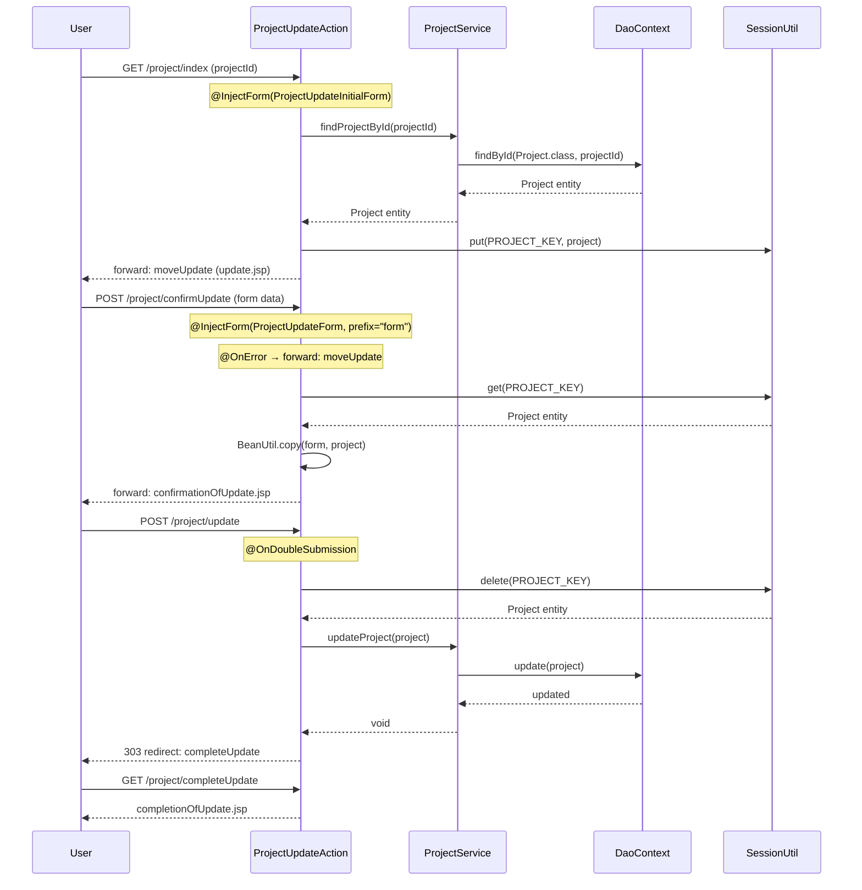

# Code Analysis: ProjectUpdateAction

**Generated**: 2026-03-12 18:24:15
**Target**: プロジェクト更新処理アクション
**Modules**: proman-web
**Analysis Duration**: 約4分26秒

---

## Overview

`ProjectUpdateAction` はプロジェクト管理Webアプリケーションにおける更新処理を担うアクションクラスである。プロジェクト詳細画面からの更新フロー（表示→確認→更新→完了）を5つのアクションメソッドで実装している。

入力バリデーションには `@InjectForm` インターセプターを利用し、セッションストアによる画面間データ受け渡し、`@OnDoubleSubmission` による二重送信防止、`BeanUtil` によるフォーム⇔エンティティ変換を組み合わせたNablarch標準のCRUD更新パターンを採用している。データベースアクセスは `ProjectService` に委譲し、内部で `DaoContext`（UniversalDao）を使用してエンティティ単位のSQLを実行する。

---

## Architecture

### Dependency Graph

```mermaid
classDiagram
    class ProjectUpdateAction
    class ProjectUpdateForm {
        <<Form>>
    }
    class ProjectUpdateInitialForm {
        <<Form>>
    }
    class ProjectService
    class Project {
        <<Entity>>
    }
    class Organization {
        <<Entity>>
    }
    class DaoContext {
        <<Nablarch>>
    }
    class SessionUtil {
        <<Nablarch>>
    }
    class BeanUtil {
        <<Nablarch>>
    }
    class ExecutionContext {
        <<Nablarch>>
    }

    ProjectUpdateAction ..> ProjectUpdateForm : validates
    ProjectUpdateAction ..> ProjectUpdateInitialForm : validates
    ProjectUpdateAction ..> ProjectService : delegates to
    ProjectUpdateAction ..> SessionUtil : stores/retrieves
    ProjectUpdateAction ..> BeanUtil : converts
    ProjectUpdateAction ..> ExecutionContext : uses
    ProjectService ..> DaoContext : queries/persists
    ProjectService ..> Project : persists
    ProjectService ..> Organization : queries
```



**Note**: This diagram uses Mermaid `classDiagram` syntax to show class names and their relationships. Use `--|>` for inheritance (extends/implements) and `..>` for dependencies (uses/creates).

### Component Summary

| Component | Role | Type | Dependencies |
|-----------|------|------|--------------|
| ProjectUpdateAction | プロジェクト更新フロー制御 | Action | ProjectUpdateForm, ProjectUpdateInitialForm, ProjectService, SessionUtil, BeanUtil, ExecutionContext |
| ProjectUpdateForm | 更新入力値の受け取りとバリデーション | Form | DateRelationUtil |
| ProjectUpdateInitialForm | 詳細→更新画面遷移時のプロジェクトID受け取り | Form | なし |
| ProjectService | データベースアクセスの委譲先 | Service | DaoContext, Project, Organization |
| Project | プロジェクトエンティティ | Entity | なし |
| Organization | 組織（事業部・部門）エンティティ | Entity | なし |

---

## Flow

### Processing Flow

プロジェクト更新は以下のステップで処理される：

1. **index（更新画面表示）**: 詳細画面から `projectId` を受け取り（`ProjectUpdateInitialForm`）、DBからプロジェクト情報を取得してセッションストアに保存。フォームに初期値をセットして更新入力画面へフォワード。
2. **indexSetPullDown（プルダウン設定）**: 事業部・部門のプルダウン一覧をDBから取得してリクエストスコープに設定。更新入力画面（update.jsp）を表示。
3. **confirmUpdate（確認画面表示）**: `ProjectUpdateForm` で入力値をバリデーション。エラー時は `@OnError` で更新画面へフォワード。問題なければセッションのProjectエンティティに入力値をコピーし、確認画面へフォワード。
4. **update（更新実行）**: `@OnDoubleSubmission` で二重送信を防止。セッションから削除したProjectエンティティを `ProjectService.updateProject()` でDB更新。303リダイレクトで完了画面へ遷移。
5. **completeUpdate（完了画面表示）**: 完了JSPへフォワードするのみ。
6. **backToEnterUpdate（入力画面に戻る）**: セッションのProjectエンティティから再度フォームを構築して更新入力画面へ戻る。

### Sequence Diagram



---

## Components

### ProjectUpdateAction

**ファイル**: [ProjectUpdateAction.java](../../.lw/nab-official/v5/nablarch-system-development-guide/Sample_Project/Source_Code/proman-project/proman-web/src/main/java/com/nablarch/example/proman/web/project/ProjectUpdateAction.java)

**役割**: プロジェクト更新フロー全体を制御するアクションクラス。5つのアクションメソッドでWebリクエストを処理する。

**キーメソッド**:

- `index` (L35-43): 更新画面の初期表示。`@InjectForm(ProjectUpdateInitialForm)` でプロジェクトIDをバリデーション後、DBからエンティティ取得しセッションに保存。
- `confirmUpdate` (L54-62): 確認画面表示。`@InjectForm(ProjectUpdateForm, prefix="form")` と `@OnError` でバリデーション。`BeanUtil.copy(form, project)` でエンティティを更新値で上書き。
- `update` (L72-77): DB更新実行。`@OnDoubleSubmission` で二重送信防止。`SessionUtil.delete()` でセッション削除と同時にエンティティ取得。303リダイレクトで完了画面へ。
- `buildFormFromEntity` (L111-125): エンティティからフォームを生成するプライベートメソッド。`BeanUtil.createAndCopy()` と `DateUtil.formatDate()` で日付フォーマット変換。
- `setOrganizationAndDivisionToRequestScope` (L148-158): 事業部・部門プルダウン用データをDBから取得してリクエストスコープに設定。

**依存関係**: ProjectUpdateForm, ProjectUpdateInitialForm, ProjectService, SessionUtil, BeanUtil, ExecutionContext, DateUtil

---

### ProjectUpdateForm

**ファイル**: [ProjectUpdateForm.java](../../.lw/nab-official/v5/nablarch-system-development-guide/Sample_Project/Source_Code/proman-project/proman-web/src/main/java/com/nablarch/example/proman/web/project/ProjectUpdateForm.java)

**役割**: 更新画面の入力値受け取りとBean Validationによるバリデーション定義。

**キーメソッド**:

- `isValidProjectPeriod` (L329-331): `@AssertTrue` による相関チェック。`DateRelationUtil.isValid()` で開始日≦終了日を検証。

**重要な実装点**:
- すべての入力項目は `String` 型で宣言（Nablarch Bean Validationの規約）
- `@Required` と `@Domain` を組み合わせてドメインバリデーションを実施
- `Serializable` 実装は `@InjectForm` 使用時の必須要件

**依存関係**: DateRelationUtil

---

### ProjectUpdateInitialForm

**ファイル**: [ProjectUpdateInitialForm.java](../../.lw/nab-official/v5/nablarch-system-development-guide/Sample_Project/Source_Code/proman-project/proman-web/src/main/java/com/nablarch/example/proman/web/project/ProjectUpdateInitialForm.java)

**役割**: 詳細画面→更新画面遷移時のパスパラメータ（projectId）受け取り専用フォーム。

**依存関係**: なし（単純なバリデーションフォーム）

---

### ProjectService

**ファイル**: [ProjectService.java](../../.lw/nab-official/v5/nablarch-system-development-guide/Sample_Project/Source_Code/proman-project/proman-web/src/main/java/com/nablarch/example/proman/web/project/ProjectService.java)

**役割**: ProjectUpdateActionのデータベースアクセスを委譲するサービスクラス。`DaoContext`（UniversalDao）を内部で使用してエンティティ単位のCRUD操作を提供。

**キーメソッド**:

- `findProjectById` (L124-126): プロジェクトIDで1件検索（`findById(Project.class, projectId)`）
- `updateProject` (L89-91): プロジェクトエンティティを更新（`universalDao.update(project)`）
- `findAllDivision` (L50-52) / `findAllDepartment` (L59-61): 事業部・部門一覧取得（SQLファイル使用）
- `findOrganizationById` (L70-73): 組織IDで組織を取得（`findById(Organization.class, param)`）

**依存関係**: DaoContext, Project, Organization

---

## Nablarch Framework Usage

### @InjectForm

**クラス**: `nablarch.common.web.interceptor.InjectForm`

**説明**: アクションメソッドの前処理としてBean Validationを実行するインターセプター。バリデーション済みフォームオブジェクトをリクエストスコープに設定する。

**使用方法**:
```java
@InjectForm(form = ProjectUpdateForm.class, prefix = "form")
@OnError(type = ApplicationException.class, path = "forward:///app/project/moveUpdate")
public HttpResponse confirmUpdate(HttpRequest request, ExecutionContext context) {
    ProjectUpdateForm form = context.getRequestScopedVar("form");
    // バリデーション済みフォームを使用
}
```

**重要ポイント**:
- ✅ **`prefix` を指定**: HTMLフォームの `name` 属性が `form.xxx` の場合は `prefix = "form"` を設定する
- ✅ **`@OnError` とセットで使用**: バリデーションエラー時の遷移先を必ず指定する
- 💡 **フォームは `Serializable` 実装が必要**: `@InjectForm` の内部処理でシリアライズが必要なため
- ⚠️ **`nablarch.core.validation.ee` を使用**: `nablarch.core.validation.validator` の同名アノテーションと混同しないこと

**このコードでの使い方**:
- `index()`: `@InjectForm(form = ProjectUpdateInitialForm.class)` でプロジェクトIDのみ取得
- `confirmUpdate()`: `@InjectForm(form = ProjectUpdateForm.class, prefix = "form")` で全更新項目をバリデーション

**詳細**: [Web Application Getting Started Project Update](../../.claude/skills/nabledge-6/docs/processing-pattern/web-application/web-application-getting-started-project-update.md)

---

### SessionUtil

**クラス**: `nablarch.common.web.session.SessionUtil`

**説明**: セッションストアへの保存・取得・削除を提供するユーティリティクラス。画面間でのエンティティ受け渡しに使用する。

**使用方法**:
```java
// 保存
SessionUtil.put(context, PROJECT_KEY, project);

// 取得（セッションに残す）
Project project = SessionUtil.get(context, PROJECT_KEY);

// 取得して削除
Project project = SessionUtil.delete(context, PROJECT_KEY);
```

**重要ポイント**:
- ✅ **更新実行時は `delete()` を使用**: `update()` メソッドではセッションから削除しながら取得することで、処理後にセッションデータが残らないようにする
- ⚠️ **フォームをセッションに直接格納しない**: フォームオブジェクトはセッション格納に適していない。`BeanUtil.createAndCopy()` でエンティティに変換してから格納する
- 💡 **楽観的ロック対応**: 編集開始時点のエンティティをセッションに保存することで、他ユーザーによる変更を検知できる

**このコードでの使い方**:
- `index()`: `SessionUtil.put(context, PROJECT_KEY, project)` で取得したProjectをセッション保存 (L41)
- `confirmUpdate()`: `SessionUtil.get(context, PROJECT_KEY)` でエンティティ取得後 `BeanUtil.copy(form, project)` で更新値をコピー (L56-57)
- `update()`: `SessionUtil.delete(context, PROJECT_KEY)` でセッション削除と同時にエンティティ取得してDB更新 (L73)

**詳細**: [Web Application Client Create4](../../.claude/skills/nabledge-6/docs/processing-pattern/web-application/web-application-client_create4.md)

---

### @OnDoubleSubmission

**クラス**: `nablarch.common.web.token.OnDoubleSubmission`

**説明**: 同一リクエストの二重送信を防止するインターセプター。JSが無効な環境にも対応するため、サーバサイドでトークン検証を行う。

**使用方法**:
```java
@OnDoubleSubmission
public HttpResponse update(HttpRequest request, ExecutionContext context) {
    // 二重送信が検知された場合はここに到達しない
    final Project project = SessionUtil.delete(context, PROJECT_KEY);
    service.updateProject(project);
    return new HttpResponse(303, "redirect:///app/project/completeUpdate");
}
```

**重要ポイント**:
- ✅ **更新・登録・削除メソッドに付与**: DB変更を伴うアクションメソッドには必ず付与する
- 💡 **JSP側の `useToken="true"` と連携**: `<n:form useToken="true">` でトークンをHTMLに埋め込み、サーバ側で検証
- ⚠️ **二重送信時のデフォルト遷移先**: アプリケーション設定でデフォルトエラー画面を定義しておく必要がある
- 🎯 **303リダイレクトと組み合わせる**: 更新後は `new HttpResponse(303, "redirect://...")` でブラウザの戻るボタンによる再実行を防止

**このコードでの使い方**:
- `update()` メソッドに付与してDB更新の二重実行を防止 (L71)

**詳細**: [Web Application Getting Started Project Update](../../.claude/skills/nabledge-6/docs/processing-pattern/web-application/web-application-getting-started-project-update.md)

---

### BeanUtil

**クラス**: `nablarch.core.beans.BeanUtil`

**説明**: JavaBeans間でのプロパティコピー、Bean生成をサポートするユーティリティクラス。フォームとエンティティの相互変換に使用する。

**使用方法**:
```java
// フォームからエンティティを新規生成しながらコピー
ProjectUpdateForm projectUpdateForm = BeanUtil.createAndCopy(ProjectUpdateForm.class, project);

// 既存オブジェクトへのコピー（同名プロパティを上書き）
BeanUtil.copy(form, project);
```

**重要ポイント**:
- ✅ **同名プロパティ自動コピー**: 型変換付きでプロパティ名が一致するものを自動コピー。手動でのプロパティセットは不要
- ⚠️ **型変換の限界**: 日付型の文字列フォーマット変換は `BeanUtil` では行わない。`DateUtil.formatDate()` などで別途変換が必要
- 💡 **セッション格納前の変換に活用**: フォームをエンティティに変換してからセッションへ格納するパターンで必須

**このコードでの使い方**:
- `buildFormFromEntity` (L112): `BeanUtil.createAndCopy(ProjectUpdateForm.class, project)` でエンティティ→フォーム変換
- `confirmUpdate` (L57): `BeanUtil.copy(form, project)` でフォームの更新値をエンティティに上書き

**詳細**: [Web Application Client Create2](../../.claude/skills/nabledge-6/docs/processing-pattern/web-application/web-application-client_create2.md)

---

## References

### Source Files

- [ProjectUpdateAction.java (.lw/nab-official/v5/nablarch-system-development-guide/en/Sample_Project/Source_Code/proman-project/proman-web/src/main/java/com/nablarch/example/proman/web/project)](../../.lw/nab-official/v5/nablarch-system-development-guide/en/Sample_Project/Source_Code/proman-project/proman-web/src/main/java/com/nablarch/example/proman/web/project/ProjectUpdateAction.java) - ProjectUpdateAction
- [ProjectUpdateAction.java (.lw/nab-official/v5/nablarch-system-development-guide/Sample_Project/Source_Code/proman-project/proman-web/src/main/java/com/nablarch/example/proman/web/project)](../../.lw/nab-official/v5/nablarch-system-development-guide/Sample_Project/Source_Code/proman-project/proman-web/src/main/java/com/nablarch/example/proman/web/project/ProjectUpdateAction.java) - ProjectUpdateAction
- [ProjectUpdateForm.java (.lw/nab-official/v5/nablarch-system-development-guide/en/Sample_Project/Source_Code/proman-project/proman-web/src/main/java/com/nablarch/example/proman/web/project)](../../.lw/nab-official/v5/nablarch-system-development-guide/en/Sample_Project/Source_Code/proman-project/proman-web/src/main/java/com/nablarch/example/proman/web/project/ProjectUpdateForm.java) - ProjectUpdateForm
- [ProjectUpdateForm.java (.lw/nab-official/v5/nablarch-system-development-guide/Sample_Project/Source_Code/proman-project/proman-web/src/main/java/com/nablarch/example/proman/web/project)](../../.lw/nab-official/v5/nablarch-system-development-guide/Sample_Project/Source_Code/proman-project/proman-web/src/main/java/com/nablarch/example/proman/web/project/ProjectUpdateForm.java) - ProjectUpdateForm
- [ProjectUpdateInitialForm.java (.lw/nab-official/v5/nablarch-system-development-guide/en/Sample_Project/Source_Code/proman-project/proman-web/src/main/java/com/nablarch/example/proman/web/project)](../../.lw/nab-official/v5/nablarch-system-development-guide/en/Sample_Project/Source_Code/proman-project/proman-web/src/main/java/com/nablarch/example/proman/web/project/ProjectUpdateInitialForm.java) - ProjectUpdateInitialForm
- [ProjectUpdateInitialForm.java (.lw/nab-official/v5/nablarch-system-development-guide/Sample_Project/Source_Code/proman-project/proman-web/src/main/java/com/nablarch/example/proman/web/project)](../../.lw/nab-official/v5/nablarch-system-development-guide/Sample_Project/Source_Code/proman-project/proman-web/src/main/java/com/nablarch/example/proman/web/project/ProjectUpdateInitialForm.java) - ProjectUpdateInitialForm
- [ProjectService.java (.lw/nab-official/v5/nablarch-system-development-guide/en/Sample_Project/Source_Code/proman-project/proman-web/src/main/java/com/nablarch/example/proman/web/project)](../../.lw/nab-official/v5/nablarch-system-development-guide/en/Sample_Project/Source_Code/proman-project/proman-web/src/main/java/com/nablarch/example/proman/web/project/ProjectService.java) - ProjectService
- [ProjectService.java (.lw/nab-official/v5/nablarch-system-development-guide/Sample_Project/Source_Code/proman-project/proman-web/src/main/java/com/nablarch/example/proman/web/project)](../../.lw/nab-official/v5/nablarch-system-development-guide/Sample_Project/Source_Code/proman-project/proman-web/src/main/java/com/nablarch/example/proman/web/project/ProjectService.java) - ProjectService

### Knowledge Base (Nabledge-6)

- [Web Application Getting Started Project Update](../../.claude/skills/nabledge-6/docs/processing-pattern/web-application/web-application-getting-started-project-update.md)
- [Web Application Client_create2](../../.claude/skills/nabledge-6/docs/processing-pattern/web-application/web-application-client_create2.md)
- [Web Application Client_create4](../../.claude/skills/nabledge-6/docs/processing-pattern/web-application/web-application-client_create4.md)

### Official Documentation


- [BeanUtil](https://nablarch.github.io/docs/LATEST/javadoc/nablarch/core/beans/BeanUtil.html)
- [Client Create2](https://nablarch.github.io/docs/LATEST/doc/application_framework/application_framework/web/getting_started/client_create/client_create2.html)
- [Client Create4](https://nablarch.github.io/docs/LATEST/doc/application_framework/application_framework/web/getting_started/client_create/client_create4.html)
- [Index](https://nablarch.github.io/docs/LATEST/doc/application_framework/application_framework/web/getting_started/project_update/index.html)
- [InjectForm](https://nablarch.github.io/docs/LATEST/javadoc/nablarch/common/web/interceptor/InjectForm.html)
- [NoDataException](https://nablarch.github.io/docs/LATEST/javadoc/nablarch/common/dao/NoDataException.html)
- [OnDoubleSubmission](https://nablarch.github.io/docs/LATEST/javadoc/nablarch/common/web/token/OnDoubleSubmission.html)
- [OnError](https://nablarch.github.io/docs/LATEST/javadoc/nablarch/fw/web/interceptor/OnError.html)
- [Required](https://nablarch.github.io/docs/LATEST/javadoc/nablarch/core/validation/ee/Required.html)
- [ResourceLocator](https://nablarch.github.io/docs/LATEST/javadoc/nablarch/fw/web/ResourceLocator.html)
- [SessionUtil](https://nablarch.github.io/docs/LATEST/javadoc/nablarch/common/web/session/SessionUtil.html)
- [UniversalDao](https://nablarch.github.io/docs/LATEST/javadoc/nablarch/common/dao/UniversalDao.html)

---

**Note**: This documentation was generated by the code-analysis workflow of the nabledge-6 skill.
