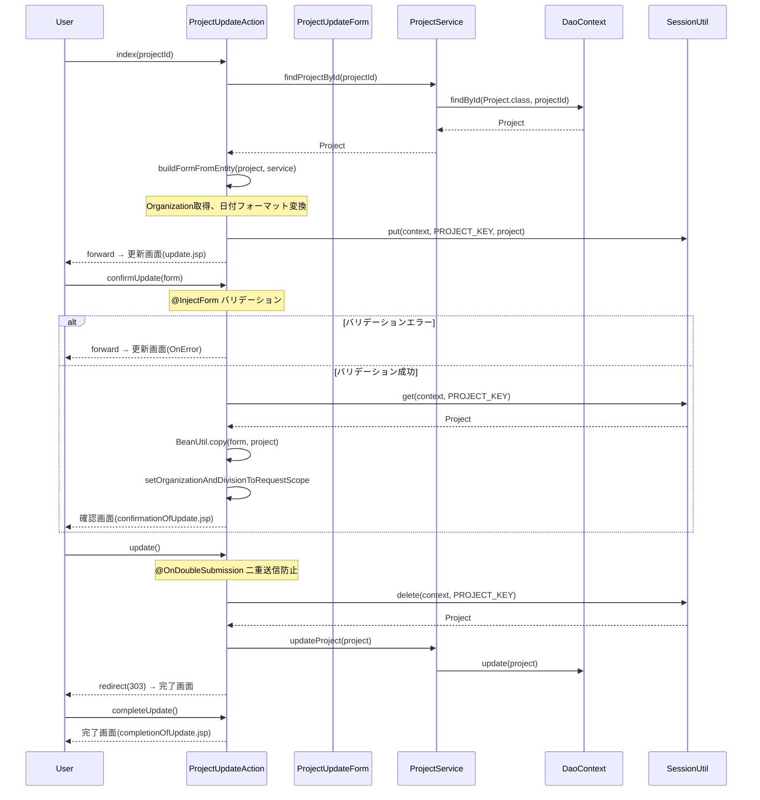

# Code Analysis: ProjectUpdateAction

**Generated**: 2026-03-12 18:31:14
**Target**: プロジェクト更新処理（入力・確認・更新・完了画面遷移）
**Modules**: proman-web
**Analysis Duration**: 約4分33秒

---

## Overview

`ProjectUpdateAction` は、プロジェクトの更新機能を担うWebアクションクラスである。プロジェクト詳細画面から更新画面への遷移、入力値の確認画面表示、データベース更新、完了画面表示という一連の画面フローを制御する。

セッションストア（`SessionUtil`）を活用して更新対象のプロジェクトエンティティを保持し、`@InjectForm` によるバリデーション、`@OnDoubleSubmission` による二重送信防止、`BeanUtil` によるBean間コピーを組み合わせた典型的なNablarch Webアプリケーションの更新パターンを実装している。

---

## Architecture

### Dependency Graph

```mermaid
classDiagram
    class ProjectUpdateAction
    class ProjectUpdateForm {
        <<Form>>
    }
    class ProjectUpdateInitialForm {
        <<Form>>
    }
    class ProjectService
    class Project {
        <<Entity>>
    }
    class Organization {
        <<Entity>>
    }
    class SessionUtil {
        <<Nablarch>>
    }
    class BeanUtil {
        <<Nablarch>>
    }
    class ExecutionContext {
        <<Nablarch>>
    }
    class DaoContext {
        <<Nablarch>>
    }

    ProjectUpdateAction ..> ProjectUpdateInitialForm : validates
    ProjectUpdateAction ..> ProjectUpdateForm : validates
    ProjectUpdateAction ..> ProjectService : delegates to
    ProjectUpdateAction ..> SessionUtil : puts/gets/deletes
    ProjectUpdateAction ..> BeanUtil : copies
    ProjectUpdateAction ..> ExecutionContext : reads/sets vars
    ProjectService ..> Project : persists
    ProjectService ..> Organization : queries
    ProjectService ..> DaoContext : uses
    ProjectUpdateForm ..|> Serializable : uses
    ProjectUpdateInitialForm ..|> Serializable : uses
```



**Note**: This diagram uses Mermaid `classDiagram` syntax to show class names and their relationships. Use `--|>` for inheritance (extends/implements) and `..>` for dependencies (uses/creates).

### Component Summary

| Component | Role | Type | Dependencies |
|-----------|------|------|--------------|
| ProjectUpdateAction | プロジェクト更新のWebアクション | Action | ProjectUpdateInitialForm, ProjectUpdateForm, ProjectService, SessionUtil, BeanUtil, ExecutionContext |
| ProjectUpdateInitialForm | 更新画面遷移時のプロジェクトID受取フォーム | Form | なし |
| ProjectUpdateForm | 更新入力値受取フォーム（バリデーション含む） | Form | DateRelationUtil |
| ProjectService | プロジェクト/組織DBアクセスサービス | Service | DaoContext, Project, Organization |

---

## Flow

### Processing Flow

更新処理は4つのアクションメソッドで構成される画面フローである。

1. **index（更新画面表示）**: 詳細画面からプロジェクトIDを受け取り（`ProjectUpdateInitialForm`）、DBからプロジェクトを取得。エンティティをセッションストアに保存し、フォームに変換して更新画面へフォワード。
2. **confirmUpdate（確認画面表示）**: 更新フォームのバリデーション実施（`@InjectForm` + `@OnError`）。セッションのエンティティにフォーム値をコピーし確認画面を表示。
3. **update（DB更新）**: `@OnDoubleSubmission` で二重送信防止。セッションからエンティティを削除して`ProjectService#updateProject`でDB更新。完了画面へリダイレクト（303）。
4. **backToEnterUpdate（入力画面へ戻る）**: セッションのエンティティをフォームに変換して更新入力画面へフォワード。

補助メソッドとして `indexSetPullDown` が事業部/部門プルダウンのリクエストスコープ設定を行い、`setOrganizationAndDivisionToRequestScope` がその共通処理を実装している。

### Sequence Diagram



---

## Components

### ProjectUpdateAction

**ファイル**: [ProjectUpdateAction.java](../../.lw/nab-official/v5/nablarch-system-development-guide/Sample_Project/Source_Code/proman-project/proman-web/src/main/java/com/nablarch/example/proman/web/project/ProjectUpdateAction.java)

**役割**: プロジェクト更新フロー全体を制御するWebアクション。セッションストアを介したエンティティ管理と画面遷移を担う。

**キーメソッド**:

- `index` (L:35-43): `@InjectForm(form = ProjectUpdateInitialForm.class)` でプロジェクトIDを受け取り、DBから取得したProjectをセッションに保存して更新画面へフォワード。
- `confirmUpdate` (L:52-62): `@InjectForm(form = ProjectUpdateForm.class, prefix = "form")` と `@OnError` でバリデーション。セッションのProjectにフォーム値をコピーして確認画面を表示。
- `update` (L:71-77): `@OnDoubleSubmission` で保護。セッションからProjectを取り出してDB更新し303リダイレクト。
- `buildFormFromEntity` (L:111-125): ProjectエンティティをProjectUpdateFormに変換。日付フォーマット変換と組織情報設定を行う。

**依存コンポーネント**: ProjectUpdateInitialForm, ProjectUpdateForm, ProjectService, SessionUtil, BeanUtil, ExecutionContext, DateUtil

### ProjectUpdateInitialForm

**ファイル**: [ProjectUpdateInitialForm.java](../../.lw/nab-official/v5/nablarch-system-development-guide/Sample_Project/Source_Code/proman-project/proman-web/src/main/java/com/nablarch/example/proman/web/project/ProjectUpdateInitialForm.java)

**役割**: プロジェクト詳細画面から更新画面への遷移時にプロジェクトIDを受け取るシンプルなフォーム。

**フィールド**: `projectId` (`@Required`, `@Domain("projectId")`)

### ProjectUpdateForm

**ファイル**: [ProjectUpdateForm.java](../../.lw/nab-official/v5/nablarch-system-development-guide/Sample_Project/Source_Code/proman-project/proman-web/src/main/java/com/nablarch/example/proman/web/project/ProjectUpdateForm.java)

**役割**: 更新画面の入力値を受け取るフォーム。Bean Validationアノテーション（`@Required`, `@Domain`）による入力検証と、`@AssertTrue` による期間妥当性チェックを持つ。

**キーメソッド**:
- `isValidProjectPeriod` (L:329-331): `DateRelationUtil.isValid` で開始日・終了日の大小関係を検証。

**バリデーション項目**: projectName, projectType, projectClass, projectStartDate, projectEndDate, divisionId, organizationId, pmKanjiName, plKanjiName（必須）; clientId, note, salesAmount（任意）

### ProjectService

**ファイル**: [ProjectService.java](../../.lw/nab-official/v5/nablarch-system-development-guide/Sample_Project/Source_Code/proman-project/proman-web/src/main/java/com/nablarch/example/proman/web/project/ProjectService.java)

**役割**: プロジェクト/組織のDBアクセスをカプセル化するサービス。`DaoContext`（UniversalDAO）を内部で保持し、各種検索・更新メソッドを提供する。

**更新関連メソッド**:
- `updateProject` (L:89-91): `universalDao.update(project)` でProjectエンティティをDB更新。
- `findProjectById` (L:124-126): `universalDao.findById` でプロジェクトを主キー検索。
- `findOrganizationById` (L:70-73): 組織IDでOrganizationを取得（事業部/部門のプルダウン用）。

---

## Nablarch Framework Usage

### SessionUtil

**クラス**: `nablarch.common.web.session.SessionUtil`

**説明**: セッションストアへのデータの保存・取得・削除を提供するユーティリティクラス。Webアプリケーションでの画面間データ受け渡しに使用する。

**使用方法**:
```java
// 保存
SessionUtil.put(context, "project", project);

// 取得
Project project = SessionUtil.get(context, "project");

// 削除（取得と同時に削除）
Project project = SessionUtil.delete(context, "project");
```

**重要ポイント**:
- ✅ **更新確定後にdeleteで取得**: `update()` で `SessionUtil.delete` を使い、更新完了後にセッションからエンティティを削除してメモリリークを防ぐ。
- ⚠️ **フォームをセッションに格納しない**: セッションストアにはエンティティ（`Project`）を格納し、フォームを直接格納しない。フォームはリクエストスコープで管理する。
- 💡 **楽観的ロックとの連携**: 編集開始時点のエンティティをセッションに保存しておくことで、確認画面から更新確定まで楽観的ロック用のversionが保持される。

**このコードでの使い方**:
- `index()` でProjectエンティティを `PUT`（キー: `PROJECT_KEY = "projectUpdateActionProject"`）
- `confirmUpdate()` で `GET` してフォーム値をコピー
- `update()` で `DELETE` してDB更新に使用
- `backToEnterUpdate()` で `GET` して入力画面へ戻る際のフォーム再生成に使用

**詳細**: [Web Application Getting Started Project Update](../../.claude/skills/nabledge-6/docs/processing-pattern/web-application/web-application-getting-started-project-update.md)

---

### @InjectForm / @OnError

**クラス**: `nablarch.common.web.interceptor.InjectForm`, `nablarch.fw.web.interceptor.OnError`

**説明**: `@InjectForm` はリクエストパラメータのバインドとBean Validationを実行するインターセプター。`@OnError` はバリデーション例外発生時のフォワード先を指定する。

**使用方法**:
```java
@InjectForm(form = ProjectUpdateForm.class, prefix = "form")
@OnError(type = ApplicationException.class, path = "forward:///app/project/moveUpdate")
public HttpResponse confirmUpdate(HttpRequest request, ExecutionContext context) {
    ProjectUpdateForm form = context.getRequestScopedVar("form");
    // ...
}
```

**重要ポイント**:
- ✅ **`prefix = "form"` の指定**: JSPフォームの `name` 属性プレフィックスと一致させる必要がある。
- ⚠️ **`@OnError` のパスはフォワード**: リダイレクトではなくフォワードでないと入力値が失われる。
- 💡 **バリデーション済みフォームはリクエストスコープへ**: `context.getRequestScopedVar("form")` で取得できる。

**このコードでの使い方**:
- `index()`: `ProjectUpdateInitialForm`（プロジェクトID）にprefixなしで適用
- `confirmUpdate()`: `ProjectUpdateForm`（更新入力値）に `prefix = "form"` で適用、エラー時は更新画面にフォワード

**詳細**: [Web Application Getting Started Project Update](../../.claude/skills/nabledge-6/docs/processing-pattern/web-application/web-application-getting-started-project-update.md)

---

### @OnDoubleSubmission

**クラス**: `nablarch.common.web.token.OnDoubleSubmission`

**説明**: フォームトークンを用いた二重送信防止インターセプター。JSP側でトークンを発行し、サーバー側で照合する。

**使用方法**:
```java
@OnDoubleSubmission
public HttpResponse update(HttpRequest request, ExecutionContext context) {
    // 二重送信時はここに到達しない
}
```

**重要ポイント**:
- ✅ **JSP側での `useToken="true"` 必須**: `<n:form useToken="true">` でトークンを発行しないと機能しない。
- ⚠️ **二重送信時のデフォルト動作**: デフォルトでは400エラーが返る。カスタムエラー画面が必要な場合は `path` 属性で指定。
- 🎯 **更新・削除・登録の確定処理に適用**: 冪等でないDB操作（INSERT/UPDATE/DELETE）を行うアクションメソッドに付与する。

**このコードでの使い方**:
- `update()` メソッドに適用。確認画面からの「確定」ボタン押下時の二重クリックを防止する。

**詳細**: [Web Application Getting Started Project Update](../../.claude/skills/nabledge-6/docs/processing-pattern/web-application/web-application-getting-started-project-update.md)

---

### BeanUtil

**クラス**: `nablarch.core.beans.BeanUtil`

**説明**: Java Bean間のプロパティコピーを提供するユーティリティ。同名プロパティを自動的にコピーし、型変換も行う。

**使用方法**:
```java
// フォーム→エンティティへのコピー（上書き）
BeanUtil.copy(form, project);

// エンティティ→フォームへの新規生成＋コピー
ProjectUpdateForm form = BeanUtil.createAndCopy(ProjectUpdateForm.class, project);
```

**重要ポイント**:
- ✅ **`copy` vs `createAndCopy` の使い分け**: 既存オブジェクトへのコピーは `copy`、新規生成を伴う場合は `createAndCopy`。
- ⚠️ **型変換の制限**: 日付型（`String` と `java.sql.Date`）の変換は自動だが、フォーマットが異なる場合は手動変換が必要（`buildFormFromEntity` での `DateUtil.formatDate` 参照）。
- 💡 **セッションエンティティへの入力値マージ**: `confirmUpdate()` で `BeanUtil.copy(form, project)` を使い、セッションから取得したエンティティに入力値を上書きすることで、version等の更新前フィールドを保持したまま入力値を適用できる。

**このコードでの使い方**:
- `confirmUpdate()`: `BeanUtil.copy(form, project)` でフォーム値をセッションのProjectに上書き
- `buildFormFromEntity()`: `BeanUtil.createAndCopy(ProjectUpdateForm.class, project)` でEntityをFormに変換

**詳細**: [Libraries Update Example](../../.claude/skills/nabledge-6/docs/component/libraries/libraries-update_example.md)

---

## References

### Source Files

- [ProjectUpdateAction.java (.lw/nab-official/v5/nablarch-system-development-guide/en/Sample_Project/Source_Code/proman-project/proman-web/src/main/java/com/nablarch/example/proman/web/project)](../../.lw/nab-official/v5/nablarch-system-development-guide/en/Sample_Project/Source_Code/proman-project/proman-web/src/main/java/com/nablarch/example/proman/web/project/ProjectUpdateAction.java) - ProjectUpdateAction
- [ProjectUpdateAction.java (.lw/nab-official/v5/nablarch-system-development-guide/Sample_Project/Source_Code/proman-project/proman-web/src/main/java/com/nablarch/example/proman/web/project)](../../.lw/nab-official/v5/nablarch-system-development-guide/Sample_Project/Source_Code/proman-project/proman-web/src/main/java/com/nablarch/example/proman/web/project/ProjectUpdateAction.java) - ProjectUpdateAction
- [ProjectUpdateForm.java (.lw/nab-official/v5/nablarch-system-development-guide/en/Sample_Project/Source_Code/proman-project/proman-web/src/main/java/com/nablarch/example/proman/web/project)](../../.lw/nab-official/v5/nablarch-system-development-guide/en/Sample_Project/Source_Code/proman-project/proman-web/src/main/java/com/nablarch/example/proman/web/project/ProjectUpdateForm.java) - ProjectUpdateForm
- [ProjectUpdateForm.java (.lw/nab-official/v5/nablarch-system-development-guide/Sample_Project/Source_Code/proman-project/proman-web/src/main/java/com/nablarch/example/proman/web/project)](../../.lw/nab-official/v5/nablarch-system-development-guide/Sample_Project/Source_Code/proman-project/proman-web/src/main/java/com/nablarch/example/proman/web/project/ProjectUpdateForm.java) - ProjectUpdateForm
- [ProjectUpdateInitialForm.java (.lw/nab-official/v5/nablarch-system-development-guide/en/Sample_Project/Source_Code/proman-project/proman-web/src/main/java/com/nablarch/example/proman/web/project)](../../.lw/nab-official/v5/nablarch-system-development-guide/en/Sample_Project/Source_Code/proman-project/proman-web/src/main/java/com/nablarch/example/proman/web/project/ProjectUpdateInitialForm.java) - ProjectUpdateInitialForm
- [ProjectUpdateInitialForm.java (.lw/nab-official/v5/nablarch-system-development-guide/Sample_Project/Source_Code/proman-project/proman-web/src/main/java/com/nablarch/example/proman/web/project)](../../.lw/nab-official/v5/nablarch-system-development-guide/Sample_Project/Source_Code/proman-project/proman-web/src/main/java/com/nablarch/example/proman/web/project/ProjectUpdateInitialForm.java) - ProjectUpdateInitialForm
- [ProjectService.java (.lw/nab-official/v5/nablarch-system-development-guide/en/Sample_Project/Source_Code/proman-project/proman-web/src/main/java/com/nablarch/example/proman/web/project)](../../.lw/nab-official/v5/nablarch-system-development-guide/en/Sample_Project/Source_Code/proman-project/proman-web/src/main/java/com/nablarch/example/proman/web/project/ProjectService.java) - ProjectService
- [ProjectService.java (.lw/nab-official/v5/nablarch-system-development-guide/Sample_Project/Source_Code/proman-project/proman-web/src/main/java/com/nablarch/example/proman/web/project)](../../.lw/nab-official/v5/nablarch-system-development-guide/Sample_Project/Source_Code/proman-project/proman-web/src/main/java/com/nablarch/example/proman/web/project/ProjectService.java) - ProjectService

### Knowledge Base (Nabledge-6)

- [Web Application Getting Started Project Update](../../.claude/skills/nabledge-6/docs/processing-pattern/web-application/web-application-getting-started-project-update.md)
- [Libraries Update_example](../../.claude/skills/nabledge-6/docs/component/libraries/libraries-update_example.md)

### Official Documentation


- [Index](https://nablarch.github.io/docs/LATEST/doc/application_framework/application_framework/web/getting_started/project_update/index.html)
- [NoDataException](https://nablarch.github.io/docs/LATEST/javadoc/nablarch/common/dao/NoDataException.html)
- [OnDoubleSubmission](https://nablarch.github.io/docs/LATEST/javadoc/nablarch/common/web/token/OnDoubleSubmission.html)
- [ResourceLocator](https://nablarch.github.io/docs/LATEST/javadoc/nablarch/fw/web/ResourceLocator.html)
- [UniversalDao](https://nablarch.github.io/docs/LATEST/javadoc/nablarch/common/dao/UniversalDao.html)
- [Update Example](https://nablarch.github.io/docs/LATEST/doc/application_framework/application_framework/libraries/session_store/update_example.html)

---

**Note**: This documentation was generated by the code-analysis workflow of the nabledge-6 skill.
