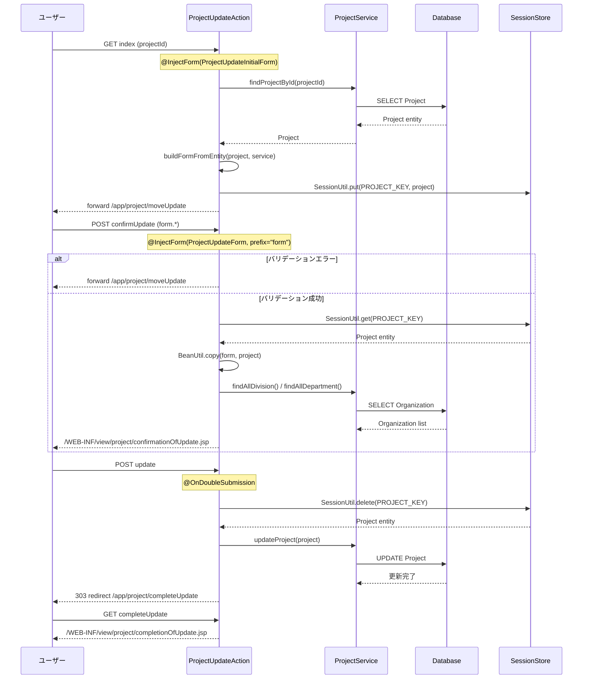

# Code Analysis: ProjectUpdateAction

**Generated**: 2026-03-12 18:38:46
**Target**: プロジェクト更新アクション（入力・確認・更新・完了フロー）
**Modules**: proman-web
**Analysis Duration**: 約3分41秒

---

## Overview

`ProjectUpdateAction` は、プロジェクト情報の更新機能を担うウェブアクションクラスである。プロジェクト詳細画面から更新画面への遷移、入力内容の確認、実際のデータベース更新、更新完了画面の表示という4ステップのフローを制御する。

主な特徴：
- `@InjectForm` によるリクエストパラメータのバリデーションと自動フォームバインド
- `SessionUtil` によるセッションストアへのプロジェクトエンティティ一時保存（確認→更新ステップ間のデータ受け渡し）
- `@OnDoubleSubmission` による二重サブミット防止（サーバサイド制御）
- `BeanUtil` によるフォーム⇔エンティティ間の変換
- `ProjectService` を介した `UniversalDao`（DaoContext）でのデータベースアクセス

---

## Architecture

### Dependency Graph

```mermaid
classDiagram
    class ProjectUpdateAction
    class ProjectUpdateInitialForm {
        <<Form>>
    }
    class ProjectUpdateForm {
        <<Form>>
    }
    class ProjectService
    class Project {
        <<Entity>>
    }
    class Organization {
        <<Entity>>
    }
    class ExecutionContext {
        <<Nablarch>>
    }
    class SessionUtil {
        <<Nablarch>>
    }
    class BeanUtil {
        <<Nablarch>>
    }
    class DaoContext {
        <<Nablarch>>
    }
    class InjectForm {
        <<Nablarch>>
    }
    class OnDoubleSubmission {
        <<Nablarch>>
    }

    ProjectUpdateAction ..> ProjectUpdateInitialForm : validates
    ProjectUpdateAction ..> ProjectUpdateForm : validates
    ProjectUpdateAction ..> ProjectService : delegates to
    ProjectUpdateAction ..> SessionUtil : stores/retrieves
    ProjectUpdateAction ..> BeanUtil : converts
    ProjectUpdateAction ..> ExecutionContext : uses
    ProjectUpdateAction ..> InjectForm : annotated with
    ProjectUpdateAction ..> OnDoubleSubmission : annotated with
    ProjectService ..> DaoContext : queries/persists
    ProjectService ..> Project : queries/persists
    ProjectService ..> Organization : queries
    ProjectUpdateForm ..|> Serializable : implements
    ProjectUpdateInitialForm ..|> Serializable : implements
```



**Note**: This diagram uses Mermaid `classDiagram` syntax to show class names and their relationships. Use `--|>` for inheritance (extends/implements) and `..>` for dependencies (uses/creates).

### Component Summary

| Component | Role | Type | Dependencies |
|-----------|------|------|--------------|
| ProjectUpdateAction | プロジェクト更新フロー制御 | Action | ProjectUpdateInitialForm, ProjectUpdateForm, ProjectService, SessionUtil, BeanUtil, ExecutionContext |
| ProjectUpdateForm | 更新入力値の受け取りとバリデーション | Form | DateRelationUtil |
| ProjectUpdateInitialForm | 詳細→更新遷移時のプロジェクトID受け取り | Form | なし |
| ProjectService | データベースアクセス層 | Service | DaoContext（UniversalDao）, Project, Organization |
| Project | プロジェクトエンティティ | Entity | なし |
| Organization | 組織（事業部・部門）エンティティ | Entity | なし |

---

## Flow

### Processing Flow

`ProjectUpdateAction` は以下の4メソッドで更新フローを実現する：

**① index（更新画面初期表示）**
プロジェクト詳細画面からのリクエストを受け取り（`ProjectUpdateInitialForm` でプロジェクトID取得）、`ProjectService.findProjectById()` でDBから対象プロジェクトを取得する。エンティティをフォームに変換し（`buildFormFromEntity`）、リクエストスコープにセットして更新入力画面へフォワードする。また、後続ステップのためにプロジェクトエンティティをセッションストアに保存する。

**② confirmUpdate（確認画面表示）**
`@InjectForm(prefix = "form")` でバリデーション実行。バリデーションエラー時は `@OnError` で更新入力画面へ戻る。バリデーション通過後はセッションからエンティティを取得し、`BeanUtil.copy()` でフォームの値をエンティティにコピーして確認画面を表示する。

**③ update（更新実行）**
`@OnDoubleSubmission` により二重サブミットを防止。セッションストアからエンティティを取得（同時に削除）し、`ProjectService.updateProject()` でDBを更新する。303リダイレクトで完了画面へ遷移する。

**④ completeUpdate（完了画面表示）**
更新完了画面（JSP）へフォワードして表示する。

その他、`backToEnterUpdate`（確認→入力戻り）と `indexSetPullDown`（プルダウン付き更新画面表示）もサポートしている。

### Sequence Diagram



---

## Components

### ProjectUpdateAction

**ファイル**: [ProjectUpdateAction.java](../../.lw/nab-official/v5/nablarch-system-development-guide/Sample_Project/Source_Code/proman-project/proman-web/src/main/java/com/nablarch/example/proman/web/project/ProjectUpdateAction.java)

**役割**: プロジェクト更新フロー全体のコントローラ。入力→確認→更新→完了の各画面遷移とビジネスロジック呼び出しを担う。

**主要メソッド**:

| メソッド | 行 | 役割 |
|----------|-----|------|
| `index` | L35-43 | 更新画面初期表示（DB取得→セッション保存） |
| `confirmUpdate` | L54-62 | 更新確認画面表示（バリデーション→BeanCopy） |
| `update` | L72-77 | DB更新実行（二重サブミット防止→DELETE session→UPDATE DB→Redirect） |
| `completeUpdate` | L86-88 | 完了画面表示 |
| `backToEnterUpdate` | L97-102 | 確認画面から入力画面へ戻る（セッション→フォーム変換） |
| `buildFormFromEntity` | L111-125 | エンティティをフォームに変換（日付フォーマット・組織ID設定） |
| `indexSetPullDown` | L135-141 | プルダウンデータ付き更新画面表示 |
| `setOrganizationAndDivisionToRequestScope` | L148-158 | 事業部・部門リストをリクエストスコープにセット |

**依存コンポーネント**: `ProjectUpdateInitialForm`、`ProjectUpdateForm`、`ProjectService`、`SessionUtil`、`BeanUtil`、`ExecutionContext`

---

### ProjectUpdateForm

**ファイル**: [ProjectUpdateForm.java](../../.lw/nab-official/v5/nablarch-system-development-guide/Sample_Project/Source_Code/proman-project/proman-web/src/main/java/com/nablarch/example/proman/web/project/ProjectUpdateForm.java)

**役割**: 更新入力画面のフォームクラス。`@Required`・`@Domain` アノテーションでバリデーションルールを定義し、`@AssertTrue` で開始日・終了日の相関バリデーションを行う。

**主要フィールド（バリデーション付き）**:

| フィールド | バリデーション |
|-----------|-------------|
| projectName | @Required, @Domain("projectName") |
| projectStartDate | @Required, @Domain("date") |
| projectEndDate | @Required, @Domain("date") |
| divisionId | @Required, @Domain("organizationId") |
| organizationId | @Required, @Domain("organizationId") |
| pmKanjiName / plKanjiName | @Required, @Domain("userName") |

**相関バリデーション** (L329): `isValidProjectPeriod()` - `@AssertTrue` で開始日が終了日より後にならないことを確認。

---

### ProjectUpdateInitialForm

**ファイル**: [ProjectUpdateInitialForm.java](../../.lw/nab-official/v5/nablarch-system-development-guide/Sample_Project/Source_Code/proman-project/proman-web/src/main/java/com/nablarch/example/proman/web/project/ProjectUpdateInitialForm.java)

**役割**: 詳細画面→更新画面遷移時のプロジェクトID受け取り専用フォーム。

---

### ProjectService

**ファイル**: [ProjectService.java](../../.lw/nab-official/v5/nablarch-system-development-guide/Sample_Project/Source_Code/proman-project/proman-web/src/main/java/com/nablarch/example/proman/web/project/ProjectService.java)

**役割**: データベースアクセスの抽象化層。`DaoContext`（UniversalDaoのインタフェース）経由でCRUD操作を提供。テスタビリティのためコンストラクタインジェクション対応。

**主要メソッド**:

| メソッド | 行 | 役割 |
|----------|-----|------|
| `findProjectById` | L124-126 | プロジェクトID主キー検索 |
| `updateProject` | L89-91 | プロジェクト更新 |
| `findOrganizationById` | L70-73 | 組織ID検索 |
| `findAllDivision` / `findAllDepartment` | L50-61 | 全事業部・全部門一覧取得（SQLファイル使用） |

---

## Nablarch Framework Usage

### SessionUtil

**クラス**: `nablarch.common.web.session.SessionUtil`

**説明**: セッションストアへの保存・取得・削除を行うユーティリティクラス。複数のリクエストをまたいでデータを受け渡す際に使用する。

**使用方法**:
```java
// 保存
SessionUtil.put(context, "project", project);

// 取得（正常遷移では必ず存在する）
Project project = SessionUtil.get(context, "project");

// 取得と同時に削除（更新実行時に使用）
Project project = SessionUtil.delete(context, "project");
```

**重要ポイント**:
- ✅ **フォームをセッションに格納しない**: セッションに格納するのはエンティティ（`Project`）であり、フォームオブジェクトをそのまま格納しない。`BeanUtil` でエンティティに変換してから格納する
- ⚠️ **不正遷移時の例外**: ブラウザの戻るボタン等でセッション変数が存在しない場合、`SessionKeyNotFoundException` が発生する。`@OnError(type = SessionKeyNotFoundException.class)` でリクエスト毎に遷移先を制御できる
- 💡 **更新処理では `delete` を使用**: `update()` メソッドでは `SessionUtil.delete()` を使い、セッションからの取得と削除を一度に行うことでセッションのクリーンアップを確実にしている

**このコードでの使い方**:
- `index()`: `SessionUtil.put(context, PROJECT_KEY, project)` で更新前エンティティを保存（L41）
- `confirmUpdate()`: `SessionUtil.get(context, PROJECT_KEY)` でエンティティ取得、`BeanUtil.copy()` で更新値反映（L56）
- `update()`: `SessionUtil.delete(context, PROJECT_KEY)` で取得と同時に削除、その後DB更新（L73）

**詳細**: [Libraries Session_store](../../.claude/skills/nabledge-6/docs/component/libraries/libraries-session_store.md)

---

### InjectForm / OnError

**クラス**: `nablarch.common.web.interceptor.InjectForm`, `nablarch.fw.web.interceptor.OnError`

**説明**: `@InjectForm` はリクエストパラメータのバリデーションを自動実行し、バリデーション済みフォームオブジェクトをリクエストスコープに格納するインターセプタ。`@OnError` はバリデーション失敗時の遷移先を指定する。

**使用方法**:
```java
@InjectForm(form = ProjectUpdateForm.class, prefix = "form")
@OnError(type = ApplicationException.class, path = "forward:///app/project/moveUpdate")
public HttpResponse confirmUpdate(HttpRequest request, ExecutionContext context) {
    ProjectUpdateForm form = context.getRequestScopedVar("form");
    // バリデーション成功時のみここに到達
}
```

**重要ポイント**:
- ✅ **`prefix` 属性の指定**: フォームパラメータが `form.projectName` のように `form.` プレフィックス付きで送信される場合は `prefix = "form"` を指定する
- ✅ **リクエストスコープからの取得**: バリデーション後は `context.getRequestScopedVar("form")` でフォームオブジェクトを取得する
- ⚠️ **`@OnError` は `@InjectForm` とセットで使う**: バリデーションエラー時の遷移先を明示しないと、デフォルト動作になる

**このコードでの使い方**:
- `index()`: `@InjectForm(form = ProjectUpdateInitialForm.class)` でプロジェクトIDのみバリデーション（L34）
- `confirmUpdate()`: `@InjectForm(form = ProjectUpdateForm.class, prefix = "form")` + `@OnError` で入力バリデーションと エラー時フォワード先を指定（L52-53）

**詳細**: [Handlers InjectForm](../../.claude/skills/nabledge-6/docs/component/handlers/handlers-InjectForm.md)

---

### OnDoubleSubmission

**クラス**: `nablarch.common.web.token.OnDoubleSubmission`

**説明**: 二重サブミット（フォームの二重送信）をサーバサイドで防止するインターセプタ。同一トークンによる二重リクエストを検知してエラー遷移させる。

**使用方法**:
```java
@OnDoubleSubmission
public HttpResponse update(HttpRequest request, ExecutionContext context) {
    // 二重サブミット時はここに到達しない
}
```

**重要ポイント**:
- ✅ **JSとサーバサイドの両方で制御**: JSP側で `useToken="true"` と `allowDoubleSubmission="false"` を設定し、サーバサイドでも `@OnDoubleSubmission` を付与して二重制御する
- ⚠️ **JavaScript無効環境への対応**: JavaScript が無効な場合でもサーバサイドのトークンチェックが働くため、`@OnDoubleSubmission` は必須

**このコードでの使い方**:
- `update()` に付与（L71）。DB更新という副作用のある処理を二重実行から保護している

**詳細**: [Web Application Client_create4](../../.claude/skills/nabledge-6/docs/processing-pattern/web-application/web-application-client_create4.md)

---

### BeanUtil

**クラス**: `nablarch.core.beans.BeanUtil`

**説明**: JavaBeansの間でプロパティ値をコピーするユーティリティ。フォーム→エンティティ変換や逆変換に使用する。

**使用方法**:
```java
// フォームからエンティティへコピー（フォームの値でエンティティを上書き）
BeanUtil.copy(form, project);

// 新規インスタンスを作成しながらコピー
ProjectUpdateForm form = BeanUtil.createAndCopy(ProjectUpdateForm.class, project);
```

**重要ポイント**:
- 💡 **同名プロパティの自動マッピング**: 同名のプロパティが自動的にコピーされる。型変換も一部サポート
- ⚠️ **型の不一致に注意**: `String` と `Integer` など型が異なるプロパティは正しくコピーされない場合がある

**このコードでの使い方**:
- `confirmUpdate()`: `BeanUtil.copy(form, project)` でフォームの更新値をエンティティにコピー（L57）
- `buildFormFromEntity()`: `BeanUtil.createAndCopy(ProjectUpdateForm.class, project)` でエンティティからフォームを生成（L112）
- `backToEnterUpdate()`: 同様にエンティティからフォームを生成して入力画面表示用にセット（L99）

---

## References

### Source Files

- [ProjectUpdateAction.java (.lw/nab-official/v5/nablarch-system-development-guide/en/Sample_Project/Source_Code/proman-project/proman-web/src/main/java/com/nablarch/example/proman/web/project)](../../.lw/nab-official/v5/nablarch-system-development-guide/en/Sample_Project/Source_Code/proman-project/proman-web/src/main/java/com/nablarch/example/proman/web/project/ProjectUpdateAction.java) - ProjectUpdateAction
- [ProjectUpdateAction.java (.lw/nab-official/v5/nablarch-system-development-guide/Sample_Project/Source_Code/proman-project/proman-web/src/main/java/com/nablarch/example/proman/web/project)](../../.lw/nab-official/v5/nablarch-system-development-guide/Sample_Project/Source_Code/proman-project/proman-web/src/main/java/com/nablarch/example/proman/web/project/ProjectUpdateAction.java) - ProjectUpdateAction
- [ProjectUpdateForm.java (.lw/nab-official/v5/nablarch-system-development-guide/en/Sample_Project/Source_Code/proman-project/proman-web/src/main/java/com/nablarch/example/proman/web/project)](../../.lw/nab-official/v5/nablarch-system-development-guide/en/Sample_Project/Source_Code/proman-project/proman-web/src/main/java/com/nablarch/example/proman/web/project/ProjectUpdateForm.java) - ProjectUpdateForm
- [ProjectUpdateForm.java (.lw/nab-official/v5/nablarch-system-development-guide/Sample_Project/Source_Code/proman-project/proman-web/src/main/java/com/nablarch/example/proman/web/project)](../../.lw/nab-official/v5/nablarch-system-development-guide/Sample_Project/Source_Code/proman-project/proman-web/src/main/java/com/nablarch/example/proman/web/project/ProjectUpdateForm.java) - ProjectUpdateForm
- [ProjectUpdateInitialForm.java (.lw/nab-official/v5/nablarch-system-development-guide/en/Sample_Project/Source_Code/proman-project/proman-web/src/main/java/com/nablarch/example/proman/web/project)](../../.lw/nab-official/v5/nablarch-system-development-guide/en/Sample_Project/Source_Code/proman-project/proman-web/src/main/java/com/nablarch/example/proman/web/project/ProjectUpdateInitialForm.java) - ProjectUpdateInitialForm
- [ProjectUpdateInitialForm.java (.lw/nab-official/v5/nablarch-system-development-guide/Sample_Project/Source_Code/proman-project/proman-web/src/main/java/com/nablarch/example/proman/web/project)](../../.lw/nab-official/v5/nablarch-system-development-guide/Sample_Project/Source_Code/proman-project/proman-web/src/main/java/com/nablarch/example/proman/web/project/ProjectUpdateInitialForm.java) - ProjectUpdateInitialForm
- [ProjectService.java (.lw/nab-official/v5/nablarch-system-development-guide/en/Sample_Project/Source_Code/proman-project/proman-web/src/main/java/com/nablarch/example/proman/web/project)](../../.lw/nab-official/v5/nablarch-system-development-guide/en/Sample_Project/Source_Code/proman-project/proman-web/src/main/java/com/nablarch/example/proman/web/project/ProjectService.java) - ProjectService
- [ProjectService.java (.lw/nab-official/v5/nablarch-system-development-guide/Sample_Project/Source_Code/proman-project/proman-web/src/main/java/com/nablarch/example/proman/web/project)](../../.lw/nab-official/v5/nablarch-system-development-guide/Sample_Project/Source_Code/proman-project/proman-web/src/main/java/com/nablarch/example/proman/web/project/ProjectService.java) - ProjectService

### Knowledge Base (Nabledge-6)

- [Web Application Getting Started Project Update](../../.claude/skills/nabledge-6/docs/processing-pattern/web-application/web-application-getting-started-project-update.md)
- [Handlers InjectForm](../../.claude/skills/nabledge-6/docs/component/handlers/handlers-InjectForm.md)
- [Libraries Session_store](../../.claude/skills/nabledge-6/docs/component/libraries/libraries-session_store.md)
- [Web Application Client_create4](../../.claude/skills/nabledge-6/docs/processing-pattern/web-application/web-application-client_create4.md)
- [Web Application Client_create2](../../.claude/skills/nabledge-6/docs/processing-pattern/web-application/web-application-client_create2.md)
- [Web Application Client_create3](../../.claude/skills/nabledge-6/docs/processing-pattern/web-application/web-application-client_create3.md)

### Official Documentation


- [Base64.Encoder](https://nablarch.github.io/docs/LATEST/javadoc/java/util/Base64.Encoder.html)
- [Base64](https://nablarch.github.io/docs/LATEST/javadoc/java/util/Base64.html)
- [BeanUtil](https://nablarch.github.io/docs/LATEST/javadoc/nablarch/core/beans/BeanUtil.html)
- [Client Create2](https://nablarch.github.io/docs/LATEST/doc/application_framework/application_framework/web/getting_started/client_create/client_create2.html)
- [Client Create3](https://nablarch.github.io/docs/LATEST/doc/application_framework/application_framework/web/getting_started/client_create/client_create3.html)
- [Client Create4](https://nablarch.github.io/docs/LATEST/doc/application_framework/application_framework/web/getting_started/client_create/client_create4.html)
- [DbStore](https://nablarch.github.io/docs/LATEST/javadoc/nablarch/common/web/session/store/DbStore.html)
- [ExecutionContext](https://nablarch.github.io/docs/LATEST/javadoc/nablarch/fw/ExecutionContext.html)
- [HiddenStore](https://nablarch.github.io/docs/LATEST/javadoc/nablarch/common/web/session/store/HiddenStore.html)
- [HttpSessionStore](https://nablarch.github.io/docs/LATEST/javadoc/nablarch/common/web/session/store/HttpSessionStore.html)
- [Index](https://nablarch.github.io/docs/LATEST/doc/application_framework/application_framework/web/getting_started/project_update/index.html)
- [InjectForm](https://nablarch.github.io/docs/LATEST/doc/application_framework/application_framework/handlers/web_interceptor/InjectForm.html)
- [InjectForm](https://nablarch.github.io/docs/LATEST/javadoc/nablarch/common/web/interceptor/InjectForm.html)
- [JavaSerializeEncryptStateEncoder](https://nablarch.github.io/docs/LATEST/javadoc/nablarch/common/web/session/encoder/JavaSerializeEncryptStateEncoder.html)
- [JavaSerializeStateEncoder](https://nablarch.github.io/docs/LATEST/javadoc/nablarch/common/web/session/encoder/JavaSerializeStateEncoder.html)
- [JaxbStateEncoder](https://nablarch.github.io/docs/LATEST/javadoc/nablarch/common/web/session/encoder/JaxbStateEncoder.html)
- [KeyGenerator](https://nablarch.github.io/docs/LATEST/javadoc/javax/crypto/KeyGenerator.html)
- [NoDataException](https://nablarch.github.io/docs/LATEST/javadoc/nablarch/common/dao/NoDataException.html)
- [OnDoubleSubmission](https://nablarch.github.io/docs/LATEST/javadoc/nablarch/common/web/token/OnDoubleSubmission.html)
- [OnError](https://nablarch.github.io/docs/LATEST/javadoc/nablarch/fw/web/interceptor/OnError.html)
- [Required](https://nablarch.github.io/docs/LATEST/javadoc/nablarch/core/validation/ee/Required.html)
- [ResourceLocator](https://nablarch.github.io/docs/LATEST/javadoc/nablarch/fw/web/ResourceLocator.html)
- [SecureRandom](https://nablarch.github.io/docs/LATEST/javadoc/java/security/SecureRandom.html)
- [Session Store](https://nablarch.github.io/docs/LATEST/doc/application_framework/application_framework/libraries/session_store.html)
- [SessionKeyNotFoundException](https://nablarch.github.io/docs/LATEST/javadoc/nablarch/common/web/session/SessionKeyNotFoundException.html)
- [SessionManager](https://nablarch.github.io/docs/LATEST/javadoc/nablarch/common/web/session/SessionManager.html)
- [SessionStore](https://nablarch.github.io/docs/LATEST/javadoc/nablarch/common/web/session/SessionStore.html)
- [SessionUtil](https://nablarch.github.io/docs/LATEST/javadoc/nablarch/common/web/session/SessionUtil.html)
- [UUID](https://nablarch.github.io/docs/LATEST/javadoc/java/util/UUID.html)
- [UniversalDao](https://nablarch.github.io/docs/LATEST/javadoc/nablarch/common/dao/UniversalDao.html)
- [UserSessionSchema](https://nablarch.github.io/docs/LATEST/javadoc/nablarch/common/web/session/store/UserSessionSchema.html)

---

**Note**: This documentation was generated by the code-analysis workflow of the nabledge-6 skill.
