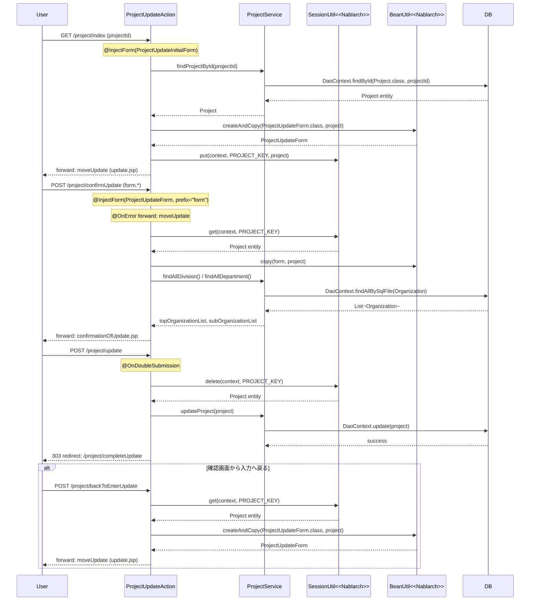

# Code Analysis: ProjectUpdateAction

**Generated**: 2026-03-12 18:44:28
**Target**: プロジェクト更新処理（入力→確認→更新→完了）
**Modules**: proman-web
**Analysis Duration**: 約5分15秒

---

## Overview

`ProjectUpdateAction` はプロジェクト管理システムの更新機能を担うWebアクションクラスです。プロジェクト詳細画面からの遷移を受け取り、入力画面表示 → バリデーション → 確認画面表示 → DB更新 → 完了画面表示という4ステップのフローを実現します。

セッションストアを利用して処理中のプロジェクトエンティティを保持し、`@InjectForm` によるBean Validationとサーバサイドの二重サブミット防止（`@OnDoubleSubmission`）を組み合わせることで、安全な更新処理を実現しています。

**主要コンポーネント**:
- `ProjectUpdateAction`: メインのアクションクラス（5メソッド）
- `ProjectUpdateInitialForm`: 詳細画面からの初期遷移フォーム
- `ProjectUpdateForm`: 更新入力フォーム（Bean Validationアノテーション付き）
- `ProjectService`: DB操作を担うサービスクラス（UniversalDao経由）

---

## Architecture

### Dependency Graph

```mermaid
classDiagram
    class ProjectUpdateAction
    class ProjectUpdateForm {
        <<Form>>
    }
    class ProjectUpdateInitialForm {
        <<Form>>
    }
    class ProjectService
    class Project {
        <<Entity>>
    }
    class Organization {
        <<Entity>>
    }
    class DaoContext {
        <<Nablarch>>
    }
    class SessionUtil {
        <<Nablarch>>
    }
    class BeanUtil {
        <<Nablarch>>
    }
    class ExecutionContext {
        <<Nablarch>>
    }
    class InjectForm {
        <<Nablarch>>
    }
    class OnDoubleSubmission {
        <<Nablarch>>
    }

    ProjectUpdateAction ..> ProjectUpdateInitialForm : validates (index)
    ProjectUpdateAction ..> ProjectUpdateForm : validates (confirmUpdate)
    ProjectUpdateAction ..> ProjectService : delegates to
    ProjectUpdateAction ..> SessionUtil : stores/retrieves
    ProjectUpdateAction ..> BeanUtil : copies
    ProjectUpdateAction ..> ExecutionContext : sets scope vars
    ProjectUpdateAction ..> InjectForm : uses
    ProjectUpdateAction ..> OnDoubleSubmission : uses
    ProjectService ..> DaoContext : queries/persists
    ProjectService ..> Project : returns
    ProjectService ..> Organization : returns
```



**Note**: This diagram uses Mermaid `classDiagram` syntax to show class names and their relationships. Use `--|>` for inheritance (extends/implements) and `..>` for dependencies (uses/creates).

### Component Summary

| Component | Role | Type | Dependencies |
|-----------|------|------|--------------|
| ProjectUpdateAction | プロジェクト更新処理の全フロー管理 | Action | ProjectUpdateInitialForm, ProjectUpdateForm, ProjectService, SessionUtil, BeanUtil, ExecutionContext |
| ProjectUpdateInitialForm | 詳細画面からのプロジェクトID受け渡し | Form | なし |
| ProjectUpdateForm | 更新画面の入力値受け取りとバリデーション | Form | DateRelationUtil |
| ProjectService | DBアクセスの抽象化（プロジェクト/組織操作） | Service | DaoContext（UniversalDao） |
| Project | プロジェクトデータ保持 | Entity | なし |
| Organization | 組織（事業部/部門）データ保持 | Entity | なし |

---

## Flow

### Processing Flow

プロジェクト更新処理は以下の5ステップで構成されます：

1. **初期表示（`index`）**: 詳細画面からプロジェクトIDを受け取り（`@InjectForm(form=ProjectUpdateInitialForm.class)`）、DBからプロジェクトを取得してフォームに変換。セッションストアにエンティティを保存し、更新入力画面へフォワード。

2. **確認画面表示（`confirmUpdate`）**: 更新フォームのバリデーション（`@InjectForm(form=ProjectUpdateForm.class, prefix="form")`）。バリデーションエラー時は `@OnError` で入力画面へフォワード。エラーなしの場合は `BeanUtil.copy` でフォームをエンティティへマージし確認画面へ。

3. **更新実行（`update`）**: `@OnDoubleSubmission` で二重送信を防止。セッションからエンティティを取得・削除し `ProjectService.updateProject()` でDB更新。303リダイレクトで完了画面へ。

4. **完了画面（`completeUpdate`）**: 完了JSPへフォワード（処理なし）。

5. **入力画面へ戻る（`backToEnterUpdate`）**: セッションからエンティティを取得し、`BeanUtil.createAndCopy` でフォームへ変換して入力画面へ戻る。

### Sequence Diagram



---

## Components

### ProjectUpdateAction

**ファイル**: [ProjectUpdateAction.java](../../.lw/nab-official/v5/nablarch-system-development-guide/Sample_Project/Source_Code/proman-project/proman-web/src/main/java/com/nablarch/example/proman/web/project/ProjectUpdateAction.java)

**役割**: プロジェクト更新の全フローを管理するWebアクションクラス。入力→確認→更新→完了の各画面遷移とビジネスロジックを担う。

**キーメソッド**:

- `index(HttpRequest, ExecutionContext)` [L35-43]: 初期表示。`@InjectForm(ProjectUpdateInitialForm.class)` でプロジェクトIDをバリデーション後、DBからプロジェクトを取得してフォームに変換。セッションにエンティティを保存し入力画面へフォワード。
- `confirmUpdate(HttpRequest, ExecutionContext)` [L54-62]: 確認画面表示。`@InjectForm(ProjectUpdateForm.class, prefix="form")` でバリデーション。`BeanUtil.copy(form, project)` でエンティティを更新し確認画面へ。
- `update(HttpRequest, ExecutionContext)` [L72-77]: DB更新実行。`@OnDoubleSubmission` で二重送信防止。`SessionUtil.delete` でエンティティ取得後にセッションから削除し、`service.updateProject(project)` で更新。303リダイレクト。
- `backToEnterUpdate(HttpRequest, ExecutionContext)` [L97-102]: 確認画面から入力画面へ戻る。セッションのエンティティを `BeanUtil.createAndCopy` でフォームに変換して入力画面へ。
- `buildFormFromEntity(Project, ProjectService)` [L111-125]: プロジェクトエンティティからフォームを生成するプライベートメソッド。日付フォーマット変換と組織情報の取得も行う。

**依存**: `ProjectUpdateInitialForm`, `ProjectUpdateForm`, `ProjectService`, `SessionUtil`, `BeanUtil`, `DateUtil`, `ExecutionContext`

---

### ProjectUpdateForm

**ファイル**: [ProjectUpdateForm.java](../../.lw/nab-official/v5/nablarch-system-development-guide/Sample_Project/Source_Code/proman-project/proman-web/src/main/java/com/nablarch/example/proman/web/project/ProjectUpdateForm.java)

**役割**: 更新入力フォーム。Bean Validationアノテーション（`@Required`, `@Domain`）により入力値の妥当性チェックを宣言的に定義する。

**キーメソッド**:

- `isValidProjectPeriod()` [L329-331]: `@AssertTrue` によるクロスフィールドバリデーション。`DateRelationUtil.isValid()` で開始日〜終了日の前後関係を検証。

**依存**: `DateRelationUtil`

---

### ProjectUpdateInitialForm

**ファイル**: [ProjectUpdateInitialForm.java](../../.lw/nab-official/v5/nablarch-system-development-guide/Sample_Project/Source_Code/proman-project/proman-web/src/main/java/com/nablarch/example/proman/web/project/ProjectUpdateInitialForm.java)

**役割**: 詳細画面から更新画面への遷移時にプロジェクトIDを受け取る専用フォーム。

**依存**: なし

---

### ProjectService

**ファイル**: [ProjectService.java](../../.lw/nab-official/v5/nablarch-system-development-guide/Sample_Project/Source_Code/proman-project/proman-web/src/main/java/com/nablarch/example/proman/web/project/ProjectService.java)

**役割**: プロジェクト・組織のDB操作を抽象化するサービスクラス。`DaoContext`（UniversalDao）を利用してCRUD操作を提供。

**キーメソッド**:

- `findProjectById(Integer)` [L124-126]: プロジェクトIDで1件取得。`DaoContext.findById(Project.class, projectId)` を利用。
- `updateProject(Project)` [L89-91]: プロジェクトを更新。`DaoContext.update(project)` を利用。
- `findAllDivision()` / `findAllDepartment()` [L50-61]: 全事業部/部門を取得。SQLファイル経由で `findAllBySqlFile` を利用。
- `findOrganizationById(Integer)` [L70-73]: 組織IDで組織を1件取得。

**依存**: `DaoContext`（UniversalDao）, `Project`, `Organization`

---

## Nablarch Framework Usage

### SessionUtil

**クラス**: `nablarch.common.web.session.SessionUtil`

**説明**: サーバサイドセッションストアへのデータの格納・取得・削除を行うユーティリティ。フォームではなくエンティティを格納することで、次画面でのデータ再利用と安全な更新処理を実現する。

**使用方法**:
```java
// 格納
SessionUtil.put(context, "key", entity);

// 取得
Project project = SessionUtil.get(context, "key");

// 取得して削除（更新処理後など）
Project project = SessionUtil.delete(context, "key");
```

**重要ポイント**:
- ✅ **フォームではなくエンティティを格納する**: セッションストアにはフォームではなくBeanを格納すること。フォームをセッションに格納すると、複数リクエスト間でバリデーション状態が混在する恐れがある。
- ✅ **更新処理後は `delete` で取得**: `update` メソッドでは `SessionUtil.delete` を使うことで取得と同時にセッションをクリーンアップし、メモリリークを防ぐ。
- ⚠️ **セッションキーの一意性**: `PROJECT_KEY` 定数で管理し、他のアクションと競合しないようにする。

**このコードでの使い方**:
- `index()` で `SessionUtil.put(context, PROJECT_KEY, project)` にてDBから取得したエンティティを保存（L41）
- `confirmUpdate()` で `SessionUtil.get(context, PROJECT_KEY)` にてエンティティを取り出してフォームの変更を反映（L56）
- `update()` で `SessionUtil.delete(context, PROJECT_KEY)` にて取得後セッションから削除（L73）

**詳細**: [Web Application Getting Started Project Update](../../.claude/skills/nabledge-6/docs/processing-pattern/web-application/web-application-getting-started-project-update.md)

---

### @InjectForm / @OnError

**クラス**: `nablarch.common.web.interceptor.InjectForm` / `nablarch.fw.web.interceptor.OnError`

**説明**: `@InjectForm` はアクションメソッドへのリクエストパラメータバインドとBean Validationを自動実行するインターセプタ。`@OnError` はバリデーション例外発生時のフォワード先を指定する。

**使用方法**:
```java
@InjectForm(form = ProjectUpdateForm.class, prefix = "form")
@OnError(type = ApplicationException.class, path = "forward:///app/project/moveUpdate")
public HttpResponse confirmUpdate(HttpRequest request, ExecutionContext context) {
    ProjectUpdateForm form = context.getRequestScopedVar("form");
    // ...
}
```

**重要ポイント**:
- ✅ **`prefix` でリクエストパラメータのプレフィックスを指定**: JSP側で `form.projectName` のようにプレフィックスを付けている場合は `prefix = "form"` を指定する。
- ⚠️ **`@OnError` の `path` は `forward:///` 形式**: ルートパスからのフォワードを指定する際は `///` を使用する（Nablarchのリソースロケータ仕様）。
- 💡 **バリデーション後のフォームは `getRequestScopedVar("form")` で取得**: `@InjectForm` が自動でリクエストスコープに `"form"` キーで格納する。

**このコードでの使い方**:
- `index()` で `@InjectForm(form = ProjectUpdateInitialForm.class)` によりプロジェクトIDを検証（L34）
- `confirmUpdate()` で `@InjectForm(form = ProjectUpdateForm.class, prefix = "form")` と `@OnError` でバリデーションエラー時は入力画面へ（L52-53）

**詳細**: [Web Application Getting Started Project Update](../../.claude/skills/nabledge-6/docs/processing-pattern/web-application/web-application-getting-started-project-update.md)

---

### @OnDoubleSubmission

**クラス**: `nablarch.common.web.token.OnDoubleSubmission`

**説明**: アクションメソッドへの二重サブミット（二重送信）をサーバサイドで防止するインターセプタ。JSP側の `allowDoubleSubmission="false"` と組み合わせてクライアント・サーバ両方で制御する。

**使用方法**:
```java
@OnDoubleSubmission
public HttpResponse update(HttpRequest request, ExecutionContext context) {
    // 二重送信時はエラーページへ遷移（メソッド内は実行されない）
    Project project = SessionUtil.delete(context, PROJECT_KEY);
    service.updateProject(project);
    return new HttpResponse(303, "redirect:///app/project/completeUpdate");
}
```

**重要ポイント**:
- ✅ **DB変更を伴うメソッドには必ず付与する**: 登録・更新・削除処理には常に `@OnDoubleSubmission` を付与し、ネットワーク遅延等による誤った二重実行を防ぐ。
- 💡 **JSP側との連携**: `<n:form useToken="true">` と `allowDoubleSubmission="false"` を組み合わせることでJS無効環境でもサーバサイドで制御される。
- ⚠️ **二重送信時のデフォルト遷移先設定が必要**: アプリケーション設定でデフォルトのエラーページを設定しておく必要がある。

**このコードでの使い方**:
- `update()` メソッドに `@OnDoubleSubmission` を付与（L71）。確認画面の「確定」ボタン押下後の二重送信を防止。

**詳細**: [Web Application Client_create4](../../.claude/skills/nabledge-6/docs/processing-pattern/web-application/web-application-client_create4.md)

---

### BeanUtil

**クラス**: `nablarch.core.beans.BeanUtil`

**説明**: JavaBeansのプロパティ名が一致するフィールド間でデータをコピーするユーティリティ。フォーム→エンティティ、エンティティ→フォームの変換に使用する。

**使用方法**:
```java
// エンティティからフォームを生成（新規インスタンス）
ProjectUpdateForm form = BeanUtil.createAndCopy(ProjectUpdateForm.class, project);

// フォームの内容をエンティティへコピー（既存インスタンスに上書き）
BeanUtil.copy(form, project);
```

**重要ポイント**:
- ✅ **`createAndCopy` と `copy` を使い分ける**: 新規インスタンスを生成しながらコピーする場合は `createAndCopy`、既存インスタンスへ上書きコピーする場合は `copy` を使用。
- ⚠️ **プロパティ名の一致が必要**: コピー元とコピー先でプロパティ名が異なる場合はコピーされない。型変換も自動では行われない（一部例外あり）。
- 💡 **フォームとエンティティの分離**: フォームをセッションに格納せず、BeanUtilでエンティティへ変換してから格納することでセッションの肥大化を防ぐ。

**このコードでの使い方**:
- `buildFormFromEntity()` で `BeanUtil.createAndCopy(ProjectUpdateForm.class, project)` によりエンティティからフォームを生成（L112）
- `confirmUpdate()` で `BeanUtil.copy(form, project)` によりフォームの変更値をセッション内エンティティへマージ（L57）
- `backToEnterUpdate()` で `BeanUtil.createAndCopy(ProjectUpdateForm.class, project)` により戻り時のフォームを再生成（L99）

**詳細**: [Web Application Client_create3](../../.claude/skills/nabledge-6/docs/processing-pattern/web-application/web-application-client_create3.md)

---

### DaoContext (UniversalDao)

**クラス**: `nablarch.common.dao.DaoContext`

**説明**: データベースのCRUD操作を提供するDAOインターフェース。`ProjectService` 内で `DaoFactory.create()` によりインスタンスを取得し、プロジェクト・組織の検索・更新を実行する。

**使用方法**:
```java
// IDによる1件取得
Project project = universalDao.findById(Project.class, projectId);

// エンティティ更新
universalDao.update(project);

// SQLファイルによる全件取得
List<Organization> list = universalDao.findAllBySqlFile(Organization.class, "FIND_ALL_DIVISION");
```

**重要ポイント**:
- ✅ **更新にはエンティティをそのまま渡す**: `update(entity)` にはエンティティを渡す。プロパティ名とDB列名のマッピングはエンティティのアノテーションで定義される。
- 💡 **SQLファイル分離**: SQLは外部SQLファイルに記述し、`findAllBySqlFile` でSQLID（文字列）を指定して呼び出す。SQLとJavaコードが分離されメンテナンス性が高い。
- ⚠️ **`findById` で対象なし時は `NoDataException`**: 1件検索で対象データが存在しない場合は `NoDataException` がスローされる。

**このコードでの使い方**:
- `ProjectService.findProjectById()` で `universalDao.findById(Project.class, projectId)` によりプロジェクトを1件取得（L125）
- `ProjectService.updateProject()` で `universalDao.update(project)` によりプロジェクトを更新（L90）
- `ProjectService.findAllDivision()` / `findAllDepartment()` で `findAllBySqlFile` により組織一覧を取得（L51, L60）

**詳細**: [Web Application Getting Started Project Update](../../.claude/skills/nabledge-6/docs/processing-pattern/web-application/web-application-getting-started-project-update.md)

---

## References

### Source Files

- [ProjectUpdateAction.java (.lw/nab-official/v5/nablarch-system-development-guide/en/Sample_Project/Source_Code/proman-project/proman-web/src/main/java/com/nablarch/example/proman/web/project)](../../.lw/nab-official/v5/nablarch-system-development-guide/en/Sample_Project/Source_Code/proman-project/proman-web/src/main/java/com/nablarch/example/proman/web/project/ProjectUpdateAction.java) - ProjectUpdateAction
- [ProjectUpdateAction.java (.lw/nab-official/v5/nablarch-system-development-guide/Sample_Project/Source_Code/proman-project/proman-web/src/main/java/com/nablarch/example/proman/web/project)](../../.lw/nab-official/v5/nablarch-system-development-guide/Sample_Project/Source_Code/proman-project/proman-web/src/main/java/com/nablarch/example/proman/web/project/ProjectUpdateAction.java) - ProjectUpdateAction
- [ProjectUpdateForm.java (.lw/nab-official/v5/nablarch-system-development-guide/en/Sample_Project/Source_Code/proman-project/proman-web/src/main/java/com/nablarch/example/proman/web/project)](../../.lw/nab-official/v5/nablarch-system-development-guide/en/Sample_Project/Source_Code/proman-project/proman-web/src/main/java/com/nablarch/example/proman/web/project/ProjectUpdateForm.java) - ProjectUpdateForm
- [ProjectUpdateForm.java (.lw/nab-official/v5/nablarch-system-development-guide/Sample_Project/Source_Code/proman-project/proman-web/src/main/java/com/nablarch/example/proman/web/project)](../../.lw/nab-official/v5/nablarch-system-development-guide/Sample_Project/Source_Code/proman-project/proman-web/src/main/java/com/nablarch/example/proman/web/project/ProjectUpdateForm.java) - ProjectUpdateForm
- [ProjectUpdateInitialForm.java (.lw/nab-official/v5/nablarch-system-development-guide/en/Sample_Project/Source_Code/proman-project/proman-web/src/main/java/com/nablarch/example/proman/web/project)](../../.lw/nab-official/v5/nablarch-system-development-guide/en/Sample_Project/Source_Code/proman-project/proman-web/src/main/java/com/nablarch/example/proman/web/project/ProjectUpdateInitialForm.java) - ProjectUpdateInitialForm
- [ProjectUpdateInitialForm.java (.lw/nab-official/v5/nablarch-system-development-guide/Sample_Project/Source_Code/proman-project/proman-web/src/main/java/com/nablarch/example/proman/web/project)](../../.lw/nab-official/v5/nablarch-system-development-guide/Sample_Project/Source_Code/proman-project/proman-web/src/main/java/com/nablarch/example/proman/web/project/ProjectUpdateInitialForm.java) - ProjectUpdateInitialForm
- [ProjectService.java (.lw/nab-official/v5/nablarch-system-development-guide/en/Sample_Project/Source_Code/proman-project/proman-web/src/main/java/com/nablarch/example/proman/web/project)](../../.lw/nab-official/v5/nablarch-system-development-guide/en/Sample_Project/Source_Code/proman-project/proman-web/src/main/java/com/nablarch/example/proman/web/project/ProjectService.java) - ProjectService
- [ProjectService.java (.lw/nab-official/v5/nablarch-system-development-guide/Sample_Project/Source_Code/proman-project/proman-web/src/main/java/com/nablarch/example/proman/web/project)](../../.lw/nab-official/v5/nablarch-system-development-guide/Sample_Project/Source_Code/proman-project/proman-web/src/main/java/com/nablarch/example/proman/web/project/ProjectService.java) - ProjectService

### Knowledge Base (Nabledge-6)

- [Web Application Getting Started Project Update](../../.claude/skills/nabledge-6/docs/processing-pattern/web-application/web-application-getting-started-project-update.md)
- [Web Application Client_create4](../../.claude/skills/nabledge-6/docs/processing-pattern/web-application/web-application-client_create4.md)
- [Web Application Client_create3](../../.claude/skills/nabledge-6/docs/processing-pattern/web-application/web-application-client_create3.md)

### Official Documentation

- [BeanUtil](https://nablarch.github.io/docs/LATEST/javadoc/nablarch/core/beans/BeanUtil.html)
- [Client Create3](https://nablarch.github.io/docs/LATEST/doc/application_framework/application_framework/web/getting_started/client_create/client_create3.html)
- [Client Create4](https://nablarch.github.io/docs/LATEST/doc/application_framework/application_framework/web/getting_started/client_create/client_create4.html)
- [Index](https://nablarch.github.io/docs/LATEST/doc/application_framework/application_framework/web/getting_started/project_update/index.html)
- [NoDataException](https://nablarch.github.io/docs/LATEST/javadoc/nablarch/common/dao/NoDataException.html)
- [OnDoubleSubmission](https://nablarch.github.io/docs/LATEST/javadoc/nablarch/common/web/token/OnDoubleSubmission.html)
- [ResourceLocator](https://nablarch.github.io/docs/LATEST/javadoc/nablarch/fw/web/ResourceLocator.html)
- [UniversalDao](https://nablarch.github.io/docs/LATEST/javadoc/nablarch/common/dao/UniversalDao.html)

---

**Note**: This documentation was generated by the code-analysis workflow of the nabledge-6 skill.
