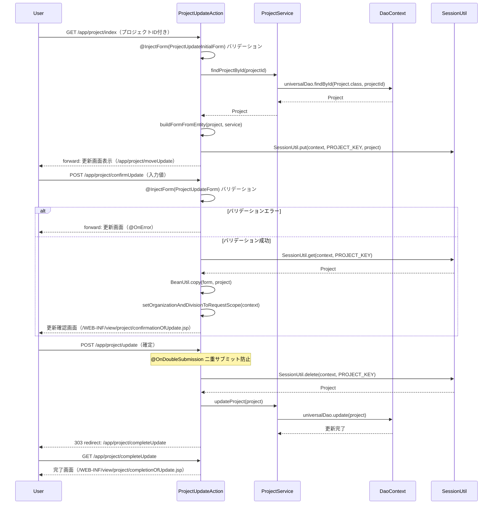

# Code Analysis: ProjectUpdateAction

**Generated**: 2026-03-12 18:52:17
**Target**: プロジェクト更新機能（入力・確認・更新・完了）
**Modules**: proman-web, proman-common
**Analysis Duration**: 約4分29秒

---

## Overview

`ProjectUpdateAction` はプロジェクト更新機能を担う Webアクションクラスである。プロジェクト詳細画面からの遷移を受け付け、「更新画面表示 → 更新内容確認 → 更新実行 → 完了画面」の4ステップで構成される。

入力フォームのバリデーションには Nablarch の `@InjectForm` アノテーションを使用し、確認画面→更新実行間のデータ受け渡しには `SessionUtil` によるセッションストアを利用する。二重サブミット対策として `@OnDoubleSubmission` をDBへの更新メソッドに付与している。データベース操作は `ProjectService` に委譲し、内部で `DaoContext`（UniversalDao）を用いて実行する。

---

## Architecture

### Dependency Graph

```mermaid
classDiagram
    class ProjectUpdateAction
    class ProjectUpdateInitialForm {
        <<Form>>
    }
    class ProjectUpdateForm {
        <<Form>>
    }
    class ProjectService
    class Project {
        <<Entity>>
    }
    class Organization {
        <<Entity>>
    }
    class ExecutionContext {
        <<Nablarch>>
    }
    class SessionUtil {
        <<Nablarch>>
    }
    class BeanUtil {
        <<Nablarch>>
    }
    class DaoContext {
        <<Nablarch>>
    }

    ProjectUpdateAction ..> ProjectUpdateInitialForm : validates
    ProjectUpdateAction ..> ProjectUpdateForm : validates
    ProjectUpdateAction ..> ProjectService : delegates to
    ProjectUpdateAction ..> SessionUtil : uses
    ProjectUpdateAction ..> BeanUtil : copies
    ProjectUpdateAction ..> ExecutionContext : uses
    ProjectService ..> Project : persists
    ProjectService ..> Organization : queries
    ProjectService ..> DaoContext : delegates to
```



**Note**: This diagram uses Mermaid `classDiagram` syntax to show class names and their relationships. Use `--|>` for inheritance (extends/implements) and `..>` for dependencies (uses/creates).

### Component Summary

| Component | Role | Type | Dependencies |
|-----------|------|------|--------------|
| ProjectUpdateAction | プロジェクト更新フローを制御するアクション | Action | ProjectUpdateInitialForm, ProjectUpdateForm, ProjectService, SessionUtil, BeanUtil, ExecutionContext |
| ProjectUpdateInitialForm | 詳細画面→更新画面遷移時のプロジェクトID受け取りフォーム | Form | なし |
| ProjectUpdateForm | 更新画面の入力値受け取り・バリデーションフォーム | Form | DateRelationUtil |
| ProjectService | プロジェクトおよび組織のDB操作サービス | Service | DaoContext, Project, Organization |

---

## Flow

### Processing Flow

プロジェクト更新は以下の5ステップで処理される。

1. **更新画面表示（index）**: 詳細画面から渡されたプロジェクトIDをフォームで受け取り、`ProjectService.findProjectById()` でDB検索。結果をセッションストアと画面フォームに設定して更新画面へフォワードする。

2. **プルダウン設定（indexSetPullDown）**: 更新画面表示時に事業部・部門の選択肢をDBから取得してリクエストスコープに設定する。詳細画面や確認画面から遷移する際に呼び出される。

3. **更新内容確認（confirmUpdate）**: 入力フォームのバリデーション後、フォームの値をセッションのエンティティにコピーし、確認画面を表示する。バリデーションエラー時は更新画面へ戻る。

4. **更新実行（update）**: セッションから取得したエンティティを使い `ProjectService.updateProject()` でDB更新。`@OnDoubleSubmission` により二重サブミットを防止し、完了後は303リダイレクトで完了画面へ遷移する。

5. **完了画面表示（completeUpdate）**: 更新完了画面のJSPへフォワードするのみ。

また、**入力に戻る（backToEnterUpdate）** メソッドはセッションのエンティティをフォームに変換して更新画面へ戻る。

### Sequence Diagram



---

## Components

### ProjectUpdateAction

**ファイル**: [ProjectUpdateAction.java](../../.lw/nab-official/v5/nablarch-system-development-guide/Sample_Project/Source_Code/proman-project/proman-web/src/main/java/com/nablarch/example/proman/web/project/ProjectUpdateAction.java)

**役割**: プロジェクト更新フロー全体を制御するWebアクションクラス。画面遷移とデータの受け渡しを管理する。

**主要メソッド**:
- `index(HttpRequest, ExecutionContext)` [L35-43]: 詳細画面からの遷移を受けDB検索結果をセッションに保存し更新画面を表示
- `confirmUpdate(HttpRequest, ExecutionContext)` [L52-62]: バリデーション後フォームの値をエンティティにコピーし確認画面を表示
- `update(HttpRequest, ExecutionContext)` [L71-77]: セッションのエンティティでDB更新を実行し完了画面へリダイレクト
- `backToEnterUpdate(HttpRequest, ExecutionContext)` [L97-102]: 確認画面から入力画面に戻る
- `buildFormFromEntity(Project, ProjectService)` [L111-125]: エンティティからフォームを生成（日付フォーマット変換・組織情報設定）

**依存コンポーネント**: ProjectUpdateInitialForm, ProjectUpdateForm, ProjectService, SessionUtil, BeanUtil, ExecutionContext, DateUtil

---

### ProjectUpdateInitialForm

**ファイル**: [ProjectUpdateInitialForm.java](../../.lw/nab-official/v5/nablarch-system-development-guide/Sample_Project/Source_Code/proman-project/proman-web/src/main/java/com/nablarch/example/proman/web/project/ProjectUpdateInitialForm.java)

**役割**: 詳細画面からプロジェクト更新画面へ遷移する際にプロジェクトIDを受け取るシンプルなフォーム。

**主要フィールド**:
- `projectId` [L14]: `@Required` + `@Domain("projectId")` でバリデーション

**依存コンポーネント**: なし

---

### ProjectUpdateForm

**ファイル**: [ProjectUpdateForm.java](../../.lw/nab-official/v5/nablarch-system-development-guide/Sample_Project/Source_Code/proman-project/proman-web/src/main/java/com/nablarch/example/proman/web/project/ProjectUpdateForm.java)

**役割**: 更新画面の入力値を受け取るフォーム。プロジェクト名・種別・期間・組織・担当者などの更新項目を保持し、Bean Validationでバリデーションする。

**主要フィールド**:
- `projectName`, `projectType`, `projectClass` [L26-41]: `@Required` + `@Domain` でバリデーション
- `projectStartDate`, `projectEndDate` [L46-55]: 日付項目、`@Required` + `@Domain("date")`
- `divisionId`, `organizationId` [L60-69]: 組織ID、`@Required` + `@Domain("organizationId")`

**バリデーション**:
- `isValidProjectPeriod()` [L329-331]: `@AssertTrue` による期間整合性チェック（`DateRelationUtil.isValid` 呼び出し）

**依存コンポーネント**: DateRelationUtil

---

### ProjectService

**ファイル**: [ProjectService.java](../../.lw/nab-official/v5/nablarch-system-development-guide/Sample_Project/Source_Code/proman-project/proman-web/src/main/java/com/nablarch/example/proman/web/project/ProjectService.java)

**役割**: プロジェクト・組織のDB操作を集約したサービスクラス。`DaoContext`（UniversalDao）を内部に保持し、CRUD操作を提供する。

**主要メソッド**:
- `findProjectById(Integer)` [L124-126]: プロジェクトIDで1件検索
- `updateProject(Project)` [L89-91]: プロジェクトエンティティをDB更新
- `findOrganizationById(Integer)` [L70-73]: 組織IDで組織を1件検索
- `findAllDivision()` [L50-52]: 全事業部リストを取得
- `findAllDepartment()` [L59-61]: 全部門リストを取得

**依存コンポーネント**: DaoContext, Project, Organization, DaoFactory

---

## Nablarch Framework Usage

### SessionUtil

**クラス**: `nablarch.common.web.session.SessionUtil`

**説明**: セッションストアへのオブジェクトの格納・取得・削除を行うユーティリティクラス。確認画面→更新実行間のデータ受け渡しに使用する。

**使用方法**:
```java
// 格納
SessionUtil.put(context, "key", object);
// 取得
Project project = SessionUtil.get(context, "key");
// 削除しながら取得
Project project = SessionUtil.delete(context, "key");
```

**重要ポイント**:
- ✅ **更新実行時は `delete` で取得**: `SessionUtil.delete` を使うことでセッションからデータを削除しながら取得できる（Line 73）。処理後のセッション残留を防ぐ。
- ⚠️ **フォームを直接格納しない**: セッションストアにはエンティティを格納し、フォームオブジェクトを直接格納すべきではない。`BeanUtil.copy` でエンティティに詰め替えてから格納する（Line 57）。
- 💡 **楽観的ロックの基点**: 編集開始時点のエンティティをセッションに保存することで、確認画面表示中に他ユーザーが更新した場合の競合を検知できる。

**このコードでの使い方**:
- `index()` でDBから取得したエンティティを `PROJECT_KEY` でセッションに保存（Line 41）
- `confirmUpdate()` でセッションのエンティティを取得しフォーム値をコピー（Line 56-57）
- `update()` でセッションのエンティティを削除取得しDB更新に使用（Line 73）

**詳細**: [Web Application Getting Started Project Update](../../.claude/skills/nabledge-6/docs/processing-pattern/web-application/web-application-getting-started-project-update.md)

---

### @InjectForm

**クラス**: `nablarch.common.web.interceptor.InjectForm`

**説明**: アクションメソッドのインターセプタとして動作し、HTTPリクエストパラメータを指定フォームクラスにバインドしバリデーションを実行する。バリデーション通過後にフォームオブジェクトをリクエストスコープに格納する。

**使用方法**:
```java
@InjectForm(form = ProjectUpdateForm.class, prefix = "form")
@OnError(type = ApplicationException.class, path = "forward:///app/project/moveUpdate")
public HttpResponse confirmUpdate(HttpRequest request, ExecutionContext context) {
    ProjectUpdateForm form = context.getRequestScopedVar("form");
    // ...
}
```

**重要ポイント**:
- ✅ **`prefix` 指定**: 確認画面からの送信時はHTMLフォームに `prefix="form"` が付くため、`@InjectForm` にも `prefix = "form"` を指定する（Line 52）。
- ⚠️ **`@OnError` と組み合わせる**: バリデーションエラー時の遷移先を `@OnError` で明示する。指定がないとデフォルトのエラー処理が動作する（Line 53）。
- 💡 **初期表示では prefix 不要**: `index()` の `@InjectForm` には `prefix` を指定していない（Line 34）。URLパスパラメータ経由の場合はプレフィックスなしが一般的。

**このコードでの使い方**:
- `index()`: `@InjectForm(form = ProjectUpdateInitialForm.class)` でプロジェクトIDを受け取る（Line 34）
- `confirmUpdate()`: `@InjectForm(form = ProjectUpdateForm.class, prefix = "form")` で更新フォームを受け取る（Line 52）

**詳細**: [Web Application Getting Started Project Update](../../.claude/skills/nabledge-6/docs/processing-pattern/web-application/web-application-getting-started-project-update.md)

---

### @OnDoubleSubmission

**クラス**: `nablarch.common.web.token.OnDoubleSubmission`

**説明**: アクションメソッドに付与することで二重サブミットをサーバサイドで防止するインターセプタ。JSPの `useToken="true"` と組み合わせて使用する。

**使用方法**:
```java
@OnDoubleSubmission
public HttpResponse update(HttpRequest request, ExecutionContext context) {
    // DB更新処理
}
```

**重要ポイント**:
- ✅ **DB変更メソッドに必ず付与**: ブラウザの戻るボタンや二重クリックによる多重更新を防ぐため、DB更新・削除・登録メソッドに付与する（Line 71）。
- ⚠️ **JSP側でも `useToken="true"` が必要**: サーバサイドのトークン検証のみでは不十分。JSPの `<n:form useToken="true">` と `allowDoubleSubmission="false"` も必要。
- 💡 **リダイレクトと組み合わせる**: 更新後は 303 リダイレクトで完了画面へ遷移することで、ブラウザ更新ボタンによる再実行も防止できる（Line 76）。

**このコードでの使い方**:
- `update()` メソッドに `@OnDoubleSubmission` を付与（Line 71）
- 更新完了後に `new HttpResponse(303, "redirect:///app/project/completeUpdate")` でリダイレクト（Line 76）

**詳細**: [Web Application Client Create4](../../.claude/skills/nabledge-6/docs/processing-pattern/web-application/web-application-client_create4.md)

---

### BeanUtil

**クラス**: `nablarch.core.beans.BeanUtil`

**説明**: JavaBeans間でプロパティ値をコピーするユーティリティ。フォームとエンティティの変換に使用する。

**使用方法**:
```java
// フォームからエンティティにコピー
BeanUtil.copy(form, project);
// 新規インスタンス生成してコピー
ProjectUpdateForm form = BeanUtil.createAndCopy(ProjectUpdateForm.class, project);
```

**重要ポイント**:
- ✅ **同名プロパティが自動コピー**: フォームとエンティティで同名のプロパティが存在すれば自動的にコピーされる。
- ⚠️ **型変換に注意**: 日付型など型が異なる場合は手動変換が必要。このコードでは `DateUtil.formatDate()` で文字列変換してからセットしている（Line 114-117）。
- 💡 **createAndCopy で新規生成**: エンティティからフォームを作る際は `BeanUtil.createAndCopy()` でインスタンス生成とコピーを一度に行える（Line 112）。

**このコードでの使い方**:
- `confirmUpdate()` で `BeanUtil.copy(form, project)` によりフォームの値をセッションのエンティティに反映（Line 57）
- `buildFormFromEntity()` で `BeanUtil.createAndCopy(ProjectUpdateForm.class, project)` によりエンティティからフォームを生成（Line 112）
- `backToEnterUpdate()` でも同様にエンティティからフォームを生成（Line 99）

**詳細**: [Web Application Client Create3](../../.claude/skills/nabledge-6/docs/processing-pattern/web-application/web-application-client_create3.md)

---

## References

### Source Files

- [ProjectUpdateAction.java (.lw/nab-official/v5/nablarch-system-development-guide/en/Sample_Project/Source_Code/proman-project/proman-web/src/main/java/com/nablarch/example/proman/web/project)](../../.lw/nab-official/v5/nablarch-system-development-guide/en/Sample_Project/Source_Code/proman-project/proman-web/src/main/java/com/nablarch/example/proman/web/project/ProjectUpdateAction.java) - ProjectUpdateAction
- [ProjectUpdateAction.java (.lw/nab-official/v5/nablarch-system-development-guide/Sample_Project/Source_Code/proman-project/proman-web/src/main/java/com/nablarch/example/proman/web/project)](../../.lw/nab-official/v5/nablarch-system-development-guide/Sample_Project/Source_Code/proman-project/proman-web/src/main/java/com/nablarch/example/proman/web/project/ProjectUpdateAction.java) - ProjectUpdateAction
- [ProjectUpdateForm.java (.lw/nab-official/v5/nablarch-system-development-guide/en/Sample_Project/Source_Code/proman-project/proman-web/src/main/java/com/nablarch/example/proman/web/project)](../../.lw/nab-official/v5/nablarch-system-development-guide/en/Sample_Project/Source_Code/proman-project/proman-web/src/main/java/com/nablarch/example/proman/web/project/ProjectUpdateForm.java) - ProjectUpdateForm
- [ProjectUpdateForm.java (.lw/nab-official/v5/nablarch-system-development-guide/Sample_Project/Source_Code/proman-project/proman-web/src/main/java/com/nablarch/example/proman/web/project)](../../.lw/nab-official/v5/nablarch-system-development-guide/Sample_Project/Source_Code/proman-project/proman-web/src/main/java/com/nablarch/example/proman/web/project/ProjectUpdateForm.java) - ProjectUpdateForm
- [ProjectUpdateInitialForm.java (.lw/nab-official/v5/nablarch-system-development-guide/en/Sample_Project/Source_Code/proman-project/proman-web/src/main/java/com/nablarch/example/proman/web/project)](../../.lw/nab-official/v5/nablarch-system-development-guide/en/Sample_Project/Source_Code/proman-project/proman-web/src/main/java/com/nablarch/example/proman/web/project/ProjectUpdateInitialForm.java) - ProjectUpdateInitialForm
- [ProjectUpdateInitialForm.java (.lw/nab-official/v5/nablarch-system-development-guide/Sample_Project/Source_Code/proman-project/proman-web/src/main/java/com/nablarch/example/proman/web/project)](../../.lw/nab-official/v5/nablarch-system-development-guide/Sample_Project/Source_Code/proman-project/proman-web/src/main/java/com/nablarch/example/proman/web/project/ProjectUpdateInitialForm.java) - ProjectUpdateInitialForm
- [ProjectService.java (.lw/nab-official/v5/nablarch-system-development-guide/en/Sample_Project/Source_Code/proman-project/proman-web/src/main/java/com/nablarch/example/proman/web/project)](../../.lw/nab-official/v5/nablarch-system-development-guide/en/Sample_Project/Source_Code/proman-project/proman-web/src/main/java/com/nablarch/example/proman/web/project/ProjectService.java) - ProjectService
- [ProjectService.java (.lw/nab-official/v5/nablarch-system-development-guide/Sample_Project/Source_Code/proman-project/proman-web/src/main/java/com/nablarch/example/proman/web/project)](../../.lw/nab-official/v5/nablarch-system-development-guide/Sample_Project/Source_Code/proman-project/proman-web/src/main/java/com/nablarch/example/proman/web/project/ProjectService.java) - ProjectService

### Knowledge Base (Nabledge-6)

- [Web Application Getting Started Project Update](../../.claude/skills/nabledge-6/docs/processing-pattern/web-application/web-application-getting-started-project-update.md)
- [Web Application Client_create4](../../.claude/skills/nabledge-6/docs/processing-pattern/web-application/web-application-client_create4.md)
- [Web Application Client_create3](../../.claude/skills/nabledge-6/docs/processing-pattern/web-application/web-application-client_create3.md)

### Official Documentation


- [BeanUtil](https://nablarch.github.io/docs/LATEST/javadoc/nablarch/core/beans/BeanUtil.html)
- [Client Create3](https://nablarch.github.io/docs/LATEST/doc/application_framework/application_framework/web/getting_started/client_create/client_create3.html)
- [Client Create4](https://nablarch.github.io/docs/LATEST/doc/application_framework/application_framework/web/getting_started/client_create/client_create4.html)
- [Index](https://nablarch.github.io/docs/LATEST/doc/application_framework/application_framework/web/getting_started/project_update/index.html)
- [NoDataException](https://nablarch.github.io/docs/LATEST/javadoc/nablarch/common/dao/NoDataException.html)
- [OnDoubleSubmission](https://nablarch.github.io/docs/LATEST/javadoc/nablarch/common/web/token/OnDoubleSubmission.html)
- [ResourceLocator](https://nablarch.github.io/docs/LATEST/javadoc/nablarch/fw/web/ResourceLocator.html)
- [UniversalDao](https://nablarch.github.io/docs/LATEST/javadoc/nablarch/common/dao/UniversalDao.html)

---

**Note**: This documentation was generated by the code-analysis workflow of the nabledge-6 skill.
