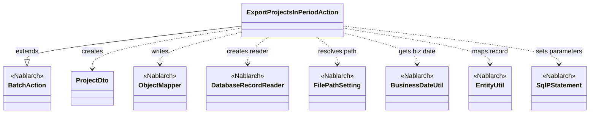
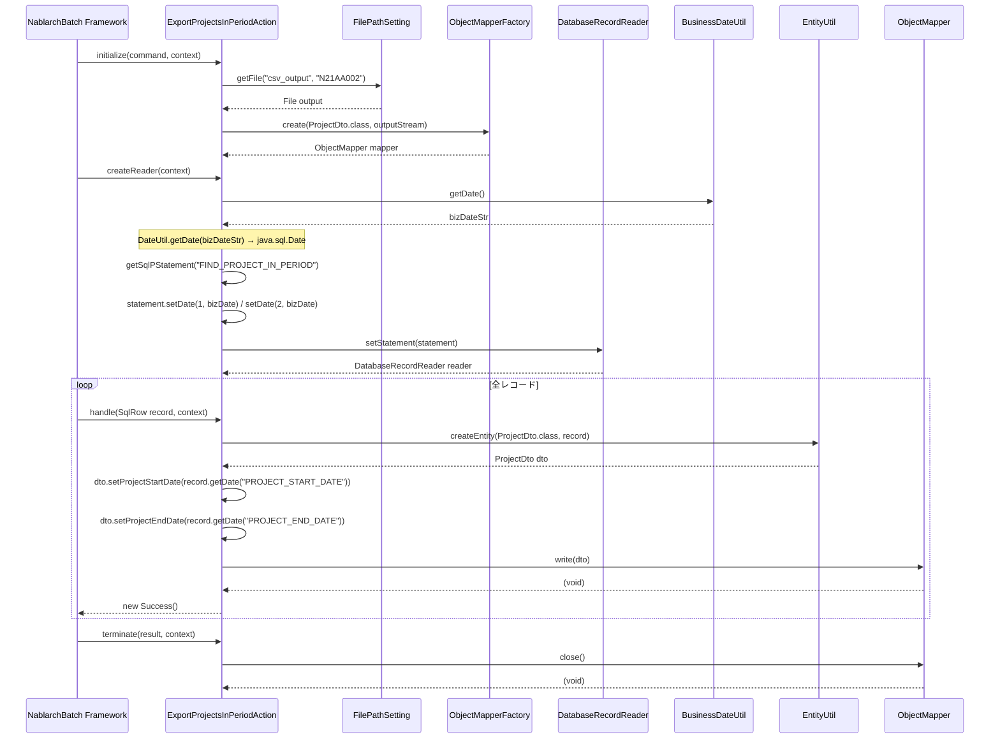

# Code Analysis: ExportProjectsInPeriodAction

**Generated**: 2026-03-13 15:37:54
**Target**: 期間内プロジェクト一覧CSVファイル出力バッチアクション
**Modules**: proman-batch
**Analysis Duration**: approx. 3m 10s

---

## Overview

`ExportProjectsInPeriodAction` は、業務日付を基準に期間内のプロジェクト一覧をCSVファイルに出力する都度起動バッチアクションクラス。`BatchAction<SqlRow>` を継承し、Nablarchバッチの標準フレームワーク（初期化→データ読み込み→レコード処理→終了処理）に従って動作する。

データベースから `FIND_PROJECT_IN_PERIOD` SQLで期間内プロジェクトを検索し、`ObjectMapper` を使用して `@Csv`/`@CsvFormat` アノテーションが付与された `ProjectDto` をCSVファイルへ書き出す。出力ファイルパスは `FilePathSetting` で管理された `csv_output` ディレクトリの `N21AA002` ファイルに固定される。

---

## Architecture

### Dependency Graph



**Note**: This diagram uses Mermaid `classDiagram` syntax to show class names and their relationships. Use `--|>` for inheritance (extends/implements) and `..>` for dependencies (uses/creates).

### Component Summary

| Component | Role | Type | Dependencies |
|-----------|------|------|--------------|
| ExportProjectsInPeriodAction | 期間内プロジェクトCSV出力バッチ | Action | BatchAction, ObjectMapper, DatabaseRecordReader, FilePathSetting, BusinessDateUtil, EntityUtil |
| ProjectDto | CSVバインディング用DTO（プロジェクト情報） | Bean | ObjectMapperFactory, DateUtil |
| FIND_PROJECT_IN_PERIOD | 期間内プロジェクト検索SQL | SQL | - |

---

## Flow

### Processing Flow

1. **初期化** (`initialize`): `FilePathSetting` からCSV出力先ファイルを取得し、`ObjectMapperFactory` で `ProjectDto` 用の `ObjectMapper` を生成する
2. **データリーダ生成** (`createReader`): `BusinessDateUtil.getDate()` で業務日付を取得し、`FIND_PROJECT_IN_PERIOD` SQLの2つのバインドパラメータ（開始日≦業務日付、終了日≧業務日付）に設定。`DatabaseRecordReader` をデータリーダとして返す
3. **レコード処理** (`handle`): `DatabaseRecordReader` から渡された `SqlRow` を `EntityUtil.createEntity()` で `ProjectDto` にマッピング。日付型の変換が必要な `projectStartDate`/`projectEndDate` は個別セッターで設定後、`mapper.write(dto)` でCSV行を出力する
4. **終了処理** (`terminate`): `mapper.close()` でバッファをフラッシュしリソースを解放する

### Sequence Diagram



---

## Components

### ExportProjectsInPeriodAction

**ファイル**: [ExportProjectsInPeriodAction.java](../../.lw/nab-official/v5/nablarch-system-development-guide/Sample_Project/Source_Code/proman-project/proman-batch/src/main/java/com/nablarch/example/proman/batch/project/ExportProjectsInPeriodAction.java)

**役割**: 期間内プロジェクトをDBから読み込み、CSVファイルに一括出力するバッチアクション

**主要メソッド**:
- `initialize(CommandLine, ExecutionContext)` (L44-54): CSV出力用 `ObjectMapper` を初期化。`FilePathSetting` からファイルパスを取得し `FileOutputStream` を開く
- `createReader(ExecutionContext)` (L57-65): 業務日付を検索条件に設定した `DatabaseRecordReader` を返す。`BusinessDateUtil.getDate()` + `DateUtil.getDate()` で `java.sql.Date` に変換
- `handle(SqlRow, ExecutionContext)` (L68-75): `EntityUtil.createEntity()` でレコードをDTOにマッピングし `mapper.write()` でCSV行を出力。日付型は個別setter呼び出しで変換
- `terminate(Result, ExecutionContext)` (L78-80): `mapper.close()` でリソース解放

**依存関係**: `BatchAction` (継承), `ObjectMapper`, `DatabaseRecordReader`, `FilePathSetting`, `BusinessDateUtil`, `EntityUtil`, `SqlPStatement`

**実装ポイント**:
- `EntityUtil.createEntity()` はSQL列名とDTOプロパティ名が一致する場合のみ自動マッピングされる。`projectStartDate`/`projectEndDate` はDTO型が `String` だが SQLから返る型が `java.sql.Date` のため個別setter呼び出しが必要（L70-72のコメント参照）
- `mapper` はインスタンス変数であり、`initialize()` で生成し `terminate()` で解放するライフサイクル管理

---

### ProjectDto

**ファイル**: [ProjectDto.java](../../.lw/nab-official/v5/nablarch-system-development-guide/Sample_Project/Source_Code/proman-project/proman-batch/src/main/java/com/nablarch/example/proman/batch/project/ProjectDto.java)

**役割**: CSV出力のためのバインディング用Beanクラス。`@Csv`/`@CsvFormat` アノテーションでCSV形式を定義

**主要定義**:
- `@Csv` (L15-19): CSV列順序・プロパティ名・ヘッダを宣言的に定義（13カラム）
- `@CsvFormat` (L20-21): カンマ区切り・UTF-8・CRLF・全カラムクォート・空文字null変換を指定
- `setProjectStartDate(Date)` / `setProjectEndDate(Date)` (L138-156): `DateUtil.formatDate()` で `Date` → `"yyyy/MM/dd"` 文字列に変換するsetterオーバーロード

**依存関係**: `ObjectMapperFactory` (データバインド), `DateUtil` (日付フォーマット)

---

### FIND_PROJECT_IN_PERIOD (SQL)

**ファイル**: [ExportProjectsInPeriodAction.sql](../../.lw/nab-official/v5/nablarch-system-development-guide/Sample_Project/Source_Code/proman-project/proman-batch/src/main/resources/com/nablarch/example/proman/batch/project/ExportProjectsInPeriodAction.sql)

**役割**: 業務日付が期間内（`project_start_date <= ? AND project_end_date >= ?`）のプロジェクトを取得

**検索条件**: バインドパラメータ1: 業務日付（開始日以降）、バインドパラメータ2: 業務日付（終了日以前）

**ソート**: `project_start_date`, `project_end_date`, `project_name` の昇順

---

## Nablarch Framework Usage

### BatchAction

**クラス**: `nablarch.fw.action.BatchAction`

**説明**: Nablarchバッチの基底クラス。テンプレートメソッドパターンで `initialize`/`createReader`/`handle`/`terminate` のライフサイクルを提供する

**使用方法**:
```java
public class SampleAction extends BatchAction<SqlRow> {
    @Override
    protected void initialize(CommandLine command, ExecutionContext context) { /* 初期化 */ }

    @Override
    public DataReader<SqlRow> createReader(ExecutionContext context) { /* リーダ生成 */ }

    @Override
    public Result handle(SqlRow record, ExecutionContext context) { /* レコード処理 */ }

    @Override
    protected void terminate(Result result, ExecutionContext context) { /* 終了処理 */ }
}
```

**重要ポイント**:
- ✅ **`handle()` は1レコードごと呼ばれる**: `DataReader` がレコードを返す限りフレームワークがループ処理する
- ✅ **終了処理は `terminate()` で**: ファイルクローズ等のリソース解放は必ずここで実施する
- 💡 **型パラメータ = `DataReader` の型**: `BatchAction<SqlRow>` は `DatabaseRecordReader` が返す `SqlRow` を受け取る

**このコードでの使い方**:
- `initialize()`: `ObjectMapper` 生成（ファイルオープン含む）
- `createReader()`: `DatabaseRecordReader` 返却（検索条件設定込み）
- `handle()`: DBレコード→DTO変換→CSV1行出力
- `terminate()`: `mapper.close()` でCSVファイルをフラッシュ・クローズ

**詳細**: [Nablarch Batch Getting Started](../../.claude/skills/nabledge-5/docs/processing-pattern/nablarch-batch/nablarch-batch-getting-started-nablarch-batch.md)

---

### ObjectMapper / ObjectMapperFactory

**クラス**: `nablarch.common.databind.ObjectMapper`, `nablarch.common.databind.ObjectMapperFactory`

**説明**: CSV・TSV・固定長データをJava Beansまたはマップとして読み書きする機能を提供する。フォーマット設定はアノテーション（`@Csv`/`@CsvFormat`）またはプログラム的設定（`DataBindConfig`）で指定する

**使用方法**:
```java
// Java Beans書き込み（アノテーション設定）
try (ObjectMapper<ProjectDto> mapper = ObjectMapperFactory.create(ProjectDto.class, outputStream)) {
    for (ProjectDto dto : dtoList) {
        mapper.write(dto);
    }
}

// または: try-with-resources を使わない場合は明示的 close() が必須
ObjectMapper<ProjectDto> mapper = ObjectMapperFactory.create(ProjectDto.class, outputStream);
mapper.write(dto);
mapper.close(); // ← 必須
```

**重要ポイント**:
- ✅ **必ず `close()` を呼ぶ**: バッファのフラッシュとリソース解放のために必須。このコードでは `terminate()` で実施
- ⚠️ **型変換の制限**: `ObjectMapperFactory.create()` はBean型に基づくが、型不一致プロパティは手動setterが必要（`ProjectDto` の日付フィールド参照）
- 💡 **アノテーション駆動**: `@Csv(properties, headers, type)` と `@CsvFormat` でCSV形式を宣言的に定義できる
- ⚠️ **インスタンスはスレッドセーフでない**: バッチアクションのインスタンス変数に保持する場合は同時実行に注意

**このコードでの使い方**:
- `initialize()` L50: `ObjectMapperFactory.create(ProjectDto.class, outputStream)` でマッパー生成
- `handle()` L73: `mapper.write(dto)` で1レコードをCSV1行に出力
- `terminate()` L79: `mapper.close()` でフラッシュ・リソース解放

**詳細**: [Libraries Data Bind](../../.claude/skills/nabledge-5/docs/component/libraries/libraries-data_bind.md)

---

### DatabaseRecordReader

**クラス**: `nablarch.fw.reader.DatabaseRecordReader`

**説明**: データベースのSQLクエリ結果を1行ずつ `SqlRow` として返すデータリーダ。`BatchAction` の `createReader()` で生成して使用する

**使用方法**:
```java
DatabaseRecordReader reader = new DatabaseRecordReader();
SqlPStatement statement = getSqlPStatement("SQL_ID");
statement.setDate(1, bizDate);
reader.setStatement(statement);
return reader;
```

**重要ポイント**:
- ✅ **`setStatement()` でSQLを設定**: `SqlPStatement` にバインドパラメータを設定してからリーダに渡す
- 💡 **フレームワークが自動反復**: `handle()` の呼び出しはフレームワークが管理し、全レコード処理が完了したら終了する
- 🎯 **DB to FILE パターンの中核**: DBからCSV/ファイルへのバッチ出力の標準パターン

**このコードでの使い方**:
- `createReader()` L58-64: `FIND_PROJECT_IN_PERIOD` SQLに業務日付を2箇所バインドしたリーダを返す

**詳細**: [Nablarch Batch Architecture](../../.claude/skills/nabledge-5/docs/processing-pattern/nablarch-batch/nablarch-batch-architecture.md)

---

### FilePathSetting

**クラス**: `nablarch.core.util.FilePathSetting`

**説明**: 論理ファイルパス名（例: `csv_output`）を物理パスに変換する設定クラス。コンポーネント設定ファイルでディレクトリマッピングを定義する

**使用方法**:
```java
FilePathSetting filePathSetting = FilePathSetting.getInstance();
File output = filePathSetting.getFile("csv_output", "N21AA002");
```

**重要ポイント**:
- 💡 **ハードコードを排除**: 物理パスをコードから分離し、環境ごとに設定で切り替え可能
- 🎯 **シングルトン**: `getInstance()` でアプリケーション全体で共有されるインスタンスを取得

**このコードでの使い方**:
- `initialize()` L45-47: `csv_output` ディレクトリの `N21AA002` ファイルオブジェクトを取得

---

### BusinessDateUtil / DateUtil

**クラス**: `nablarch.core.date.BusinessDateUtil`, `nablarch.core.util.DateUtil`

**説明**: `BusinessDateUtil.getDate()` は業務日付（文字列形式 `yyyyMMdd`）を返す。`DateUtil.getDate()` で `java.util.Date` に変換し、`java.sql.Date` にキャストして使用する

**使用方法**:
```java
Date bizDate = new Date(DateUtil.getDate(BusinessDateUtil.getDate()).getTime());
statement.setDate(1, bizDate);
```

**重要ポイント**:
- ✅ **業務日付はシステム日付と異なる**: テスト・月次処理等で任意の業務日付を設定できるため、`new java.util.Date()` ではなく必ず `BusinessDateUtil.getDate()` を使う
- ⚠️ **型変換が必要**: `BusinessDateUtil.getDate()` は文字列を返すため、`DateUtil.getDate()` → `java.sql.Date` への変換が必要

**このコードでの使い方**:
- `createReader()` L60: 業務日付をSQLの2つのバインドパラメータ（開始日・終了日）に設定

---

## References

### Source Files

- [ExportProjectsInPeriodAction.java (.lw/nab-official/v5/nablarch-system-development-guide/en/Sample_Project/Source_Code/proman-project/proman-batch/src/main/java/com/nablarch/example/proman/batch/project)](../../.lw/nab-official/v5/nablarch-system-development-guide/en/Sample_Project/Source_Code/proman-project/proman-batch/src/main/java/com/nablarch/example/proman/batch/project/ExportProjectsInPeriodAction.java) - ExportProjectsInPeriodAction
- [ExportProjectsInPeriodAction.java (.lw/nab-official/v5/nablarch-system-development-guide/Sample_Project/Source_Code/proman-project/proman-batch/src/main/java/com/nablarch/example/proman/batch/project)](../../.lw/nab-official/v5/nablarch-system-development-guide/Sample_Project/Source_Code/proman-project/proman-batch/src/main/java/com/nablarch/example/proman/batch/project/ExportProjectsInPeriodAction.java) - ExportProjectsInPeriodAction
- [ExportProjectsInPeriodAction.java (.lw/nab-official/v6/nablarch-system-development-guide/en/Sample_Project/Source_Code/proman-project/proman-batch/src/main/java/com/nablarch/example/proman/batch/project)](../../.lw/nab-official/v6/nablarch-system-development-guide/en/Sample_Project/Source_Code/proman-project/proman-batch/src/main/java/com/nablarch/example/proman/batch/project/ExportProjectsInPeriodAction.java) - ExportProjectsInPeriodAction
- [ExportProjectsInPeriodAction.java (.lw/nab-official/v6/nablarch-system-development-guide/Sample_Project/Source_Code/proman-project/proman-batch/src/main/java/com/nablarch/example/proman/batch/project)](../../.lw/nab-official/v6/nablarch-system-development-guide/Sample_Project/Source_Code/proman-project/proman-batch/src/main/java/com/nablarch/example/proman/batch/project/ExportProjectsInPeriodAction.java) - ExportProjectsInPeriodAction
- [ProjectDto.java (.lw/nab-official/v5/nablarch-system-development-guide/en/Sample_Project/Source_Code/proman-project/proman-batch/src/main/java/com/nablarch/example/proman/batch/project)](../../.lw/nab-official/v5/nablarch-system-development-guide/en/Sample_Project/Source_Code/proman-project/proman-batch/src/main/java/com/nablarch/example/proman/batch/project/ProjectDto.java) - ProjectDto
- [ProjectDto.java (.lw/nab-official/v5/nablarch-system-development-guide/Sample_Project/Source_Code/proman-project/proman-batch/src/main/java/com/nablarch/example/proman/batch/project)](../../.lw/nab-official/v5/nablarch-system-development-guide/Sample_Project/Source_Code/proman-project/proman-batch/src/main/java/com/nablarch/example/proman/batch/project/ProjectDto.java) - ProjectDto
- [ProjectDto.java (.lw/nab-official/v6/nablarch-system-development-guide/en/Sample_Project/Source_Code/proman-project/proman-batch/src/main/java/com/nablarch/example/proman/batch/project)](../../.lw/nab-official/v6/nablarch-system-development-guide/en/Sample_Project/Source_Code/proman-project/proman-batch/src/main/java/com/nablarch/example/proman/batch/project/ProjectDto.java) - ProjectDto
- [ProjectDto.java (.lw/nab-official/v6/nablarch-system-development-guide/Sample_Project/Source_Code/proman-project/proman-batch/src/main/java/com/nablarch/example/proman/batch/project)](../../.lw/nab-official/v6/nablarch-system-development-guide/Sample_Project/Source_Code/proman-project/proman-batch/src/main/java/com/nablarch/example/proman/batch/project/ProjectDto.java) - ProjectDto

### Knowledge Base (Nabledge-5)

- [Nablarch Batch Getting Started Nablarch Batch](../../.claude/skills/nabledge-5/docs/processing-pattern/nablarch-batch/nablarch-batch-getting-started-nablarch-batch.md)
- [Nablarch Batch Architecture](../../.claude/skills/nabledge-5/docs/processing-pattern/nablarch-batch/nablarch-batch-architecture.md)
- [Libraries Data_bind](../../.claude/skills/nabledge-5/docs/component/libraries/libraries-data_bind.md)

### Official Documentation


- [Architecture](https://nablarch.github.io/docs/LATEST/doc/application_framework/application_framework/batch/nablarch_batch/architecture.html)
- [AsyncMessageSendAction](https://nablarch.github.io/docs/LATEST/javadoc/nablarch/fw/messaging/action/AsyncMessageSendAction.html)
- [BatchAction](https://nablarch.github.io/docs/LATEST/javadoc/nablarch/fw/action/BatchAction.html)
- [BeanUtil](https://nablarch.github.io/docs/LATEST/javadoc/nablarch/core/beans/BeanUtil.html)
- [CsvDataBindConfig](https://nablarch.github.io/docs/LATEST/javadoc/nablarch/common/databind/csv/CsvDataBindConfig.html)
- [CsvFormat](https://nablarch.github.io/docs/LATEST/javadoc/nablarch/common/databind/csv/CsvFormat.html)
- [Csv](https://nablarch.github.io/docs/LATEST/javadoc/nablarch/common/databind/csv/Csv.html)
- [Data Bind](https://nablarch.github.io/docs/LATEST/doc/application_framework/application_framework/libraries/data_io/data_bind.html)
- [DataBindConfig](https://nablarch.github.io/docs/LATEST/javadoc/nablarch/common/databind/DataBindConfig.html)
- [DataReader](https://nablarch.github.io/docs/LATEST/javadoc/nablarch/fw/DataReader.html)
- [DatabaseRecordReader](https://nablarch.github.io/docs/LATEST/javadoc/nablarch/fw/reader/DatabaseRecordReader.html)
- [DispatchHandler](https://nablarch.github.io/docs/LATEST/javadoc/nablarch/fw/handler/DispatchHandler.html)
- [Field](https://nablarch.github.io/docs/LATEST/javadoc/nablarch/common/databind/fixedlength/Field.html)
- [FileBatchAction](https://nablarch.github.io/docs/LATEST/javadoc/nablarch/fw/action/FileBatchAction.html)
- [FileDataReader](https://nablarch.github.io/docs/LATEST/javadoc/nablarch/fw/reader/FileDataReader.html)
- [FileResponse](https://nablarch.github.io/docs/LATEST/javadoc/nablarch/common/web/download/FileResponse.html)
- [FixedLengthDataBindConfigBuilder](https://nablarch.github.io/docs/LATEST/javadoc/nablarch/common/databind/fixedlength/FixedLengthDataBindConfigBuilder.html)
- [FixedLengthDataBindConfig](https://nablarch.github.io/docs/LATEST/javadoc/nablarch/common/databind/fixedlength/FixedLengthDataBindConfig.html)
- [FixedLength](https://nablarch.github.io/docs/LATEST/javadoc/nablarch/common/databind/fixedlength/FixedLength.html)
- [Index](https://nablarch.github.io/docs/LATEST/doc/application_framework/application_framework/batch/nablarch_batch/getting_started/nablarch_batch/index.html)
- [LineNumber](https://nablarch.github.io/docs/LATEST/javadoc/nablarch/common/databind/LineNumber.html)
- [MultiLayout](https://nablarch.github.io/docs/LATEST/javadoc/nablarch/common/databind/fixedlength/MultiLayout.html)
- [NoInputDataBatchAction](https://nablarch.github.io/docs/LATEST/javadoc/nablarch/fw/action/NoInputDataBatchAction.html)
- [ObjectMapperFactory](https://nablarch.github.io/docs/LATEST/javadoc/nablarch/common/databind/ObjectMapperFactory.html)
- [ObjectMapper](https://nablarch.github.io/docs/LATEST/javadoc/nablarch/common/databind/ObjectMapper.html)
- [PartInfo](https://nablarch.github.io/docs/LATEST/javadoc/nablarch/fw/web/upload/PartInfo.html)
- [ProcessStopHandler.ProcessStop](https://nablarch.github.io/docs/LATEST/javadoc/nablarch/fw/handler/ProcessStopHandler.ProcessStop.html)
- [RecordIdentifier](https://nablarch.github.io/docs/LATEST/javadoc/nablarch/common/databind/fixedlength/MultiLayoutConfig/RecordIdentifier.html)
- [Result](https://nablarch.github.io/docs/LATEST/javadoc/nablarch/fw/Result.html)
- [ResumeDataReader](https://nablarch.github.io/docs/LATEST/javadoc/nablarch/fw/reader/ResumeDataReader.html)
- [StatusCodeConvertHandler](https://nablarch.github.io/docs/LATEST/javadoc/nablarch/fw/handler/StatusCodeConvertHandler.html)
- [UniversalDao](https://nablarch.github.io/docs/LATEST/javadoc/nablarch/common/dao/UniversalDao.html)
- [ValidatableFileDataReader](https://nablarch.github.io/docs/LATEST/javadoc/nablarch/fw/reader/ValidatableFileDataReader.html)

---

**Note**: This documentation was generated by the code-analysis workflow of the nabledge-5 skill.
