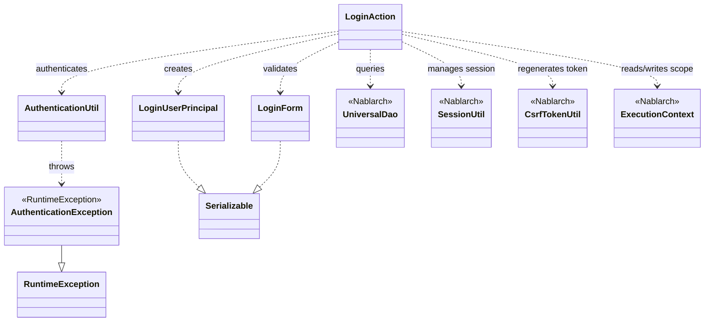
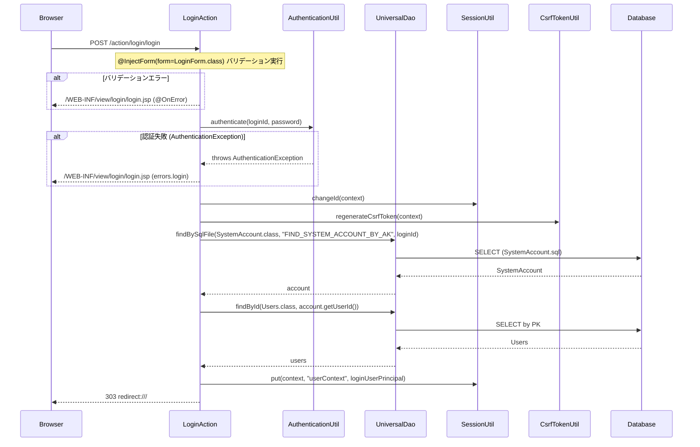

# Code Analysis: LoginAction

**Generated**: 2026-03-13 15:44:03
**Target**: ログイン・ログアウト認証アクション
**Modules**: proman-web
**Analysis Duration**: approx. 5m 10s

---

## Overview

`LoginAction` は proman-web アプリケーションのログイン・ログアウト認証を担うアクションクラス。ログイン画面表示 (`index`)、ログイン処理 (`login`)、ログアウト処理 (`logout`) の3メソッドで構成される。

ログイン処理では `@InjectForm` によるバリデーション → `AuthenticationUtil` による認証 → セッションID変更 → CSRFトークン再生成 → `UniversalDao` によるユーザ情報取得 → セッション保存 の一連のフローを実行する。認証失敗時は `@OnError` によりログイン画面へ遷移する。

---

## Architecture

### Dependency Graph



**Note**: This diagram uses Mermaid `classDiagram` syntax to show class names and their relationships. Use `--|>` for inheritance (extends/implements) and `..>` for dependencies (uses/creates).

### Component Summary

| Component | Role | Type | Dependencies |
|-----------|------|------|--------------|
| LoginAction | ログイン・ログアウト処理のアクション | Action | LoginForm, AuthenticationUtil, UniversalDao, SessionUtil, CsrfTokenUtil |
| LoginForm | ログインID・パスワードの入力フォームとバリデーション | Form | なし |
| AuthenticationUtil | SystemRepository経由でPasswordAuthenticatorを取得し認証を委譲するユーティリティ | Utility | SystemRepository, PasswordAuthenticator |
| LoginUserPrincipal | セッションに保存するログインユーザ情報 (userId, kanjiName, pmFlag, lastLoginDateTime) | DTO | なし |
| AuthenticationException | 認証失敗時の基底例外クラス (RuntimeException継承) | Exception | なし |

---

## Flow

### Processing Flow

**ログイン処理** (`login` メソッド):
1. `@InjectForm` がリクエストパラメータを `LoginForm` にバインドしバリデーションを実行
2. バリデーション成功後、`LoginForm` をリクエストスコープから取得
3. `AuthenticationUtil.authenticate()` で認証実行。失敗時は `AuthenticationException` をキャッチして `ApplicationException` に変換し `@OnError` によりログイン画面へ
4. 認証成功後、`SessionUtil.changeId()` でセッションIDを変更（セッション固定攻撃対策）
5. `CsrfTokenUtil.regenerateCsrfToken()` でCSRFトークンを再生成
6. `createLoginUserContext()` で `UniversalDao.findBySqlFile()` / `findById()` によりユーザ情報を取得し `LoginUserPrincipal` を生成
7. `SessionUtil.put()` でセッションに `userContext` を保存
8. トップ画面 (`/`) へ303リダイレクト

**ログアウト処理** (`logout` メソッド):
1. `SessionUtil.invalidate()` でセッション全体を破棄
2. ログイン画面 (`/app/login`) へ303リダイレクト

### Sequence Diagram



---

## Components

### LoginAction

**ファイル**: [LoginAction.java](../../.lw/nab-official/v5/nablarch-system-development-guide/Sample_Project/Source_Code/proman-project/proman-web/src/main/java/com/nablarch/example/proman/web/login/LoginAction.java)

**役割**: ログイン・ログアウト処理を行う Nablarch Web アクションクラス

**主要メソッド**:

- `index(HttpRequest, ExecutionContext)` (L38-40): ログイン画面 (`/WEB-INF/view/login/login.jsp`) を返す
- `login(HttpRequest, ExecutionContext)` (L49-71): ログイン処理本体。`@InjectForm` + `@OnError` アノテーション付き。バリデーション → 認証 → セッション管理 → リダイレクト
- `createLoginUserContext(String)` (L79-93): private メソッド。`UniversalDao` でシステムアカウントとユーザ情報を取得し `LoginUserPrincipal` を生成
- `logout(HttpRequest, ExecutionContext)` (L102-106): `SessionUtil.invalidate()` でセッション破棄後ログイン画面へリダイレクト

**依存コンポーネント**: LoginForm, AuthenticationUtil, UniversalDao, SessionUtil, CsrfTokenUtil, LoginUserPrincipal

---

### LoginForm

**ファイル**: [LoginForm.java](../../.lw/nab-official/v5/nablarch-system-development-guide/Sample_Project/Source_Code/proman-project/proman-web/src/main/java/com/nablarch/example/proman/web/login/LoginForm.java)

**役割**: ログインIDとパスワードを受け取り、ドメインバリデーションを適用するフォームクラス

**主要フィールド**:

- `loginId` (L22-23): `@Required` + `@Domain("loginId")` でバリデーション
- `userPassword` (L27-28): `@Required` + `@Domain("userPassword")` でバリデーション

**依存コンポーネント**: なし (Serializable実装)

---

### AuthenticationUtil

**ファイル**: [AuthenticationUtil.java](../../.lw/nab-official/v5/nablarch-system-development-guide/Sample_Project/Source_Code/proman-project/proman-web/src/main/java/com/nablarch/example/proman/web/common/authentication/AuthenticationUtil.java)

**役割**: `SystemRepository` から `PasswordAuthenticator` を取得して認証を委譲するユーティリティクラス（インスタンス化不可）

**主要メソッド**:

- `authenticate(String userId, String password)` (L62-66): コンポーネント名 `"authenticator"` で `PasswordAuthenticator` を取得して認証実行
- `encryptPassword(String userId, String password)` (L44-47): コンポーネント名 `"passwordEncryptor"` で `PasswordEncryptor` を取得してパスワード暗号化

**依存コンポーネント**: SystemRepository (Nablarch), PasswordAuthenticator (認証実装クラス)

---

### LoginUserPrincipal

**ファイル**: [LoginUserPrincipal.java](../../.lw/nab-official/v5/nablarch-system-development-guide/Sample_Project/Source_Code/proman-project/proman-web/src/main/java/com/nablarch/example/proman/web/common/authentication/context/LoginUserPrincipal.java)

**役割**: セッションに保存するログインユーザの認証情報を保持するDTOクラス

**保持情報**: `userId` (Integer), `kanjiName` (String), `pmFlag` (boolean), `lastLoginDateTime` (Date)

**依存コンポーネント**: なし (Serializable実装)

---

## Nablarch Framework Usage

### SessionUtil / CsrfTokenUtil

**クラス**:
- `nablarch.common.web.session.SessionUtil`
- `nablarch.common.web.csrf.CsrfTokenUtil`

**説明**: セッションストアへのセッション変数の読み書き・セッションID管理・CSRFトークン管理を提供するユーティリティクラス群

**使用方法**:
```java
// ログイン時: セッションID変更 → CSRFトークン再生成 → ユーザ情報保存
SessionUtil.changeId(context);
CsrfTokenUtil.regenerateCsrfToken(context);
SessionUtil.put(context, "userContext", loginUserPrincipal);

// ログアウト時: セッション全体を破棄
SessionUtil.invalidate(context);
```

**重要ポイント**:
- ✅ **ログイン時は必ずセッションIDを変更する**: セッション固定攻撃 (Session Fixation) を防ぐために `SessionUtil.changeId()` を認証成功直後に呼ぶ
- ✅ **CSRFトークンを再生成する**: CSRFトークン検証ハンドラ使用時、セッションIDのみ変更した場合はCSRFトークンも再生成が必要
- ⚠️ **セッションIDの変更順序**: 認証処理の成功確認後に変更すること。認証前に変更してもセキュリティ上の意味がない
- 💡 **認証情報の保存先**: セッションストアのDBストアまたはHTTPセッションストアを認証情報保持に推奨

**このコードでの使い方**:
- `login()` メソッドL65: 認証成功後 `SessionUtil.changeId(context)` でセッションID変更
- `login()` メソッドL66: `CsrfTokenUtil.regenerateCsrfToken(context)` でCSRFトークン再生成
- `login()` メソッドL69: `SessionUtil.put(context, "userContext", userContext)` でユーザ情報をセッションに保存
- `logout()` メソッドL103: `SessionUtil.invalidate(context)` でセッション全体を破棄

**詳細**: [Libraries Session_store](../../.claude/skills/nabledge-5/docs/component/libraries/libraries-session_store.md)

---

### @InjectForm

**クラス**: `nablarch.common.web.interceptor.InjectForm`

**説明**: リクエストパラメータをフォームクラスにバインドしてバリデーションを実行するインターセプタアノテーション。バリデーション成功時にフォームオブジェクトをリクエストスコープに格納する。

**使用方法**:
```java
@InjectForm(form = LoginForm.class)
@OnError(type = ApplicationException.class, path = "/WEB-INF/view/login/login.jsp")
public HttpResponse login(HttpRequest request, ExecutionContext context) {
    LoginForm form = context.getRequestScopedVar("form");
    // ...
}
```

**重要ポイント**:
- ✅ **リクエストスコープからフォームを取得**: バリデーション成功後、リクエストスコープのキー `"form"` (デフォルト) でフォームオブジェクトを取得する
- ✅ **@OnError とセットで使う**: バリデーションエラー (`ApplicationException`) 発生時の遷移先を `@OnError` で指定する
- 💡 **prefix 属性**: HTMLフォームで `form.loginId` のようにプレフィックス付きパラメータの場合は `prefix = "form"` を指定する。未指定時はプレフィックスなし

**このコードでの使い方**:
- `login()` メソッドL50: `@InjectForm(form = LoginForm.class)` でリクエストパラメータを `LoginForm` にバインド (prefix未指定)
- `login()` メソッドL53: `context.getRequestScopedVar("form")` でバインド済みフォームを取得

**詳細**: [Handlers InjectForm](../../.claude/skills/nabledge-5/docs/component/handlers/handlers-InjectForm.md)

---

### @OnError

**クラス**: `nablarch.fw.web.interceptor.OnError`

**説明**: 業務アクションメソッドで指定した例外が発生した場合に指定したパスへレスポンスを返すインターセプタアノテーション

**使用方法**:
```java
@OnError(type = ApplicationException.class, path = "/WEB-INF/view/login/login.jsp")
public HttpResponse login(HttpRequest request, ExecutionContext context) {
    // ApplicationException 発生時はログイン画面へ
}
```

**重要ポイント**:
- ✅ **inject_form_interceptor より前に実行**: `@OnError` は `@InjectForm` より前に実行されるよう設定することでバリデーションエラーも捕捉できる
- ⚠️ **type 属性は RuntimeException のサブクラスのみ**: 指定できる例外は `RuntimeException` およびそのサブクラス
- 💡 **サブクラスも対象**: 指定した例外クラスのサブクラスも処理対象となる

**このコードでの使い方**:
- `login()` メソッドL49: `@OnError(type = ApplicationException.class, path = "/WEB-INF/view/login/login.jsp")` でバリデーションエラーおよび認証エラー発生時にログイン画面へ遷移

**詳細**: [Handlers On_error](../../.claude/skills/nabledge-5/docs/component/handlers/handlers-on_error.md)

---

### UniversalDao

**クラス**: `nablarch.common.dao.UniversalDao`

**説明**: JPA 2.0アノテーションを使った簡易O/Rマッパー。SQLファイルを使った検索やプライマリキー検索を提供する。

**使用方法**:
```java
// SQLファイル指定の検索 (検索結果をBeanにマッピング)
SystemAccount account = UniversalDao.findBySqlFile(
    SystemAccount.class, "FIND_SYSTEM_ACCOUNT_BY_AK", new Object[]{loginId});

// 主キー検索
Users users = UniversalDao.findById(Users.class, account.getUserId());
```

**重要ポイント**:
- ✅ **SQLファイルのパスはBeanクラスから導出**: `SystemAccount.class` の場合、SQLファイルは `com/nablarch/example/proman/entity/SystemAccount.sql` (クラスパス配下)
- ✅ **検索条件はEntityではなく専用Beanを使う**: 複数テーブルにアクセスする場合は専用の検索条件Beanを使用する
- ⚠️ **findBySqlFile は必ず1件ヒットを前提**: 0件の場合 `NoDataException`、2件以上の場合 `TooManyResultException` が発生

**このコードでの使い方**:
- `createLoginUserContext()` L80-82: `UniversalDao.findBySqlFile()` でログインIDをキーにシステムアカウントを取得
- `createLoginUserContext()` L83: `UniversalDao.findById()` でユーザIDをキーにユーザ情報を取得

**詳細**: [Libraries Universal_dao](../../.claude/skills/nabledge-5/docs/component/libraries/libraries-universal_dao.md)

---

## References

### Source Files

- [LoginAction.java (.lw/nab-official/v5/nablarch-system-development-guide/en/Sample_Project/Source_Code/proman-project/proman-web/src/main/java/com/nablarch/example/proman/web/login)](../../.lw/nab-official/v5/nablarch-system-development-guide/en/Sample_Project/Source_Code/proman-project/proman-web/src/main/java/com/nablarch/example/proman/web/login/LoginAction.java) - LoginAction
- [LoginAction.java (.lw/nab-official/v5/nablarch-system-development-guide/Sample_Project/Source_Code/proman-project/proman-web/src/main/java/com/nablarch/example/proman/web/login)](../../.lw/nab-official/v5/nablarch-system-development-guide/Sample_Project/Source_Code/proman-project/proman-web/src/main/java/com/nablarch/example/proman/web/login/LoginAction.java) - LoginAction
- [LoginAction.java (.lw/nab-official/v6/nablarch-system-development-guide/en/Sample_Project/Source_Code/proman-project/proman-web/src/main/java/com/nablarch/example/proman/web/login)](../../.lw/nab-official/v6/nablarch-system-development-guide/en/Sample_Project/Source_Code/proman-project/proman-web/src/main/java/com/nablarch/example/proman/web/login/LoginAction.java) - LoginAction
- [LoginAction.java (.lw/nab-official/v6/nablarch-system-development-guide/Sample_Project/Source_Code/proman-project/proman-web/src/main/java/com/nablarch/example/proman/web/login)](../../.lw/nab-official/v6/nablarch-system-development-guide/Sample_Project/Source_Code/proman-project/proman-web/src/main/java/com/nablarch/example/proman/web/login/LoginAction.java) - LoginAction
- [LoginForm.java (.lw/nab-official/v5/nablarch-system-development-guide/en/Sample_Project/Source_Code/proman-project/proman-web/src/main/java/com/nablarch/example/proman/web/login)](../../.lw/nab-official/v5/nablarch-system-development-guide/en/Sample_Project/Source_Code/proman-project/proman-web/src/main/java/com/nablarch/example/proman/web/login/LoginForm.java) - LoginForm
- [LoginForm.java (.lw/nab-official/v5/nablarch-system-development-guide/Sample_Project/Source_Code/proman-project/proman-web/src/main/java/com/nablarch/example/proman/web/login)](../../.lw/nab-official/v5/nablarch-system-development-guide/Sample_Project/Source_Code/proman-project/proman-web/src/main/java/com/nablarch/example/proman/web/login/LoginForm.java) - LoginForm
- [LoginForm.java (.lw/nab-official/v6/nablarch-system-development-guide/en/Sample_Project/Source_Code/proman-project/proman-web/src/main/java/com/nablarch/example/proman/web/login)](../../.lw/nab-official/v6/nablarch-system-development-guide/en/Sample_Project/Source_Code/proman-project/proman-web/src/main/java/com/nablarch/example/proman/web/login/LoginForm.java) - LoginForm
- [LoginForm.java (.lw/nab-official/v6/nablarch-system-development-guide/Sample_Project/Source_Code/proman-project/proman-web/src/main/java/com/nablarch/example/proman/web/login)](../../.lw/nab-official/v6/nablarch-system-development-guide/Sample_Project/Source_Code/proman-project/proman-web/src/main/java/com/nablarch/example/proman/web/login/LoginForm.java) - LoginForm
- [AuthenticationUtil.java (.lw/nab-official/v5/nablarch-system-development-guide/en/Sample_Project/Source_Code/proman-project/proman-web/src/main/java/com/nablarch/example/proman/web/common/authentication)](../../.lw/nab-official/v5/nablarch-system-development-guide/en/Sample_Project/Source_Code/proman-project/proman-web/src/main/java/com/nablarch/example/proman/web/common/authentication/AuthenticationUtil.java) - AuthenticationUtil
- [AuthenticationUtil.java (.lw/nab-official/v5/nablarch-system-development-guide/Sample_Project/Source_Code/proman-project/proman-web/src/main/java/com/nablarch/example/proman/web/common/authentication)](../../.lw/nab-official/v5/nablarch-system-development-guide/Sample_Project/Source_Code/proman-project/proman-web/src/main/java/com/nablarch/example/proman/web/common/authentication/AuthenticationUtil.java) - AuthenticationUtil
- [AuthenticationUtil.java (.lw/nab-official/v6/nablarch-system-development-guide/en/Sample_Project/Source_Code/proman-project/proman-web/src/main/java/com/nablarch/example/proman/web/common/authentication)](../../.lw/nab-official/v6/nablarch-system-development-guide/en/Sample_Project/Source_Code/proman-project/proman-web/src/main/java/com/nablarch/example/proman/web/common/authentication/AuthenticationUtil.java) - AuthenticationUtil
- [AuthenticationUtil.java (.lw/nab-official/v6/nablarch-system-development-guide/Sample_Project/Source_Code/proman-project/proman-web/src/main/java/com/nablarch/example/proman/web/common/authentication)](../../.lw/nab-official/v6/nablarch-system-development-guide/Sample_Project/Source_Code/proman-project/proman-web/src/main/java/com/nablarch/example/proman/web/common/authentication/AuthenticationUtil.java) - AuthenticationUtil
- [LoginUserPrincipal.java (.lw/nab-official/v5/nablarch-system-development-guide/en/Sample_Project/Source_Code/proman-project/proman-web/src/main/java/com/nablarch/example/proman/web/common/authentication/context)](../../.lw/nab-official/v5/nablarch-system-development-guide/en/Sample_Project/Source_Code/proman-project/proman-web/src/main/java/com/nablarch/example/proman/web/common/authentication/context/LoginUserPrincipal.java) - LoginUserPrincipal
- [LoginUserPrincipal.java (.lw/nab-official/v5/nablarch-system-development-guide/Sample_Project/Source_Code/proman-project/proman-web/src/main/java/com/nablarch/example/proman/web/common/authentication/context)](../../.lw/nab-official/v5/nablarch-system-development-guide/Sample_Project/Source_Code/proman-project/proman-web/src/main/java/com/nablarch/example/proman/web/common/authentication/context/LoginUserPrincipal.java) - LoginUserPrincipal
- [LoginUserPrincipal.java (.lw/nab-official/v6/nablarch-system-development-guide/en/Sample_Project/Source_Code/proman-project/proman-web/src/main/java/com/nablarch/example/proman/web/common/authentication/context)](../../.lw/nab-official/v6/nablarch-system-development-guide/en/Sample_Project/Source_Code/proman-project/proman-web/src/main/java/com/nablarch/example/proman/web/common/authentication/context/LoginUserPrincipal.java) - LoginUserPrincipal
- [LoginUserPrincipal.java (.lw/nab-official/v6/nablarch-system-development-guide/Sample_Project/Source_Code/proman-project/proman-web/src/main/java/com/nablarch/example/proman/web/common/authentication/context)](../../.lw/nab-official/v6/nablarch-system-development-guide/Sample_Project/Source_Code/proman-project/proman-web/src/main/java/com/nablarch/example/proman/web/common/authentication/context/LoginUserPrincipal.java) - LoginUserPrincipal
- [AuthenticationException.java (.lw/nab-official/v5/nablarch-system-development-guide/en/Sample_Project/Source_Code/proman-project/proman-web/src/main/java/com/nablarch/example/proman/web/common/authentication/exception)](../../.lw/nab-official/v5/nablarch-system-development-guide/en/Sample_Project/Source_Code/proman-project/proman-web/src/main/java/com/nablarch/example/proman/web/common/authentication/exception/AuthenticationException.java) - AuthenticationException
- [AuthenticationException.java (.lw/nab-official/v5/nablarch-system-development-guide/Sample_Project/Source_Code/proman-project/proman-web/src/main/java/com/nablarch/example/proman/web/common/authentication/exception)](../../.lw/nab-official/v5/nablarch-system-development-guide/Sample_Project/Source_Code/proman-project/proman-web/src/main/java/com/nablarch/example/proman/web/common/authentication/exception/AuthenticationException.java) - AuthenticationException
- [AuthenticationException.java (.lw/nab-official/v6/nablarch-system-development-guide/en/Sample_Project/Source_Code/proman-project/proman-web/src/main/java/com/nablarch/example/proman/web/common/authentication/exception)](../../.lw/nab-official/v6/nablarch-system-development-guide/en/Sample_Project/Source_Code/proman-project/proman-web/src/main/java/com/nablarch/example/proman/web/common/authentication/exception/AuthenticationException.java) - AuthenticationException
- [AuthenticationException.java (.lw/nab-official/v6/nablarch-system-development-guide/Sample_Project/Source_Code/proman-project/proman-web/src/main/java/com/nablarch/example/proman/web/common/authentication/exception)](../../.lw/nab-official/v6/nablarch-system-development-guide/Sample_Project/Source_Code/proman-project/proman-web/src/main/java/com/nablarch/example/proman/web/common/authentication/exception/AuthenticationException.java) - AuthenticationException

### Knowledge Base (Nabledge-5)

- [Libraries Session_store](../../.claude/skills/nabledge-5/docs/component/libraries/libraries-session_store.md)
- [Handlers InjectForm](../../.claude/skills/nabledge-5/docs/component/handlers/handlers-InjectForm.md)
- [Handlers On_error](../../.claude/skills/nabledge-5/docs/component/handlers/handlers-on_error.md)
- [Libraries Universal_dao](../../.claude/skills/nabledge-5/docs/component/libraries/libraries-universal_dao.md)

### Official Documentation


- [AesEncryptor](https://nablarch.github.io/docs/LATEST/javadoc/nablarch/common/encryption/AesEncryptor.html)
- [Base64Key](https://nablarch.github.io/docs/LATEST/javadoc/nablarch/common/encryption/Base64Key.html)
- [Base64Util](https://nablarch.github.io/docs/LATEST/javadoc/nablarch/core/util/Base64Util.html)
- [BasicDaoContextFactory](https://nablarch.github.io/docs/LATEST/javadoc/nablarch/common/dao/BasicDaoContextFactory.html)
- [ConnectionFactory](https://nablarch.github.io/docs/LATEST/javadoc/nablarch/core/db/connection/ConnectionFactory.html)
- [DatabaseMetaDataExtractor](https://nablarch.github.io/docs/LATEST/javadoc/nablarch/common/dao/DatabaseMetaDataExtractor.html)
- [DbStore](https://nablarch.github.io/docs/LATEST/javadoc/nablarch/common/web/session/store/DbStore.html)
- [DeferredEntityList](https://nablarch.github.io/docs/LATEST/javadoc/nablarch/common/dao/DeferredEntityList.html)
- [Dialect](https://nablarch.github.io/docs/LATEST/javadoc/nablarch/core/db/dialect/Dialect.html)
- [EntityList](https://nablarch.github.io/docs/LATEST/javadoc/nablarch/common/dao/EntityList.html)
- [ExecutionContext](https://nablarch.github.io/docs/LATEST/javadoc/nablarch/fw/ExecutionContext.html)
- [GenerationType](https://nablarch.github.io/docs/LATEST/javadoc/javax/persistence/GenerationType.html)
- [H2Dialect](https://nablarch.github.io/docs/LATEST/javadoc/nablarch/core/db/dialect/H2Dialect.html)
- [HttpErrorResponse](https://nablarch.github.io/docs/LATEST/javadoc/nablarch/fw/web/HttpErrorResponse.html)
- [InjectForm](https://nablarch.github.io/docs/LATEST/doc/application_framework/application_framework/handlers/web_interceptor/InjectForm.html)
- [InjectForm](https://nablarch.github.io/docs/LATEST/javadoc/nablarch/common/web/interceptor/InjectForm.html)
- [JavaSerializeEncryptStateEncoder](https://nablarch.github.io/docs/LATEST/javadoc/nablarch/common/web/session/encoder/JavaSerializeEncryptStateEncoder.html)
- [JavaSerializeStateEncoder](https://nablarch.github.io/docs/LATEST/javadoc/nablarch/common/web/session/encoder/JavaSerializeStateEncoder.html)
- [JaxbStateEncoder](https://nablarch.github.io/docs/LATEST/javadoc/nablarch/common/web/session/encoder/JaxbStateEncoder.html)
- [On Error](https://nablarch.github.io/docs/LATEST/doc/application_framework/application_framework/handlers/web_interceptor/on_error.html)
- [OnError](https://nablarch.github.io/docs/LATEST/javadoc/nablarch/fw/web/interceptor/OnError.html)
- [OptimisticLockException](https://nablarch.github.io/docs/LATEST/javadoc/javax/persistence/OptimisticLockException.html)
- [Pagination](https://nablarch.github.io/docs/LATEST/javadoc/nablarch/common/dao/Pagination.html)
- [Session Store](https://nablarch.github.io/docs/LATEST/doc/application_framework/application_framework/libraries/session_store.html)
- [SessionKeyNotFoundException](https://nablarch.github.io/docs/LATEST/javadoc/nablarch/common/web/session/SessionKeyNotFoundException.html)
- [SessionManager](https://nablarch.github.io/docs/LATEST/javadoc/nablarch/common/web/session/SessionManager.html)
- [SessionStore](https://nablarch.github.io/docs/LATEST/javadoc/nablarch/common/web/session/SessionStore.html)
- [SessionUtil](https://nablarch.github.io/docs/LATEST/javadoc/nablarch/common/web/session/SessionUtil.html)
- [SimpleDbTransactionManager](https://nablarch.github.io/docs/LATEST/javadoc/nablarch/core/db/transaction/SimpleDbTransactionManager.html)
- [TransactionFactory](https://nablarch.github.io/docs/LATEST/javadoc/nablarch/core/transaction/TransactionFactory.html)
- [Universal Dao](https://nablarch.github.io/docs/LATEST/doc/application_framework/application_framework/libraries/database/universal_dao.html)
- [UniversalDao.Transaction](https://nablarch.github.io/docs/LATEST/javadoc/nablarch/common/dao/UniversalDao.Transaction.html)
- [UniversalDao](https://nablarch.github.io/docs/LATEST/javadoc/nablarch/common/dao/UniversalDao.html)
- [UserSessionSchema](https://nablarch.github.io/docs/LATEST/javadoc/nablarch/common/web/session/store/UserSessionSchema.html)

---

**Note**: This documentation was generated by the code-analysis workflow of the nabledge-5 skill.
