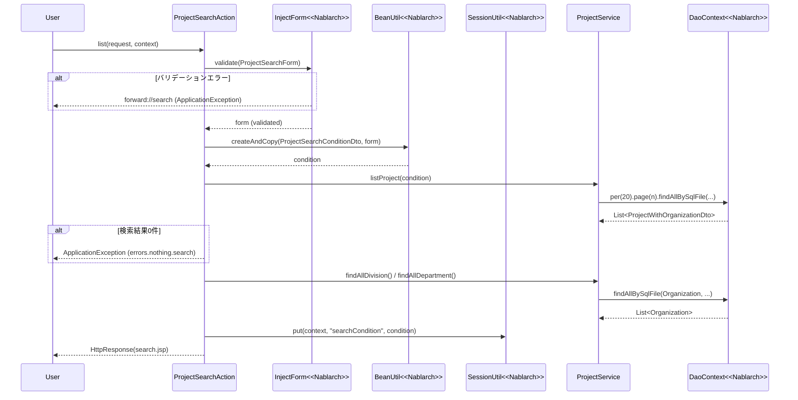

# Code Analysis: ProjectSearchAction

**Generated**: 2026-03-13 15:51:10
**Target**: プロジェクト検索・詳細表示アクション
**Modules**: proman-web
**Analysis Duration**: approx. 3m 15s

---

## Overview

`ProjectSearchAction` はプロジェクト管理Webアプリケーションの検索・詳細表示機能を担うアクションクラスです。4つのアクションメソッドを持ちます：

- `search()`: 検索画面の初期表示（セッションの検索条件をクリア）
- `list()`: 検索条件を受け取りプロジェクト一覧を表示（ページング対応）
- `backToList()`: 詳細画面からの戻り処理（セッションに保存した検索条件で再検索）
- `detail()`: 指定プロジェクトの詳細表示

フォーム（`ProjectSearchForm`）でバリデーションを行い、`BeanUtil` で検索条件DTO（`ProjectSearchConditionDto`）に変換後、`ProjectService` 経由で `DaoContext`（UniversalDao）にアクセスしてデータを取得します。検索条件はセッションストア（`SessionUtil`）に保存し、詳細画面からの戻り時に再利用します。

---

## Architecture

### Dependency Graph

```mermaid
classDiagram
    class ProjectSearchAction
    class ProjectSearchForm {
        <<Form>>
    }
    class ProjectSearchConditionDto {
        <<DTO>>
    }
    class ProjectDetailInitialForm {
        <<Form>>
    }
    class ProjectService
    class ProjectWithOrganizationDto {
        <<DTO>>
    }
    class DaoContext {
        <<Nablarch>>
    }
    class SessionUtil {
        <<Nablarch>>
    }
    class BeanUtil {
        <<Nablarch>>
    }
    class ExecutionContext {
        <<Nablarch>>
    }

    ProjectSearchAction ..> ProjectSearchForm : validates
    ProjectSearchAction ..> ProjectDetailInitialForm : validates
    ProjectSearchAction ..> ProjectSearchConditionDto : creates
    ProjectSearchAction ..> ProjectService : delegates to
    ProjectSearchAction ..> SessionUtil : stores/retrieves condition
    ProjectSearchAction ..> BeanUtil : converts beans
    ProjectSearchAction ..> ExecutionContext : sets request scope
    ProjectSearchForm --|> SearchFormBase
    ProjectSearchForm ..|> Serializable
    ProjectSearchConditionDto ..|> Serializable
    ProjectDetailInitialForm ..|> Serializable
    ProjectService ..> DaoContext : queries
    ProjectService ..> ProjectWithOrganizationDto : returns
```



**Note**: This diagram uses Mermaid `classDiagram` syntax to show class names and their relationships. Use `--|>` for inheritance (extends/implements) and `..>` for dependencies (uses/creates).

### Component Summary

| Component | Role | Type | Dependencies |
|-----------|------|------|--------------|
| ProjectSearchAction | プロジェクト検索・詳細表示のアクション | Action | ProjectSearchForm, ProjectDetailInitialForm, ProjectService, SessionUtil, BeanUtil, ExecutionContext |
| ProjectSearchForm | 検索条件の入力フォーム（バリデーション定義） | Form | SearchFormBase, DateRelationUtil, MoneyRelationUtil |
| ProjectSearchConditionDto | 検索条件をサービス層に渡すDTO | DTO | なし |
| ProjectDetailInitialForm | 詳細画面遷移時のパラメータ受付フォーム | Form | なし |
| ProjectService | プロジェクトのDB操作をまとめるサービス | Service | DaoContext, Organization, Project, ProjectWithOrganizationDto |
| ProjectWithOrganizationDto | 組織情報を含むプロジェクト検索結果DTO | DTO | なし |

---

## Flow

### Processing Flow

**検索一覧表示（`list`メソッド）**:
1. `@InjectForm` インターセプターが `ProjectSearchForm` でリクエストパラメータをバリデーション
2. バリデーションエラー時は `@OnError` により `forward://search` へ遷移
3. リクエストスコープからバリデーション済みフォームを取得
4. ページ番号が未設定の場合は `"1"` をデフォルト設定
5. `BeanUtil.createAndCopy()` でフォームを `ProjectSearchConditionDto` に変換
6. `searchProjectAndSetToRequestScope()` で検索実行・結果をリクエストスコープに設定
7. 検索結果が0件の場合は `ApplicationException` をスロー
8. `setOrganizationAndDivisionToRequestScope()` で事業部・部門一覧をリクエストスコープに設定
9. `SessionUtil.put()` で検索条件をセッションに保存
10. 検索画面JSPへのレスポンスを返却

**詳細画面からの戻り（`backToList`メソッド）**:
1. `SessionUtil.get()` でセッションから保存済み検索条件を復元
2. 同条件で再検索・リクエストスコープに設定
3. `BeanUtil.createAndCopy()` で条件DTOをフォームに逆変換し、入力フォームに値を復元
4. 検索画面JSPへのレスポンスを返却

### Sequence Diagram



---

## Components

### ProjectSearchAction

**ファイル**: [`ProjectSearchAction.java`](../../.lw/nab-official/v5/nablarch-system-development-guide/Sample_Project/Source_Code/proman-project/proman-web/src/main/java/com/nablarch/example/proman/web/project/ProjectSearchAction.java)

**役割**: プロジェクト検索・一覧表示・詳細表示を担うWebアクション

**主要メソッド**:
- `search()` (L35-40): 検索画面初期表示。セッションの検索条件を削除し、組織情報をリクエストスコープに設定
- `list()` (L51-69): 検索条件バリデーション後、`BeanUtil` でDTO変換、検索実行、セッション保存
- `backToList()` (L79-91): セッションから検索条件を復元し再検索、フォームへの逆変換も実施
- `detail()` (L102-109): `@InjectForm` でプロジェクトID取得後、`ProjectService` で詳細1件検索
- `searchProjectAndSetToRequestScope()` (L117-125): 検索実行と0件チェック、リクエストスコープへの設定
- `setOrganizationAndDivisionToRequestScope()` (L132-136): 事業部・部門マスタをリクエストスコープに設定

**依存関係**:
- `ProjectSearchForm`: `@InjectForm` でバリデーション（`list`メソッド）
- `ProjectDetailInitialForm`: `@InjectForm` でバリデーション（`detail`メソッド）
- `ProjectService`: DB操作のファサード
- `SessionUtil`: 検索条件の保存・取得・削除
- `BeanUtil`: フォーム↔DTO間のプロパティコピー
- `ExecutionContext`: リクエストスコープへの値設定
- `ApplicationException` / `MessageUtil`: 0件時のエラー通知

---

### ProjectSearchForm

**ファイル**: [`ProjectSearchForm.java`](../../.lw/nab-official/v5/nablarch-system-development-guide/Sample_Project/Source_Code/proman-project/proman-web/src/main/java/com/nablarch/example/proman/web/project/ProjectSearchForm.java)

**役割**: プロジェクト検索条件の入力値を受け取るフォームクラス（バリデーション定義含む）

**主要メソッド**:
- `isValidProjectSalesRange()` (L295-297): 売上高のFROM/TO大小関係チェック（`@AssertTrue`）
- `isValidProjectStartDateRange()` (L306-308): 開始日のFROM/TO順序チェック（`@AssertTrue`）
- `isValidProjectEndDateRange()` (L317-320): 終了日のFROM/TO順序チェック（`@AssertTrue`）

**依存関係**:
- `SearchFormBase`: ページ番号プロパティを継承
- `@Domain("organizationId")`, `@Domain("amountOfMoney")` 等: ドメインバリデーション
- `DateRelationUtil`, `MoneyRelationUtil`: 相関バリデーション実装
- `ProjectType`, `ProjectClass` (inner class): チェックボックス複数値のバリデーション用入れ子Bean

---

### ProjectService

**ファイル**: [`ProjectService.java`](../../.lw/nab-official/v5/nablarch-system-development-guide/Sample_Project/Source_Code/proman-project/proman-web/src/main/java/com/nablarch/example/proman/web/project/ProjectService.java)

**役割**: プロジェクト関連のDB操作をまとめるサービスクラス

**主要メソッド**:
- `listProject(condition)` (L99-104): ページング付きプロジェクト検索。`per(20L).page(n).findAllBySqlFile()` で実行
- `findProjectByIdWithOrganization(projectId)` (L112-116): IDによる詳細1件検索（JOIN結果をDTOで受取）
- `findAllDivision()` (L50-52): 全事業部取得
- `findAllDepartment()` (L59-61): 全部門取得

**依存関係**:
- `DaoContext` (UniversalDao): `DaoFactory.create()` で取得。SQL実行の中核
- `Organization` (Entity): 組織情報の検索結果
- `ProjectWithOrganizationDto`: JOIN検索結果を受け取るDTO
- SQL IDを外部ファイルで管理（`"FIND_PROJECT_WITH_ORGANIZATION"` 等）

---

### ProjectSearchConditionDto

**ファイル**: [`ProjectSearchConditionDto.java`](../../.lw/nab-official/v5/nablarch-system-development-guide/Sample_Project/Source_Code/proman-project/proman-web/src/main/java/com/nablarch/example/proman/web/project/ProjectSearchConditionDto.java)

**役割**: 検索条件をサービス層に渡すDTO。SQLのバインド変数と対応

**特徴**:
- プロパティ型はDBカラム型に対応（String→Integer/Date等の型変換は`BeanUtil`が実施）
- `pageNumber`（long型）でページング制御
- セッションへの保存対象（`Serializable`実装）

---

### ProjectDetailInitialForm

**ファイル**: [`ProjectDetailInitialForm.java`](../../.lw/nab-official/v5/nablarch-system-development-guide/Sample_Project/Source_Code/proman-project/proman-web/src/main/java/com/nablarch/example/proman/web/project/ProjectDetailInitialForm.java)

**役割**: 詳細画面遷移時のプロジェクトIDパラメータを受け取るシンプルなフォーム

**特徴**:
- `@Required` + `@Domain("projectId")` でIDの必須・ドメインバリデーションのみ
- `Integer.parseInt(form.getProjectId())` でID変換して使用

---

## Nablarch Framework Usage

### InjectForm / @InjectForm

**クラス**: `nablarch.common.web.interceptor.InjectForm`

**説明**: アクションメソッドに付与することで、リクエストパラメータの指定フォームへのバインドとBean Validationによるバリデーションを自動実行するインターセプター

**使用方法**:
```java
@InjectForm(form = ProjectSearchForm.class, prefix = "form")
@OnError(type = ApplicationException.class, path = "forward://search")
public HttpResponse list(HttpRequest request, ExecutionContext context) {
    ProjectSearchForm form = context.getRequestScopedVar("form");
    // バリデーション済みフォームを利用
}
```

**重要ポイント**:
- ✅ **外部入力は必ず`@InjectForm`でバリデーション**: リクエストパラメータを直接使わず、フォームを経由してバリデーションを実施する
- ✅ **`@OnError`とセットで使用**: バリデーションエラー時の遷移先を必ず指定する
- ⚠️ **フォームはSerializableを実装**: セッションに格納する可能性があるため `Serializable` を実装する
- 💡 **バリデーション済みオブジェクトはリクエストスコープから取得**: `context.getRequestScopedVar("form")` でアノテーションの `name` 属性（デフォルト: `"form"`）で取得

**このコードでの使い方**:
- `list()`（L49）: `ProjectSearchForm` で検索条件パラメータをバリデーション
- `detail()`（L101）: `ProjectDetailInitialForm` でプロジェクトIDをバリデーション

**詳細**: [Web Application Getting Started Project Search](../../.claude/skills/nabledge-5/docs/processing-pattern/web-application/web-application-getting-started-project-search.md)

---

### SessionUtil

**クラス**: `nablarch.common.web.session.SessionUtil`

**説明**: セッションストアへのオブジェクトの保存・取得・削除を行うユーティリティクラス

**使用方法**:
```java
// 保存
SessionUtil.put(context, "searchCondition", condition);

// 取得
ProjectSearchConditionDto condition = SessionUtil.get(context, "searchCondition");

// 削除
SessionUtil.delete(context, "searchCondition");
```

**重要ポイント**:
- ✅ **セッションに格納するオブジェクトはSerializableを実装**: `ProjectSearchConditionDto` は `Serializable` を実装している
- ⚠️ **フォームクラスをセッションに直接格納しない**: セッションにはエンティティやDTOに変換してから格納する（フォームはリクエストスコープ用）
- 💡 **詳細画面からの戻り処理に活用**: 検索条件をセッションに保存することで、詳細表示後に同じ検索結果一覧に戻ることができる
- ⚡ **初期表示時はdelete**: `search()` メソッドで `SessionUtil.delete()` を呼び、古い検索条件を確実にクリアする

**このコードでの使い方**:
- `search()`（L36）: セッションの検索条件を削除（新規検索）
- `list()`（L66）: 検索条件DTOをセッションに保存
- `backToList()`（L81）: セッションから検索条件を復元して再検索

**詳細**: [Web Application Client Create3](../../.claude/skills/nabledge-5/docs/processing-pattern/web-application/web-application-client_create3.md)

---

### BeanUtil

**クラス**: `nablarch.core.beans.BeanUtil`

**説明**: JavaBeansのプロパティコピー・変換を行うユーティリティ。同名プロパティ間で型変換付きコピーが可能

**使用方法**:
```java
// フォーム→DTOへのコピー（新規インスタンス生成+コピー）
ProjectSearchConditionDto condition = BeanUtil.createAndCopy(ProjectSearchConditionDto.class, form);

// DTO→フォームへの逆コピー（入力値の復元）
ProjectSearchForm form = BeanUtil.createAndCopy(ProjectSearchForm.class, condition);
```

**重要ポイント**:
- ✅ **プロパティ名を一致させる**: フォームとDTOのプロパティ名が同一であれば自動的にコピーされる
- 💡 **型変換を自動実行**: フォームの `String` 型プロパティをDTOの `Integer` / `java.sql.Date` 型に変換する（例: `salesFrom: String → Integer`）
- ⚠️ **配列型の変換**: `String[]` → `String[]` は直接コピーされるが、型変換が複雑な場合は手動処理が必要

**このコードでの使い方**:
- `list()`（L58）: `ProjectSearchForm` → `ProjectSearchConditionDto` への変換
- `backToList()`（L85）: `ProjectSearchConditionDto` → `ProjectSearchForm` への逆変換（入力値の復元）

**詳細**: [Web Application Getting Started Project Search](../../.claude/skills/nabledge-5/docs/processing-pattern/web-application/web-application-getting-started-project-search.md)

---

### DaoContext（UniversalDao）

**クラス**: `nablarch.common.dao.DaoContext` / `nablarch.common.dao.UniversalDao`

**説明**: Nablarchの汎用DAOインターフェース。SQLファイルを使ったDB検索、ページング検索、CRUD操作を提供する

**使用方法**:
```java
// ページング検索
List<ProjectWithOrganizationDto> result = universalDao
    .per(RECORDS_PER_PAGE)   // 1ページあたりの件数
    .page(condition.getPageNumber())  // ページ番号
    .findAllBySqlFile(ProjectWithOrganizationDto.class, "FIND_PROJECT_WITH_ORGANIZATION", condition);

// SQLファイルを使った全件取得
List<Organization> orgs = universalDao.findAllBySqlFile(Organization.class, "FIND_ALL_DIVISION");
```

**重要ポイント**:
- ✅ **SQLIDは外部SQLファイルに定義**: SQLインジェクション防止のため、SQL文は外部ファイルに記述する
- ✅ **ページングは`per().page()`チェーン**: `per()` で1ページ件数、`page()` でページ番号を指定
- 💡 **Beanのプロパティ名でSQL変数バインド**: DTOのプロパティ名とSQL中の `:propertyName` が対応する
- 🎯 **JOINの結果はDTOで受取**: テーブルJOINした結果はエンティティではなくDTOクラスで受け取ることで柔軟なマッピングが可能

**このコードでの使い方**:
- `ProjectService.listProject()`（L100-103）: ページング付きプロジェクト検索
- `ProjectService.findAllDivision()`（L51）: 事業部マスタの全件取得
- `ProjectService.findAllDepartment()`（L60）: 部門マスタの全件取得
- `ProjectService.findProjectByIdWithOrganization()`（L112-115）: 詳細1件検索

**詳細**: [Web Application Getting Started Project Search](../../.claude/skills/nabledge-5/docs/processing-pattern/web-application/web-application-getting-started-project-search.md)

---

### ApplicationException / MessageUtil

**クラス**: `nablarch.core.message.ApplicationException` / `nablarch.core.message.MessageUtil`

**説明**: 業務エラーを表す例外クラス。`MessageUtil` でメッセージを生成し、`ApplicationException` でラップしてスローする

**使用方法**:
```java
throw new ApplicationException(
    MessageUtil.createMessage(MessageLevel.ERROR, "errors.nothing.search", "プロジェクト"));
```

**重要ポイント**:
- ✅ **`@OnError`と連動**: `@OnError(type = ApplicationException.class, ...)` でハンドリングされ、指定パスへ遷移
- 💡 **メッセージIDで国際化対応**: メッセージ定義ファイルにIDと文言を定義し、ID指定でメッセージを生成
- ⚠️ **例外発生箇所によって遷移先を変えたい場合**: `HttpErrorResponse` に遷移先を指定してスローする（`forward_error_page` 参照）

**このコードでの使い方**:
- `searchProjectAndSetToRequestScope()`（L121-123）: 検索結果0件時に `"errors.nothing.search"` メッセージIDで例外をスロー
- `@OnError(path = "forward://search")` がキャッチして検索画面に戻す

**詳細**: [Web Application Forward Error Page](../../.claude/skills/nabledge-5/docs/processing-pattern/web-application/web-application-forward_error_page.md)

---

## References

### Source Files

- [ProjectSearchAction.java (.lw/nab-official/v5/nablarch-system-development-guide/en/Sample_Project/Source_Code/proman-project/proman-web/src/main/java/com/nablarch/example/proman/web/project)](../../.lw/nab-official/v5/nablarch-system-development-guide/en/Sample_Project/Source_Code/proman-project/proman-web/src/main/java/com/nablarch/example/proman/web/project/ProjectSearchAction.java) - ProjectSearchAction
- [ProjectSearchAction.java (.lw/nab-official/v5/nablarch-system-development-guide/Sample_Project/Source_Code/proman-project/proman-web/src/main/java/com/nablarch/example/proman/web/project)](../../.lw/nab-official/v5/nablarch-system-development-guide/Sample_Project/Source_Code/proman-project/proman-web/src/main/java/com/nablarch/example/proman/web/project/ProjectSearchAction.java) - ProjectSearchAction
- [ProjectSearchAction.java (.lw/nab-official/v6/nablarch-system-development-guide/en/Sample_Project/Source_Code/proman-project/proman-web/src/main/java/com/nablarch/example/proman/web/project)](../../.lw/nab-official/v6/nablarch-system-development-guide/en/Sample_Project/Source_Code/proman-project/proman-web/src/main/java/com/nablarch/example/proman/web/project/ProjectSearchAction.java) - ProjectSearchAction
- [ProjectSearchAction.java (.lw/nab-official/v6/nablarch-system-development-guide/Sample_Project/Source_Code/proman-project/proman-web/src/main/java/com/nablarch/example/proman/web/project)](../../.lw/nab-official/v6/nablarch-system-development-guide/Sample_Project/Source_Code/proman-project/proman-web/src/main/java/com/nablarch/example/proman/web/project/ProjectSearchAction.java) - ProjectSearchAction
- [ProjectSearchForm.java (.lw/nab-official/v5/nablarch-system-development-guide/en/Sample_Project/Source_Code/proman-project/proman-web/src/main/java/com/nablarch/example/proman/web/project)](../../.lw/nab-official/v5/nablarch-system-development-guide/en/Sample_Project/Source_Code/proman-project/proman-web/src/main/java/com/nablarch/example/proman/web/project/ProjectSearchForm.java) - ProjectSearchForm
- [ProjectSearchForm.java (.lw/nab-official/v5/nablarch-system-development-guide/Sample_Project/Source_Code/proman-project/proman-web/src/main/java/com/nablarch/example/proman/web/project)](../../.lw/nab-official/v5/nablarch-system-development-guide/Sample_Project/Source_Code/proman-project/proman-web/src/main/java/com/nablarch/example/proman/web/project/ProjectSearchForm.java) - ProjectSearchForm
- [ProjectSearchForm.java (.lw/nab-official/v6/nablarch-system-development-guide/en/Sample_Project/Source_Code/proman-project/proman-web/src/main/java/com/nablarch/example/proman/web/project)](../../.lw/nab-official/v6/nablarch-system-development-guide/en/Sample_Project/Source_Code/proman-project/proman-web/src/main/java/com/nablarch/example/proman/web/project/ProjectSearchForm.java) - ProjectSearchForm
- [ProjectSearchForm.java (.lw/nab-official/v6/nablarch-system-development-guide/Sample_Project/Source_Code/proman-project/proman-web/src/main/java/com/nablarch/example/proman/web/project)](../../.lw/nab-official/v6/nablarch-system-development-guide/Sample_Project/Source_Code/proman-project/proman-web/src/main/java/com/nablarch/example/proman/web/project/ProjectSearchForm.java) - ProjectSearchForm
- [ProjectSearchConditionDto.java (.lw/nab-official/v5/nablarch-system-development-guide/en/Sample_Project/Source_Code/proman-project/proman-web/src/main/java/com/nablarch/example/proman/web/project)](../../.lw/nab-official/v5/nablarch-system-development-guide/en/Sample_Project/Source_Code/proman-project/proman-web/src/main/java/com/nablarch/example/proman/web/project/ProjectSearchConditionDto.java) - ProjectSearchConditionDto
- [ProjectSearchConditionDto.java (.lw/nab-official/v5/nablarch-system-development-guide/Sample_Project/Source_Code/proman-project/proman-web/src/main/java/com/nablarch/example/proman/web/project)](../../.lw/nab-official/v5/nablarch-system-development-guide/Sample_Project/Source_Code/proman-project/proman-web/src/main/java/com/nablarch/example/proman/web/project/ProjectSearchConditionDto.java) - ProjectSearchConditionDto
- [ProjectSearchConditionDto.java (.lw/nab-official/v6/nablarch-system-development-guide/en/Sample_Project/Source_Code/proman-project/proman-web/src/main/java/com/nablarch/example/proman/web/project)](../../.lw/nab-official/v6/nablarch-system-development-guide/en/Sample_Project/Source_Code/proman-project/proman-web/src/main/java/com/nablarch/example/proman/web/project/ProjectSearchConditionDto.java) - ProjectSearchConditionDto
- [ProjectSearchConditionDto.java (.lw/nab-official/v6/nablarch-system-development-guide/Sample_Project/Source_Code/proman-project/proman-web/src/main/java/com/nablarch/example/proman/web/project)](../../.lw/nab-official/v6/nablarch-system-development-guide/Sample_Project/Source_Code/proman-project/proman-web/src/main/java/com/nablarch/example/proman/web/project/ProjectSearchConditionDto.java) - ProjectSearchConditionDto
- [ProjectService.java (.lw/nab-official/v5/nablarch-system-development-guide/en/Sample_Project/Source_Code/proman-project/proman-web/src/main/java/com/nablarch/example/proman/web/project)](../../.lw/nab-official/v5/nablarch-system-development-guide/en/Sample_Project/Source_Code/proman-project/proman-web/src/main/java/com/nablarch/example/proman/web/project/ProjectService.java) - ProjectService
- [ProjectService.java (.lw/nab-official/v5/nablarch-system-development-guide/Sample_Project/Source_Code/proman-project/proman-web/src/main/java/com/nablarch/example/proman/web/project)](../../.lw/nab-official/v5/nablarch-system-development-guide/Sample_Project/Source_Code/proman-project/proman-web/src/main/java/com/nablarch/example/proman/web/project/ProjectService.java) - ProjectService
- [ProjectService.java (.lw/nab-official/v6/nablarch-system-development-guide/en/Sample_Project/Source_Code/proman-project/proman-web/src/main/java/com/nablarch/example/proman/web/project)](../../.lw/nab-official/v6/nablarch-system-development-guide/en/Sample_Project/Source_Code/proman-project/proman-web/src/main/java/com/nablarch/example/proman/web/project/ProjectService.java) - ProjectService
- [ProjectService.java (.lw/nab-official/v6/nablarch-system-development-guide/Sample_Project/Source_Code/proman-project/proman-web/src/main/java/com/nablarch/example/proman/web/project)](../../.lw/nab-official/v6/nablarch-system-development-guide/Sample_Project/Source_Code/proman-project/proman-web/src/main/java/com/nablarch/example/proman/web/project/ProjectService.java) - ProjectService
- [ProjectDetailInitialForm.java (.lw/nab-official/v5/nablarch-system-development-guide/en/Sample_Project/Source_Code/proman-project/proman-web/src/main/java/com/nablarch/example/proman/web/project)](../../.lw/nab-official/v5/nablarch-system-development-guide/en/Sample_Project/Source_Code/proman-project/proman-web/src/main/java/com/nablarch/example/proman/web/project/ProjectDetailInitialForm.java) - ProjectDetailInitialForm
- [ProjectDetailInitialForm.java (.lw/nab-official/v5/nablarch-system-development-guide/Sample_Project/Source_Code/proman-project/proman-web/src/main/java/com/nablarch/example/proman/web/project)](../../.lw/nab-official/v5/nablarch-system-development-guide/Sample_Project/Source_Code/proman-project/proman-web/src/main/java/com/nablarch/example/proman/web/project/ProjectDetailInitialForm.java) - ProjectDetailInitialForm
- [ProjectDetailInitialForm.java (.lw/nab-official/v6/nablarch-system-development-guide/en/Sample_Project/Source_Code/proman-project/proman-web/src/main/java/com/nablarch/example/proman/web/project)](../../.lw/nab-official/v6/nablarch-system-development-guide/en/Sample_Project/Source_Code/proman-project/proman-web/src/main/java/com/nablarch/example/proman/web/project/ProjectDetailInitialForm.java) - ProjectDetailInitialForm
- [ProjectDetailInitialForm.java (.lw/nab-official/v6/nablarch-system-development-guide/Sample_Project/Source_Code/proman-project/proman-web/src/main/java/com/nablarch/example/proman/web/project)](../../.lw/nab-official/v6/nablarch-system-development-guide/Sample_Project/Source_Code/proman-project/proman-web/src/main/java/com/nablarch/example/proman/web/project/ProjectDetailInitialForm.java) - ProjectDetailInitialForm
- [ProjectWithOrganizationDto.java (.lw/nab-official/v5/nablarch-system-development-guide/en/Sample_Project/Source_Code/proman-project/proman-web/src/main/java/com/nablarch/example/proman/web/project)](../../.lw/nab-official/v5/nablarch-system-development-guide/en/Sample_Project/Source_Code/proman-project/proman-web/src/main/java/com/nablarch/example/proman/web/project/ProjectWithOrganizationDto.java) - ProjectWithOrganizationDto
- [ProjectWithOrganizationDto.java (.lw/nab-official/v5/nablarch-system-development-guide/Sample_Project/Source_Code/proman-project/proman-web/src/main/java/com/nablarch/example/proman/web/project)](../../.lw/nab-official/v5/nablarch-system-development-guide/Sample_Project/Source_Code/proman-project/proman-web/src/main/java/com/nablarch/example/proman/web/project/ProjectWithOrganizationDto.java) - ProjectWithOrganizationDto
- [ProjectWithOrganizationDto.java (.lw/nab-official/v6/nablarch-system-development-guide/en/Sample_Project/Source_Code/proman-project/proman-web/src/main/java/com/nablarch/example/proman/web/project)](../../.lw/nab-official/v6/nablarch-system-development-guide/en/Sample_Project/Source_Code/proman-project/proman-web/src/main/java/com/nablarch/example/proman/web/project/ProjectWithOrganizationDto.java) - ProjectWithOrganizationDto
- [ProjectWithOrganizationDto.java (.lw/nab-official/v6/nablarch-system-development-guide/Sample_Project/Source_Code/proman-project/proman-web/src/main/java/com/nablarch/example/proman/web/project)](../../.lw/nab-official/v6/nablarch-system-development-guide/Sample_Project/Source_Code/proman-project/proman-web/src/main/java/com/nablarch/example/proman/web/project/ProjectWithOrganizationDto.java) - ProjectWithOrganizationDto

### Knowledge Base (Nabledge-5)

- [Web Application Getting Started Project Search](../../.claude/skills/nabledge-5/docs/processing-pattern/web-application/web-application-getting-started-project-search.md)
- [Web Application Client_create2](../../.claude/skills/nabledge-5/docs/processing-pattern/web-application/web-application-client_create2.md)
- [Web Application Client_create3](../../.claude/skills/nabledge-5/docs/processing-pattern/web-application/web-application-client_create3.md)
- [Web Application Forward_error_page](../../.claude/skills/nabledge-5/docs/processing-pattern/web-application/web-application-forward_error_page.md)

### Official Documentation

- [ApplicationException](https://nablarch.github.io/docs/LATEST/javadoc/nablarch/core/message/ApplicationException.html)
- [BeanUtil](https://nablarch.github.io/docs/LATEST/javadoc/nablarch/core/beans/BeanUtil.html)
- [Client Create2](https://nablarch.github.io/docs/LATEST/doc/application_framework/application_framework/web/getting_started/client_create/client_create2.html)
- [Client Create3](https://nablarch.github.io/docs/LATEST/doc/application_framework/application_framework/web/getting_started/client_create/client_create3.html)
- [Forward Error Page](https://nablarch.github.io/docs/LATEST/doc/application_framework/application_framework/web/feature_details/forward_error_page.html)
- [Index](https://nablarch.github.io/docs/LATEST/doc/application_framework/application_framework/web/getting_started/project_search/index.html)
- [InjectForm](https://nablarch.github.io/docs/LATEST/javadoc/nablarch/common/web/interceptor/InjectForm.html)
- [NoDataException](https://nablarch.github.io/docs/LATEST/javadoc/nablarch/common/dao/NoDataException.html)
- [OnError](https://nablarch.github.io/docs/LATEST/javadoc/nablarch/fw/web/interceptor/OnError.html)
- [OptimisticLockException](https://nablarch.github.io/docs/LATEST/javadoc/javax/persistence/OptimisticLockException.html)
- [Required](https://nablarch.github.io/docs/LATEST/javadoc/nablarch/core/validation/ee/Required.html)
- [SessionUtil](https://nablarch.github.io/docs/LATEST/javadoc/nablarch/common/web/session/SessionUtil.html)
- [UniversalDao](https://nablarch.github.io/docs/LATEST/javadoc/nablarch/common/dao/UniversalDao.html)

---

**Note**: This documentation was generated by the code-analysis workflow of the nabledge-5 skill.
