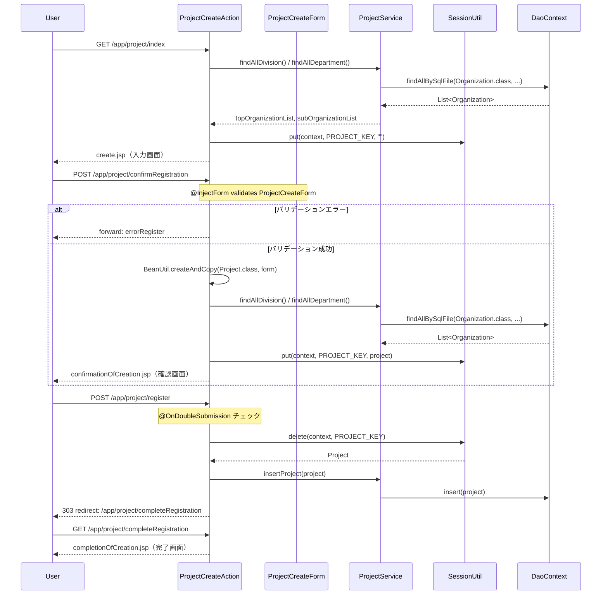

# Code Analysis: ProjectCreateAction

**Generated**: 2026-03-13 16:31:13
**Target**: プロジェクト登録処理（入力→確認→登録→完了の4ステップフロー）
**Modules**: proman-web
**Analysis Duration**: approx. 3m 3s

---

## Overview

`ProjectCreateAction` はNablarch 5 Webアプリケーションにおけるプロジェクト登録機能のアクションクラスである。入力画面表示 → バリデーション＆確認画面表示 → DB登録 → 完了画面表示 という4ステップのCRUD登録フローを実装している。

主な特徴：
- `@InjectForm` によるBean Validationを使ったフォームバリデーション
- `SessionUtil` を使ったセッションストアへのエンティティ保存（確認画面→登録の連携）
- `@OnDoubleSubmission` による二重サブミット防止
- `BeanUtil.createAndCopy()` によるフォームとエンティティ間のプロパティコピー
- `ProjectService` を介した `DaoContext`（UniversalDao）によるDB操作

---

## Architecture

### Dependency Graph

```mermaid
classDiagram
    class ProjectCreateAction
    class ProjectCreateForm {
        <<Form>>
    }
    class ProjectService
    class Project {
        <<Entity>>
    }
    class Organization {
        <<Entity>>
    }
    class BeanUtil {
        <<Nablarch>>
    }
    class SessionUtil {
        <<Nablarch>>
    }
    class DateUtil {
        <<Nablarch>>
    }
    class ExecutionContext {
        <<Nablarch>>
    }
    class DaoContext {
        <<Nablarch>>
    }
    class HttpRequest {
        <<Nablarch>>
    }
    class HttpResponse {
        <<Nablarch>>
    }

    ProjectCreateForm ..|> Serializable : implements
    ProjectCreateAction ..> ProjectCreateForm : validates
    ProjectCreateAction ..> BeanUtil : copies properties
    ProjectCreateAction ..> SessionUtil : stores/retrieves
    ProjectCreateAction ..> DateUtil : formats dates
    ProjectCreateAction ..> ExecutionContext : gets/sets scope vars
    ProjectCreateAction ..> ProjectService : delegates DB ops
    ProjectService ..> DaoContext : queries/inserts
    ProjectService ..> Project : persists
    ProjectService ..> Organization : queries
```



**Note**: This diagram uses Mermaid `classDiagram` syntax to show class names and their relationships. Use `--|>` for inheritance (extends/implements) and `..>` for dependencies (uses/creates).

### Component Summary

| Component | Role | Type | Dependencies |
|-----------|------|------|--------------|
| ProjectCreateAction | プロジェクト登録の4ステップフロー制御 | Action | ProjectCreateForm, ProjectService, BeanUtil, SessionUtil, DateUtil, ExecutionContext |
| ProjectCreateForm | プロジェクト登録入力フォーム（Bean Validation） | Form | DateRelationUtil |
| ProjectService | DB操作のサービス層（DaoContextラッパー） | Service | DaoContext, Project, Organization |
| Project | プロジェクトエンティティ | Entity | なし |
| Organization | 組織（事業部/部門）エンティティ | Entity | なし |

---

## Flow

### Processing Flow

プロジェクト登録は以下の4ステップで構成される：

1. **index（初期画面表示）**: 事業部・部門のリストをDBから取得してリクエストスコープに設定し、入力画面（create.jsp）を返す。

2. **confirmRegistration（確認画面表示）**: `@InjectForm` で `ProjectCreateForm` にバリデーションを実行。バリデーションエラーの場合は `@OnError` でエラー画面へフォーワード。成功時は `BeanUtil.createAndCopy()` でフォームから `Project` エンティティを生成し、`SessionUtil.put()` でセッションストアに保存して確認画面を返す。

3. **register（登録処理）**: `@OnDoubleSubmission` で二重サブミットを防止。`SessionUtil.delete()` でセッションから `Project` を取得・削除し、`ProjectService.insertProject()` でDBに登録。303リダイレクトで完了画面へ遷移（PRGパターン）。

4. **completeRegistration（完了画面）**: 完了JSPを返すだけのシンプルなメソッド。

5. **backToEnterRegistration（入力画面へ戻る）**: セッションから `Project` を取得し、`BeanUtil.createAndCopy()` で `ProjectCreateForm` に変換してリクエストスコープに設定。日付フィールドを `DateUtil.formatDate()` でyyyy/MM/dd形式に変換してから戻る。

### Sequence Diagram



---

## Components

### ProjectCreateAction

**ファイル**: [ProjectCreateAction.java](<../../.lw/nab-official/v5/nablarch-system-development-guide/Sample_Project/Source_Code/proman-project/proman-web/src/main/java/com/nablarch/example/proman/web/project/ProjectCreateAction.java>)

**役割**: プロジェクト登録機能の全ステップを管理するアクションクラス。

**主要メソッド**:

- `index(HttpRequest, ExecutionContext)` L33-39: 入力画面の初期表示。事業部・部門リストをリクエストスコープに設定する。
- `confirmRegistration(HttpRequest, ExecutionContext)` L48-63: `@InjectForm` + `@OnError` でバリデーション実行。成功時にセッションへ保存して確認画面表示。
- `register(HttpRequest, ExecutionContext)` L72-78: `@OnDoubleSubmission` 付き。セッションから取得してDB登録し、303リダイレクト。
- `completeRegistration(HttpRequest, ExecutionContext)` L87-89: 完了画面JSPを返す。
- `backToEnterRegistration(HttpRequest, ExecutionContext)` L98-118: セッションから取得し、日付フォーマットを調整して入力画面に戻る。
- `setOrganizationAndDivisionToRequestScope(ExecutionContext)` L125-136: 事業部・部門リストをDBから取得してリクエストスコープへ設定する共通メソッド。

**依存関係**: ProjectCreateForm, ProjectService, BeanUtil, SessionUtil, DateUtil, ExecutionContext, HttpRequest, HttpResponse

---

### ProjectCreateForm

**ファイル**: [ProjectCreateForm.java](<../../.lw/nab-official/v5/nablarch-system-development-guide/Sample_Project/Source_Code/proman-project/proman-web/src/main/java/com/nablarch/example/proman/web/project/ProjectCreateForm.java>)

**役割**: プロジェクト登録の入力フォームクラス。Bean Validationアノテーションでバリデーションルールを定義し、`Serializable` を実装してセッションストアへの保存を可能にする。

**主要フィールド**: projectName, projectType, projectClass, projectStartDate, projectEndDate, divisionId, organizationId, clientId, pmKanjiName, plKanjiName, note, salesAmount

**バリデーション**: 各フィールドに `@Required`・`@Domain` を使用。`isValidProjectPeriod()` L329-331 でプロジェクト開始日・終了日の整合性チェック（`@AssertTrue`）。

**依存関係**: DateRelationUtil（日付整合性チェック）

---

### ProjectService

**ファイル**: [ProjectService.java](<../../.lw/nab-official/v5/nablarch-system-development-guide/Sample_Project/Source_Code/proman-project/proman-web/src/main/java/com/nablarch/example/proman/web/project/ProjectService.java>)

**役割**: DBアクセスをカプセル化するサービスクラス。`DaoContext`（UniversalDao）を内部に持ち、`ProjectCreateAction` から利用される。

**主要メソッド**:
- `findAllDivision()` L50-52: 全事業部をSQLファイルで検索。
- `findAllDepartment()` L59-61: 全部門をSQLファイルで検索。
- `findOrganizationById(Integer)` L70-73: 組織IDで1件検索（戻る処理で使用）。
- `insertProject(Project)` L80-82: プロジェクトをDBに登録。

**依存関係**: DaoContext（DaoFactory経由で生成）, Project, Organization

---

## Nablarch Framework Usage

### @InjectForm

**クラス**: `nablarch.common.web.interceptor.InjectForm`

**説明**: 業務アクションメソッドに付与するインターセプターアノテーション。リクエストパラメータを指定されたフォームクラスにバインドし、Bean Validationを実行する。

**使用方法**:
```java
@InjectForm(form = ProjectCreateForm.class, prefix = "form")
@OnError(type = ApplicationException.class, path = "forward:///app/project/errorRegister")
public HttpResponse confirmRegistration(HttpRequest request, ExecutionContext context) {
    ProjectCreateForm form = context.getRequestScopedVar("form");
    // ...
}
```

**重要ポイント**:
- ✅ **`@OnError` とセットで使う**: バリデーションエラー時の遷移先を必ず `@OnError` で指定する
- ✅ **フォームは `Serializable` を実装**: セッションストアへの保存要件ではなく、インターセプター処理のために必要
- ⚠️ **フォームはセッションに保存しない**: セッションストアに格納するのはエンティティのみ（`BeanUtil.createAndCopy()` で変換してから保存）
- 💡 **バリデーション済みオブジェクト取得**: `context.getRequestScopedVar("form")` でバリデーション済みフォームを取得できる

**このコードでの使い方**:
- `confirmRegistration()` メソッド（L48）に付与
- `ProjectCreateForm.class`、prefix `"form"` でリクエストパラメータをバインド
- バリデーションエラー時は `forward:///app/project/errorRegister` へフォーワード

**詳細**: [Web Application Client_create2](../../.claude/skills/nabledge-5/docs/processing-pattern/web-application/web-application-client_create2.md)

---

### SessionUtil

**クラス**: `nablarch.common.web.session.SessionUtil`

**説明**: セッションストアへのデータ保存・取得・削除を行うユーティリティクラス。確認画面と登録処理の間でエンティティデータを引き渡す際に使用する。

**使用方法**:
```java
// 保存
SessionUtil.put(context, "projectCreateActionProject", project);

// 取得
Project project = SessionUtil.get(context, "projectCreateActionProject");

// 取得して削除
Project project = SessionUtil.delete(context, "projectCreateActionProject");
```

**重要ポイント**:
- ✅ **エンティティをセッションに保存**: フォームではなくエンティティ（`Project`）を保存する
- ✅ **登録後は `delete()` で削除**: `SessionUtil.delete()` を使って取得と同時に削除し、セッションを清潔に保つ
- ⚠️ **キーの一意性**: `PROJECT_KEY = "projectCreateActionProject"` のように定数化して管理する
- 💡 **PRGパターンとの組み合わせ**: セッションに保存→リダイレクト→セッションから取得→登録 の流れで二重サブミットとブラウザバックを防止

**このコードでの使い方**:
- `confirmRegistration()` L59: `SessionUtil.put()` で `Project` エンティティをセッションに保存
- `register()` L74: `SessionUtil.delete()` でセッションから取得・削除して登録処理
- `backToEnterRegistration()` L100: `SessionUtil.get()` でセッションから取得して入力画面に戻す
- `setOrganizationAndDivisionToRequestScope()` L132: `SessionUtil.put(context, PROJECT_KEY, "")` で初期化

**詳細**: [Web Application Client_create2](../../.claude/skills/nabledge-5/docs/processing-pattern/web-application/web-application-client_create2.md)

---

### @OnDoubleSubmission

**クラス**: `nablarch.common.web.token.OnDoubleSubmission`

**説明**: 業務アクションメソッドに付与するインターセプターアノテーション。ページトークンを使って二重サブミット（ユーザーの重複クリックやブラウザの戻るボタン→再送信）を検出・防止する。

**使用方法**:
```java
@OnDoubleSubmission
public HttpResponse register(HttpRequest request, ExecutionContext context) {
    // DB登録処理
}
```

**重要ポイント**:
- ✅ **DB更新・登録メソッドに必ず付与**: データ変更を伴う処理には必ず使用する
- ⚠️ **JSP側の `allowDoubleSubmission="false"` と組み合わせる**: サーバサイドとクライアントサイドの両方で制御する
- 💡 **デフォルト遷移先の設定**: デフォルトのエラー遷移先はコンポーネント設定で変更可能
- 🎯 **PRGパターンとの併用**: `@OnDoubleSubmission` + 303リダイレクトでブラウザリロードによる再送信も防止

**このコードでの使い方**:
- `register()` メソッド（L72）に付与して、プロジェクト登録の二重実行を防止

**詳細**: [Web Application Client_create4](../../.claude/skills/nabledge-5/docs/processing-pattern/web-application/web-application-client_create4.md)

---

### BeanUtil

**クラス**: `nablarch.core.beans.BeanUtil`

**説明**: JavaBeansのプロパティコピーを行うユーティリティクラス。同名プロパティを自動的にコピーし、フォームとエンティティ間の変換を容易にする。

**使用方法**:
```java
// フォーム → エンティティ
Project project = BeanUtil.createAndCopy(Project.class, form);

// エンティティ → フォーム（戻る処理）
ProjectCreateForm form = BeanUtil.createAndCopy(ProjectCreateForm.class, project);
```

**重要ポイント**:
- ✅ **同名プロパティを自動コピー**: フォームとエンティティで同じプロパティ名を使うことで変換コードが不要になる
- ⚠️ **型変換に注意**: フォームは全フィールドがString型、エンティティは適切な型（Integer等）。型変換はBeanUtilが自動で行うが、フォーマットに依存する場合は手動変換が必要（L103-106の日付変換参照）
- 💡 **コピー後の個別設定**: `BeanUtil.createAndCopy()` 後に個別フィールドをセットできる（L55: `project.setClientId(0)`）

**このコードでの使い方**:
- `confirmRegistration()` L52: `ProjectCreateForm` → `Project` への変換
- `backToEnterRegistration()` L101: `Project` → `ProjectCreateForm` への逆変換

**詳細**: [Web Application Client_create3](../../.claude/skills/nabledge-5/docs/processing-pattern/web-application/web-application-client_create3.md)

---

## References

### Source Files

- [ProjectCreateAction.java (.lw/nab-official/v5/nablarch-system-development-guide/en/Sample_Project/Source_Code/proman-project/proman-web/src/main/java/com/nablarch/example/proman/web/project)](../../.lw/nab-official/v5/nablarch-system-development-guide/en/Sample_Project/Source_Code/proman-project/proman-web/src/main/java/com/nablarch/example/proman/web/project/ProjectCreateAction.java) - ProjectCreateAction
- [ProjectCreateAction.java (.lw/nab-official/v5/nablarch-system-development-guide/Sample_Project/Source_Code/proman-project/proman-web/src/main/java/com/nablarch/example/proman/web/project)](../../.lw/nab-official/v5/nablarch-system-development-guide/Sample_Project/Source_Code/proman-project/proman-web/src/main/java/com/nablarch/example/proman/web/project/ProjectCreateAction.java) - ProjectCreateAction
- [ProjectCreateAction.java (.lw/nab-official/v6/nablarch-system-development-guide/en/Sample_Project/Source_Code/proman-project/proman-web/src/main/java/com/nablarch/example/proman/web/project)](../../.lw/nab-official/v6/nablarch-system-development-guide/en/Sample_Project/Source_Code/proman-project/proman-web/src/main/java/com/nablarch/example/proman/web/project/ProjectCreateAction.java) - ProjectCreateAction
- [ProjectCreateAction.java (.lw/nab-official/v6/nablarch-system-development-guide/Sample_Project/Source_Code/proman-project/proman-web/src/main/java/com/nablarch/example/proman/web/project)](../../.lw/nab-official/v6/nablarch-system-development-guide/Sample_Project/Source_Code/proman-project/proman-web/src/main/java/com/nablarch/example/proman/web/project/ProjectCreateAction.java) - ProjectCreateAction
- [ProjectCreateForm.java (.lw/nab-official/v5/nablarch-system-development-guide/en/Sample_Project/Source_Code/proman-project/proman-web/src/main/java/com/nablarch/example/proman/web/project)](../../.lw/nab-official/v5/nablarch-system-development-guide/en/Sample_Project/Source_Code/proman-project/proman-web/src/main/java/com/nablarch/example/proman/web/project/ProjectCreateForm.java) - ProjectCreateForm
- [ProjectCreateForm.java (.lw/nab-official/v5/nablarch-system-development-guide/Sample_Project/Source_Code/proman-project/proman-web/src/main/java/com/nablarch/example/proman/web/project)](../../.lw/nab-official/v5/nablarch-system-development-guide/Sample_Project/Source_Code/proman-project/proman-web/src/main/java/com/nablarch/example/proman/web/project/ProjectCreateForm.java) - ProjectCreateForm
- [ProjectCreateForm.java (.lw/nab-official/v6/nablarch-system-development-guide/en/Sample_Project/Source_Code/proman-project/proman-web/src/main/java/com/nablarch/example/proman/web/project)](../../.lw/nab-official/v6/nablarch-system-development-guide/en/Sample_Project/Source_Code/proman-project/proman-web/src/main/java/com/nablarch/example/proman/web/project/ProjectCreateForm.java) - ProjectCreateForm
- [ProjectCreateForm.java (.lw/nab-official/v6/nablarch-system-development-guide/Sample_Project/Source_Code/proman-project/proman-web/src/main/java/com/nablarch/example/proman/web/project)](../../.lw/nab-official/v6/nablarch-system-development-guide/Sample_Project/Source_Code/proman-project/proman-web/src/main/java/com/nablarch/example/proman/web/project/ProjectCreateForm.java) - ProjectCreateForm
- [ProjectService.java (.lw/nab-official/v5/nablarch-system-development-guide/en/Sample_Project/Source_Code/proman-project/proman-web/src/main/java/com/nablarch/example/proman/web/project)](../../.lw/nab-official/v5/nablarch-system-development-guide/en/Sample_Project/Source_Code/proman-project/proman-web/src/main/java/com/nablarch/example/proman/web/project/ProjectService.java) - ProjectService
- [ProjectService.java (.lw/nab-official/v5/nablarch-system-development-guide/Sample_Project/Source_Code/proman-project/proman-web/src/main/java/com/nablarch/example/proman/web/project)](../../.lw/nab-official/v5/nablarch-system-development-guide/Sample_Project/Source_Code/proman-project/proman-web/src/main/java/com/nablarch/example/proman/web/project/ProjectService.java) - ProjectService
- [ProjectService.java (.lw/nab-official/v6/nablarch-system-development-guide/en/Sample_Project/Source_Code/proman-project/proman-web/src/main/java/com/nablarch/example/proman/web/project)](../../.lw/nab-official/v6/nablarch-system-development-guide/en/Sample_Project/Source_Code/proman-project/proman-web/src/main/java/com/nablarch/example/proman/web/project/ProjectService.java) - ProjectService
- [ProjectService.java (.lw/nab-official/v6/nablarch-system-development-guide/Sample_Project/Source_Code/proman-project/proman-web/src/main/java/com/nablarch/example/proman/web/project)](../../.lw/nab-official/v6/nablarch-system-development-guide/Sample_Project/Source_Code/proman-project/proman-web/src/main/java/com/nablarch/example/proman/web/project/ProjectService.java) - ProjectService

### Knowledge Base (Nabledge-5)

- [Web Application Client_create2](../../.claude/skills/nabledge-5/docs/processing-pattern/web-application/web-application-client_create2.md)
- [Web Application Client_create3](../../.claude/skills/nabledge-5/docs/processing-pattern/web-application/web-application-client_create3.md)
- [Web Application Client_create4](../../.claude/skills/nabledge-5/docs/processing-pattern/web-application/web-application-client_create4.md)
- [Web Application Getting Started Project Update](../../.claude/skills/nabledge-5/docs/processing-pattern/web-application/web-application-getting-started-project-update.md)

### Official Documentation


- [BeanUtil](https://nablarch.github.io/docs/LATEST/javadoc/nablarch/core/beans/BeanUtil.html)
- [Client Create2](https://nablarch.github.io/docs/LATEST/doc/application_framework/application_framework/web/getting_started/client_create/client_create2.html)
- [Client Create3](https://nablarch.github.io/docs/LATEST/doc/application_framework/application_framework/web/getting_started/client_create/client_create3.html)
- [Client Create4](https://nablarch.github.io/docs/LATEST/doc/application_framework/application_framework/web/getting_started/client_create/client_create4.html)
- [Index](https://nablarch.github.io/docs/LATEST/doc/application_framework/application_framework/web/getting_started/project_update/index.html)
- [InjectForm](https://nablarch.github.io/docs/LATEST/javadoc/nablarch/common/web/interceptor/InjectForm.html)
- [NoDataException](https://nablarch.github.io/docs/LATEST/javadoc/nablarch/common/dao/NoDataException.html)
- [OnDoubleSubmission](https://nablarch.github.io/docs/LATEST/javadoc/nablarch/common/web/token/OnDoubleSubmission.html)
- [OnError](https://nablarch.github.io/docs/LATEST/javadoc/nablarch/fw/web/interceptor/OnError.html)
- [Required](https://nablarch.github.io/docs/LATEST/javadoc/nablarch/core/validation/ee/Required.html)
- [ResourceLocator](https://nablarch.github.io/docs/LATEST/javadoc/nablarch/fw/web/ResourceLocator.html)
- [SessionUtil](https://nablarch.github.io/docs/LATEST/javadoc/nablarch/common/web/session/SessionUtil.html)
- [UniversalDao](https://nablarch.github.io/docs/LATEST/javadoc/nablarch/common/dao/UniversalDao.html)

---

**Note**: This documentation was generated by the code-analysis workflow of the nabledge-5 skill.
