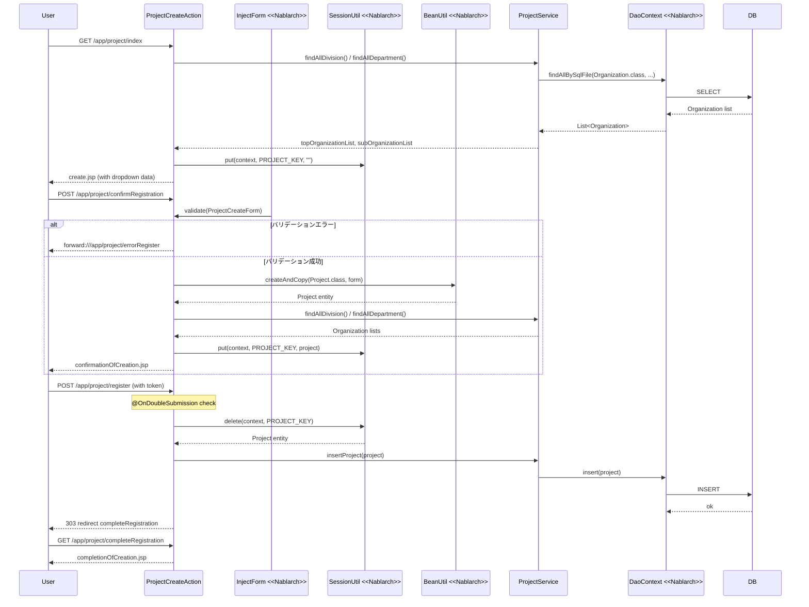

# Code Analysis: ProjectCreateAction

**Generated**: 2026-03-13 17:14:30
**Target**: プロジェクト登録処理アクション
**Modules**: proman-web
**Analysis Duration**: approx. 3m 58s

---

## Overview

`ProjectCreateAction` はNablarch 5のWebアプリケーションにおけるプロジェクト登録機能のアクションクラス。入力→確認→登録完了の4ステップ画面遷移を管理する。

主なフロー:
1. `index()` - 登録初期画面の表示（組織/部門プルダウンをDBから取得）
2. `confirmRegistration()` - 入力検証後、確認画面へ遷移（フォーム内容をSessionに保存）
3. `register()` - 二重サブミットチェック後にDBへ登録し、完了画面へリダイレクト
4. `completeRegistration()` - 登録完了画面の表示
5. `backToEnterRegistration()` - 確認画面から入力画面への戻り処理

NablarchのインターセプタパターンとSessionUtilを活用した標準的な入力確認完了フロー実装。

---

## Architecture

### Dependency Graph

```mermaid
classDiagram
    class ProjectCreateAction
    class ProjectCreateForm {
        <<Form>>
    }
    class ProjectService
    class Project {
        <<Entity>>
    }
    class Organization {
        <<Entity>>
    }
    class DaoContext {
        <<Nablarch>>
    }
    class SessionUtil {
        <<Nablarch>>
    }
    class BeanUtil {
        <<Nablarch>>
    }
    class ExecutionContext {
        <<Nablarch>>
    }
    class InjectForm {
        <<Nablarch>>
    }
    class OnDoubleSubmission {
        <<Nablarch>>
    }
    class OnError {
        <<Nablarch>>
    }
    class DateUtil {
        <<Nablarch>>
    }

    ProjectCreateAction ..> ProjectCreateForm : validates
    ProjectCreateAction ..> ProjectService : delegates to
    ProjectCreateAction ..> SessionUtil : persists
    ProjectCreateAction ..> BeanUtil : converts
    ProjectCreateAction ..> ExecutionContext : uses
    ProjectCreateAction ..> InjectForm : uses
    ProjectCreateAction ..> OnDoubleSubmission : uses
    ProjectCreateAction ..> OnError : uses
    ProjectCreateAction ..> DateUtil : formats
    ProjectService ..> DaoContext : queries
    ProjectService ..> Project : persists
    ProjectService ..> Organization : queries
    ProjectCreateForm ..|> Serializable : implements
```



**Note**: This diagram uses Mermaid `classDiagram` syntax to show class names and their relationships. Use `--|>` for inheritance (extends/implements) and `..>` for dependencies (uses/creates).

### Component Summary

| Component | Role | Type | Dependencies |
|-----------|------|------|--------------|
| ProjectCreateAction | プロジェクト登録の画面遷移・処理制御 | Action | ProjectCreateForm, ProjectService, SessionUtil, BeanUtil, ExecutionContext, DateUtil |
| ProjectCreateForm | プロジェクト登録入力フォーム（バリデーション付き） | Form | DateRelationUtil |
| ProjectService | プロジェクト・組織のDB操作を担当 | Service | DaoContext, Project, Organization |
| Project | プロジェクトエンティティ | Entity | なし |
| Organization | 組織（事業部/部門）エンティティ | Entity | なし |

---

## Flow

### Processing Flow

プロジェクト登録は入力→確認→登録完了の標準パターンで実装されている。

1. **初期表示** (`index`): 事業部/部門プルダウンリストをDBから取得し、リクエストスコープに設定して入力画面を表示する。
2. **確認画面表示** (`confirmRegistration`): `@InjectForm`でフォームのバリデーションを実行し、エラー時は`@OnError`で`errorRegister`へforward。成功時はフォームをEntityに変換し、Sessionに保存して確認画面を表示する。
3. **登録実行** (`register`): `@OnDoubleSubmission`で二重送信を防止し、SessionからProjectを取得してDB登録後、303リダイレクトで完了画面へ遷移する。
4. **完了画面表示** (`completeRegistration`): 完了画面のJSPを返す。
5. **入力画面へ戻る** (`backToEnterRegistration`): SessionのProjectデータをフォームに復元し、日付フォーマット変換と組織階層の再取得を行って入力画面へ戻る。

### Sequence Diagram



---

## Components

### ProjectCreateAction

**ファイル**: [ProjectCreateAction.java](../../.lw/nab-official/v5/nablarch-system-development-guide/Sample_Project/Source_Code/proman-project/proman-web/src/main/java/com/nablarch/example/proman/web/project/ProjectCreateAction.java)

**役割**: プロジェクト登録機能の画面遷移とビジネスロジック調整。Nablarchのインターセプタ（`@InjectForm`、`@OnError`、`@OnDoubleSubmission`）を使用した標準パターンで実装。

**主要メソッド**:

- `index(HttpRequest, ExecutionContext)` (L33-39): 登録初期画面を表示。組織/部門のプルダウンデータをDBから取得してリクエストスコープに設定する。
- `confirmRegistration(HttpRequest, ExecutionContext)` (L48-63): `@InjectForm`でフォームのバリデーションを実施し、成功時はProjectエンティティに変換してSessionに保存し確認画面を表示する。
- `register(HttpRequest, ExecutionContext)` (L72-78): `@OnDoubleSubmission`で二重送信を防止。SessionからProjectを取得してDBに登録後、303リダイレクトで完了画面へ遷移。
- `backToEnterRegistration(HttpRequest, ExecutionContext)` (L98-118): SessionのProjectをフォームに逆変換し、日付フォーマットと組織階層情報を復元して入力画面へ戻る。

**依存**:
- `ProjectCreateForm` - 入力フォーム（バリデーション）
- `ProjectService` - DB操作の委譲先
- `SessionUtil` - Session変数の読み書き（`put`/`get`/`delete`）
- `BeanUtil` - Formとエンティティ間のBean変換
- `DateUtil` - 日付フォーマット変換（`yyyy/MM/dd`形式）

**実装ポイント**:
- `register()` は `SessionUtil.delete()` を使用することで、登録後はSessionからProjectが自動削除される
- `confirmRegistration()` では `project.setClientId(0)` のTODOコメントがあり、顧客選択機能が未実装

---

### ProjectCreateForm

**ファイル**: [ProjectCreateForm.java](../../.lw/nab-official/v5/nablarch-system-development-guide/Sample_Project/Source_Code/proman-project/proman-web/src/main/java/com/nablarch/example/proman/web/project/ProjectCreateForm.java)

**役割**: プロジェクト登録入力フォーム。`@Required`と`@Domain`アノテーションによるバリデーション定義と、`@AssertTrue`による相関バリデーション（開始日/終了日の整合性チェック）を持つ。

**主要フィールドとバリデーション** (L25-104):
- `projectName`: `@Required` + `@Domain("projectName")`
- `projectStartDate`, `projectEndDate`: `@Required` + `@Domain("date")`
- `divisionId`, `organizationId`: `@Required` + `@Domain("organizationId")`
- `isValidProjectPeriod()` (L329-331): `@AssertTrue`による開始日/終了日の相関バリデーション

**依存**: `DateRelationUtil` (proman-common) - 日付期間の妥当性チェック

---

### ProjectService

**ファイル**: [ProjectService.java](../../.lw/nab-official/v5/nablarch-system-development-guide/Sample_Project/Source_Code/proman-project/proman-web/src/main/java/com/nablarch/example/proman/web/project/ProjectService.java)

**役割**: プロジェクトと組織のデータアクセスを担当するサービスクラス。`DaoContext`（UniversalDAO）をラップして、SQLファイルを使用した検索とCRUD操作を提供する。

**主要メソッド**:
- `findAllDivision()` (L50-52): 全事業部をSQLファイル`FIND_ALL_DIVISION`で取得
- `findAllDepartment()` (L59-61): 全部門をSQLファイル`FIND_ALL_DEPARTMENT`で取得
- `findOrganizationById(Integer)` (L70-73): 指定IDの組織を主キー検索で取得
- `insertProject(Project)` (L80-82): プロジェクトをDBに登録（`universalDao.insert()`）

**依存**: `DaoContext` (UniversalDAO) - 実際のDB操作

---

## Nablarch Framework Usage

### InjectForm

**クラス**: `nablarch.common.web.interceptor.InjectForm`

**説明**: アクションメソッドにアノテーションで付与することで、HTTPリクエストパラメータをFormクラスにバインドし、Bean Validationを実行するインターセプタ。

**使用方法**:
```java
@InjectForm(form = ProjectCreateForm.class, prefix = "form")
@OnError(type = ApplicationException.class, path = "forward:///app/project/errorRegister")
public HttpResponse confirmRegistration(HttpRequest request, ExecutionContext context) {
    ProjectCreateForm form = context.getRequestScopedVar("form");
    // ...
}
```

**重要ポイント**:
- ✅ **`@OnError`とセットで使用する**: バリデーションエラー時の遷移先を必ず指定すること
- ✅ **フォームはリクエストスコープから取得**: `context.getRequestScopedVar("form")` でフォームを取得する
- ⚠️ **prefixの指定**: HTMLフォームの`name`属性のプレフィックス（例: `form.projectName`）に合わせる

**このコードでの使い方**:
- `confirmRegistration()` (L48) でプロジェクト登録フォームのバリデーションを実行
- バリデーション失敗時は`@OnError`でエラー画面へforward

**詳細**: [Handlers InjectForm](../../.claude/skills/nabledge-5/docs/component/handlers/handlers-InjectForm.md)

---

### OnDoubleSubmission

**クラス**: `nablarch.common.web.token.OnDoubleSubmission`

**説明**: 二重サブミット（同一フォームの二重送信）を防止するインターセプタ。JSPの`n:form`タグに`useToken="true"`を設定し、トークンを発行/検証することで二重送信を検知する。

**使用方法**:
```java
@OnDoubleSubmission
public HttpResponse register(HttpRequest request, ExecutionContext context) {
    // 登録処理
}
```

```jsp
<%-- 確認画面のJSP --%>
<n:form useToken="true">
    <n:button uri="/app/project/register">登録する</n:button>
</n:form>
```

**重要ポイント**:
- ✅ **JSPにuseToken="true"が必要**: 確認画面のフォームに`useToken="true"`を設定しなければトークンが発行されない
- ⚠️ **二重送信時の動作**: デフォルトではエラーページへ遷移する（設定でカスタマイズ可能）
- 💡 **登録・更新・削除操作に使用**: データ変更を伴う操作に対して使用することで、ネットワーク遅延によるユーザの誤操作を防止できる

**このコードでの使い方**:
- `register()` (L72) に付与し、プロジェクト登録の二重実行を防止

**詳細**: [Handlers On_double_submission](../../.claude/skills/nabledge-5/docs/component/handlers/handlers-on_double_submission.md)

---

### OnError

**クラス**: `nablarch.fw.web.interceptor.OnError`

**説明**: アクションメソッドで指定した例外が発生した場合に、指定したパスへ自動的に遷移するインターセプタ。`@InjectForm`と組み合わせてバリデーションエラーのハンドリングに使用する。

**使用方法**:
```java
@InjectForm(form = ProjectCreateForm.class, prefix = "form")
@OnError(type = ApplicationException.class, path = "forward:///app/project/errorRegister")
public HttpResponse confirmRegistration(HttpRequest request, ExecutionContext context) { ... }
```

**重要ポイント**:
- ✅ **`@InjectForm`と必ずセットで使用**: バリデーションエラーは`ApplicationException`としてスローされる
- ⚠️ **forwardパスの指定**: `forward://` プレフィックスで内部フォワードを指定する（`/app/project/errorRegister`はアクションパス）

**このコードでの使い方**:
- `confirmRegistration()` (L49) でバリデーションエラー時にエラー登録画面へforward

**詳細**: [Handlers On_error](../../.claude/skills/nabledge-5/docs/component/handlers/handlers-on_error.md)

---

### SessionUtil

**クラス**: `nablarch.common.web.session.SessionUtil`

**説明**: NablarchのSessionStore機能へのユーティリティアクセスクラス。HTTPセッションを抽象化し、DBストア、HIDDENストア、HTTPセッションストア等にセッション変数を保存する。

**使用方法**:
```java
// セッションへの保存
SessionUtil.put(context, "projectCreateActionProject", project);

// セッションからの取得
Project project = SessionUtil.get(context, "projectCreateActionProject");

// セッションからの取得と削除
Project project = SessionUtil.delete(context, "projectCreateActionProject");
```

**重要ポイント**:
- ✅ **登録処理では`delete()`を使用**: `SessionUtil.delete()`は取得と同時に削除するため、登録完了後にセッションデータが残らない
- ⚠️ **入力→確認→完了画面間のデータ保持にはDBストアが推奨**: 複数タブでの操作を許容しない場合はDBストア、許容する場合はHIDDENストアを使用する
- 💡 **`ExecutionContext`のセッションスコープAPIは非推奨**: `ExecutionContext.setSessionScopedVar()`等は使用せず、`SessionUtil`を使うこと
- ⚠️ **セッション変数はSerializableが必要**: `SessionUtil.put()`で保存するオブジェクトは`java.io.Serializable`を実装していること

**このコードでの使い方**:
- `confirmRegistration()` (L59): `put()`でProjectをセッションに保存
- `register()` (L74): `delete()`でProjectを取得かつ削除（登録後にセッションクリア）
- `backToEnterRegistration()` (L100): `get()`でProjectを取得（セッションは保持）
- `setOrganizationAndDivisionToRequestScope()` (L132): `put(context, PROJECT_KEY, "")`でセッション初期化

**詳細**: [Libraries Session_store](../../.claude/skills/nabledge-5/docs/component/libraries/libraries-session_store.md)

---

### BeanUtil

**クラス**: `nablarch.core.beans.BeanUtil`

**説明**: JavaBeans間のプロパティコピーや、Beanの生成とコピーを行うユーティリティ。FormからEntityへの変換や、EntityからFormへの逆変換に使用する。

**使用方法**:
```java
// FormからEntityへの変換（新規生成+コピー）
Project project = BeanUtil.createAndCopy(Project.class, form);

// EntityからFormへの変換（新規生成+コピー）
ProjectCreateForm form = BeanUtil.createAndCopy(ProjectCreateForm.class, project);
```

**重要ポイント**:
- ✅ **同名プロパティが自動コピーされる**: FormとEntityで同名のプロパティがある場合、型変換を試みながらコピーする
- ⚠️ **型変換に注意**: StringからIntegerへの変換等、型が異なる場合は変換される（変換できない場合は実行時例外）

**このコードでの使い方**:
- `confirmRegistration()` (L52): `ProjectCreateForm` → `Project` への変換
- `backToEnterRegistration()` (L101): `Project` → `ProjectCreateForm` への逆変換

**詳細**: [Libraries Bean_util](../../.claude/skills/nabledge-5/docs/component/libraries/libraries-bean_util.md)

---

### DaoContext (UniversalDAO)

**クラス**: `nablarch.common.dao.DaoContext`

**説明**: JPA 2.0のアノテーションを使った簡易O/Rマッパー（UniversalDAO）のインタフェース。`@Table`、`@Id`等のJPAアノテーションを付けたEntityクラスに対してCRUD操作を提供する。SQLファイルを使用した柔軟な検索もサポート。

**使用方法**:
```java
// SQLファイルを使った全件検索
List<Organization> divisions = universalDao.findAllBySqlFile(Organization.class, "FIND_ALL_DIVISION");

// 主キー検索
Organization org = universalDao.findById(Organization.class, new Object[]{organizationId});

// 登録
universalDao.insert(project);
```

**重要ポイント**:
- ✅ **SQLファイルはEntityクラスと対応**: SQLのIDは`クラス名_メソッド名`の形式で管理する
- 💡 **単純なCRUDはSQL不要**: JPAアノテーションを付けたEntityを使えば、登録・更新・削除のSQLは自動生成される
- ⚠️ **主キー以外の条件での更新/削除は不可**: その場合は`nablarch.core.db.statement`のDatabase機能を使用すること

**このコードでの使い方**:
- `ProjectService.findAllDivision()` (L51): `findAllBySqlFile()`で事業部一覧をSQLファイル経由で取得
- `ProjectService.findAllDepartment()` (L60): `findAllBySqlFile()`で部門一覧をSQLファイル経由で取得
- `ProjectService.findOrganizationById()` (L72): `findById()`で主キーによる組織検索
- `ProjectService.insertProject()` (L81): `insert()`でプロジェクトをDB登録

**詳細**: [Libraries Universal_dao](../../.claude/skills/nabledge-5/docs/component/libraries/libraries-universal_dao.md)

---

### Bean Validation (@Required, @Domain, @AssertTrue)

**クラス**: `nablarch.core.validation.ee.Required`, `nablarch.core.validation.ee.Domain`, `javax.validation.constraints.AssertTrue`

**説明**: Java EE7のBean Validation（JSR349）に準拠したバリデーション機能。`@Required`は必須チェック、`@Domain`はドメイン定義に基づく文字種・長さ等の検証、`@AssertTrue`は複数フィールドにまたがる相関バリデーションに使用する。

**使用方法**:
```java
public class ProjectCreateForm implements Serializable {
    @Required
    @Domain("projectName")
    private String projectName;

    @Required
    @Domain("date")
    private String projectStartDate;

    @AssertTrue(message = "{com.nablarch.example.app.entity.core.validation.validator.DateRelationUtil.message}")
    public boolean isValidProjectPeriod() {
        return DateRelationUtil.isValid(projectStartDate, projectEndDate);
    }
}
```

**重要ポイント**:
- ✅ **`@Domain`はドメイン定義を参照**: `ProManDomainType`等で定義されたドメインの制約（最大長、文字種等）に従う
- ⚠️ **`@AssertTrue`はバリデーション順序が保証されない**: 単項目バリデーション前に相関バリデーションが実行される可能性があるため、`null`チェックを含めること
- 💡 **ドメインバリデーションの利点**: ドメインにルールを集約することでフォームクラスの変更が最小化できる

**このコードでの使い方**:
- `ProjectCreateForm` (L25-104): 全フィールドに`@Required`と`@Domain`でバリデーション定義
- `isValidProjectPeriod()` (L329): `@AssertTrue`で開始日が終了日より後の場合にエラー

**詳細**: [Libraries Bean_validation](../../.claude/skills/nabledge-5/docs/component/libraries/libraries-bean_validation.md)

---

## References

### Source Files

- [ProjectCreateAction.java (.lw/nab-official/v5/nablarch-system-development-guide/en/Sample_Project/Source_Code/proman-project/proman-web/src/main/java/com/nablarch/example/proman/web/project)](../../.lw/nab-official/v5/nablarch-system-development-guide/en/Sample_Project/Source_Code/proman-project/proman-web/src/main/java/com/nablarch/example/proman/web/project/ProjectCreateAction.java) - ProjectCreateAction
- [ProjectCreateAction.java (.lw/nab-official/v5/nablarch-system-development-guide/Sample_Project/Source_Code/proman-project/proman-web/src/main/java/com/nablarch/example/proman/web/project)](../../.lw/nab-official/v5/nablarch-system-development-guide/Sample_Project/Source_Code/proman-project/proman-web/src/main/java/com/nablarch/example/proman/web/project/ProjectCreateAction.java) - ProjectCreateAction
- [ProjectCreateAction.java (.lw/nab-official/v6/nablarch-system-development-guide/en/Sample_Project/Source_Code/proman-project/proman-web/src/main/java/com/nablarch/example/proman/web/project)](../../.lw/nab-official/v6/nablarch-system-development-guide/en/Sample_Project/Source_Code/proman-project/proman-web/src/main/java/com/nablarch/example/proman/web/project/ProjectCreateAction.java) - ProjectCreateAction
- [ProjectCreateAction.java (.lw/nab-official/v6/nablarch-system-development-guide/Sample_Project/Source_Code/proman-project/proman-web/src/main/java/com/nablarch/example/proman/web/project)](../../.lw/nab-official/v6/nablarch-system-development-guide/Sample_Project/Source_Code/proman-project/proman-web/src/main/java/com/nablarch/example/proman/web/project/ProjectCreateAction.java) - ProjectCreateAction
- [ProjectCreateForm.java (.lw/nab-official/v5/nablarch-system-development-guide/en/Sample_Project/Source_Code/proman-project/proman-web/src/main/java/com/nablarch/example/proman/web/project)](../../.lw/nab-official/v5/nablarch-system-development-guide/en/Sample_Project/Source_Code/proman-project/proman-web/src/main/java/com/nablarch/example/proman/web/project/ProjectCreateForm.java) - ProjectCreateForm
- [ProjectCreateForm.java (.lw/nab-official/v5/nablarch-system-development-guide/Sample_Project/Source_Code/proman-project/proman-web/src/main/java/com/nablarch/example/proman/web/project)](../../.lw/nab-official/v5/nablarch-system-development-guide/Sample_Project/Source_Code/proman-project/proman-web/src/main/java/com/nablarch/example/proman/web/project/ProjectCreateForm.java) - ProjectCreateForm
- [ProjectCreateForm.java (.lw/nab-official/v6/nablarch-system-development-guide/en/Sample_Project/Source_Code/proman-project/proman-web/src/main/java/com/nablarch/example/proman/web/project)](../../.lw/nab-official/v6/nablarch-system-development-guide/en/Sample_Project/Source_Code/proman-project/proman-web/src/main/java/com/nablarch/example/proman/web/project/ProjectCreateForm.java) - ProjectCreateForm
- [ProjectCreateForm.java (.lw/nab-official/v6/nablarch-system-development-guide/Sample_Project/Source_Code/proman-project/proman-web/src/main/java/com/nablarch/example/proman/web/project)](../../.lw/nab-official/v6/nablarch-system-development-guide/Sample_Project/Source_Code/proman-project/proman-web/src/main/java/com/nablarch/example/proman/web/project/ProjectCreateForm.java) - ProjectCreateForm
- [ProjectService.java (.lw/nab-official/v5/nablarch-system-development-guide/en/Sample_Project/Source_Code/proman-project/proman-web/src/main/java/com/nablarch/example/proman/web/project)](../../.lw/nab-official/v5/nablarch-system-development-guide/en/Sample_Project/Source_Code/proman-project/proman-web/src/main/java/com/nablarch/example/proman/web/project/ProjectService.java) - ProjectService
- [ProjectService.java (.lw/nab-official/v5/nablarch-system-development-guide/Sample_Project/Source_Code/proman-project/proman-web/src/main/java/com/nablarch/example/proman/web/project)](../../.lw/nab-official/v5/nablarch-system-development-guide/Sample_Project/Source_Code/proman-project/proman-web/src/main/java/com/nablarch/example/proman/web/project/ProjectService.java) - ProjectService
- [ProjectService.java (.lw/nab-official/v6/nablarch-system-development-guide/en/Sample_Project/Source_Code/proman-project/proman-web/src/main/java/com/nablarch/example/proman/web/project)](../../.lw/nab-official/v6/nablarch-system-development-guide/en/Sample_Project/Source_Code/proman-project/proman-web/src/main/java/com/nablarch/example/proman/web/project/ProjectService.java) - ProjectService
- [ProjectService.java (.lw/nab-official/v6/nablarch-system-development-guide/Sample_Project/Source_Code/proman-project/proman-web/src/main/java/com/nablarch/example/proman/web/project)](../../.lw/nab-official/v6/nablarch-system-development-guide/Sample_Project/Source_Code/proman-project/proman-web/src/main/java/com/nablarch/example/proman/web/project/ProjectService.java) - ProjectService

### Knowledge Base (Nabledge-5)

- [Handlers InjectForm](../../.claude/skills/nabledge-5/docs/component/handlers/handlers-InjectForm.md)
- [Handlers On_double_submission](../../.claude/skills/nabledge-5/docs/component/handlers/handlers-on_double_submission.md)
- [Handlers On_error](../../.claude/skills/nabledge-5/docs/component/handlers/handlers-on_error.md)
- [Libraries Session_store](../../.claude/skills/nabledge-5/docs/component/libraries/libraries-session_store.md)
- [Libraries Bean_util](../../.claude/skills/nabledge-5/docs/component/libraries/libraries-bean_util.md)
- [Libraries Universal_dao](../../.claude/skills/nabledge-5/docs/component/libraries/libraries-universal_dao.md)
- [Libraries Bean_validation](../../.claude/skills/nabledge-5/docs/component/libraries/libraries-bean_validation.md)

### Official Documentation


- [AesEncryptor](https://nablarch.github.io/docs/LATEST/javadoc/nablarch/common/encryption/AesEncryptor.html)
- [ApplicationException](https://nablarch.github.io/docs/LATEST/javadoc/nablarch/core/message/ApplicationException.html)
- [AssertTrue](https://nablarch.github.io/docs/LATEST/javadoc/javax/validation/constraints/AssertTrue.html)
- [Base64Key](https://nablarch.github.io/docs/LATEST/javadoc/nablarch/common/encryption/Base64Key.html)
- [Base64Util](https://nablarch.github.io/docs/LATEST/javadoc/nablarch/core/util/Base64Util.html)
- [BasicConversionManager](https://nablarch.github.io/docs/LATEST/javadoc/nablarch/core/beans/BasicConversionManager.html)
- [BasicDaoContextFactory](https://nablarch.github.io/docs/LATEST/javadoc/nablarch/common/dao/BasicDaoContextFactory.html)
- [BasicDoubleSubmissionHandler](https://nablarch.github.io/docs/LATEST/javadoc/nablarch/common/web/token/BasicDoubleSubmissionHandler.html)
- [Bean Util](https://nablarch.github.io/docs/LATEST/doc/application_framework/application_framework/libraries/bean_util.html)
- [Bean Validation](https://nablarch.github.io/docs/LATEST/doc/application_framework/application_framework/libraries/validation/bean_validation.html)
- [BeanUtil](https://nablarch.github.io/docs/LATEST/javadoc/nablarch/core/beans/BeanUtil.html)
- [BeanValidationStrategy](https://nablarch.github.io/docs/LATEST/javadoc/nablarch/common/web/validator/BeanValidationStrategy.html)
- [CachingCharsetDef](https://nablarch.github.io/docs/LATEST/javadoc/nablarch/core/validation/validator/unicode/CachingCharsetDef.html)
- [CompositeCharsetDef](https://nablarch.github.io/docs/LATEST/javadoc/nablarch/core/validation/validator/unicode/CompositeCharsetDef.html)
- [ConnectionFactory](https://nablarch.github.io/docs/LATEST/javadoc/nablarch/core/db/connection/ConnectionFactory.html)
- [ConversionManager](https://nablarch.github.io/docs/LATEST/javadoc/nablarch/core/beans/ConversionManager.html)
- [Converter](https://nablarch.github.io/docs/LATEST/javadoc/nablarch/core/beans/Converter.html)
- [CopyOption](https://nablarch.github.io/docs/LATEST/javadoc/nablarch/core/beans/CopyOption.html)
- [CopyOptions.Builder](https://nablarch.github.io/docs/LATEST/javadoc/nablarch/core/beans/CopyOptions.Builder.html)
- [CopyOptions](https://nablarch.github.io/docs/LATEST/javadoc/nablarch/core/beans/CopyOptions.html)
- [DatabaseMetaDataExtractor](https://nablarch.github.io/docs/LATEST/javadoc/nablarch/common/dao/DatabaseMetaDataExtractor.html)
- [DbStore](https://nablarch.github.io/docs/LATEST/javadoc/nablarch/common/web/session/store/DbStore.html)
- [DeferredEntityList](https://nablarch.github.io/docs/LATEST/javadoc/nablarch/common/dao/DeferredEntityList.html)
- [Dialect](https://nablarch.github.io/docs/LATEST/javadoc/nablarch/core/db/dialect/Dialect.html)
- [DomainManager](https://nablarch.github.io/docs/LATEST/javadoc/nablarch/core/validation/ee/DomainManager.html)
- [Domain](https://nablarch.github.io/docs/LATEST/javadoc/nablarch/core/validation/ee/Domain.html)
- [DoubleSubmissionHandler](https://nablarch.github.io/docs/LATEST/javadoc/nablarch/common/web/token/DoubleSubmissionHandler.html)
- [EntityList](https://nablarch.github.io/docs/LATEST/javadoc/nablarch/common/dao/EntityList.html)
- [ExecutionContext](https://nablarch.github.io/docs/LATEST/javadoc/nablarch/fw/ExecutionContext.html)
- [ExtensionConverter](https://nablarch.github.io/docs/LATEST/javadoc/nablarch/core/beans/ExtensionConverter.html)
- [GenerationType](https://nablarch.github.io/docs/LATEST/javadoc/javax/persistence/GenerationType.html)
- [H2Dialect](https://nablarch.github.io/docs/LATEST/javadoc/nablarch/core/db/dialect/H2Dialect.html)
- [HttpErrorResponse](https://nablarch.github.io/docs/LATEST/javadoc/nablarch/fw/web/HttpErrorResponse.html)
- [HttpRequest](https://nablarch.github.io/docs/LATEST/javadoc/nablarch/fw/web/HttpRequest.html)
- [InjectForm](https://nablarch.github.io/docs/LATEST/doc/application_framework/application_framework/handlers/web_interceptor/InjectForm.html)
- [InjectForm](https://nablarch.github.io/docs/LATEST/javadoc/nablarch/common/web/interceptor/InjectForm.html)
- [ItemNamedConstraintViolationConverterFactory](https://nablarch.github.io/docs/LATEST/javadoc/nablarch/core/validation/ee/ItemNamedConstraintViolationConverterFactory.html)
- [JavaSerializeEncryptStateEncoder](https://nablarch.github.io/docs/LATEST/javadoc/nablarch/common/web/session/encoder/JavaSerializeEncryptStateEncoder.html)
- [JavaSerializeStateEncoder](https://nablarch.github.io/docs/LATEST/javadoc/nablarch/common/web/session/encoder/JavaSerializeStateEncoder.html)
- [JaxbStateEncoder](https://nablarch.github.io/docs/LATEST/javadoc/nablarch/common/web/session/encoder/JaxbStateEncoder.html)
- [LiteralCharsetDef](https://nablarch.github.io/docs/LATEST/javadoc/nablarch/core/validation/validator/unicode/LiteralCharsetDef.html)
- [MessageInterpolator](https://nablarch.github.io/docs/LATEST/javadoc/javax/validation/MessageInterpolator.html)
- [NablarchMessageInterpolator](https://nablarch.github.io/docs/LATEST/javadoc/nablarch/core/validation/ee/NablarchMessageInterpolator.html)
- [On Double Submission](https://nablarch.github.io/docs/LATEST/doc/application_framework/application_framework/handlers/web_interceptor/on_double_submission.html)
- [On Error](https://nablarch.github.io/docs/LATEST/doc/application_framework/application_framework/handlers/web_interceptor/on_error.html)
- [OnDoubleSubmission](https://nablarch.github.io/docs/LATEST/javadoc/nablarch/common/web/token/OnDoubleSubmission.html)
- [OnError](https://nablarch.github.io/docs/LATEST/javadoc/nablarch/fw/web/interceptor/OnError.html)
- [OptimisticLockException](https://nablarch.github.io/docs/LATEST/javadoc/javax/persistence/OptimisticLockException.html)
- [Pagination](https://nablarch.github.io/docs/LATEST/javadoc/nablarch/common/dao/Pagination.html)
- [RangedCharsetDef](https://nablarch.github.io/docs/LATEST/javadoc/nablarch/core/validation/validator/unicode/RangedCharsetDef.html)
- [Required](https://nablarch.github.io/docs/LATEST/javadoc/nablarch/core/validation/ee/Required.html)
- [Session Store](https://nablarch.github.io/docs/LATEST/doc/application_framework/application_framework/libraries/session_store.html)
- [SessionKeyNotFoundException](https://nablarch.github.io/docs/LATEST/javadoc/nablarch/common/web/session/SessionKeyNotFoundException.html)
- [SessionManager](https://nablarch.github.io/docs/LATEST/javadoc/nablarch/common/web/session/SessionManager.html)
- [SessionStore](https://nablarch.github.io/docs/LATEST/javadoc/nablarch/common/web/session/SessionStore.html)
- [SessionUtil](https://nablarch.github.io/docs/LATEST/javadoc/nablarch/common/web/session/SessionUtil.html)
- [SimpleDbTransactionManager](https://nablarch.github.io/docs/LATEST/javadoc/nablarch/core/db/transaction/SimpleDbTransactionManager.html)
- [Size](https://nablarch.github.io/docs/LATEST/javadoc/nablarch/core/validation/ee/Size.html)
- [SystemCharConfig](https://nablarch.github.io/docs/LATEST/javadoc/nablarch/core/validation/ee/SystemCharConfig.html)
- [SystemChar](https://nablarch.github.io/docs/LATEST/javadoc/nablarch/core/validation/ee/SystemChar.html)
- [TransactionFactory](https://nablarch.github.io/docs/LATEST/javadoc/nablarch/core/transaction/TransactionFactory.html)
- [Universal Dao](https://nablarch.github.io/docs/LATEST/doc/application_framework/application_framework/libraries/database/universal_dao.html)
- [UniversalDao.Transaction](https://nablarch.github.io/docs/LATEST/javadoc/nablarch/common/dao/UniversalDao.Transaction.html)
- [UniversalDao](https://nablarch.github.io/docs/LATEST/javadoc/nablarch/common/dao/UniversalDao.html)
- [UserSessionSchema](https://nablarch.github.io/docs/LATEST/javadoc/nablarch/common/web/session/store/UserSessionSchema.html)
- [Valid](https://nablarch.github.io/docs/LATEST/javadoc/javax/validation/Valid.html)
- [ValidationUtil](https://nablarch.github.io/docs/LATEST/javadoc/nablarch/core/validation/ValidationUtil.html)
- [ValidatorUtil](https://nablarch.github.io/docs/LATEST/javadoc/nablarch/core/validation/ee/ValidatorUtil.html)

---

**Note**: This documentation was generated by the code-analysis workflow of the nabledge-5 skill.
