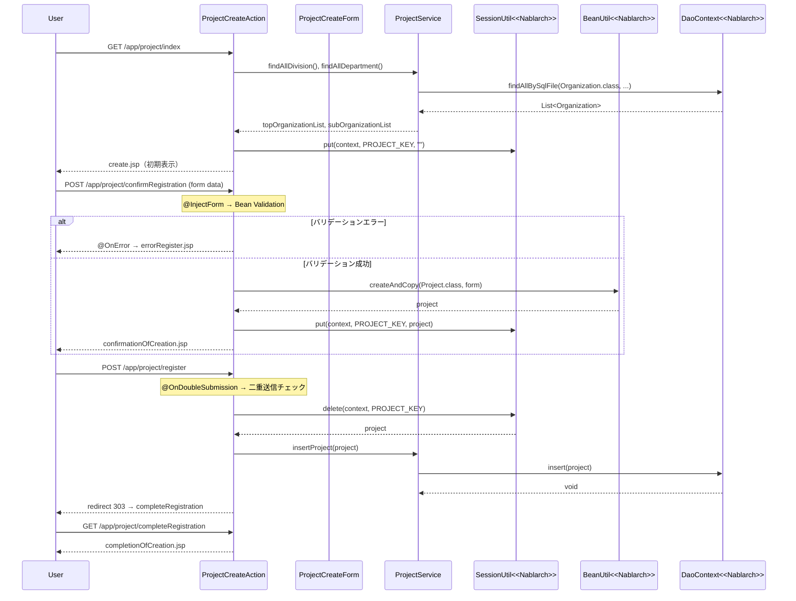

# Code Analysis: ProjectCreateAction

**Generated**: 2026-03-13 16:37:21
**Target**: プロジェクト登録アクション（入力→確認→登録完了の画面遷移処理）
**Modules**: proman-web, proman-common
**Analysis Duration**: approx. 4m 0s

---

## Overview

`ProjectCreateAction` はNablarch 5 Webアプリケーションにおけるプロジェクト登録機能のアクションクラスです。入力画面→確認画面→完了画面の標準的なPRG（Post-Redirect-Get）パターンを実装しています。

主要な処理フロー:
- `index()`: 登録初期画面表示（事業部/部門プルダウン取得）
- `confirmRegistration()`: 入力値バリデーション後に確認画面表示（セッションへのエンティティ保存）
- `register()`: セッションからエンティティ取得→DB登録→リダイレクト（二重送信防止）
- `backToEnterRegistration()`: 確認画面から入力画面への戻る処理
- `completeRegistration()`: 完了画面表示

`ProjectService` が `DaoContext`（UniversalDAO）経由でデータベースアクセスを担当し、`ProjectCreateForm` がBean Validationによる入力バリデーションを担当します。

---

## Architecture

### Dependency Graph

```mermaid
classDiagram
    class ProjectCreateAction
    class ProjectCreateForm {
        <<Form>>
    }
    class ProjectService
    class Project {
        <<Entity>>
    }
    class Organization {
        <<Entity>>
    }
    class DaoContext {
        <<Nablarch>>
    }
    class SessionUtil {
        <<Nablarch>>
    }
    class BeanUtil {
        <<Nablarch>>
    }
    class InjectForm {
        <<Nablarch>>
    }
    class OnDoubleSubmission {
        <<Nablarch>>
    }

    ProjectCreateAction ..> ProjectCreateForm : validates
    ProjectCreateAction ..> ProjectService : delegates to
    ProjectCreateAction ..> SessionUtil : stores/retrieves
    ProjectCreateAction ..> BeanUtil : copies
    ProjectCreateAction ..> InjectForm : annotates
    ProjectCreateAction ..> OnDoubleSubmission : annotates
    ProjectService ..> DaoContext : queries/persists
    ProjectService ..> Project : creates
    ProjectService ..> Organization : queries
    ProjectCreateForm ..|> Serializable : implements
```



**Note**: This diagram uses Mermaid `classDiagram` syntax to show class names and their relationships. Use `--|>` for inheritance (extends/implements) and `..>` for dependencies (uses/creates).

### Component Summary

| Component | Role | Type | Dependencies |
|-----------|------|------|--------------|
| ProjectCreateAction | プロジェクト登録の画面遷移制御 | Action | ProjectCreateForm, ProjectService, SessionUtil, BeanUtil |
| ProjectCreateForm | 登録入力値のバリデーション | Form | DateRelationUtil |
| ProjectService | データベースアクセス（CRUD） | Service | DaoContext, Project, Organization |
| Project | プロジェクトエンティティ | Entity | なし |
| Organization | 組織（事業部/部門）エンティティ | Entity | なし |

---

## Flow

### Processing Flow

プロジェクト登録は5ステップの画面遷移で構成されます:

1. **初期表示** (`index`): 事業部・部門プルダウンをDBから取得してリクエストスコープにセット。セッションストアを初期化（`PROJECT_KEY` に空文字を設定）。
2. **確認画面表示** (`confirmRegistration`): `@InjectForm` でバリデーション実行。バリデーション成功後、フォームをProjectエンティティに変換してセッションストアに保存。バリデーション失敗時は `@OnError` で入力画面に内部フォーワード。
3. **登録実行** (`register`): `@OnDoubleSubmission` で二重送信防止。セッションストアからProjectエンティティを取得・削除し、`ProjectService.insertProject()` でDB登録。登録後は303リダイレクト（PRGパターン）。
4. **完了画面** (`completeRegistration`): 完了画面JSPを返すのみ。
5. **入力画面へ戻る** (`backToEnterRegistration`): セッションストアからProjectエンティティを取得し、`BeanUtil` でフォームに変換。日付フォーマット変換後にリクエストスコープにセットして入力画面に内部フォーワード。

### Sequence Diagram



---

## Components

### ProjectCreateAction

**ファイル**: [ProjectCreateAction.java](../../.lw/nab-official/v5/nablarch-system-development-guide/Sample_Project/Source_Code/proman-project/proman-web/src/main/java/com/nablarch/example/proman/web/project/ProjectCreateAction.java)

**役割**: プロジェクト登録機能のメインコントローラ。画面遷移管理とビジネスロジックの調整を担当。

**主要メソッド**:
- `index(L33-39)`: 初期画面表示。`setOrganizationAndDivisionToRequestScope` を呼び出しプルダウンデータを準備。
- `confirmRegistration(L48-63)`: `@InjectForm`/`@OnError` アノテーション付き。バリデーション後にエンティティをセッションに保存。
- `register(L72-78)`: `@OnDoubleSubmission` アノテーション付き。セッションからエンティティ削除→DB登録→PRGリダイレクト。
- `backToEnterRegistration(L98-118)`: セッションからエンティティ取得→フォームに変換→日付フォーマット→入力画面に戻る。
- `setOrganizationAndDivisionToRequestScope(L125-136)`: private ヘルパー。事業部/部門リストをDBから取得してリクエストスコープにセット。

**依存関係**: ProjectCreateForm, ProjectService, Project(Entity), Organization(Entity), SessionUtil, BeanUtil, DateUtil, ExecutionContext, HttpRequest, HttpResponse

**実装上の注意点**:
- `register()` でセッションからエンティティを `delete()` で取得・削除している（`get()` ではなく `delete()` を使用）。これにより登録完了後にセッションデータが自動クリーンアップされる。
- `setOrganizationAndDivisionToRequestScope()` 内でも `SessionUtil.put(context, PROJECT_KEY, "")` を実行しており、初期表示・確認時の両方でセッションが初期化される（TODO: 顧客選択未実装コメントあり `L55`）。

---

### ProjectCreateForm

**ファイル**: [ProjectCreateForm.java](../../.lw/nab-official/v5/nablarch-system-development-guide/Sample_Project/Source_Code/proman-project/proman-web/src/main/java/com/nablarch/example/proman/web/project/ProjectCreateForm.java)

**役割**: 登録入力値を受け取り、Bean Validationによるバリデーションを実行するフォームクラス。

**主要フィールド**: projectName, projectType, projectClass, projectStartDate, projectEndDate, divisionId, organizationId, pmKanjiName, plKanjiName, note, salesAmount

**バリデーション**:
- `@Required` + `@Domain("xxx")` で必須・ドメインバリデーション（プロジェクト名、日付など）
- `@AssertTrue isValidProjectPeriod(L329)`: 開始日・終了日の前後関係チェック（`DateRelationUtil` 利用）

**依存関係**: DateRelationUtil, nablarch.core.validation.ee.Domain, nablarch.core.validation.ee.Required

---

### ProjectService

**ファイル**: [ProjectService.java](../../.lw/nab-official/v5/nablarch-system-development-guide/Sample_Project/Source_Code/proman-project/proman-web/src/main/java/com/nablarch/example/proman/web/project/ProjectService.java)

**役割**: データベースアクセスを集約するサービスクラス。`DaoContext`（UniversalDAO）経由でCRUD操作を実行。

**主要メソッド**:
- `findAllDivision(L50-52)`: 全事業部を SQLファイル検索で取得
- `findAllDepartment(L59-61)`: 全部門を SQLファイル検索で取得
- `findOrganizationById(L70-73)`: 組織IDで単一組織を取得
- `insertProject(L80-82)`: プロジェクトをDB登録
- `updateProject(L89-91)`: プロジェクトをDB更新
- `listProject(L99-104)`: ページング付きプロジェクト検索

**依存関係**: DaoContext, DaoFactory, Project(Entity), Organization(Entity)

---

## Nablarch Framework Usage

### SessionUtil

**クラス**: `nablarch.common.web.session.SessionUtil`

**説明**: セッションストアへのアクセスを提供するユーティリティクラス。put/get/deleteメソッドでセッション変数を操作する。

**使用方法**:
```java
// セッションへの保存
SessionUtil.put(context, PROJECT_KEY, project);

// セッションからの取得（削除なし）
Project project = SessionUtil.get(context, PROJECT_KEY);

// セッションからの取得（同時に削除）
Project project = SessionUtil.delete(context, PROJECT_KEY);
```

**重要ポイント**:
- ✅ **フォームをそのままセッションに保存しない**: フォームはシリアライズ問題を起こすことがあるため、`BeanUtil.createAndCopy()` でエンティティに変換してから保存する
- ✅ **登録完了後はセッションを削除する**: `delete()` を使用して取得と同時にセッションをクリアする（`register()` メソッドで実施）
- ⚠️ **セッションの用途**: 入力〜確認〜完了画面間での入力情報の一時保持に使用。画面表示用リストや検索結果はセッションに保存しない
- 💡 **HTTPセッションとは異なる抽象化**: クッキー（`NABLARCH_SID`）ベースのセッション管理。DBストア/HIDDENストア/HTTPセッションストアを切り替え可能

**このコードでの使い方**:
- `confirmRegistration()` で `SessionUtil.put(context, PROJECT_KEY, project)` によりProjectエンティティを確認画面用に保存（L59）
- `register()` で `SessionUtil.delete(context, PROJECT_KEY)` により取得と同時に削除（L74）
- `backToEnterRegistration()` で `SessionUtil.get(context, PROJECT_KEY)` により戻る処理用に取得（L100）

**詳細**: [Libraries Session_store](../../.claude/skills/nabledge-5/docs/component/libraries/libraries-session_store.md)

---

### @InjectForm / @OnError

**クラス**: `nablarch.common.web.interceptor.InjectForm` / `nablarch.fw.web.interceptor.OnError`

**説明**: `@InjectForm` はアクションメソッド実行前にBean Validationを実行し、バリデーション済みフォームをリクエストスコープに格納するインターセプタ。`@OnError` はバリデーションエラー時の遷移先を指定する。

**使用方法**:
```java
@InjectForm(form = ProjectCreateForm.class, prefix = "form")
@OnError(type = ApplicationException.class, path = "forward:///app/project/errorRegister")
public HttpResponse confirmRegistration(HttpRequest request, ExecutionContext context) {
    ProjectCreateForm form = context.getRequestScopedVar("form");
    // バリデーション済みフォームを取得
}
```

**重要ポイント**:
- ✅ **外部入力値には必ず `@InjectForm` を付ける**: HTTPリクエストパラメータを受け取るメソッドにはバリデーションが必須
- ✅ **`@OnError` でエラー遷移先を明示する**: バリデーション失敗時の画面遷移を宣言的に設定する
- 💡 **フォームをリクエストスコープから取得**: バリデーション済みフォームは `context.getRequestScopedVar("form")` で取得（プレフィックス `form` と同じキー）
- ⚠️ **`prefix` 属性**: フォームフィールドのリクエストパラメータプレフィックスを指定する（例: `form.projectName`）

**このコードでの使い方**:
- `confirmRegistration()` に `@InjectForm(form = ProjectCreateForm.class, prefix = "form")` を付与（L48）
- `@OnError(type = ApplicationException.class, path = "forward:///app/project/errorRegister")` でエラー時の遷移先を指定（L49）

**詳細**: [InjectForm Javadoc](https://nablarch.github.io/docs/LATEST/javadoc/nablarch/common/web/interceptor/InjectForm.html)

---

### @OnDoubleSubmission

**クラス**: `nablarch.common.web.token.OnDoubleSubmission`

**説明**: 二重送信防止アノテーション。Webトークンを使って同一リクエストの重複実行を防ぐ。JSP側の `allowDoubleSubmission="false"` と組み合わせてクライアント・サーバ両面で制御する。

**使用方法**:
```java
@OnDoubleSubmission
public HttpResponse register(HttpRequest request, ExecutionContext context) {
    // 二重送信があった場合はエラーページに遷移
}
```

**重要ポイント**:
- ✅ **サーバサイド・クライアントサイドの両方で制御**: `@OnDoubleSubmission`（サーバ）＋JSPの `allowDoubleSubmission="false"`（クライアント）を組み合わせる
- ⚠️ **JSのみでは不十分**: ブラウザのJavaScriptが無効の場合を考慮してサーバサイド制御が必須
- 💡 **PRGパターンと組み合わせ**: 登録後に303リダイレクトすることでブラウザの更新ボタンによる多重登録も防止

**このコードでの使い方**:
- `register()` メソッドに `@OnDoubleSubmission` を付与（L72）
- 登録後 `return new HttpResponse(303, "redirect:///app/project/completeRegistration")` でPRGリダイレクト（L77）

**詳細**: [OnDoubleSubmission Javadoc](https://nablarch.github.io/docs/LATEST/javadoc/nablarch/common/web/token/OnDoubleSubmission.html)

---

### BeanUtil

**クラス**: `nablarch.core.beans.BeanUtil`

**説明**: JavaBeansの値コピーユーティリティ。フォーム→エンティティ、エンティティ→フォームなど同名プロパティ間での値移送を簡潔に行う。

**使用方法**:
```java
// フォームからエンティティへのコピー（新規作成）
Project project = BeanUtil.createAndCopy(Project.class, form);

// エンティティからフォームへのコピー（新規作成）
ProjectCreateForm form = BeanUtil.createAndCopy(ProjectCreateForm.class, project);
```

**重要ポイント**:
- ✅ **プロパティ名の一致が必要**: コピー元・コピー先でプロパティ名が一致している必要がある
- 💡 **型変換サポート**: 型互換がある場合（String→Integer等）は自動変換される
- ⚠️ **セッション保存前に変換**: フォームをセッションに保存する際は必ず `BeanUtil.createAndCopy` でエンティティに変換してから保存する

**このコードでの使い方**:
- `confirmRegistration()` でフォーム→Projectエンティティに変換（L52）
- `backToEnterRegistration()` でProjectエンティティ→フォームに変換（L101）

**詳細**: [BeanUtil Javadoc](https://nablarch.github.io/docs/LATEST/javadoc/nablarch/core/beans/BeanUtil.html)

---

### DaoContext (UniversalDAO)

**クラス**: `nablarch.common.dao.DaoContext`

**説明**: UniversalDAOのインターフェース。JPAアノテーション付きEntityを使った簡易O/RマッパーでDB操作を提供する。`ProjectService` が `DaoFactory.create()` で取得して使用。

**使用方法**:
```java
// SQLファイルを使った全件検索
List<Organization> orgs = universalDao.findAllBySqlFile(Organization.class, "FIND_ALL_DIVISION");

// 主キーを指定した単件検索
Organization org = universalDao.findById(Organization.class, new Object[]{organizationId});

// 登録
universalDao.insert(project);
```

**重要ポイント**:
- ✅ **EntityにJPAアノテーションが必要**: `@Entity`, `@Table`, `@Id`, `@Column` 等が必要
- 💡 **SQLファイルとEntity/DTOを分離**: 複雑な検索（JOIN等）はSQLファイルで定義し、結果をDTO/Entityにマッピング
- ⚠️ **主キー以外の条件での更新/削除は不可**: その場合は `database` 機能（低レベルAPI）を使用

**このコードでの使い方**:
- `ProjectService.findAllDivision()` で `findAllBySqlFile(Organization.class, "FIND_ALL_DIVISION")`（L51）
- `ProjectService.insertProject()` で `universalDao.insert(project)`（L81）
- `ProjectService.findOrganizationById()` で `universalDao.findById(Organization.class, param)`（L72）

**詳細**: [Libraries Universal_dao](../../.claude/skills/nabledge-5/docs/component/libraries/libraries-universal_dao.md)

---

## References

### Source Files

- [ProjectCreateAction.java (.lw/nab-official/v5/nablarch-system-development-guide/en/Sample_Project/Source_Code/proman-project/proman-web/src/main/java/com/nablarch/example/proman/web/project)](../../.lw/nab-official/v5/nablarch-system-development-guide/en/Sample_Project/Source_Code/proman-project/proman-web/src/main/java/com/nablarch/example/proman/web/project/ProjectCreateAction.java) - ProjectCreateAction
- [ProjectCreateAction.java (.lw/nab-official/v5/nablarch-system-development-guide/Sample_Project/Source_Code/proman-project/proman-web/src/main/java/com/nablarch/example/proman/web/project)](../../.lw/nab-official/v5/nablarch-system-development-guide/Sample_Project/Source_Code/proman-project/proman-web/src/main/java/com/nablarch/example/proman/web/project/ProjectCreateAction.java) - ProjectCreateAction
- [ProjectCreateAction.java (.lw/nab-official/v6/nablarch-system-development-guide/en/Sample_Project/Source_Code/proman-project/proman-web/src/main/java/com/nablarch/example/proman/web/project)](../../.lw/nab-official/v6/nablarch-system-development-guide/en/Sample_Project/Source_Code/proman-project/proman-web/src/main/java/com/nablarch/example/proman/web/project/ProjectCreateAction.java) - ProjectCreateAction
- [ProjectCreateAction.java (.lw/nab-official/v6/nablarch-system-development-guide/Sample_Project/Source_Code/proman-project/proman-web/src/main/java/com/nablarch/example/proman/web/project)](../../.lw/nab-official/v6/nablarch-system-development-guide/Sample_Project/Source_Code/proman-project/proman-web/src/main/java/com/nablarch/example/proman/web/project/ProjectCreateAction.java) - ProjectCreateAction
- [ProjectCreateForm.java (.lw/nab-official/v5/nablarch-system-development-guide/en/Sample_Project/Source_Code/proman-project/proman-web/src/main/java/com/nablarch/example/proman/web/project)](../../.lw/nab-official/v5/nablarch-system-development-guide/en/Sample_Project/Source_Code/proman-project/proman-web/src/main/java/com/nablarch/example/proman/web/project/ProjectCreateForm.java) - ProjectCreateForm
- [ProjectCreateForm.java (.lw/nab-official/v5/nablarch-system-development-guide/Sample_Project/Source_Code/proman-project/proman-web/src/main/java/com/nablarch/example/proman/web/project)](../../.lw/nab-official/v5/nablarch-system-development-guide/Sample_Project/Source_Code/proman-project/proman-web/src/main/java/com/nablarch/example/proman/web/project/ProjectCreateForm.java) - ProjectCreateForm
- [ProjectCreateForm.java (.lw/nab-official/v6/nablarch-system-development-guide/en/Sample_Project/Source_Code/proman-project/proman-web/src/main/java/com/nablarch/example/proman/web/project)](../../.lw/nab-official/v6/nablarch-system-development-guide/en/Sample_Project/Source_Code/proman-project/proman-web/src/main/java/com/nablarch/example/proman/web/project/ProjectCreateForm.java) - ProjectCreateForm
- [ProjectCreateForm.java (.lw/nab-official/v6/nablarch-system-development-guide/Sample_Project/Source_Code/proman-project/proman-web/src/main/java/com/nablarch/example/proman/web/project)](../../.lw/nab-official/v6/nablarch-system-development-guide/Sample_Project/Source_Code/proman-project/proman-web/src/main/java/com/nablarch/example/proman/web/project/ProjectCreateForm.java) - ProjectCreateForm
- [ProjectService.java (.lw/nab-official/v5/nablarch-system-development-guide/en/Sample_Project/Source_Code/proman-project/proman-web/src/main/java/com/nablarch/example/proman/web/project)](../../.lw/nab-official/v5/nablarch-system-development-guide/en/Sample_Project/Source_Code/proman-project/proman-web/src/main/java/com/nablarch/example/proman/web/project/ProjectService.java) - ProjectService
- [ProjectService.java (.lw/nab-official/v5/nablarch-system-development-guide/Sample_Project/Source_Code/proman-project/proman-web/src/main/java/com/nablarch/example/proman/web/project)](../../.lw/nab-official/v5/nablarch-system-development-guide/Sample_Project/Source_Code/proman-project/proman-web/src/main/java/com/nablarch/example/proman/web/project/ProjectService.java) - ProjectService
- [ProjectService.java (.lw/nab-official/v6/nablarch-system-development-guide/en/Sample_Project/Source_Code/proman-project/proman-web/src/main/java/com/nablarch/example/proman/web/project)](../../.lw/nab-official/v6/nablarch-system-development-guide/en/Sample_Project/Source_Code/proman-project/proman-web/src/main/java/com/nablarch/example/proman/web/project/ProjectService.java) - ProjectService
- [ProjectService.java (.lw/nab-official/v6/nablarch-system-development-guide/Sample_Project/Source_Code/proman-project/proman-web/src/main/java/com/nablarch/example/proman/web/project)](../../.lw/nab-official/v6/nablarch-system-development-guide/Sample_Project/Source_Code/proman-project/proman-web/src/main/java/com/nablarch/example/proman/web/project/ProjectService.java) - ProjectService

### Knowledge Base (Nabledge-5)

- [Web Application Client_create2](../../.claude/skills/nabledge-5/docs/processing-pattern/web-application/web-application-client_create2.md)
- [Web Application Client_create3](../../.claude/skills/nabledge-5/docs/processing-pattern/web-application/web-application-client_create3.md)
- [Web Application Client_create4](../../.claude/skills/nabledge-5/docs/processing-pattern/web-application/web-application-client_create4.md)
- [Libraries Session_store](../../.claude/skills/nabledge-5/docs/component/libraries/libraries-session_store.md)
- [Libraries Universal_dao](../../.claude/skills/nabledge-5/docs/component/libraries/libraries-universal_dao.md)

### Official Documentation


- [AesEncryptor](https://nablarch.github.io/docs/LATEST/javadoc/nablarch/common/encryption/AesEncryptor.html)
- [Base64Key](https://nablarch.github.io/docs/LATEST/javadoc/nablarch/common/encryption/Base64Key.html)
- [Base64Util](https://nablarch.github.io/docs/LATEST/javadoc/nablarch/core/util/Base64Util.html)
- [BasicDaoContextFactory](https://nablarch.github.io/docs/LATEST/javadoc/nablarch/common/dao/BasicDaoContextFactory.html)
- [BeanUtil](https://nablarch.github.io/docs/LATEST/javadoc/nablarch/core/beans/BeanUtil.html)
- [Client Create2](https://nablarch.github.io/docs/LATEST/doc/application_framework/application_framework/web/getting_started/client_create/client_create2.html)
- [Client Create3](https://nablarch.github.io/docs/LATEST/doc/application_framework/application_framework/web/getting_started/client_create/client_create3.html)
- [Client Create4](https://nablarch.github.io/docs/LATEST/doc/application_framework/application_framework/web/getting_started/client_create/client_create4.html)
- [ConnectionFactory](https://nablarch.github.io/docs/LATEST/javadoc/nablarch/core/db/connection/ConnectionFactory.html)
- [DatabaseMetaDataExtractor](https://nablarch.github.io/docs/LATEST/javadoc/nablarch/common/dao/DatabaseMetaDataExtractor.html)
- [DbStore](https://nablarch.github.io/docs/LATEST/javadoc/nablarch/common/web/session/store/DbStore.html)
- [DeferredEntityList](https://nablarch.github.io/docs/LATEST/javadoc/nablarch/common/dao/DeferredEntityList.html)
- [Dialect](https://nablarch.github.io/docs/LATEST/javadoc/nablarch/core/db/dialect/Dialect.html)
- [EntityList](https://nablarch.github.io/docs/LATEST/javadoc/nablarch/common/dao/EntityList.html)
- [ExecutionContext](https://nablarch.github.io/docs/LATEST/javadoc/nablarch/fw/ExecutionContext.html)
- [GenerationType](https://nablarch.github.io/docs/LATEST/javadoc/javax/persistence/GenerationType.html)
- [H2Dialect](https://nablarch.github.io/docs/LATEST/javadoc/nablarch/core/db/dialect/H2Dialect.html)
- [InjectForm](https://nablarch.github.io/docs/LATEST/javadoc/nablarch/common/web/interceptor/InjectForm.html)
- [JavaSerializeEncryptStateEncoder](https://nablarch.github.io/docs/LATEST/javadoc/nablarch/common/web/session/encoder/JavaSerializeEncryptStateEncoder.html)
- [JavaSerializeStateEncoder](https://nablarch.github.io/docs/LATEST/javadoc/nablarch/common/web/session/encoder/JavaSerializeStateEncoder.html)
- [JaxbStateEncoder](https://nablarch.github.io/docs/LATEST/javadoc/nablarch/common/web/session/encoder/JaxbStateEncoder.html)
- [OnDoubleSubmission](https://nablarch.github.io/docs/LATEST/javadoc/nablarch/common/web/token/OnDoubleSubmission.html)
- [OnError](https://nablarch.github.io/docs/LATEST/javadoc/nablarch/fw/web/interceptor/OnError.html)
- [OptimisticLockException](https://nablarch.github.io/docs/LATEST/javadoc/javax/persistence/OptimisticLockException.html)
- [Pagination](https://nablarch.github.io/docs/LATEST/javadoc/nablarch/common/dao/Pagination.html)
- [Required](https://nablarch.github.io/docs/LATEST/javadoc/nablarch/core/validation/ee/Required.html)
- [Session Store](https://nablarch.github.io/docs/LATEST/doc/application_framework/application_framework/libraries/session_store.html)
- [SessionKeyNotFoundException](https://nablarch.github.io/docs/LATEST/javadoc/nablarch/common/web/session/SessionKeyNotFoundException.html)
- [SessionManager](https://nablarch.github.io/docs/LATEST/javadoc/nablarch/common/web/session/SessionManager.html)
- [SessionStore](https://nablarch.github.io/docs/LATEST/javadoc/nablarch/common/web/session/SessionStore.html)
- [SessionUtil](https://nablarch.github.io/docs/LATEST/javadoc/nablarch/common/web/session/SessionUtil.html)
- [SimpleDbTransactionManager](https://nablarch.github.io/docs/LATEST/javadoc/nablarch/core/db/transaction/SimpleDbTransactionManager.html)
- [TransactionFactory](https://nablarch.github.io/docs/LATEST/javadoc/nablarch/core/transaction/TransactionFactory.html)
- [Universal Dao](https://nablarch.github.io/docs/LATEST/doc/application_framework/application_framework/libraries/database/universal_dao.html)
- [UniversalDao.Transaction](https://nablarch.github.io/docs/LATEST/javadoc/nablarch/common/dao/UniversalDao.Transaction.html)
- [UniversalDao](https://nablarch.github.io/docs/LATEST/javadoc/nablarch/common/dao/UniversalDao.html)
- [UserSessionSchema](https://nablarch.github.io/docs/LATEST/javadoc/nablarch/common/web/session/store/UserSessionSchema.html)

---

**Note**: This documentation was generated by the code-analysis workflow of the nabledge-5 skill.
