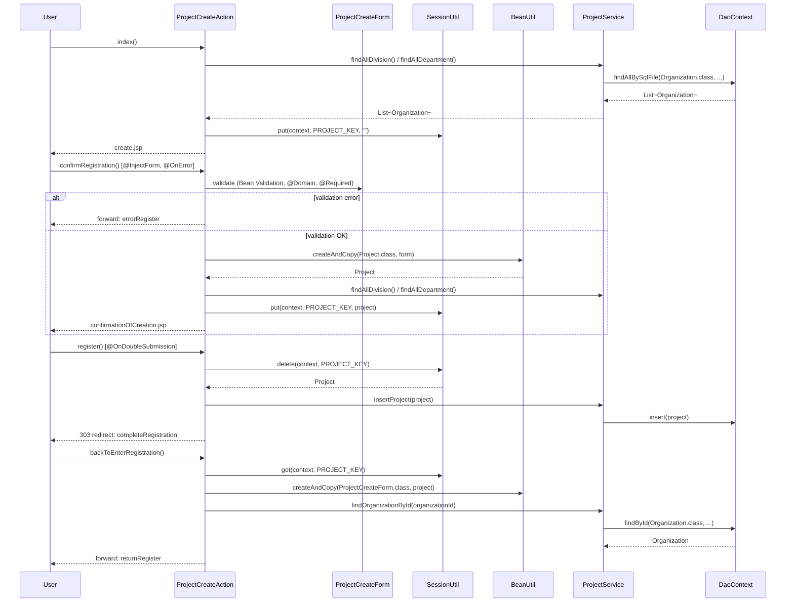

# Code Analysis: ProjectCreateAction

**Generated**: 2026-03-13 16:43:11
**Target**: プロジェクト登録アクション
**Modules**: proman-web, proman-common
**Analysis Duration**: approx. 4m 21s

---

## Overview

`ProjectCreateAction` はプロジェクトの新規登録機能を担う業務アクションクラス。入力画面表示 → 確認画面表示 → 登録実行 → 完了画面表示 の4ステップフロー（＋確認画面からの戻り）を制御する。

Nablarch の `@InjectForm` インターセプタによるフォームバインディングとBean Validationを活用し、二重サブミット防止には `@OnDoubleSubmission`、バリデーションエラー時の遷移には `@OnError` を使用する。`SessionUtil` を介してセッションストアに `Project` エンティティを一時保存し、確認～登録間でデータを引き回す。DB操作は `ProjectService` 経由で `DaoContext`（UniversalDAO）に委譲する。

---

## Architecture

### Dependency Graph

```mermaid
classDiagram
    class ProjectCreateAction
    class ProjectCreateForm {
        <<Form>>
    }
    class ProjectService
    class Project {
        <<Entity>>
    }
    class Organization {
        <<Entity>>
    }
    class DaoContext {
        <<Nablarch>>
    }
    class SessionUtil {
        <<Nablarch>>
    }
    class BeanUtil {
        <<Nablarch>>
    }
    class ExecutionContext {
        <<Nablarch>>
    }

    ProjectCreateForm ..|> Serializable : implements
    ProjectCreateAction ..> ProjectCreateForm : validates
    ProjectCreateAction ..> ProjectService : delegates to
    ProjectCreateAction ..> SessionUtil : uses
    ProjectCreateAction ..> BeanUtil : copies
    ProjectCreateAction ..> ExecutionContext : uses
    ProjectService ..> DaoContext : queries/persists
    ProjectService ..> Organization : queries
    ProjectService ..> Project : persists
```



**Note**: This diagram uses Mermaid `classDiagram` syntax to show class names and their relationships. Use `--|>` for inheritance (extends/implements) and `..>` for dependencies (uses/creates).

### Component Summary

| Component | Role | Type | Dependencies |
|-----------|------|------|--------------|
| ProjectCreateAction | プロジェクト登録の画面遷移と処理を制御 | Action | ProjectCreateForm, ProjectService, SessionUtil, BeanUtil, ExecutionContext |
| ProjectCreateForm | 登録入力値のバリデーション定義 | Form | DateRelationUtil |
| ProjectService | DBアクセスのサービス層 | Service | DaoContext, Organization, Project |
| Project | プロジェクトエンティティ（JPA） | Entity | なし |
| Organization | 組織エンティティ（JPA） | Entity | なし |
| DaoFactory | DaoContextの生成ユーティリティ | Utility | SystemRepository, BasicDaoContextFactory |

---

## Flow

### Processing Flow

登録フローは以下の5ステップで構成される:

1. **index()**: 初期画面表示。事業部・部門のプルダウンをDBから取得しリクエストスコープに設定して `create.jsp` を返す。
2. **confirmRegistration()**: 確認画面表示。`@InjectForm` でフォームをバインド＆バリデーション。成功時は `Project` エンティティに詰め替えてセッションストアに保存し `confirmationOfCreation.jsp` を返す。バリデーションエラー時は `@OnError` により `errorRegister` へフォワード。
3. **register()**: 登録実行。`@OnDoubleSubmission` で二重サブミットを防止。セッションストアから `Project` を取り出し `ProjectService.insertProject()` でINSERT後、303リダイレクト。
4. **completeRegistration()**: 完了画面表示。`completionOfCreation.jsp` を返すのみ。
5. **backToEnterRegistration()**: 確認画面から入力画面に戻る。セッションから `Project` を取得して `ProjectCreateForm` に詰め替え、日付をフォーマットして組織情報を再設定する。

---

### Sequence Diagram



---

## Components

### ProjectCreateAction

**ファイル**: [ProjectCreateAction.java](.../../.lw/nab-official/v5/nablarch-system-development-guide/Sample_Project/Source_Code/proman-project/proman-web/src/main/java/com/nablarch/example/proman/web/project/ProjectCreateAction.java)

**役割**: プロジェクト登録機能の画面遷移と処理を制御するアクションクラス。

**主要メソッド**:
- `index()` (L33-39): 初期画面表示。事業部・部門プルダウン取得して`create.jsp`返却。
- `confirmRegistration()` (L48-63): 確認画面表示。`@InjectForm`でバインド、`Project`エンティティ生成してセッション保存。
- `register()` (L72-78): 登録実行。セッションから`Project`取得し`ProjectService.insertProject()`呼び出し、303リダイレクト。
- `backToEnterRegistration()` (L98-118): 戻り処理。セッションから`Project`を取得しフォームに戻し、日付フォーマット変換と組織情報を再設定。

**依存関係**: ProjectCreateForm, ProjectService, SessionUtil, BeanUtil, ExecutionContext, DateUtil

---

### ProjectCreateForm

**ファイル**: [ProjectCreateForm.java](.../../.lw/nab-official/v5/nablarch-system-development-guide/Sample_Project/Source_Code/proman-project/proman-web/src/main/java/com/nablarch/example/proman/web/project/ProjectCreateForm.java)

**役割**: 登録入力値を受け取り Bean Validation でバリデーションするフォームクラス。`Serializable` を実装しセッションへの格納も可能（ただし実際はEntityに詰め替えてセッションに保存）。

**主要フィールド（バリデーション）**:
- `projectName`, `projectType`, `projectClass`: `@Required` + `@Domain`
- `projectStartDate`, `projectEndDate`: `@Required` + `@Domain("date")`
- `divisionId`, `organizationId`: `@Required` + `@Domain("organizationId")`
- `isValidProjectPeriod()` (L329-331): `@AssertTrue` で開始日 ≤ 終了日の期間整合チェック

**依存関係**: DateRelationUtil, Nablarch Bean Validation (`@Domain`, `@Required`)

---

### ProjectService

**ファイル**: [ProjectService.java](.../../.lw/nab-official/v5/nablarch-system-development-guide/Sample_Project/Source_Code/proman-project/proman-web/src/main/java/com/nablarch/example/proman/web/project/ProjectService.java)

**役割**: DB操作をアクションから分離したサービスクラス。`DaoContext`（UniversalDAO）を通じてCRUDを実行する。

**主要メソッド**:
- `findAllDivision()` (L50-52): 事業部一覧を SQL ファイル `FIND_ALL_DIVISION` で取得。
- `findAllDepartment()` (L59-61): 部門一覧を SQL ファイル `FIND_ALL_DEPARTMENT` で取得。
- `findOrganizationById()` (L70-73): 組織を主キーで1件取得。
- `insertProject()` (L80-82): `Project` エンティティを INSERT。

**依存関係**: DaoContext, Organization (Entity), Project (Entity), DaoFactory

---

## Nablarch Framework Usage

### InjectForm

**クラス**: `nablarch.common.web.interceptor.InjectForm`

**説明**: アクションメソッドへのアノテーションで、リクエストパラメータを指定フォームクラスにバインドし Bean Validation を実行するインターセプタ。バリデーション済みフォームはリクエストスコープに格納される。

**使用方法**:
```java
@InjectForm(form = ProjectCreateForm.class, prefix = "form")
@OnError(type = ApplicationException.class, path = "forward:///app/project/errorRegister")
public HttpResponse confirmRegistration(HttpRequest request, ExecutionContext context) {
    ProjectCreateForm form = context.getRequestScopedVar("form");
    // ...
}
```

**重要ポイント**:
- ✅ **`prefix` パラメータ指定**: HTMLフォームの `name` 属性のプレフィックスと一致させること（`form.projectName` など）。
- ✅ **`@OnError` と併用**: バリデーションエラー時の遷移先を `@OnError` で指定すること。
- 💡 **リクエストスコープに格納**: バリデーション済みフォームは `context.getRequestScopedVar("form")` で取得できる。

**このコードでの使い方**:
- `confirmRegistration()` (L48) に付与。`ProjectCreateForm` にバインドし、バリデーションエラー時は `errorRegister` へフォワード。

**詳細**: [Handlers InjectForm](../../.claude/skills/nabledge-5/docs/component/handlers/handlers-InjectForm.md)

---

### OnDoubleSubmission

**クラス**: `nablarch.common.web.token.OnDoubleSubmission`

**説明**: 二重サブミットチェックを行うインターセプタ。JSP の `<n:form useToken="true">` または `UseToken` インターセプタによるトークン設定と組み合わせて使用する。

**使用方法**:
```java
@OnDoubleSubmission
public HttpResponse register(HttpRequest request, ExecutionContext context) {
    // 登録処理
}
```

**重要ポイント**:
- ✅ **JSP側でトークン設定が必須**: `<n:form useToken="true">` または `UseToken` インターセプタが必要。
- ⚠️ **二重サブミット時はエラー画面へ**: デフォルト遷移先はエラーページのため、必要に応じて `path` 属性で遷移先を指定する。
- 💡 **PRG パターンと組み合わせ**: `register()` 後の303リダイレクト（PRGパターン）と組み合わせることでブラウザ更新による再実行も防止できる。

**このコードでの使い方**:
- `register()` (L72) に付与。フォーム送信時のトークン検証で二重サブミットを防止する。

**詳細**: [Handlers On_double_submission](../../.claude/skills/nabledge-5/docs/component/handlers/handlers-on_double_submission.md)

---

### SessionUtil

**クラス**: `nablarch.common.web.session.SessionUtil`

**説明**: セッションストアへの読み書きを提供するユーティリティクラス。`put`/`get`/`delete` でセッション変数を操作する。セッション変数はシリアライズされてDBストア等に保存される。

**使用方法**:
```java
// 保存
SessionUtil.put(context, "project", project);

// 取得
Project project = SessionUtil.get(context, "project");

// 取得して削除
Project project = SessionUtil.delete(context, "project");
```

**重要ポイント**:
- ✅ **フォームをそのままセッションに格納しない**: フォームではなくエンティティ等に詰め替えてから保存すること（セッションストアの設計原則）。
- ⚠️ **`delete` で取得後削除**: 登録実行時は `SessionUtil.delete()` でデータ取得と削除を同時実行する。
- 💡 **入力～確認～完了間のデータ引き回し**: セッションストアはこのパターンのデータ保持に最適（DBストアを推奨）。

**このコードでの使い方**:
- `confirmRegistration()` (L59): `Project` をセッションに保存。
- `register()` (L74): `SessionUtil.delete()` でセッションから `Project` を取り出して登録実行。
- `backToEnterRegistration()` (L100): `SessionUtil.get()` でセッションから `Project` を取得して入力画面の値を復元。

**詳細**: [Libraries Session_store](../../.claude/skills/nabledge-5/docs/component/libraries/libraries-session_store.md)

---

### BeanUtil (Nablarch)

**クラス**: `nablarch.core.beans.BeanUtil`

**説明**: JavaBean間のプロパティコピーを提供するユーティリティクラス。フォーム→エンティティ、エンティティ→フォームへの詰め替えに使用する。

**使用方法**:
```java
// フォームからProjectエンティティ生成
Project project = BeanUtil.createAndCopy(Project.class, form);

// エンティティからフォーム生成
ProjectCreateForm form = BeanUtil.createAndCopy(ProjectCreateForm.class, project);
```

**重要ポイント**:
- ✅ **プロパティ名一致が必須**: コピー元と先でプロパティ名が一致する項目のみコピーされる。
- ⚠️ **型が異なる場合はコピーされない**: `String` と `Integer` など型が異なるプロパティはコピーされないため、手動で設定が必要。

**このコードでの使い方**:
- `confirmRegistration()` (L52): `ProjectCreateForm` → `Project` へのコピー。
- `backToEnterRegistration()` (L101): `Project` → `ProjectCreateForm` へのコピー（日付フォーマットは個別設定）。

---

### UniversalDAO (DaoContext)

**クラス**: `nablarch.common.dao.DaoContext` / `nablarch.common.dao.UniversalDao`

**説明**: JPA 2.0 アノテーションを使った簡易O/Rマッパー。SQLファイルを使った柔軟な検索と、主キー指定の単純なCRUDを提供する。

**使用方法**:
```java
// SQL ファイルによる全件検索
List<Organization> list = universalDao.findAllBySqlFile(Organization.class, "FIND_ALL_DIVISION");

// 主キーで1件取得
Organization org = universalDao.findById(Organization.class, new Object[]{organizationId});

// INSERT
universalDao.insert(project);
```

**重要ポイント**:
- ✅ **エンティティに JPA アノテーション必須**: `@Table`, `@Id`, `@Column` 等を設定すること。
- ⚠️ **主キー以外の条件更新・削除不可**: 主キー以外の条件での更新・削除は `DaoContext` ではなく `database` ライブラリを使用。
- 💡 **SQLファイルとBeanマッピング**: `findAllBySqlFile` でSELECT結果を任意のBeanにマッピングできる。

**このコードでの使い方**:
- `ProjectService.findAllDivision()` / `findAllDepartment()` (L50-61): SQLファイルで組織一覧を取得。
- `ProjectService.findOrganizationById()` (L70-73): 主キーで組織1件取得。
- `ProjectService.insertProject()` (L80-82): Project エンティティを INSERT。

**詳細**: [Libraries Universal_dao](../../.claude/skills/nabledge-5/docs/component/libraries/libraries-universal_dao.md)

---

### Bean Validation (@Domain, @Required)

**クラス**: `nablarch.core.validation.ee.Domain`, `nablarch.core.validation.ee.Required`

**説明**: Nablarch の Bean Validation 拡張アノテーション。`@Domain` はドメインマネージャで定義したドメイン単位のバリデーションルールを適用し、`@Required` は必須チェックを行う。

**使用方法**:
```java
// フォームクラス
public class ProjectCreateForm implements Serializable {
    @Required
    @Domain("projectName")
    private String projectName;

    @Required
    @Domain("date")
    private String projectStartDate;
}
```

**重要ポイント**:
- ✅ **`@Required` はドメインBeanではなくフォーム側に設定**: 必須かどうかは機能設計による。
- ✅ **`BeanValidationStrategy` の設定が必要**: コンポーネント名 `validationStrategy` でコンポーネント定義すること。
- 💡 **ドメインBeanで一元管理**: フォーマットや文字種のルールをドメイン単位でまとめることでフォーム間のルール統一が図れる。

**このコードでの使い方**:
- `ProjectCreateForm` の全入力フィールドに `@Required` + `@Domain` を付与。
- `isValidProjectPeriod()` に `@AssertTrue` で開始日≤終了日の期間整合チェック (L329-331)。

**詳細**: [Libraries Bean_validation](../../.claude/skills/nabledge-5/docs/component/libraries/libraries-bean_validation.md)

---

## References

### Source Files

- [ProjectCreateAction.java (.lw/nab-official/v5/nablarch-system-development-guide/en/Sample_Project/Source_Code/proman-project/proman-web/src/main/java/com/nablarch/example/proman/web/project)](../../.lw/nab-official/v5/nablarch-system-development-guide/en/Sample_Project/Source_Code/proman-project/proman-web/src/main/java/com/nablarch/example/proman/web/project/ProjectCreateAction.java) - ProjectCreateAction
- [ProjectCreateAction.java (.lw/nab-official/v5/nablarch-system-development-guide/Sample_Project/Source_Code/proman-project/proman-web/src/main/java/com/nablarch/example/proman/web/project)](../../.lw/nab-official/v5/nablarch-system-development-guide/Sample_Project/Source_Code/proman-project/proman-web/src/main/java/com/nablarch/example/proman/web/project/ProjectCreateAction.java) - ProjectCreateAction
- [ProjectCreateAction.java (.lw/nab-official/v6/nablarch-system-development-guide/en/Sample_Project/Source_Code/proman-project/proman-web/src/main/java/com/nablarch/example/proman/web/project)](../../.lw/nab-official/v6/nablarch-system-development-guide/en/Sample_Project/Source_Code/proman-project/proman-web/src/main/java/com/nablarch/example/proman/web/project/ProjectCreateAction.java) - ProjectCreateAction
- [ProjectCreateAction.java (.lw/nab-official/v6/nablarch-system-development-guide/Sample_Project/Source_Code/proman-project/proman-web/src/main/java/com/nablarch/example/proman/web/project)](../../.lw/nab-official/v6/nablarch-system-development-guide/Sample_Project/Source_Code/proman-project/proman-web/src/main/java/com/nablarch/example/proman/web/project/ProjectCreateAction.java) - ProjectCreateAction
- [ProjectCreateForm.java (.lw/nab-official/v5/nablarch-system-development-guide/en/Sample_Project/Source_Code/proman-project/proman-web/src/main/java/com/nablarch/example/proman/web/project)](../../.lw/nab-official/v5/nablarch-system-development-guide/en/Sample_Project/Source_Code/proman-project/proman-web/src/main/java/com/nablarch/example/proman/web/project/ProjectCreateForm.java) - ProjectCreateForm
- [ProjectCreateForm.java (.lw/nab-official/v5/nablarch-system-development-guide/Sample_Project/Source_Code/proman-project/proman-web/src/main/java/com/nablarch/example/proman/web/project)](../../.lw/nab-official/v5/nablarch-system-development-guide/Sample_Project/Source_Code/proman-project/proman-web/src/main/java/com/nablarch/example/proman/web/project/ProjectCreateForm.java) - ProjectCreateForm
- [ProjectCreateForm.java (.lw/nab-official/v6/nablarch-system-development-guide/en/Sample_Project/Source_Code/proman-project/proman-web/src/main/java/com/nablarch/example/proman/web/project)](../../.lw/nab-official/v6/nablarch-system-development-guide/en/Sample_Project/Source_Code/proman-project/proman-web/src/main/java/com/nablarch/example/proman/web/project/ProjectCreateForm.java) - ProjectCreateForm
- [ProjectCreateForm.java (.lw/nab-official/v6/nablarch-system-development-guide/Sample_Project/Source_Code/proman-project/proman-web/src/main/java/com/nablarch/example/proman/web/project)](../../.lw/nab-official/v6/nablarch-system-development-guide/Sample_Project/Source_Code/proman-project/proman-web/src/main/java/com/nablarch/example/proman/web/project/ProjectCreateForm.java) - ProjectCreateForm
- [ProjectService.java (.lw/nab-official/v5/nablarch-system-development-guide/en/Sample_Project/Source_Code/proman-project/proman-web/src/main/java/com/nablarch/example/proman/web/project)](../../.lw/nab-official/v5/nablarch-system-development-guide/en/Sample_Project/Source_Code/proman-project/proman-web/src/main/java/com/nablarch/example/proman/web/project/ProjectService.java) - ProjectService
- [ProjectService.java (.lw/nab-official/v5/nablarch-system-development-guide/Sample_Project/Source_Code/proman-project/proman-web/src/main/java/com/nablarch/example/proman/web/project)](../../.lw/nab-official/v5/nablarch-system-development-guide/Sample_Project/Source_Code/proman-project/proman-web/src/main/java/com/nablarch/example/proman/web/project/ProjectService.java) - ProjectService
- [ProjectService.java (.lw/nab-official/v6/nablarch-system-development-guide/en/Sample_Project/Source_Code/proman-project/proman-web/src/main/java/com/nablarch/example/proman/web/project)](../../.lw/nab-official/v6/nablarch-system-development-guide/en/Sample_Project/Source_Code/proman-project/proman-web/src/main/java/com/nablarch/example/proman/web/project/ProjectService.java) - ProjectService
- [ProjectService.java (.lw/nab-official/v6/nablarch-system-development-guide/Sample_Project/Source_Code/proman-project/proman-web/src/main/java/com/nablarch/example/proman/web/project)](../../.lw/nab-official/v6/nablarch-system-development-guide/Sample_Project/Source_Code/proman-project/proman-web/src/main/java/com/nablarch/example/proman/web/project/ProjectService.java) - ProjectService

### Knowledge Base (Nabledge-5)

- [Libraries Universal_dao](../../.claude/skills/nabledge-5/docs/component/libraries/libraries-universal_dao.md)
- [Libraries Bean_validation](../../.claude/skills/nabledge-5/docs/component/libraries/libraries-bean_validation.md)
- [Libraries Session_store](../../.claude/skills/nabledge-5/docs/component/libraries/libraries-session_store.md)
- [Handlers InjectForm](../../.claude/skills/nabledge-5/docs/component/handlers/handlers-InjectForm.md)
- [Handlers On_double_submission](../../.claude/skills/nabledge-5/docs/component/handlers/handlers-on_double_submission.md)
- [Handlers On_error](../../.claude/skills/nabledge-5/docs/component/handlers/handlers-on_error.md)

### Official Documentation


- [AesEncryptor](https://nablarch.github.io/docs/LATEST/javadoc/nablarch/common/encryption/AesEncryptor.html)
- [ApplicationException](https://nablarch.github.io/docs/LATEST/javadoc/nablarch/core/message/ApplicationException.html)
- [AssertTrue](https://nablarch.github.io/docs/LATEST/javadoc/javax/validation/constraints/AssertTrue.html)
- [Base64Key](https://nablarch.github.io/docs/LATEST/javadoc/nablarch/common/encryption/Base64Key.html)
- [Base64Util](https://nablarch.github.io/docs/LATEST/javadoc/nablarch/core/util/Base64Util.html)
- [BasicDaoContextFactory](https://nablarch.github.io/docs/LATEST/javadoc/nablarch/common/dao/BasicDaoContextFactory.html)
- [BasicDoubleSubmissionHandler](https://nablarch.github.io/docs/LATEST/javadoc/nablarch/common/web/token/BasicDoubleSubmissionHandler.html)
- [Bean Validation](https://nablarch.github.io/docs/LATEST/doc/application_framework/application_framework/libraries/validation/bean_validation.html)
- [BeanValidationStrategy](https://nablarch.github.io/docs/LATEST/javadoc/nablarch/common/web/validator/BeanValidationStrategy.html)
- [CachingCharsetDef](https://nablarch.github.io/docs/LATEST/javadoc/nablarch/core/validation/validator/unicode/CachingCharsetDef.html)
- [CompositeCharsetDef](https://nablarch.github.io/docs/LATEST/javadoc/nablarch/core/validation/validator/unicode/CompositeCharsetDef.html)
- [ConnectionFactory](https://nablarch.github.io/docs/LATEST/javadoc/nablarch/core/db/connection/ConnectionFactory.html)
- [DatabaseMetaDataExtractor](https://nablarch.github.io/docs/LATEST/javadoc/nablarch/common/dao/DatabaseMetaDataExtractor.html)
- [DbStore](https://nablarch.github.io/docs/LATEST/javadoc/nablarch/common/web/session/store/DbStore.html)
- [DeferredEntityList](https://nablarch.github.io/docs/LATEST/javadoc/nablarch/common/dao/DeferredEntityList.html)
- [Dialect](https://nablarch.github.io/docs/LATEST/javadoc/nablarch/core/db/dialect/Dialect.html)
- [DomainManager](https://nablarch.github.io/docs/LATEST/javadoc/nablarch/core/validation/ee/DomainManager.html)
- [Domain](https://nablarch.github.io/docs/LATEST/javadoc/nablarch/core/validation/ee/Domain.html)
- [DoubleSubmissionHandler](https://nablarch.github.io/docs/LATEST/javadoc/nablarch/common/web/token/DoubleSubmissionHandler.html)
- [EntityList](https://nablarch.github.io/docs/LATEST/javadoc/nablarch/common/dao/EntityList.html)
- [ExecutionContext](https://nablarch.github.io/docs/LATEST/javadoc/nablarch/fw/ExecutionContext.html)
- [GenerationType](https://nablarch.github.io/docs/LATEST/javadoc/javax/persistence/GenerationType.html)
- [H2Dialect](https://nablarch.github.io/docs/LATEST/javadoc/nablarch/core/db/dialect/H2Dialect.html)
- [HttpErrorResponse](https://nablarch.github.io/docs/LATEST/javadoc/nablarch/fw/web/HttpErrorResponse.html)
- [HttpRequest](https://nablarch.github.io/docs/LATEST/javadoc/nablarch/fw/web/HttpRequest.html)
- [InjectForm](https://nablarch.github.io/docs/LATEST/doc/application_framework/application_framework/handlers/web_interceptor/InjectForm.html)
- [InjectForm](https://nablarch.github.io/docs/LATEST/javadoc/nablarch/common/web/interceptor/InjectForm.html)
- [ItemNamedConstraintViolationConverterFactory](https://nablarch.github.io/docs/LATEST/javadoc/nablarch/core/validation/ee/ItemNamedConstraintViolationConverterFactory.html)
- [JavaSerializeEncryptStateEncoder](https://nablarch.github.io/docs/LATEST/javadoc/nablarch/common/web/session/encoder/JavaSerializeEncryptStateEncoder.html)
- [JavaSerializeStateEncoder](https://nablarch.github.io/docs/LATEST/javadoc/nablarch/common/web/session/encoder/JavaSerializeStateEncoder.html)
- [JaxbStateEncoder](https://nablarch.github.io/docs/LATEST/javadoc/nablarch/common/web/session/encoder/JaxbStateEncoder.html)
- [LiteralCharsetDef](https://nablarch.github.io/docs/LATEST/javadoc/nablarch/core/validation/validator/unicode/LiteralCharsetDef.html)
- [MessageInterpolator](https://nablarch.github.io/docs/LATEST/javadoc/javax/validation/MessageInterpolator.html)
- [NablarchMessageInterpolator](https://nablarch.github.io/docs/LATEST/javadoc/nablarch/core/validation/ee/NablarchMessageInterpolator.html)
- [On Double Submission](https://nablarch.github.io/docs/LATEST/doc/application_framework/application_framework/handlers/web_interceptor/on_double_submission.html)
- [On Error](https://nablarch.github.io/docs/LATEST/doc/application_framework/application_framework/handlers/web_interceptor/on_error.html)
- [OnDoubleSubmission](https://nablarch.github.io/docs/LATEST/javadoc/nablarch/common/web/token/OnDoubleSubmission.html)
- [OnError](https://nablarch.github.io/docs/LATEST/javadoc/nablarch/fw/web/interceptor/OnError.html)
- [OptimisticLockException](https://nablarch.github.io/docs/LATEST/javadoc/javax/persistence/OptimisticLockException.html)
- [Pagination](https://nablarch.github.io/docs/LATEST/javadoc/nablarch/common/dao/Pagination.html)
- [RangedCharsetDef](https://nablarch.github.io/docs/LATEST/javadoc/nablarch/core/validation/validator/unicode/RangedCharsetDef.html)
- [Required](https://nablarch.github.io/docs/LATEST/javadoc/nablarch/core/validation/ee/Required.html)
- [Session Store](https://nablarch.github.io/docs/LATEST/doc/application_framework/application_framework/libraries/session_store.html)
- [SessionKeyNotFoundException](https://nablarch.github.io/docs/LATEST/javadoc/nablarch/common/web/session/SessionKeyNotFoundException.html)
- [SessionManager](https://nablarch.github.io/docs/LATEST/javadoc/nablarch/common/web/session/SessionManager.html)
- [SessionStore](https://nablarch.github.io/docs/LATEST/javadoc/nablarch/common/web/session/SessionStore.html)
- [SessionUtil](https://nablarch.github.io/docs/LATEST/javadoc/nablarch/common/web/session/SessionUtil.html)
- [SimpleDbTransactionManager](https://nablarch.github.io/docs/LATEST/javadoc/nablarch/core/db/transaction/SimpleDbTransactionManager.html)
- [Size](https://nablarch.github.io/docs/LATEST/javadoc/nablarch/core/validation/ee/Size.html)
- [SystemCharConfig](https://nablarch.github.io/docs/LATEST/javadoc/nablarch/core/validation/ee/SystemCharConfig.html)
- [SystemChar](https://nablarch.github.io/docs/LATEST/javadoc/nablarch/core/validation/ee/SystemChar.html)
- [TransactionFactory](https://nablarch.github.io/docs/LATEST/javadoc/nablarch/core/transaction/TransactionFactory.html)
- [Universal Dao](https://nablarch.github.io/docs/LATEST/doc/application_framework/application_framework/libraries/database/universal_dao.html)
- [UniversalDao.Transaction](https://nablarch.github.io/docs/LATEST/javadoc/nablarch/common/dao/UniversalDao.Transaction.html)
- [UniversalDao](https://nablarch.github.io/docs/LATEST/javadoc/nablarch/common/dao/UniversalDao.html)
- [UserSessionSchema](https://nablarch.github.io/docs/LATEST/javadoc/nablarch/common/web/session/store/UserSessionSchema.html)
- [Valid](https://nablarch.github.io/docs/LATEST/javadoc/javax/validation/Valid.html)
- [ValidationUtil](https://nablarch.github.io/docs/LATEST/javadoc/nablarch/core/validation/ValidationUtil.html)
- [ValidatorUtil](https://nablarch.github.io/docs/LATEST/javadoc/nablarch/core/validation/ee/ValidatorUtil.html)

---

**Note**: This documentation was generated by the code-analysis workflow of the nabledge-5 skill.
