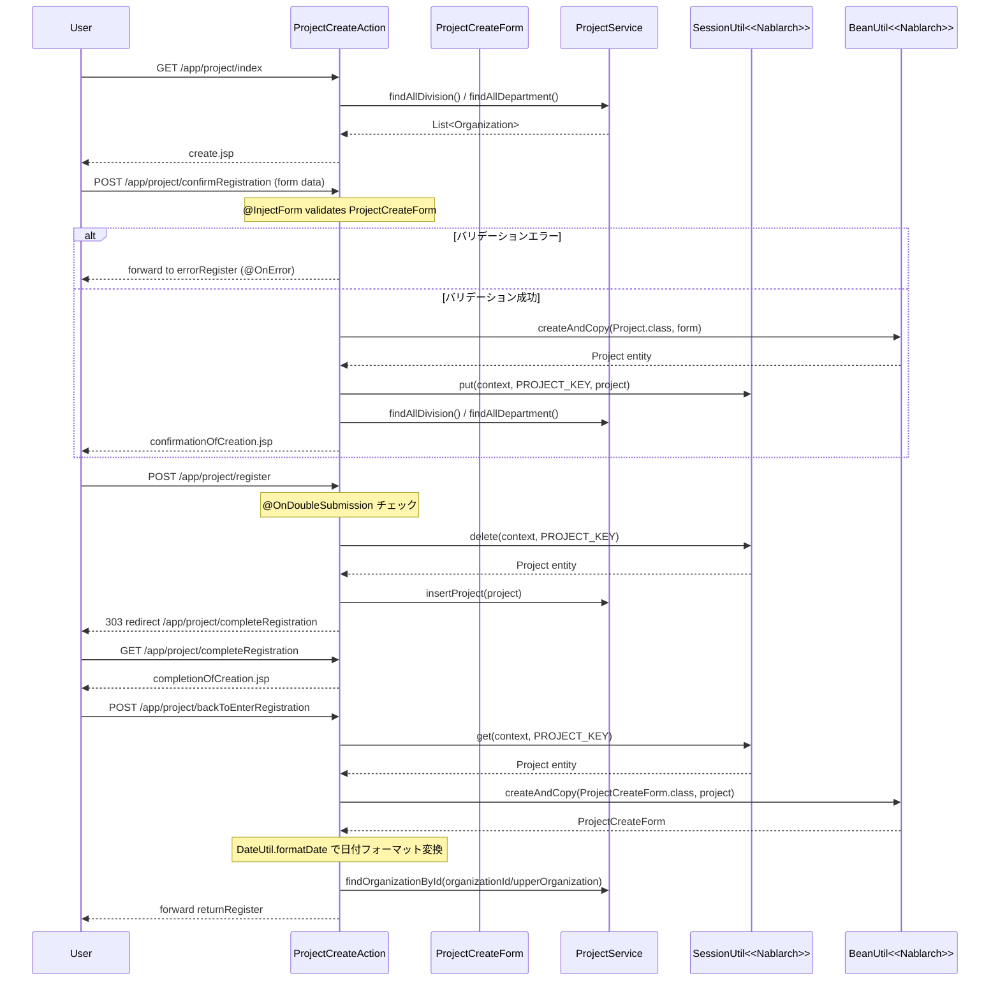

# Code Analysis: ProjectCreateAction

**Generated**: 2026-03-13 16:48:16
**Target**: プロジェクト登録処理アクション
**Modules**: proman-web, proman-common
**Analysis Duration**: approx. 2m 59s

---

## Overview

`ProjectCreateAction` はNablarchウェブアプリケーションにおけるプロジェクト登録機能を実装するアクションクラスです。入力→確認→登録→完了の4ステップからなるPRGパターン（Post-Redirect-Get）で実装されており、セッションストアを利用してステップ間でデータを受け渡します。

主な処理の流れ:
1. **初期表示** (`index`): 事業部・部門プルダウンをDBから取得して登録入力画面を表示する
2. **確認画面表示** (`confirmRegistration`): フォームバリデーション後、エンティティをセッションに保存して確認画面を表示する
3. **登録処理** (`register`): セッションからエンティティを取り出し、DBに登録してリダイレクトする（二重送信防止付き）
4. **完了画面表示** (`completeRegistration`): 登録完了画面を表示する
5. **入力画面へ戻る** (`backToEnterRegistration`): セッションのエンティティをフォームに変換して入力画面へ戻る

---

## Architecture

### Dependency Graph

```mermaid
classDiagram
    class ProjectCreateAction
    class ProjectCreateForm {
        <<Form>>
    }
    class ProjectService
    class Project {
        <<Entity>>
    }
    class Organization {
        <<Entity>>
    }
    class DaoContext {
        <<Nablarch>>
    }
    class SessionUtil {
        <<Nablarch>>
    }
    class BeanUtil {
        <<Nablarch>>
    }
    class InjectForm {
        <<Nablarch>>
    }
    class OnDoubleSubmission {
        <<Nablarch>>
    }
    class ExecutionContext {
        <<Nablarch>>
    }

    ProjectCreateAction ..> ProjectCreateForm : validates
    ProjectCreateAction ..> ProjectService : delegates to
    ProjectCreateAction ..> SessionUtil : stores/retrieves
    ProjectCreateAction ..> BeanUtil : converts
    ProjectCreateAction ..> ExecutionContext : uses
    ProjectCreateAction ..> InjectForm : annotated with
    ProjectCreateAction ..> OnDoubleSubmission : annotated with
    ProjectCreateForm ..|> Serializable : implements
    ProjectService ..> DaoContext : queries/persists
    ProjectService ..> Project : persists
    ProjectService ..> Organization : queries
```



**Note**: This diagram uses Mermaid `classDiagram` syntax to show class names and their relationships. Use `--|>` for inheritance (extends/implements) and `..>` for dependencies (uses/creates).

### Component Summary

| Component | Role | Type | Dependencies |
|-----------|------|------|--------------|
| ProjectCreateAction | プロジェクト登録フロー制御 | Action | ProjectCreateForm, ProjectService, SessionUtil, BeanUtil, ExecutionContext |
| ProjectCreateForm | 登録入力値の受付とバリデーション | Form | DateRelationUtil |
| ProjectService | DB操作のサービス層 | Service | DaoContext, Project, Organization |
| Project | プロジェクトエンティティ | Entity | なし |
| Organization | 組織エンティティ | Entity | なし |

---

## Flow

### Processing Flow

プロジェクト登録は入力→確認→登録→完了のPRGパターンで実装されています。

1. **初期表示** (`index`): `setOrganizationAndDivisionToRequestScope` で事業部・部門リストをDBから取得し、リクエストスコープにセット。`create.jsp` を返す。
2. **確認画面表示** (`confirmRegistration`): `@InjectForm` + `@OnError` でフォームバリデーション。バリデーション通過後、`BeanUtil.createAndCopy` でフォームを `Project` エンティティに変換し、`SessionUtil.put` でセッションに保存。確認画面を返す。
3. **登録処理** (`register`): `@OnDoubleSubmission` で二重送信防止。`SessionUtil.delete` でセッションからエンティティを取得・削除し、`ProjectService.insertProject` でDB登録。303リダイレクトで完了画面へ遷移する。
4. **完了画面** (`completeRegistration`): 完了JSPを返すのみ。
5. **入力へ戻る** (`backToEnterRegistration`): セッションのエンティティを `BeanUtil.createAndCopy` でフォームに変換、日付フォーマット処理後にリクエストスコープへセット。内部フォワードで入力画面へ戻る。

### Sequence Diagram



---

## Components

### ProjectCreateAction

**ファイル**: [ProjectCreateAction.java](../../.lw/nab-official/v5/nablarch-system-development-guide/Sample_Project/Source_Code/proman-project/proman-web/src/main/java/com/nablarch/example/proman/web/project/ProjectCreateAction.java)

**役割**: プロジェクト登録機能の全フロー（入力/確認/登録/完了/戻る）を制御するアクションクラス。

**主なメソッド**:
- `index` (L33-39): 初期表示。事業部・部門リストをDBから取得してリクエストスコープにセット。
- `confirmRegistration` (L48-63): `@InjectForm` + `@OnError` でバリデーション。エンティティをセッションに保存して確認画面を表示。
- `register` (L72-78): `@OnDoubleSubmission` で二重送信防止。セッションからエンティティを削除してDB登録し、303リダイレクト。
- `backToEnterRegistration` (L98-118): セッションのエンティティをフォームに変換し、日付フォーマット処理後に入力画面へ戻る。
- `setOrganizationAndDivisionToRequestScope` (L125-136): 事業部・部門リストの取得とスコープへのセットを共通処理としてまとめた private メソッド。

**依存コンポーネント**: ProjectCreateForm, ProjectService, SessionUtil, BeanUtil, DateUtil, ExecutionContext

---

### ProjectCreateForm

**ファイル**: [ProjectCreateForm.java](../../.lw/nab-official/v5/nablarch-system-development-guide/Sample_Project/Source_Code/proman-project/proman-web/src/main/java/com/nablarch/example/proman/web/project/ProjectCreateForm.java)

**役割**: プロジェクト登録入力値を受け付けるフォームクラス。Bean Validationアノテーションでバリデーションルールを定義する。

**主なフィールドとバリデーション**:
- `projectName` (L27): `@Required` + `@Domain("projectName")`
- `projectStartDate`, `projectEndDate` (L48, L54): `@Required` + `@Domain("date")`
- `isValidProjectPeriod` (L329): `@AssertTrue` で開始日≦終了日の相関バリデーション

**実装ポイント**:
- `Serializable` を実装（`@InjectForm` でセッションストアに格納可能とするため）
- 全入力プロパティは `String` 型で宣言

---

### ProjectService

**ファイル**: [ProjectService.java](../../.lw/nab-official/v5/nablarch-system-development-guide/Sample_Project/Source_Code/proman-project/proman-web/src/main/java/com/nablarch/example/proman/web/project/ProjectService.java)

**役割**: プロジェクト・組織のDB操作をまとめたサービスクラス。`DaoContext`（UniversalDao）を利用してDBアクセスを行う。

**主なメソッド**:
- `findAllDivision` (L50): `universalDao.findAllBySqlFile(Organization.class, "FIND_ALL_DIVISION")` で全事業部取得
- `findAllDepartment` (L59): `universalDao.findAllBySqlFile(Organization.class, "FIND_ALL_DEPARTMENT")` で全部門取得
- `findOrganizationById` (L70): `universalDao.findById(Organization.class, param)` で組織をIDで取得
- `insertProject` (L80): `universalDao.insert(project)` でプロジェクトをDB登録

**依存コンポーネント**: DaoContext (UniversalDao), Project, Organization

---

## Nablarch Framework Usage

### @InjectForm

**クラス**: `nablarch.common.web.interceptor.InjectForm`

**説明**: 業務アクションメソッドに付与することで、リクエストパラメータのフォームへのバインドとBean Validationによるバリデーションを自動実行するアノテーション。

**使用方法**:
```java
@InjectForm(form = ProjectCreateForm.class, prefix = "form")
@OnError(type = ApplicationException.class, path = "forward:///app/project/errorRegister")
public HttpResponse confirmRegistration(HttpRequest request, ExecutionContext context) {
    ProjectCreateForm form = context.getRequestScopedVar("form");
    // ...
}
```

**重要ポイント**:
- ✅ **`@OnError` と組み合わせる**: バリデーションエラー時の遷移先を必ず指定する。エラー時は `ApplicationException` がスローされる
- ✅ **バリデーション済みフォームはリクエストスコープから取得**: `context.getRequestScopedVar("form")` で取得する
- ⚠️ **フォームはセッションに直接格納しない**: フォームをエンティティに変換してからセッションに保存する

**このコードでの使い方**:
- `confirmRegistration` メソッド (L48) に `@InjectForm(form = ProjectCreateForm.class, prefix = "form")` を付与
- バリデーションエラー時は `@OnError` で `/app/project/errorRegister` へフォワード

**詳細**: [Web Application Client_create2](../../.claude/skills/nabledge-5/docs/processing-pattern/web-application/web-application-client_create2.md)

---

### @OnDoubleSubmission

**クラス**: `nablarch.common.web.token.OnDoubleSubmission`

**説明**: 業務アクションメソッドに付与することで、二重送信（ダブルサブミット）を防止するアノテーション。同一トークンによる2回目以降のリクエストをエラー扱いにする。

**使用方法**:
```java
@OnDoubleSubmission
public HttpResponse register(HttpRequest request, ExecutionContext context) {
    // DB登録処理
}
```

**重要ポイント**:
- ✅ **DB更新・登録・削除処理に必ず付与**: ブラウザの戻るボタンや更新ボタンによる多重実行を防ぐ
- 💡 **サーバサイドとクライアントサイドの両方で制御**: JSP側でも `allowDoubleSubmission="false"` を指定する
- 🎯 **PRGパターンと組み合わせ**: 登録後は303リダイレクトで完了画面へ遷移することでブラウザ更新による再実行も防止する

**このコードでの使い方**:
- `register` メソッド (L72) に付与してプロジェクト登録処理の二重送信を防止

**詳細**: [Web Application Client_create4](../../.claude/skills/nabledge-5/docs/processing-pattern/web-application/web-application-client_create4.md)

---

### SessionUtil

**クラス**: `nablarch.common.web.session.SessionUtil`

**説明**: セッションストアへのオブジェクトの保存・取得・削除を行うユーティリティクラス。確認画面を持つ登録フローでステップ間のデータ受け渡しに使用する。

**使用方法**:
```java
// 保存
SessionUtil.put(context, "projectCreateActionProject", project);

// 取得
Project project = SessionUtil.get(context, "projectCreateActionProject");

// 取得して削除
Project project = SessionUtil.delete(context, "projectCreateActionProject");
```

**重要ポイント**:
- ✅ **フォームではなくエンティティを保存する**: フォームをセッションに直接格納せず、`BeanUtil` でエンティティに変換してから保存する
- ✅ **登録処理では `delete` を使う**: `SessionUtil.delete` でエンティティを取得しつつセッションから削除することで、不要なセッションデータが残らない
- ⚠️ **Serializable が必要**: セッションに格納するオブジェクトは `Serializable` を実装する必要がある

**このコードでの使い方**:
- `confirmRegistration` (L59): `SessionUtil.put` で Project をセッションに保存
- `register` (L74): `SessionUtil.delete` でセッションから Project を取得して削除
- `backToEnterRegistration` (L100): `SessionUtil.get` でセッションから Project を取得

**詳細**: [Web Application Client_create2](../../.claude/skills/nabledge-5/docs/processing-pattern/web-application/web-application-client_create2.md)

---

### BeanUtil

**クラス**: `nablarch.core.beans.BeanUtil`

**説明**: JavaBeansのプロパティコピーを行うユーティリティクラス。フォームからエンティティへ、またはエンティティからフォームへの変換に使用する。

**使用方法**:
```java
// フォーム → エンティティ
Project project = BeanUtil.createAndCopy(Project.class, form);

// エンティティ → フォーム
ProjectCreateForm form = BeanUtil.createAndCopy(ProjectCreateForm.class, project);
```

**重要ポイント**:
- 💡 **同名プロパティを自動コピー**: フォームとエンティティで同じプロパティ名を使うことで自動的に値がコピーされる
- ⚠️ **型変換**: プロパティ型が異なる場合は型互換がある組み合わせのみ変換される

**このコードでの使い方**:
- `confirmRegistration` (L52): `BeanUtil.createAndCopy(Project.class, form)` でフォームをエンティティに変換
- `backToEnterRegistration` (L101): `BeanUtil.createAndCopy(ProjectCreateForm.class, project)` でエンティティをフォームに変換

**詳細**: [Web Application Client_create3](../../.claude/skills/nabledge-5/docs/processing-pattern/web-application/web-application-client_create3.md)

---

### DaoContext (UniversalDao)

**クラス**: `nablarch.common.dao.DaoContext`

**説明**: データベース操作を提供するインタフェース。`ProjectService` 内で `DaoFactory.create()` により生成されたインスタンスを使用する。SQLファイルを使った検索や、エンティティを使ったCRUD操作を提供する。

**使用方法**:
```java
// SQLファイルを使った全件取得
List<Organization> divisions = universalDao.findAllBySqlFile(Organization.class, "FIND_ALL_DIVISION");

// IDによる1件取得
Organization org = universalDao.findById(Organization.class, new Object[]{organizationId});

// 登録
universalDao.insert(project);
```

**重要ポイント**:
- ✅ **SQLは外部ファイルで管理**: SQLインジェクション防止のためSQLは外部ファイルに記述する
- 💡 **エンティティクラスと対応したテーブルを自動認識**: エンティティのアノテーションによりテーブルマッピングが定義される
- 🎯 **トランザクション管理はハンドラに委譲**: DaoContextの操作はNablarchのハンドラ（DBConnectionManagementHandler等）によりトランザクション管理される

**このコードでの使い方**:
- `ProjectService.findAllDivision/findAllDepartment` (L50-61): SQLファイルで全事業部・全部門を取得
- `ProjectService.insertProject` (L80): プロジェクトをDB登録
- `ProjectService.findOrganizationById` (L70): IDで組織を1件取得

**詳細**: [Web Application Getting Started Project Update](../../.claude/skills/nabledge-5/docs/processing-pattern/web-application/web-application-getting-started-project-update.md)

---

## References

### Source Files

- [ProjectCreateAction.java (.lw/nab-official/v5/nablarch-system-development-guide/en/Sample_Project/Source_Code/proman-project/proman-web/src/main/java/com/nablarch/example/proman/web/project)](../../.lw/nab-official/v5/nablarch-system-development-guide/en/Sample_Project/Source_Code/proman-project/proman-web/src/main/java/com/nablarch/example/proman/web/project/ProjectCreateAction.java) - ProjectCreateAction
- [ProjectCreateAction.java (.lw/nab-official/v5/nablarch-system-development-guide/Sample_Project/Source_Code/proman-project/proman-web/src/main/java/com/nablarch/example/proman/web/project)](../../.lw/nab-official/v5/nablarch-system-development-guide/Sample_Project/Source_Code/proman-project/proman-web/src/main/java/com/nablarch/example/proman/web/project/ProjectCreateAction.java) - ProjectCreateAction
- [ProjectCreateAction.java (.lw/nab-official/v6/nablarch-system-development-guide/en/Sample_Project/Source_Code/proman-project/proman-web/src/main/java/com/nablarch/example/proman/web/project)](../../.lw/nab-official/v6/nablarch-system-development-guide/en/Sample_Project/Source_Code/proman-project/proman-web/src/main/java/com/nablarch/example/proman/web/project/ProjectCreateAction.java) - ProjectCreateAction
- [ProjectCreateAction.java (.lw/nab-official/v6/nablarch-system-development-guide/Sample_Project/Source_Code/proman-project/proman-web/src/main/java/com/nablarch/example/proman/web/project)](../../.lw/nab-official/v6/nablarch-system-development-guide/Sample_Project/Source_Code/proman-project/proman-web/src/main/java/com/nablarch/example/proman/web/project/ProjectCreateAction.java) - ProjectCreateAction
- [ProjectCreateForm.java (.lw/nab-official/v5/nablarch-system-development-guide/en/Sample_Project/Source_Code/proman-project/proman-web/src/main/java/com/nablarch/example/proman/web/project)](../../.lw/nab-official/v5/nablarch-system-development-guide/en/Sample_Project/Source_Code/proman-project/proman-web/src/main/java/com/nablarch/example/proman/web/project/ProjectCreateForm.java) - ProjectCreateForm
- [ProjectCreateForm.java (.lw/nab-official/v5/nablarch-system-development-guide/Sample_Project/Source_Code/proman-project/proman-web/src/main/java/com/nablarch/example/proman/web/project)](../../.lw/nab-official/v5/nablarch-system-development-guide/Sample_Project/Source_Code/proman-project/proman-web/src/main/java/com/nablarch/example/proman/web/project/ProjectCreateForm.java) - ProjectCreateForm
- [ProjectCreateForm.java (.lw/nab-official/v6/nablarch-system-development-guide/en/Sample_Project/Source_Code/proman-project/proman-web/src/main/java/com/nablarch/example/proman/web/project)](../../.lw/nab-official/v6/nablarch-system-development-guide/en/Sample_Project/Source_Code/proman-project/proman-web/src/main/java/com/nablarch/example/proman/web/project/ProjectCreateForm.java) - ProjectCreateForm
- [ProjectCreateForm.java (.lw/nab-official/v6/nablarch-system-development-guide/Sample_Project/Source_Code/proman-project/proman-web/src/main/java/com/nablarch/example/proman/web/project)](../../.lw/nab-official/v6/nablarch-system-development-guide/Sample_Project/Source_Code/proman-project/proman-web/src/main/java/com/nablarch/example/proman/web/project/ProjectCreateForm.java) - ProjectCreateForm
- [ProjectService.java (.lw/nab-official/v5/nablarch-system-development-guide/en/Sample_Project/Source_Code/proman-project/proman-web/src/main/java/com/nablarch/example/proman/web/project)](../../.lw/nab-official/v5/nablarch-system-development-guide/en/Sample_Project/Source_Code/proman-project/proman-web/src/main/java/com/nablarch/example/proman/web/project/ProjectService.java) - ProjectService
- [ProjectService.java (.lw/nab-official/v5/nablarch-system-development-guide/Sample_Project/Source_Code/proman-project/proman-web/src/main/java/com/nablarch/example/proman/web/project)](../../.lw/nab-official/v5/nablarch-system-development-guide/Sample_Project/Source_Code/proman-project/proman-web/src/main/java/com/nablarch/example/proman/web/project/ProjectService.java) - ProjectService
- [ProjectService.java (.lw/nab-official/v6/nablarch-system-development-guide/en/Sample_Project/Source_Code/proman-project/proman-web/src/main/java/com/nablarch/example/proman/web/project)](../../.lw/nab-official/v6/nablarch-system-development-guide/en/Sample_Project/Source_Code/proman-project/proman-web/src/main/java/com/nablarch/example/proman/web/project/ProjectService.java) - ProjectService
- [ProjectService.java (.lw/nab-official/v6/nablarch-system-development-guide/Sample_Project/Source_Code/proman-project/proman-web/src/main/java/com/nablarch/example/proman/web/project)](../../.lw/nab-official/v6/nablarch-system-development-guide/Sample_Project/Source_Code/proman-project/proman-web/src/main/java/com/nablarch/example/proman/web/project/ProjectService.java) - ProjectService

### Knowledge Base (Nabledge-5)

- [Web Application Client_create2](../../.claude/skills/nabledge-5/docs/processing-pattern/web-application/web-application-client_create2.md)
- [Web Application Client_create3](../../.claude/skills/nabledge-5/docs/processing-pattern/web-application/web-application-client_create3.md)
- [Web Application Client_create4](../../.claude/skills/nabledge-5/docs/processing-pattern/web-application/web-application-client_create4.md)
- [Web Application Getting Started Project Update](../../.claude/skills/nabledge-5/docs/processing-pattern/web-application/web-application-getting-started-project-update.md)

### Official Documentation


- [BeanUtil](https://nablarch.github.io/docs/LATEST/javadoc/nablarch/core/beans/BeanUtil.html)
- [Client Create2](https://nablarch.github.io/docs/LATEST/doc/application_framework/application_framework/web/getting_started/client_create/client_create2.html)
- [Client Create3](https://nablarch.github.io/docs/LATEST/doc/application_framework/application_framework/web/getting_started/client_create/client_create3.html)
- [Client Create4](https://nablarch.github.io/docs/LATEST/doc/application_framework/application_framework/web/getting_started/client_create/client_create4.html)
- [Index](https://nablarch.github.io/docs/LATEST/doc/application_framework/application_framework/web/getting_started/project_update/index.html)
- [InjectForm](https://nablarch.github.io/docs/LATEST/javadoc/nablarch/common/web/interceptor/InjectForm.html)
- [NoDataException](https://nablarch.github.io/docs/LATEST/javadoc/nablarch/common/dao/NoDataException.html)
- [OnDoubleSubmission](https://nablarch.github.io/docs/LATEST/javadoc/nablarch/common/web/token/OnDoubleSubmission.html)
- [OnError](https://nablarch.github.io/docs/LATEST/javadoc/nablarch/fw/web/interceptor/OnError.html)
- [Required](https://nablarch.github.io/docs/LATEST/javadoc/nablarch/core/validation/ee/Required.html)
- [ResourceLocator](https://nablarch.github.io/docs/LATEST/javadoc/nablarch/fw/web/ResourceLocator.html)
- [SessionUtil](https://nablarch.github.io/docs/LATEST/javadoc/nablarch/common/web/session/SessionUtil.html)
- [UniversalDao](https://nablarch.github.io/docs/LATEST/javadoc/nablarch/common/dao/UniversalDao.html)

---

**Note**: This documentation was generated by the code-analysis workflow of the nabledge-5 skill.
