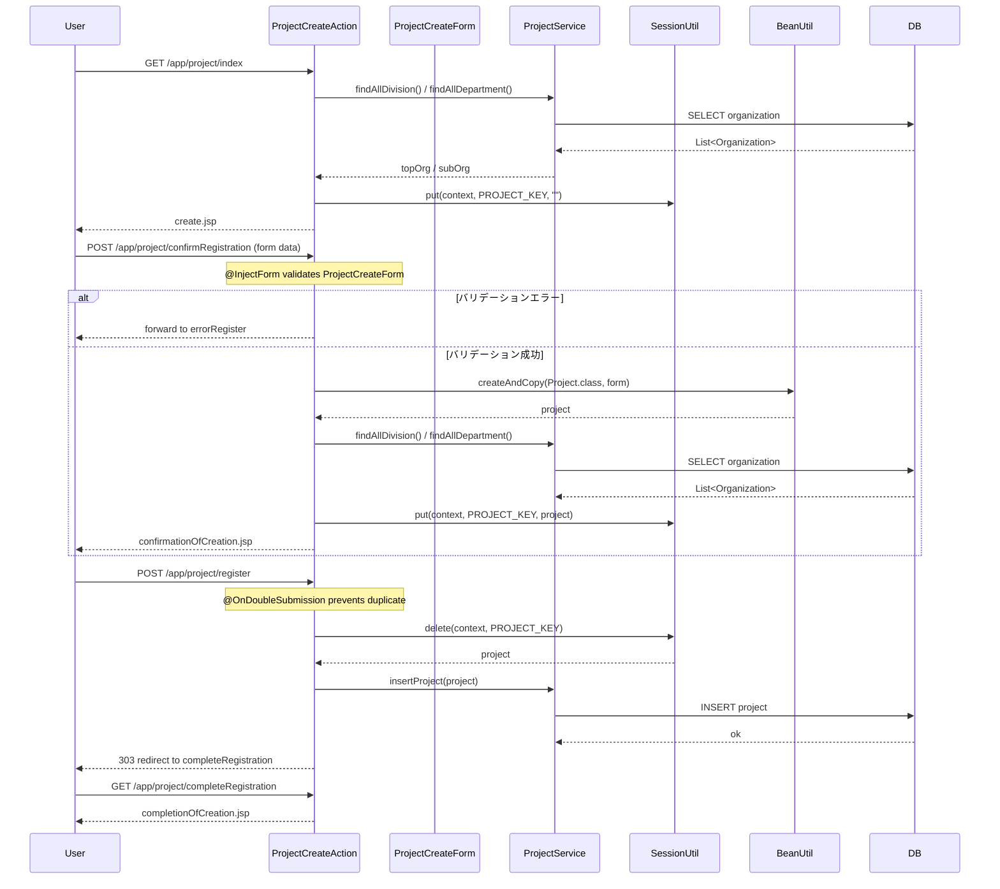

# Code Analysis: ProjectCreateAction

**Generated**: 2026-03-13 16:52:56
**Target**: プロジェクト登録処理（入力・確認・登録・完了・戻る）
**Modules**: proman-web
**Analysis Duration**: approx. 3m 40s

---

## Overview

`ProjectCreateAction` はプロジェクト登録機能を担う Nablarch Web アクションクラス。入力画面表示 → バリデーション＆確認画面表示 → DB登録 → 完了画面表示 という4画面遷移フロー（＋確認→入力への「戻る」）を実装する。

セッションストア（`SessionUtil`）を使って入力→確認→登録の画面間でエンティティを引き回す PRGパターン（Post/Redirect/Get）を採用。バリデーションは `@InjectForm` インターセプターで自動実行し、二重送信防止は `@OnDoubleSubmission` で制御する。

---

## Architecture

### Dependency Graph

```mermaid
classDiagram
    class ProjectCreateAction
    class ProjectCreateForm {
        <<Form>>
    }
    class ProjectService
    class Project {
        <<Entity>>
    }
    class Organization {
        <<Entity>>
    }
    class DaoContext {
        <<Nablarch>>
    }
    class SessionUtil {
        <<Nablarch>>
    }
    class BeanUtil {
        <<Nablarch>>
    }
    class ExecutionContext {
        <<Nablarch>>
    }
    class DateUtil {
        <<Nablarch>>
    }

    ProjectCreateForm ..|> Serializable : implements
    ProjectCreateAction ..> ProjectCreateForm : validates
    ProjectCreateAction ..> ProjectService : delegates to
    ProjectCreateAction ..> SessionUtil : uses
    ProjectCreateAction ..> BeanUtil : converts
    ProjectCreateAction ..> ExecutionContext : uses
    ProjectService ..> DaoContext : queries/persists
    ProjectService ..> Project : persists
    ProjectService ..> Organization : queries
    ProjectCreateAction ..> DateUtil : formats
```



**Note**: This diagram uses Mermaid `classDiagram` syntax to show class names and their relationships. Use `--|>` for inheritance (extends/implements) and `..>` for dependencies (uses/creates).

### Component Summary

| Component | Role | Type | Dependencies |
|-----------|------|------|--------------|
| ProjectCreateAction | プロジェクト登録アクション（5メソッド） | Action | ProjectCreateForm, ProjectService, SessionUtil, BeanUtil, ExecutionContext, DateUtil |
| ProjectCreateForm | プロジェクト登録入力フォーム（バリデーション定義） | Form | DateRelationUtil |
| ProjectService | プロジェクト・組織DBアクセスサービス | Service | DaoContext (UniversalDao) |
| Project | プロジェクトエンティティ | Entity | なし |
| Organization | 組織エンティティ | Entity | なし |

---

## Flow

### Processing Flow

プロジェクト登録は以下の5ステップで構成される。

1. **初期表示** (`index`): 事業部・部門プルダウンをDBから取得してリクエストスコープに設定し、入力画面（create.jsp）を返す。
2. **確認画面表示** (`confirmRegistration`): `@InjectForm` でバリデーション実行。フォームをエンティティに変換してセッションストアに保存後、確認画面を返す。エラー時は `@OnError` により入力エラー処理へ内部フォーワード。
3. **登録処理** (`register`): `@OnDoubleSubmission` で二重送信を防止。セッションからエンティティを取り出して `ProjectService.insertProject()` でDB登録。303 リダイレクトで完了画面へ遷移（PRGパターン）。
4. **完了画面表示** (`completeRegistration`): 完了画面 JSP を返すのみ。
5. **入力画面へ戻る** (`backToEnterRegistration`): セッションからエンティティを取得し、`BeanUtil` でフォームに変換。日付は `DateUtil.formatDate()` で yyyy/MM/dd にフォーマット。組織IDから事業部を逆引きして事業部IDをフォームに設定後、内部フォーワードで入力エラー処理へ遷移。

### Sequence Diagram



---

## Components

### ProjectCreateAction

**ファイル**: [ProjectCreateAction.java](../../.lw/nab-official/v5/nablarch-system-development-guide/Sample_Project/Source_Code/proman-project/proman-web/src/main/java/com/nablarch/example/proman/web/project/ProjectCreateAction.java)

**役割**: プロジェクト登録機能の全画面遷移を制御するアクションクラス。

**主要メソッド**:

- `index(HttpRequest, ExecutionContext)` (L33-39): 初期表示。事業部・部門リストをDBから取得してリクエストスコープに設定し、入力画面を返す。
- `confirmRegistration(HttpRequest, ExecutionContext)` (L48-63): 確認画面表示。`@InjectForm` でバリデーション実行、フォーム→エンティティ変換、セッション保存。
- `register(HttpRequest, ExecutionContext)` (L72-78): 登録処理。`@OnDoubleSubmission` で二重送信防止。セッションからエンティティを取り出しDB登録後、303リダイレクト。
- `completeRegistration(HttpRequest, ExecutionContext)` (L87-89): 完了画面を返すのみ。
- `backToEnterRegistration(HttpRequest, ExecutionContext)` (L98-118): セッションからエンティティを取得してフォームに変換、日付フォーマット、事業部逆引きを行い入力画面へ戻る。

**依存関係**: ProjectCreateForm, ProjectService, SessionUtil, BeanUtil, ExecutionContext, DateUtil, Project, Organization

**実装上のポイント**:
- セッションキー `projectCreateActionProject` はフィールド定数 `PROJECT_KEY` で管理（L25）
- `confirmRegistration` では事業部・部門プルダウンを再取得している（確認画面表示にも必要なため）
- `backToEnterRegistration` では組織IDから事業部を2段階で逆引きしている（Organization→upperOrganizationを利用）

---

### ProjectCreateForm

**ファイル**: [ProjectCreateForm.java](../../.lw/nab-official/v5/nablarch-system-development-guide/Sample_Project/Source_Code/proman-project/proman-web/src/main/java/com/nablarch/example/proman/web/project/ProjectCreateForm.java)

**役割**: プロジェクト登録入力値を受け取るフォームクラス。Bean Validation アノテーションでバリデーションルールを定義する。

**主要フィールドとバリデーション**:
- `projectName` (L27): `@Required @Domain("projectName")`
- `projectStartDate`, `projectEndDate` (L48, L55): `@Required @Domain("date")`
- `divisionId`, `organizationId` (L62, L69): `@Required @Domain("organizationId")`
- `isValidProjectPeriod()` (L329-331): `@AssertTrue` による開始日≦終了日クロスフィールドバリデーション

**依存関係**: `DateRelationUtil`（日付期間バリデーション）

---

### ProjectService

**ファイル**: [ProjectService.java](../../.lw/nab-official/v5/nablarch-system-development-guide/Sample_Project/Source_Code/proman-project/proman-web/src/main/java/com/nablarch/example/proman/web/project/ProjectService.java)

**役割**: プロジェクト・組織のDBアクセスをまとめたサービスクラス。`DaoContext`（UniversalDAO）を使ってSQLを実行する。

**主要メソッド**:
- `findAllDivision()` (L50-52): 全事業部をSQLファイル `FIND_ALL_DIVISION` で取得
- `findAllDepartment()` (L59-61): 全部門をSQLファイル `FIND_ALL_DEPARTMENT` で取得
- `findOrganizationById(Integer)` (L70-73): 組織IDで組織を1件取得
- `insertProject(Project)` (L80-82): プロジェクトをDB登録

**依存関係**: `DaoContext`（`DaoFactory.create()` で生成）, `Project`, `Organization`

---

## Nablarch Framework Usage

### @InjectForm

**クラス**: `nablarch.common.web.interceptor.InjectForm`

**説明**: アクションメソッドに付与することで、リクエストパラメータをフォームクラスにバインドし、Bean Validation を自動実行するインターセプター。

**使用方法**:
```java
@InjectForm(form = ProjectCreateForm.class, prefix = "form")
@OnError(type = ApplicationException.class, path = "forward:///app/project/errorRegister")
public HttpResponse confirmRegistration(HttpRequest request, ExecutionContext context) {
    ProjectCreateForm form = context.getRequestScopedVar("form");
    // バリデーション済みフォームを使用
}
```

**重要ポイント**:
- ✅ **フォームは Serializable を実装**: セッションストアに保存する場合は必須（`ProjectCreateForm implements Serializable`）
- ✅ **@OnError とセットで使う**: バリデーションエラー時の遷移先を必ず指定する
- ⚠️ **フォームはセッションストアに保存しない**: バリデーションエラーの際にフォームの値はリクエストスコープで受け渡す。セッションに保存するのはエンティティ
- 💡 **リクエストスコープから取得**: バリデーション成功後は `context.getRequestScopedVar("form")` でフォームを取得できる

**このコードでの使い方**:
- `confirmRegistration` メソッド（L48）に付与
- バリデーション成功後にリクエストスコープから `ProjectCreateForm` を取得してエンティティに変換

**詳細**: [Web Application Client Create2](../../.claude/skills/nabledge-5/docs/processing-pattern/web-application/web-application-client_create2.md)

---

### SessionUtil

**クラス**: `nablarch.common.web.session.SessionUtil`

**説明**: セッションストアへのアクセスを提供するユーティリティクラス。`put` / `get` / `delete` で画面間でエンティティを引き回す。

**使用方法**:
```java
// 確認画面へ遷移時: エンティティをセッションに保存
SessionUtil.put(context, PROJECT_KEY, project);

// 登録処理時: セッションからエンティティを取り出して削除
final Project project = SessionUtil.delete(context, PROJECT_KEY);

// 戻る処理時: セッションからエンティティを取得（削除しない）
Project project = SessionUtil.get(context, PROJECT_KEY);
```

**重要ポイント**:
- ✅ **フォームではなくエンティティを保存**: `BeanUtil.createAndCopy` でフォームをエンティティに変換してからセッションに保存する
- ✅ **登録処理では `delete` を使う**: `get` ではなく `delete` を使うことで、登録後にセッションからデータが消え、再登録を防止できる
- ⚠️ **セッションキーの管理**: キー名は定数で管理する（`PROJECT_KEY = "projectCreateActionProject"`）
- ⚠️ **不正遷移時は `SessionKeyNotFoundException`**: セッションにデータが存在しない場合（ブラウザバック等）に送出される。`@OnError` で捕捉して適切なページへ誘導すること
- 💡 **DBストア推奨**: 入力〜確認〜完了の画面間データ保持には複数タブ操作を許容しない場合はDBストアを使用する

**このコードでの使い方**:
- `index` / `confirmRegistration` (L59, L132): `put` でプロジェクトまたは空文字をセッションに保存
- `register` (L74): `delete` でセッションからプロジェクトを取り出して削除
- `backToEnterRegistration` (L100): `get` でセッションからプロジェクトを取得

**詳細**: [Libraries Session Store](../../.claude/skills/nabledge-5/docs/component/libraries/libraries-session_store.md)

---

### BeanUtil

**クラス**: `nablarch.core.beans.BeanUtil`

**説明**: JavaBean間でプロパティをコピーするユーティリティ。フォーム→エンティティ、エンティティ→フォームの変換に使用する。

**使用方法**:
```java
// フォーム → エンティティ（確認画面表示時）
Project project = BeanUtil.createAndCopy(Project.class, form);

// エンティティ → フォーム（戻る処理時）
ProjectCreateForm projectCreateForm = BeanUtil.createAndCopy(ProjectCreateForm.class, project);
```

**重要ポイント**:
- ✅ **プロパティ名の一致が必要**: ソースとターゲットのプロパティ名が一致している項目のみコピーされる
- ⚠️ **型変換に注意**: フォームは全フィールド String 型なのに対し、エンティティは Integer 等を持つ場合がある。型が異なる場合は自動変換されるが、変換できない場合は例外になる
- 💡 **セッションに保存するのはエンティティ**: フォームはセッションに保存せず、`createAndCopy` でエンティティに変換してからセッションに保存する

**このコードでの使い方**:
- `confirmRegistration` (L52): `ProjectCreateForm` → `Project` の変換
- `backToEnterRegistration` (L101): `Project` → `ProjectCreateForm` の変換

**詳細**: [Libraries Create Example](../../.claude/skills/nabledge-5/docs/component/libraries/libraries-create_example.md)

---

### @OnDoubleSubmission

**クラス**: `nablarch.common.web.token.OnDoubleSubmission`

**説明**: アクションメソッドに付与することで、同じリクエストの二重送信（ブラウザの再読み込みや二度押し）を検知してエラーページへ遷移させるインターセプター。

**使用方法**:
```java
@OnDoubleSubmission
public HttpResponse register(HttpRequest request, ExecutionContext context) {
    // 二重送信防止済みの登録処理
}
```

**重要ポイント**:
- ✅ **登録・更新・削除処理に必ず付与**: DB変更を伴うメソッドには必ず付与して二重送信を防止する
- 💡 **サーバーサイドとクライアントサイドの両方で制御**: JSP 側でも `allowDoubleSubmission="false"` を設定することで JS による制御も追加できるが、JS が無効な場合に備えてサーバーサイドでも必ず制御する
- 🎯 **PRGパターンと組み合わせる**: 登録後に 303 リダイレクトすることで、ブラウザのリロードによる再送信を防止する

**このコードでの使い方**:
- `register` メソッド（L72）に付与。登録処理の二重実行を防止

**詳細**: [Web Application Client Create4](../../.claude/skills/nabledge-5/docs/processing-pattern/web-application/web-application-client_create4.md)

---

### DaoContext (UniversalDAO)

**クラス**: `nablarch.common.dao.DaoContext`

**説明**: JPA アノテーションを使った簡易 O/R マッパー。エンティティの CRUD 操作とSQLファイルを使った柔軟な検索を提供する。`ProjectService` では `DaoFactory.create()` で取得した `DaoContext` を介して使用している。

**使用方法**:
```java
// 登録
universalDao.insert(project);

// SQLファイルによる全件取得
universalDao.findAllBySqlFile(Organization.class, "FIND_ALL_DIVISION");

// 主キーによる1件取得
universalDao.findById(Organization.class, organizationId);
```

**重要ポイント**:
- ✅ **エンティティに JPA アノテーションが必要**: `@Table`, `@Id`, `@Column` 等を Entity クラスに付与する
- ⚠️ **主キー以外の条件での更新・削除は不可**: 主キー以外の条件での UPDATE/DELETE は `DaoContext` では行えない。この場合は `DatabaseAccessor` を使用する
- 💡 **SQLファイルによる柔軟な検索**: `findAllBySqlFile` / `findBySqlFile` でSQL IDを指定した複雑な検索が可能

**このコードでの使い方**:
- `ProjectService.insertProject()` (L80-82): `universalDao.insert(project)` でプロジェクトを登録
- `ProjectService.findAllDivision()` (L50-52): SQLファイルで全事業部を取得
- `ProjectService.findOrganizationById()` (L70-73): 主キーで組織を1件取得

**詳細**: [Libraries Universal DAO](../../.claude/skills/nabledge-5/docs/component/libraries/libraries-universal_dao.md)

---

## References

### Source Files

- [ProjectCreateAction.java (.lw/nab-official/v5/nablarch-system-development-guide/en/Sample_Project/Source_Code/proman-project/proman-web/src/main/java/com/nablarch/example/proman/web/project)](../../.lw/nab-official/v5/nablarch-system-development-guide/en/Sample_Project/Source_Code/proman-project/proman-web/src/main/java/com/nablarch/example/proman/web/project/ProjectCreateAction.java) - ProjectCreateAction
- [ProjectCreateAction.java (.lw/nab-official/v5/nablarch-system-development-guide/Sample_Project/Source_Code/proman-project/proman-web/src/main/java/com/nablarch/example/proman/web/project)](../../.lw/nab-official/v5/nablarch-system-development-guide/Sample_Project/Source_Code/proman-project/proman-web/src/main/java/com/nablarch/example/proman/web/project/ProjectCreateAction.java) - ProjectCreateAction
- [ProjectCreateAction.java (.lw/nab-official/v6/nablarch-system-development-guide/en/Sample_Project/Source_Code/proman-project/proman-web/src/main/java/com/nablarch/example/proman/web/project)](../../.lw/nab-official/v6/nablarch-system-development-guide/en/Sample_Project/Source_Code/proman-project/proman-web/src/main/java/com/nablarch/example/proman/web/project/ProjectCreateAction.java) - ProjectCreateAction
- [ProjectCreateAction.java (.lw/nab-official/v6/nablarch-system-development-guide/Sample_Project/Source_Code/proman-project/proman-web/src/main/java/com/nablarch/example/proman/web/project)](../../.lw/nab-official/v6/nablarch-system-development-guide/Sample_Project/Source_Code/proman-project/proman-web/src/main/java/com/nablarch/example/proman/web/project/ProjectCreateAction.java) - ProjectCreateAction
- [ProjectCreateForm.java (.lw/nab-official/v5/nablarch-system-development-guide/en/Sample_Project/Source_Code/proman-project/proman-web/src/main/java/com/nablarch/example/proman/web/project)](../../.lw/nab-official/v5/nablarch-system-development-guide/en/Sample_Project/Source_Code/proman-project/proman-web/src/main/java/com/nablarch/example/proman/web/project/ProjectCreateForm.java) - ProjectCreateForm
- [ProjectCreateForm.java (.lw/nab-official/v5/nablarch-system-development-guide/Sample_Project/Source_Code/proman-project/proman-web/src/main/java/com/nablarch/example/proman/web/project)](../../.lw/nab-official/v5/nablarch-system-development-guide/Sample_Project/Source_Code/proman-project/proman-web/src/main/java/com/nablarch/example/proman/web/project/ProjectCreateForm.java) - ProjectCreateForm
- [ProjectCreateForm.java (.lw/nab-official/v6/nablarch-system-development-guide/en/Sample_Project/Source_Code/proman-project/proman-web/src/main/java/com/nablarch/example/proman/web/project)](../../.lw/nab-official/v6/nablarch-system-development-guide/en/Sample_Project/Source_Code/proman-project/proman-web/src/main/java/com/nablarch/example/proman/web/project/ProjectCreateForm.java) - ProjectCreateForm
- [ProjectCreateForm.java (.lw/nab-official/v6/nablarch-system-development-guide/Sample_Project/Source_Code/proman-project/proman-web/src/main/java/com/nablarch/example/proman/web/project)](../../.lw/nab-official/v6/nablarch-system-development-guide/Sample_Project/Source_Code/proman-project/proman-web/src/main/java/com/nablarch/example/proman/web/project/ProjectCreateForm.java) - ProjectCreateForm
- [ProjectService.java (.lw/nab-official/v5/nablarch-system-development-guide/en/Sample_Project/Source_Code/proman-project/proman-web/src/main/java/com/nablarch/example/proman/web/project)](../../.lw/nab-official/v5/nablarch-system-development-guide/en/Sample_Project/Source_Code/proman-project/proman-web/src/main/java/com/nablarch/example/proman/web/project/ProjectService.java) - ProjectService
- [ProjectService.java (.lw/nab-official/v5/nablarch-system-development-guide/Sample_Project/Source_Code/proman-project/proman-web/src/main/java/com/nablarch/example/proman/web/project)](../../.lw/nab-official/v5/nablarch-system-development-guide/Sample_Project/Source_Code/proman-project/proman-web/src/main/java/com/nablarch/example/proman/web/project/ProjectService.java) - ProjectService
- [ProjectService.java (.lw/nab-official/v6/nablarch-system-development-guide/en/Sample_Project/Source_Code/proman-project/proman-web/src/main/java/com/nablarch/example/proman/web/project)](../../.lw/nab-official/v6/nablarch-system-development-guide/en/Sample_Project/Source_Code/proman-project/proman-web/src/main/java/com/nablarch/example/proman/web/project/ProjectService.java) - ProjectService
- [ProjectService.java (.lw/nab-official/v6/nablarch-system-development-guide/Sample_Project/Source_Code/proman-project/proman-web/src/main/java/com/nablarch/example/proman/web/project)](../../.lw/nab-official/v6/nablarch-system-development-guide/Sample_Project/Source_Code/proman-project/proman-web/src/main/java/com/nablarch/example/proman/web/project/ProjectService.java) - ProjectService

### Knowledge Base (Nabledge-5)

- [Libraries Session_store](../../.claude/skills/nabledge-5/docs/component/libraries/libraries-session_store.md)
- [Libraries Universal_dao](../../.claude/skills/nabledge-5/docs/component/libraries/libraries-universal_dao.md)
- [Libraries Create_example](../../.claude/skills/nabledge-5/docs/component/libraries/libraries-create_example.md)
- [Web Application Client_create2](../../.claude/skills/nabledge-5/docs/processing-pattern/web-application/web-application-client_create2.md)
- [Web Application Client_create3](../../.claude/skills/nabledge-5/docs/processing-pattern/web-application/web-application-client_create3.md)
- [Web Application Client_create4](../../.claude/skills/nabledge-5/docs/processing-pattern/web-application/web-application-client_create4.md)

### Official Documentation


- [AesEncryptor](https://nablarch.github.io/docs/LATEST/javadoc/nablarch/common/encryption/AesEncryptor.html)
- [Base64Key](https://nablarch.github.io/docs/LATEST/javadoc/nablarch/common/encryption/Base64Key.html)
- [Base64Util](https://nablarch.github.io/docs/LATEST/javadoc/nablarch/core/util/Base64Util.html)
- [BasicDaoContextFactory](https://nablarch.github.io/docs/LATEST/javadoc/nablarch/common/dao/BasicDaoContextFactory.html)
- [BeanUtil](https://nablarch.github.io/docs/LATEST/javadoc/nablarch/core/beans/BeanUtil.html)
- [Client Create2](https://nablarch.github.io/docs/LATEST/doc/application_framework/application_framework/web/getting_started/client_create/client_create2.html)
- [Client Create3](https://nablarch.github.io/docs/LATEST/doc/application_framework/application_framework/web/getting_started/client_create/client_create3.html)
- [Client Create4](https://nablarch.github.io/docs/LATEST/doc/application_framework/application_framework/web/getting_started/client_create/client_create4.html)
- [ConnectionFactory](https://nablarch.github.io/docs/LATEST/javadoc/nablarch/core/db/connection/ConnectionFactory.html)
- [Create Example](https://nablarch.github.io/docs/LATEST/doc/application_framework/application_framework/libraries/session_store/create_example.html)
- [DatabaseMetaDataExtractor](https://nablarch.github.io/docs/LATEST/javadoc/nablarch/common/dao/DatabaseMetaDataExtractor.html)
- [DbStore](https://nablarch.github.io/docs/LATEST/javadoc/nablarch/common/web/session/store/DbStore.html)
- [DeferredEntityList](https://nablarch.github.io/docs/LATEST/javadoc/nablarch/common/dao/DeferredEntityList.html)
- [Dialect](https://nablarch.github.io/docs/LATEST/javadoc/nablarch/core/db/dialect/Dialect.html)
- [EntityList](https://nablarch.github.io/docs/LATEST/javadoc/nablarch/common/dao/EntityList.html)
- [ExecutionContext](https://nablarch.github.io/docs/LATEST/javadoc/nablarch/fw/ExecutionContext.html)
- [GenerationType](https://nablarch.github.io/docs/LATEST/javadoc/javax/persistence/GenerationType.html)
- [H2Dialect](https://nablarch.github.io/docs/LATEST/javadoc/nablarch/core/db/dialect/H2Dialect.html)
- [InjectForm](https://nablarch.github.io/docs/LATEST/javadoc/nablarch/common/web/interceptor/InjectForm.html)
- [JavaSerializeEncryptStateEncoder](https://nablarch.github.io/docs/LATEST/javadoc/nablarch/common/web/session/encoder/JavaSerializeEncryptStateEncoder.html)
- [JavaSerializeStateEncoder](https://nablarch.github.io/docs/LATEST/javadoc/nablarch/common/web/session/encoder/JavaSerializeStateEncoder.html)
- [JaxbStateEncoder](https://nablarch.github.io/docs/LATEST/javadoc/nablarch/common/web/session/encoder/JaxbStateEncoder.html)
- [OnDoubleSubmission](https://nablarch.github.io/docs/LATEST/javadoc/nablarch/common/web/token/OnDoubleSubmission.html)
- [OnError](https://nablarch.github.io/docs/LATEST/javadoc/nablarch/fw/web/interceptor/OnError.html)
- [OptimisticLockException](https://nablarch.github.io/docs/LATEST/javadoc/javax/persistence/OptimisticLockException.html)
- [Pagination](https://nablarch.github.io/docs/LATEST/javadoc/nablarch/common/dao/Pagination.html)
- [Required](https://nablarch.github.io/docs/LATEST/javadoc/nablarch/core/validation/ee/Required.html)
- [Session Store](https://nablarch.github.io/docs/LATEST/doc/application_framework/application_framework/libraries/session_store.html)
- [SessionKeyNotFoundException](https://nablarch.github.io/docs/LATEST/javadoc/nablarch/common/web/session/SessionKeyNotFoundException.html)
- [SessionManager](https://nablarch.github.io/docs/LATEST/javadoc/nablarch/common/web/session/SessionManager.html)
- [SessionStore](https://nablarch.github.io/docs/LATEST/javadoc/nablarch/common/web/session/SessionStore.html)
- [SessionUtil](https://nablarch.github.io/docs/LATEST/javadoc/nablarch/common/web/session/SessionUtil.html)
- [SimpleDbTransactionManager](https://nablarch.github.io/docs/LATEST/javadoc/nablarch/core/db/transaction/SimpleDbTransactionManager.html)
- [TransactionFactory](https://nablarch.github.io/docs/LATEST/javadoc/nablarch/core/transaction/TransactionFactory.html)
- [Universal Dao](https://nablarch.github.io/docs/LATEST/doc/application_framework/application_framework/libraries/database/universal_dao.html)
- [UniversalDao.Transaction](https://nablarch.github.io/docs/LATEST/javadoc/nablarch/common/dao/UniversalDao.Transaction.html)
- [UniversalDao](https://nablarch.github.io/docs/LATEST/javadoc/nablarch/common/dao/UniversalDao.html)
- [UserSessionSchema](https://nablarch.github.io/docs/LATEST/javadoc/nablarch/common/web/session/store/UserSessionSchema.html)

---

**Note**: This documentation was generated by the code-analysis workflow of the nabledge-5 skill.
