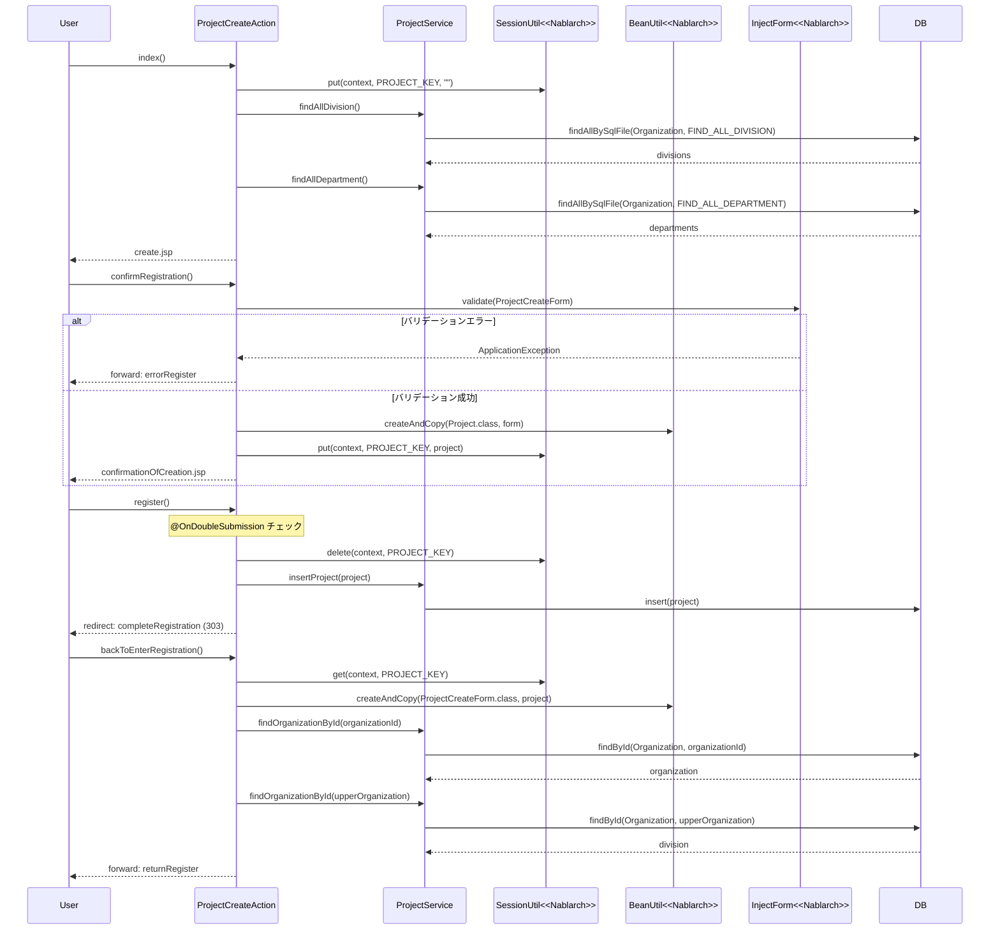

# Code Analysis: ProjectCreateAction

**Generated**: 2026-03-13 16:57:35
**Target**: プロジェクト登録処理（入力・確認・登録・完了・戻る）
**Modules**: proman-web, proman-common
**Analysis Duration**: approx. 3m 16s

---

## Overview

`ProjectCreateAction` はプロジェクト登録機能の業務アクションクラス。入力画面の初期表示から登録完了まで、4ステップの画面遷移（入力→確認→登録→完了）と「戻る」操作を管理する。

主要な責務：
- 入力画面の初期表示（事業部・部門プルダウンのDB取得）
- フォームバリデーション後の確認画面表示（`@InjectForm` + `@OnError`）
- 二重送信防止付き登録処理（`@OnDoubleSubmission`）
- 確認画面から入力画面への「戻る」処理
- セッションストアを使った画面間データ引き渡し（`SessionUtil`）

---

## Architecture

### Dependency Graph

```mermaid
classDiagram
    class ProjectCreateAction
    class ProjectCreateForm {
        <<Form>>
    }
    class ProjectService
    class Project {
        <<Entity>>
    }
    class Organization {
        <<Entity>>
    }
    class SessionUtil {
        <<Nablarch>>
    }
    class BeanUtil {
        <<Nablarch>>
    }
    class ExecutionContext {
        <<Nablarch>>
    }
    class DaoContext {
        <<Nablarch>>
    }
    class DateUtil {
        <<Nablarch>>
    }

    ProjectCreateAction ..> ProjectCreateForm : validates
    ProjectCreateAction ..> ProjectService : delegates to
    ProjectCreateAction ..> SessionUtil : stores/retrieves
    ProjectCreateAction ..> BeanUtil : converts
    ProjectCreateAction ..> ExecutionContext : uses
    ProjectCreateAction ..> DateUtil : formats
    ProjectCreateForm ..|> Serializable
    ProjectService ..> DaoContext : queries
    ProjectService ..> Project : persists
    ProjectService ..> Organization : queries
```



**Note**: This diagram uses Mermaid `classDiagram` syntax to show class names and their relationships. Use `--|>` for inheritance (extends/implements) and `..>` for dependencies (uses/creates).

### Component Summary

| Component | Role | Type | Dependencies |
|-----------|------|------|--------------|
| ProjectCreateAction | プロジェクト登録の業務アクション | Action | ProjectCreateForm, ProjectService, SessionUtil, BeanUtil, ExecutionContext, DateUtil |
| ProjectCreateForm | 登録入力フォーム（バリデーション定義） | Form | DateRelationUtil |
| ProjectService | DB操作サービス（プロジェクト・組織） | Service | DaoContext, Project, Organization |
| Project | プロジェクトエンティティ | Entity | なし |
| Organization | 組織（事業部・部門）エンティティ | Entity | なし |

---

## Flow

### Processing Flow

プロジェクト登録は以下の5段階で進行する：

1. **初期表示** (`index`): 事業部・部門をDBから取得してリクエストスコープに設定、セッション初期化後、登録入力画面を返す。
2. **確認画面表示** (`confirmRegistration`): `@InjectForm` でフォームバリデーション実行。成功時はフォームをエンティティに変換してセッションストアに保存し、確認画面へ遷移。バリデーションエラー時は `errorRegister` へフォワード。
3. **登録処理** (`register`): `@OnDoubleSubmission` で二重送信防止。セッションからエンティティを取得・削除し、`ProjectService.insertProject()` でDB登録。登録後 303 リダイレクト。
4. **登録完了** (`completeRegistration`): 完了画面を返す。
5. **入力画面へ戻る** (`backToEnterRegistration`): セッションから取得したプロジェクト情報をフォームに変換（日付フォーマット変換含む）。組織階層をDBから取得し事業部IDを設定、リクエストスコープに設定して入力画面へフォワード。

### Sequence Diagram



---

## Components

### ProjectCreateAction

**ファイル**: [ProjectCreateAction.java](../../.lw/nab-official/v5/nablarch-system-development-guide/Sample_Project/Source_Code/proman-project/proman-web/src/main/java/com/nablarch/example/proman/web/project/ProjectCreateAction.java)

**役割**: プロジェクト登録機能の全画面遷移を制御する業務アクション

**主要メソッド**:
- `index()` (L33-39): 入力画面初期表示。事業部・部門をDBから取得しリクエストスコープへ設定
- `confirmRegistration()` (L48-63): `@InjectForm` + `@OnError` でバリデーション。成功時はフォームをエンティティ変換してセッション保存
- `register()` (L72-78): `@OnDoubleSubmission` で二重送信防止、セッション削除後DBへ登録
- `backToEnterRegistration()` (L98-118): セッションからフォーム復元（日付フォーマット変換、組織階層取得含む）
- `setOrganizationAndDivisionToRequestScope()` (L125-136): 事業部・部門リストをDBから取得してリクエストスコープへ設定（private）

**依存コンポーネント**: ProjectCreateForm, ProjectService, SessionUtil, BeanUtil, ExecutionContext, DateUtil

---

### ProjectCreateForm

**ファイル**: [ProjectCreateForm.java](../../.lw/nab-official/v5/nablarch-system-development-guide/Sample_Project/Source_Code/proman-project/proman-web/src/main/java/com/nablarch/example/proman/web/project/ProjectCreateForm.java)

**役割**: プロジェクト登録の入力フォーム。Bean Validationアノテーションによるバリデーション定義

**主要フィールドとバリデーション**:
- `projectName` (L26-27): `@Required` + `@Domain("projectName")`
- `projectStartDate`, `projectEndDate` (L46-55): `@Required` + `@Domain("date")`
- `divisionId`, `organizationId` (L61-69): `@Required` + `@Domain("organizationId")`
- `isValidProjectPeriod()` (L329-331): `@AssertTrue` で開始日≦終了日のクロスバリデーション

**依存コンポーネント**: DateRelationUtil（期間バリデーション）

---

### ProjectService

**ファイル**: [ProjectService.java](../../.lw/nab-official/v5/nablarch-system-development-guide/Sample_Project/Source_Code/proman-project/proman-web/src/main/java/com/nablarch/example/proman/web/project/ProjectService.java)

**役割**: プロジェクト・組織のDB操作を集約したサービスクラス

**主要メソッド**:
- `findAllDivision()` (L50-52): 全事業部をSQL IDで検索
- `findAllDepartment()` (L59-61): 全部門をSQL IDで検索
- `findOrganizationById()` (L70-73): 組織IDで1件検索
- `insertProject()` (L80-82): プロジェクトをDB登録

**依存コンポーネント**: DaoContext（UniversalDAO）, DaoFactory

---

## Nablarch Framework Usage

### InjectForm

**クラス**: `nablarch.common.web.interceptor.InjectForm`

**説明**: 業務アクションメソッドに付与するインターセプタ。リクエストパラメータを指定したフォームクラスにバインドし、Bean Validationを実行する。バリデーション済みフォームはリクエストスコープに設定される。

**使用方法**:
```java
@InjectForm(form = ProjectCreateForm.class, prefix = "form")
@OnError(type = ApplicationException.class, path = "forward:///app/project/errorRegister")
public HttpResponse confirmRegistration(HttpRequest request, ExecutionContext context) {
    ProjectCreateForm form = context.getRequestScopedVar("form");
    // ...
}
```

**重要ポイント**:
- ✅ **`@OnError` と組み合わせて使う**: バリデーションエラー時の遷移先は `@OnError` の `path` 属性で指定する
- ✅ **フォームは `Serializable` を実装する**: セッションストアに格納する場合は必須
- ⚠️ **リクエストスコープから取得**: バリデーション済みフォームは `context.getRequestScopedVar("form")` で取得する
- 💡 **ドメインバリデーション**: `@Domain` アノテーションで各フィールドにバリデーションルールを適用できる

**このコードでの使い方**:
- `confirmRegistration()` (L48-49) で `ProjectCreateForm` に `form` プレフィックスでバインド
- バリデーションエラー時は `errorRegister` へフォワード

**詳細**: [Web Application Client Create2](../../.claude/skills/nabledge-5/docs/processing-pattern/web-application/web-application-client_create2.md)

---

### SessionUtil

**クラス**: `nablarch.common.web.session.SessionUtil`

**説明**: セッションストアへのデータの保存・取得・削除を行うユーティリティクラス。画面間でのデータ引き渡しに使用する。

**使用方法**:
```java
// 保存
SessionUtil.put(context, "projectCreateActionProject", project);
// 取得
Project project = SessionUtil.get(context, "projectCreateActionProject");
// 削除（取得と同時に削除）
Project project = SessionUtil.delete(context, "projectCreateActionProject");
```

**重要ポイント**:
- ✅ **フォームではなくエンティティを格納する**: `BeanUtil.createAndCopy` でフォームをエンティティに変換してからセッションに保存する
- ✅ **初期表示でセッションを初期化する**: ブラウザを直接閉じた場合等にセッションが残るため、初期表示で `SessionUtil.put(context, KEY, "")` または `delete` を実行する
- ✅ **登録処理でセッションを削除する**: `register()` では `SessionUtil.delete()` でセッションからデータを取得しつつ削除する
- ⚠️ **セッションストアの設定が必要**: セッションストアの種類（DB/Hiddenなど）はコンポーネント設定で行う

**このコードでの使い方**:
- `index()` (L59, L132): `SessionUtil.put(context, PROJECT_KEY, "")` で初期化
- `confirmRegistration()` (L59): `SessionUtil.put` でプロジェクトエンティティをセッションへ保存
- `register()` (L74): `SessionUtil.delete` でセッションからエンティティを取得・削除
- `backToEnterRegistration()` (L100): `SessionUtil.get` でセッションからエンティティを取得

**詳細**: [Libraries Create Example](../../.claude/skills/nabledge-5/docs/component/libraries/libraries-create_example.md)

---

### OnDoubleSubmission

**クラス**: `nablarch.common.web.token.OnDoubleSubmission`

**説明**: 業務アクションメソッドに付与するインターセプタ。トークンを使って二重送信を防止する。

**使用方法**:
```java
@OnDoubleSubmission
public HttpResponse register(HttpRequest request, ExecutionContext context) {
    // ...
}
```

**重要ポイント**:
- ✅ **確定ボタン（登録・更新・削除）に付与する**: データ変更を伴う処理に必ず付与する
- ⚠️ **JSP側でも二重サブミット制御が必要**: `<n:button allowDoubleSubmission="false">` でクライアントサイドも制御する
- 💡 **サーバサイドとクライアントサイドの両方で制御**: JSが無効でもサーバサイドで防止できる

**このコードでの使い方**:
- `register()` (L72) に付与。二重クリックによる多重登録を防止

**詳細**: [Web Application Client Create4](../../.claude/skills/nabledge-5/docs/processing-pattern/web-application/web-application-client_create4.md)

---

### BeanUtil

**クラス**: `nablarch.core.beans.BeanUtil`

**説明**: JavaBeans間でのプロパティコピーを行うユーティリティ。フォーム→エンティティ、エンティティ→フォームの変換に使用する。

**使用方法**:
```java
// フォームからエンティティへ
Project project = BeanUtil.createAndCopy(Project.class, form);
// エンティティからフォームへ
ProjectCreateForm form = BeanUtil.createAndCopy(ProjectCreateForm.class, project);
```

**重要ポイント**:
- ✅ **フォームをセッションに格納しない**: セッションには `BeanUtil` でエンティティに変換したオブジェクトを格納する
- ⚠️ **プロパティ名が一致する必要がある**: 変換元と変換先でプロパティ名が一致しないとコピーされない
- 💡 **日付フォーマット変換は手動で行う**: `backToEnterRegistration()` で `DateUtil.formatDate()` を使った変換が必要

**このコードでの使い方**:
- `confirmRegistration()` (L52): `BeanUtil.createAndCopy(Project.class, form)` でフォームをエンティティへ変換
- `backToEnterRegistration()` (L101): `BeanUtil.createAndCopy(ProjectCreateForm.class, project)` でエンティティをフォームへ変換

**詳細**: [Web Application Client Create2](../../.claude/skills/nabledge-5/docs/processing-pattern/web-application/web-application-client_create2.md)

---

### UniversalDao (DaoContext)

**クラス**: `nablarch.common.dao.DaoContext`

**説明**: JPAアノテーションを使った簡易O/Rマッパー。`ProjectService` 内では `DaoContext` インタフェース経由で使用する。CRUD操作とSQLファイルを使った検索をサポートする。

**使用方法**:
```java
// SQL IDを指定して全件検索
universalDao.findAllBySqlFile(Organization.class, "FIND_ALL_DIVISION");
// 主キーで1件検索
universalDao.findById(Organization.class, new Object[]{organizationId});
// 登録
universalDao.insert(project);
```

**重要ポイント**:
- ✅ **SQLファイルはエンティティクラスから導出される**: `Organization.class` なら `com/nablarch/example/proman/entity/Organization.sql` が使用される
- ⚠️ **主キー以外の条件での更新・削除は不可**: その場合は `Database` 機能を使うこと
- 💡 **共通項目の自動設定は提供しない**: 登録ユーザや更新ユーザは別途アプリケーションで設定する必要がある

**このコードでの使い方**:
- `ProjectService.findAllDivision()` (L51): `findAllBySqlFile` で全事業部を取得
- `ProjectService.findAllDepartment()` (L60): `findAllBySqlFile` で全部門を取得
- `ProjectService.findOrganizationById()` (L72): `findById` で組織を1件取得
- `ProjectService.insertProject()` (L81): `insert` でプロジェクトをDB登録

**詳細**: [Libraries Universal Dao](../../.claude/skills/nabledge-5/docs/component/libraries/libraries-universal_dao.md)

---

## References

### Source Files

- [ProjectCreateAction.java (.lw/nab-official/v5/nablarch-system-development-guide/en/Sample_Project/Source_Code/proman-project/proman-web/src/main/java/com/nablarch/example/proman/web/project)](../../.lw/nab-official/v5/nablarch-system-development-guide/en/Sample_Project/Source_Code/proman-project/proman-web/src/main/java/com/nablarch/example/proman/web/project/ProjectCreateAction.java) - ProjectCreateAction
- [ProjectCreateAction.java (.lw/nab-official/v5/nablarch-system-development-guide/Sample_Project/Source_Code/proman-project/proman-web/src/main/java/com/nablarch/example/proman/web/project)](../../.lw/nab-official/v5/nablarch-system-development-guide/Sample_Project/Source_Code/proman-project/proman-web/src/main/java/com/nablarch/example/proman/web/project/ProjectCreateAction.java) - ProjectCreateAction
- [ProjectCreateAction.java (.lw/nab-official/v6/nablarch-system-development-guide/en/Sample_Project/Source_Code/proman-project/proman-web/src/main/java/com/nablarch/example/proman/web/project)](../../.lw/nab-official/v6/nablarch-system-development-guide/en/Sample_Project/Source_Code/proman-project/proman-web/src/main/java/com/nablarch/example/proman/web/project/ProjectCreateAction.java) - ProjectCreateAction
- [ProjectCreateAction.java (.lw/nab-official/v6/nablarch-system-development-guide/Sample_Project/Source_Code/proman-project/proman-web/src/main/java/com/nablarch/example/proman/web/project)](../../.lw/nab-official/v6/nablarch-system-development-guide/Sample_Project/Source_Code/proman-project/proman-web/src/main/java/com/nablarch/example/proman/web/project/ProjectCreateAction.java) - ProjectCreateAction
- [ProjectCreateForm.java (.lw/nab-official/v5/nablarch-system-development-guide/en/Sample_Project/Source_Code/proman-project/proman-web/src/main/java/com/nablarch/example/proman/web/project)](../../.lw/nab-official/v5/nablarch-system-development-guide/en/Sample_Project/Source_Code/proman-project/proman-web/src/main/java/com/nablarch/example/proman/web/project/ProjectCreateForm.java) - ProjectCreateForm
- [ProjectCreateForm.java (.lw/nab-official/v5/nablarch-system-development-guide/Sample_Project/Source_Code/proman-project/proman-web/src/main/java/com/nablarch/example/proman/web/project)](../../.lw/nab-official/v5/nablarch-system-development-guide/Sample_Project/Source_Code/proman-project/proman-web/src/main/java/com/nablarch/example/proman/web/project/ProjectCreateForm.java) - ProjectCreateForm
- [ProjectCreateForm.java (.lw/nab-official/v6/nablarch-system-development-guide/en/Sample_Project/Source_Code/proman-project/proman-web/src/main/java/com/nablarch/example/proman/web/project)](../../.lw/nab-official/v6/nablarch-system-development-guide/en/Sample_Project/Source_Code/proman-project/proman-web/src/main/java/com/nablarch/example/proman/web/project/ProjectCreateForm.java) - ProjectCreateForm
- [ProjectCreateForm.java (.lw/nab-official/v6/nablarch-system-development-guide/Sample_Project/Source_Code/proman-project/proman-web/src/main/java/com/nablarch/example/proman/web/project)](../../.lw/nab-official/v6/nablarch-system-development-guide/Sample_Project/Source_Code/proman-project/proman-web/src/main/java/com/nablarch/example/proman/web/project/ProjectCreateForm.java) - ProjectCreateForm
- [ProjectService.java (.lw/nab-official/v5/nablarch-system-development-guide/en/Sample_Project/Source_Code/proman-project/proman-web/src/main/java/com/nablarch/example/proman/web/project)](../../.lw/nab-official/v5/nablarch-system-development-guide/en/Sample_Project/Source_Code/proman-project/proman-web/src/main/java/com/nablarch/example/proman/web/project/ProjectService.java) - ProjectService
- [ProjectService.java (.lw/nab-official/v5/nablarch-system-development-guide/Sample_Project/Source_Code/proman-project/proman-web/src/main/java/com/nablarch/example/proman/web/project)](../../.lw/nab-official/v5/nablarch-system-development-guide/Sample_Project/Source_Code/proman-project/proman-web/src/main/java/com/nablarch/example/proman/web/project/ProjectService.java) - ProjectService
- [ProjectService.java (.lw/nab-official/v6/nablarch-system-development-guide/en/Sample_Project/Source_Code/proman-project/proman-web/src/main/java/com/nablarch/example/proman/web/project)](../../.lw/nab-official/v6/nablarch-system-development-guide/en/Sample_Project/Source_Code/proman-project/proman-web/src/main/java/com/nablarch/example/proman/web/project/ProjectService.java) - ProjectService
- [ProjectService.java (.lw/nab-official/v6/nablarch-system-development-guide/Sample_Project/Source_Code/proman-project/proman-web/src/main/java/com/nablarch/example/proman/web/project)](../../.lw/nab-official/v6/nablarch-system-development-guide/Sample_Project/Source_Code/proman-project/proman-web/src/main/java/com/nablarch/example/proman/web/project/ProjectService.java) - ProjectService

### Knowledge Base (Nabledge-5)

- [Libraries Create_example](../../.claude/skills/nabledge-5/docs/component/libraries/libraries-create_example.md)
- [Libraries Update_example](../../.claude/skills/nabledge-5/docs/component/libraries/libraries-update_example.md)
- [Web Application Client_create2](../../.claude/skills/nabledge-5/docs/processing-pattern/web-application/web-application-client_create2.md)
- [Web Application Client_create3](../../.claude/skills/nabledge-5/docs/processing-pattern/web-application/web-application-client_create3.md)
- [Web Application Client_create4](../../.claude/skills/nabledge-5/docs/processing-pattern/web-application/web-application-client_create4.md)
- [Libraries Universal_dao](../../.claude/skills/nabledge-5/docs/component/libraries/libraries-universal_dao.md)

### Official Documentation


- [BasicDaoContextFactory](https://nablarch.github.io/docs/LATEST/javadoc/nablarch/common/dao/BasicDaoContextFactory.html)
- [BeanUtil](https://nablarch.github.io/docs/LATEST/javadoc/nablarch/core/beans/BeanUtil.html)
- [Client Create2](https://nablarch.github.io/docs/LATEST/doc/application_framework/application_framework/web/getting_started/client_create/client_create2.html)
- [Client Create3](https://nablarch.github.io/docs/LATEST/doc/application_framework/application_framework/web/getting_started/client_create/client_create3.html)
- [Client Create4](https://nablarch.github.io/docs/LATEST/doc/application_framework/application_framework/web/getting_started/client_create/client_create4.html)
- [ConnectionFactory](https://nablarch.github.io/docs/LATEST/javadoc/nablarch/core/db/connection/ConnectionFactory.html)
- [Create Example](https://nablarch.github.io/docs/LATEST/doc/application_framework/application_framework/libraries/session_store/create_example.html)
- [DatabaseMetaDataExtractor](https://nablarch.github.io/docs/LATEST/javadoc/nablarch/common/dao/DatabaseMetaDataExtractor.html)
- [DeferredEntityList](https://nablarch.github.io/docs/LATEST/javadoc/nablarch/common/dao/DeferredEntityList.html)
- [Dialect](https://nablarch.github.io/docs/LATEST/javadoc/nablarch/core/db/dialect/Dialect.html)
- [EntityList](https://nablarch.github.io/docs/LATEST/javadoc/nablarch/common/dao/EntityList.html)
- [GenerationType](https://nablarch.github.io/docs/LATEST/javadoc/javax/persistence/GenerationType.html)
- [H2Dialect](https://nablarch.github.io/docs/LATEST/javadoc/nablarch/core/db/dialect/H2Dialect.html)
- [InjectForm](https://nablarch.github.io/docs/LATEST/javadoc/nablarch/common/web/interceptor/InjectForm.html)
- [OnDoubleSubmission](https://nablarch.github.io/docs/LATEST/javadoc/nablarch/common/web/token/OnDoubleSubmission.html)
- [OnError](https://nablarch.github.io/docs/LATEST/javadoc/nablarch/fw/web/interceptor/OnError.html)
- [OptimisticLockException](https://nablarch.github.io/docs/LATEST/javadoc/javax/persistence/OptimisticLockException.html)
- [Pagination](https://nablarch.github.io/docs/LATEST/javadoc/nablarch/common/dao/Pagination.html)
- [Required](https://nablarch.github.io/docs/LATEST/javadoc/nablarch/core/validation/ee/Required.html)
- [SessionUtil](https://nablarch.github.io/docs/LATEST/javadoc/nablarch/common/web/session/SessionUtil.html)
- [SimpleDbTransactionManager](https://nablarch.github.io/docs/LATEST/javadoc/nablarch/core/db/transaction/SimpleDbTransactionManager.html)
- [TransactionFactory](https://nablarch.github.io/docs/LATEST/javadoc/nablarch/core/transaction/TransactionFactory.html)
- [Universal Dao](https://nablarch.github.io/docs/LATEST/doc/application_framework/application_framework/libraries/database/universal_dao.html)
- [UniversalDao.Transaction](https://nablarch.github.io/docs/LATEST/javadoc/nablarch/common/dao/UniversalDao.Transaction.html)
- [UniversalDao](https://nablarch.github.io/docs/LATEST/javadoc/nablarch/common/dao/UniversalDao.html)
- [Update Example](https://nablarch.github.io/docs/LATEST/doc/application_framework/application_framework/libraries/session_store/update_example.html)

---

**Note**: This documentation was generated by the code-analysis workflow of the nabledge-5 skill.
