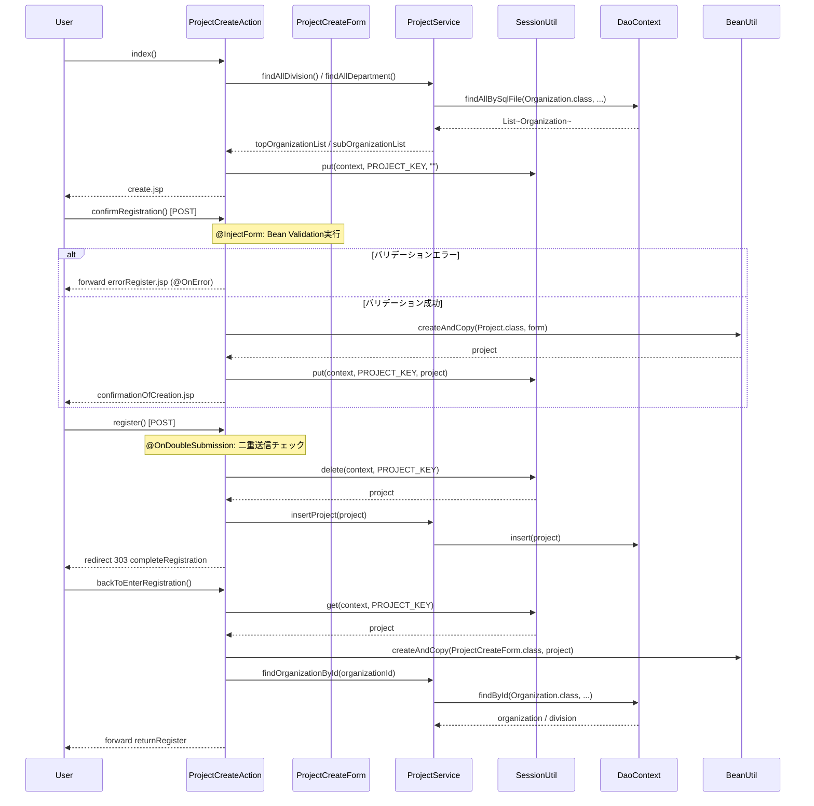

# Code Analysis: ProjectCreateAction

**Generated**: 2026-03-13 17:02:01
**Target**: プロジェクト登録処理アクション
**Modules**: proman-web
**Analysis Duration**: approx. 3m 22s

---

## Overview

`ProjectCreateAction` はプロジェクト登録機能のWebアクションクラス。入力画面表示 → バリデーション＆確認画面表示 → DB登録 → 完了画面表示という4ステップの登録フローを実装する。

主要な処理フローは次の5メソッドで構成される：`index()`（初期表示）、`confirmRegistration()`（バリデーション＋確認画面表示）、`register()`（DB登録）、`completeRegistration()`（完了画面表示）、`backToEnterRegistration()`（確認画面から入力画面への戻り）。

Nablarchのインターセプタ（`@InjectForm`、`@OnError`、`@OnDoubleSubmission`）とセッションストア（`SessionUtil`）を活用したPRGパターン（Post-Redirect-Get）による多重登録防止を実装している。

---

## Architecture

### Dependency Graph

```mermaid
classDiagram
    class ProjectCreateAction
    class ProjectCreateForm {
        <<Form>>
    }
    class ProjectService
    class Project {
        <<Entity>>
    }
    class Organization {
        <<Entity>>
    }
    class SessionUtil {
        <<Nablarch>>
    }
    class BeanUtil {
        <<Nablarch>>
    }
    class ExecutionContext {
        <<Nablarch>>
    }
    class DaoContext {
        <<Nablarch>>
    }

    ProjectCreateAction ..> ProjectCreateForm : validates
    ProjectCreateAction ..> ProjectService : delegates to
    ProjectCreateAction ..> SessionUtil : persists
    ProjectCreateAction ..> BeanUtil : converts
    ProjectCreateAction ..> ExecutionContext : uses
    ProjectCreateForm ..|> Serializable : implements
    ProjectService ..> DaoContext : queries
    ProjectService ..> Project : persists
    ProjectService ..> Organization : queries
```



**Note**: This diagram uses Mermaid `classDiagram` syntax to show class names and their relationships. Use `--|>` for inheritance (extends/implements) and `..>` for dependencies (uses/creates).

### Component Summary

| Component | Role | Type | Dependencies |
|-----------|------|------|--------------|
| ProjectCreateAction | プロジェクト登録フロー制御 | Action | ProjectCreateForm, ProjectService, SessionUtil, BeanUtil, ExecutionContext |
| ProjectCreateForm | 登録入力値バリデーション | Form | DateRelationUtil |
| ProjectService | DB操作サービス | Service | DaoContext, Project, Organization |
| Project | プロジェクトエンティティ | Entity | なし |
| Organization | 組織エンティティ | Entity | なし |

---

## Flow

### Processing Flow

プロジェクト登録は5段階のフローで実装される。

1. **初期表示** (`index`): 事業部・部門一覧をDBから取得してリクエストスコープに設定し、入力画面を表示する。
2. **確認画面表示** (`confirmRegistration`): `@InjectForm` でBean Validationを実行。バリデーション成功時にフォームをエンティティに変換してセッションに保存し、確認画面を表示。エラー時は `@OnError` でエラー画面へフォワード。
3. **登録実行** (`register`): `@OnDoubleSubmission` で二重送信をチェック後、セッションからProjectを取り出してDBにINSERTし、完了画面へリダイレクト（PRGパターン）。
4. **完了画面表示** (`completeRegistration`): 完了JSPを返すのみ。
5. **入力画面へ戻る** (`backToEnterRegistration`): セッションからProjectを取得してフォームに変換し、組織情報を再取得してリクエストスコープに設定、入力画面へフォワード。

### Sequence Diagram



---

## Components

### ProjectCreateAction

**ファイル**: [ProjectCreateAction.java](../../.lw/nab-official/v5/nablarch-system-development-guide/Sample_Project/Source_Code/proman-project/proman-web/src/main/java/com/nablarch/example/proman/web/project/ProjectCreateAction.java)

**役割**: プロジェクト登録フロー全体を制御するアクションクラス。

**主要メソッド**:

- `index(HttpRequest, ExecutionContext)` [:33-39](../../.lw/nab-official/v5/nablarch-system-development-guide/Sample_Project/Source_Code/proman-project/proman-web/src/main/java/com/nablarch/example/proman/web/project/ProjectCreateAction.java#L33-L39) - 初期表示。事業部・部門をDBから取得しリクエストスコープに設定。
- `confirmRegistration(HttpRequest, ExecutionContext)` [:50-63](../../.lw/nab-official/v5/nablarch-system-development-guide/Sample_Project/Source_Code/proman-project/proman-web/src/main/java/com/nablarch/example/proman/web/project/ProjectCreateAction.java#L50-L63) - `@InjectForm`でバリデーション後、ProjectエンティティをセッションにputしてJSP表示。
- `register(HttpRequest, ExecutionContext)` [:73-78](../../.lw/nab-official/v5/nablarch-system-development-guide/Sample_Project/Source_Code/proman-project/proman-web/src/main/java/com/nablarch/example/proman/web/project/ProjectCreateAction.java#L73-L78) - セッションからProjectをdeleteしてDB insert後、リダイレクト（PRGパターン）。
- `backToEnterRegistration(HttpRequest, ExecutionContext)` [:98-118](../../.lw/nab-official/v5/nablarch-system-development-guide/Sample_Project/Source_Code/proman-project/proman-web/src/main/java/com/nablarch/example/proman/web/project/ProjectCreateAction.java#L98-L118) - セッションのProjectをフォームに変換し、組織情報を再取得して入力画面に戻る。
- `setOrganizationAndDivisionToRequestScope(ExecutionContext)` [:125-136](../../.lw/nab-official/v5/nablarch-system-development-guide/Sample_Project/Source_Code/proman-project/proman-web/src/main/java/com/nablarch/example/proman/web/project/ProjectCreateAction.java#L125-L136) - 事業部・部門リストをDBから取得してリクエストスコープに設定するprivateメソッド。

**依存関係**: ProjectCreateForm, ProjectService, Project, Organization, SessionUtil, BeanUtil, ExecutionContext, DateUtil, ApplicationException

### ProjectCreateForm

**ファイル**: [ProjectCreateForm.java](../../.lw/nab-official/v5/nablarch-system-development-guide/Sample_Project/Source_Code/proman-project/proman-web/src/main/java/com/nablarch/example/proman/web/project/ProjectCreateForm.java)

**役割**: プロジェクト登録入力のバリデーションフォーム。

**主要メソッド**:

- `isValidProjectPeriod()` [:329-331](../../.lw/nab-official/v5/nablarch-system-development-guide/Sample_Project/Source_Code/proman-project/proman-web/src/main/java/com/nablarch/example/proman/web/project/ProjectCreateForm.java#L329-L331) - `@AssertTrue`によるプロジェクト期間の相関バリデーション（開始日 ≦ 終了日）。

**バリデーション定義**: `@Required`と`@Domain`アノテーションを全プロパティに付与。`Serializable`実装（`@InjectForm`でのセッションストア対応のため）。

**依存関係**: DateRelationUtil (共通ユーティリティ)

### ProjectService

**ファイル**: [ProjectService.java](../../.lw/nab-official/v5/nablarch-system-development-guide/Sample_Project/Source_Code/proman-project/proman-web/src/main/java/com/nablarch/example/proman/web/project/ProjectService.java)

**役割**: プロジェクトおよび組織のDB操作をまとめたサービスクラス。

**主要メソッド**:

- `findAllDivision()` [:50-52](../../.lw/nab-official/v5/nablarch-system-development-guide/Sample_Project/Source_Code/proman-project/proman-web/src/main/java/com/nablarch/example/proman/web/project/ProjectService.java#L50-L52) - SQLファイルで全事業部を取得。
- `findAllDepartment()` [:59-61](../../.lw/nab-official/v5/nablarch-system-development-guide/Sample_Project/Source_Code/proman-project/proman-web/src/main/java/com/nablarch/example/proman/web/project/ProjectService.java#L59-L61) - SQLファイルで全部門を取得。
- `findOrganizationById(Integer)` [:70-73](../../.lw/nab-official/v5/nablarch-system-development-guide/Sample_Project/Source_Code/proman-project/proman-web/src/main/java/com/nablarch/example/proman/web/project/ProjectService.java#L70-L73) - 組織IDで組織を1件取得。
- `insertProject(Project)` [:80-82](../../.lw/nab-official/v5/nablarch-system-development-guide/Sample_Project/Source_Code/proman-project/proman-web/src/main/java/com/nablarch/example/proman/web/project/ProjectService.java#L80-L82) - プロジェクトをDBにINSERT。

**依存関係**: DaoContext (UniversalDao), Project, Organization

---

## Nablarch Framework Usage

### @InjectForm + @OnError

**クラス**: `nablarch.common.web.interceptor.InjectForm` / `nablarch.fw.web.interceptor.OnError`

**説明**: `@InjectForm`はHTTPリクエストパラメータをフォームクラスにバインドしBean Validationを実行するインターセプタ。`@OnError`はバリデーション例外が発生した際の遷移先を指定する。

**使用方法**:
```java
@InjectForm(form = ProjectCreateForm.class, prefix = "form")
@OnError(type = ApplicationException.class, path = "forward:///app/project/errorRegister")
public HttpResponse confirmRegistration(HttpRequest request, ExecutionContext context) {
    ProjectCreateForm form = context.getRequestScopedVar("form");
    // バリデーション済みフォームを取得
}
```

**重要ポイント**:
- ✅ **フォームは`Serializable`必須**: `@InjectForm`でバリデーションを実行するためフォームは`Serializable`を実装する
- ✅ **プロパティはString型**: 入力値を受け付けるプロパティは全てString型で宣言する
- ⚠️ **`nablarch.core.validation.ee`を使用**: `nablarch.core.validation.validator`配下に同名アノテーションが存在するため注意
- 💡 **バリデーション済み取得**: バリデーション成功時、`context.getRequestScopedVar("form")`でバリデーション済みオブジェクトを取得できる
- 🎯 **ドメインバリデーション**: `@Domain`でプロパティにバリデーションルールを定義する

**このコードでの使い方**:
- `confirmRegistration()`に`@InjectForm(form = ProjectCreateForm.class, prefix = "form")`を付与（L48）
- `@OnError(type = ApplicationException.class, path = "forward:///app/project/errorRegister")`でエラー時のフォワード先を設定（L49）

**詳細**: [Web Application Client_create2](../../.claude/skills/nabledge-5/docs/processing-pattern/web-application/web-application-client_create2.md)

---

### @OnDoubleSubmission

**クラス**: `nablarch.common.web.token.OnDoubleSubmission`

**説明**: 業務アクションメソッドの二重実行（二重送信）を防止するインターセプタ。

**使用方法**:
```java
@OnDoubleSubmission
public HttpResponse register(HttpRequest request, ExecutionContext context) {
    // 二重実行されない
}
```

**重要ポイント**:
- ✅ **サーバサイドとクライアントサイドの両方で制御**: JSP側も`allowDoubleSubmission="false"`で対応
- ⚠️ **JSのみでは不十分**: ブラウザのJavaScriptが無効な場合を考慮してサーバサイドでも制御が必要
- 💡 **デフォルト遷移先**: エラー時の遷移先はコンポーネント設定で一括定義可能

**このコードでの使い方**:
- `register()`メソッドに付与（L72）。登録ボタン押下後の二重クリックによる多重登録を防止する。

**詳細**: [Web Application Client_create4](../../.claude/skills/nabledge-5/docs/processing-pattern/web-application/web-application-client_create4.md)

---

### SessionUtil

**クラス**: `nablarch.common.web.session.SessionUtil`

**説明**: セッションストアへのオブジェクトの保存・取得・削除を行うユーティリティクラス。入力確認フロー（確認画面へのデータ持ち回り）で使用する。

**使用方法**:
```java
// セッションに保存
SessionUtil.put(context, "projectCreateActionProject", project);

// セッションから取得
Project project = SessionUtil.get(context, "projectCreateActionProject");

// セッションから取得して削除
Project project = SessionUtil.delete(context, "projectCreateActionProject");
```

**重要ポイント**:
- ✅ **フォームはセッションに格納しない**: `BeanUtil`でフォームをエンティティに変換してからセッションに登録する
- ✅ **PRGパターン**: 登録後はセッションからdeleteしてリダイレクト。ブラウザの更新による多重登録を防ぐ
- ⚠️ **配列・コレクション型は直接保存不可**: シリアライズ可能なBeanのプロパティとして定義してからそのBeanをセッションに登録する
- 💡 **リクエストスコープと同様にJSPから参照可能**: セッションに登録したオブジェクトはJSPから参照できる

**このコードでの使い方**:
- `confirmRegistration()`でProject entityを`put`（L59）
- `register()`でProject entityを`delete`してDB登録（L74）
- `backToEnterRegistration()`で`get`してフォームに変換（L100）
- `setOrganizationAndDivisionToRequestScope()`で初期化用に空文字を`put`（L132）

**詳細**: [Web Application Client_create2](../../.claude/skills/nabledge-5/docs/processing-pattern/web-application/web-application-client_create2.md)

---

### BeanUtil

**クラス**: `nablarch.core.beans.BeanUtil`

**説明**: JavaBeans間のプロパティコピーを行うユーティリティクラス。フォームからエンティティへの変換、エンティティからフォームへの逆変換に使用する。

**使用方法**:
```java
// フォーム → エンティティ（新規生成）
Project project = BeanUtil.createAndCopy(Project.class, form);

// エンティティ → フォーム（新規生成）
ProjectCreateForm form = BeanUtil.createAndCopy(ProjectCreateForm.class, project);
```

**重要ポイント**:
- ✅ **同名プロパティを自動コピー**: 同名のプロパティを自動的にコピーする
- ⚠️ **型変換**: String型とその他の型の変換は自動で行われるが、複雑な型変換は個別対応が必要
- 💡 **確認画面の戻るに有用**: エンティティをフォームに逆変換することで「戻る」ボタン実装がシンプルになる

**このコードでの使い方**:
- `confirmRegistration()`でフォーム→Projectエンティティに変換（L52）
- `backToEnterRegistration()`でProjectエンティティ→フォームに逆変換（L101）、日付フォーマット変換後にリクエストスコープに設定（L103-106）

**詳細**: [Web Application Client_create3](../../.claude/skills/nabledge-5/docs/processing-pattern/web-application/web-application-client_create3.md)

---

### DaoContext (UniversalDao)

**クラス**: `nablarch.common.dao.DaoContext`

**説明**: データベースのCRUD操作を提供するインターフェース。ProjectServiceは`DaoFactory.create()`で取得したDaoContextを使用してDB操作を行う。

**使用方法**:
```java
// 全件取得（SQLファイル使用）
List<Organization> list = universalDao.findAllBySqlFile(Organization.class, "FIND_ALL_DIVISION");

// 主キー検索
Organization org = universalDao.findById(Organization.class, new Object[]{organizationId});

// 登録
universalDao.insert(project);
```

**重要ポイント**:
- ✅ **SQLファイル名はアノテーションまたは命名規則で指定**: `findAllBySqlFile`の第2引数はSQL ID
- 💡 **エンティティ中心**: エンティティクラスをそのままDAOメソッドに渡せる
- 🎯 **トランザクション管理**: ハンドラチェーンのトランザクション制御ハンドラで自動コミット/ロールバック

**このコードでの使い方**:
- `ProjectService.findAllDivision()`でOrganization全件取得（L51）
- `ProjectService.findAllDepartment()`でOrganization（部門）全件取得（L60）
- `ProjectService.findOrganizationById()`で組織1件取得（L72）
- `ProjectService.insertProject()`でProjectをINSERT（L81）

**詳細**: [Web Application Getting Started Project Update](../../.claude/skills/nabledge-5/docs/processing-pattern/web-application/web-application-getting-started-project-update.md)

---

## References

### Source Files

- [ProjectCreateAction.java (.lw/nab-official/v5/nablarch-system-development-guide/en/Sample_Project/Source_Code/proman-project/proman-web/src/main/java/com/nablarch/example/proman/web/project)](../../.lw/nab-official/v5/nablarch-system-development-guide/en/Sample_Project/Source_Code/proman-project/proman-web/src/main/java/com/nablarch/example/proman/web/project/ProjectCreateAction.java) - ProjectCreateAction
- [ProjectCreateAction.java (.lw/nab-official/v5/nablarch-system-development-guide/Sample_Project/Source_Code/proman-project/proman-web/src/main/java/com/nablarch/example/proman/web/project)](../../.lw/nab-official/v5/nablarch-system-development-guide/Sample_Project/Source_Code/proman-project/proman-web/src/main/java/com/nablarch/example/proman/web/project/ProjectCreateAction.java) - ProjectCreateAction
- [ProjectCreateAction.java (.lw/nab-official/v6/nablarch-system-development-guide/en/Sample_Project/Source_Code/proman-project/proman-web/src/main/java/com/nablarch/example/proman/web/project)](../../.lw/nab-official/v6/nablarch-system-development-guide/en/Sample_Project/Source_Code/proman-project/proman-web/src/main/java/com/nablarch/example/proman/web/project/ProjectCreateAction.java) - ProjectCreateAction
- [ProjectCreateAction.java (.lw/nab-official/v6/nablarch-system-development-guide/Sample_Project/Source_Code/proman-project/proman-web/src/main/java/com/nablarch/example/proman/web/project)](../../.lw/nab-official/v6/nablarch-system-development-guide/Sample_Project/Source_Code/proman-project/proman-web/src/main/java/com/nablarch/example/proman/web/project/ProjectCreateAction.java) - ProjectCreateAction
- [ProjectCreateForm.java (.lw/nab-official/v5/nablarch-system-development-guide/en/Sample_Project/Source_Code/proman-project/proman-web/src/main/java/com/nablarch/example/proman/web/project)](../../.lw/nab-official/v5/nablarch-system-development-guide/en/Sample_Project/Source_Code/proman-project/proman-web/src/main/java/com/nablarch/example/proman/web/project/ProjectCreateForm.java) - ProjectCreateForm
- [ProjectCreateForm.java (.lw/nab-official/v5/nablarch-system-development-guide/Sample_Project/Source_Code/proman-project/proman-web/src/main/java/com/nablarch/example/proman/web/project)](../../.lw/nab-official/v5/nablarch-system-development-guide/Sample_Project/Source_Code/proman-project/proman-web/src/main/java/com/nablarch/example/proman/web/project/ProjectCreateForm.java) - ProjectCreateForm
- [ProjectCreateForm.java (.lw/nab-official/v6/nablarch-system-development-guide/en/Sample_Project/Source_Code/proman-project/proman-web/src/main/java/com/nablarch/example/proman/web/project)](../../.lw/nab-official/v6/nablarch-system-development-guide/en/Sample_Project/Source_Code/proman-project/proman-web/src/main/java/com/nablarch/example/proman/web/project/ProjectCreateForm.java) - ProjectCreateForm
- [ProjectCreateForm.java (.lw/nab-official/v6/nablarch-system-development-guide/Sample_Project/Source_Code/proman-project/proman-web/src/main/java/com/nablarch/example/proman/web/project)](../../.lw/nab-official/v6/nablarch-system-development-guide/Sample_Project/Source_Code/proman-project/proman-web/src/main/java/com/nablarch/example/proman/web/project/ProjectCreateForm.java) - ProjectCreateForm
- [ProjectService.java (.lw/nab-official/v5/nablarch-system-development-guide/en/Sample_Project/Source_Code/proman-project/proman-web/src/main/java/com/nablarch/example/proman/web/project)](../../.lw/nab-official/v5/nablarch-system-development-guide/en/Sample_Project/Source_Code/proman-project/proman-web/src/main/java/com/nablarch/example/proman/web/project/ProjectService.java) - ProjectService
- [ProjectService.java (.lw/nab-official/v5/nablarch-system-development-guide/Sample_Project/Source_Code/proman-project/proman-web/src/main/java/com/nablarch/example/proman/web/project)](../../.lw/nab-official/v5/nablarch-system-development-guide/Sample_Project/Source_Code/proman-project/proman-web/src/main/java/com/nablarch/example/proman/web/project/ProjectService.java) - ProjectService
- [ProjectService.java (.lw/nab-official/v6/nablarch-system-development-guide/en/Sample_Project/Source_Code/proman-project/proman-web/src/main/java/com/nablarch/example/proman/web/project)](../../.lw/nab-official/v6/nablarch-system-development-guide/en/Sample_Project/Source_Code/proman-project/proman-web/src/main/java/com/nablarch/example/proman/web/project/ProjectService.java) - ProjectService
- [ProjectService.java (.lw/nab-official/v6/nablarch-system-development-guide/Sample_Project/Source_Code/proman-project/proman-web/src/main/java/com/nablarch/example/proman/web/project)](../../.lw/nab-official/v6/nablarch-system-development-guide/Sample_Project/Source_Code/proman-project/proman-web/src/main/java/com/nablarch/example/proman/web/project/ProjectService.java) - ProjectService

### Knowledge Base (Nabledge-5)

- [Web Application Client_create2](../../.claude/skills/nabledge-5/docs/processing-pattern/web-application/web-application-client_create2.md)
- [Web Application Client_create3](../../.claude/skills/nabledge-5/docs/processing-pattern/web-application/web-application-client_create3.md)
- [Web Application Client_create4](../../.claude/skills/nabledge-5/docs/processing-pattern/web-application/web-application-client_create4.md)
- [Web Application Getting Started Project Update](../../.claude/skills/nabledge-5/docs/processing-pattern/web-application/web-application-getting-started-project-update.md)
- [Web Application Getting Started Project Bulk Update](../../.claude/skills/nabledge-5/docs/processing-pattern/web-application/web-application-getting-started-project-bulk-update.md)

### Official Documentation


- [BeanUtil](https://nablarch.github.io/docs/LATEST/javadoc/nablarch/core/beans/BeanUtil.html)
- [Client Create2](https://nablarch.github.io/docs/LATEST/doc/application_framework/application_framework/web/getting_started/client_create/client_create2.html)
- [Client Create3](https://nablarch.github.io/docs/LATEST/doc/application_framework/application_framework/web/getting_started/client_create/client_create3.html)
- [Client Create4](https://nablarch.github.io/docs/LATEST/doc/application_framework/application_framework/web/getting_started/client_create/client_create4.html)
- [Domain](https://nablarch.github.io/docs/LATEST/javadoc/nablarch/core/validation/ee/Domain.html)
- [Index](https://nablarch.github.io/docs/LATEST/doc/application_framework/application_framework/web/getting_started/project_bulk_update/index.html)
- [Index](https://nablarch.github.io/docs/LATEST/doc/application_framework/application_framework/web/getting_started/project_update/index.html)
- [InjectForm](https://nablarch.github.io/docs/LATEST/javadoc/nablarch/common/web/interceptor/InjectForm.html)
- [NoDataException](https://nablarch.github.io/docs/LATEST/javadoc/nablarch/common/dao/NoDataException.html)
- [OnDoubleSubmission](https://nablarch.github.io/docs/LATEST/javadoc/nablarch/common/web/token/OnDoubleSubmission.html)
- [OnError](https://nablarch.github.io/docs/LATEST/javadoc/nablarch/fw/web/interceptor/OnError.html)
- [OptimisticLockException](https://nablarch.github.io/docs/LATEST/javadoc/javax/persistence/OptimisticLockException.html)
- [Required](https://nablarch.github.io/docs/LATEST/javadoc/nablarch/core/validation/ee/Required.html)
- [ResourceLocator](https://nablarch.github.io/docs/LATEST/javadoc/nablarch/fw/web/ResourceLocator.html)
- [SessionUtil](https://nablarch.github.io/docs/LATEST/javadoc/nablarch/common/web/session/SessionUtil.html)
- [UniversalDao](https://nablarch.github.io/docs/LATEST/javadoc/nablarch/common/dao/UniversalDao.html)
- [Valid](https://nablarch.github.io/docs/LATEST/javadoc/javax/validation/Valid.html)

---

**Note**: This documentation was generated by the code-analysis workflow of the nabledge-5 skill.
