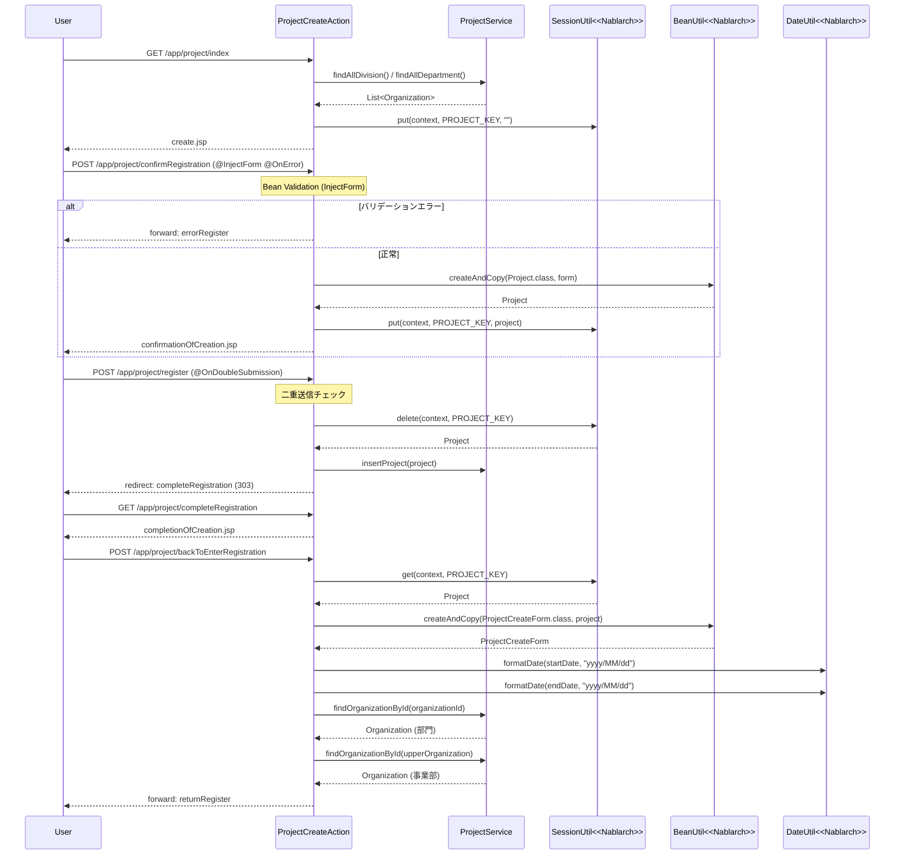

# Code Analysis: ProjectCreateAction

**Generated**: 2026-03-13 17:06:07
**Target**: プロジェクト登録処理アクション（入力・確認・登録・完了・戻る）
**Modules**: proman-web, proman-common
**Analysis Duration**: approx. 2m 43s

---

## Overview

`ProjectCreateAction` は Nablarch 5 の Web アプリケーションにおける プロジェクト登録機能 を実装するアクションクラスである。登録フロー全体（初期入力画面 → 確認画面 → 登録処理 → 完了画面 → 入力画面への戻り）を 5 つのメソッドで管理する。

バリデーションは `@InjectForm` + `@OnError` で実装され、二重送信防止は `@OnDoubleSubmission` で制御される。セッションストア（`SessionUtil`）でページ間データを受け渡し、PRG パターン（Post-Redirect-Get）によりブラウザ更新による多重登録を防いでいる。

---

## Architecture

### Dependency Graph

```mermaid
classDiagram
    class ProjectCreateAction
    class ProjectCreateForm {
        <<Form>>
    }
    class ProjectService
    class Project {
        <<Entity>>
    }
    class Organization {
        <<Entity>>
    }
    class DaoContext {
        <<Nablarch>>
    }
    class SessionUtil {
        <<Nablarch>>
    }
    class BeanUtil {
        <<Nablarch>>
    }
    class ExecutionContext {
        <<Nablarch>>
    }
    class DateUtil {
        <<Nablarch>>
    }

    ProjectCreateForm ..|> Serializable : implements
    ProjectCreateAction ..> ProjectCreateForm : validates
    ProjectCreateAction ..> ProjectService : delegates to
    ProjectCreateAction ..> SessionUtil : stores/retrieves
    ProjectCreateAction ..> BeanUtil : converts
    ProjectCreateAction ..> ExecutionContext : uses
    ProjectCreateAction ..> DateUtil : formats
    ProjectService ..> DaoContext : queries/persists
    ProjectService ..> Organization : queries
    ProjectService ..> Project : persists
```



**Note**: This diagram uses Mermaid `classDiagram` syntax to show class names and their relationships. Use `--|>` for inheritance (extends/implements) and `..>` for dependencies (uses/creates).

### Component Summary

| Component | Role | Type | Dependencies |
|-----------|------|------|--------------|
| ProjectCreateAction | プロジェクト登録フロー全体のアクション制御 | Action | ProjectCreateForm, ProjectService, SessionUtil, BeanUtil, ExecutionContext, DateUtil |
| ProjectCreateForm | プロジェクト登録入力値のバリデーション | Form | DateRelationUtil |
| ProjectService | DB アクセスの抽象化（DAO ラッパー） | Service | DaoContext, Project, Organization |
| Project | プロジェクトエンティティ | Entity | なし |
| Organization | 組織（事業部・部門）エンティティ | Entity | なし |

---

## Flow

### Processing Flow

プロジェクト登録は以下の 5 ステップで構成される。

1. **初期表示** (`index`): 事業部・部門リストを DB から取得してリクエストスコープに設定し、入力画面を表示する。
2. **確認画面表示** (`confirmRegistration`): `@InjectForm` によるバリデーション実行後、`BeanUtil` でフォームを `Project` エンティティに変換し、セッションストアに格納して確認画面を表示する。バリデーションエラー時は `@OnError` により入力画面にフォーワードする。
3. **登録処理** (`register`): `@OnDoubleSubmission` による二重送信防止のもと、セッションストアからプロジェクトを取得・削除し、`ProjectService.insertProject` で DB 登録後、完了画面へリダイレクト（PRG パターン）する。
4. **完了画面表示** (`completeRegistration`): 完了 JSP をそのまま返す。
5. **入力画面への戻る** (`backToEnterRegistration`): セッションストアからプロジェクトを取得し、`BeanUtil` でフォームに逆変換、日付を `DateUtil` でフォーマットし直してリクエストスコープに設定する。

### Sequence Diagram



---

## Components

### ProjectCreateAction

**ファイル**: [ProjectCreateAction.java](../../.lw/nab-official/v5/nablarch-system-development-guide/Sample_Project/Source_Code/proman-project/proman-web/src/main/java/com/nablarch/example/proman/web/project/ProjectCreateAction.java)

**役割**: プロジェクト登録フロー（入力 → 確認 → 登録 → 完了 → 戻る）を制御するアクションクラス

**主要メソッド**:

- `index(HttpRequest, ExecutionContext)` [L33-39]: 初期表示。事業部・部門リストを DB から取得してリクエストスコープに設定し `create.jsp` を返す。
- `confirmRegistration(HttpRequest, ExecutionContext)` [L48-63]: `@InjectForm` + `@OnError` でバリデーション。`BeanUtil.createAndCopy` でエンティティに変換後、`SessionUtil.put` でセッションに保存し確認画面を表示。
- `register(HttpRequest, ExecutionContext)` [L72-78]: `@OnDoubleSubmission` で二重送信防止。`SessionUtil.delete` でセッションからプロジェクトを取り出し、`ProjectService.insertProject` で DB 登録。303 リダイレクト（PRG パターン）。
- `backToEnterRegistration(HttpRequest, ExecutionContext)` [L98-118]: セッションからプロジェクト取得 → `BeanUtil` でフォームに逆変換 → `DateUtil` で日付フォーマット → 事業部情報を再取得してリクエストスコープに設定。

**依存関係**: ProjectCreateForm（バリデーション）、ProjectService（DB アクセス）、SessionUtil（セッション管理）、BeanUtil（Bean 変換）、DateUtil（日付フォーマット）

---

### ProjectCreateForm

**ファイル**: [ProjectCreateForm.java](../../.lw/nab-official/v5/nablarch-system-development-guide/Sample_Project/Source_Code/proman-project/proman-web/src/main/java/com/nablarch/example/proman/web/project/ProjectCreateForm.java)

**役割**: プロジェクト登録入力値のバリデーションを定義するフォームクラス

**主要メソッド**:

- `isValidProjectPeriod()` [L329-331]: `@AssertTrue` によるクロスフィールドバリデーション。`DateRelationUtil.isValid` で開始日 ≤ 終了日を検証する。

**実装ポイント**:
- `Serializable` を実装（`@InjectForm` 要件）
- 全プロパティが String 型（Bean Validation の標準パターン）
- `@Required` + `@Domain` アノテーションでドメインバリデーションを適用

**依存関係**: DateRelationUtil（日付期間チェック）

---

### ProjectService

**ファイル**: [ProjectService.java](../../.lw/nab-official/v5/nablarch-system-development-guide/Sample_Project/Source_Code/proman-project/proman-web/src/main/java/com/nablarch/example/proman/web/project/ProjectService.java)

**役割**: プロジェクト・組織 DB アクセスを集約するサービスクラス（`DaoContext` の薄いラッパー）

**主要メソッド**（ProjectCreateAction から使用分）:

- `findAllDivision()` [L50-52]: SQL ファイル `FIND_ALL_DIVISION` で全事業部を取得。
- `findAllDepartment()` [L59-61]: SQL ファイル `FIND_ALL_DEPARTMENT` で全部門を取得。
- `findOrganizationById(Integer)` [L70-73]: 主キーで組織を 1 件取得。
- `insertProject(Project)` [L80-82]: `universalDao.insert` でプロジェクトを DB 登録。

**依存関係**: DaoContext（UniversalDao 経由）、Project、Organization

---

## Nablarch Framework Usage

### InjectForm / OnError

**クラス**: `nablarch.common.web.interceptor.InjectForm` / `nablarch.fw.web.interceptor.OnError`

**説明**: アクションメソッドに付与するインターセプターアノテーション。`@InjectForm` はリクエストパラメータをフォームクラスにバインドし Bean Validation を実行する。`@OnError` はバリデーションエラー発生時の遷移先を指定する。

**使用方法**:
```java
@InjectForm(form = ProjectCreateForm.class, prefix = "form")
@OnError(type = ApplicationException.class, path = "forward:///app/project/errorRegister")
public HttpResponse confirmRegistration(HttpRequest request, ExecutionContext context) {
    ProjectCreateForm form = context.getRequestScopedVar("form");
    // ...
}
```

**重要ポイント**:
- ✅ **フォームは Serializable を実装**: `@InjectForm` でバリデーションを実行するために必須。
- ✅ **バリデーション済みフォームはリクエストスコープから取得**: `context.getRequestScopedVar("form")` で取得する。
- ⚠️ **`@OnError` の `path` に forward 先を指定**: エラー時に元の入力画面を再表示するには、プルダウン再設定のためアクションへ内部フォーワードする必要がある。
- 💡 **Bean Validation との統合**: Nablarch の `@Required`, `@Domain` アノテーションを使用。`nablarch.core.validation.ee` 配下を使うこと（`nablarch.core.validation.validator` と同名のものがあるため注意）。

**このコードでの使い方**:
- `confirmRegistration` に `@InjectForm(form = ProjectCreateForm.class, prefix = "form")` を付与（L48）
- バリデーションエラー時は `forward:///app/project/errorRegister` にフォーワード（L49）

**詳細**: [Web Application Client_create2](../../.claude/skills/nabledge-5/docs/processing-pattern/web-application/web-application-client_create2.md)

---

### SessionUtil

**クラス**: `nablarch.common.web.session.SessionUtil`

**説明**: セッションストアへのデータ保存・取得・削除を行うユーティリティクラス。確認画面付き登録フローで、ページ間のエンティティ受け渡しに使用する。

**使用方法**:
```java
// 保存
SessionUtil.put(context, "projectCreateActionProject", project);
// 取得
Project project = SessionUtil.get(context, "projectCreateActionProject");
// 取得して削除
Project project = SessionUtil.delete(context, "projectCreateActionProject");
```

**重要ポイント**:
- ✅ **フォームではなくエンティティをセッションに格納**: `BeanUtil.createAndCopy` でフォームをエンティティに変換してからセッションストアに登録する。
- ✅ **登録後は `delete` で取り出す**: `SessionUtil.delete` は取得と削除を同時に行い、不要なセッションデータを残さない。
- ⚠️ **セッションキーは定数で管理**: `PROJECT_KEY = "projectCreateActionProject"` として `static final` 定数で管理する。
- 💡 **PRG パターンとの組み合わせ**: セッションにデータを格納しリダイレクト後に取り出すことで、二重登録を防ぎつつデータを安全に受け渡す。

**このコードでの使い方**:
- `confirmRegistration` で `SessionUtil.put(context, PROJECT_KEY, project)` により確認用プロジェクトを保存（L59）
- `register` で `SessionUtil.delete(context, PROJECT_KEY)` により取り出しと削除を同時実行（L74）
- `backToEnterRegistration` で `SessionUtil.get(context, PROJECT_KEY)` により戻り処理用に取得（L100）

**詳細**: [Web Application Client_create3](../../.claude/skills/nabledge-5/docs/processing-pattern/web-application/web-application-client_create3.md)

---

### OnDoubleSubmission

**クラス**: `nablarch.common.web.token.OnDoubleSubmission`

**説明**: アクションメソッドに付与することで、二重サブミット（同じリクエストの重複実行）を防止するインターセプターアノテーション。サーバサイドとクライアントサイドの両方で二重送信を制御する。

**使用方法**:
```java
@OnDoubleSubmission
public HttpResponse register(HttpRequest request, ExecutionContext context) {
    // 二重実行されない
}
```

**重要ポイント**:
- ✅ **登録・更新・削除メソッドに付与**: データ変更を行うアクションメソッドには必ず付与する。
- ⚠️ **クライアントサイドも制御が必要**: JavaScript が無効な場合を考慮し、サーバサイドでも制御する。JSP の `<n:button allowDoubleSubmission="false">` と組み合わせる。
- 💡 **PRG パターンとの相乗効果**: `@OnDoubleSubmission` による二重送信防止に加え、303 リダイレクトによるブラウザ更新での再送信も防ぐ。

**このコードでの使い方**:
- `register` メソッドに `@OnDoubleSubmission` を付与（L72）

**詳細**: [Web Application Client_create4](../../.claude/skills/nabledge-5/docs/processing-pattern/web-application/web-application-client_create4.md)

---

### BeanUtil

**クラス**: `nablarch.core.beans.BeanUtil`

**説明**: Java Bean 間のプロパティコピーを行うユーティリティクラス。同名プロパティを自動的にコピーすることで、フォームとエンティティ間の変換を簡潔に記述できる。

**使用方法**:
```java
// フォーム → エンティティ
Project project = BeanUtil.createAndCopy(Project.class, form);
// エンティティ → フォーム
ProjectCreateForm form = BeanUtil.createAndCopy(ProjectCreateForm.class, project);
```

**重要ポイント**:
- ✅ **セッションストアにはエンティティを格納**: フォームは Serializable だがセッションストアに格納しないのが Nablarch の推奨パターン。`BeanUtil.createAndCopy` でエンティティに変換してから格納する。
- ⚠️ **型変換に注意**: フォームのプロパティはすべて String 型だが、エンティティは Integer 等になる場合がある。`BeanUtil` が自動変換するが、変換できない型は `null` になる。
- 💡 **双方向変換**: `confirmRegistration` でフォーム→エンティティ、`backToEnterRegistration` でエンティティ→フォームの双方向変換に使用。

**このコードでの使い方**:
- `confirmRegistration` で `BeanUtil.createAndCopy(Project.class, form)` によりフォームをエンティティに変換（L52）
- `backToEnterRegistration` で `BeanUtil.createAndCopy(ProjectCreateForm.class, project)` によりエンティティをフォームに逆変換（L101）

---

## References

### Source Files

- [ProjectCreateAction.java (.lw/nab-official/v5/nablarch-system-development-guide/en/Sample_Project/Source_Code/proman-project/proman-web/src/main/java/com/nablarch/example/proman/web/project)](../../.lw/nab-official/v5/nablarch-system-development-guide/en/Sample_Project/Source_Code/proman-project/proman-web/src/main/java/com/nablarch/example/proman/web/project/ProjectCreateAction.java) - ProjectCreateAction
- [ProjectCreateAction.java (.lw/nab-official/v5/nablarch-system-development-guide/Sample_Project/Source_Code/proman-project/proman-web/src/main/java/com/nablarch/example/proman/web/project)](../../.lw/nab-official/v5/nablarch-system-development-guide/Sample_Project/Source_Code/proman-project/proman-web/src/main/java/com/nablarch/example/proman/web/project/ProjectCreateAction.java) - ProjectCreateAction
- [ProjectCreateAction.java (.lw/nab-official/v6/nablarch-system-development-guide/en/Sample_Project/Source_Code/proman-project/proman-web/src/main/java/com/nablarch/example/proman/web/project)](../../.lw/nab-official/v6/nablarch-system-development-guide/en/Sample_Project/Source_Code/proman-project/proman-web/src/main/java/com/nablarch/example/proman/web/project/ProjectCreateAction.java) - ProjectCreateAction
- [ProjectCreateAction.java (.lw/nab-official/v6/nablarch-system-development-guide/Sample_Project/Source_Code/proman-project/proman-web/src/main/java/com/nablarch/example/proman/web/project)](../../.lw/nab-official/v6/nablarch-system-development-guide/Sample_Project/Source_Code/proman-project/proman-web/src/main/java/com/nablarch/example/proman/web/project/ProjectCreateAction.java) - ProjectCreateAction
- [ProjectCreateForm.java (.lw/nab-official/v5/nablarch-system-development-guide/en/Sample_Project/Source_Code/proman-project/proman-web/src/main/java/com/nablarch/example/proman/web/project)](../../.lw/nab-official/v5/nablarch-system-development-guide/en/Sample_Project/Source_Code/proman-project/proman-web/src/main/java/com/nablarch/example/proman/web/project/ProjectCreateForm.java) - ProjectCreateForm
- [ProjectCreateForm.java (.lw/nab-official/v5/nablarch-system-development-guide/Sample_Project/Source_Code/proman-project/proman-web/src/main/java/com/nablarch/example/proman/web/project)](../../.lw/nab-official/v5/nablarch-system-development-guide/Sample_Project/Source_Code/proman-project/proman-web/src/main/java/com/nablarch/example/proman/web/project/ProjectCreateForm.java) - ProjectCreateForm
- [ProjectCreateForm.java (.lw/nab-official/v6/nablarch-system-development-guide/en/Sample_Project/Source_Code/proman-project/proman-web/src/main/java/com/nablarch/example/proman/web/project)](../../.lw/nab-official/v6/nablarch-system-development-guide/en/Sample_Project/Source_Code/proman-project/proman-web/src/main/java/com/nablarch/example/proman/web/project/ProjectCreateForm.java) - ProjectCreateForm
- [ProjectCreateForm.java (.lw/nab-official/v6/nablarch-system-development-guide/Sample_Project/Source_Code/proman-project/proman-web/src/main/java/com/nablarch/example/proman/web/project)](../../.lw/nab-official/v6/nablarch-system-development-guide/Sample_Project/Source_Code/proman-project/proman-web/src/main/java/com/nablarch/example/proman/web/project/ProjectCreateForm.java) - ProjectCreateForm
- [ProjectService.java (.lw/nab-official/v5/nablarch-system-development-guide/en/Sample_Project/Source_Code/proman-project/proman-web/src/main/java/com/nablarch/example/proman/web/project)](../../.lw/nab-official/v5/nablarch-system-development-guide/en/Sample_Project/Source_Code/proman-project/proman-web/src/main/java/com/nablarch/example/proman/web/project/ProjectService.java) - ProjectService
- [ProjectService.java (.lw/nab-official/v5/nablarch-system-development-guide/Sample_Project/Source_Code/proman-project/proman-web/src/main/java/com/nablarch/example/proman/web/project)](../../.lw/nab-official/v5/nablarch-system-development-guide/Sample_Project/Source_Code/proman-project/proman-web/src/main/java/com/nablarch/example/proman/web/project/ProjectService.java) - ProjectService
- [ProjectService.java (.lw/nab-official/v6/nablarch-system-development-guide/en/Sample_Project/Source_Code/proman-project/proman-web/src/main/java/com/nablarch/example/proman/web/project)](../../.lw/nab-official/v6/nablarch-system-development-guide/en/Sample_Project/Source_Code/proman-project/proman-web/src/main/java/com/nablarch/example/proman/web/project/ProjectService.java) - ProjectService
- [ProjectService.java (.lw/nab-official/v6/nablarch-system-development-guide/Sample_Project/Source_Code/proman-project/proman-web/src/main/java/com/nablarch/example/proman/web/project)](../../.lw/nab-official/v6/nablarch-system-development-guide/Sample_Project/Source_Code/proman-project/proman-web/src/main/java/com/nablarch/example/proman/web/project/ProjectService.java) - ProjectService

### Knowledge Base (Nabledge-5)

- [Web Application Client_create2](../../.claude/skills/nabledge-5/docs/processing-pattern/web-application/web-application-client_create2.md)
- [Web Application Client_create3](../../.claude/skills/nabledge-5/docs/processing-pattern/web-application/web-application-client_create3.md)
- [Web Application Client_create4](../../.claude/skills/nabledge-5/docs/processing-pattern/web-application/web-application-client_create4.md)

### Official Documentation


- [BeanUtil](https://nablarch.github.io/docs/LATEST/javadoc/nablarch/core/beans/BeanUtil.html)
- [Client Create2](https://nablarch.github.io/docs/LATEST/doc/application_framework/application_framework/web/getting_started/client_create/client_create2.html)
- [Client Create3](https://nablarch.github.io/docs/LATEST/doc/application_framework/application_framework/web/getting_started/client_create/client_create3.html)
- [Client Create4](https://nablarch.github.io/docs/LATEST/doc/application_framework/application_framework/web/getting_started/client_create/client_create4.html)
- [InjectForm](https://nablarch.github.io/docs/LATEST/javadoc/nablarch/common/web/interceptor/InjectForm.html)
- [OnDoubleSubmission](https://nablarch.github.io/docs/LATEST/javadoc/nablarch/common/web/token/OnDoubleSubmission.html)
- [OnError](https://nablarch.github.io/docs/LATEST/javadoc/nablarch/fw/web/interceptor/OnError.html)
- [Required](https://nablarch.github.io/docs/LATEST/javadoc/nablarch/core/validation/ee/Required.html)
- [SessionUtil](https://nablarch.github.io/docs/LATEST/javadoc/nablarch/common/web/session/SessionUtil.html)

---

**Note**: This documentation was generated by the code-analysis workflow of the nabledge-5 skill.
