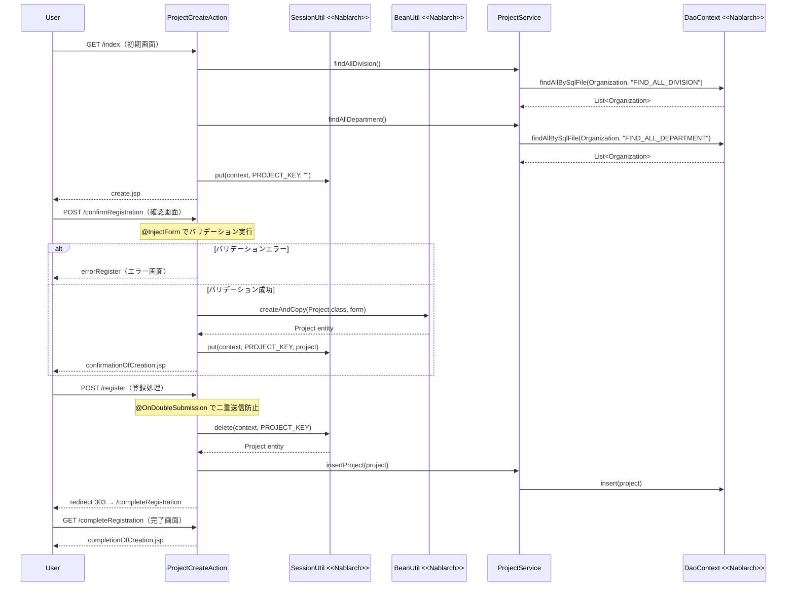

# Code Analysis: ProjectCreateAction

**Generated**: 2026-03-13 17:10:11
**Target**: プロジェクト登録処理（入力・確認・登録・完了の4ステップ）
**Modules**: proman-web
**Analysis Duration**: approx. 3m 8s

---

## Overview

`ProjectCreateAction` はプロジェクト登録機能を担うWebアクションクラスです。入力画面表示 → 確認画面表示 → 登録処理 → 完了画面表示という4ステップのフローを実装しています。また、確認画面から入力画面へ戻る処理も含みます。

バリデーションには `@InjectForm` と Bean Validation（`@Required`, `@Domain`）を使用し、二重サブミット防止には `@OnDoubleSubmission` を使用します。画面間のデータ受け渡しはセッションストア（`SessionUtil`）を介して行われます。

---

## Architecture

### Dependency Graph

```mermaid
classDiagram
    class ProjectCreateAction
    class ProjectCreateForm {
        <<Form>>
    }
    class ProjectService
    class Project {
        <<Entity>>
    }
    class Organization {
        <<Entity>>
    }
    class DaoContext {
        <<Nablarch>>
    }
    class SessionUtil {
        <<Nablarch>>
    }
    class BeanUtil {
        <<Nablarch>>
    }
    class ExecutionContext {
        <<Nablarch>>
    }
    class InjectForm {
        <<Nablarch>>
    }
    class OnDoubleSubmission {
        <<Nablarch>>
    }

    ProjectCreateAction ..> ProjectCreateForm : validates
    ProjectCreateAction ..> ProjectService : delegates to
    ProjectCreateAction ..> SessionUtil : stores/retrieves
    ProjectCreateAction ..> BeanUtil : converts
    ProjectCreateAction ..> ExecutionContext : uses
    ProjectCreateAction ..> InjectForm : uses
    ProjectCreateAction ..> OnDoubleSubmission : uses
    ProjectCreateForm ..|> Serializable : implements
    ProjectService ..> DaoContext : queries/persists
    ProjectService ..> Project : persists
    ProjectService ..> Organization : queries
```



**Note**: This diagram uses Mermaid `classDiagram` syntax to show class names and their relationships. Use `--|>` for inheritance (extends/implements) and `..>` for dependencies (uses/creates).

### Component Summary

| Component | Role | Type | Dependencies |
|-----------|------|------|--------------|
| ProjectCreateAction | プロジェクト登録の全画面遷移を制御 | Action | ProjectCreateForm, ProjectService, SessionUtil, BeanUtil, ExecutionContext |
| ProjectCreateForm | 登録入力値の受け取りとバリデーション | Form | DateRelationUtil |
| ProjectService | DB操作の集約（組織取得・プロジェクト登録） | Service | DaoContext, Organization, Project |
| Project | プロジェクトエンティティ（データ） | Entity | なし |
| Organization | 組織エンティティ（事業部・部門） | Entity | なし |
| DaoContext | Nablarch汎用DAO | Nablarch | なし |

---

## Flow

### Processing Flow

プロジェクト登録は以下の5つの処理ステップで構成されます。

1. **初期画面表示（index）**: 事業部・部門のプルダウンリストをDBから取得し、リクエストスコープに設定してから登録入力画面を表示します。
2. **確認画面表示（confirmRegistration）**: `@InjectForm` でフォームのバリデーションを実行します。バリデーション通過後、`BeanUtil` でフォームをエンティティに変換し、セッションストアに保存して確認画面へ遷移します。
3. **登録処理（register）**: `@OnDoubleSubmission` で二重サブミットを防止します。セッションストアからエンティティを取り出し、`ProjectService.insertProject()` でDB登録後、完了画面へリダイレクトします（PRGパターン）。
4. **完了画面表示（completeRegistration）**: 完了JSPを表示するだけのシンプルなメソッドです。
5. **入力画面へ戻る（backToEnterRegistration）**: セッションストアからエンティティを取得し、`BeanUtil` でフォームへ変換して入力画面へ内部フォワードします。日付フォーマット変換も行います。

### Sequence Diagram



---

## Components

### ProjectCreateAction

**ファイル**: [ProjectCreateAction.java](../../.lw/nab-official/v5/nablarch-system-development-guide/Sample_Project/Source_Code/proman-project/proman-web/src/main/java/com/nablarch/example/proman/web/project/ProjectCreateAction.java)

**役割**: プロジェクト登録の全画面遷移を制御するWebアクションクラス。

**主要メソッド**:
- `index(request, context)` L33-39: 初期画面表示。事業部・部門リストを取得してリクエストスコープへ設定する。
- `confirmRegistration(request, context)` L48-63: `@InjectForm` でバリデーション後、Projectエンティティをセッションへ保存して確認画面へ遷移する。
- `register(request, context)` L72-78: `@OnDoubleSubmission` 付き登録処理。セッションからエンティティを取り出してDB登録し、303リダイレクトで完了画面へ。
- `completeRegistration(request, context)` L87-89: 完了画面JSPを返すシンプルなメソッド。
- `backToEnterRegistration(request, context)` L98-118: 確認画面から入力画面への戻り処理。BeanUtil変換と日付フォーマット変換を行う。
- `setOrganizationAndDivisionToRequestScope(context)` L125-136: 事業部・部門リストを取得してリクエストスコープへ設定する共通プライベートメソッド。

**依存コンポーネント**: ProjectCreateForm, ProjectService, SessionUtil, BeanUtil, DateUtil, ExecutionContext

### ProjectCreateForm

**ファイル**: [ProjectCreateForm.java](../../.lw/nab-official/v5/nablarch-system-development-guide/Sample_Project/Source_Code/proman-project/proman-web/src/main/java/com/nablarch/example/proman/web/project/ProjectCreateForm.java)

**役割**: プロジェクト登録入力値の受け取りとBeanValidationによるバリデーション定義。

**主要メソッド・フィールド**:
- 各フィールド（L27-103）: `@Required` と `@Domain` アノテーションでバリデーションルールを宣言。
- `isValidProjectPeriod()` L329-331: `@AssertTrue` によるプロジェクト期間の整合性チェック（開始日 <= 終了日）。

**依存コンポーネント**: DateRelationUtil（日付整合性チェック）

### ProjectService

**ファイル**: [ProjectService.java](../../.lw/nab-official/v5/nablarch-system-development-guide/Sample_Project/Source_Code/proman-project/proman-web/src/main/java/com/nablarch/example/proman/web/project/ProjectService.java)

**役割**: DB操作を集約するサービスクラス。DaoContextを介してCRUD操作を提供する。

**主要メソッド**:
- `findAllDivision()` L50-52: 全事業部をSQLファイル（`FIND_ALL_DIVISION`）で取得する。
- `findAllDepartment()` L59-61: 全部門をSQLファイル（`FIND_ALL_DEPARTMENT`）で取得する。
- `findOrganizationById(organizationId)` L70-73: 組織IDで組織を主キー検索する。
- `insertProject(project)` L80-82: `DaoContext.insert()` でプロジェクトをDB登録する。

**依存コンポーネント**: DaoContext（Nablarch汎用DAO）, DaoFactory

---

## Nablarch Framework Usage

### InjectForm

**クラス**: `nablarch.common.web.interceptor.InjectForm`

**説明**: 業務アクションメソッドに付与するアノテーション。リクエストパラメータをフォームクラスにバインドし、Bean Validationを実行する。

**使用方法**:
```java
@InjectForm(form = ProjectCreateForm.class, prefix = "form")
@OnError(type = ApplicationException.class, path = "forward:///app/project/errorRegister")
public HttpResponse confirmRegistration(HttpRequest request, ExecutionContext context) {
    ProjectCreateForm form = context.getRequestScopedVar("form");
    // ...
}
```

**重要ポイント**:
- ✅ **`@OnError`と組み合わせる**: バリデーションエラー時の遷移先を必ず `@OnError` で指定する。
- ⚠️ **フォームはリクエストスコープから取得**: バリデーション済みフォームは `context.getRequestScopedVar("form")` で取得する。
- 💡 **フォームをセッションに直接保存しない**: フォームはセッションに格納せず、`BeanUtil` でエンティティに変換してからセッションに保存する。

**このコードでの使い方**:
- `confirmRegistration()` L48 に付与してフォームバリデーションを実行。
- バリデーションエラー時は `errorRegister` へ内部フォワード。

**詳細**: [Web Application Client_create2](../../.claude/skills/nabledge-5/docs/processing-pattern/web-application/web-application-client_create2.md)

---

### OnDoubleSubmission

**クラス**: `nablarch.common.web.token.OnDoubleSubmission`

**説明**: 業務アクションメソッドに付与するアノテーション。二重サブミット（ブラウザの戻るボタンや更新ボタンによる多重実行）を防止する。

**使用方法**:
```java
@OnDoubleSubmission
public HttpResponse register(HttpRequest request, ExecutionContext context) {
    // DB登録処理
}
```

**重要ポイント**:
- ✅ **登録・更新・削除処理に付与**: データ変更を伴うアクションメソッドに必ず付与する。
- ⚠️ **JSP側も制御が必要**: ブラウザのJavaScriptが無効な場合を考慮し、サーバサイドとクライアントサイド（`allowDoubleSubmission="false"`）の両方で制御する。
- 💡 **PRGパターンと組み合わせる**: 登録後は303リダイレクトを返すことで、ブラウザ更新による多重登録を防ぐ。

**このコードでの使い方**:
- `register()` L72 に付与して二重サブミットを防止。
- 登録後は `new HttpResponse(303, "redirect:///app/project/completeRegistration")` でリダイレクト。

**詳細**: [Web Application Client_create4](../../.claude/skills/nabledge-5/docs/processing-pattern/web-application/web-application-client_create4.md)

---

### SessionUtil

**クラス**: `nablarch.common.web.session.SessionUtil`

**説明**: セッションストアへのデータ保存・取得・削除を行うユーティリティクラス。画面をまたいだデータの受け渡しに使用する。

**使用方法**:
```java
// セッションへ保存
SessionUtil.put(context, "projectCreateActionProject", project);

// セッションから取得（削除しない）
Project project = SessionUtil.get(context, "projectCreateActionProject");

// セッションから取得して削除
Project project = SessionUtil.delete(context, "projectCreateActionProject");
```

**重要ポイント**:
- ✅ **登録後はdeleteで削除**: `register()` では `SessionUtil.delete()` を使用してセッションデータを削除する。
- ⚠️ **フォームクラスはセッションに保存しない**: `Serializable` でもフォームクラスをセッションに直接保存せず、エンティティに変換してから保存する。
- 💡 **キー名はstaticフィールドで管理**: `PROJECT_KEY = "projectCreateActionProject"` のように定数で管理することで誤りを防ぐ。

**このコードでの使い方**:
- `confirmRegistration()` L59: `Project` エンティティをセッションへ保存。
- `register()` L74: `SessionUtil.delete()` でエンティティを取り出しつつセッションを削除。
- `backToEnterRegistration()` L100: `SessionUtil.get()` でエンティティを取得して入力画面に戻す。

**詳細**: [Web Application Client_create2](../../.claude/skills/nabledge-5/docs/processing-pattern/web-application/web-application-client_create2.md)

---

### BeanUtil

**クラス**: `nablarch.core.beans.BeanUtil`

**説明**: JavaBeansオブジェクト間のプロパティコピーを行うユーティリティクラス。フォームとエンティティ間の変換に使用する。

**使用方法**:
```java
// フォームからエンティティを生成してコピー
Project project = BeanUtil.createAndCopy(Project.class, form);

// エンティティからフォームを生成してコピー
ProjectCreateForm form = BeanUtil.createAndCopy(ProjectCreateForm.class, project);
```

**重要ポイント**:
- ✅ **同名プロパティが自動コピーされる**: 型が一致する同名プロパティが自動的にコピーされる。
- ⚠️ **型変換に注意**: フォームはすべてString型のため、エンティティの数値型プロパティへのコピーには型変換が行われる。
- 💡 **セッション格納前の変換に使用**: `@InjectForm` でバリデーション後にフォームをエンティティに変換してからセッションに保存するパターンで利用する。

**このコードでの使い方**:
- `confirmRegistration()` L52: フォームから `Project` エンティティを生成。
- `backToEnterRegistration()` L101: `Project` エンティティから `ProjectCreateForm` を生成して入力画面へ戻す。

**詳細**: [Web Application Client_create3](../../.claude/skills/nabledge-5/docs/processing-pattern/web-application/web-application-client_create3.md)

---

### DaoContext（UniversalDao）

**クラス**: `nablarch.common.dao.DaoContext`

**説明**: Nablarchの汎用DAOインタフェース。SQLを記述せずに主キーCRUDやSQLファイルを使った検索が可能。

**使用方法**:
```java
// エンティティをDB登録
universalDao.insert(project);

// SQLファイルで全件取得
universalDao.findAllBySqlFile(Organization.class, "FIND_ALL_DIVISION");

// 主キーで1件取得
universalDao.findById(Organization.class, new Object[]{organizationId});
```

**重要ポイント**:
- ✅ **insert後に主キーが自動設定される**: シーケンスを使う場合、insert後にエンティティの主キーフィールドへ生成値が設定される。
- 💡 **SQLファイルは自動解決される**: SQLファイル名（`FIND_ALL_DIVISION`）はクラスパス上の `.sql` ファイルと自動的に対応付けられる。
- ⚠️ **トランザクション管理はハンドラが担う**: コミット/ロールバックはハンドラチェーンのトランザクションハンドラが行うため、明示的な制御は不要。

**このコードでの使い方**:
- `ProjectService.insertProject()` L81: `universalDao.insert(project)` でプロジェクトをDB登録。
- `ProjectService.findAllDivision()` L51: `findAllBySqlFile()` で全事業部を取得。
- `ProjectService.findOrganizationById()` L72: `findById()` で組織を主キー検索。

**詳細**: [Web Application Getting Started Project Update](../../.claude/skills/nabledge-5/docs/processing-pattern/web-application/web-application-getting-started-project-update.md)

---

## References

### Source Files

- [ProjectCreateAction.java (.lw/nab-official/v5/nablarch-system-development-guide/en/Sample_Project/Source_Code/proman-project/proman-web/src/main/java/com/nablarch/example/proman/web/project)](../../.lw/nab-official/v5/nablarch-system-development-guide/en/Sample_Project/Source_Code/proman-project/proman-web/src/main/java/com/nablarch/example/proman/web/project/ProjectCreateAction.java) - ProjectCreateAction
- [ProjectCreateAction.java (.lw/nab-official/v5/nablarch-system-development-guide/Sample_Project/Source_Code/proman-project/proman-web/src/main/java/com/nablarch/example/proman/web/project)](../../.lw/nab-official/v5/nablarch-system-development-guide/Sample_Project/Source_Code/proman-project/proman-web/src/main/java/com/nablarch/example/proman/web/project/ProjectCreateAction.java) - ProjectCreateAction
- [ProjectCreateAction.java (.lw/nab-official/v6/nablarch-system-development-guide/en/Sample_Project/Source_Code/proman-project/proman-web/src/main/java/com/nablarch/example/proman/web/project)](../../.lw/nab-official/v6/nablarch-system-development-guide/en/Sample_Project/Source_Code/proman-project/proman-web/src/main/java/com/nablarch/example/proman/web/project/ProjectCreateAction.java) - ProjectCreateAction
- [ProjectCreateAction.java (.lw/nab-official/v6/nablarch-system-development-guide/Sample_Project/Source_Code/proman-project/proman-web/src/main/java/com/nablarch/example/proman/web/project)](../../.lw/nab-official/v6/nablarch-system-development-guide/Sample_Project/Source_Code/proman-project/proman-web/src/main/java/com/nablarch/example/proman/web/project/ProjectCreateAction.java) - ProjectCreateAction
- [ProjectCreateForm.java (.lw/nab-official/v5/nablarch-system-development-guide/en/Sample_Project/Source_Code/proman-project/proman-web/src/main/java/com/nablarch/example/proman/web/project)](../../.lw/nab-official/v5/nablarch-system-development-guide/en/Sample_Project/Source_Code/proman-project/proman-web/src/main/java/com/nablarch/example/proman/web/project/ProjectCreateForm.java) - ProjectCreateForm
- [ProjectCreateForm.java (.lw/nab-official/v5/nablarch-system-development-guide/Sample_Project/Source_Code/proman-project/proman-web/src/main/java/com/nablarch/example/proman/web/project)](../../.lw/nab-official/v5/nablarch-system-development-guide/Sample_Project/Source_Code/proman-project/proman-web/src/main/java/com/nablarch/example/proman/web/project/ProjectCreateForm.java) - ProjectCreateForm
- [ProjectCreateForm.java (.lw/nab-official/v6/nablarch-system-development-guide/en/Sample_Project/Source_Code/proman-project/proman-web/src/main/java/com/nablarch/example/proman/web/project)](../../.lw/nab-official/v6/nablarch-system-development-guide/en/Sample_Project/Source_Code/proman-project/proman-web/src/main/java/com/nablarch/example/proman/web/project/ProjectCreateForm.java) - ProjectCreateForm
- [ProjectCreateForm.java (.lw/nab-official/v6/nablarch-system-development-guide/Sample_Project/Source_Code/proman-project/proman-web/src/main/java/com/nablarch/example/proman/web/project)](../../.lw/nab-official/v6/nablarch-system-development-guide/Sample_Project/Source_Code/proman-project/proman-web/src/main/java/com/nablarch/example/proman/web/project/ProjectCreateForm.java) - ProjectCreateForm
- [ProjectService.java (.lw/nab-official/v5/nablarch-system-development-guide/en/Sample_Project/Source_Code/proman-project/proman-web/src/main/java/com/nablarch/example/proman/web/project)](../../.lw/nab-official/v5/nablarch-system-development-guide/en/Sample_Project/Source_Code/proman-project/proman-web/src/main/java/com/nablarch/example/proman/web/project/ProjectService.java) - ProjectService
- [ProjectService.java (.lw/nab-official/v5/nablarch-system-development-guide/Sample_Project/Source_Code/proman-project/proman-web/src/main/java/com/nablarch/example/proman/web/project)](../../.lw/nab-official/v5/nablarch-system-development-guide/Sample_Project/Source_Code/proman-project/proman-web/src/main/java/com/nablarch/example/proman/web/project/ProjectService.java) - ProjectService
- [ProjectService.java (.lw/nab-official/v6/nablarch-system-development-guide/en/Sample_Project/Source_Code/proman-project/proman-web/src/main/java/com/nablarch/example/proman/web/project)](../../.lw/nab-official/v6/nablarch-system-development-guide/en/Sample_Project/Source_Code/proman-project/proman-web/src/main/java/com/nablarch/example/proman/web/project/ProjectService.java) - ProjectService
- [ProjectService.java (.lw/nab-official/v6/nablarch-system-development-guide/Sample_Project/Source_Code/proman-project/proman-web/src/main/java/com/nablarch/example/proman/web/project)](../../.lw/nab-official/v6/nablarch-system-development-guide/Sample_Project/Source_Code/proman-project/proman-web/src/main/java/com/nablarch/example/proman/web/project/ProjectService.java) - ProjectService

### Knowledge Base (Nabledge-5)

- [Web Application Client_create2](../../.claude/skills/nabledge-5/docs/processing-pattern/web-application/web-application-client_create2.md)
- [Web Application Client_create4](../../.claude/skills/nabledge-5/docs/processing-pattern/web-application/web-application-client_create4.md)
- [Web Application Client_create3](../../.claude/skills/nabledge-5/docs/processing-pattern/web-application/web-application-client_create3.md)
- [Web Application Getting Started Project Update](../../.claude/skills/nabledge-5/docs/processing-pattern/web-application/web-application-getting-started-project-update.md)

### Official Documentation

- [BeanUtil](https://nablarch.github.io/docs/LATEST/javadoc/nablarch/core/beans/BeanUtil.html)
- [Client Create2](https://nablarch.github.io/docs/LATEST/doc/application_framework/application_framework/web/getting_started/client_create/client_create2.html)
- [Client Create3](https://nablarch.github.io/docs/LATEST/doc/application_framework/application_framework/web/getting_started/client_create/client_create3.html)
- [Client Create4](https://nablarch.github.io/docs/LATEST/doc/application_framework/application_framework/web/getting_started/client_create/client_create4.html)
- [Index](https://nablarch.github.io/docs/LATEST/doc/application_framework/application_framework/web/getting_started/project_update/index.html)
- [InjectForm](https://nablarch.github.io/docs/LATEST/javadoc/nablarch/common/web/interceptor/InjectForm.html)
- [NoDataException](https://nablarch.github.io/docs/LATEST/javadoc/nablarch/common/dao/NoDataException.html)
- [OnDoubleSubmission](https://nablarch.github.io/docs/LATEST/javadoc/nablarch/common/web/token/OnDoubleSubmission.html)
- [OnError](https://nablarch.github.io/docs/LATEST/javadoc/nablarch/fw/web/interceptor/OnError.html)
- [Required](https://nablarch.github.io/docs/LATEST/javadoc/nablarch/core/validation/ee/Required.html)
- [ResourceLocator](https://nablarch.github.io/docs/LATEST/javadoc/nablarch/fw/web/ResourceLocator.html)
- [SessionUtil](https://nablarch.github.io/docs/LATEST/javadoc/nablarch/common/web/session/SessionUtil.html)
- [UniversalDao](https://nablarch.github.io/docs/LATEST/javadoc/nablarch/common/dao/UniversalDao.html)

---

**Note**: This documentation was generated by the code-analysis workflow of the nabledge-5 skill.
