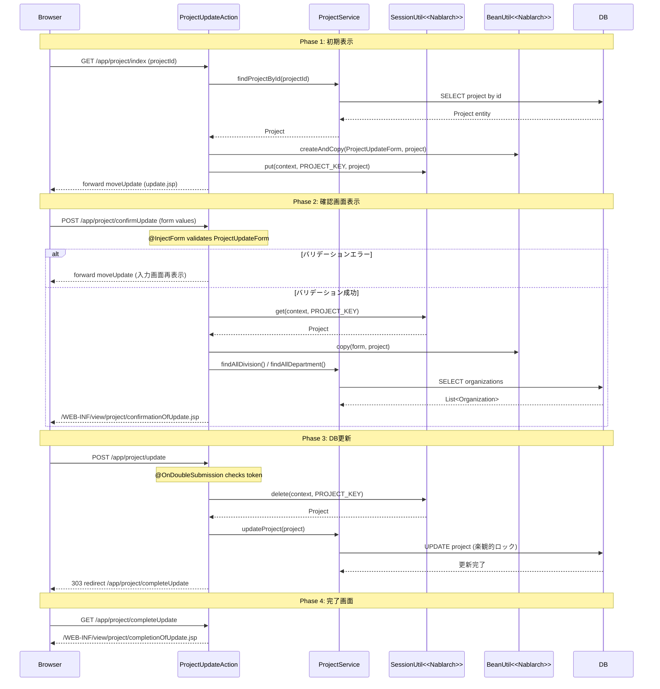

# Code Analysis: ProjectUpdateAction

**Generated**: 2026-03-13 17:22:45
**Target**: プロジェクト更新処理アクション
**Modules**: proman-web, proman-common
**Analysis Duration**: approx. 3m 30s

---

## Overview

`ProjectUpdateAction` は Nablarch 5 の Web アプリケーションにおけるプロジェクト更新機能のアクションクラスである。プロジェクト詳細画面からの遷移を受け付け、「入力 → 確認 → 完了」の3ステップ更新フローを制御する。

主なフロー:
- `index()`: プロジェクト詳細画面からプロジェクト更新入力画面へ遷移。DBからプロジェクト情報を取得しセッションに保存する。
- `confirmUpdate()`: 入力値をバリデーションし、確認画面を表示する。
- `update()`: セッションに保存したエンティティでDB更新を実行する。二重サブミット防止付き。
- `completeUpdate()`: 更新完了画面を表示する。
- `backToEnterUpdate()`: 確認画面から入力画面へ戻る。セッションからフォームを復元する。
- `indexSetPullDown()`: プルダウンデータ（事業部/部門）をDBから取得してリクエストスコープに設定し更新画面を表示する。

Nablarch の `@InjectForm`、`@OnError`、`@OnDoubleSubmission`、`SessionUtil`、`BeanUtil` を活用した典型的な Web 更新パターンの実装例である。

---

## Architecture

### Dependency Graph

```mermaid
classDiagram
    class ProjectUpdateAction
    class ProjectUpdateInitialForm {
        <<Form>>
    }
    class ProjectUpdateForm {
        <<Form>>
    }
    class ProjectService
    class Project {
        <<Entity>>
    }
    class Organization {
        <<Entity>>
    }
    class SessionUtil {
        <<Nablarch>>
    }
    class BeanUtil {
        <<Nablarch>>
    }
    class ExecutionContext {
        <<Nablarch>>
    }
    class HttpRequest {
        <<Nablarch>>
    }
    class HttpResponse {
        <<Nablarch>>
    }
    class DaoContext {
        <<Nablarch>>
    }

    ProjectUpdateAction ..> ProjectUpdateInitialForm : validates (index)
    ProjectUpdateAction ..> ProjectUpdateForm : validates (confirmUpdate)
    ProjectUpdateAction ..> ProjectService : delegates to
    ProjectUpdateAction ..> SessionUtil : stores/retrieves project
    ProjectUpdateAction ..> BeanUtil : copies form to entity
    ProjectUpdateAction ..> ExecutionContext : manages request scope
    ProjectUpdateAction ..> HttpRequest : receives request
    ProjectUpdateAction ..> HttpResponse : returns response
    ProjectService ..> DaoContext : queries/persists
    ProjectService ..> Project : queries/persists
    ProjectService ..> Organization : queries
    ProjectUpdateForm ..|> Serializable
    ProjectUpdateInitialForm ..|> Serializable
```



**Note**: This diagram uses Mermaid `classDiagram` syntax to show class names and their relationships. Use `--|>` for inheritance (extends/implements) and `..>` for dependencies (uses/creates).

### Component Summary

| Component | Role | Type | Dependencies |
|-----------|------|------|--------------|
| ProjectUpdateAction | プロジェクト更新フローの制御 | Action | ProjectUpdateInitialForm, ProjectUpdateForm, ProjectService, SessionUtil, BeanUtil, ExecutionContext |
| ProjectUpdateInitialForm | 詳細画面→更新画面遷移時のパラメータ受付 | Form | なし |
| ProjectUpdateForm | 更新入力値受付とBean Validationルール定義 | Form | DateRelationUtil |
| ProjectService | プロジェクト/組織のDB操作を集約 | Service | DaoContext (UniversalDao), Project, Organization |
| Project | プロジェクトエンティティ | Entity | なし |
| Organization | 組織（事業部/部門）エンティティ | Entity | なし |

---

## Flow

### Processing Flow

プロジェクト更新は「初期表示 → 確認 → 更新 → 完了」の4フェーズで構成される。

1. **初期表示 (`index`)**: 詳細画面からプロジェクトIDを受け取り、DBからプロジェクト情報を取得。日付フォーマットと事業部/部門情報を付加したフォームを作成してリクエストスコープにセット。楽観的ロックのため元のエンティティをセッションに保存する。
2. **確認 (`confirmUpdate`)**: 入力フォームをバリデーション。エラー時は `@OnError` で入力画面に戻る。エラーなし時はセッションのエンティティにフォーム値をコピーして確認画面へ遷移。プルダウンデータも再設定する。
3. **更新 (`update`)**: `@OnDoubleSubmission` で二重送信を防止。セッションからエンティティを取得・削除し `ProjectService#updateProject()` でDB更新。PRGパターンのため303リダイレクトで完了画面へ遷移。
4. **完了 (`completeUpdate`)**: 完了画面 JSP を返すのみ。
5. **戻る (`backToEnterUpdate`)**: セッションのエンティティからフォームを再構築し入力画面に内部フォーワード。

### Sequence Diagram



---

## Components

### ProjectUpdateAction

**ファイル**: [ProjectUpdateAction.java (.lw/nab-official/v5/nablarch-system-development-guide/Sample_Project/Source_Code/proman-project/proman-web)](../../.lw/nab-official/v5/nablarch-system-development-guide/Sample_Project/Source_Code/proman-project/proman-web/src/main/java/com/nablarch/example/proman/web/project/ProjectUpdateAction.java)

**役割**: プロジェクト更新の全フローを制御するアクションクラス。

**主要メソッド**:

- `index(HttpRequest, ExecutionContext)` (L35-43): 詳細画面からの遷移を受け取りプロジェクト情報をDBから取得。`@InjectForm(form = ProjectUpdateInitialForm.class)` でパラメータバリデーション。元エンティティをセッションに保存。
- `confirmUpdate(HttpRequest, ExecutionContext)` (L54-62): 更新フォームバリデーション。`@InjectForm(form = ProjectUpdateForm.class, prefix = "form")` と `@OnError` でエラー時は入力画面へフォーワード。
- `update(HttpRequest, ExecutionContext)` (L72-77): `@OnDoubleSubmission` 付き。セッションからエンティティを取得・削除してDB更新。PRGパターンで303リダイレクト。
- `backToEnterUpdate(HttpRequest, ExecutionContext)` (L97-102): セッションエンティティからフォームを再構築して入力画面へ内部フォーワード。
- `buildFormFromEntity(Project, ProjectService)` (L111-125): エンティティからフォームを生成するプライベートヘルパー。日付フォーマット変換と事業部/部門IDの設定を行う。

**依存コンポーネント**: ProjectUpdateInitialForm, ProjectUpdateForm, ProjectService, SessionUtil, BeanUtil, DateUtil, ExecutionContext

---

### ProjectUpdateInitialForm

**ファイル**: [ProjectUpdateInitialForm.java (.lw/nab-official/v5/nablarch-system-development-guide/Sample_Project/Source_Code/proman-project/proman-web)](../../.lw/nab-official/v5/nablarch-system-development-guide/Sample_Project/Source_Code/proman-project/proman-web/src/main/java/com/nablarch/example/proman/web/project/ProjectUpdateInitialForm.java)

**役割**: 詳細画面→更新画面への遷移時にプロジェクトIDを受け取る単純なフォーム。

**主要フィールド**:
- `projectId`: `@Required` + `@Domain("projectId")` でバリデーション。

**依存コンポーネント**: なし

---

### ProjectUpdateForm

**ファイル**: [ProjectUpdateForm.java (.lw/nab-official/v5/nablarch-system-development-guide/Sample_Project/Source_Code/proman-project/proman-web)](../../.lw/nab-official/v5/nablarch-system-development-guide/Sample_Project/Source_Code/proman-project/proman-web/src/main/java/com/nablarch/example/proman/web/project/ProjectUpdateForm.java)

**役割**: 更新画面の入力値を受け付けるフォーム。Bean Validation アノテーションでバリデーションルールを定義する。

**主要フィールド**: `projectName`、`projectType`、`projectClass`、`projectStartDate`、`projectEndDate`、`divisionId`、`organizationId`、`pmKanjiName`、`plKanjiName`、`note`、`salesAmount`。すべて `@Required` および `@Domain` アノテーション付き。

**バリデーション**: `isValidProjectPeriod()` (L329-331) - `@AssertTrue` で開始日/終了日の前後関係を `DateRelationUtil` でチェック。

**依存コンポーネント**: DateRelationUtil (proman-common)

---

### ProjectService

**ファイル**: [ProjectService.java (.lw/nab-official/v5/nablarch-system-development-guide/Sample_Project/Source_Code/proman-project/proman-web)](../../.lw/nab-official/v5/nablarch-system-development-guide/Sample_Project/Source_Code/proman-project/proman-web/src/main/java/com/nablarch/example/proman/web/project/ProjectService.java)

**役割**: プロジェクトおよび組織のDB操作を集約するサービスクラス。`DaoContext`（UniversalDao）をラップする。

**主要メソッド**:
- `findProjectById(Integer)` (L124-126): プロジェクトを主キーで取得。`universalDao.findById(Project.class, projectId)`。
- `updateProject(Project)` (L89-91): プロジェクトを更新。`universalDao.update(project)`（楽観的ロック付き）。
- `findAllDivision()` (L50-52): 全事業部を SQLファイル検索で取得。
- `findAllDepartment()` (L59-61): 全部門を SQLファイル検索で取得。
- `findOrganizationById(Integer)` (L70-73): 組織を主キーで取得。

**依存コンポーネント**: DaoContext (UniversalDao), Project, Organization, DaoFactory

---

## Nablarch Framework Usage

### @InjectForm / @OnError

**クラス**: `nablarch.common.web.interceptor.InjectForm` / `nablarch.fw.web.interceptor.OnError`

**説明**: `@InjectForm` はリクエストパラメータを指定フォームクラスに注入し Bean Validation を実行するインターセプタ。`@OnError` はバリデーション例外発生時の遷移先を指定する。

**使用方法**:
```java
@InjectForm(form = ProjectUpdateForm.class, prefix = "form")
@OnError(type = ApplicationException.class, path = "forward:///app/project/moveUpdate")
public HttpResponse confirmUpdate(HttpRequest request, ExecutionContext context) {
    ProjectUpdateForm form = context.getRequestScopedVar("form");
    // ...
}
```

**重要ポイント**:
- ✅ **`prefix` 属性の指定**: HTMLフォームの `name` 属性が `form.xxx` 形式の場合は `prefix = "form"` を指定する
- ⚠️ **バリデーション済みオブジェクトの取得**: バリデーション後のフォームは `context.getRequestScopedVar("form")` で取得する
- 💡 **エラー時の自動遷移**: `@OnError` により `ApplicationException` 発生時に入力画面に自動フォーワードされる
- 🎯 **フォームはHTMLフォーム単位で作成**: 登録画面と更新画面が似ていても専用フォームを作成する

**このコードでの使い方**:
- `index()` (L34): `ProjectUpdateInitialForm` でプロジェクトIDを受け取る（prefix なし）
- `confirmUpdate()` (L52-53): `ProjectUpdateForm` で更新フォーム全体を受け取る（prefix = "form"）

**詳細**: [Web Application Getting Started Project Update](../../.claude/skills/nabledge-5/docs/processing-pattern/web-application/web-application-getting-started-project-update.md)

---

### @OnDoubleSubmission

**クラス**: `nablarch.common.web.token.OnDoubleSubmission`

**説明**: 業務アクションメソッドが二重に実行されることを防ぐインターセプタ。JSPのトークン(`useToken="true"`)と連携してサーバサイドで二重サブミットを制御する。

**使用方法**:
```java
@OnDoubleSubmission
public HttpResponse update(HttpRequest request, ExecutionContext context) {
    // 二重サブミット時はここに入らずエラーページへ遷移
    final Project project = SessionUtil.delete(context, PROJECT_KEY);
    ProjectService service = new ProjectService();
    service.updateProject(project);
    return new HttpResponse(303, "redirect:///app/project/completeUpdate");
}
```

**重要ポイント**:
- ✅ **JSP との連携必須**: JSP の `<n:form useToken="true">` と組み合わせて使用する
- ✅ **`allowDoubleSubmission="false"` の指定**: 確定ボタンに指定してクライアントサイドでも制御する
- ⚠️ **デフォルト遷移先**: 二重サブミット検出時のエラーページはフレームワーク設定で定義する
- 💡 **サーバ/クライアント両方で制御**: JavaScript が無効の場合を考慮しサーバサイドでも必ず制御する

**このコードでの使い方**:
- `update()` (L71): DB更新処理前に `@OnDoubleSubmission` を付与して二重更新を防止

**詳細**: [Web Application Client_create4](../../.claude/skills/nabledge-5/docs/processing-pattern/web-application/web-application-client_create4.md)

---

### SessionUtil

**クラス**: `nablarch.common.web.session.SessionUtil`

**説明**: セッションストアへのオブジェクトの保存・取得・削除を行うユーティリティ。フォームをそのまま保存せず、エンティティに変換してから保存するのがベストプラクティス。

**使用方法**:
```java
// 保存（初期表示時）
SessionUtil.put(context, PROJECT_KEY, project);

// 取得（確認画面表示時）
Project project = SessionUtil.get(context, PROJECT_KEY);

// 取得して削除（更新実行時）
final Project project = SessionUtil.delete(context, PROJECT_KEY);
```

**重要ポイント**:
- ✅ **フォームはセッションに保存しない**: フォームではなくエンティティ（または専用Bean）をセッションに保存する
- ✅ **更新実行時は `delete()` を使用**: セッションの残留を防ぐため `get()` ではなく `delete()` で取得・削除を同時に行う
- ⚠️ **セッションキーの一意性**: `PROJECT_KEY` 定数で管理し、同一セッション内で衝突しないようにする
- 💡 **楽観的ロックのための保存**: 編集開始時点のエンティティを保存することで楽観的ロック（バージョン管理）が機能する

**このコードでの使い方**:
- `index()` (L41): 取得したプロジェクトエンティティをセッションに保存（楽観的ロック用）
- `confirmUpdate()` (L56): セッションからプロジェクトを取得してフォーム値をコピー
- `update()` (L73): セッションからプロジェクトを取得・削除してDB更新
- `backToEnterUpdate()` (L98): セッションからプロジェクトを取得してフォームを再構築

**詳細**: [Web Application Getting Started Project Update](../../.claude/skills/nabledge-5/docs/processing-pattern/web-application/web-application-getting-started-project-update.md)

---

### BeanUtil

**クラス**: `nablarch.core.beans.BeanUtil`

**説明**: JavaBeans 間のプロパティコピーやBean生成を行うユーティリティ。フォームとエンティティの相互変換に使用される。

**使用方法**:
```java
// フォームをもとにエンティティを生成してコピー
ProjectUpdateForm form = BeanUtil.createAndCopy(ProjectUpdateForm.class, project);

// フォームの値をエンティティにコピー（既存インスタンスへの上書き）
BeanUtil.copy(form, project);
```

**重要ポイント**:
- ✅ **プロパティ名の一致**: コピー元とコピー先でプロパティ名が一致する項目のみコピーされる
- ⚠️ **型変換の制限**: `String` ↔ `Integer` など型が異なる場合は変換される場合があるが、複雑な変換は個別に実装が必要
- 💡 **フォーム→エンティティ変換のイディオム**: `createAndCopy` で新規インスタンス生成＋コピー、`copy` で既存インスタンスへの上書きと使い分ける

**このコードでの使い方**:
- `confirmUpdate()` (L57): `BeanUtil.copy(form, project)` でフォーム値をセッションのエンティティに反映
- `buildFormFromEntity()` (L112): `BeanUtil.createAndCopy(ProjectUpdateForm.class, project)` でエンティティからフォームを生成

**詳細**: [Web Application Client_create2](../../.claude/skills/nabledge-5/docs/processing-pattern/web-application/web-application-client_create2.md)

---

## References

### Source Files

- [ProjectUpdateAction.java (.lw/nab-official/v5/nablarch-system-development-guide/en/Sample_Project/Source_Code/proman-project/proman-web/src/main/java/com/nablarch/example/proman/web/project)](../../.lw/nab-official/v5/nablarch-system-development-guide/en/Sample_Project/Source_Code/proman-project/proman-web/src/main/java/com/nablarch/example/proman/web/project/ProjectUpdateAction.java) - ProjectUpdateAction
- [ProjectUpdateAction.java (.lw/nab-official/v5/nablarch-system-development-guide/Sample_Project/Source_Code/proman-project/proman-web/src/main/java/com/nablarch/example/proman/web/project)](../../.lw/nab-official/v5/nablarch-system-development-guide/Sample_Project/Source_Code/proman-project/proman-web/src/main/java/com/nablarch/example/proman/web/project/ProjectUpdateAction.java) - ProjectUpdateAction
- [ProjectUpdateAction.java (.lw/nab-official/v6/nablarch-system-development-guide/en/Sample_Project/Source_Code/proman-project/proman-web/src/main/java/com/nablarch/example/proman/web/project)](../../.lw/nab-official/v6/nablarch-system-development-guide/en/Sample_Project/Source_Code/proman-project/proman-web/src/main/java/com/nablarch/example/proman/web/project/ProjectUpdateAction.java) - ProjectUpdateAction
- [ProjectUpdateAction.java (.lw/nab-official/v6/nablarch-system-development-guide/Sample_Project/Source_Code/proman-project/proman-web/src/main/java/com/nablarch/example/proman/web/project)](../../.lw/nab-official/v6/nablarch-system-development-guide/Sample_Project/Source_Code/proman-project/proman-web/src/main/java/com/nablarch/example/proman/web/project/ProjectUpdateAction.java) - ProjectUpdateAction
- [ProjectUpdateForm.java (.lw/nab-official/v5/nablarch-system-development-guide/en/Sample_Project/Source_Code/proman-project/proman-web/src/main/java/com/nablarch/example/proman/web/project)](../../.lw/nab-official/v5/nablarch-system-development-guide/en/Sample_Project/Source_Code/proman-project/proman-web/src/main/java/com/nablarch/example/proman/web/project/ProjectUpdateForm.java) - ProjectUpdateForm
- [ProjectUpdateForm.java (.lw/nab-official/v5/nablarch-system-development-guide/Sample_Project/Source_Code/proman-project/proman-web/src/main/java/com/nablarch/example/proman/web/project)](../../.lw/nab-official/v5/nablarch-system-development-guide/Sample_Project/Source_Code/proman-project/proman-web/src/main/java/com/nablarch/example/proman/web/project/ProjectUpdateForm.java) - ProjectUpdateForm
- [ProjectUpdateForm.java (.lw/nab-official/v6/nablarch-system-development-guide/en/Sample_Project/Source_Code/proman-project/proman-web/src/main/java/com/nablarch/example/proman/web/project)](../../.lw/nab-official/v6/nablarch-system-development-guide/en/Sample_Project/Source_Code/proman-project/proman-web/src/main/java/com/nablarch/example/proman/web/project/ProjectUpdateForm.java) - ProjectUpdateForm
- [ProjectUpdateForm.java (.lw/nab-official/v6/nablarch-system-development-guide/Sample_Project/Source_Code/proman-project/proman-web/src/main/java/com/nablarch/example/proman/web/project)](../../.lw/nab-official/v6/nablarch-system-development-guide/Sample_Project/Source_Code/proman-project/proman-web/src/main/java/com/nablarch/example/proman/web/project/ProjectUpdateForm.java) - ProjectUpdateForm
- [ProjectUpdateInitialForm.java (.lw/nab-official/v5/nablarch-system-development-guide/en/Sample_Project/Source_Code/proman-project/proman-web/src/main/java/com/nablarch/example/proman/web/project)](../../.lw/nab-official/v5/nablarch-system-development-guide/en/Sample_Project/Source_Code/proman-project/proman-web/src/main/java/com/nablarch/example/proman/web/project/ProjectUpdateInitialForm.java) - ProjectUpdateInitialForm
- [ProjectUpdateInitialForm.java (.lw/nab-official/v5/nablarch-system-development-guide/Sample_Project/Source_Code/proman-project/proman-web/src/main/java/com/nablarch/example/proman/web/project)](../../.lw/nab-official/v5/nablarch-system-development-guide/Sample_Project/Source_Code/proman-project/proman-web/src/main/java/com/nablarch/example/proman/web/project/ProjectUpdateInitialForm.java) - ProjectUpdateInitialForm
- [ProjectUpdateInitialForm.java (.lw/nab-official/v6/nablarch-system-development-guide/en/Sample_Project/Source_Code/proman-project/proman-web/src/main/java/com/nablarch/example/proman/web/project)](../../.lw/nab-official/v6/nablarch-system-development-guide/en/Sample_Project/Source_Code/proman-project/proman-web/src/main/java/com/nablarch/example/proman/web/project/ProjectUpdateInitialForm.java) - ProjectUpdateInitialForm
- [ProjectUpdateInitialForm.java (.lw/nab-official/v6/nablarch-system-development-guide/Sample_Project/Source_Code/proman-project/proman-web/src/main/java/com/nablarch/example/proman/web/project)](../../.lw/nab-official/v6/nablarch-system-development-guide/Sample_Project/Source_Code/proman-project/proman-web/src/main/java/com/nablarch/example/proman/web/project/ProjectUpdateInitialForm.java) - ProjectUpdateInitialForm
- [ProjectService.java (.lw/nab-official/v5/nablarch-system-development-guide/en/Sample_Project/Source_Code/proman-project/proman-web/src/main/java/com/nablarch/example/proman/web/project)](../../.lw/nab-official/v5/nablarch-system-development-guide/en/Sample_Project/Source_Code/proman-project/proman-web/src/main/java/com/nablarch/example/proman/web/project/ProjectService.java) - ProjectService
- [ProjectService.java (.lw/nab-official/v5/nablarch-system-development-guide/Sample_Project/Source_Code/proman-project/proman-web/src/main/java/com/nablarch/example/proman/web/project)](../../.lw/nab-official/v5/nablarch-system-development-guide/Sample_Project/Source_Code/proman-project/proman-web/src/main/java/com/nablarch/example/proman/web/project/ProjectService.java) - ProjectService
- [ProjectService.java (.lw/nab-official/v6/nablarch-system-development-guide/en/Sample_Project/Source_Code/proman-project/proman-web/src/main/java/com/nablarch/example/proman/web/project)](../../.lw/nab-official/v6/nablarch-system-development-guide/en/Sample_Project/Source_Code/proman-project/proman-web/src/main/java/com/nablarch/example/proman/web/project/ProjectService.java) - ProjectService
- [ProjectService.java (.lw/nab-official/v6/nablarch-system-development-guide/Sample_Project/Source_Code/proman-project/proman-web/src/main/java/com/nablarch/example/proman/web/project)](../../.lw/nab-official/v6/nablarch-system-development-guide/Sample_Project/Source_Code/proman-project/proman-web/src/main/java/com/nablarch/example/proman/web/project/ProjectService.java) - ProjectService

### Knowledge Base (Nabledge-5)

- [Web Application Getting Started Project Update](../../.claude/skills/nabledge-5/docs/processing-pattern/web-application/web-application-getting-started-project-update.md)
- [Web Application Client_create4](../../.claude/skills/nabledge-5/docs/processing-pattern/web-application/web-application-client_create4.md)
- [Web Application Client_create2](../../.claude/skills/nabledge-5/docs/processing-pattern/web-application/web-application-client_create2.md)

### Official Documentation


- [BeanUtil](https://nablarch.github.io/docs/LATEST/javadoc/nablarch/core/beans/BeanUtil.html)
- [Client Create2](https://nablarch.github.io/docs/LATEST/doc/application_framework/application_framework/web/getting_started/client_create/client_create2.html)
- [Client Create4](https://nablarch.github.io/docs/LATEST/doc/application_framework/application_framework/web/getting_started/client_create/client_create4.html)
- [Index](https://nablarch.github.io/docs/LATEST/doc/application_framework/application_framework/web/getting_started/project_update/index.html)
- [InjectForm](https://nablarch.github.io/docs/LATEST/javadoc/nablarch/common/web/interceptor/InjectForm.html)
- [NoDataException](https://nablarch.github.io/docs/LATEST/javadoc/nablarch/common/dao/NoDataException.html)
- [OnDoubleSubmission](https://nablarch.github.io/docs/LATEST/javadoc/nablarch/common/web/token/OnDoubleSubmission.html)
- [OnError](https://nablarch.github.io/docs/LATEST/javadoc/nablarch/fw/web/interceptor/OnError.html)
- [Required](https://nablarch.github.io/docs/LATEST/javadoc/nablarch/core/validation/ee/Required.html)
- [ResourceLocator](https://nablarch.github.io/docs/LATEST/javadoc/nablarch/fw/web/ResourceLocator.html)
- [SessionUtil](https://nablarch.github.io/docs/LATEST/javadoc/nablarch/common/web/session/SessionUtil.html)
- [UniversalDao](https://nablarch.github.io/docs/LATEST/javadoc/nablarch/common/dao/UniversalDao.html)

---

**Note**: This documentation was generated by the code-analysis workflow of the nabledge-5 skill.
