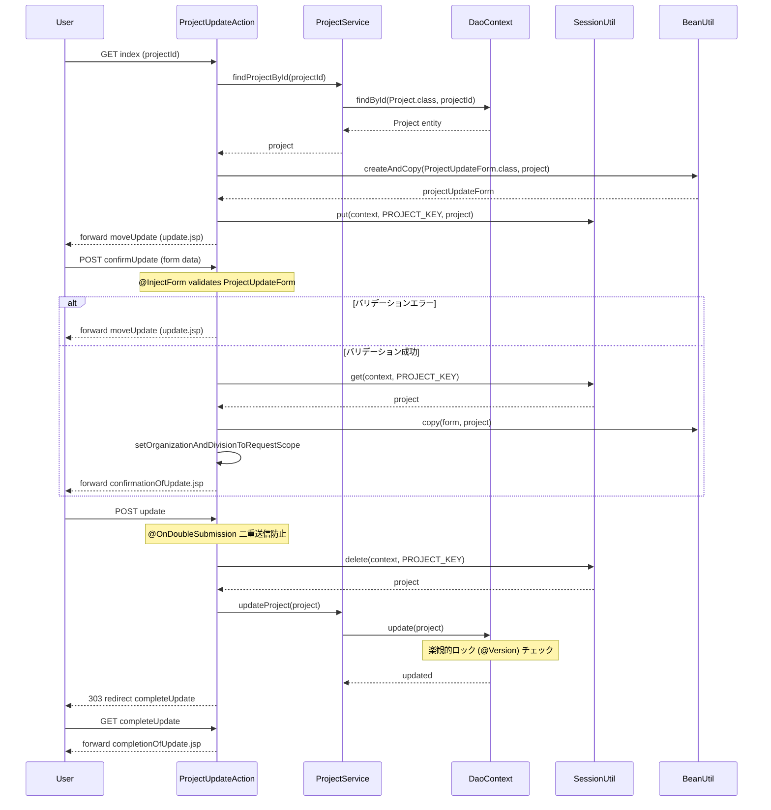

# Code Analysis: ProjectUpdateAction

**Generated**: 2026-03-13 18:06:41
**Target**: プロジェクト更新処理アクション
**Modules**: proman-web
**Analysis Duration**: approx. 3m 2s

---

## Overview

`ProjectUpdateAction` はNablarch 5のWebアプリケーションにおけるプロジェクト更新機能を担うアクションクラス。詳細画面からの更新画面表示、入力値バリデーション、確認画面表示、DB更新、完了画面表示という一連のCRUD更新フローを実装する。セッションストア（`SessionUtil`）を用いて楽観的ロック対応エンティティを画面遷移間で保持し、`@OnDoubleSubmission` による二重送信防止を行う。

---

## Architecture

### Dependency Graph

```mermaid
classDiagram
    class ProjectUpdateAction
    class ProjectUpdateInitialForm {
        <<Form>>
    }
    class ProjectUpdateForm {
        <<Form>>
    }
    class ProjectService
    class Project {
        <<Entity>>
    }
    class Organization {
        <<Entity>>
    }
    class DaoContext {
        <<Nablarch>>
    }
    class SessionUtil {
        <<Nablarch>>
    }
    class BeanUtil {
        <<Nablarch>>
    }
    class ExecutionContext {
        <<Nablarch>>
    }
    class HttpRequest {
        <<Nablarch>>
    }
    class HttpResponse {
        <<Nablarch>>
    }

    ProjectUpdateAction ..> ProjectUpdateInitialForm : validates
    ProjectUpdateAction ..> ProjectUpdateForm : validates
    ProjectUpdateAction ..> ProjectService : delegates to
    ProjectUpdateAction ..> SessionUtil : stores/retrieves
    ProjectUpdateAction ..> BeanUtil : copies
    ProjectUpdateAction ..> ExecutionContext : sets scope vars
    ProjectUpdateAction ..> HttpRequest : reads
    ProjectUpdateAction ..> HttpResponse : creates
    ProjectService ..> DaoContext : queries/updates
    ProjectService ..> Project : persists
    ProjectService ..> Organization : queries
    ProjectUpdateForm ..|> Serializable : implements
    ProjectUpdateInitialForm ..|> Serializable : implements
```



**Note**: This diagram uses Mermaid `classDiagram` syntax to show class names and their relationships. Use `--|>` for inheritance (extends/implements) and `..>` for dependencies (uses/creates).

### Component Summary

| Component | Role | Type | Dependencies |
|-----------|------|------|--------------|
| ProjectUpdateAction | プロジェクト更新フロー制御 | Action | ProjectUpdateInitialForm, ProjectUpdateForm, ProjectService, SessionUtil, BeanUtil, ExecutionContext |
| ProjectUpdateInitialForm | 詳細→更新画面遷移時のプロジェクトID受付 | Form | なし |
| ProjectUpdateForm | 更新入力値受付・バリデーション | Form | DateRelationUtil |
| ProjectService | DB操作ファサード（検索・更新） | Service | DaoContext, Project, Organization |

---

## Flow

### Processing Flow

更新フローは5ステップで構成される。

1. **更新画面表示 (`index`)**: 詳細画面からプロジェクトIDを受け取り、DBから対象プロジェクトを取得。フォームに変換してリクエストスコープに設定し、セッションストアにエンティティを保存（楽観的ロック用）。

2. **確認画面表示 (`confirmUpdate`)**: 入力値を `@InjectForm` でバリデーション。エラー時は更新画面に再表示（`@OnError`）。バリデーション成功後、セッションのエンティティに `BeanUtil.copy` で入力値を反映し確認画面へ遷移。

3. **更新実行 (`update`)**: `@OnDoubleSubmission` で二重送信防止。セッションからエンティティを取得・削除し、`ProjectService#updateProject` でDB更新。完了画面へ303リダイレクト（PRGパターン）。

4. **完了画面表示 (`completeUpdate`)**: 完了JSPをフォーワードして返す。

5. **入力画面へ戻る (`backToEnterUpdate`)**: 確認画面から入力画面へ戻る際にセッションのエンティティをフォームに再変換して表示。

### Sequence Diagram



---

## Components

### ProjectUpdateAction

**ファイル**: [ProjectUpdateAction.java](../../.lw/nab-official/v5/nablarch-system-development-guide/Sample_Project/Source_Code/proman-project/proman-web/src/main/java/com/nablarch/example/proman/web/project/ProjectUpdateAction.java)

**役割**: プロジェクト更新機能の全画面遷移フローを制御するアクションクラス。

**主要メソッド**:

- `index(HttpRequest, ExecutionContext)` (L35-43): `@InjectForm(ProjectUpdateInitialForm)` でプロジェクトIDを受け取り、DBから取得したエンティティをセッションに保存し更新画面を表示。
- `confirmUpdate(HttpRequest, ExecutionContext)` (L54-62): `@InjectForm(ProjectUpdateForm)` + `@OnError` でバリデーション。BeanUtilでセッションのエンティティに入力値をコピーし確認画面へ。
- `update(HttpRequest, ExecutionContext)` (L72-77): `@OnDoubleSubmission` でセッション取得・削除後にDB更新、303リダイレクト。
- `backToEnterUpdate(HttpRequest, ExecutionContext)` (L97-102): 確認→入力戻り時にセッションのエンティティをフォームに再変換。
- `buildFormFromEntity(Project, ProjectService)` (L111-125): エンティティからフォームを構築。日付フォーマット変換と組織情報設定を行うプライベートヘルパー。

**依存**:
- `ProjectUpdateInitialForm`: 詳細→更新遷移時のID受付
- `ProjectUpdateForm`: 更新入力値受付
- `ProjectService`: DBアクセスのファサード
- `SessionUtil`: 画面間エンティティ保持（楽観的ロック）
- `BeanUtil`: フォーム↔エンティティ変換

---

### ProjectUpdateForm

**ファイル**: [ProjectUpdateForm.java](../../.lw/nab-official/v5/nablarch-system-development-guide/Sample_Project/Source_Code/proman-project/proman-web/src/main/java/com/nablarch/example/proman/web/project/ProjectUpdateForm.java)

**役割**: 更新入力値を受け取るフォームクラス。Bean Validationアノテーションでバリデーションルールを定義。

**主要メソッド**:
- `isValidProjectPeriod()` (L329-331): `@AssertTrue` で開始日・終了日の整合性をチェック。`DateRelationUtil` で判定。

**依存**: `DateRelationUtil` (日付比較ユーティリティ)

---

### ProjectUpdateInitialForm

**ファイル**: [ProjectUpdateInitialForm.java](../../.lw/nab-official/v5/nablarch-system-development-guide/Sample_Project/Source_Code/proman-project/proman-web/src/main/java/com/nablarch/example/proman/web/project/ProjectUpdateInitialForm.java)

**役割**: 詳細画面から更新画面への遷移時にプロジェクトIDのみを受け取るシンプルなフォーム。

---

### ProjectService

**ファイル**: [ProjectService.java](../../.lw/nab-official/v5/nablarch-system-development-guide/Sample_Project/Source_Code/proman-project/proman-web/src/main/java/com/nablarch/example/proman/web/project/ProjectService.java)

**役割**: `DaoContext`（UniversalDao）を使ったDB操作をカプセル化するサービスクラス。

**主要メソッド**:
- `findProjectById(Integer)` (L124-126): プロジェクトを主キーで1件取得。`DaoContext#findById` を使用。
- `updateProject(Project)` (L89-91): プロジェクトエンティティをDB更新。楽観的ロックは `@Version` フィールドで自動制御。
- `findOrganizationById(Integer)` (L70-73): 組織を主キーで取得。
- `findAllDivision()` / `findAllDepartment()` (L50-61): SQLファイルで事業部・部門の一覧取得。

**依存**: `DaoContext` (Nablarch UniversalDao), `Project`, `Organization` エンティティ

---

## Nablarch Framework Usage

### SessionUtil

**クラス**: `nablarch.common.web.session.SessionUtil`

**説明**: Nablarchのセッションストアに対してオブジェクトの保存・取得・削除を行うユーティリティクラス。

**使用方法**:
```java
// 保存
SessionUtil.put(context, "project", project);
// 取得（削除なし）
Project project = SessionUtil.get(context, PROJECT_KEY);
// 取得と同時に削除
Project project = SessionUtil.delete(context, PROJECT_KEY);
```

**重要ポイント**:
- ✅ **フォームをセッションに格納しない**: バリデーション済みフォームを直接保存せず、エンティティに変換してから保存すること（`BeanUtil.createAndCopy` を使用）
- ✅ **更新後はセッション削除**: `update` メソッドでは `SessionUtil.delete` を使用し、処理後に不要なセッションデータを削除する
- 💡 **楽観的ロック対応**: 編集開始時にエンティティをセッションに保存し、`@Version` フィールドを保持することで楽観的ロックが機能する
- ⚠️ **セッションキーの一意性**: セッションキー（例: `PROJECT_KEY = "projectUpdateActionProject"`）は機能単位でユニークにすること

**このコードでの使い方**:
- `index()` でDBから取得したエンティティを `SESSION_KEY` に保存（楽観的ロック対応）
- `confirmUpdate()` で `SessionUtil.get` によりエンティティを取得・更新
- `update()` で `SessionUtil.delete` によりエンティティを取得し同時に削除

**詳細**: [Web Application Getting Started Project Update](../../.claude/skills/nabledge-5/docs/processing-pattern/web-application/web-application-getting-started-project-update.md)

---

### @InjectForm / @OnError

**クラス**: `nablarch.common.web.interceptor.InjectForm` / `nablarch.fw.web.interceptor.OnError`

**説明**: `@InjectForm` はHTTPリクエストのパラメータをフォームクラスにバインドしBean Validationを実行するインターセプター。`@OnError` はバリデーション例外（`ApplicationException`）発生時の遷移先を指定する。

**使用方法**:
```java
@InjectForm(form = ProjectUpdateForm.class, prefix = "form")
@OnError(type = ApplicationException.class, path = "forward:///app/project/moveUpdate")
public HttpResponse confirmUpdate(HttpRequest request, ExecutionContext context) {
    ProjectUpdateForm form = context.getRequestScopedVar("form");
    // バリデーション済みフォームをリクエストスコープから取得
}
```

**重要ポイント**:
- ✅ **prefixの指定**: JSPが `form.xxx` 形式でパラメータを送信する場合、`prefix = "form"` を指定する
- ✅ **リクエストスコープからの取得**: バリデーション後のフォームは `context.getRequestScopedVar("form")` で取得する
- ⚠️ **`@OnError`の遷移先**: エラー時に組織プルダウン等を再設定する必要がある場合は、入力画面の表示処理へフォーワードすること（`forward:///app/project/moveUpdate`）
- 💡 **Bean Validationとの連携**: フォームの `@Required`, `@Domain`, `@AssertTrue` アノテーションが自動実行される

**このコードでの使い方**:
- `index()`: `@InjectForm(ProjectUpdateInitialForm.class)` でプロジェクトIDを受付（prefixなし）
- `confirmUpdate()`: `@InjectForm(ProjectUpdateForm.class, prefix = "form")` + `@OnError` で入力値バリデーション

**詳細**: [Web Application Client Create2](../../.claude/skills/nabledge-5/docs/processing-pattern/web-application/web-application-client_create2.md)

---

### @OnDoubleSubmission

**クラス**: `nablarch.common.web.token.OnDoubleSubmission`

**説明**: 業務アクションメソッドへの二重サブミット（二重送信）を防止するインターセプター。サーバサイドのトークンチェックにより、同一リクエストの多重実行を防ぐ。

**使用方法**:
```java
@OnDoubleSubmission
public HttpResponse update(HttpRequest request, ExecutionContext context) {
    // 二重送信された場合はエラーページへ遷移
}
```

**重要ポイント**:
- ✅ **JSPとセットで使用**: JSPの `<n:form useToken="true">` タグと組み合わせてトークンを生成・検証する
- ✅ **更新・登録・削除に付与**: 副作用のある処理（DB変更）には必ず付与すること
- ⚠️ **クライアントサイドだけでは不十分**: JSPの `allowDoubleSubmission="false"` はJavaScript無効時に機能しないため、サーバサイドの制御が必須
- 💡 **PRGパターンとの組み合わせ**: `@OnDoubleSubmission` + 303リダイレクトでブラウザ更新による再実行も防止できる

**このコードでの使い方**:
- `update()` メソッドに付与し、DB更新処理の二重実行を防止する

**詳細**: [Web Application Client Create4](../../.claude/skills/nabledge-5/docs/processing-pattern/web-application/web-application-client_create4.md)

---

### BeanUtil

**クラス**: `nablarch.core.beans.BeanUtil`

**説明**: JavaBeansのプロパティをコピー・変換するユーティリティクラス。フォーム↔エンティティ間のデータ変換に使用する。

**使用方法**:
```java
// フォームからエンティティへコピー（新規作成）
ProjectUpdateForm form = BeanUtil.createAndCopy(ProjectUpdateForm.class, project);
// フォームの内容をエンティティへコピー（既存オブジェクトに上書き）
BeanUtil.copy(form, project);
```

**重要ポイント**:
- ✅ **`createAndCopy`**: 新しいインスタンスを生成しながらコピー（エンティティ→フォーム変換）
- ✅ **`copy`**: 既存インスタンスにコピー（フォーム→エンティティ更新）
- ⚠️ **型の不一致**: フォームは全フィールドString型、エンティティは型付き。自動変換されるが、変換できない型は要注意
- 💡 **セッション保存前の変換**: フォームをそのままセッションに保存せず、エンティティに変換してから保存するパターンで使用

**このコードでの使い方**:
- `buildFormFromEntity()` で `BeanUtil.createAndCopy(ProjectUpdateForm.class, project)` によりエンティティをフォームに変換
- `confirmUpdate()` で `BeanUtil.copy(form, project)` により入力値をセッションのエンティティに反映

---

## References

### Source Files

- [ProjectUpdateAction.java (.lw/nab-official/v5/nablarch-system-development-guide/en/Sample_Project/Source_Code/proman-project/proman-web/src/main/java/com/nablarch/example/proman/web/project)](../../.lw/nab-official/v5/nablarch-system-development-guide/en/Sample_Project/Source_Code/proman-project/proman-web/src/main/java/com/nablarch/example/proman/web/project/ProjectUpdateAction.java) - ProjectUpdateAction
- [ProjectUpdateAction.java (.lw/nab-official/v5/nablarch-system-development-guide/Sample_Project/Source_Code/proman-project/proman-web/src/main/java/com/nablarch/example/proman/web/project)](../../.lw/nab-official/v5/nablarch-system-development-guide/Sample_Project/Source_Code/proman-project/proman-web/src/main/java/com/nablarch/example/proman/web/project/ProjectUpdateAction.java) - ProjectUpdateAction
- [ProjectUpdateAction.java (.lw/nab-official/v6/nablarch-system-development-guide/en/Sample_Project/Source_Code/proman-project/proman-web/src/main/java/com/nablarch/example/proman/web/project)](../../.lw/nab-official/v6/nablarch-system-development-guide/en/Sample_Project/Source_Code/proman-project/proman-web/src/main/java/com/nablarch/example/proman/web/project/ProjectUpdateAction.java) - ProjectUpdateAction
- [ProjectUpdateAction.java (.lw/nab-official/v6/nablarch-system-development-guide/Sample_Project/Source_Code/proman-project/proman-web/src/main/java/com/nablarch/example/proman/web/project)](../../.lw/nab-official/v6/nablarch-system-development-guide/Sample_Project/Source_Code/proman-project/proman-web/src/main/java/com/nablarch/example/proman/web/project/ProjectUpdateAction.java) - ProjectUpdateAction
- [ProjectUpdateForm.java (.lw/nab-official/v5/nablarch-system-development-guide/en/Sample_Project/Source_Code/proman-project/proman-web/src/main/java/com/nablarch/example/proman/web/project)](../../.lw/nab-official/v5/nablarch-system-development-guide/en/Sample_Project/Source_Code/proman-project/proman-web/src/main/java/com/nablarch/example/proman/web/project/ProjectUpdateForm.java) - ProjectUpdateForm
- [ProjectUpdateForm.java (.lw/nab-official/v5/nablarch-system-development-guide/Sample_Project/Source_Code/proman-project/proman-web/src/main/java/com/nablarch/example/proman/web/project)](../../.lw/nab-official/v5/nablarch-system-development-guide/Sample_Project/Source_Code/proman-project/proman-web/src/main/java/com/nablarch/example/proman/web/project/ProjectUpdateForm.java) - ProjectUpdateForm
- [ProjectUpdateForm.java (.lw/nab-official/v6/nablarch-system-development-guide/en/Sample_Project/Source_Code/proman-project/proman-web/src/main/java/com/nablarch/example/proman/web/project)](../../.lw/nab-official/v6/nablarch-system-development-guide/en/Sample_Project/Source_Code/proman-project/proman-web/src/main/java/com/nablarch/example/proman/web/project/ProjectUpdateForm.java) - ProjectUpdateForm
- [ProjectUpdateForm.java (.lw/nab-official/v6/nablarch-system-development-guide/Sample_Project/Source_Code/proman-project/proman-web/src/main/java/com/nablarch/example/proman/web/project)](../../.lw/nab-official/v6/nablarch-system-development-guide/Sample_Project/Source_Code/proman-project/proman-web/src/main/java/com/nablarch/example/proman/web/project/ProjectUpdateForm.java) - ProjectUpdateForm
- [ProjectUpdateInitialForm.java (.lw/nab-official/v5/nablarch-system-development-guide/en/Sample_Project/Source_Code/proman-project/proman-web/src/main/java/com/nablarch/example/proman/web/project)](../../.lw/nab-official/v5/nablarch-system-development-guide/en/Sample_Project/Source_Code/proman-project/proman-web/src/main/java/com/nablarch/example/proman/web/project/ProjectUpdateInitialForm.java) - ProjectUpdateInitialForm
- [ProjectUpdateInitialForm.java (.lw/nab-official/v5/nablarch-system-development-guide/Sample_Project/Source_Code/proman-project/proman-web/src/main/java/com/nablarch/example/proman/web/project)](../../.lw/nab-official/v5/nablarch-system-development-guide/Sample_Project/Source_Code/proman-project/proman-web/src/main/java/com/nablarch/example/proman/web/project/ProjectUpdateInitialForm.java) - ProjectUpdateInitialForm
- [ProjectUpdateInitialForm.java (.lw/nab-official/v6/nablarch-system-development-guide/en/Sample_Project/Source_Code/proman-project/proman-web/src/main/java/com/nablarch/example/proman/web/project)](../../.lw/nab-official/v6/nablarch-system-development-guide/en/Sample_Project/Source_Code/proman-project/proman-web/src/main/java/com/nablarch/example/proman/web/project/ProjectUpdateInitialForm.java) - ProjectUpdateInitialForm
- [ProjectUpdateInitialForm.java (.lw/nab-official/v6/nablarch-system-development-guide/Sample_Project/Source_Code/proman-project/proman-web/src/main/java/com/nablarch/example/proman/web/project)](../../.lw/nab-official/v6/nablarch-system-development-guide/Sample_Project/Source_Code/proman-project/proman-web/src/main/java/com/nablarch/example/proman/web/project/ProjectUpdateInitialForm.java) - ProjectUpdateInitialForm
- [ProjectService.java (.lw/nab-official/v5/nablarch-system-development-guide/en/Sample_Project/Source_Code/proman-project/proman-web/src/main/java/com/nablarch/example/proman/web/project)](../../.lw/nab-official/v5/nablarch-system-development-guide/en/Sample_Project/Source_Code/proman-project/proman-web/src/main/java/com/nablarch/example/proman/web/project/ProjectService.java) - ProjectService
- [ProjectService.java (.lw/nab-official/v5/nablarch-system-development-guide/Sample_Project/Source_Code/proman-project/proman-web/src/main/java/com/nablarch/example/proman/web/project)](../../.lw/nab-official/v5/nablarch-system-development-guide/Sample_Project/Source_Code/proman-project/proman-web/src/main/java/com/nablarch/example/proman/web/project/ProjectService.java) - ProjectService
- [ProjectService.java (.lw/nab-official/v6/nablarch-system-development-guide/en/Sample_Project/Source_Code/proman-project/proman-web/src/main/java/com/nablarch/example/proman/web/project)](../../.lw/nab-official/v6/nablarch-system-development-guide/en/Sample_Project/Source_Code/proman-project/proman-web/src/main/java/com/nablarch/example/proman/web/project/ProjectService.java) - ProjectService
- [ProjectService.java (.lw/nab-official/v6/nablarch-system-development-guide/Sample_Project/Source_Code/proman-project/proman-web/src/main/java/com/nablarch/example/proman/web/project)](../../.lw/nab-official/v6/nablarch-system-development-guide/Sample_Project/Source_Code/proman-project/proman-web/src/main/java/com/nablarch/example/proman/web/project/ProjectService.java) - ProjectService

### Knowledge Base (Nabledge-5)

- [Web Application Getting Started Project Update](../../.claude/skills/nabledge-5/docs/processing-pattern/web-application/web-application-getting-started-project-update.md)
- [Web Application Client_create2](../../.claude/skills/nabledge-5/docs/processing-pattern/web-application/web-application-client_create2.md)
- [Web Application Client_create4](../../.claude/skills/nabledge-5/docs/processing-pattern/web-application/web-application-client_create4.md)

### Official Documentation


- [BeanUtil](https://nablarch.github.io/docs/LATEST/javadoc/nablarch/core/beans/BeanUtil.html)
- [Client Create2](https://nablarch.github.io/docs/LATEST/doc/application_framework/application_framework/web/getting_started/client_create/client_create2.html)
- [Client Create4](https://nablarch.github.io/docs/LATEST/doc/application_framework/application_framework/web/getting_started/client_create/client_create4.html)
- [Index](https://nablarch.github.io/docs/LATEST/doc/application_framework/application_framework/web/getting_started/project_update/index.html)
- [InjectForm](https://nablarch.github.io/docs/LATEST/javadoc/nablarch/common/web/interceptor/InjectForm.html)
- [NoDataException](https://nablarch.github.io/docs/LATEST/javadoc/nablarch/common/dao/NoDataException.html)
- [OnDoubleSubmission](https://nablarch.github.io/docs/LATEST/javadoc/nablarch/common/web/token/OnDoubleSubmission.html)
- [OnError](https://nablarch.github.io/docs/LATEST/javadoc/nablarch/fw/web/interceptor/OnError.html)
- [Required](https://nablarch.github.io/docs/LATEST/javadoc/nablarch/core/validation/ee/Required.html)
- [ResourceLocator](https://nablarch.github.io/docs/LATEST/javadoc/nablarch/fw/web/ResourceLocator.html)
- [SessionUtil](https://nablarch.github.io/docs/LATEST/javadoc/nablarch/common/web/session/SessionUtil.html)
- [UniversalDao](https://nablarch.github.io/docs/LATEST/javadoc/nablarch/common/dao/UniversalDao.html)

---

**Note**: This documentation was generated by the code-analysis workflow of the nabledge-5 skill.
