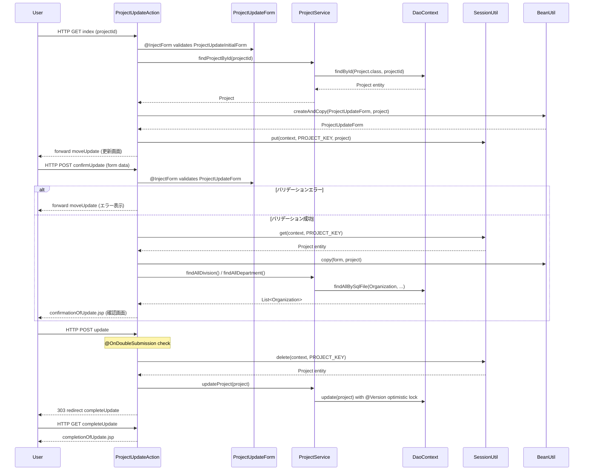

# Code Analysis: ProjectUpdateAction

**Generated**: 2026-03-13 17:27:33
**Target**: プロジェクト更新機能（表示・バリデーション・確認・更新・完了）
**Modules**: proman-web
**Analysis Duration**: approx. 2m 59s

---

## Overview

`ProjectUpdateAction` は proman-web モジュールのプロジェクト更新機能を担うアクションクラスです。詳細画面からの遷移を受け付け、更新画面の表示 → 入力バリデーション → 確認画面表示 → DB更新 → 完了画面表示という一連のフローを提供します。

主要な設計ポイント:
- `@InjectForm` による Bean Validation の自動実行
- セッションストア（`SessionUtil`）を使ったページ間データ受け渡しと楽観的ロック対応
- `@OnDoubleSubmission` による二重サブミット防止
- `BeanUtil` を使ったフォーム↔エンティティ変換

---

## Architecture

### Dependency Graph

```mermaid
classDiagram
    class ProjectUpdateAction
    class ProjectUpdateInitialForm {
        <<Form>>
    }
    class ProjectUpdateForm {
        <<Form>>
    }
    class ProjectService
    class Project {
        <<Entity>>
    }
    class Organization {
        <<Entity>>
    }
    class DaoContext {
        <<Nablarch>>
    }
    class SessionUtil {
        <<Nablarch>>
    }
    class BeanUtil {
        <<Nablarch>>
    }
    class ExecutionContext {
        <<Nablarch>>
    }
    class InjectForm {
        <<Nablarch>>
    }
    class OnDoubleSubmission {
        <<Nablarch>>
    }
    class DateUtil {
        <<Nablarch>>
    }

    ProjectUpdateAction ..> ProjectUpdateInitialForm : validates
    ProjectUpdateAction ..> ProjectUpdateForm : validates
    ProjectUpdateAction ..> ProjectService : delegates to
    ProjectUpdateAction ..> SessionUtil : stores/retrieves
    ProjectUpdateAction ..> BeanUtil : copies
    ProjectUpdateAction ..> ExecutionContext : invokes
    ProjectUpdateAction ..> InjectForm : uses
    ProjectUpdateAction ..> OnDoubleSubmission : uses
    ProjectService ..> DaoContext : queries/persists
    ProjectService ..> Project : queries/persists
    ProjectService ..> Organization : queries
    ProjectUpdateForm ..|> Serializable
    ProjectUpdateInitialForm ..|> Serializable
    ProjectUpdateAction ..> DateUtil : formats
```



**Note**: This diagram uses Mermaid `classDiagram` syntax to show class names and their relationships. Use `--|>` for inheritance (extends/implements) and `..>` for dependencies (uses/creates).

### Component Summary

| Component | Role | Type | Dependencies |
|-----------|------|------|--------------|
| ProjectUpdateAction | プロジェクト更新の全画面遷移を制御 | Action | ProjectUpdateInitialForm, ProjectUpdateForm, ProjectService, SessionUtil, BeanUtil |
| ProjectUpdateInitialForm | 詳細画面からの遷移パラメータ（プロジェクトID）受付 | Form | なし |
| ProjectUpdateForm | 更新画面の入力値受付・バリデーション | Form | DateRelationUtil |
| ProjectService | DB操作ロジックをカプセル化 | Service | DaoContext (UniversalDao) |
| Project | プロジェクトエンティティ（楽観的ロック対応） | Entity | なし |
| Organization | 組織エンティティ（事業部・部門） | Entity | なし |

---

## Flow

### Processing Flow

プロジェクト更新は以下の5ステップで構成されます。

1. **更新画面表示 (`index`)**: 詳細画面からプロジェクトIDを受け取り、DBからプロジェクトを検索。エンティティをセッションストアに保存し、フォームに変換して更新画面を表示する。
2. **更新確認画面表示 (`confirmUpdate`)**: 入力値をバリデーション後、セッション中のエンティティにコピーして確認画面へ遷移。エラー時は更新画面に戻る。
3. **更新処理 (`update`)**: `@OnDoubleSubmission` で二重サブミットを防止しながら、セッションからエンティティを取得してDB更新（楽観的ロック付き）。完了後は303リダイレクト。
4. **更新完了画面 (`completeUpdate`)**: 完了画面JSPを表示するのみ。
5. **入力画面へ戻る (`backToEnterUpdate`)**: セッションのエンティティをフォームに変換してリクエストスコープに戻す。

### Sequence Diagram



---

## Components

### ProjectUpdateAction

**ファイル**: [ProjectUpdateAction.java]( ../../.lw/nab-official/v5/nablarch-system-development-guide/Sample_Project/Source_Code/proman-project/proman-web/src/main/java/com/nablarch/example/proman/web/project/ProjectUpdateAction.java)

**役割**: プロジェクト更新機能の全画面遷移・ビジネスロジック制御

**主要メソッド**:
- `index(HttpRequest, ExecutionContext)` (L35-43): 詳細画面からの遷移を受け、DBからプロジェクトを取得しセッションに保存。更新画面を表示する
- `confirmUpdate(HttpRequest, ExecutionContext)` (L54-62): バリデーション後にセッションのエンティティへフォームをコピーし確認画面を表示
- `update(HttpRequest, ExecutionContext)` (L72-77): 二重サブミット防止付きでDB更新。完了後303リダイレクト
- `backToEnterUpdate(HttpRequest, ExecutionContext)` (L97-102): セッションのエンティティをフォームに変換して更新画面に戻す
- `buildFormFromEntity(Project, ProjectService)` (L111-125): エンティティからフォームを生成し、日付フォーマットと組織情報を設定する

**依存コンポーネント**: ProjectUpdateInitialForm, ProjectUpdateForm, ProjectService, SessionUtil, BeanUtil, DateUtil, ExecutionContext

### ProjectUpdateForm

**ファイル**: [ProjectUpdateForm.java](../../.lw/nab-official/v5/nablarch-system-development-guide/Sample_Project/Source_Code/proman-project/proman-web/src/main/java/com/nablarch/example/proman/web/project/ProjectUpdateForm.java)

**役割**: 更新画面の入力値受付とBean Validationルール定義

**主要項目**:
- `@Required @Domain("projectName")` projectName (L26-27)
- `@Required @Domain("date")` projectStartDate / projectEndDate (L47-55)
- `@Required @Domain("organizationId")` divisionId / organizationId (L61-69)
- `isValidProjectPeriod()` (L329-331): `@AssertTrue` で開始日≦終了日の期間バリデーション

**依存コンポーネント**: DateRelationUtil (期間バリデーション)

### ProjectUpdateInitialForm

**ファイル**: [ProjectUpdateInitialForm.java](../../.lw/nab-official/v5/nablarch-system-development-guide/Sample_Project/Source_Code/proman-project/proman-web/src/main/java/com/nablarch/example/proman/web/project/ProjectUpdateInitialForm.java)

**役割**: 詳細画面から更新画面への遷移パラメータ（プロジェクトID）受付

**主要項目**:
- `@Required @Domain("projectId")` projectId (L14-15)

### ProjectService

**ファイル**: [ProjectService.java](../../.lw/nab-official/v5/nablarch-system-development-guide/Sample_Project/Source_Code/proman-project/proman-web/src/main/java/com/nablarch/example/proman/web/project/ProjectService.java)

**役割**: プロジェクト・組織のDB操作をカプセル化するサービスクラス

**主要メソッド**:
- `findProjectById(Integer)` (L124-126): UniversalDao.findById でプロジェクトを1件取得
- `updateProject(Project)` (L89-91): UniversalDao.update でプロジェクトを更新（楽観的ロック）
- `findAllDivision()` / `findAllDepartment()` (L50-61): SQLファイルを使って事業部・部門一覧を取得
- `findOrganizationById(Integer)` (L70-73): 組織IDで組織を1件取得

**依存コンポーネント**: DaoContext (UniversalDao), DaoFactory

---

## Nablarch Framework Usage

### @InjectForm

**クラス**: `nablarch.common.web.interceptor.InjectForm`

**説明**: 業務アクションメソッドへのインターセプタ。HTTPリクエストパラメータをフォームクラスにバインドし、Bean Validationを実行する

**使用方法**:
```java
@InjectForm(form = ProjectUpdateForm.class, prefix = "form")
@OnError(type = ApplicationException.class, path = "forward:///app/project/moveUpdate")
public HttpResponse confirmUpdate(HttpRequest request, ExecutionContext context) {
    ProjectUpdateForm form = context.getRequestScopedVar("form");
    // ...
}
```

**重要ポイント**:
- ✅ **`prefix` 属性**: リクエストパラメータのプレフィックスを指定。`prefix = "form"` なら `form.projectName` がバインドされる
- ⚠️ **`@OnError` とセット**: バリデーションエラー時の遷移先を `@OnError` で指定しないと例外がハンドルされない
- 💡 **バリデーション済みフォームの取得**: バリデーション後は `context.getRequestScopedVar("form")` で取得できる

**このコードでの使い方**:
- `index()` (L34): `ProjectUpdateInitialForm` でプロジェクトIDを受付
- `confirmUpdate()` (L52-53): `ProjectUpdateForm` で更新フォームをバリデーション、エラー時は更新画面に戻す

**詳細**: [Web Application Getting Started Project Update](../../.claude/skills/nabledge-5/docs/processing-pattern/web-application/web-application-getting-started-project-update.md)

---

### SessionUtil

**クラス**: `nablarch.common.web.session.SessionUtil`

**説明**: セッションストアへのデータ保存・取得・削除を行うユーティリティ。ページをまたいだデータ受け渡しや楽観的ロックのための編集前エンティティ保持に使用する

**使用方法**:
```java
// セッションへ保存
SessionUtil.put(context, "projectUpdateActionProject", project);
// セッションから取得
Project project = SessionUtil.get(context, "projectUpdateActionProject");
// セッションから取得して削除
Project project = SessionUtil.delete(context, "projectUpdateActionProject");
```

**重要ポイント**:
- ✅ **フォームはセッションに格納しない**: フォームの代わりにエンティティをセッションに保存する（`BeanUtil.copy(form, project)` で変換してから保存）
- ✅ **更新後は `delete` で取得**: `update()` では `SessionUtil.delete` を使ってセッションデータを削除しながら取得する
- ⚠️ **キーの一元管理**: キー名は定数 `PROJECT_KEY` で管理し、複数メソッドで一貫して使用する
- 💡 **楽観的ロック**: 編集開始時点のエンティティ（`@Version` プロパティ付き）をセッションに保存することで、別ユーザーによる変更を検知できる

**このコードでの使い方**:
- `index()` (L41): `project` を `PROJECT_KEY` でセッションに保存
- `confirmUpdate()` (L56): セッションからプロジェクトを取得し、フォームの値をコピー
- `update()` (L73): セッションから取得して削除、DB更新に使用
- `backToEnterUpdate()` (L98): セッションからプロジェクトを取得して更新フォームを再構築

**詳細**: [Web Application Getting Started Project Update](../../.claude/skills/nabledge-5/docs/processing-pattern/web-application/web-application-getting-started-project-update.md)

---

### @OnDoubleSubmission

**クラス**: `nablarch.common.web.token.OnDoubleSubmission`

**説明**: 二重サブミット防止インターセプタ。JSP側の `useToken="true"` と組み合わせてトークンベースの二重サブミット防止を実現する

**使用方法**:
```java
@OnDoubleSubmission
public HttpResponse update(HttpRequest request, ExecutionContext context) {
    // DB更新処理
}
```

**重要ポイント**:
- ✅ **DB変更メソッドに必須**: insert/update/deleteを行うメソッドには付与する
- ⚠️ **JSP側の設定も必要**: `<n:form useToken="true">` と `allowDoubleSubmission="false"` を JSP側でも設定する
- 💡 **エラー遷移先の設定**: デフォルト遷移先はコンポーネント設定で変更可能

**このコードでの使い方**:
- `update()` (L71): DB更新処理に付与し、ブラウザの二重クリックや再送信を防止

**詳細**: [Web Application Client Create4](../../.claude/skills/nabledge-5/docs/processing-pattern/web-application/web-application-client_create4.md)

---

### BeanUtil

**クラス**: `nablarch.core.beans.BeanUtil`

**説明**: JavaBeans間のプロパティコピーを行うユーティリティ。フォーム↔エンティティ変換に使用する

**使用方法**:
```java
// 新しいインスタンスを作成してコピー
ProjectUpdateForm form = BeanUtil.createAndCopy(ProjectUpdateForm.class, project);
// 既存インスタンスにコピー
BeanUtil.copy(form, project);
```

**重要ポイント**:
- ✅ **`createAndCopy` vs `copy`**: 新規インスタンスが必要な場合は `createAndCopy`、既存インスタンスへのコピーは `copy` を使い分ける
- ⚠️ **型変換**: 同名プロパティで型が異なる場合、暗黙の型変換が行われる。日付文字列フォーマットは別途 `DateUtil` で処理が必要
- 💡 **セッション保存前の変換**: フォームをそのままセッションに格納せず、エンティティに変換してから保存する

**このコードでの使い方**:
- `buildFormFromEntity()` (L112): `BeanUtil.createAndCopy` でエンティティをフォームに変換
- `confirmUpdate()` (L57): `BeanUtil.copy` でフォームの入力値をセッション中のエンティティにコピー

**詳細**: [Web Application Client Create3](../../.claude/skills/nabledge-5/docs/processing-pattern/web-application/web-application-client_create3.md)

---

### DaoContext (UniversalDao)

**クラス**: `nablarch.common.dao.DaoContext`

**説明**: Nablarchの汎用DAOインタフェース。エンティティのCRUD操作を提供する。`ProjectService` 内で `DaoFactory.create()` から取得して使用する

**使用方法**:
```java
// IDで1件取得
Project project = universalDao.findById(Project.class, projectId);
// SQLファイルで検索
List<Organization> list = universalDao.findAllBySqlFile(Organization.class, "FIND_ALL_DIVISION");
// 更新（楽観的ロック付き）
universalDao.update(project);
```

**重要ポイント**:
- ✅ **楽観的ロック**: エンティティに `@Version` アノテーションを付与することで自動的に楽観的ロックが有効になる。更新時にバージョン不一致で `OptimisticLockException` が発生する
- ⚠️ **`findById` の引数**: 複合主キーの場合は `Object[]` で渡す（`Organization` の場合）
- 💡 **SQLファイルの命名規則**: `findAllBySqlFile` に渡すSQLIDはSQLファイル内のキー名に対応する

**このコードでの使い方**:
- `ProjectService.findProjectById()` (L124-126): `findById` でプロジェクトを取得
- `ProjectService.updateProject()` (L89-91): `update` でプロジェクトを更新（楽観的ロック）
- `ProjectService.findAllDivision/Department()` (L50-61): SQLファイルで組織一覧を取得

**詳細**: [Web Application Getting Started Project Update](../../.claude/skills/nabledge-5/docs/processing-pattern/web-application/web-application-getting-started-project-update.md)

---

## References

### Source Files

- [ProjectUpdateAction.java (.lw/nab-official/v5/nablarch-system-development-guide/en/Sample_Project/Source_Code/proman-project/proman-web/src/main/java/com/nablarch/example/proman/web/project)](../../.lw/nab-official/v5/nablarch-system-development-guide/en/Sample_Project/Source_Code/proman-project/proman-web/src/main/java/com/nablarch/example/proman/web/project/ProjectUpdateAction.java) - ProjectUpdateAction
- [ProjectUpdateAction.java (.lw/nab-official/v5/nablarch-system-development-guide/Sample_Project/Source_Code/proman-project/proman-web/src/main/java/com/nablarch/example/proman/web/project)](../../.lw/nab-official/v5/nablarch-system-development-guide/Sample_Project/Source_Code/proman-project/proman-web/src/main/java/com/nablarch/example/proman/web/project/ProjectUpdateAction.java) - ProjectUpdateAction
- [ProjectUpdateAction.java (.lw/nab-official/v6/nablarch-system-development-guide/en/Sample_Project/Source_Code/proman-project/proman-web/src/main/java/com/nablarch/example/proman/web/project)](../../.lw/nab-official/v6/nablarch-system-development-guide/en/Sample_Project/Source_Code/proman-project/proman-web/src/main/java/com/nablarch/example/proman/web/project/ProjectUpdateAction.java) - ProjectUpdateAction
- [ProjectUpdateAction.java (.lw/nab-official/v6/nablarch-system-development-guide/Sample_Project/Source_Code/proman-project/proman-web/src/main/java/com/nablarch/example/proman/web/project)](../../.lw/nab-official/v6/nablarch-system-development-guide/Sample_Project/Source_Code/proman-project/proman-web/src/main/java/com/nablarch/example/proman/web/project/ProjectUpdateAction.java) - ProjectUpdateAction
- [ProjectUpdateForm.java (.lw/nab-official/v5/nablarch-system-development-guide/en/Sample_Project/Source_Code/proman-project/proman-web/src/main/java/com/nablarch/example/proman/web/project)](../../.lw/nab-official/v5/nablarch-system-development-guide/en/Sample_Project/Source_Code/proman-project/proman-web/src/main/java/com/nablarch/example/proman/web/project/ProjectUpdateForm.java) - ProjectUpdateForm
- [ProjectUpdateForm.java (.lw/nab-official/v5/nablarch-system-development-guide/Sample_Project/Source_Code/proman-project/proman-web/src/main/java/com/nablarch/example/proman/web/project)](../../.lw/nab-official/v5/nablarch-system-development-guide/Sample_Project/Source_Code/proman-project/proman-web/src/main/java/com/nablarch/example/proman/web/project/ProjectUpdateForm.java) - ProjectUpdateForm
- [ProjectUpdateForm.java (.lw/nab-official/v6/nablarch-system-development-guide/en/Sample_Project/Source_Code/proman-project/proman-web/src/main/java/com/nablarch/example/proman/web/project)](../../.lw/nab-official/v6/nablarch-system-development-guide/en/Sample_Project/Source_Code/proman-project/proman-web/src/main/java/com/nablarch/example/proman/web/project/ProjectUpdateForm.java) - ProjectUpdateForm
- [ProjectUpdateForm.java (.lw/nab-official/v6/nablarch-system-development-guide/Sample_Project/Source_Code/proman-project/proman-web/src/main/java/com/nablarch/example/proman/web/project)](../../.lw/nab-official/v6/nablarch-system-development-guide/Sample_Project/Source_Code/proman-project/proman-web/src/main/java/com/nablarch/example/proman/web/project/ProjectUpdateForm.java) - ProjectUpdateForm
- [ProjectUpdateInitialForm.java (.lw/nab-official/v5/nablarch-system-development-guide/en/Sample_Project/Source_Code/proman-project/proman-web/src/main/java/com/nablarch/example/proman/web/project)](../../.lw/nab-official/v5/nablarch-system-development-guide/en/Sample_Project/Source_Code/proman-project/proman-web/src/main/java/com/nablarch/example/proman/web/project/ProjectUpdateInitialForm.java) - ProjectUpdateInitialForm
- [ProjectUpdateInitialForm.java (.lw/nab-official/v5/nablarch-system-development-guide/Sample_Project/Source_Code/proman-project/proman-web/src/main/java/com/nablarch/example/proman/web/project)](../../.lw/nab-official/v5/nablarch-system-development-guide/Sample_Project/Source_Code/proman-project/proman-web/src/main/java/com/nablarch/example/proman/web/project/ProjectUpdateInitialForm.java) - ProjectUpdateInitialForm
- [ProjectUpdateInitialForm.java (.lw/nab-official/v6/nablarch-system-development-guide/en/Sample_Project/Source_Code/proman-project/proman-web/src/main/java/com/nablarch/example/proman/web/project)](../../.lw/nab-official/v6/nablarch-system-development-guide/en/Sample_Project/Source_Code/proman-project/proman-web/src/main/java/com/nablarch/example/proman/web/project/ProjectUpdateInitialForm.java) - ProjectUpdateInitialForm
- [ProjectUpdateInitialForm.java (.lw/nab-official/v6/nablarch-system-development-guide/Sample_Project/Source_Code/proman-project/proman-web/src/main/java/com/nablarch/example/proman/web/project)](../../.lw/nab-official/v6/nablarch-system-development-guide/Sample_Project/Source_Code/proman-project/proman-web/src/main/java/com/nablarch/example/proman/web/project/ProjectUpdateInitialForm.java) - ProjectUpdateInitialForm
- [ProjectService.java (.lw/nab-official/v5/nablarch-system-development-guide/en/Sample_Project/Source_Code/proman-project/proman-web/src/main/java/com/nablarch/example/proman/web/project)](../../.lw/nab-official/v5/nablarch-system-development-guide/en/Sample_Project/Source_Code/proman-project/proman-web/src/main/java/com/nablarch/example/proman/web/project/ProjectService.java) - ProjectService
- [ProjectService.java (.lw/nab-official/v5/nablarch-system-development-guide/Sample_Project/Source_Code/proman-project/proman-web/src/main/java/com/nablarch/example/proman/web/project)](../../.lw/nab-official/v5/nablarch-system-development-guide/Sample_Project/Source_Code/proman-project/proman-web/src/main/java/com/nablarch/example/proman/web/project/ProjectService.java) - ProjectService
- [ProjectService.java (.lw/nab-official/v6/nablarch-system-development-guide/en/Sample_Project/Source_Code/proman-project/proman-web/src/main/java/com/nablarch/example/proman/web/project)](../../.lw/nab-official/v6/nablarch-system-development-guide/en/Sample_Project/Source_Code/proman-project/proman-web/src/main/java/com/nablarch/example/proman/web/project/ProjectService.java) - ProjectService
- [ProjectService.java (.lw/nab-official/v6/nablarch-system-development-guide/Sample_Project/Source_Code/proman-project/proman-web/src/main/java/com/nablarch/example/proman/web/project)](../../.lw/nab-official/v6/nablarch-system-development-guide/Sample_Project/Source_Code/proman-project/proman-web/src/main/java/com/nablarch/example/proman/web/project/ProjectService.java) - ProjectService

### Knowledge Base (Nabledge-5)

- [Web Application Getting Started Project Update](../../.claude/skills/nabledge-5/docs/processing-pattern/web-application/web-application-getting-started-project-update.md)
- [Web Application Client_create2](../../.claude/skills/nabledge-5/docs/processing-pattern/web-application/web-application-client_create2.md)
- [Web Application Client_create3](../../.claude/skills/nabledge-5/docs/processing-pattern/web-application/web-application-client_create3.md)
- [Web Application Client_create4](../../.claude/skills/nabledge-5/docs/processing-pattern/web-application/web-application-client_create4.md)

### Official Documentation


- [BeanUtil](https://nablarch.github.io/docs/LATEST/javadoc/nablarch/core/beans/BeanUtil.html)
- [Client Create2](https://nablarch.github.io/docs/LATEST/doc/application_framework/application_framework/web/getting_started/client_create/client_create2.html)
- [Client Create3](https://nablarch.github.io/docs/LATEST/doc/application_framework/application_framework/web/getting_started/client_create/client_create3.html)
- [Client Create4](https://nablarch.github.io/docs/LATEST/doc/application_framework/application_framework/web/getting_started/client_create/client_create4.html)
- [Index](https://nablarch.github.io/docs/LATEST/doc/application_framework/application_framework/web/getting_started/project_update/index.html)
- [InjectForm](https://nablarch.github.io/docs/LATEST/javadoc/nablarch/common/web/interceptor/InjectForm.html)
- [NoDataException](https://nablarch.github.io/docs/LATEST/javadoc/nablarch/common/dao/NoDataException.html)
- [OnDoubleSubmission](https://nablarch.github.io/docs/LATEST/javadoc/nablarch/common/web/token/OnDoubleSubmission.html)
- [OnError](https://nablarch.github.io/docs/LATEST/javadoc/nablarch/fw/web/interceptor/OnError.html)
- [Required](https://nablarch.github.io/docs/LATEST/javadoc/nablarch/core/validation/ee/Required.html)
- [ResourceLocator](https://nablarch.github.io/docs/LATEST/javadoc/nablarch/fw/web/ResourceLocator.html)
- [SessionUtil](https://nablarch.github.io/docs/LATEST/javadoc/nablarch/common/web/session/SessionUtil.html)
- [UniversalDao](https://nablarch.github.io/docs/LATEST/javadoc/nablarch/common/dao/UniversalDao.html)

---

**Note**: This documentation was generated by the code-analysis workflow of the nabledge-5 skill.
