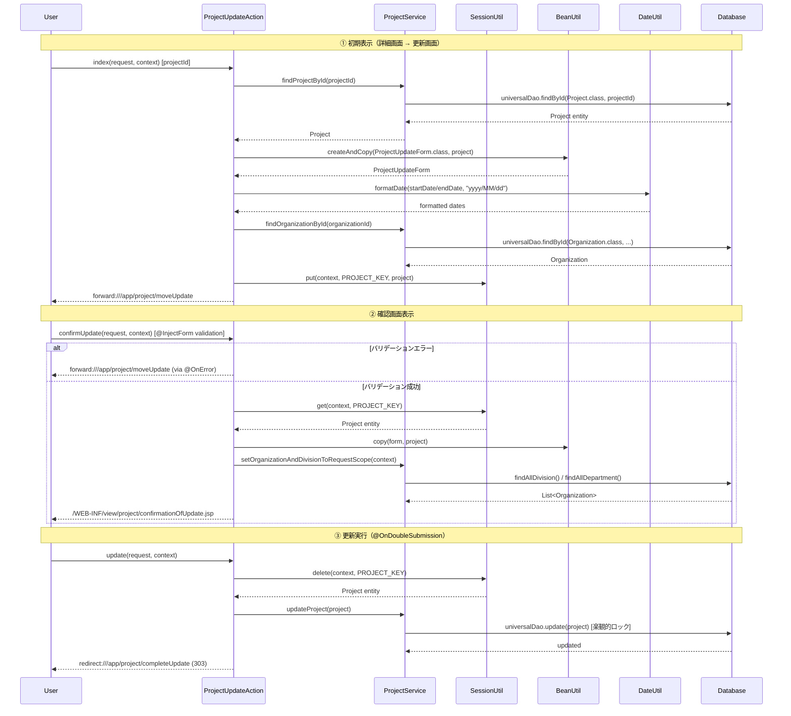

# Code Analysis: ProjectUpdateAction

**Generated**: 2026-03-13 17:32:13
**Target**: プロジェクト更新処理アクション
**Modules**: proman-web
**Analysis Duration**: approx. 3m 25s

---

## Overview

`ProjectUpdateAction` は、プロジェクト管理システムにおけるプロジェクト情報の更新を担当するWebアクションクラスです。更新処理は確認画面を挟む4ステップのフローで構成されています: 初期表示（詳細画面から遷移）→ 確認画面表示 → 更新実行 → 完了画面表示。また、確認画面から入力画面へ戻る操作も実装されています。

楽観的ロックによる排他制御、`@OnDoubleSubmission` による二重サブミット防止、セッションストアを利用したページ間データ受け渡しが主な特徴です。バリデーションは `@InjectForm` と Bean Validation によりフレームワークが自動実行します。

---

## Architecture

### Dependency Graph

```mermaid
classDiagram
    class ProjectUpdateAction
    class ProjectUpdateInitialForm {
        <<Form>>
    }
    class ProjectUpdateForm {
        <<Form>>
    }
    class ProjectService
    class Project {
        <<Entity>>
    }
    class Organization {
        <<Entity>>
    }
    class DaoContext {
        <<Nablarch>>
    }
    class ExecutionContext {
        <<Nablarch>>
    }
    class SessionUtil {
        <<Nablarch>>
    }
    class BeanUtil {
        <<Nablarch>>
    }
    class InjectForm {
        <<Nablarch>>
    }
    class OnDoubleSubmission {
        <<Nablarch>>
    }
    class OnError {
        <<Nablarch>>
    }
    class DateUtil {
        <<Nablarch>>
    }

    ProjectUpdateAction ..> ProjectUpdateInitialForm : validates
    ProjectUpdateAction ..> ProjectUpdateForm : validates
    ProjectUpdateAction ..> ProjectService : delegates to
    ProjectUpdateAction ..> SessionUtil : stores/retrieves
    ProjectUpdateAction ..> BeanUtil : copies
    ProjectUpdateAction ..> DateUtil : formats
    ProjectService ..> DaoContext : queries/persists
    ProjectService ..> Project : queries/persists
    ProjectService ..> Organization : queries
    ProjectUpdateInitialForm ..|> Serializable : uses
    ProjectUpdateForm ..|> Serializable : uses
```



**Note**: This diagram uses Mermaid `classDiagram` syntax to show class names and their relationships. Use `--|>` for inheritance (extends/implements) and `..>` for dependencies (uses/creates).

### Component Summary

| Component | Role | Type | Dependencies |
|-----------|------|------|--------------|
| ProjectUpdateAction | プロジェクト更新処理のアクション | Action | ProjectUpdateInitialForm, ProjectUpdateForm, ProjectService, SessionUtil, BeanUtil, DateUtil |
| ProjectUpdateInitialForm | 詳細画面からの遷移パラメータ受付フォーム | Form | なし |
| ProjectUpdateForm | 更新画面入力値受付・バリデーションフォーム | Form | DateRelationUtil |
| ProjectService | DB操作を委譲するサービスクラス | Service | DaoContext (UniversalDao), Project, Organization |
| Project | プロジェクトエンティティ（楽観的ロック対応） | Entity | なし |
| Organization | 組織（事業部/部門）エンティティ | Entity | なし |

---

## Flow

### Processing Flow

プロジェクト更新は以下の5ステップで構成されます。

1. **初期表示 (`index`)**: 詳細画面から projectId を受け取り、DBからプロジェクト情報を取得して更新フォームを構築する。プロジェクトエンティティをセッションストアに保存し、更新画面へフォワードする。
2. **確認画面表示 (`confirmUpdate`)**: 入力値をバリデーション後、セッションストアのエンティティに `BeanUtil.copy` でマージ。事業部/部門のプルダウンをリクエストスコープに設定し、確認画面を表示する。
3. **更新実行 (`update`)**: `@OnDoubleSubmission` で二重サブミット防止。セッションストアからエンティティを削除して取得し、`ProjectService.updateProject` でDB更新（楽観的ロック実行）。更新後はリダイレクトでブラウザ更新対策。
4. **完了画面表示 (`completeUpdate`)**: 完了画面JSPをレスポンスとして返す。
5. **入力画面へ戻る (`backToEnterUpdate`)**: セッションストアのエンティティからフォームを再構築し、更新画面へフォワードする。

バリデーションエラー時は `@OnError` により入力画面へ自動フォワードされます。

### Sequence Diagram



---

## Components

### ProjectUpdateAction

**ファイル**: [ProjectUpdateAction.java](../../.lw/nab-official/v5/nablarch-system-development-guide/Sample_Project/Source_Code/proman-project/proman-web/src/main/java/com/nablarch/example/proman/web/project/ProjectUpdateAction.java)

**役割**: プロジェクト更新処理のメインアクションクラス。更新の5ステップ（初期表示、確認、実行、完了、戻る）を管理する。

**主要メソッド**:

- `index` (L35-43): 詳細画面から遷移し、DBからプロジェクト情報を取得して更新フォームを構築。エンティティをセッションストアに保存する。`@InjectForm(form = ProjectUpdateInitialForm.class)` でパラメータバリデーションを実行。
- `confirmUpdate` (L52-62): 更新入力値のバリデーションと確認画面表示。`@InjectForm(form = ProjectUpdateForm.class, prefix = "form")` と `@OnError` を付与。バリデーション後、フォームをセッションのエンティティにマージする。
- `update` (L71-77): 実際のDB更新処理。`@OnDoubleSubmission` で二重サブミットを防止。セッションストアからエンティティを削除して取得し更新する。PRGパターンでリダイレクト。
- `buildFormFromEntity` (L111-125): プロジェクトエンティティから更新フォームを構築するプライベートメソッド。日付フォーマット変換と組織情報の設定を行う。

**依存関係**: ProjectUpdateInitialForm, ProjectUpdateForm, ProjectService, SessionUtil, BeanUtil, DateUtil, ExecutionContext

**実装の特徴**:
- セッションキー `"projectUpdateActionProject"` (L25) でエンティティを管理
- `update()` では `SessionUtil.delete` で取得と削除を同時に行い、完了後に不要なセッションデータを残さない
- 確認画面でもプルダウン再設定が必要なため、`confirmUpdate` 内で `setOrganizationAndDivisionToRequestScope` を呼び出す

---

### ProjectUpdateInitialForm

**ファイル**: [ProjectUpdateInitialForm.java](../../.lw/nab-official/v5/nablarch-system-development-guide/Sample_Project/Source_Code/proman-project/proman-web/src/main/java/com/nablarch/example/proman/web/project/ProjectUpdateInitialForm.java)

**役割**: 詳細画面からプロジェクト更新初期表示へ遷移する際のパラメータ受付フォーム。

**主要フィールド**:
- `projectId` (L15): `@Required` + `@Domain("projectId")` でバリデーション

**依存関係**: なし

---

### ProjectUpdateForm

**ファイル**: [ProjectUpdateForm.java](../../.lw/nab-official/v5/nablarch-system-development-guide/Sample_Project/Source_Code/proman-project/proman-web/src/main/java/com/nablarch/example/proman/web/project/ProjectUpdateForm.java)

**役割**: 更新画面の入力値を受け付け、Bean Validationでバリデーションするフォームクラス。

**主要フィールド**:
- `projectName` (L27): `@Required` + `@Domain("projectName")`
- `projectStartDate`, `projectEndDate` (L48, L55): `@Required` + `@Domain("date")`
- `divisionId`, `organizationId` (L62, L69): 事業部ID、部門ID

**主要メソッド**:
- `isValidProjectPeriod` (L329): `@AssertTrue` で開始日・終了日の整合性を検証。`DateRelationUtil.isValid` を使用。

**依存関係**: DateRelationUtil (proman-common)

---

### ProjectService

**ファイル**: [ProjectService.java](../../.lw/nab-official/v5/nablarch-system-development-guide/Sample_Project/Source_Code/proman-project/proman-web/src/main/java/com/nablarch/example/proman/web/project/ProjectService.java)

**役割**: DB操作を担当するサービスクラス。UniversalDao (DaoContext) を介してDB操作を実行する。

**主要メソッド**:
- `findProjectById` (L124-126): プロジェクトIDでプロジェクトを1件取得。`universalDao.findById` を使用。
- `updateProject` (L88-91): プロジェクトエンティティをDB更新。楽観的ロックはUniversalDaoが自動実行。
- `findOrganizationById` (L70-73): 組織IDで組織情報を1件取得。
- `findAllDivision`, `findAllDepartment` (L50, L59): 事業部・部門リストをSQLファイルで検索。

**依存関係**: DaoContext (UniversalDao), Project (Entity), Organization (Entity)

---

## Nablarch Framework Usage

### InjectForm / @InjectForm

**クラス**: `nablarch.common.web.interceptor.InjectForm`

**説明**: 業務アクションメソッドへのインターセプタ。HTTPリクエストパラメータをフォームクラスにバインドし、Bean Validationでバリデーションを実行する。バリデーション済みフォームをリクエストスコープに格納する。

**使用方法**:
```java
@InjectForm(form = ProjectUpdateForm.class, prefix = "form")
@OnError(type = ApplicationException.class, path = "forward:///app/project/moveUpdate")
public HttpResponse confirmUpdate(HttpRequest request, ExecutionContext context) {
    ProjectUpdateForm form = context.getRequestScopedVar("form");
    // ...
}
```

**重要ポイント**:
- ✅ **`prefix` 属性**: フォームのHTMLプレフィックスを指定する。`prefix = "form"` の場合、`form.projectName` というパラメータをバインドする
- ✅ **`@OnError` と組み合わせる**: バリデーションエラー時の遷移先を `@OnError` で指定する
- 💡 **リクエストスコープから取得**: バリデーション済みフォームは `context.getRequestScopedVar("form")` で取得できる
- ⚠️ **フォームはSerializable実装が必要**: `@InjectForm` でバリデーションを行うためフォームクラスは `Serializable` を実装する

**このコードでの使い方**:
- `index()` (L34): `ProjectUpdateInitialForm.class` でプロジェクトIDのバリデーション（prefixなし）
- `confirmUpdate()` (L52): `ProjectUpdateForm.class` で更新入力値のバリデーション（`prefix = "form"`）

**詳細**: [Web Application Client Create2](../../.claude/skills/nabledge-5/docs/processing-pattern/web-application/web-application-client_create2.md)

---

### SessionUtil

**クラス**: `nablarch.common.web.session.SessionUtil`

**説明**: セッションストアに対するデータの格納・取得・削除を行うユーティリティクラス。ページ間のデータ受け渡しに使用する。

**使用方法**:
```java
// 格納
SessionUtil.put(context, "projectUpdateActionProject", project);

// 取得
Project project = SessionUtil.get(context, "projectUpdateActionProject");

// 削除しながら取得
Project project = SessionUtil.delete(context, "projectUpdateActionProject");
```

**重要ポイント**:
- ✅ **フォームをセッションストアに格納しない**: フォームではなくエンティティ（またはBeanに変換後）をセッションストアに格納する
- 💡 **`delete` で取得と削除を同時に**: `SessionUtil.delete` は値を返しながら削除するため、更新完了後の不要データ残留を防げる
- ⚠️ **セッションキーの管理**: 複数アクションが同じセッションキーを使用しないよう、クラス固有のキー（`"projectUpdateActionProject"`）を使用する

**このコードでの使い方**:
- `index()` (L41): `SessionUtil.put` でプロジェクトエンティティをセッションに保存
- `confirmUpdate()` (L56): `SessionUtil.get` で更新対象エンティティを取得
- `update()` (L73): `SessionUtil.delete` でエンティティを取得しつつセッションから削除
- `backToEnterUpdate()` (L98): `SessionUtil.get` でエンティティを取得してフォームを再構築

**詳細**: [Web Application Client Create2](../../.claude/skills/nabledge-5/docs/processing-pattern/web-application/web-application-client_create2.md)

---

### OnDoubleSubmission / @OnDoubleSubmission

**クラス**: `nablarch.common.web.token.OnDoubleSubmission`

**説明**: 業務アクションメソッドへのインターセプタ。二重サブミット（フォームの二重送信）を防止する。サーバサイドのトークンチェックにより、同じリクエストが2回以上実行されるのを防ぐ。

**使用方法**:
```java
@OnDoubleSubmission
public HttpResponse update(HttpRequest request, ExecutionContext context) {
    // DB更新処理 - 二重実行を防止
}
```

**重要ポイント**:
- ✅ **DB更新・登録処理に必ず付与**: データを変更する処理には必ず付与して二重実行を防ぐ
- ✅ **JSP側にもトークン設定が必要**: フォームに `useToken="true"` を指定し、送信ボタンに `allowDoubleSubmission="false"` を設定する
- 💡 **サーバサイドとクライアントサイドの二重防止**: ブラウザのJavaScript無効時はサーバサイドのみで制御されるため、両方の設定が重要
- ⚠️ **二重サブミット時の遷移先**: デフォルトエラーページへ遷移する。カスタマイズはコンポーネント設定で行う

**このコードでの使い方**:
- `update()` (L71): DB更新処理に `@OnDoubleSubmission` を付与してプロジェクト更新の二重実行を防止

**詳細**: [Web Application Client Create4](../../.claude/skills/nabledge-5/docs/processing-pattern/web-application/web-application-client_create4.md)

---

### BeanUtil

**クラス**: `nablarch.core.beans.BeanUtil`

**説明**: JavaBeans間のプロパティコピーを行うユーティリティクラス。同名プロパティを自動的にコピーするため、フォームとエンティティ間のデータ変換に使用する。

**使用方法**:
```java
// フォームからエンティティへコピー
BeanUtil.copy(form, project);

// 新規インスタンスを作成してコピー
ProjectUpdateForm projectUpdateForm = BeanUtil.createAndCopy(ProjectUpdateForm.class, project);
```

**重要ポイント**:
- ✅ **同名プロパティのみコピー**: フォームとエンティティで同名のプロパティのみコピーされる。異なるプロパティ名は手動で設定が必要
- 💡 **`createAndCopy` と `copy` の使い分け**: 新規インスタンスを作成しながらコピーする場合は `createAndCopy`、既存インスタンスへのコピーは `copy` を使用
- ⚠️ **型変換の制限**: 型が異なるプロパティは自動変換されない場合がある（例：String → LocalDate など）

**このコードでの使い方**:
- `buildFormFromEntity()` (L112): `BeanUtil.createAndCopy` でエンティティからフォームを生成
- `confirmUpdate()` (L57): `BeanUtil.copy` でフォームの値をセッションのエンティティにマージ
- `backToEnterUpdate()` (L99): `BeanUtil.createAndCopy` でエンティティからフォームを再生成

**詳細**: [Web Application Getting Started Project Update](../../.claude/skills/nabledge-5/docs/processing-pattern/web-application/web-application-getting-started-project-update.md)

---

### DaoContext (UniversalDao)

**クラス**: `nablarch.common.dao.DaoContext` / `nablarch.common.dao.UniversalDao`

**説明**: データベースアクセスを抽象化したインタフェース（DaoContext）とそのデフォルト実装を提供するクラス（UniversalDao）。エンティティクラスとのマッピングを基にCRUD操作を実行する。楽観的ロック（`@Version` アノテーション）をサポート。

**使用方法**:
```java
// プロジェクトの1件取得
Project project = universalDao.findById(Project.class, projectId);

// プロジェクトの更新（楽観的ロック自動実行）
universalDao.update(project);

// SQLファイルを使った複数件取得
List<Organization> orgs = universalDao.findAllBySqlFile(Organization.class, "FIND_ALL_DIVISION");
```

**重要ポイント**:
- ✅ **楽観的ロックの設定**: エンティティの `version` フィールドに `@Version` を付与することで自動的に楽観的ロックが有効になる
- ⚠️ **`findById` は主キーで1件取得**: 対象が存在しない場合は `NoDataException` をスローする
- 💡 **`ProjectService` でカプセル化**: このコードでは直接 UniversalDao を呼ばず、`ProjectService` を介してDB操作を行っている（テスタビリティ向上）
- 🎯 **`findAllBySqlFile` の用途**: 複雑な検索条件や結合が必要な場合はSQLファイルを使う

**このコードでの使い方**:
- `ProjectService.findProjectById()` (L124): `universalDao.findById` でプロジェクト1件取得
- `ProjectService.updateProject()` (L89): `universalDao.update` でプロジェクト更新（楽観的ロック）
- `ProjectService.findAllDivision()` (L51): `universalDao.findAllBySqlFile` で全事業部取得
- `ProjectService.findOrganizationById()` (L72): `universalDao.findById` で組織1件取得

**詳細**: [Web Application Getting Started Project Update](../../.claude/skills/nabledge-5/docs/processing-pattern/web-application/web-application-getting-started-project-update.md)

---

## References

### Source Files

- [ProjectUpdateAction.java (.lw/nab-official/v5/nablarch-system-development-guide/en/Sample_Project/Source_Code/proman-project/proman-web/src/main/java/com/nablarch/example/proman/web/project)](../../.lw/nab-official/v5/nablarch-system-development-guide/en/Sample_Project/Source_Code/proman-project/proman-web/src/main/java/com/nablarch/example/proman/web/project/ProjectUpdateAction.java) - ProjectUpdateAction
- [ProjectUpdateAction.java (.lw/nab-official/v5/nablarch-system-development-guide/Sample_Project/Source_Code/proman-project/proman-web/src/main/java/com/nablarch/example/proman/web/project)](../../.lw/nab-official/v5/nablarch-system-development-guide/Sample_Project/Source_Code/proman-project/proman-web/src/main/java/com/nablarch/example/proman/web/project/ProjectUpdateAction.java) - ProjectUpdateAction
- [ProjectUpdateAction.java (.lw/nab-official/v6/nablarch-system-development-guide/en/Sample_Project/Source_Code/proman-project/proman-web/src/main/java/com/nablarch/example/proman/web/project)](../../.lw/nab-official/v6/nablarch-system-development-guide/en/Sample_Project/Source_Code/proman-project/proman-web/src/main/java/com/nablarch/example/proman/web/project/ProjectUpdateAction.java) - ProjectUpdateAction
- [ProjectUpdateAction.java (.lw/nab-official/v6/nablarch-system-development-guide/Sample_Project/Source_Code/proman-project/proman-web/src/main/java/com/nablarch/example/proman/web/project)](../../.lw/nab-official/v6/nablarch-system-development-guide/Sample_Project/Source_Code/proman-project/proman-web/src/main/java/com/nablarch/example/proman/web/project/ProjectUpdateAction.java) - ProjectUpdateAction
- [ProjectUpdateForm.java (.lw/nab-official/v5/nablarch-system-development-guide/en/Sample_Project/Source_Code/proman-project/proman-web/src/main/java/com/nablarch/example/proman/web/project)](../../.lw/nab-official/v5/nablarch-system-development-guide/en/Sample_Project/Source_Code/proman-project/proman-web/src/main/java/com/nablarch/example/proman/web/project/ProjectUpdateForm.java) - ProjectUpdateForm
- [ProjectUpdateForm.java (.lw/nab-official/v5/nablarch-system-development-guide/Sample_Project/Source_Code/proman-project/proman-web/src/main/java/com/nablarch/example/proman/web/project)](../../.lw/nab-official/v5/nablarch-system-development-guide/Sample_Project/Source_Code/proman-project/proman-web/src/main/java/com/nablarch/example/proman/web/project/ProjectUpdateForm.java) - ProjectUpdateForm
- [ProjectUpdateForm.java (.lw/nab-official/v6/nablarch-system-development-guide/en/Sample_Project/Source_Code/proman-project/proman-web/src/main/java/com/nablarch/example/proman/web/project)](../../.lw/nab-official/v6/nablarch-system-development-guide/en/Sample_Project/Source_Code/proman-project/proman-web/src/main/java/com/nablarch/example/proman/web/project/ProjectUpdateForm.java) - ProjectUpdateForm
- [ProjectUpdateForm.java (.lw/nab-official/v6/nablarch-system-development-guide/Sample_Project/Source_Code/proman-project/proman-web/src/main/java/com/nablarch/example/proman/web/project)](../../.lw/nab-official/v6/nablarch-system-development-guide/Sample_Project/Source_Code/proman-project/proman-web/src/main/java/com/nablarch/example/proman/web/project/ProjectUpdateForm.java) - ProjectUpdateForm
- [ProjectUpdateInitialForm.java (.lw/nab-official/v5/nablarch-system-development-guide/en/Sample_Project/Source_Code/proman-project/proman-web/src/main/java/com/nablarch/example/proman/web/project)](../../.lw/nab-official/v5/nablarch-system-development-guide/en/Sample_Project/Source_Code/proman-project/proman-web/src/main/java/com/nablarch/example/proman/web/project/ProjectUpdateInitialForm.java) - ProjectUpdateInitialForm
- [ProjectUpdateInitialForm.java (.lw/nab-official/v5/nablarch-system-development-guide/Sample_Project/Source_Code/proman-project/proman-web/src/main/java/com/nablarch/example/proman/web/project)](../../.lw/nab-official/v5/nablarch-system-development-guide/Sample_Project/Source_Code/proman-project/proman-web/src/main/java/com/nablarch/example/proman/web/project/ProjectUpdateInitialForm.java) - ProjectUpdateInitialForm
- [ProjectUpdateInitialForm.java (.lw/nab-official/v6/nablarch-system-development-guide/en/Sample_Project/Source_Code/proman-project/proman-web/src/main/java/com/nablarch/example/proman/web/project)](../../.lw/nab-official/v6/nablarch-system-development-guide/en/Sample_Project/Source_Code/proman-project/proman-web/src/main/java/com/nablarch/example/proman/web/project/ProjectUpdateInitialForm.java) - ProjectUpdateInitialForm
- [ProjectUpdateInitialForm.java (.lw/nab-official/v6/nablarch-system-development-guide/Sample_Project/Source_Code/proman-project/proman-web/src/main/java/com/nablarch/example/proman/web/project)](../../.lw/nab-official/v6/nablarch-system-development-guide/Sample_Project/Source_Code/proman-project/proman-web/src/main/java/com/nablarch/example/proman/web/project/ProjectUpdateInitialForm.java) - ProjectUpdateInitialForm
- [ProjectService.java (.lw/nab-official/v5/nablarch-system-development-guide/en/Sample_Project/Source_Code/proman-project/proman-web/src/main/java/com/nablarch/example/proman/web/project)](../../.lw/nab-official/v5/nablarch-system-development-guide/en/Sample_Project/Source_Code/proman-project/proman-web/src/main/java/com/nablarch/example/proman/web/project/ProjectService.java) - ProjectService
- [ProjectService.java (.lw/nab-official/v5/nablarch-system-development-guide/Sample_Project/Source_Code/proman-project/proman-web/src/main/java/com/nablarch/example/proman/web/project)](../../.lw/nab-official/v5/nablarch-system-development-guide/Sample_Project/Source_Code/proman-project/proman-web/src/main/java/com/nablarch/example/proman/web/project/ProjectService.java) - ProjectService
- [ProjectService.java (.lw/nab-official/v6/nablarch-system-development-guide/en/Sample_Project/Source_Code/proman-project/proman-web/src/main/java/com/nablarch/example/proman/web/project)](../../.lw/nab-official/v6/nablarch-system-development-guide/en/Sample_Project/Source_Code/proman-project/proman-web/src/main/java/com/nablarch/example/proman/web/project/ProjectService.java) - ProjectService
- [ProjectService.java (.lw/nab-official/v6/nablarch-system-development-guide/Sample_Project/Source_Code/proman-project/proman-web/src/main/java/com/nablarch/example/proman/web/project)](../../.lw/nab-official/v6/nablarch-system-development-guide/Sample_Project/Source_Code/proman-project/proman-web/src/main/java/com/nablarch/example/proman/web/project/ProjectService.java) - ProjectService

### Knowledge Base (Nabledge-5)

- [Web Application Getting Started Project Update](../../.claude/skills/nabledge-5/docs/processing-pattern/web-application/web-application-getting-started-project-update.md)
- [Web Application Client_create4](../../.claude/skills/nabledge-5/docs/processing-pattern/web-application/web-application-client_create4.md)
- [Web Application Client_create2](../../.claude/skills/nabledge-5/docs/processing-pattern/web-application/web-application-client_create2.md)

### Official Documentation

- [BeanUtil](https://nablarch.github.io/docs/LATEST/javadoc/nablarch/core/beans/BeanUtil.html)
- [Client Create2](https://nablarch.github.io/docs/LATEST/doc/application_framework/application_framework/web/getting_started/client_create/client_create2.html)
- [Client Create4](https://nablarch.github.io/docs/LATEST/doc/application_framework/application_framework/web/getting_started/client_create/client_create4.html)
- [Index](https://nablarch.github.io/docs/LATEST/doc/application_framework/application_framework/web/getting_started/project_update/index.html)
- [InjectForm](https://nablarch.github.io/docs/LATEST/javadoc/nablarch/common/web/interceptor/InjectForm.html)
- [NoDataException](https://nablarch.github.io/docs/LATEST/javadoc/nablarch/common/dao/NoDataException.html)
- [OnDoubleSubmission](https://nablarch.github.io/docs/LATEST/javadoc/nablarch/common/web/token/OnDoubleSubmission.html)
- [OnError](https://nablarch.github.io/docs/LATEST/javadoc/nablarch/fw/web/interceptor/OnError.html)
- [Required](https://nablarch.github.io/docs/LATEST/javadoc/nablarch/core/validation/ee/Required.html)
- [ResourceLocator](https://nablarch.github.io/docs/LATEST/javadoc/nablarch/fw/web/ResourceLocator.html)
- [SessionUtil](https://nablarch.github.io/docs/LATEST/javadoc/nablarch/common/web/session/SessionUtil.html)
- [UniversalDao](https://nablarch.github.io/docs/LATEST/javadoc/nablarch/common/dao/UniversalDao.html)

---

**Note**: This documentation was generated by the code-analysis workflow of the nabledge-5 skill.
