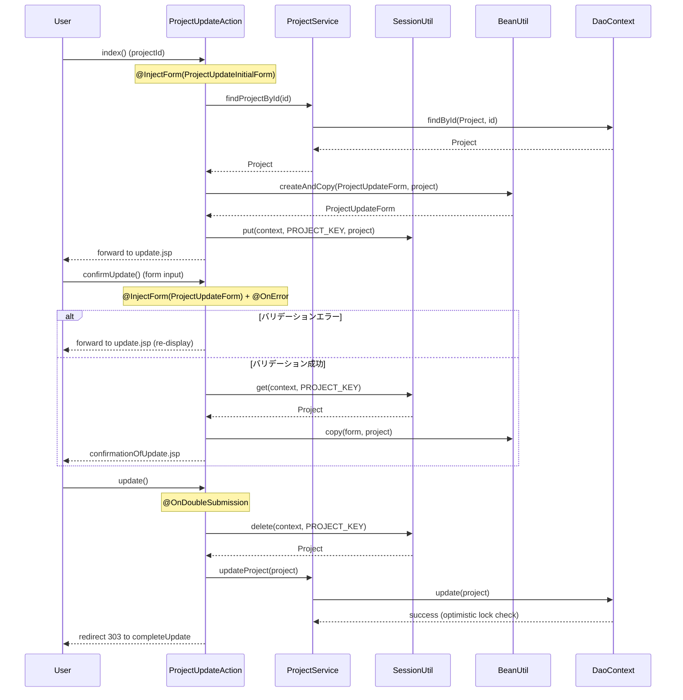

# Code Analysis: ProjectUpdateAction

**Generated**: 2026-03-13 17:36:51
**Target**: プロジェクト更新処理アクション
**Modules**: proman-web
**Analysis Duration**: approx. 2m 58s

---

## Overview

`ProjectUpdateAction` はプロジェクト管理Webアプリケーションにおけるプロジェクト更新機能を担うアクションクラスである。プロジェクト詳細画面から開始し、更新画面表示 → 確認画面表示 → 更新確定という3ステップのフローを管理する。`SessionUtil` によるセッションストアでエンティティを安全に受け渡し、`@InjectForm`/`@OnError` によるバリデーション、`@OnDoubleSubmission` による二重送信防止を組み合わせたNablarch標準のCRUD更新パターンを実装している。

---

## Architecture

### Dependency Graph

```mermaid
classDiagram
    class ProjectUpdateAction
    class ProjectUpdateForm {
        <<Form>>
    }
    class ProjectUpdateInitialForm {
        <<Form>>
    }
    class ProjectService
    class Project {
        <<Entity>>
    }
    class Organization {
        <<Entity>>
    }
    class SessionUtil {
        <<Nablarch>>
    }
    class BeanUtil {
        <<Nablarch>>
    }
    class ExecutionContext {
        <<Nablarch>>
    }
    class DaoContext {
        <<Nablarch>>
    }

    ProjectUpdateInitialForm ..|> Serializable : uses
    ProjectUpdateForm ..|> Serializable : uses
    ProjectUpdateAction ..> ProjectUpdateInitialForm : validates
    ProjectUpdateAction ..> ProjectUpdateForm : validates
    ProjectUpdateAction ..> ProjectService : delegates to
    ProjectUpdateAction ..> SessionUtil : stores/retrieves
    ProjectUpdateAction ..> BeanUtil : copies
    ProjectUpdateAction ..> ExecutionContext : uses
    ProjectService ..> DaoContext : queries/persists
    ProjectService ..> Project : persists
    ProjectService ..> Organization : queries
```



**Note**: This diagram uses Mermaid `classDiagram` syntax to show class names and their relationships. Use `--|>` for inheritance (extends/implements) and `..>` for dependencies (uses/creates).

### Component Summary

| Component | Role | Type | Dependencies |
|-----------|------|------|--------------|
| ProjectUpdateAction | プロジェクト更新フロー制御 | Action | ProjectUpdateInitialForm, ProjectUpdateForm, ProjectService, SessionUtil, BeanUtil, ExecutionContext |
| ProjectUpdateForm | 更新入力値のバリデーション | Form | DateRelationUtil |
| ProjectUpdateInitialForm | 更新画面遷移時のプロジェクトID受付 | Form | なし |
| ProjectService | プロジェクトとOrganizationのDB操作 | Service | DaoContext, Project, Organization |
| Project | プロジェクトデータ | Entity | なし |
| Organization | 組織（事業部/部門）データ | Entity | なし |

---

## Flow

### Processing Flow

更新処理は4つのメソッドで構成されるマルチステップフローである。

1. **index()**: 詳細画面からプロジェクトIDを受け取り、DBからプロジェクトを取得してセッションに保存し更新画面を表示する。
2. **confirmUpdate()**: 入力フォームを受け取り、バリデーション実行後に確認画面を表示する。バリデーションエラー時は `@OnError` により更新画面へ戻る。
3. **update()**: `@OnDoubleSubmission` で二重送信を防止しつつ、セッションからエンティティを取得してDB更新を実行し、完了画面へリダイレクトする。
4. **completeUpdate()**: 更新完了画面を表示する。補助メソッドとして、セッションからフォームを復元する `backToEnterUpdate()` と、事業部/部門プルダウンを設定する `indexSetPullDown()` がある。

### Sequence Diagram



---

## Components

### ProjectUpdateAction

**ファイル**: [ProjectUpdateAction.java](../../.lw/nab-official/v5/nablarch-system-development-guide/Sample_Project/Source_Code/proman-project/proman-web/src/main/java/com/nablarch/example/proman/web/project/ProjectUpdateAction.java)

**役割**: プロジェクト更新の全フローを制御するWebアクションクラス。

**主要メソッド**:
- `index()` (L35-43): 詳細画面からプロジェクトIDを受け取り、DBから取得したProjectエンティティをセッションに保存して更新画面表示
- `confirmUpdate()` (L54-62): 入力値をバリデーションしてProjectエンティティに反映後、確認画面表示
- `update()` (L72-77): 二重送信防止付きでDB更新を実行し303リダイレクト
- `backToEnterUpdate()` (L97-102): 確認画面から入力画面に戻る際にセッションのエンティティからフォームを復元
- `buildFormFromEntity()` (L111-125): エンティティ→フォーム変換。日付フォーマット変換と組織情報設定を行う

**依存コンポーネント**: ProjectUpdateInitialForm, ProjectUpdateForm, ProjectService, SessionUtil, BeanUtil, ExecutionContext

**実装ポイント**:
- セッションキー `PROJECT_KEY` でプロジェクトエンティティを画面間で受け渡す
- フォームではなくエンティティをセッションに保存するNablarch推奨パターン
- `update()` で `SessionUtil.delete()` を使用して取得と同時にセッションをクリーン

### ProjectUpdateForm

**ファイル**: [ProjectUpdateForm.java](../../.lw/nab-official/v5/nablarch-system-development-guide/Sample_Project/Source_Code/proman-project/proman-web/src/main/java/com/nablarch/example/proman/web/project/ProjectUpdateForm.java)

**役割**: 更新画面の入力値を受け取り、Bean Validationでバリデーションを行うフォームクラス。

**主要フィールド**: projectName, projectType, projectClass, projectStartDate, projectEndDate, divisionId, organizationId, clientId, pmKanjiName, plKanjiName, note, salesAmount

**バリデーション**: `@Required`, `@Domain` アノテーションで必須・ドメインチェック。`isValidProjectPeriod()` (L329) で `@AssertTrue` による期間チェック

### ProjectUpdateInitialForm

**ファイル**: [ProjectUpdateInitialForm.java](../../.lw/nab-official/v5/nablarch-system-development-guide/Sample_Project/Source_Code/proman-project/proman-web/src/main/java/com/nablarch/example/proman/web/project/ProjectUpdateInitialForm.java)

**役割**: 詳細画面→更新画面遷移時のプロジェクトIDのみを受け取るシンプルなフォーム。

### ProjectService

**ファイル**: [ProjectService.java](../../.lw/nab-official/v5/nablarch-system-development-guide/Sample_Project/Source_Code/proman-project/proman-web/src/main/java/com/nablarch/example/proman/web/project/ProjectService.java)

**役割**: Project/OrganizationのDB操作をカプセル化するサービスクラス。

**主要メソッド**:
- `findProjectById()` (L124-126): プロジェクトID主キー検索
- `updateProject()` (L88-91): プロジェクトのDB更新（楽観的ロック付き）
- `findAllDivision()` / `findAllDepartment()` (L50-61): 事業部/部門リスト取得
- `findOrganizationById()` (L70-73): 組織ID主キー検索

---

## Nablarch Framework Usage

### SessionUtil

**クラス**: `nablarch.common.web.session.SessionUtil`

**説明**: セッションストアへのオブジェクト保存・取得・削除を行うユーティリティクラス。

**使用方法**:
```java
// 保存
SessionUtil.put(context, "key", entity);
// 取得
Entity entity = SessionUtil.get(context, "key");
// 取得して削除
Entity entity = SessionUtil.delete(context, "key");
```

**重要ポイント**:
- ✅ **エンティティを保存する**: フォームではなくエンティティをセッションに格納する（フォームはHTMLフォーム単位で使い捨て）
- ⚠️ **update()でdeleteを使う**: 更新確定時は `SessionUtil.delete()` で取得と同時にセッションをクリアし、不要なセッションデータを残さない
- 💡 **楽観的ロック対応**: 編集開始時点のエンティティをセッションに保存することで、他ユーザーの同時更新を検知できる

**このコードでの使い方**:
- `index()` でProjectエンティティをセッションに保存 (L41)
- `confirmUpdate()` でセッションからProjectを取得してフォーム内容をコピー (L56)
- `update()` でセッションから取得と同時に削除 (L73)

**詳細**: [Web Application Getting Started Project Update](../../.claude/skills/nabledge-5/docs/processing-pattern/web-application/web-application-getting-started-project-update.md)

### BeanUtil

**クラス**: `nablarch.core.beans.BeanUtil`

**説明**: Javaビーン間でプロパティを一括コピーするユーティリティ。同名プロパティを自動マッピングする。

**使用方法**:
```java
// エンティティからフォームを生成してコピー
ProjectUpdateForm form = BeanUtil.createAndCopy(ProjectUpdateForm.class, project);
// フォームの内容をエンティティにコピー
BeanUtil.copy(form, project);
```

**重要ポイント**:
- ✅ **フォーム↔エンティティ変換**: 同名プロパティを自動コピーしてボイラープレートを排除する
- ⚠️ **型不一致に注意**: フォームプロパティはすべてString型だが、エンティティは適切な型を持つ。コピー時に型変換が行われるため、変換できない型は個別設定が必要
- 💡 **createAndCopy vs copy**: `createAndCopy` は新規インスタンス生成+コピー、`copy` は既存インスタンスへのコピー

**このコードでの使い方**:
- `buildFormFromEntity()` で `BeanUtil.createAndCopy()` を使いProjectエンティティからProjectUpdateFormを生成 (L112)
- `confirmUpdate()` で `BeanUtil.copy()` を使いフォームの入力内容をセッションのエンティティに反映 (L57)

**詳細**: [Web Application Getting Started Project Update](../../.claude/skills/nabledge-5/docs/processing-pattern/web-application/web-application-getting-started-project-update.md)

### @InjectForm / @OnError

**クラス**: `nablarch.common.web.interceptor.InjectForm` / `nablarch.fw.web.interceptor.OnError`

**説明**: `@InjectForm` はリクエストパラメータをフォームクラスにバインドしてBean Validationを実行するインターセプター。`@OnError` はバリデーションエラー時の遷移先を指定する。

**使用方法**:
```java
@InjectForm(form = ProjectUpdateForm.class, prefix = "form")
@OnError(type = ApplicationException.class, path = "forward:///app/project/moveUpdate")
public HttpResponse confirmUpdate(HttpRequest request, ExecutionContext context) {
    ProjectUpdateForm form = context.getRequestScopedVar("form");
    // ...
}
```

**重要ポイント**:
- ✅ **prefix指定**: フォームタグのprefixと一致させること（JSPで `name="form.projectName"` の場合は `prefix = "form"`）
- ⚠️ **@OnError必須**: バリデーションエラー時の遷移先を必ず指定する。未指定の場合はエラーが適切に処理されない
- 💡 **バリデーション済みオブジェクト**: エラーがない場合、`context.getRequestScopedVar("form")` でバリデーション済みフォームを取得できる

**このコードでの使い方**:
- `index()` で `@InjectForm(form = ProjectUpdateInitialForm.class)` によりプロジェクトIDをバリデーション (L34)
- `confirmUpdate()` で `@InjectForm(form = ProjectUpdateForm.class, prefix = "form")` と `@OnError` を組み合わせてバリデーション (L52-53)

**詳細**: [Web Application Client Create2](../../.claude/skills/nabledge-5/docs/processing-pattern/web-application/web-application-client_create2.md)

### @OnDoubleSubmission

**クラス**: `nablarch.common.web.token.OnDoubleSubmission`

**説明**: トークンベースで二重送信を防止するインターセプター。JSP側の `useToken="true"` と組み合わせて使用する。

**使用方法**:
```java
@OnDoubleSubmission
public HttpResponse update(HttpRequest request, ExecutionContext context) {
    // 更新処理
}
```

**重要ポイント**:
- ✅ **更新・削除・登録確定メソッドに付与**: データ変更を伴うすべての確定処理に付与する
- ⚠️ **JSP側設定も必要**: `<n:form useToken="true">` と確定ボタンの `allowDoubleSubmission="false"` の両方が必要
- 💡 **ブラウザバック対策**: PRGパターン（303リダイレクト）と組み合わせてブラウザ更新での再実行を防止

**このコードでの使い方**:
- `update()` メソッドに付与して更新確定時の二重送信を防止 (L71)

**詳細**: [Web Application Getting Started Project Delete](../../.claude/skills/nabledge-5/docs/processing-pattern/web-application/web-application-getting-started-project-delete.md)

### DaoContext (UniversalDao)

**クラス**: `nablarch.common.dao.DaoContext`

**説明**: NablarchのユニバーサルDAOインターフェース。SQLを書かずに主キーCRUD操作とSQLファイルベースの検索が可能。

**使用方法**:
```java
// 主キー検索
Project project = universalDao.findById(Project.class, projectId);
// 更新（楽観的ロック付き）
universalDao.update(project);
// SQLファイルベースの検索
List<Organization> list = universalDao.findAllBySqlFile(Organization.class, "FIND_ALL_DIVISION");
```

**重要ポイント**:
- ✅ **楽観的ロック**: エンティティに `@Version` アノテーションを付与することで自動的に楽観的ロックが有効になる
- ⚠️ **主キー更新のみ**: `update()` は主キーを条件とする更新のみ。主キー以外の条件で更新する場合は別途SQLを用意する
- 💡 **DaoFactory.create()**: ProjectServiceのコンストラクタで `DaoFactory.create()` を使いDaoContextを取得している

**このコードでの使い方**:
- `ProjectService.findProjectById()` で主キー検索 (L124-126)
- `ProjectService.updateProject()` でDB更新（楽観的ロックチェック含む） (L89-91)
- `ProjectService.findAllDivision/Department()` でSQLファイルベースのOrganization一覧取得 (L50-61)

**詳細**: [Web Application Getting Started Project Update](../../.claude/skills/nabledge-5/docs/processing-pattern/web-application/web-application-getting-started-project-update.md)

---

## References

### Source Files

- [ProjectUpdateAction.java (.lw/nab-official/v5/nablarch-system-development-guide/en/Sample_Project/Source_Code/proman-project/proman-web/src/main/java/com/nablarch/example/proman/web/project)](../../.lw/nab-official/v5/nablarch-system-development-guide/en/Sample_Project/Source_Code/proman-project/proman-web/src/main/java/com/nablarch/example/proman/web/project/ProjectUpdateAction.java) - ProjectUpdateAction
- [ProjectUpdateAction.java (.lw/nab-official/v5/nablarch-system-development-guide/Sample_Project/Source_Code/proman-project/proman-web/src/main/java/com/nablarch/example/proman/web/project)](../../.lw/nab-official/v5/nablarch-system-development-guide/Sample_Project/Source_Code/proman-project/proman-web/src/main/java/com/nablarch/example/proman/web/project/ProjectUpdateAction.java) - ProjectUpdateAction
- [ProjectUpdateAction.java (.lw/nab-official/v6/nablarch-system-development-guide/en/Sample_Project/Source_Code/proman-project/proman-web/src/main/java/com/nablarch/example/proman/web/project)](../../.lw/nab-official/v6/nablarch-system-development-guide/en/Sample_Project/Source_Code/proman-project/proman-web/src/main/java/com/nablarch/example/proman/web/project/ProjectUpdateAction.java) - ProjectUpdateAction
- [ProjectUpdateAction.java (.lw/nab-official/v6/nablarch-system-development-guide/Sample_Project/Source_Code/proman-project/proman-web/src/main/java/com/nablarch/example/proman/web/project)](../../.lw/nab-official/v6/nablarch-system-development-guide/Sample_Project/Source_Code/proman-project/proman-web/src/main/java/com/nablarch/example/proman/web/project/ProjectUpdateAction.java) - ProjectUpdateAction
- [ProjectUpdateForm.java (.lw/nab-official/v5/nablarch-system-development-guide/en/Sample_Project/Source_Code/proman-project/proman-web/src/main/java/com/nablarch/example/proman/web/project)](../../.lw/nab-official/v5/nablarch-system-development-guide/en/Sample_Project/Source_Code/proman-project/proman-web/src/main/java/com/nablarch/example/proman/web/project/ProjectUpdateForm.java) - ProjectUpdateForm
- [ProjectUpdateForm.java (.lw/nab-official/v5/nablarch-system-development-guide/Sample_Project/Source_Code/proman-project/proman-web/src/main/java/com/nablarch/example/proman/web/project/)](../../.lw/nab-official/v5/nablarch-system-development-guide/Sample_Project/Source_Code/proman-project/proman-web/src/main/java/com/nablarch/example/proman/web/project/ProjectUpdateForm.java) - ProjectUpdateForm
- [ProjectUpdateForm.java (.lw/nab-official/v6/nablarch-system-development-guide/en/Sample_Project/Source_Code/proman-project/proman-web/src/main/java/com/nablarch/example/proman/web/project)](../../.lw/nab-official/v6/nablarch-system-development-guide/en/Sample_Project/Source_Code/proman-project/proman-web/src/main/java/com/nablarch/example/proman/web/project/ProjectUpdateForm.java) - ProjectUpdateForm
- [ProjectUpdateForm.java (.lw/nab-official/v6/nablarch-system-development-guide/Sample_Project/Source_Code/proman-project/proman-web/src/main/java/com/nablarch/example/proman/web/project)](../../.lw/nab-official/v6/nablarch-system-development-guide/Sample_Project/Source_Code/proman-project/proman-web/src/main/java/com/nablarch/example/proman/web/project/ProjectUpdateForm.java) - ProjectUpdateForm
- [ProjectUpdateInitialForm.java (.lw/nab-official/v5/nablarch-system-development-guide/en/Sample_Project/Source_Code/proman-project/proman-web/src/main/java/com/nablarch/example/proman/web/project)](../../.lw/nab-official/v5/nablarch-system-development-guide/en/Sample_Project/Source_Code/proman-project/proman-web/src/main/java/com/nablarch/example/proman/web/project/ProjectUpdateInitialForm.java) - ProjectUpdateInitialForm
- [ProjectUpdateInitialForm.java (.lw/nab-official/v5/nablarch-system-development-guide/Sample_Project/Source_Code/proman-project/proman-web/src/main/java/com/nablarch/example/proman/web/project)](../../.lw/nab-official/v5/nablarch-system-development-guide/Sample_Project/Source_Code/proman-project/proman-web/src/main/java/com/nablarch/example/proman/web/project/ProjectUpdateInitialForm.java) - ProjectUpdateInitialForm
- [ProjectUpdateInitialForm.java (.lw/nab-official/v6/nablarch-system-development-guide/en/Sample_Project/Source_Code/proman-project/proman-web/src/main/java/com/nablarch/example/proman/web/project)](../../.lw/nab-official/v6/nablarch-system-development-guide/en/Sample_Project/Source_Code/proman-project/proman-web/src/main/java/com/nablarch/example/proman/web/project/ProjectUpdateInitialForm.java) - ProjectUpdateInitialForm
- [ProjectUpdateInitialForm.java (.lw/nab-official/v6/nablarch-system-development-guide/Sample_Project/Source_Code/proman-project/proman-web/src/main/java/com/nablarch/example/proman/web/project)](../../.lw/nab-official/v6/nablarch-system-development-guide/Sample_Project/Source_Code/proman-project/proman-web/src/main/java/com/nablarch/example/proman/web/project/ProjectUpdateInitialForm.java) - ProjectUpdateInitialForm
- [ProjectService.java (.lw/nab-official/v5/nablarch-system-development-guide/en/Sample_Project/Source_Code/proman-project/proman-web/src/main/java/com/nablarch/example/proman/web/project)](../../.lw/nab-official/v5/nablarch-system-development-guide/en/Sample_Project/Source_Code/proman-project/proman-web/src/main/java/com/nablarch/example/proman/web/project/ProjectService.java) - ProjectService
- [ProjectService.java (.lw/nab-official/v5/nablarch-system-development-guide/Sample_Project/Source_Code/proman-project/proman-web/src/main/java/com/nablarch/example/proman/web/project)](../../.lw/nab-official/v5/nablarch-system-development-guide/Sample_Project/Source_Code/proman-project/proman-web/src/main/java/com/nablarch/example/proman/web/project/ProjectService.java) - ProjectService
- [ProjectService.java (.lw/nab-official/v6/nablarch-system-development-guide/en/Sample_Project/Source_Code/proman-project/proman-web/src/main/java/com/nablarch/example/proman/web/project)](../../.lw/nab-official/v6/nablarch-system-development-guide/en/Sample_Project/Source_Code/proman-project/proman-web/src/main/java/com/nablarch/example/proman/web/project/ProjectService.java) - ProjectService
- [ProjectService.java (.lw/nab-official/v6/nablarch-system-development-guide/Sample_Project/Source_Code/proman-project/proman-web/src/main/java/com/nablarch/example/proman/web/project)](../../.lw/nab-official/v6/nablarch-system-development-guide/Sample_Project/Source_Code/proman-project/proman-web/src/main/java/com/nablarch/example/proman/web/project/ProjectService.java) - ProjectService

### Knowledge Base (Nabledge-5)

- [Web Application Getting Started Project Update](../../.claude/skills/nabledge-5/docs/processing-pattern/web-application/web-application-getting-started-project-update.md)
- [Web Application Client_create2](../../.claude/skills/nabledge-5/docs/processing-pattern/web-application/web-application-client_create2.md)
- [Web Application Getting Started Project Delete](../../.claude/skills/nabledge-5/docs/processing-pattern/web-application/web-application-getting-started-project-delete.md)

### Official Documentation


- [BeanUtil](https://nablarch.github.io/docs/LATEST/javadoc/nablarch/core/beans/BeanUtil.html)
- [Client Create2](https://nablarch.github.io/docs/LATEST/doc/application_framework/application_framework/web/getting_started/client_create/client_create2.html)
- [Index](https://nablarch.github.io/docs/LATEST/doc/application_framework/application_framework/web/getting_started/project_delete/index.html)
- [Index](https://nablarch.github.io/docs/LATEST/doc/application_framework/application_framework/web/getting_started/project_update/index.html)
- [InjectForm](https://nablarch.github.io/docs/LATEST/javadoc/nablarch/common/web/interceptor/InjectForm.html)
- [NoDataException](https://nablarch.github.io/docs/LATEST/javadoc/nablarch/common/dao/NoDataException.html)
- [OnDoubleSubmission](https://nablarch.github.io/docs/LATEST/javadoc/nablarch/common/web/token/OnDoubleSubmission.html)
- [OnError](https://nablarch.github.io/docs/LATEST/javadoc/nablarch/fw/web/interceptor/OnError.html)
- [Required](https://nablarch.github.io/docs/LATEST/javadoc/nablarch/core/validation/ee/Required.html)
- [ResourceLocator](https://nablarch.github.io/docs/LATEST/javadoc/nablarch/fw/web/ResourceLocator.html)
- [SessionUtil](https://nablarch.github.io/docs/LATEST/javadoc/nablarch/common/web/session/SessionUtil.html)
- [UniversalDao](https://nablarch.github.io/docs/LATEST/javadoc/nablarch/common/dao/UniversalDao.html)

---

**Note**: This documentation was generated by the code-analysis workflow of the nabledge-5 skill.
