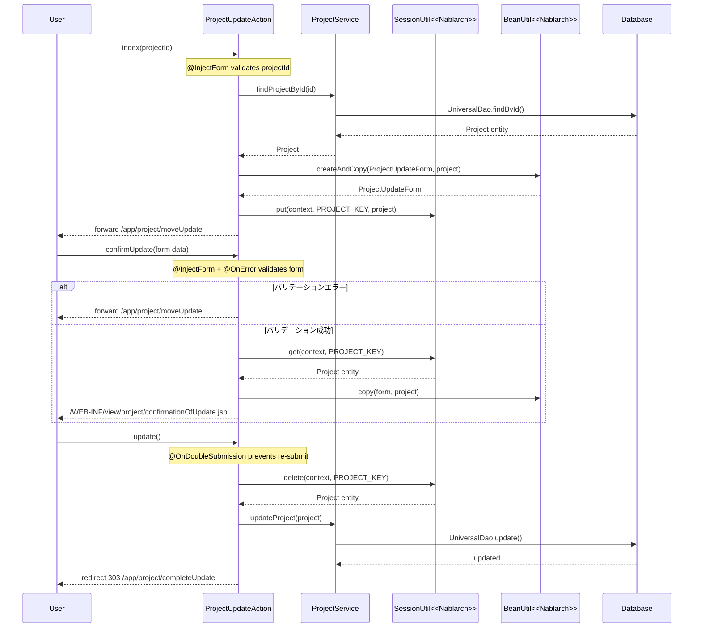

# Code Analysis: ProjectUpdateAction

**Generated**: 2026-03-13 17:41:38
**Target**: プロジェクト更新処理アクション
**Modules**: proman-web
**Analysis Duration**: approx. 3m 39s

---

## Overview

`ProjectUpdateAction` はプロジェクト管理Webアプリケーション（proman-web）におけるプロジェクト更新機能を担う業務アクションクラスです。詳細画面からの遷移、更新入力画面表示、確認画面表示、DB更新実行、完了画面表示、入力画面への戻り処理という6つのメソッドで構成される典型的なCRUD更新フローを実装しています。

セッションストアを使用してリクエスト間でプロジェクトエンティティを保持し、`@InjectForm` によるBean Validationと `@OnDoubleSubmission` による二重サブミット防止を組み合わせた安全な更新処理を実現しています。

---

## Architecture

### Dependency Graph

```mermaid
classDiagram
    class ProjectUpdateAction
    class ProjectUpdateForm {
        <<Form>>
    }
    class ProjectUpdateInitialForm {
        <<Form>>
    }
    class ProjectService
    class Project {
        <<Entity>>
    }
    class Organization {
        <<Entity>>
    }
    class DaoContext {
        <<Nablarch>>
    }
    class SessionUtil {
        <<Nablarch>>
    }
    class BeanUtil {
        <<Nablarch>>
    }
    class InjectForm {
        <<Nablarch>>
    }
    class OnDoubleSubmission {
        <<Nablarch>>
    }
    class ExecutionContext {
        <<Nablarch>>
    }

    ProjectUpdateAction ..> ProjectUpdateInitialForm : validates
    ProjectUpdateAction ..> ProjectUpdateForm : validates
    ProjectUpdateAction ..> ProjectService : delegates to
    ProjectUpdateAction ..> SessionUtil : stores/retrieves
    ProjectUpdateAction ..> BeanUtil : copies
    ProjectUpdateAction ..> ExecutionContext : uses
    ProjectUpdateAction ..> InjectForm : annotated
    ProjectUpdateAction ..> OnDoubleSubmission : annotated
    ProjectService ..> DaoContext : queries/persists
    ProjectService ..> Project : creates
    ProjectService ..> Organization : queries
    ProjectUpdateForm ..|> Serializable : implements
    ProjectUpdateInitialForm ..|> Serializable : implements
```



**Note**: This diagram uses Mermaid `classDiagram` syntax to show class names and their relationships. Use `--|>` for inheritance (extends/implements) and `..>` for dependencies (uses/creates).

### Component Summary

| Component | Role | Type | Dependencies |
|-----------|------|------|--------------|
| ProjectUpdateAction | プロジェクト更新フロー制御 | Action | ProjectUpdateForm, ProjectUpdateInitialForm, ProjectService, SessionUtil, BeanUtil |
| ProjectUpdateForm | 更新入力値受付・バリデーション | Form | DateRelationUtil |
| ProjectUpdateInitialForm | 詳細→更新遷移時のIDパラメータ受付 | Form | なし |
| ProjectService | プロジェクト・組織のDB操作サービス | Service | DaoContext (UniversalDao) |

---

## Flow

### Processing Flow

プロジェクト更新は以下の6ステップで構成されます。

1. **詳細→更新画面遷移** (`index`): プロジェクトIDを受け取り、DBから対象プロジェクトを取得してセッションストアに保存。更新フォームの初期値を設定して更新入力画面へフォーワード。
2. **プルダウン設定** (`indexSetPullDown`): 事業部・部門のプルダウンリストをDBから取得してリクエストスコープに設定し、更新入力画面を表示。
3. **確認画面表示** (`confirmUpdate`): `@InjectForm` でBean Validationを実行。バリデーション成功後、フォームの内容をセッションストアのエンティティにコピーして確認画面を表示。バリデーションエラー時は更新入力画面へ戻る。
4. **DB更新実行** (`update`): `@OnDoubleSubmission` で二重サブミット防止。セッションストアからプロジェクトエンティティを取り出してDB更新。完了画面へリダイレクト（PRGパターン）。
5. **入力画面への戻り** (`backToEnterUpdate`): セッションストアのエンティティからフォームを再構築して更新入力画面へフォーワード。
6. **完了画面表示** (`completeUpdate`): 完了JSPをそのまま返す。

### Sequence Diagram



---

## Components

### ProjectUpdateAction

**ファイル**: [ProjectUpdateAction.java](../../.lw/nab-official/v5/nablarch-system-development-guide/Sample_Project/Source_Code/proman-project/proman-web/src/main/java/com/nablarch/example/proman/web/project/ProjectUpdateAction.java)

**役割**: プロジェクト更新機能の全フローを制御する業務アクションクラス。セッションストアとNablarchインターセプターを活用した典型的な更新フローを実装。

**主要メソッド**:

- `index(HttpRequest, ExecutionContext)` [L35-43]: 詳細画面からの遷移処理。`@InjectForm(form = ProjectUpdateInitialForm.class)` でIDを検証し、DBからプロジェクトを取得してセッションに保存。
- `confirmUpdate(HttpRequest, ExecutionContext)` [L52-62]: 確認画面表示。`@InjectForm(form = ProjectUpdateForm.class, prefix = "form")` でフォーム全体を検証。`@OnError` でエラー時に更新入力画面へ戻る。
- `update(HttpRequest, ExecutionContext)` [L72-77]: DB更新実行。`@OnDoubleSubmission` で二重送信防止。セッションからエンティティを削除しDBを更新後303リダイレクト。
- `backToEnterUpdate(HttpRequest, ExecutionContext)` [L97-102]: 確認→入力画面への戻り。セッションのエンティティからフォームを再生成。
- `buildFormFromEntity(Project, ProjectService)` [L111-125]: エンティティからフォームへの変換ヘルパー。日付フォーマット変換と組織情報の設定を行う。
- `setOrganizationAndDivisionToRequestScope(ExecutionContext)` [L148-158]: 事業部・部門プルダウンをDBから取得してリクエストスコープに設定。

**依存関係**: ProjectUpdateInitialForm, ProjectUpdateForm, ProjectService, SessionUtil, BeanUtil, DateUtil, ExecutionContext

---

### ProjectUpdateForm

**ファイル**: [ProjectUpdateForm.java](../../.lw/nab-official/v5/nablarch-system-development-guide/Sample_Project/Source_Code/proman-project/proman-web/src/main/java/com/nablarch/example/proman/web/project/ProjectUpdateForm.java)

**役割**: プロジェクト更新入力値を受け付けるフォームクラス。Bean Validationアノテーションによるバリデーションルールを定義。

**主要フィールド**: `projectName`, `projectType`, `projectClass`, `projectStartDate`, `projectEndDate`, `divisionId`, `organizationId`, `clientId`, `pmKanjiName`, `plKanjiName`, `note`, `salesAmount`

**主要メソッド**:

- `isValidProjectPeriod()` [L329-331]: `@AssertTrue` でプロジェクト開始日と終了日の整合性をクロスバリデーション。`DateRelationUtil.isValid()` を使用。

**依存関係**: DateRelationUtil, Serializable

---

### ProjectUpdateInitialForm

**ファイル**: [ProjectUpdateInitialForm.java](../../.lw/nab-official/v5/nablarch-system-development-guide/Sample_Project/Source_Code/proman-project/proman-web/src/main/java/com/nablarch/example/proman/web/project/ProjectUpdateInitialForm.java)

**役割**: 詳細画面からプロジェクト更新画面へ遷移する際のプロジェクトIDパラメータのみを受け付けるシンプルなフォーム。

**主要フィールド**: `projectId` (`@Required`, `@Domain("projectId")`)

---

### ProjectService

**ファイル**: [ProjectService.java](../../.lw/nab-official/v5/nablarch-system-development-guide/Sample_Project/Source_Code/proman-project/proman-web/src/main/java/com/nablarch/example/proman/web/project/ProjectService.java)

**役割**: プロジェクト・組織エンティティのDB操作を集約したサービスクラス。UniversalDao (DaoContext) をラップして業務ロジック的なDB操作を提供。

**主要メソッド**:

- `findProjectById(Integer)` [L124-126]: プロジェクトIDで1件検索。`universalDao.findById(Project.class, projectId)`
- `updateProject(Project)` [L89-91]: プロジェクトを更新。`universalDao.update(project)` (楽観的ロック対応)
- `findOrganizationById(Integer)` [L70-73]: 組織IDで組織を1件検索。
- `findAllDivision()` [L50-52]: 全事業部リストをSQLファイルで検索。
- `findAllDepartment()` [L59-61]: 全部門リストをSQLファイルで検索。

**依存関係**: DaoContext (UniversalDao), Project, Organization, DaoFactory

---

## Nablarch Framework Usage

### InjectForm

**クラス**: `nablarch.common.web.interceptor.InjectForm`

**説明**: 業務アクションメソッドに付与するインターセプター。HTTPリクエストパラメータを指定フォームクラスにバインドし、Bean Validationを実行する。バリデーション済みフォームをリクエストスコープに格納する。

**使用方法**:
```java
@InjectForm(form = ProjectUpdateForm.class, prefix = "form")
@OnError(type = ApplicationException.class, path = "forward:///app/project/moveUpdate")
public HttpResponse confirmUpdate(HttpRequest request, ExecutionContext context) {
    ProjectUpdateForm form = context.getRequestScopedVar("form");
    // バリデーション済みフォームを使用
}
```

**重要ポイント**:
- ✅ **`prefix` 属性**: HTMLフォームの `name` 属性に `form.xxx` のようにプレフィックスがある場合は `prefix = "form"` を指定する
- ⚠️ **`nablarch.core.validation.ee` vs `validator`**: Nablarch 5のBean ValidationはEE版 (`nablarch.core.validation.ee`) を使用する。旧パッケージ (`nablarch.core.validation.validator`) と混在注意
- 💡 **フォームのSerializable**: `@InjectForm` が正しく機能するためフォームクラスは `Serializable` インタフェースを実装する必要がある

**このコードでの使い方**:
- `index()` で `ProjectUpdateInitialForm` を使いプロジェクトIDのみ検証 (L34)
- `confirmUpdate()` で `ProjectUpdateForm` を `prefix = "form"` 付きで使い全項目を検証 (L52)

**詳細**: [Web Application Getting Started Project Update](../../.claude/skills/nabledge-5/docs/processing-pattern/web-application/web-application-getting-started-project-update.md)

---

### OnError

**クラス**: `nablarch.fw.web.interceptor.OnError`

**説明**: 業務アクションメソッドに付与するインターセプター。指定した例外が発生した場合に指定パスへフォーワードまたはリダイレクトする。`@InjectForm` と組み合わせてバリデーションエラー時の画面遷移制御に使用する。

**使用方法**:
```java
@InjectForm(form = ProjectUpdateForm.class, prefix = "form")
@OnError(type = ApplicationException.class, path = "forward:///app/project/moveUpdate")
public HttpResponse confirmUpdate(HttpRequest request, ExecutionContext context) { ... }
```

**重要ポイント**:
- ✅ **`path` に内部フォーワードを指定**: 更新入力画面を再表示する際、プルダウン再設定が必要なため `forward://` で別メソッドへフォーワードする
- ⚠️ **`ApplicationException` を捕捉**: Bean Validationエラーは `ApplicationException` としてスローされる
- 💡 **`@InjectForm` と必ずセット**: バリデーションエラー時の遷移先設定として `@InjectForm` と組み合わせて使うのが標準パターン

**このコードでの使い方**:
- `confirmUpdate()` でバリデーションエラー時に `forward:///app/project/moveUpdate` へ戻る (L53)

**詳細**: [Web Application Client Create2](../../.claude/skills/nabledge-5/docs/processing-pattern/web-application/web-application-client_create2.md)

---

### SessionUtil

**クラス**: `nablarch.common.web.session.SessionUtil`

**説明**: セッションストアへのput/get/deleteを提供するユーティリティクラス。フォームではなくエンティティ（Serializable）を格納してリクエスト間でデータを保持する。

**使用方法**:
```java
// 保存
SessionUtil.put(context, PROJECT_KEY, project);
// 取得
Project project = SessionUtil.get(context, PROJECT_KEY);
// 取得して削除（更新実行時）
Project project = SessionUtil.delete(context, PROJECT_KEY);
```

**重要ポイント**:
- ✅ **フォームをセッションに格納しない**: フォームではなくエンティティ (Project等) に変換してからセッションに保存する（`BeanUtil` でコピー）
- ✅ **更新実行時は `delete()`**: `update()` でセッションからエンティティを取り出す際は `SessionUtil.delete()` を使いセッションをクリアする
- ⚠️ **キー名の一元管理**: セッションキーは定数 (`PROJECT_KEY`) で管理する

**このコードでの使い方**:
- `index()` で `put()` によりプロジェクトエンティティをセッションに保存 (L41)
- `confirmUpdate()` で `get()` によりセッションからエンティティを取得してBeanコピー (L56)
- `update()` で `delete()` によりセッションから取り出して削除しDBへ更新 (L73)
- `backToEnterUpdate()` で `get()` によりセッションのエンティティからフォームを再構築 (L98)

**詳細**: [Web Application Client Create2](../../.claude/skills/nabledge-5/docs/processing-pattern/web-application/web-application-client_create2.md)

---

### BeanUtil

**クラス**: `nablarch.core.beans.BeanUtil`

**説明**: JavaBeansのプロパティコピーを行うユーティリティ。同名プロパティを自動マッピングし、フォームとエンティティ間の変換やエンティティから別クラスへのコピーに使用する。

**使用方法**:
```java
// エンティティ→フォーム（新規生成+コピー）
ProjectUpdateForm form = BeanUtil.createAndCopy(ProjectUpdateForm.class, project);
// フォーム→エンティティ（既存インスタンスへコピー）
BeanUtil.copy(form, project);
```

**重要ポイント**:
- ✅ **`createAndCopy` vs `copy`**: 新規インスタンス生成が必要な場合は `createAndCopy`、既存インスタンスに上書きする場合は `copy` を使い分ける
- ⚠️ **型変換**: String型プロパティと非String型プロパティ間のコピーは変換が自動で行われるが、フォーマットが必要な場合（日付など）は個別に対応が必要
- 💡 **セッションへの保存前に使う**: フォームをセッションに格納せず、エンティティに変換してからセッションに保存するためのユーティリティとして活用

**このコードでの使い方**:
- `buildFormFromEntity()` で `createAndCopy(ProjectUpdateForm.class, project)` によりエンティティからフォームを生成 (L112)
- `confirmUpdate()` で `copy(form, project)` によりフォームの変更値をセッションのエンティティに反映 (L57)
- `backToEnterUpdate()` で `buildFormFromEntity()` を通じてエンティティからフォームを再生成 (L99)

**詳細**: [Web Application Client Create3](../../.claude/skills/nabledge-5/docs/processing-pattern/web-application/web-application-client_create3.md)

---

### OnDoubleSubmission

**クラス**: `nablarch.common.web.token.OnDoubleSubmission`

**説明**: 業務アクションメソッドに付与するインターセプター。トークンベースの二重サブミット防止を実現する。JSP側では `<n:form useToken="true">` と `allowDoubleSubmission="false"` の組み合わせでクライアント・サーバ両方で二重送信を制御する。

**使用方法**:
```java
@OnDoubleSubmission
public HttpResponse update(HttpRequest request, ExecutionContext context) {
    // 二重実行された場合はエラーページへ遷移
}
```

**重要ポイント**:
- ✅ **DB更新・登録・削除メソッドに付与**: 冪等でない操作（INSERT/UPDATE/DELETE）を行うメソッドには必ず付与する
- ⚠️ **JSP側との連携必須**: サーバサイドの `@OnDoubleSubmission` だけでなく、JSP側の `allowDoubleSubmission="false"` も設定してクライアント・サーバ両方で制御する
- 💡 **確認画面のフォームに `useToken="true"`**: 確認画面のJSPフォームタグに `useToken="true"` を指定してトークンを発行する

**このコードでの使い方**:
- `update()` に `@OnDoubleSubmission` を付与して二重サブミット防止 (L71)

**詳細**: [Web Application Client Create4](../../.claude/skills/nabledge-5/docs/processing-pattern/web-application/web-application-client_create4.md)

---

### DaoContext (UniversalDao)

**クラス**: `nablarch.common.dao.DaoContext`

**説明**: DBアクセスを提供するDAOインタフェース。`UniversalDao` は静的ユーティリティ版、`DaoContext` はインタフェース版。`ProjectService` では `DaoContext` を介してDB操作を行う。

**使用方法**:
```java
// IDによる1件検索
Project project = universalDao.findById(Project.class, projectId);
// 更新（楽観的ロック付き）
universalDao.update(project);
// SQLファイルによる全件検索
List<Organization> list = universalDao.findAllBySqlFile(Organization.class, "FIND_ALL_DIVISION");
```

**重要ポイント**:
- ✅ **`ProjectService` 経由でアクセス**: `ProjectUpdateAction` は直接DAOを呼ばず `ProjectService` を経由する設計パターン
- ⚠️ **楽観的ロック**: `update()` 時にエンティティの `@Version` プロパティによる楽観的ロックが自動的に機能する。並行更新時は例外がスローされる
- 💡 **`DaoFactory.create()`**: `ProjectService` のデフォルトコンストラクタで `DaoFactory.create()` を呼び出して `DaoContext` インスタンスを生成

**このコードでの使い方**:
- `ProjectService.findProjectById()` で `universalDao.findById()` を呼び出し (L125)
- `ProjectService.updateProject()` で `universalDao.update()` を呼び出し (L90)
- `ProjectService.findAllDivision/Department()` で `universalDao.findAllBySqlFile()` を呼び出し (L51, L60)

**詳細**: [Web Application Getting Started Project Update](../../.claude/skills/nabledge-5/docs/processing-pattern/web-application/web-application-getting-started-project-update.md)

---

## References

### Source Files

- [ProjectUpdateAction.java (.lw/nab-official/v5/nablarch-system-development-guide/en/Sample_Project/Source_Code/proman-project/proman-web/src/main/java/com/nablarch/example/proman/web/project)](../../.lw/nab-official/v5/nablarch-system-development-guide/en/Sample_Project/Source_Code/proman-project/proman-web/src/main/java/com/nablarch/example/proman/web/project/ProjectUpdateAction.java) - ProjectUpdateAction
- [ProjectUpdateAction.java (.lw/nab-official/v5/nablarch-system-development-guide/Sample_Project/Source_Code/proman-project/proman-web/src/main/java/com/nablarch/example/proman/web/project)](../../.lw/nab-official/v5/nablarch-system-development-guide/Sample_Project/Source_Code/proman-project/proman-web/src/main/java/com/nablarch/example/proman/web/project/ProjectUpdateAction.java) - ProjectUpdateAction
- [ProjectUpdateAction.java (.lw/nab-official/v6/nablarch-system-development-guide/en/Sample_Project/Source_Code/proman-project/proman-web/src/main/java/com/nablarch/example/proman/web/project)](../../.lw/nab-official/v6/nablarch-system-development-guide/en/Sample_Project/Source_Code/proman-project/proman-web/src/main/java/com/nablarch/example/proman/web/project/ProjectUpdateAction.java) - ProjectUpdateAction
- [ProjectUpdateAction.java (.lw/nab-official/v6/nablarch-system-development-guide/Sample_Project/Source_Code/proman-project/proman-web/src/main/java/com/nablarch/example/proman/web/project)](../../.lw/nab-official/v6/nablarch-system-development-guide/Sample_Project/Source_Code/proman-project/proman-web/src/main/java/com/nablarch/example/proman/web/project/ProjectUpdateAction.java) - ProjectUpdateAction
- [ProjectUpdateForm.java (.lw/nab-official/v5/nablarch-system-development-guide/en/Sample_Project/Source_Code/proman-project/proman-web/src/main/java/com/nablarch/example/proman/web/project)](../../.lw/nab-official/v5/nablarch-system-development-guide/en/Sample_Project/Source_Code/proman-project/proman-web/src/main/java/com/nablarch/example/proman/web/project/ProjectUpdateForm.java) - ProjectUpdateForm
- [ProjectUpdateForm.java (.lw/nab-official/v5/nablarch-system-development-guide/Sample_Project/Source_Code/proman-project/proman-web/src/main/java/com/nablarch/example/proman/web/project)](../../.lw/nab-official/v5/nablarch-system-development-guide/Sample_Project/Source_Code/proman-project/proman-web/src/main/java/com/nablarch/example/proman/web/project/ProjectUpdateForm.java) - ProjectUpdateForm
- [ProjectUpdateForm.java (.lw/nab-official/v6/nablarch-system-development-guide/en/Sample_Project/Source_Code/proman-project/proman-web/src/main/java/com/nablarch/example/proman/web/project)](../../.lw/nab-official/v6/nablarch-system-development-guide/en/Sample_Project/Source_Code/proman-project/proman-web/src/main/java/com/nablarch/example/proman/web/project/ProjectUpdateForm.java) - ProjectUpdateForm
- [ProjectUpdateForm.java (.lw/nab-official/v6/nablarch-system-development-guide/Sample_Project/Source_Code/proman-project/proman-web/src/main/java/com/nablarch/example/proman/web/project)](../../.lw/nab-official/v6/nablarch-system-development-guide/Sample_Project/Source_Code/proman-project/proman-web/src/main/java/com/nablarch/example/proman/web/project/ProjectUpdateForm.java) - ProjectUpdateForm
- [ProjectUpdateInitialForm.java (.lw/nab-official/v5/nablarch-system-development-guide/en/Sample_Project/Source_Code/proman-project/proman-web/src/main/java/com/nablarch/example/proman/web/project)](../../.lw/nab-official/v5/nablarch-system-development-guide/en/Sample_Project/Source_Code/proman-project/proman-web/src/main/java/com/nablarch/example/proman/web/project/ProjectUpdateInitialForm.java) - ProjectUpdateInitialForm
- [ProjectUpdateInitialForm.java (.lw/nab-official/v5/nablarch-system-development-guide/Sample_Project/Source_Code/proman-project/proman-web/src/main/java/com/nablarch/example/proman/web/project)](../../.lw/nab-official/v5/nablarch-system-development-guide/Sample_Project/Source_Code/proman-project/proman-web/src/main/java/com/nablarch/example/proman/web/project/ProjectUpdateInitialForm.java) - ProjectUpdateInitialForm
- [ProjectUpdateInitialForm.java (.lw/nab-official/v6/nablarch-system-development-guide/en/Sample_Project/Source_Code/proman-project/proman-web/src/main/java/com/nablarch/example/proman/web/project)](../../.lw/nab-official/v6/nablarch-system-development-guide/en/Sample_Project/Source_Code/proman-project/proman-web/src/main/java/com/nablarch/example/proman/web/project/ProjectUpdateInitialForm.java) - ProjectUpdateInitialForm
- [ProjectUpdateInitialForm.java (.lw/nab-official/v6/nablarch-system-development-guide/Sample_Project/Source_Code/proman-project/proman-web/src/main/java/com/nablarch/example/proman/web/project)](../../.lw/nab-official/v6/nablarch-system-development-guide/Sample_Project/Source_Code/proman-project/proman-web/src/main/java/com/nablarch/example/proman/web/project/ProjectUpdateInitialForm.java) - ProjectUpdateInitialForm
- [ProjectService.java (.lw/nab-official/v5/nablarch-system-development-guide/en/Sample_Project/Source_Code/proman-project/proman-web/src/main/java/com/nablarch/example/proman/web/project)](../../.lw/nab-official/v5/nablarch-system-development-guide/en/Sample_Project/Source_Code/proman-project/proman-web/src/main/java/com/nablarch/example/proman/web/project/ProjectService.java) - ProjectService
- [ProjectService.java (.lw/nab-official/v5/nablarch-system-development-guide/Sample_Project/Source_Code/proman-project/proman-web/src/main/java/com/nablarch/example/proman/web/project)](../../.lw/nab-official/v5/nablarch-system-development-guide/Sample_Project/Source_Code/proman-project/proman-web/src/main/java/com/nablarch/example/proman/web/project/ProjectService.java) - ProjectService
- [ProjectService.java (.lw/nab-official/v6/nablarch-system-development-guide/en/Sample_Project/Source_Code/proman-project/proman-web/src/main/java/com/nablarch/example/proman/web/project)](../../.lw/nab-official/v6/nablarch-system-development-guide/en/Sample_Project/Source_Code/proman-project/proman-web/src/main/java/com/nablarch/example/proman/web/project/ProjectService.java) - ProjectService
- [ProjectService.java (.lw/nab-official/v6/nablarch-system-development-guide/Sample_Project/Source_Code/proman-project/proman-web/src/main/java/com/nablarch/example/proman/web/project)](../../.lw/nab-official/v6/nablarch-system-development-guide/Sample_Project/Source_Code/proman-project/proman-web/src/main/java/com/nablarch/example/proman/web/project/ProjectService.java) - ProjectService

### Knowledge Base (Nabledge-5)

- [Web Application Getting Started Project Update](../../.claude/skills/nabledge-5/docs/processing-pattern/web-application/web-application-getting-started-project-update.md)
- [Web Application Client_create2](../../.claude/skills/nabledge-5/docs/processing-pattern/web-application/web-application-client_create2.md)
- [Web Application Client_create4](../../.claude/skills/nabledge-5/docs/processing-pattern/web-application/web-application-client_create4.md)
- [Web Application Client_create3](../../.claude/skills/nabledge-5/docs/processing-pattern/web-application/web-application-client_create3.md)

### Official Documentation


- [BeanUtil](https://nablarch.github.io/docs/LATEST/javadoc/nablarch/core/beans/BeanUtil.html)
- [Client Create2](https://nablarch.github.io/docs/LATEST/doc/application_framework/application_framework/web/getting_started/client_create/client_create2.html)
- [Client Create3](https://nablarch.github.io/docs/LATEST/doc/application_framework/application_framework/web/getting_started/client_create/client_create3.html)
- [Client Create4](https://nablarch.github.io/docs/LATEST/doc/application_framework/application_framework/web/getting_started/client_create/client_create4.html)
- [Index](https://nablarch.github.io/docs/LATEST/doc/application_framework/application_framework/web/getting_started/project_update/index.html)
- [InjectForm](https://nablarch.github.io/docs/LATEST/javadoc/nablarch/common/web/interceptor/InjectForm.html)
- [NoDataException](https://nablarch.github.io/docs/LATEST/javadoc/nablarch/common/dao/NoDataException.html)
- [OnDoubleSubmission](https://nablarch.github.io/docs/LATEST/javadoc/nablarch/common/web/token/OnDoubleSubmission.html)
- [OnError](https://nablarch.github.io/docs/LATEST/javadoc/nablarch/fw/web/interceptor/OnError.html)
- [Required](https://nablarch.github.io/docs/LATEST/javadoc/nablarch/core/validation/ee/Required.html)
- [ResourceLocator](https://nablarch.github.io/docs/LATEST/javadoc/nablarch/fw/web/ResourceLocator.html)
- [SessionUtil](https://nablarch.github.io/docs/LATEST/javadoc/nablarch/common/web/session/SessionUtil.html)
- [UniversalDao](https://nablarch.github.io/docs/LATEST/javadoc/nablarch/common/dao/UniversalDao.html)

---

**Note**: This documentation was generated by the code-analysis workflow of the nabledge-5 skill.
