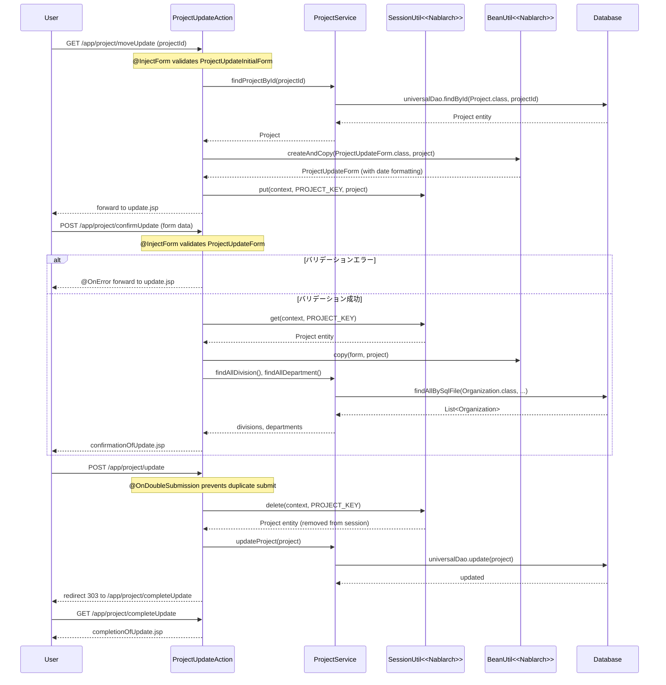

# Code Analysis: ProjectUpdateAction

**Generated**: 2026-03-13 17:46:09
**Target**: project update processing (input, confirmation, DB update, completion)
**Modules**: proman-web
**Analysis Duration**: approx. 4m 43s

---

## Overview

`ProjectUpdateAction`はNablarch 5 Webアプリケーションにおけるプロジェクト更新機能を担うアクションクラスです。プロジェクト詳細画面からの遷移を受け付け、更新画面表示・確認画面表示・DB更新・完了画面表示の4ステップから成るPRGパターン（Post-Redirect-Get）を実装しています。

セッションストアにプロジェクトエンティティを保持しながら画面遷移し、`@InjectForm`によるバリデーション、`BeanUtil`によるBean変換、`SessionUtil`によるセッション操作、`@OnDoubleSubmission`による二重サブミット防止を組み合わせた典型的なNablarch 5更新処理パターンです。

---

## Architecture

### Dependency Graph

```mermaid
classDiagram
    class ProjectUpdateAction
    class ProjectUpdateInitialForm {
        <<Form>>
    }
    class ProjectUpdateForm {
        <<Form>>
    }
    class ProjectService
    class Project {
        <<Entity>>
    }
    class Organization {
        <<Entity>>
    }
    class DaoContext {
        <<Nablarch>>
    }
    class SessionUtil {
        <<Nablarch>>
    }
    class BeanUtil {
        <<Nablarch>>
    }
    class ExecutionContext {
        <<Nablarch>>
    }

    ProjectUpdateAction ..> ProjectUpdateInitialForm : validates
    ProjectUpdateAction ..> ProjectUpdateForm : validates
    ProjectUpdateAction ..> ProjectService : delegates to
    ProjectUpdateAction ..> SessionUtil : uses
    ProjectUpdateAction ..> BeanUtil : uses
    ProjectUpdateAction ..> ExecutionContext : uses
    ProjectService ..> DaoContext : queries/persists
    ProjectService ..> Project : creates
    ProjectService ..> Organization : creates
    ProjectUpdateForm ..|> Serializable
    ProjectUpdateInitialForm ..|> Serializable
```



**Note**: This diagram uses Mermaid `classDiagram` syntax to show class names and their relationships. Use `--|>` for inheritance (extends/implements) and `..>` for dependencies (uses/creates).

### Component Summary

| Component | Role | Type | Dependencies |
|-----------|------|------|--------------|
| ProjectUpdateAction | プロジェクト更新処理のコントローラ | Action | ProjectUpdateInitialForm, ProjectUpdateForm, ProjectService, SessionUtil, BeanUtil, ExecutionContext |
| ProjectUpdateInitialForm | 詳細画面→更新画面遷移時のパラメータ受付 | Form | なし |
| ProjectUpdateForm | 更新画面の入力値受付・バリデーション | Form | DateRelationUtil |
| ProjectService | プロジェクト・組織データのDB操作 | Service | DaoContext (UniversalDao) |
| Project | プロジェクト情報エンティティ | Entity | なし |
| Organization | 組織（事業部・部門）エンティティ | Entity | なし |

---

## Flow

### Processing Flow

プロジェクト更新処理は以下の4フェーズで構成されます。

**1. 更新画面表示 (`index`)**
- `@InjectForm(form = ProjectUpdateInitialForm.class)` でプロジェクトIDをバリデーション
- `ProjectService#findProjectById` でプロジェクトエンティティをDBから取得
- `BeanUtil#createAndCopy` でエンティティからフォームへ変換（日付フォーマット変換含む）
- プロジェクトエンティティをセッションストアに保存（楽観的ロック対応）
- 更新画面にフォワード

**2. 確認画面表示 (`confirmUpdate`)**
- `@InjectForm(form = ProjectUpdateForm.class, prefix = "form")` で入力値をバリデーション
- バリデーションエラー時は `@OnError` により更新入力画面に戻る
- セッションストアのプロジェクトエンティティにフォームの値をコピー（`BeanUtil#copy`）
- 事業部・部門プルダウンをDBから取得してリクエストスコープに設定
- 確認画面を表示

**3. DB更新 (`update`)**
- `@OnDoubleSubmission` で二重サブミット防止
- セッションストアからプロジェクトエンティティを取得・削除（`SessionUtil#delete`）
- `ProjectService#updateProject`（内部で `DaoContext#update`）でDB更新
- 更新完了画面にリダイレクト（PRGパターン）

**4. 完了画面表示 (`completeUpdate`)**
- 更新完了画面を表示

### Sequence Diagram



---

## Components

### ProjectUpdateAction

**ファイル**: [ProjectUpdateAction.java](../../.lw/nab-official/v5/nablarch-system-development-guide/Sample_Project/Source_Code/proman-project/proman-web/src/main/java/com/nablarch/example/proman/web/project/ProjectUpdateAction.java)

**役割**: プロジェクト更新機能のメインコントローラ。更新画面表示・確認・DB更新・完了の4つのアクションメソッドを持つ。

**主要メソッド**:
- `index(HttpRequest, ExecutionContext)` (L35-43): プロジェクト詳細画面からの遷移を受け、DBからプロジェクトを取得しセッションに保存して更新画面を表示
- `confirmUpdate(HttpRequest, ExecutionContext)` (L54-62): 入力値をバリデーション後、セッションのエンティティにコピーして確認画面を表示
- `update(HttpRequest, ExecutionContext)` (L72-77): セッションのエンティティをDB更新してリダイレクト
- `buildFormFromEntity(Project, ProjectService)` (L111-125): エンティティからフォームを生成（日付フォーマット変換・組織情報取得を含む）

**依存**:
- `ProjectUpdateInitialForm`, `ProjectUpdateForm`: 入力受付フォーム
- `ProjectService`: DB操作の委譲先
- `SessionUtil`: セッションストア操作
- `BeanUtil`: Bean間コピー

**実装ポイント**:
- セッションキー `PROJECT_KEY = "projectUpdateActionProject"` で一貫してプロジェクトを管理
- `index`でセッションに保存、`update`で`SessionUtil.delete`によりセッションから取り出しつつ削除（楽観的ロック対応）

---

### ProjectUpdateInitialForm

**ファイル**: [ProjectUpdateInitialForm.java](../../.lw/nab-official/v5/nablarch-system-development-guide/Sample_Project/Source_Code/proman-project/proman-web/src/main/java/com/nablarch/example/proman/web/project/ProjectUpdateInitialForm.java)

**役割**: 詳細画面から更新画面への遷移時にプロジェクトIDを受け取るフォーム。

**主要フィールド**:
- `projectId` (L15): `@Required` + `@Domain("projectId")` でバリデーション

---

### ProjectUpdateForm

**ファイル**: [ProjectUpdateForm.java](../../.lw/nab-official/v5/nablarch-system-development-guide/Sample_Project/Source_Code/proman-project/proman-web/src/main/java/com/nablarch/example/proman/web/project/ProjectUpdateForm.java)

**役割**: 更新画面の入力値を受け付けるフォーム。各フィールドに`@Required`/`@Domain`バリデーションアノテーションを持つ。

**主要フィールド**:
- `projectName`, `projectType`, `projectClass` (L27-41): 必須・ドメインバリデーション
- `projectStartDate`, `projectEndDate` (L47-55): 日付バリデーション
- `divisionId`, `organizationId` (L61-69): 組織IDバリデーション

**バリデーションメソッド**:
- `isValidProjectPeriod()` (L329): `@AssertTrue` によりプロジェクト開始日≦終了日の相関チェック

---

### ProjectService

**ファイル**: [ProjectService.java](../../.lw/nab-official/v5/nablarch-system-development-guide/Sample_Project/Source_Code/proman-project/proman-web/src/main/java/com/nablarch/example/proman/web/project/ProjectService.java)

**役割**: プロジェクト・組織データのDB操作サービス。`DaoContext`（UniversalDao）を使用したDB操作をカプセル化。

**主要メソッド**:
- `findProjectById(Integer)` (L124-126): プロジェクトを主キー検索
- `updateProject(Project)` (L89-91): プロジェクトを更新
- `findAllDivision()` (L50-52): 全事業部を取得（SQLファイル使用）
- `findAllDepartment()` (L59-61): 全部門を取得（SQLファイル使用）
- `findOrganizationById(Integer)` (L70-73): 組織を主キー検索

**依存**: `DaoContext`（`DaoFactory.create()`で生成）

---

## Nablarch Framework Usage

### @InjectForm

**クラス**: `nablarch.common.web.interceptor.InjectForm`

**説明**: リクエストパラメータをフォームクラスにバインドし、Bean Validationを実行するインターセプタアノテーション。バリデーション済みフォームはリクエストスコープに格納される。

**使用方法**:
```java
@InjectForm(form = ProjectUpdateForm.class, prefix = "form")
@OnError(type = ApplicationException.class, path = "forward:///app/project/moveUpdate")
public HttpResponse confirmUpdate(HttpRequest request, ExecutionContext context) {
    ProjectUpdateForm form = context.getRequestScopedVar("form");
    // ...
}
```

**重要ポイント**:
- ✅ **必ず`@OnError`と組み合わせる**: バリデーションエラー時のフォワード先を指定する
- ✅ **フォームはリクエストスコープから取得**: `context.getRequestScopedVar("form")`で取得する
- ⚠️ **prefixの指定**: HTML側の`<n:text name="form.projectName">`に対応するprefixを指定する必要がある
- 💡 **入力値を直接セッションに格納しない**: バリデーション済みフォームをエンティティに変換してからセッションに保存する

**このコードでの使い方**:
- `index()`でProjectUpdateInitialFormにバインド（prefixなし）
- `confirmUpdate()`でProjectUpdateFormにバインド（`prefix = "form"`）

**詳細**: [Web Application Getting Started Project Update](../../.claude/skills/nabledge-5/docs/processing-pattern/web-application/web-application-getting-started-project-update.md)

---

### @OnDoubleSubmission

**クラス**: `nablarch.common.web.token.OnDoubleSubmission`

**説明**: トークンベースの二重サブミット防止機能。JSP側で`<n:form useToken="true">`と組み合わせて使用する。

**使用方法**:
```java
@OnDoubleSubmission
public HttpResponse update(HttpRequest request, ExecutionContext context) {
    final Project project = SessionUtil.delete(context, PROJECT_KEY);
    ProjectService service = new ProjectService();
    service.updateProject(project);
    return new HttpResponse(303, "redirect:///app/project/completeUpdate");
}
```

**重要ポイント**:
- ✅ **JSP側でuseToken="true"を設定**: `<n:form useToken="true">`でトークンを生成する
- ✅ **allowDoubleSubmission="false"を確認ボタンに設定**: 確認画面の確定ボタンに`allowDoubleSubmission="false"`を指定する
- ⚠️ **リダイレクトで完了**: `update`後はブラウザリロードによる再サブミット防止のため303リダイレクトを使用する
- 💡 **PRGパターン**: Post-Redirect-GetパターンによりブラウザのF5更新による重複処理を防ぐ

**このコードでの使い方**:
- `update()`メソッドに付与してDB更新の二重実行を防止

**詳細**: [Web Application Getting Started Project Update](../../.claude/skills/nabledge-5/docs/processing-pattern/web-application/web-application-getting-started-project-update.md)

---

### SessionUtil

**クラス**: `nablarch.common.web.session.SessionUtil`

**説明**: Nablarchのセッションストアに対するユーティリティクラス。セッションへのデータの保存・取得・削除を行う。

**使用方法**:
```java
// 保存
SessionUtil.put(context, PROJECT_KEY, project);
// 取得
Project project = SessionUtil.get(context, PROJECT_KEY);
// 取得＆削除
Project project = SessionUtil.delete(context, PROJECT_KEY);
```

**重要ポイント**:
- ✅ **フォームをそのままセッションに格納しない**: バリデーション済みエンティティに変換してから保存する
- ✅ **更新完了時はdeleteで取得する**: `SessionUtil.delete`を使うことでセッションからも同時に削除できる
- ⚠️ **セッションに格納するオブジェクトはSerializableを実装**: セッションストアの種類によってはシリアライズが必要
- 💡 **楽観的ロック対応**: 編集開始時のエンティティをセッションに保存することで、確認→更新間のデータ変更を検知できる

**このコードでの使い方**:
- `index()`: `SessionUtil.put`でProjectエンティティを保存
- `confirmUpdate()`: `SessionUtil.get`でエンティティを取得（セッションには残す）
- `update()`: `SessionUtil.delete`でエンティティを取得しセッションから削除

**詳細**: [Web Application Getting Started Project Update](../../.claude/skills/nabledge-5/docs/processing-pattern/web-application/web-application-getting-started-project-update.md)

---

### BeanUtil

**クラス**: `nablarch.core.beans.BeanUtil`

**説明**: JavaBeans間のプロパティコピーを提供するユーティリティクラス。同名プロパティを自動的に変換・コピーする。

**使用方法**:
```java
// コピーしながら新規インスタンス生成
ProjectUpdateForm form = BeanUtil.createAndCopy(ProjectUpdateForm.class, project);
// 既存インスタンスへのコピー
BeanUtil.copy(form, project);
```

**重要ポイント**:
- ✅ **プロパティ名を一致させる**: コピー元・コピー先のプロパティ名が一致していないと値がコピーされない
- 💡 **型変換も実施**: String→Date等の型変換も自動で行われる（対応する型変換のみ）
- ⚠️ **全プロパティがコピーされる**: 意図しないプロパティもコピーされる可能性があるため注意

**このコードでの使い方**:
- `buildFormFromEntity()` (L112): `createAndCopy`でProjectからProjectUpdateFormを生成
- `confirmUpdate()` (L57): `copy`でProjectUpdateFormの値をProjectエンティティにコピー

**詳細**: [Web Application Getting Started Project Update](../../.claude/skills/nabledge-5/docs/processing-pattern/web-application/web-application-getting-started-project-update.md)

---

### DaoContext (UniversalDao)

**クラス**: `nablarch.common.dao.DaoContext`

**説明**: データベースアクセスのための汎用DAOインターフェース。主キーによるCRUD操作やSQLファイルを使った検索を提供する。

**使用方法**:
```java
// 主キー検索
Project project = universalDao.findById(Project.class, projectId);
// 更新（楽観的ロック付き）
universalDao.update(project);
// SQLファイルを使った全件検索
List<Organization> list = universalDao.findAllBySqlFile(Organization.class, "FIND_ALL_DIVISION");
```

**重要ポイント**:
- ✅ **update()は楽観的ロックを実行**: エンティティに`@Version`プロパティがある場合、排他制御エラー時は`OptimisticLockException`が発生する
- ✅ **findByIdは対象なし時にNoDataExceptionを送出**: 存在しないIDを指定すると例外が発生する
- 💡 **SQLファイルで複雑な検索**: `findAllBySqlFile`でSQLIDを指定して外部SQLを実行できる
- ⚡ **ページング検索**: `per(n).page(m).findAllBySqlFile()`でページング検索が可能

**このコードでの使い方**:
- `ProjectService#findProjectById`: `findById`でプロジェクトを主キー検索
- `ProjectService#updateProject`: `update`でプロジェクトをDB更新（楽観的ロック付き）
- `ProjectService#findAllDivision/findAllDepartment`: `findAllBySqlFile`で組織を一覧取得
- `ProjectService#findOrganizationById`: `findById`で組織を主キー検索

**詳細**: [Web Application Getting Started Project Delete](../../.claude/skills/nabledge-5/docs/processing-pattern/web-application/web-application-getting-started-project-delete.md)

---

## References

### Source Files

- [ProjectUpdateAction.java (.lw/nab-official/v5/nablarch-system-development-guide/en/Sample_Project/Source_Code/proman-project/proman-web/src/main/java/com/nablarch/example/proman/web/project)](../../.lw/nab-official/v5/nablarch-system-development-guide/en/Sample_Project/Source_Code/proman-project/proman-web/src/main/java/com/nablarch/example/proman/web/project/ProjectUpdateAction.java) - ProjectUpdateAction
- [ProjectUpdateAction.java (.lw/nab-official/v5/nablarch-system-development-guide/Sample_Project/Source_Code/proman-project/proman-web/src/main/java/com/nablarch/example/proman/web/project)](../../.lw/nab-official/v5/nablarch-system-development-guide/Sample_Project/Source_Code/proman-project/proman-web/src/main/java/com/nablarch/example/proman/web/project/ProjectUpdateAction.java) - ProjectUpdateAction
- [ProjectUpdateAction.java (.lw/nab-official/v6/nablarch-system-development-guide/en/Sample_Project/Source_Code/proman-project/proman-web/src/main/java/com/nablarch/example/proman/web/project)](../../.lw/nab-official/v6/nablarch-system-development-guide/en/Sample_Project/Source_Code/proman-project/proman-web/src/main/java/com/nablarch/example/proman/web/project/ProjectUpdateAction.java) - ProjectUpdateAction
- [ProjectUpdateAction.java (.lw/nab-official/v6/nablarch-system-development-guide/Sample_Project/Source_Code/proman-project/proman-web/src/main/java/com/nablarch/example/proman/web/project)](../../.lw/nab-official/v6/nablarch-system-development-guide/Sample_Project/Source_Code/proman-project/proman-web/src/main/java/com/nablarch/example/proman/web/project/ProjectUpdateAction.java) - ProjectUpdateAction
- [ProjectUpdateForm.java (.lw/nab-official/v5/nablarch-system-development-guide/en/Sample_Project/Source_Code/proman-project/proman-web/src/main/java/com/nablarch/example/proman/web/project)](../../.lw/nab-official/v5/nablarch-system-development-guide/en/Sample_Project/Source_Code/proman-project/proman-web/src/main/java/com/nablarch/example/proman/web/project/ProjectUpdateForm.java) - ProjectUpdateForm
- [ProjectUpdateForm.java (.lw/nab-official/v5/nablarch-system-development-guide/Sample_Project/Source_Code/proman-project/proman-web/src/main/java/com/nablarch/example/proman/web/project)](../../.lw/nab-official/v5/nablarch-system-development-guide/Sample_Project/Source_Code/proman-project/proman-web/src/main/java/com/nablarch/example/proman/web/project/ProjectUpdateForm.java) - ProjectUpdateForm
- [ProjectUpdateForm.java (.lw/nab-official/v6/nablarch-system-development-guide/en/Sample_Project/Source_Code/proman-project/proman-web/src/main/java/com/nablarch/example/proman/web/project)](../../.lw/nab-official/v6/nablarch-system-development-guide/en/Sample_Project/Source_Code/proman-project/proman-web/src/main/java/com/nablarch/example/proman/web/project/ProjectUpdateForm.java) - ProjectUpdateForm
- [ProjectUpdateForm.java (.lw/nab-official/v6/nablarch-system-development-guide/Sample_Project/Source_Code/proman-project/proman-web/src/main/java/com/nablarch/example/proman/web/project)](../../.lw/nab-official/v6/nablarch-system-development-guide/Sample_Project/Source_Code/proman-project/proman-web/src/main/java/com/nablarch/example/proman/web/project/ProjectUpdateForm.java) - ProjectUpdateForm
- [ProjectUpdateInitialForm.java (.lw/nab-official/v5/nablarch-system-development-guide/en/Sample_Project/Source_Code/proman-project/proman-web/src/main/java/com/nablarch/example/proman/web/project)](../../.lw/nab-official/v5/nablarch-system-development-guide/en/Sample_Project/Source_Code/proman-project/proman-web/src/main/java/com/nablarch/example/proman/web/project/ProjectUpdateInitialForm.java) - ProjectUpdateInitialForm
- [ProjectUpdateInitialForm.java (.lw/nab-official/v5/nablarch-system-development-guide/Sample_Project/Source_Code/proman-project/proman-web/src/main/java/com/nablarch/example/proman/web/project)](../../.lw/nab-official/v5/nablarch-system-development-guide/Sample_Project/Source_Code/proman-project/proman-web/src/main/java/com/nablarch/example/proman/web/project/ProjectUpdateInitialForm.java) - ProjectUpdateInitialForm
- [ProjectUpdateInitialForm.java (.lw/nab-official/v6/nablarch-system-development-guide/en/Sample_Project/Source_Code/proman-project/proman-web/src/main/java/com/nablarch/example/proman/web/project)](../../.lw/nab-official/v6/nablarch-system-development-guide/en/Sample_Project/Source_Code/proman-project/proman-web/src/main/java/com/nablarch/example/proman/web/project/ProjectUpdateInitialForm.java) - ProjectUpdateInitialForm
- [ProjectUpdateInitialForm.java (.lw/nab-official/v6/nablarch-system-development-guide/Sample_Project/Source_Code/proman-project/proman-web/src/main/java/com/nablarch/example/proman/web/project)](../../.lw/nab-official/v6/nablarch-system-development-guide/Sample_Project/Source_Code/proman-project/proman-web/src/main/java/com/nablarch/example/proman/web/project/ProjectUpdateInitialForm.java) - ProjectUpdateInitialForm
- [ProjectService.java (.lw/nab-official/v5/nablarch-system-development-guide/en/Sample_Project/Source_Code/proman-project/proman-web/src/main/java/com/nablarch/example/proman/web/project)](../../.lw/nab-official/v5/nablarch-system-development-guide/en/Sample_Project/Source_Code/proman-project/proman-web/src/main/java/com/nablarch/example/proman/web/project/ProjectService.java) - ProjectService
- [ProjectService.java (.lw/nab-official/v5/nablarch-system-development-guide/Sample_Project/Source_Code/proman-project/proman-web/src/main/java/com/nablarch/example/proman/web/project)](../../.lw/nab-official/v5/nablarch-system-development-guide/Sample_Project/Source_Code/proman-project/proman-web/src/main/java/com/nablarch/example/proman/web/project/ProjectService.java) - ProjectService
- [ProjectService.java (.lw/nab-official/v6/nablarch-system-development-guide/en/Sample_Project/Source_Code/proman-project/proman-web/src/main/java/com/nablarch/example/proman/web/project)](../../.lw/nab-official/v6/nablarch-system-development-guide/en/Sample_Project/Source_Code/proman-project/proman-web/src/main/java/com/nablarch/example/proman/web/project/ProjectService.java) - ProjectService
- [ProjectService.java (.lw/nab-official/v6/nablarch-system-development-guide/Sample_Project/Source_Code/proman-project/proman-web/src/main/java/com/nablarch/example/proman/web/project)](../../.lw/nab-official/v6/nablarch-system-development-guide/Sample_Project/Source_Code/proman-project/proman-web/src/main/java/com/nablarch/example/proman/web/project/ProjectService.java) - ProjectService

### Knowledge Base (Nabledge-5)

- [Web Application Getting Started Project Update](../../.claude/skills/nabledge-5/docs/processing-pattern/web-application/web-application-getting-started-project-update.md)
- [Web Application Getting Started Project Bulk Update](../../.claude/skills/nabledge-5/docs/processing-pattern/web-application/web-application-getting-started-project-bulk-update.md)
- [Web Application Getting Started Project Delete](../../.claude/skills/nabledge-5/docs/processing-pattern/web-application/web-application-getting-started-project-delete.md)

### Official Documentation

- [Domain](https://nablarch.github.io/docs/LATEST/javadoc/nablarch/core/validation/ee/Domain.html)
- [Index](https://nablarch.github.io/docs/LATEST/doc/application_framework/application_framework/web/getting_started/project_bulk_update/index.html)
- [Index](https://nablarch.github.io/docs/LATEST/doc/application_framework/application_framework/web/getting_started/project_delete/index.html)
- [Index](https://nablarch.github.io/docs/LATEST/doc/application_framework/application_framework/web/getting_started/project_update/index.html)
- [NoDataException](https://nablarch.github.io/docs/LATEST/javadoc/nablarch/common/dao/NoDataException.html)
- [OnDoubleSubmission](https://nablarch.github.io/docs/LATEST/javadoc/nablarch/common/web/token/OnDoubleSubmission.html)
- [OptimisticLockException](https://nablarch.github.io/docs/LATEST/javadoc/javax/persistence/OptimisticLockException.html)
- [Required](https://nablarch.github.io/docs/LATEST/javadoc/nablarch/core/validation/ee/Required.html)
- [ResourceLocator](https://nablarch.github.io/docs/LATEST/javadoc/nablarch/fw/web/ResourceLocator.html)
- [UniversalDao](https://nablarch.github.io/docs/LATEST/javadoc/nablarch/common/dao/UniversalDao.html)
- [Valid](https://nablarch.github.io/docs/LATEST/javadoc/javax/validation/Valid.html)

---

**Note**: This documentation was generated by the code-analysis workflow of the nabledge-5 skill.
