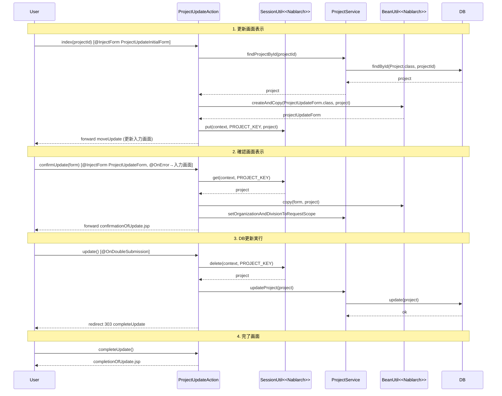

# Code Analysis: ProjectUpdateAction

**Generated**: 2026-03-13 17:52:45
**Target**: プロジェクト更新機能のアクションクラス
**Modules**: proman-web
**Analysis Duration**: approx. 3m 17s

---

## Overview

`ProjectUpdateAction` はプロジェクト管理Webアプリケーション（proman-web）におけるプロジェクト更新機能の業務アクションクラスである。詳細画面からの更新画面遷移、入力値のバリデーション、確認画面表示、DB更新、完了画面表示という一連のCRUD更新フローを実装する。

セッションストアを活用した楽観的ロック制御と二重サブミット防止を組み合わせることで、安全なデータ更新を実現している。主要なNablarchコンポーネントとして `@InjectForm`（バリデーション）、`SessionUtil`（セッションストア）、`@OnDoubleSubmission`（二重サブミット防止）、`BeanUtil`（Bean変換）を使用する。

---

## Architecture

### Dependency Graph

```mermaid
classDiagram
    class ProjectUpdateAction
    class ProjectUpdateInitialForm {
        <<Form>>
    }
    class ProjectUpdateForm {
        <<Form>>
    }
    class ProjectService
    class Project {
        <<Entity>>
    }
    class Organization {
        <<Entity>>
    }
    class DaoContext {
        <<Nablarch>>
    }
    class SessionUtil {
        <<Nablarch>>
    }
    class BeanUtil {
        <<Nablarch>>
    }
    class InjectForm {
        <<Nablarch>>
    }
    class OnDoubleSubmission {
        <<Nablarch>>
    }
    class ExecutionContext {
        <<Nablarch>>
    }

    ProjectUpdateAction ..> ProjectUpdateInitialForm : validates
    ProjectUpdateAction ..> ProjectUpdateForm : validates
    ProjectUpdateAction ..> ProjectService : delegates to
    ProjectUpdateAction ..> SessionUtil : stores/retrieves
    ProjectUpdateAction ..> BeanUtil : copies
    ProjectUpdateAction ..> ExecutionContext : uses
    ProjectService ..> DaoContext : queries/persists
    ProjectService ..> Project : returns
    ProjectService ..> Organization : returns
    ProjectUpdateInitialForm ..|> Serializable
    ProjectUpdateForm ..|> Serializable
```



**Note**: This diagram uses Mermaid `classDiagram` syntax to show class names and their relationships. Use `--|>` for inheritance (extends/implements) and `..>` for dependencies (uses/creates).

### Component Summary

| Component | Role | Type | Dependencies |
|-----------|------|------|--------------|
| ProjectUpdateAction | プロジェクト更新フロー制御 | Action | ProjectUpdateInitialForm, ProjectUpdateForm, ProjectService, SessionUtil, BeanUtil, ExecutionContext |
| ProjectUpdateForm | 更新入力値受付・バリデーション | Form | DateRelationUtil |
| ProjectUpdateInitialForm | 詳細画面→更新画面のパラメータ受付 | Form | なし |
| ProjectService | プロジェクト・組織のDB操作 | Service | DaoContext (UniversalDao) |
| Project | プロジェクトエンティティ | Entity | なし |
| Organization | 組織エンティティ | Entity | なし |

---

## Flow

### Processing Flow

更新フローは5段階で構成される。

1. **更新画面表示** (`index`): 詳細画面から受け取った `projectId` でDB検索し、既存データをフォームに設定して更新入力画面を表示する。検索結果をセッションストアに保存（楽観的ロック用）。
2. **確認画面表示** (`confirmUpdate`): 入力値を `@InjectForm` でバリデーションし、セッションのエンティティに `BeanUtil.copy` で更新情報をマージして確認画面を表示する。バリデーションエラー時は `@OnError` により入力画面に戻る。
3. **DB更新実行** (`update`): `@OnDoubleSubmission` で二重サブミット防止後、セッションからエンティティを取り出し `ProjectService.updateProject` でDB更新。完了画面へリダイレクト（PRGパターン）。
4. **完了画面表示** (`completeUpdate`): 更新完了JSPを表示する。
5. **入力画面への戻り** (`backToEnterUpdate`): セッションのエンティティをフォームに変換して入力画面に再表示する。

### Sequence Diagram



---

## Components

### ProjectUpdateAction

**ファイル**: [ProjectUpdateAction.java](../../.lw/nab-official/v5/nablarch-system-development-guide/Sample_Project/Source_Code/proman-project/proman-web/src/main/java/com/nablarch/example/proman/web/project/ProjectUpdateAction.java)

**役割**: プロジェクト更新機能全体のフロー制御。5つの業務アクションメソッドで更新ライフサイクルを管理する。

**主要メソッド**:
- `index(L35-43)`: 詳細画面からの遷移を受け付け、DBからプロジェクトを取得して更新フォームを初期化する
- `confirmUpdate(L54-62)`: 入力値バリデーション後、セッションのエンティティに変更をマージして確認画面を表示する
- `update(L72-77)`: セッションからエンティティを取り出してDB更新し、完了画面へリダイレクトする
- `backToEnterUpdate(L97-102)`: セッションのエンティティをフォームに再変換して入力画面へ戻る
- `buildFormFromEntity(L111-125)`: エンティティからProjectUpdateFormを生成する内部ヘルパー（日付フォーマット、組織階層取得）

**依存関係**: `ProjectService`, `ProjectUpdateForm`, `ProjectUpdateInitialForm`, `SessionUtil`, `BeanUtil`, `DateUtil`, `ExecutionContext`

---

### ProjectUpdateForm

**ファイル**: [ProjectUpdateForm.java](../../.lw/nab-official/v5/nablarch-system-development-guide/Sample_Project/Source_Code/proman-project/proman-web/src/main/java/com/nablarch/example/proman/web/project/ProjectUpdateForm.java)

**役割**: 更新入力画面のフォーム。Bean Validationアノテーションで入力値バリデーションを定義する。

**主要メソッド**:
- `isValidProjectPeriod(L329)`: `@AssertTrue` で開始日・終了日の相関バリデーションを実装

**依存関係**: `DateRelationUtil`（日付相関チェック）

**特徴**: 全プロパティをString型で宣言。`@Required`・`@Domain` でバリデーションルールを定義。

---

### ProjectUpdateInitialForm

**ファイル**: [ProjectUpdateInitialForm.java](../../.lw/nab-official/v5/nablarch-system-development-guide/Sample_Project/Source_Code/proman-project/proman-web/src/main/java/com/nablarch/example/proman/web/project/ProjectUpdateInitialForm.java)

**役割**: 詳細画面から更新画面へ遷移する際の `projectId` パラメータ受付フォーム。

**依存関係**: なし（単純なパラメータホルダー）

---

### ProjectService

**ファイル**: [ProjectService.java](../../.lw/nab-official/v5/nablarch-system-development-guide/Sample_Project/Source_Code/proman-project/proman-web/src/main/java/com/nablarch/example/proman/web/project/ProjectService.java)

**役割**: プロジェクト・組織データのDB操作を担うサービスクラス。

**主要メソッド**:
- `findProjectById(L124-126)`: プロジェクトIDでProject取得（`DaoContext#findById`）
- `updateProject(L89-91)`: Project更新（`DaoContext#update`）
- `findOrganizationById(L70-73)`: 組織IDでOrganization取得
- `findAllDivision(L50-52)` / `findAllDepartment(L59-61)`: 全事業部/全部門一覧取得

**依存関係**: `DaoContext`（UniversalDao実装）、`DaoFactory`

---

## Nablarch Framework Usage

### @InjectForm

**クラス**: `nablarch.common.web.interceptor.InjectForm`

**説明**: 業務アクションメソッドのインターセプターとして、リクエストパラメータをフォームクラスにバインドしBean Validationを実行する。

**使用方法**:
```java
@InjectForm(form = ProjectUpdateForm.class, prefix = "form")
@OnError(type = ApplicationException.class, path = "forward:///app/project/moveUpdate")
public HttpResponse confirmUpdate(HttpRequest request, ExecutionContext context) {
    ProjectUpdateForm form = context.getRequestScopedVar("form");
    // ...
}
```

**重要ポイント**:
- ✅ **`@OnError` と併用必須**: バリデーションエラー時の遷移先を `@OnError` で指定する
- ✅ **フォームはリクエストスコープから取得**: バリデーション済みフォームは `context.getRequestScopedVar("form")` で取得する
- ⚠️ **prefix指定**: 画面から `form.xxx` 形式で送信する場合は `prefix = "form"` を指定する

**このコードでの使い方**:
- `index(L34)`: `ProjectUpdateInitialForm` をバインドして `projectId` を取得
- `confirmUpdate(L52-53)`: `ProjectUpdateForm` をバインドして更新入力値をバリデーション

**詳細**: [Web Application Getting Started Project Update](../../.claude/skills/nabledge-5/docs/processing-pattern/web-application/web-application-getting-started-project-update.md)

---

### @OnError

**クラス**: `nablarch.fw.web.interceptor.OnError`

**説明**: 業務アクションメソッドで指定した例外が発生した場合に、指定したパスへ遷移するインターセプター。

**使用方法**:
```java
@OnError(type = ApplicationException.class, path = "forward:///app/project/moveUpdate")
public HttpResponse confirmUpdate(HttpRequest request, ExecutionContext context) {
```

**重要ポイント**:
- ✅ **`ApplicationException` を指定**: Bean Validationエラーは `ApplicationException` として伝播する
- 💡 **forward vs redirect**: エラー時の入力画面再表示は `forward://` を使用してリクエストスコープを保持する

**このコードでの使い方**:
- `confirmUpdate(L53)`: バリデーションエラー時に更新入力画面（`moveUpdate`）へフォーワード

---

### SessionUtil

**クラス**: `nablarch.common.web.session.SessionUtil`

**説明**: セッションストアへのエンティティの保存・取得・削除を行うユーティリティクラス。

**使用方法**:
```java
// 保存
SessionUtil.put(context, PROJECT_KEY, project);
// 取得
Project project = SessionUtil.get(context, PROJECT_KEY);
// 取得して削除
Project project = SessionUtil.delete(context, PROJECT_KEY);
```

**重要ポイント**:
- ✅ **フォームをセッションに格納しない**: フォームをそのままセッションに保存せず、エンティティに変換してから保存する
- ✅ **更新完了後はセッション削除**: `update()` では `SessionUtil.delete` でエンティティを取り出しつつセッションをクリアする
- 💡 **楽観的ロックの実現**: 更新開始時のエンティティをセッションに保存し、確認→更新フローを通じて同一エンティティを使い回す

**このコードでの使い方**:
- `index(L41)`: `SessionUtil.put` でプロジェクトエンティティをセッションに保存
- `confirmUpdate(L56)`: `SessionUtil.get` でセッションからエンティティを取得
- `update(L73)`: `SessionUtil.delete` でエンティティを取得しつつセッションをクリア
- `backToEnterUpdate(L98)`: `SessionUtil.get` でエンティティを再取得して入力画面に戻る

**詳細**: [Web Application Client_create2](../../.claude/skills/nabledge-5/docs/processing-pattern/web-application/web-application-client_create2.md)

---

### @OnDoubleSubmission

**クラス**: `nablarch.common.web.token.OnDoubleSubmission`

**説明**: トークンベースの二重サブミット防止インターセプター。JSPの `<n:form useToken="true">` と組み合わせて使用する。

**使用方法**:
```java
@OnDoubleSubmission
public HttpResponse update(HttpRequest request, ExecutionContext context) {
    // DB更新処理
}
```

**重要ポイント**:
- ✅ **DB変更を伴うメソッドに付与**: insert/update/deleteを実行するメソッドに必ず付与する
- ✅ **JSP側でトークン生成**: `<n:form useToken="true">` でトークンを埋め込み、`allowDoubleSubmission="false"` でクライアント側も制御
- 💡 **PRGパターンと組み合わせ**: 二重サブミット防止後はリダイレクト（303）で完了画面へ遷移し、ブラウザ更新による再実行も防ぐ

**このコードでの使い方**:
- `update(L71)`: DB更新メソッドへの二重サブミット防止

**詳細**: [Web Application Client_create4](../../.claude/skills/nabledge-5/docs/processing-pattern/web-application/web-application-client_create4.md)

---

### BeanUtil

**クラス**: `nablarch.core.beans.BeanUtil`

**説明**: JavaBeansの値コピー・変換を行うユーティリティ。フォーム→エンティティ、エンティティ→フォームの変換に使用する。

**使用方法**:
```java
// フォームからエンティティへ値をコピー（新規インスタンス生成）
ProjectUpdateForm form = BeanUtil.createAndCopy(ProjectUpdateForm.class, project);
// 既存インスタンスへ値をコピー（上書き）
BeanUtil.copy(form, project);
```

**重要ポイント**:
- ✅ **プロパティ名の一致が必要**: フォームとエンティティのプロパティ名を一致させることで自動マッピングされる
- 💡 **createAndCopy vs copy**: 新規インスタンスが必要な場合は `createAndCopy`、既存インスタンスの更新は `copy`

**このコードでの使い方**:
- `buildFormFromEntity(L112)`: `BeanUtil.createAndCopy` でプロジェクトエンティティからフォームを生成
- `confirmUpdate(L57)`: `BeanUtil.copy` でフォームの更新値をセッション内エンティティへ反映

---

## References

### Source Files

- [ProjectUpdateAction.java (.lw/nab-official/v5/nablarch-system-development-guide/en/Sample_Project/Source_Code/proman-project/proman-web/src/main/java/com/nablarch/example/proman/web/project)](../../.lw/nab-official/v5/nablarch-system-development-guide/en/Sample_Project/Source_Code/proman-project/proman-web/src/main/java/com/nablarch/example/proman/web/project/ProjectUpdateAction.java) - ProjectUpdateAction
- [ProjectUpdateAction.java (.lw/nab-official/v5/nablarch-system-development-guide/Sample_Project/Source_Code/proman-project/proman-web/src/main/java/com/nablarch/example/proman/web/project)](../../.lw/nab-official/v5/nablarch-system-development-guide/Sample_Project/Source_Code/proman-project/proman-web/src/main/java/com/nablarch/example/proman/web/project/ProjectUpdateAction.java) - ProjectUpdateAction
- [ProjectUpdateAction.java (.lw/nab-official/v6/nablarch-system-development-guide/en/Sample_Project/Source_Code/proman-project/proman-web/src/main/java/com/nablarch/example/proman/web/project)](../../.lw/nab-official/v6/nablarch-system-development-guide/en/Sample_Project/Source_Code/proman-project/proman-web/src/main/java/com/nablarch/example/proman/web/project/ProjectUpdateAction.java) - ProjectUpdateAction
- [ProjectUpdateAction.java (.lw/nab-official/v6/nablarch-system-development-guide/Sample_Project/Source_Code/proman-project/proman-web/src/main/java/com/nablarch/example/proman/web/project)](../../.lw/nab-official/v6/nablarch-system-development-guide/Sample_Project/Source_Code/proman-project/proman-web/src/main/java/com/nablarch/example/proman/web/project/ProjectUpdateAction.java) - ProjectUpdateAction
- [ProjectUpdateForm.java (.lw/nab-official/v5/nablarch-system-development-guide/en/Sample_Project/Source_Code/proman-project/proman-web/src/main/java/com/nablarch/example/proman/web/project)](../../.lw/nab-official/v5/nablarch-system-development-guide/en/Sample_Project/Source_Code/proman-project/proman-web/src/main/java/com/nablarch/example/proman/web/project/ProjectUpdateForm.java) - ProjectUpdateForm
- [ProjectUpdateForm.java (.lw/nab-official/v5/nablarch-system-development-guide/Sample_Project/Source_Code/proman-project/proman-web/src/main/java/com/nablarch/example/proman/web/project)](../../.lw/nab-official/v5/nablarch-system-development-guide/Sample_Project/Source_Code/proman-project/proman-web/src/main/java/com/nablarch/example/proman/web/project/ProjectUpdateForm.java) - ProjectUpdateForm
- [ProjectUpdateForm.java (.lw/nab-official/v6/nablarch-system-development-guide/en/Sample_Project/Source_Code/proman-project/proman-web/src/main/java/com/nablarch/example/proman/web/project)](../../.lw/nab-official/v6/nablarch-system-development-guide/en/Sample_Project/Source_Code/proman-project/proman-web/src/main/java/com/nablarch/example/proman/web/project/ProjectUpdateForm.java) - ProjectUpdateForm
- [ProjectUpdateForm.java (.lw/nab-official/v6/nablarch-system-development-guide/Sample_Project/Source_Code/proman-project/proman-web/src/main/java/com/nablarch/example/proman/web/project)](../../.lw/nab-official/v6/nablarch-system-development-guide/Sample_Project/Source_Code/proman-project/proman-web/src/main/java/com/nablarch/example/proman/web/project/ProjectUpdateForm.java) - ProjectUpdateForm
- [ProjectUpdateInitialForm.java (.lw/nab-official/v5/nablarch-system-development-guide/en/Sample_Project/Source_Code/proman-project/proman-web/src/main/java/com/nablarch/example/proman/web/project)](../../.lw/nab-official/v5/nablarch-system-development-guide/en/Sample_Project/Source_Code/proman-project/proman-web/src/main/java/com/nablarch/example/proman/web/project/ProjectUpdateInitialForm.java) - ProjectUpdateInitialForm
- [ProjectUpdateInitialForm.java (.lw/nab-official/v5/nablarch-system-development-guide/Sample_Project/Source_Code/proman-project/proman-web/src/main/java/com/nablarch/example/proman/web/project)](../../.lw/nab-official/v5/nablarch-system-development-guide/Sample_Project/Source_Code/proman-project/proman-web/src/main/java/com/nablarch/example/proman/web/project/ProjectUpdateInitialForm.java) - ProjectUpdateInitialForm
- [ProjectUpdateInitialForm.java (.lw/nab-official/v6/nablarch-system-development-guide/en/Sample_Project/Source_Code/proman-project/proman-web/src/main/java/com/nablarch/example/proman/web/project)](../../.lw/nab-official/v6/nablarch-system-development-guide/en/Sample_Project/Source_Code/proman-project/proman-web/src/main/java/com/nablarch/example/proman/web/project/ProjectUpdateInitialForm.java) - ProjectUpdateInitialForm
- [ProjectUpdateInitialForm.java (.lw/nab-official/v6/nablarch-system-development-guide/Sample_Project/Source_Code/proman-project/proman-web/src/main/java/com/nablarch/example/proman/web/project)](../../.lw/nab-official/v6/nablarch-system-development-guide/Sample_Project/Source_Code/proman-project/proman-web/src/main/java/com/nablarch/example/proman/web/project/ProjectUpdateInitialForm.java) - ProjectUpdateInitialForm
- [ProjectService.java (.lw/nab-official/v5/nablarch-system-development-guide/en/Sample_Project/Source_Code/proman-project/proman-web/src/main/java/com/nablarch/example/proman/web/project)](../../.lw/nab-official/v5/nablarch-system-development-guide/en/Sample_Project/Source_Code/proman-project/proman-web/src/main/java/com/nablarch/example/proman/web/project/ProjectService.java) - ProjectService
- [ProjectService.java (.lw/nab-official/v5/nablarch-system-development-guide/Sample_Project/Source_Code/proman-project/proman-web/src/main/java/com/nablarch/example/proman/web/project)](../../.lw/nab-official/v5/nablarch-system-development-guide/Sample_Project/Source_Code/proman-project/proman-web/src/main/java/com/nablarch/example/proman/web/project/ProjectService.java) - ProjectService
- [ProjectService.java (.lw/nab-official/v6/nablarch-system-development-guide/en/Sample_Project/Source_Code/proman-project/proman-web/src/main/java/com/nablarch/example/proman/web/project)](../../.lw/nab-official/v6/nablarch-system-development-guide/en/Sample_Project/Source_Code/proman-project/proman-web/src/main/java/com/nablarch/example/proman/web/project/ProjectService.java) - ProjectService
- [ProjectService.java (.lw/nab-official/v6/nablarch-system-development-guide/Sample_Project/Source_Code/proman-project/proman-web/src/main/java/com/nablarch/example/proman/web/project)](../../.lw/nab-official/v6/nablarch-system-development-guide/Sample_Project/Source_Code/proman-project/proman-web/src/main/java/com/nablarch/example/proman/web/project/ProjectService.java) - ProjectService

### Knowledge Base (Nabledge-5)

- [Web Application Getting Started Project Update](../../.claude/skills/nabledge-5/docs/processing-pattern/web-application/web-application-getting-started-project-update.md)
- [Web Application Client_create2](../../.claude/skills/nabledge-5/docs/processing-pattern/web-application/web-application-client_create2.md)
- [Web Application Client_create4](../../.claude/skills/nabledge-5/docs/processing-pattern/web-application/web-application-client_create4.md)

### Official Documentation


- [BeanUtil](https://nablarch.github.io/docs/LATEST/javadoc/nablarch/core/beans/BeanUtil.html)
- [Client Create2](https://nablarch.github.io/docs/LATEST/doc/application_framework/application_framework/web/getting_started/client_create/client_create2.html)
- [Client Create4](https://nablarch.github.io/docs/LATEST/doc/application_framework/application_framework/web/getting_started/client_create/client_create4.html)
- [Index](https://nablarch.github.io/docs/LATEST/doc/application_framework/application_framework/web/getting_started/project_update/index.html)
- [InjectForm](https://nablarch.github.io/docs/LATEST/javadoc/nablarch/common/web/interceptor/InjectForm.html)
- [NoDataException](https://nablarch.github.io/docs/LATEST/javadoc/nablarch/common/dao/NoDataException.html)
- [OnDoubleSubmission](https://nablarch.github.io/docs/LATEST/javadoc/nablarch/common/web/token/OnDoubleSubmission.html)
- [OnError](https://nablarch.github.io/docs/LATEST/javadoc/nablarch/fw/web/interceptor/OnError.html)
- [Required](https://nablarch.github.io/docs/LATEST/javadoc/nablarch/core/validation/ee/Required.html)
- [ResourceLocator](https://nablarch.github.io/docs/LATEST/javadoc/nablarch/fw/web/ResourceLocator.html)
- [SessionUtil](https://nablarch.github.io/docs/LATEST/javadoc/nablarch/common/web/session/SessionUtil.html)
- [UniversalDao](https://nablarch.github.io/docs/LATEST/javadoc/nablarch/common/dao/UniversalDao.html)

---

**Note**: This documentation was generated by the code-analysis workflow of the nabledge-5 skill.
