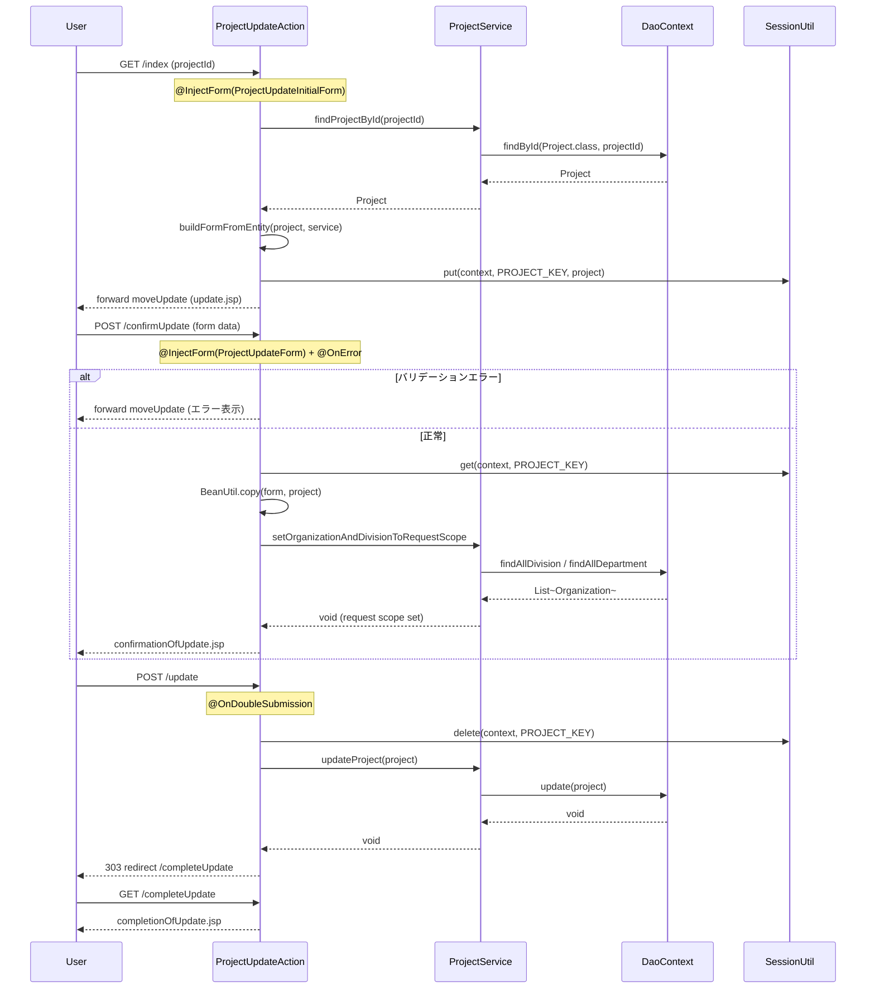

# Code Analysis: ProjectUpdateAction

**Generated**: 2026-03-13 17:57:18
**Target**: プロジェクト更新処理アクション
**Modules**: proman-web
**Analysis Duration**: approx. 3m 42s

---

## Overview

`ProjectUpdateAction` はNablarch Webアプリケーションにおけるプロジェクト更新機能のアクションクラスである。プロジェクト詳細画面から始まる「表示 → 入力 → 確認 → 更新完了」の一連のフローを実装する。

主要な処理は4つのアクションメソッドで構成される: `index`（更新画面表示）、`confirmUpdate`（確認画面表示）、`update`（DB更新実行）、`completeUpdate`（完了画面表示）。`ProjectService` を介してデータベースアクセスを行い、`SessionUtil` で編集中エンティティを画面間で受け渡す。バリデーションは `@InjectForm`、二重サブミット防止は `@OnDoubleSubmission`、エラー時の画面遷移は `@OnError` インターセプタで宣言的に処理する。

---

## Architecture

### Dependency Graph

```mermaid
classDiagram
    class ProjectUpdateAction
    class ProjectUpdateForm {
        <<Form>>
    }
    class ProjectUpdateInitialForm {
        <<Form>>
    }
    class ProjectService
    class Project {
        <<Entity>>
    }
    class Organization {
        <<Entity>>
    }
    class DaoContext {
        <<Nablarch>>
    }
    class SessionUtil {
        <<Nablarch>>
    }
    class BeanUtil {
        <<Nablarch>>
    }
    class ExecutionContext {
        <<Nablarch>>
    }

    ProjectUpdateInitialForm ..|> Serializable
    ProjectUpdateForm ..|> Serializable
    ProjectUpdateAction ..> ProjectUpdateInitialForm : validates
    ProjectUpdateAction ..> ProjectUpdateForm : validates
    ProjectUpdateAction ..> ProjectService : delegates to
    ProjectUpdateAction ..> SessionUtil : uses
    ProjectUpdateAction ..> BeanUtil : copies
    ProjectUpdateAction ..> ExecutionContext : uses
    ProjectService ..> DaoContext : queries/persists
    ProjectService ..> Project : queries/persists
    ProjectService ..> Organization : queries
```



**Note**: This diagram uses Mermaid `classDiagram` syntax to show class names and their relationships. Use `--|>` for inheritance (extends/implements) and `..>` for dependencies (uses/creates).

### Component Summary

| Component | Role | Type | Dependencies |
|-----------|------|------|--------------|
| ProjectUpdateAction | プロジェクト更新フロー制御 | Action | ProjectUpdateForm, ProjectUpdateInitialForm, ProjectService, SessionUtil, BeanUtil |
| ProjectUpdateForm | 更新入力値のバリデーション | Form | DateRelationUtil |
| ProjectUpdateInitialForm | 更新画面遷移時のID受付 | Form | なし |
| ProjectService | DBアクセスの委譲先 | Service | DaoContext, Project, Organization |
| Project | プロジェクトエンティティ | Entity | なし |
| Organization | 組織エンティティ | Entity | なし |

---

## Flow

### Processing Flow

プロジェクト更新はPRGパターンで実装されており、4ステップで完結する。

1. **更新画面表示 (`index`)**: `@InjectForm(ProjectUpdateInitialForm)` でプロジェクトIDを受け取り、DBから `Project` を取得してセッションに保存。組織情報も取得してフォームに設定し、更新入力画面へフォワード。
2. **確認画面表示 (`confirmUpdate`)**: `@InjectForm(ProjectUpdateForm)` で入力値をバリデーション。`@OnError` でバリデーションエラー時は更新画面へ戻る。セッションから `Project` を取得し `BeanUtil.copy` でフォームの値を反映。確認画面へフォワード。
3. **DB更新 (`update`)**: `@OnDoubleSubmission` で二重サブミットを防止。セッションから `Project` を取得（同時にセッション削除）し `ProjectService.updateProject` で更新。303リダイレクトで完了画面へ遷移。
4. **完了画面表示 (`completeUpdate`)**: 更新完了画面のJSPをレスポンスとして返す。

また `indexSetPullDown` と `backToEnterUpdate` は画面遷移補助メソッドとして機能する。

### Sequence Diagram



---

## Components

### ProjectUpdateAction

**ファイル**: [ProjectUpdateAction.java](../../.lw/nab-official/v5/nablarch-system-development-guide/Sample_Project/Source_Code/proman-project/proman-web/src/main/java/com/nablarch/example/proman/web/project/ProjectUpdateAction.java)

**役割**: プロジェクト更新フロー全体を制御するアクションクラス。

**主要メソッド**:
- `index` (L35-43): 更新画面の初期表示。`@InjectForm(ProjectUpdateInitialForm)` でプロジェクトIDを受け取り、DBから対象プロジェクトを検索してセッションに保存する。
- `confirmUpdate` (L54-62): 確認画面表示。`@InjectForm(ProjectUpdateForm)` で入力をバリデーション後、セッションのエンティティにフォーム値をコピーする。
- `update` (L72-77): DB更新実行。`@OnDoubleSubmission` で二重送信を防止し、セッションからエンティティを取り出してDB更新後リダイレクト。
- `buildFormFromEntity` (L111-125): エンティティからフォームを組み立てるプライベートメソッド。日付フォーマット変換と組織階層の解決を行う。

**依存コンポーネント**: ProjectUpdateForm, ProjectUpdateInitialForm, ProjectService, SessionUtil, BeanUtil, DateUtil, ExecutionContext

---

### ProjectUpdateForm

**ファイル**: [ProjectUpdateForm.java](../../.lw/nab-official/v5/nablarch-system-development-guide/Sample_Project/Source_Code/proman-project/proman-web/src/main/java/com/nablarch/example/proman/web/project/ProjectUpdateForm.java)

**役割**: 更新入力画面のフォームクラス。Bean Validationアノテーションでバリデーションルールを宣言的に定義する。

**主要メソッド**:
- `isValidProjectPeriod` (L329-331): `@AssertTrue` を用いたクロスフィールドバリデーション。開始日が終了日より後の場合にfalseを返す。

**依存コンポーネント**: DateRelationUtil (日付範囲チェック)

---

### ProjectUpdateInitialForm

**ファイル**: [ProjectUpdateInitialForm.java](../../.lw/nab-official/v5/nablarch-system-development-guide/Sample_Project/Source_Code/proman-project/proman-web/src/main/java/com/nablarch/example/proman/web/project/ProjectUpdateInitialForm.java)

**役割**: 詳細画面から更新画面へ遷移する際にプロジェクトIDを受け取るフォーム。

**依存コンポーネント**: なし

---

### ProjectService

**ファイル**: [ProjectService.java](../../.lw/nab-official/v5/nablarch-system-development-guide/Sample_Project/Source_Code/proman-project/proman-web/src/main/java/com/nablarch/example/proman/web/project/ProjectService.java)

**役割**: プロジェクト・組織データのDBアクセスをカプセル化するサービスクラス。`DaoContext`（UniversalDAO）を内部で保持する。

**主要メソッド**:
- `findProjectById` (L124-126): プロジェクトIDで1件検索。`universalDao.findById` を使用。
- `updateProject` (L89-91): プロジェクトエンティティを更新。`universalDao.update` を使用。
- `findAllDivision` / `findAllDepartment` (L50-61): 組織プルダウン用データをSQLファイルで検索。
- `findOrganizationById` (L70-73): 組織IDで1件検索。

**依存コンポーネント**: DaoContext (UniversalDAO), Project (Entity), Organization (Entity)

---

## Nablarch Framework Usage

### InjectForm

**クラス**: `nablarch.common.web.interceptor.InjectForm`

**説明**: アクションメソッドの引数に対してフォームオブジェクトのインジェクションとBean Validationによるバリデーションを自動実行するインターセプタ。

**使用方法**:
```java
@InjectForm(form = ProjectUpdateForm.class, prefix = "form")
@OnError(type = ApplicationException.class, path = "forward:///app/project/moveUpdate")
public HttpResponse confirmUpdate(HttpRequest request, ExecutionContext context) {
    ProjectUpdateForm form = context.getRequestScopedVar("form");
    // ...
}
```

**重要ポイント**:
- ✅ **`prefix` を指定**: HTMLのフォームのname属性に`form.`プレフィックスがある場合は`prefix = "form"`を指定する
- ✅ **`@OnError` と組み合わせる**: バリデーションエラー時の遷移先を宣言的に指定できる
- 💡 **リクエストスコープから取得**: インジェクトされたフォームは `context.getRequestScopedVar("form")` で取得する

**このコードでの使い方**:
- `index()` (L34): `@InjectForm(form = ProjectUpdateInitialForm.class)` でプロジェクトIDのみ受け取る
- `confirmUpdate()` (L52-53): `@InjectForm(form = ProjectUpdateForm.class, prefix = "form")` で更新フォーム全体をバリデーション

**詳細**: [Handlers InjectForm](../../.claude/skills/nabledge-5/docs/component/handlers/handlers-InjectForm.md)

---

### OnDoubleSubmission

**クラス**: `nablarch.common.web.token.OnDoubleSubmission`

**説明**: 二重サブミットチェックを行うインターセプタ。JSPのformタグで `useToken="true"` を設定することでトークンを発行し、同一トークンによる2回目以降のリクエストを拒否する。

**使用方法**:
```java
@OnDoubleSubmission
public HttpResponse update(HttpRequest request, ExecutionContext context) {
    // DB更新処理
}
```

**重要ポイント**:
- ✅ **JSP側でトークン設定必須**: `<n:form useToken="true">` と `allowDoubleSubmission="false"` をセットで使用する
- ⚠️ **更新・削除・登録にのみ付与**: 検索や画面表示メソッドには不要
- 💡 **PRGパターンと組み合わせ**: リダイレクトと組み合わせることでブラウザの「戻る→再送信」も防止できる

**このコードでの使い方**:
- `update()` (L71): DB更新を実行するメソッドに付与し、ネットワーク遅延などによる誤った二重送信を防止する

**詳細**: [Handlers On_double_submission](../../.claude/skills/nabledge-5/docs/component/handlers/handlers-on_double_submission.md)

---

### OnError

**クラス**: `nablarch.fw.web.interceptor.OnError`

**説明**: アクションメソッドから特定の例外がスローされた場合に、指定したパスへ遷移させるインターセプタ。

**使用方法**:
```java
@InjectForm(form = ProjectUpdateForm.class, prefix = "form")
@OnError(type = ApplicationException.class, path = "forward:///app/project/moveUpdate")
public HttpResponse confirmUpdate(HttpRequest request, ExecutionContext context) { ... }
```

**重要ポイント**:
- ✅ **`@InjectForm` とセットで使用**: バリデーションエラー（`ApplicationException`）時の遷移先を指定する
- 💡 **宣言的エラーハンドリング**: try-catchを書かずにエラー時の遷移先を定義できる

**このコードでの使い方**:
- `confirmUpdate()` (L53): バリデーションエラー時に更新入力画面（`moveUpdate`）へフォワードする

**詳細**: [Handlers On_error](../../.claude/skills/nabledge-5/docs/component/handlers/handlers-on_error.md)

---

### SessionUtil

**クラス**: `nablarch.common.web.session.SessionUtil`

**説明**: Nablarchのセッションストア機能へアクセスするユーティリティクラス。画面間でオブジェクトを受け渡すために使用する。

**使用方法**:
```java
// 保存
SessionUtil.put(context, "projectUpdateActionProject", project);

// 取得
Project project = SessionUtil.get(context, "projectUpdateActionProject");

// 取得して削除（更新完了時）
Project project = SessionUtil.delete(context, "projectUpdateActionProject");
```

**重要ポイント**:
- ✅ **更新完了時は `delete`**: `update()` では `get` ではなく `delete` を使用してセッションをクリアする（セッションリーク防止）
- ⚠️ **フォームは直接格納しない**: セッションストアに格納するのはEntityクラス。フォームをそのままputしてはいけない
- 💡 **楽観的ロック対応**: 編集開始時のエンティティをセッションに保存することで、他者の変更を検知できる
- 🎯 **入力〜確認〜完了間のデータ受け渡しに適切**: 複数タブ不許容のケースはDBストアが推奨

**このコードでの使い方**:
- `index()` (L41): `put` でProjectエンティティを保存（楽観的ロック用）
- `confirmUpdate()` (L56): `get` でProjectを取得し、フォーム値をコピーする
- `update()` (L73): `delete` でProjectを取得しつつセッションから削除してDB更新
- `backToEnterUpdate()` (L98): `get` でProjectを取得して戻り画面のフォームを再構築

**詳細**: [Libraries Session_store](../../.claude/skills/nabledge-5/docs/component/libraries/libraries-session_store.md)

---

### BeanUtil

**クラス**: `nablarch.core.beans.BeanUtil`

**説明**: JavaBeansのプロパティ間でデータをコピーするユーティリティクラス。同名プロパティを自動的にマッピングする。

**使用方法**:
```java
// フォーム→エンティティへのコピー（既存オブジェクトに上書き）
BeanUtil.copy(form, project);

// エンティティ→フォームへの変換（新規オブジェクト生成）
ProjectUpdateForm form = BeanUtil.createAndCopy(ProjectUpdateForm.class, project);
```

**重要ポイント**:
- ✅ **`copy` vs `createAndCopy`**: 既存オブジェクトへ上書きする場合は `copy`、新規生成しつつコピーする場合は `createAndCopy` を使用する
- ⚠️ **型変換の限界**: 型が一致しないプロパティは自動変換されない場合がある。日付のフォーマット変換（String↔Date）は `DateUtil` で個別処理が必要
- 💡 **ボイラープレート削減**: getter/setterを逐一呼ぶ代わりに、同名プロパティを一括コピーできる

**このコードでの使い方**:
- `confirmUpdate()` (L57): `BeanUtil.copy(form, project)` でフォームの値をセッションのProjectエンティティに反映
- `buildFormFromEntity()` (L112): `BeanUtil.createAndCopy(ProjectUpdateForm.class, project)` でエンティティからフォームを生成

**詳細**: [Libraries Bean_util](../../.claude/skills/nabledge-5/docs/component/libraries/libraries-bean_util.md)

---

### DaoContext (UniversalDAO)

**クラス**: `nablarch.common.dao.DaoContext`

**説明**: JPA 2.0アノテーションを使った簡易O/Rマッパー（UniversalDAO）のインターフェース。EntityクラスへのCRUD操作とSQLファイルを使った柔軟な検索を提供する。

**使用方法**:
```java
// 主キーで1件検索
Project project = universalDao.findById(Project.class, projectId);

// 主キーで更新（楽観的ロックあり）
universalDao.update(project);

// SQLファイルを使った全件検索
List<Organization> list = universalDao.findAllBySqlFile(Organization.class, "FIND_ALL_DIVISION");
```

**重要ポイント**:
- ✅ **エンティティに `@Version` を付与**: 楽観的ロックを有効にするにはエンティティのversionプロパティのgetterに `@Version` を付ける
- ⚠️ **主キー以外の条件での更新は不可**: 主キー以外の条件で更新・削除する場合は直接 `database` 機能を使う
- 💡 **SQLファイルとの組み合わせ**: `findBySqlFile` / `findAllBySqlFile` でテーブルJOINなど複雑な検索も対応できる

**このコードでの使い方**:
- `ProjectService.findProjectById()` (L124-126): `findById` でプロジェクトを1件取得
- `ProjectService.updateProject()` (L89-91): `update` でプロジェクトを更新（楽観的ロックが自動実行される）
- `ProjectService.findAllDivision()` / `findAllDepartment()` (L50-61): `findAllBySqlFile` でプルダウン用組織リストを取得

**詳細**: [Libraries Universal_dao](../../.claude/skills/nabledge-5/docs/component/libraries/libraries-universal_dao.md)

---

## References

### Source Files

- [ProjectUpdateAction.java (.lw/nab-official/v5/nablarch-system-development-guide/en/Sample_Project/Source_Code/proman-project/proman-web/src/main/java/com/nablarch/example/proman/web/project)](../../.lw/nab-official/v5/nablarch-system-development-guide/en/Sample_Project/Source_Code/proman-project/proman-web/src/main/java/com/nablarch/example/proman/web/project/ProjectUpdateAction.java) - ProjectUpdateAction
- [ProjectUpdateAction.java (.lw/nab-official/v5/nablarch-system-development-guide/Sample_Project/Source_Code/proman-project/proman-web/src/main/java/com/nablarch/example/proman/web/project)](../../.lw/nab-official/v5/nablarch-system-development-guide/Sample_Project/Source_Code/proman-project/proman-web/src/main/java/com/nablarch/example/proman/web/project/ProjectUpdateAction.java) - ProjectUpdateAction
- [ProjectUpdateAction.java (.lw/nab-official/v6/nablarch-system-development-guide/en/Sample_Project/Source_Code/proman-project/proman-web/src/main/java/com/nablarch/example/proman/web/project)](../../.lw/nab-official/v6/nablarch-system-development-guide/en/Sample_Project/Source_Code/proman-project/proman-web/src/main/java/com/nablarch/example/proman/web/project/ProjectUpdateAction.java) - ProjectUpdateAction
- [ProjectUpdateAction.java (.lw/nab-official/v6/nablarch-system-development-guide/Sample_Project/Source_Code/proman-project/proman-web/src/main/java/com/nablarch/example/proman/web/project)](../../.lw/nab-official/v6/nablarch-system-development-guide/Sample_Project/Source_Code/proman-project/proman-web/src/main/java/com/nablarch/example/proman/web/project/ProjectUpdateAction.java) - ProjectUpdateAction
- [ProjectUpdateForm.java (.lw/nab-official/v5/nablarch-system-development-guide/en/Sample_Project/Source_Code/proman-project/proman-web/src/main/java/com/nablarch/example/proman/web/project)](../../.lw/nab-official/v5/nablarch-system-development-guide/en/Sample_Project/Source_Code/proman-project/proman-web/src/main/java/com/nablarch/example/proman/web/project/ProjectUpdateForm.java) - ProjectUpdateForm
- [ProjectUpdateForm.java (.lw/nab-official/v5/nablarch-system-development-guide/Sample_Project/Source_Code/proman-project/proman-web/src/main/java/com/nablarch/example/proman/web/project)](../../.lw/nab-official/v5/nablarch-system-development-guide/Sample_Project/Source_Code/proman-project/proman-web/src/main/java/com/nablarch/example/proman/web/project/ProjectUpdateForm.java) - ProjectUpdateForm
- [ProjectUpdateForm.java (.lw/nab-official/v6/nablarch-system-development-guide/en/Sample_Project/Source_Code/proman-project/proman-web/src/main/java/com/nablarch/example/proman/web/project)](../../.lw/nab-official/v6/nablarch-system-development-guide/en/Sample_Project/Source_Code/proman-project/proman-web/src/main/java/com/nablarch/example/proman/web/project/ProjectUpdateForm.java) - ProjectUpdateForm
- [ProjectUpdateForm.java (.lw/nab-official/v6/nablarch-system-development-guide/Sample_Project/Source_Code/proman-project/proman-web/src/main/java/com/nablarch/example/proman/web/project)](../../.lw/nab-official/v6/nablarch-system-development-guide/Sample_Project/Source_Code/proman-project/proman-web/src/main/java/com/nablarch/example/proman/web/project/ProjectUpdateForm.java) - ProjectUpdateForm
- [ProjectUpdateInitialForm.java (.lw/nab-official/v5/nablarch-system-development-guide/en/Sample_Project/Source_Code/proman-project/proman-web/src/main/java/com/nablarch/example/proman/web/project)](../../.lw/nab-official/v5/nablarch-system-development-guide/en/Sample_Project/Source_Code/proman-project/proman-web/src/main/java/com/nablarch/example/proman/web/project/ProjectUpdateInitialForm.java) - ProjectUpdateInitialForm
- [ProjectUpdateInitialForm.java (.lw/nab-official/v5/nablarch-system-development-guide/Sample_Project/Source_Code/proman-project/proman-web/src/main/java/com/nablarch/example/proman/web/project)](../../.lw/nab-official/v5/nablarch-system-development-guide/Sample_Project/Source_Code/proman-project/proman-web/src/main/java/com/nablarch/example/proman/web/project/ProjectUpdateInitialForm.java) - ProjectUpdateInitialForm
- [ProjectUpdateInitialForm.java (.lw/nab-official/v6/nablarch-system-development-guide/en/Sample_Project/Source_Code/proman-project/proman-web/src/main/java/com/nablarch/example/proman/web/project)](../../.lw/nab-official/v6/nablarch-system-development-guide/en/Sample_Project/Source_Code/proman-project/proman-web/src/main/java/com/nablarch/example/proman/web/project/ProjectUpdateInitialForm.java) - ProjectUpdateInitialForm
- [ProjectUpdateInitialForm.java (.lw/nab-official/v6/nablarch-system-development-guide/Sample_Project/Source_Code/proman-project/proman-web/src/main/java/com/nablarch/example/proman/web/project)](../../.lw/nab-official/v6/nablarch-system-development-guide/Sample_Project/Source_Code/proman-project/proman-web/src/main/java/com/nablarch/example/proman/web/project/ProjectUpdateInitialForm.java) - ProjectUpdateInitialForm
- [ProjectService.java (.lw/nab-official/v5/nablarch-system-development-guide/en/Sample_Project/Source_Code/proman-project/proman-web/src/main/java/com/nablarch/example/proman/web/project)](../../.lw/nab-official/v5/nablarch-system-development-guide/en/Sample_Project/Source_Code/proman-project/proman-web/src/main/java/com/nablarch/example/proman/web/project/ProjectService.java) - ProjectService
- [ProjectService.java (.lw/nab-official/v5/nablarch-system-development-guide/Sample_Project/Source_Code/proman-project/proman-web/src/main/java/com/nablarch/example/proman/web/project)](../../.lw/nab-official/v5/nablarch-system-development-guide/Sample_Project/Source_Code/proman-project/proman-web/src/main/java/com/nablarch/example/proman/web/project/ProjectService.java) - ProjectService
- [ProjectService.java (.lw/nab-official/v6/nablarch-system-development-guide/en/Sample_Project/Source_Code/proman-project/proman-web/src/main/java/com/nablarch/example/proman/web/project)](../../.lw/nab-official/v6/nablarch-system-development-guide/en/Sample_Project/Source_Code/proman-project/proman-web/src/main/java/com/nablarch/example/proman/web/project/ProjectService.java) - ProjectService
- [ProjectService.java (.lw/nab-official/v6/nablarch-system-development-guide/Sample_Project/Source_Code/proman-project/proman-web/src/main/java/com/nablarch/example/proman/web/project)](../../.lw/nab-official/v6/nablarch-system-development-guide/Sample_Project/Source_Code/proman-project/proman-web/src/main/java/com/nablarch/example/proman/web/project/ProjectService.java) - ProjectService

### Knowledge Base (Nabledge-5)

- [Web Application Getting Started Project Update](../../.claude/skills/nabledge-5/docs/processing-pattern/web-application/web-application-getting-started-project-update.md)
- [Handlers On_double_submission](../../.claude/skills/nabledge-5/docs/component/handlers/handlers-on_double_submission.md)
- [Libraries Session_store](../../.claude/skills/nabledge-5/docs/component/libraries/libraries-session_store.md)
- [Handlers InjectForm](../../.claude/skills/nabledge-5/docs/component/handlers/handlers-InjectForm.md)
- [Handlers On_error](../../.claude/skills/nabledge-5/docs/component/handlers/handlers-on_error.md)
- [Libraries Bean_util](../../.claude/skills/nabledge-5/docs/component/libraries/libraries-bean_util.md)
- [Libraries Universal_dao](../../.claude/skills/nabledge-5/docs/component/libraries/libraries-universal_dao.md)

### Official Documentation


- [AesEncryptor](https://nablarch.github.io/docs/LATEST/javadoc/nablarch/common/encryption/AesEncryptor.html)
- [Base64Key](https://nablarch.github.io/docs/LATEST/javadoc/nablarch/common/encryption/Base64Key.html)
- [Base64Util](https://nablarch.github.io/docs/LATEST/javadoc/nablarch/core/util/Base64Util.html)
- [BasicConversionManager](https://nablarch.github.io/docs/LATEST/javadoc/nablarch/core/beans/BasicConversionManager.html)
- [BasicDaoContextFactory](https://nablarch.github.io/docs/LATEST/javadoc/nablarch/common/dao/BasicDaoContextFactory.html)
- [BasicDoubleSubmissionHandler](https://nablarch.github.io/docs/LATEST/javadoc/nablarch/common/web/token/BasicDoubleSubmissionHandler.html)
- [Bean Util](https://nablarch.github.io/docs/LATEST/doc/application_framework/application_framework/libraries/bean_util.html)
- [BeanUtil](https://nablarch.github.io/docs/LATEST/javadoc/nablarch/core/beans/BeanUtil.html)
- [ConnectionFactory](https://nablarch.github.io/docs/LATEST/javadoc/nablarch/core/db/connection/ConnectionFactory.html)
- [ConversionManager](https://nablarch.github.io/docs/LATEST/javadoc/nablarch/core/beans/ConversionManager.html)
- [Converter](https://nablarch.github.io/docs/LATEST/javadoc/nablarch/core/beans/Converter.html)
- [CopyOption](https://nablarch.github.io/docs/LATEST/javadoc/nablarch/core/beans/CopyOption.html)
- [CopyOptions.Builder](https://nablarch.github.io/docs/LATEST/javadoc/nablarch/core/beans/CopyOptions.Builder.html)
- [CopyOptions](https://nablarch.github.io/docs/LATEST/javadoc/nablarch/core/beans/CopyOptions.html)
- [DatabaseMetaDataExtractor](https://nablarch.github.io/docs/LATEST/javadoc/nablarch/common/dao/DatabaseMetaDataExtractor.html)
- [DbStore](https://nablarch.github.io/docs/LATEST/javadoc/nablarch/common/web/session/store/DbStore.html)
- [DeferredEntityList](https://nablarch.github.io/docs/LATEST/javadoc/nablarch/common/dao/DeferredEntityList.html)
- [Dialect](https://nablarch.github.io/docs/LATEST/javadoc/nablarch/core/db/dialect/Dialect.html)
- [DoubleSubmissionHandler](https://nablarch.github.io/docs/LATEST/javadoc/nablarch/common/web/token/DoubleSubmissionHandler.html)
- [EntityList](https://nablarch.github.io/docs/LATEST/javadoc/nablarch/common/dao/EntityList.html)
- [ExecutionContext](https://nablarch.github.io/docs/LATEST/javadoc/nablarch/fw/ExecutionContext.html)
- [ExtensionConverter](https://nablarch.github.io/docs/LATEST/javadoc/nablarch/core/beans/ExtensionConverter.html)
- [GenerationType](https://nablarch.github.io/docs/LATEST/javadoc/javax/persistence/GenerationType.html)
- [H2Dialect](https://nablarch.github.io/docs/LATEST/javadoc/nablarch/core/db/dialect/H2Dialect.html)
- [HttpErrorResponse](https://nablarch.github.io/docs/LATEST/javadoc/nablarch/fw/web/HttpErrorResponse.html)
- [Index](https://nablarch.github.io/docs/LATEST/doc/application_framework/application_framework/web/getting_started/project_update/index.html)
- [InjectForm](https://nablarch.github.io/docs/LATEST/doc/application_framework/application_framework/handlers/web_interceptor/InjectForm.html)
- [InjectForm](https://nablarch.github.io/docs/LATEST/javadoc/nablarch/common/web/interceptor/InjectForm.html)
- [JavaSerializeEncryptStateEncoder](https://nablarch.github.io/docs/LATEST/javadoc/nablarch/common/web/session/encoder/JavaSerializeEncryptStateEncoder.html)
- [JavaSerializeStateEncoder](https://nablarch.github.io/docs/LATEST/javadoc/nablarch/common/web/session/encoder/JavaSerializeStateEncoder.html)
- [JaxbStateEncoder](https://nablarch.github.io/docs/LATEST/javadoc/nablarch/common/web/session/encoder/JaxbStateEncoder.html)
- [NoDataException](https://nablarch.github.io/docs/LATEST/javadoc/nablarch/common/dao/NoDataException.html)
- [On Double Submission](https://nablarch.github.io/docs/LATEST/doc/application_framework/application_framework/handlers/web_interceptor/on_double_submission.html)
- [On Error](https://nablarch.github.io/docs/LATEST/doc/application_framework/application_framework/handlers/web_interceptor/on_error.html)
- [OnDoubleSubmission](https://nablarch.github.io/docs/LATEST/javadoc/nablarch/common/web/token/OnDoubleSubmission.html)
- [OnError](https://nablarch.github.io/docs/LATEST/javadoc/nablarch/fw/web/interceptor/OnError.html)
- [OptimisticLockException](https://nablarch.github.io/docs/LATEST/javadoc/javax/persistence/OptimisticLockException.html)
- [Pagination](https://nablarch.github.io/docs/LATEST/javadoc/nablarch/common/dao/Pagination.html)
- [ResourceLocator](https://nablarch.github.io/docs/LATEST/javadoc/nablarch/fw/web/ResourceLocator.html)
- [Session Store](https://nablarch.github.io/docs/LATEST/doc/application_framework/application_framework/libraries/session_store.html)
- [SessionKeyNotFoundException](https://nablarch.github.io/docs/LATEST/javadoc/nablarch/common/web/session/SessionKeyNotFoundException.html)
- [SessionManager](https://nablarch.github.io/docs/LATEST/javadoc/nablarch/common/web/session/SessionManager.html)
- [SessionStore](https://nablarch.github.io/docs/LATEST/javadoc/nablarch/common/web/session/SessionStore.html)
- [SessionUtil](https://nablarch.github.io/docs/LATEST/javadoc/nablarch/common/web/session/SessionUtil.html)
- [SimpleDbTransactionManager](https://nablarch.github.io/docs/LATEST/javadoc/nablarch/core/db/transaction/SimpleDbTransactionManager.html)
- [TransactionFactory](https://nablarch.github.io/docs/LATEST/javadoc/nablarch/core/transaction/TransactionFactory.html)
- [Universal Dao](https://nablarch.github.io/docs/LATEST/doc/application_framework/application_framework/libraries/database/universal_dao.html)
- [UniversalDao.Transaction](https://nablarch.github.io/docs/LATEST/javadoc/nablarch/common/dao/UniversalDao.Transaction.html)
- [UniversalDao](https://nablarch.github.io/docs/LATEST/javadoc/nablarch/common/dao/UniversalDao.html)
- [UserSessionSchema](https://nablarch.github.io/docs/LATEST/javadoc/nablarch/common/web/session/store/UserSessionSchema.html)

---

**Note**: This documentation was generated by the code-analysis workflow of the nabledge-5 skill.
